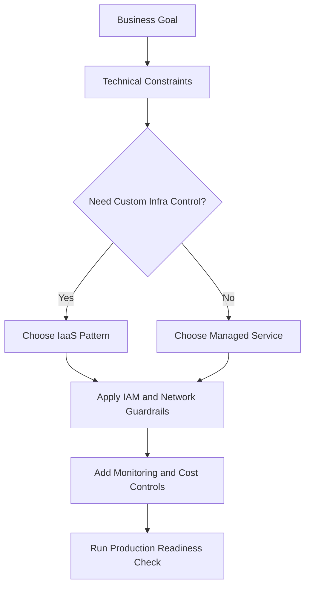
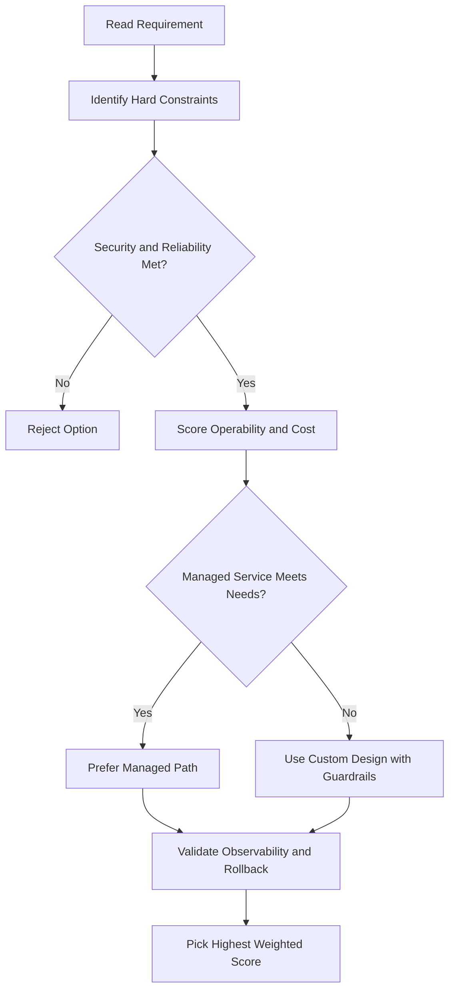
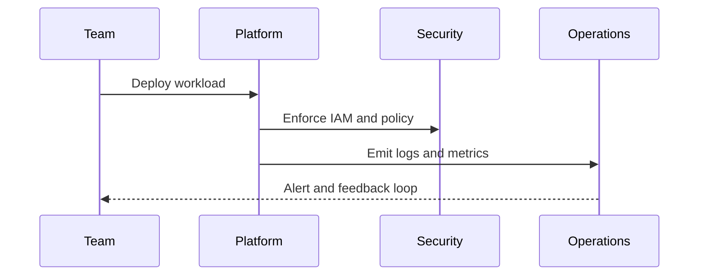

## ☁️ What is Cloud Computing?

**Definition (by NIST):** Cloud computing is just a smarter way to use tech — instead of owning hardware, you rent it over the internet.

---

### 5 Key Traits of Cloud Computing

1. **On-demand & self-service** — Need storage or computing power? Get it yourself through a website, no need to call anyone.

2. **Accessible from anywhere** — As long as you have internet, you can access your resources from any location.

3. **Shared resource pool** — The provider buys resources in bulk and shares them across many users → cheaper for everyone.

4. **Elastic (flexible)** — Need more? Scale up. Need less? Scale down. Fast.

5. **Pay only for what you use** — Stop using it, stop paying. No wasted money.

---

### How We Got Here — 3 Waves

| Wave                             | What it is                                 | Who manages it    |
| -------------------------------- | ------------------------------------------ | ----------------- |
| 1st — **Colocation**             | Rent space in someone else's data center   | You               |
| 2nd — **Virtualization**         | Virtual versions of servers/disks/etc.     | Still you         |
| 3rd — **Cloud (Google's model)** | Fully automated, containers, scales itself | The cloud does it |

---

### Google's Role

- Google found virtualization too slow for their pace → built a **container-based, fully automated** cloud.
- That's what **Google Cloud** is — the 3rd wave, available to everyone.

---

### The Big Idea

> Every company — no matter size or industry — will eventually compete through **technology → software → data**.
> That makes every company a **data company** in the future.

---

## 🧱 Cloud Service Models — IaaS, PaaS, Serverless & SaaS

### The 4 Models at a Glance

| Model          | What you get                        | You manage                    | Google Example                 |
| -------------- | ----------------------------------- | ----------------------------- | ------------------------------ |
| **IaaS**       | Raw compute, storage, network       | Everything on top of hardware | Compute Engine                 |
| **PaaS**       | Platform + runtime to run your code | Just your app logic           | App Engine                     |
| **Serverless** | Just write code, nothing else       | Nothing                       | Cloud Run, Cloud Run Functions |
| **SaaS**       | Ready-to-use application            | Nothing                       | Gmail, Google Docs, Drive      |

---

### IaaS — Infrastructure as a Service

- You get virtual machines, storage, and networking — basically a virtual data center.
- You still have to set up and manage the OS, runtime, etc.
- **Pay for what you allocate** (even if you don't use it all).
- Google example: **Compute Engine**

### PaaS — Platform as a Service

- You bring your code, the platform handles the infrastructure underneath.
- More focus on building features, less on managing servers.
- **Pay for what you actually use**.
- Google example: **App Engine**

### Serverless — No Infrastructure at All

- You just write code. No servers, no configs, no maintenance.
- Great for small, event-driven tasks or containerized apps.
- Google examples:
  - **Cloud Run** — run containerized apps, fully managed
  - **Cloud Run Functions** — run small pieces of code triggered by events, pay-as-you-go

### SaaS — Software as a Service

- A complete, ready-to-use app delivered over the internet.
- Nothing to install — you just open a browser and use it.
- Google examples: **Gmail, Google Docs, Google Drive** (all part of Google Workspace)

---

### The Shift Happening in the Industry

- Companies are moving toward **managed infrastructure & managed services**.
- Why? Less time spent on tech plumbing → more time on actual business goals.
- Result: faster, more reliable products for customers.

---

## 🌍 Google Cloud's Global Network & Infrastructure

### The Network

- Google Cloud runs on **Google's own private global network** — the largest of its kind.
- Built over many years with billions in investment.
- Designed for **highest throughput + lowest latency** for apps worldwide.
- Uses **100+ content caching nodes** globally — popular content is cached close to users so it loads faster.

---

### Where Google Cloud Lives — 7 Geographic Areas

North America · South America · Europe · Africa · Middle East · Asia · Australia

---

### Regions, Zones & Multi-Regions

| Level            | What it is                                  | Example                 |
| ---------------- | ------------------------------------------- | ----------------------- |
| **Region**       | An independent geographic area              | `europe-west2` (London) |
| **Zone**         | A deployment area inside a region           | `europe-west2-a`        |
| **Multi-Region** | Spans multiple regions for extra redundancy | Spanner, Cloud Storage  |

**Key points:**

- A region has **multiple zones** (e.g. London has 3 zones).
- Your resources (like VMs) run in a **specific zone** you choose.
- Spreading across **zones** = protects against zone failures.
- Spreading across **regions** = protects against regional disasters + brings apps closer to users.
- **Multi-region** = data replicated across zones in multiple regions → read from wherever is closest.

---

### Why This Matters

- **Availability** — if one zone/region goes down, others keep running.
- **Durability** — your data isn't lost even if hardware fails.
- **Latency** — serve users from the location nearest to them.

> Current regions & zones list: [cloud.google.com/about/locations](https://cloud.google.com/about/locations)

---

## 🌱 Google Cloud & Sustainability

### The Problem

- All those data centers worldwide use a lot of power — existing data centers consume roughly **2% of the world's electricity**.
- Google takes this seriously and works hard to run data centers as efficiently as possible.

### What Google Has Done

| Milestone                                        | Detail                                                                                                  |
| ------------------------------------------------ | ------------------------------------------------------------------------------------------------------- |
| **First** to achieve ISO 14001 certification     | A global standard for improving environmental performance — reducing waste, using resources efficiently |
| **First major company** to be carbon neutral     | Achieved in Google's founding decade                                                                    |
| **First company** to reach 100% renewable energy | Achieved in Google's second decade                                                                      |
| **Goal by 2030**                                 | First major company to operate completely carbon free                                                   |

### Cool Example — Hamina, Finland Data Center

- One of Google's most advanced and efficient data centers.
- Uses **sea water from the Bay of Finland** to cool servers — a first-of-its-kind cooling system that significantly cuts energy use.

### Why It Matters for You

- Running workloads on Google Cloud helps customers meet **their own environmental goals** too.
- You're not just saving money — you're also using greener infrastructure.

---

## 🔒 Google Cloud Security

### The Big Picture

- 9 Google services have **1 billion+ users each** — security is baked into everything.
- Security is built in **progressive layers**, from physical hardware all the way up to operations.

---

### The 6 Security Layers

#### 1. Hardware Infrastructure

| Feature                        | What it means                                                                                                        |
| ------------------------------ | -------------------------------------------------------------------------------------------------------------------- |
| **Custom hardware**            | Google designs its own server boards, networking gear, and security chips                                            |
| **Secure boot stack**          | Servers verify they're running the right software using cryptographic signatures on BIOS, bootloader, kernel, and OS |
| **Physical premises security** | Google builds its own data centers with multiple physical security layers — very few employees ever get access       |

#### 2. Service Deployment

- All communication between Google services uses **RPC (Remote Procedure Calls)**.
- This traffic is **automatically encrypted** between data centers.
- Google is rolling out hardware crypto accelerators to encrypt all RPC traffic inside data centers too.

#### 3. User Identity

- Google's login goes beyond just username + password.
- It **intelligently challenges** users based on risk signals (new device? unusual location?).
- Supports **U2F (Universal 2nd Factor)** — physical security keys for stronger login.

#### 4. Storage Services

- Most apps access storage indirectly through Google's storage services.
- Data is **encrypted at rest** using centrally managed keys.
- Hard drives and SSDs also have hardware-level encryption support.

#### 5. Internet Communication

- Services exposed to the internet go through **Google Front End (GFE)**.
  - GFE enforces TLS with proper certificates (X.509 from a CA) and perfect forward secrecy.
  - GFE also provides **DoS (Denial of Service) protection**.
- Google's massive infrastructure scale lets it simply absorb many DoS attacks.
- Multi-tier, multi-layer DoS protection adds further safety.

#### 6. Operational Security

| Feature                         | What it means                                                                                                                       |
| ------------------------------- | ----------------------------------------------------------------------------------------------------------------------------------- |
| **Intrusion detection**         | Rules + machine intelligence alert security teams of threats; Red Team exercises test defenses                                      |
| **Insider risk reduction**      | Admin access is strictly limited and actively monitored                                                                             |
| **Employee U2F**                | All Google employees must use U2F security keys — protects against phishing                                                         |
| **Secure software development** | Central source control, two-party code review, security-safe libraries, and a public **Vulnerability Rewards Program** (bug bounty) |

> Learn more: [cloud.google.com/security/security-design](https://cloud.google.com/security/security-design)

---

## 🔓 Open Source & Avoiding Vendor Lock-in

### The Fear

Many organizations worry: _"What if we move to Google Cloud and then can't leave?"_

### Google's Answer

- Google publishes key technologies as **open source** — so customers always have options.
- If you ever want to move away from Google, you can.

### Key Examples

| Technology                         | What it is                                           | Why it matters                                            |
| ---------------------------------- | ---------------------------------------------------- | --------------------------------------------------------- |
| **TensorFlow**                     | Open source machine learning library built by Google | You can use it anywhere, not just on Google Cloud         |
| **Kubernetes**                     | Open source container orchestration system           | Mix and match microservices across different clouds       |
| **Google Kubernetes Engine (GKE)** | Managed Kubernetes on Google Cloud                   | Workloads are portable — not locked to Google             |
| **Google Cloud Observability**     | Monitoring and logging tools                         | Can monitor workloads across **multiple cloud providers** |

### The Bottom Line

> Google provides **interoperability at multiple layers** of the stack — you're free to run workloads across clouds or leave entirely.

---

## 💰 Google Cloud Pricing & Cost Control

### Billing Highlights

| Service                            | Billing model                                        |
| ---------------------------------- | ---------------------------------------------------- |
| **Compute Engine**                 | Per-second billing (first major cloud to offer this) |
| **Google Kubernetes Engine (GKE)** | Per-second billing                                   |
| **Dataproc** (managed Hadoop)      | Per-second billing                                   |
| **App Engine flexible VMs**        | Per-second billing                                   |

### Automatic Discounts

- **Sustained-use discounts** — run a VM for more than **25% of the month** and Google automatically discounts every extra minute. No action needed.
- **Custom VM types** — pick exact vCPU + memory combos to avoid paying for resources you don't need.

> Estimate costs: [cloud.google.com/products/calculator](https://cloud.google.com/products/calculator)

---

### Keeping Costs Under Control

#### Budgets & Alerts

- Set a **budget** at the billing account level or project level.
- Budget can be a **fixed amount** or tied to a metric (e.g. % of last month's spend).
- Set **alerts** to get notified before you hit the limit.
  - Common thresholds: **50%, 90%, 100%** (customizable)
  - Example: $20,000 budget + 90% alert → notification fires at $18,000.

#### Reports

- Visual tool in Google Cloud Console to monitor spending by project or service.

---

### Quotas — Protection Against Runaway Costs

Quotas prevent over-consumption — whether from a bug or a malicious attack. Both types apply at the **project level**.

| Type                 | What it does                                            | Resets?                       | Example                                          |
| -------------------- | ------------------------------------------------------- | ----------------------------- | ------------------------------------------------ |
| **Rate quota**       | Limits how many API calls you can make in a time window | Yes — resets after the window | GKE: 3,000 API calls per 100 seconds per project |
| **Allocation quota** | Limits how many resources you can have                  | No — it's a cap               | Max 15 VPC networks per project                  |

- All projects start with the same default quotas.
- You can request an increase from **Google Cloud Support** if needed.

---

## gcloud Commands

```bash
# Authenticate and set up gcloud
gcloud auth login
gcloud config set project PROJECT_ID

# View current configuration
gcloud config list

# List all projects
gcloud projects list

# View project quota info
gcloud compute project-info describe --project=PROJECT_ID
```

## ACE Exam-Style Practice Questions

### Q1
In a Cloud Computing Overview scenario, two answers seem technically possible. What tie-breaker should you apply first?

A. Pick the option with most manual steps
B. Pick the option with least privilege and least operational overhead that still meets requirements
C. Pick highest-cost option
D. Pick the oldest product

Answer: B
Trap: ACE-style scenarios reward secure, managed, requirement-fit decisions.

### Q2
For Cloud Computing Overview, what is the best way to reduce wrong answers in multi-choice questions?

A. Ignore scaling and security words
B. Identify trigger words, eliminate over-privileged choices, then choose the managed fit
C. Always pick Compute Engine
D. Always pick the shortest option

Answer: B
Trap: Structured elimination is more reliable than memorization alone.

<!-- ACE_DEEP_ENRICHMENT_START -->
## ACE Deep Enrichment

### Think Like a Google Engineer
- Primary optimization axis: Managed-service-first design with reliability and security by default.
- Start with constraints first: SLO, security, compliance, latency, budget, and team operations capacity.
- Prefer managed services if they satisfy requirements with lower long-term operational toil.
- Minimize blast radius using environment isolation, least privilege, and failure-domain awareness.
- Design for day-2 operations: observability, rollback strategy, and quota or budget guardrails.

### Most Correct Option Filter (60 Seconds)
1. Eliminate options with broad access, single points of failure, or missing monitoring.
2. Confirm the option meets non-negotiables first: security and reliability requirements.
3. Compare remaining options on operational simplicity and long-term maintainability.
4. Use cost as an optimizer only after requirements and risk controls are satisfied.

### Weighted Decision Matrix
| Dimension | Weight | Strong Signal |
| --- | --- | --- |
| Security | 3 | Least privilege, secure defaults, no exposed blast radius |
| Reliability | 3 | Multi-zone or HA design, health checks, tested recovery path |
| Operability | 2 | Clear monitoring, alerting, rollout and rollback simplicity |
| Cost Efficiency | 2 | Right-sized resources, no waste, no reliability regression |
| Performance | 1 | Meets latency and throughput targets with headroom |

### Real-Life Scenario
A growing startup is moving from manual infrastructure to Google Cloud. They need fast delivery, better reliability, and clear operational controls while keeping architecture simple.

### Worked Example
- Translate business goals into technical constraints before selecting services.
- Favor managed services to reduce operational burden where possible.
- Apply least-privilege IAM and private-by-default networking decisions.
- Add monitoring, logging, and budget controls from the start.

### Flowchart


### Optimization Decision Flow


### Interaction Sequence


### Extra Exam Practice (15 Questions)
#### Q1

Scenario Focus: ☁️ What is Cloud Computing?

Which design pattern is usually best for fast, safe cloud adoption?

A. Use managed services with least-privilege IAM and clear observability controls.  
B. Start with manual scripts and unrestricted access, then harden later.  
C. Use one project for everything to reduce setup effort.  
D. Ignore telemetry until after first production incident.

Answer: A  
Why the other options are weaker: They typically ignore at least one hard constraint such as security, reliability, cost efficiency, or operational simplicity.  
Google-engineer check: Reconfirm SLO fit, blast radius, and day-2 maintainability before finalizing.

#### Q2

Scenario Focus: ☁️ What is Cloud Computing?

A team wants speed and low ops overhead. What should they prioritize?

A. Use one project for everything to reduce setup effort.  
B. Prefer services that reduce operational toil while meeting reliability goals.  
C. Ignore telemetry until after first production incident.  
D. Pick only the cheapest service regardless of reliability needs.

Answer: B  
Why the other options are weaker: They typically ignore at least one hard constraint such as security, reliability, cost efficiency, or operational simplicity.  
Google-engineer check: Reconfirm SLO fit, blast radius, and day-2 maintainability before finalizing.

#### Q3

Scenario Focus: ☁️ What is Cloud Computing?

What is a common architecture trap in early cloud projects?

A. Ignore telemetry until after first production incident.  
B. Pick only the cheapest service regardless of reliability needs.  
C. Over-broad access and missing monitoring are high-risk trap patterns.  
D. Keep architecture opaque to avoid governance overhead.

Answer: C  
Why the other options are weaker: They typically ignore at least one hard constraint such as security, reliability, cost efficiency, or operational simplicity.  
Google-engineer check: Reconfirm SLO fit, blast radius, and day-2 maintainability before finalizing.

#### Q4

Scenario Focus: ☁️ What is Cloud Computing?

Which control set should be baseline for production?

A. Pick only the cheapest service regardless of reliability needs.  
B. Keep architecture opaque to avoid governance overhead.  
C. Start with manual scripts and unrestricted access, then harden later.  
D. Baseline should include IAM guardrails, logging, monitoring, and cost alerts.

Answer: D  
Why the other options are weaker: They typically ignore at least one hard constraint such as security, reliability, cost efficiency, or operational simplicity.  
Google-engineer check: Reconfirm SLO fit, blast radius, and day-2 maintainability before finalizing.

#### Q5

Scenario Focus: ☁️ What is Cloud Computing?

How should you evaluate conflicting requirements on the exam?

A. Choose the option that balances security, reliability, cost, and operability.  
B. Keep architecture opaque to avoid governance overhead.  
C. Start with manual scripts and unrestricted access, then harden later.  
D. Use one project for everything to reduce setup effort.

Answer: A  
Why the other options are weaker: They typically ignore at least one hard constraint such as security, reliability, cost efficiency, or operational simplicity.  
Google-engineer check: Reconfirm SLO fit, blast radius, and day-2 maintainability before finalizing.

#### Q6

Scenario Focus: ☁️ What is Cloud Computing?

Two designs both satisfy the happy path for ☁️ What is Cloud Computing?. Which choice is most correct?

A. Start with manual scripts and unrestricted access, then harden later.  
B. Choose the option that preserves reliability and security while reducing operational burden.  
C. Use one project for everything to reduce setup effort.  
D. Ignore telemetry until after first production incident.

Answer: B  
Why the other options are weaker: They typically ignore at least one hard constraint such as security, reliability, cost efficiency, or operational simplicity.  
Google-engineer check: Reconfirm SLO fit, blast radius, and day-2 maintainability before finalizing.

#### Q7

Scenario Focus: ☁️ What is Cloud Computing?

What should you validate first before choosing an architecture for ☁️ What is Cloud Computing??

A. Use one project for everything to reduce setup effort.  
B. Ignore telemetry until after first production incident.  
C. Validate SLO fit, blast radius, and least-privilege controls before comparing convenience.  
D. Pick only the cheapest service regardless of reliability needs.

Answer: C  
Why the other options are weaker: They typically ignore at least one hard constraint such as security, reliability, cost efficiency, or operational simplicity.  
Google-engineer check: Reconfirm SLO fit, blast radius, and day-2 maintainability before finalizing.

#### Q8

Scenario Focus: ☁️ What is Cloud Computing?

A proposal lowers cost but increases failure risk. What is the best decision?

A. Ignore telemetry until after first production incident.  
B. Pick only the cheapest service regardless of reliability needs.  
C. Keep architecture opaque to avoid governance overhead.  
D. Reject it unless reliability and recovery objectives remain within required targets.

Answer: D  
Why the other options are weaker: They typically ignore at least one hard constraint such as security, reliability, cost efficiency, or operational simplicity.  
Google-engineer check: Reconfirm SLO fit, blast radius, and day-2 maintainability before finalizing.

#### Q9

Scenario Focus: ☁️ What is Cloud Computing?

Which option best reflects optimization for Managed-service-first design with reliability and security by default?

A. Select the design that best meets Managed-service-first design with reliability and security by default while keeping constraints balanced.  
B. Pick only the cheapest service regardless of reliability needs.  
C. Keep architecture opaque to avoid governance overhead.  
D. Start with manual scripts and unrestricted access, then harden later.

Answer: A  
Why the other options are weaker: They typically ignore at least one hard constraint such as security, reliability, cost efficiency, or operational simplicity.  
Google-engineer check: Reconfirm SLO fit, blast radius, and day-2 maintainability before finalizing.

#### Q10

Scenario Focus: ☁️ What is Cloud Computing?

How should you evaluate a design that needs frequent manual interventions?

A. Keep architecture opaque to avoid governance overhead.  
B. Treat it as high risk and prefer automation-friendly designs with observability and rollback.  
C. Start with manual scripts and unrestricted access, then harden later.  
D. Use one project for everything to reduce setup effort.

Answer: B  
Why the other options are weaker: They typically ignore at least one hard constraint such as security, reliability, cost efficiency, or operational simplicity.  
Google-engineer check: Reconfirm SLO fit, blast radius, and day-2 maintainability before finalizing.

#### Q11

Scenario Focus: ☁️ What is Cloud Computing?

Two options have similar latency. Which tie-breaker is best?

A. Start with manual scripts and unrestricted access, then harden later.  
B. Use one project for everything to reduce setup effort.  
C. Pick the option with stronger operability, clearer failure isolation, and simpler incident response.  
D. Ignore telemetry until after first production incident.

Answer: C  
Why the other options are weaker: They typically ignore at least one hard constraint such as security, reliability, cost efficiency, or operational simplicity.  
Google-engineer check: Reconfirm SLO fit, blast radius, and day-2 maintainability before finalizing.

#### Q12

Scenario Focus: ☁️ What is Cloud Computing?

What is the best way to choose between a custom stack and a managed service?

A. Use one project for everything to reduce setup effort.  
B. Ignore telemetry until after first production incident.  
C. Pick only the cheapest service regardless of reliability needs.  
D. Prefer managed services when they meet requirements with lower long-term maintenance effort.

Answer: D  
Why the other options are weaker: They typically ignore at least one hard constraint such as security, reliability, cost efficiency, or operational simplicity.  
Google-engineer check: Reconfirm SLO fit, blast radius, and day-2 maintainability before finalizing.

#### Q13

Scenario Focus: ☁️ What is Cloud Computing?

How do you confirm a solution is production-ready for 

A. Verify monitoring, alerting, rollback path, quota and budget controls, and secure defaults.  
B. Ignore telemetry until after first production incident.  
C. Pick only the cheapest service regardless of reliability needs.  
D. Keep architecture opaque to avoid governance overhead.

Answer: A  
Why the other options are weaker: They typically ignore at least one hard constraint such as security, reliability, cost efficiency, or operational simplicity.  
Google-engineer check: Reconfirm SLO fit, blast radius, and day-2 maintainability before finalizing.

#### Q14

Scenario Focus: ☁️ What is Cloud Computing?

Which pattern usually wins in ACE scenario tie-breakers?

A. Pick only the cheapest service regardless of reliability needs.  
B. Managed-service-first plus least-privilege access plus clear observability usually wins.  
C. Keep architecture opaque to avoid governance overhead.  
D. Start with manual scripts and unrestricted access, then harden later.

Answer: B  
Why the other options are weaker: They typically ignore at least one hard constraint such as security, reliability, cost efficiency, or operational simplicity.  
Google-engineer check: Reconfirm SLO fit, blast radius, and day-2 maintainability before finalizing.

#### Q15

Scenario Focus: ☁️ What is Cloud Computing?

What is the best final check before locking the answer?

A. Keep architecture opaque to avoid governance overhead.  
B. Start with manual scripts and unrestricted access, then harden later.  
C. Run a weighted check across security, reliability, cost, performance, and operability.  
D. Use one project for everything to reduce setup effort.

Answer: C  
Why the other options are weaker: They typically ignore at least one hard constraint such as security, reliability, cost efficiency, or operational simplicity.  
Google-engineer check: Reconfirm SLO fit, blast radius, and day-2 maintainability before finalizing.

### Quick Commands
```bash
gcloud config list
gcloud projects describe PROJECT_ID
gcloud services list --enabled --project=PROJECT_ID
gcloud logging read "severity>=WARNING" --project=PROJECT_ID --freshness=2d --limit=20
```

### Fast Recall
- Good cloud design is constraint-driven, not tool-driven.
- Managed services usually improve delivery speed and reliability.
- Security and observability should be built in from day one.
<!-- ACE_DEEP_ENRICHMENT_END -->