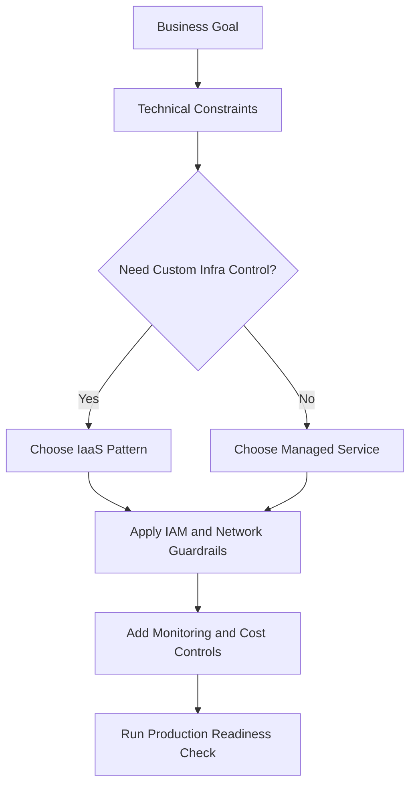
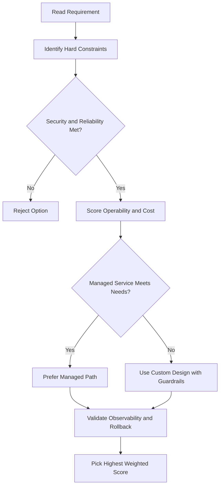
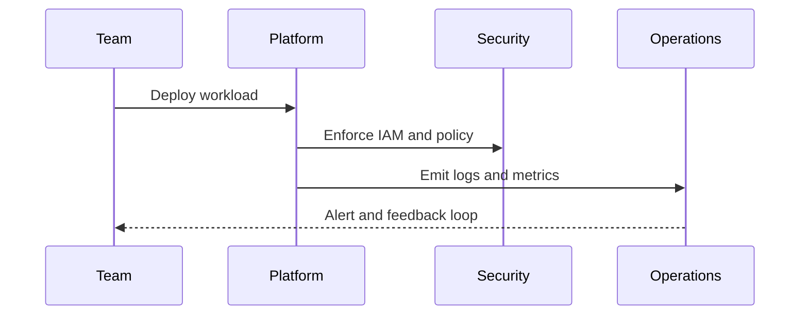

# 🏗️ Google Cloud Resource Hierarchy

## The 4 Levels (Bottom → Top)

```
Organization Node
    └── Folders (& sub-folders)
            └── Projects
                    └── Resources (VMs, buckets, BigQuery tables, etc.)
```

| Level                 | What it is                                                            |
| --------------------- | --------------------------------------------------------------------- |
| **Resources**         | The actual things — VMs, Cloud Storage buckets, BigQuery tables, etc. |
| **Projects**          | Groups of resources; the basic unit for billing, APIs, and access     |
| **Folders**           | Groups of projects (can be nested); used to mirror org structure      |
| **Organization Node** | The top — encompasses everything in your company                      |

---

## Why This Matters — Policies & Inheritance

- Policies can be set at **project, folder, or organization node** level.
- Some services also allow policies on individual resources.
- **Policies inherit downward** — a policy on a folder automatically applies to all projects inside it.

---

## Projects — The Core Unit

Every resource belongs to **exactly one project**. Projects are what you use to:

- Enable Google Cloud services & APIs
- Set up billing
- Add/remove team members

### 3 Identifying Attributes of a Project

| Attribute          | Set by                      | Changeable?  | Unique?            |
| ------------------ | --------------------------- | ------------ | ------------------ |
| **Project ID**     | Google (you can suggest it) | ❌ Immutable | ✅ Globally unique |
| **Project Name**   | You                         | ✅ Yes       | ❌ Not required    |
| **Project Number** | Google                      | ❌ Immutable | ✅ Globally unique |

- **Project ID** = what you use to tell Google Cloud which project to work with.
- **Project Number** = used internally by Google; you won't need it much.

### Resource Manager Tool

- An API to manage projects programmatically.
- Can: list, create, update, delete, and even **recover deleted projects**.
- Accessible via RPC API and REST API.

---

## Folders — Organizing at Scale

- Group projects by department, team, or environment (e.g. dev/staging/prod).
- Policies set on a folder apply to **all projects and resources inside it** — no need to duplicate.
- Teams can be given **delegated admin rights** within their own folder.
- Folders can contain other folders (nested).
- **Requires an organization node** to use folders.

> Example: Two projects managed by the same team → put them in one folder → set permissions once, not twice.

---

## Organization Node — The Top of the Tree

- Everything in your Google Cloud account sits under this node.
- **Special roles at this level:**
  - **Organization Policy Administrator** — only these people can change org-wide policies.
  - **Project Creator** — controls who can spin up new projects (and spend money).

### How to Get an Organization Node

| If you have...              | Then...                                                                    |
| --------------------------- | -------------------------------------------------------------------------- |
| **Google Workspace** domain | Projects automatically belong to your org node                             |
| No Workspace                | Use **Cloud Identity** (Google's identity & access platform) to create one |

Once created, anyone in the domain can create projects and billing accounts as usual — but now it's all organized under the org node.

---

## 🔑 Identity and Access Management (IAM)

### What is IAM?

A way for admins to control **who can do what on which resources** in Google Cloud.

> IAM = **Who** (principal) + **Can do what** (role) + **On which resource**

---

### The "Who" — Principals

A principal is anyone or anything that can be granted access. Each has an email-based identifier.

| Type                  | Example                       |
| --------------------- | ----------------------------- |
| Google Account        | individual user               |
| Google Group          | team or department            |
| Service Account       | an app or VM acting as a user |
| Cloud Identity domain | your whole company            |

---

### The "Can Do What" — Roles

A **role** is a bundle of permissions. You grant roles to principals — not individual permissions.

> Example: Managing VMs requires create, delete, start, stop, change permissions → bundled into one role.

#### 1. Basic Roles — Broad, project-wide

Applied to a whole project and affect **all resources** in it. Use with caution for sensitive projects.

| Role                      | What they can do                                          |
| ------------------------- | --------------------------------------------------------- |
| **Viewer**                | Read-only access                                          |
| **Editor**                | View + make changes                                       |
| **Owner**                 | View + change + manage roles/permissions + set up billing |
| **Billing Administrator** | Manage billing only — no access to resources              |

> ⚠️ Basic roles are too broad for sensitive data projects. Use predefined or custom roles instead.

#### 2. Predefined Roles — Specific to a service

Each Google Cloud service offers its own set of predefined roles with precise permissions.

- Applied at project, folder, or organization level.
- Example: Compute Engine's **`instanceAdmin`** role → lets you fully manage VM instances.
- Much safer and more precise than basic roles.

#### 3. Custom Roles — You define exactly what's allowed

Use when predefined roles are still too broad. Follow the **least-privilege model** — give people only what they need.

- Example: Create an **`instanceOperator`** role that can start/stop VMs but NOT reconfigure them.
- **Important limitations:**
  - You have to manage the permissions yourself.
  - Can only be applied at **project** or **organization** level — ❌ not at folder level.

---

### Policies & Inheritance

- A policy = a principal + a role, applied to a resource.
- Policies **inherit downward** — apply a role at the folder level → it applies to all projects inside.
- **Deny rules** always take priority over allow rules — checked first, regardless of what roles are granted.
- Deny policies also inherit downward through the hierarchy.

---

### Quick Recap

```
Basic Roles      → broad, whole project, 4 types (viewer/editor/owner/billing admin)
Predefined Roles → service-specific, precise, recommended for most cases
Custom Roles     → you define them, least-privilege, project/org level only
```

---

## 🤖 Service Accounts

### What is a Service Account?

A special account for **programs/apps/VMs** — not humans. Lets a VM or app interact with other Google Cloud services automatically, without anyone manually granting access each time.

> Think of it as: giving a virtual machine its own identity and permissions.

### How it Works

- Named like an email address (e.g. `my-vm@my-project.iam.gserviceaccount.com`)
- Uses **cryptographic keys** instead of passwords to authenticate.
- You assign IAM roles to the service account, just like you would to a person.

### Example

- VM needs to store data in Cloud Storage (but no one else on the internet should access it).
- Create a service account → grant it access to Cloud Storage → attach it to the VM.
- Now the VM can read/write to Cloud Storage automatically and securely.

### Service Accounts are Also Resources

A service account is both an **identity** (like a user) AND a **resource** (like a VM).
This means you can attach IAM policies to the service account itself to control who can manage it.

| Person | Role on the Service Account                                        |
| ------ | ------------------------------------------------------------------ |
| Alice  | Editor — can manage which accounts can act as this service account |
| Bob    | Viewer — can only see the service account exists                   |

---

## 🪪 Cloud Identity

### The Problem with Using Gmail Accounts

Many teams start by logging into Google Cloud with personal Gmail accounts and sharing access via Google Groups. This works initially but causes problems:

- No central management of who has access.
- If someone leaves the company, there's **no easy way to revoke their access** immediately.

### What Cloud Identity Does

Cloud Identity lets organizations **centrally manage users and groups** via the **Google Admin Console**.

- Admins can use the **same usernames and passwords** from existing **Active Directory or LDAP** systems — no need to create separate Google accounts.
- When someone leaves, an admin can instantly **disable their account and remove them from all groups** from one place.

### Editions

| Edition     | What's included                                   |
| ----------- | ------------------------------------------------- |
| **Free**    | User & group management, SSO, policy controls     |
| **Premium** | Everything in Free + **mobile device management** |

### Already a Google Workspace customer?

This is all already built into the **Google Admin Console** for you — no extra setup needed.

---

## gcloud Commands

```bash
# List all projects
gcloud projects list

# Create a project
gcloud projects create PROJECT_ID --name="My Project"

# Delete a project
gcloud projects delete PROJECT_ID

# List folders under an org
gcloud resource-manager folders list --organization=ORG_ID

# Describe a folder
gcloud resource-manager folders describe FOLDER_ID
```

## ACE Exam-Style Practice Questions

### Q1
In a Resource Hierarchy requirement, resources must be restricted to approved regions only. What should you use?

A. Budget alerts
B. Organization Policy for resource location restrictions
C. Cloud Scheduler
D. Labels only

Answer: B
Trap: IAM controls who can act; Org Policy controls what can be created under governance constraints.

### Q2
A new team needs isolated IAM, APIs, quotas, and billing in a Resource Hierarchy setup. What is best first step?

A. Create new project for the team
B. Add team as Editor to existing project
C. Create only a folder
D. Use one service account for all teams

Answer: A
Trap: Project is the operational boundary for billing, IAM bindings, API enablement, and quotas.

<!-- ACE_DEEP_ENRICHMENT_START -->
## ACE Deep Enrichment

### Think Like a Google Engineer
- Primary optimization axis: Managed-service-first design with reliability and security by default.
- Start with constraints first: SLO, security, compliance, latency, budget, and team operations capacity.
- Prefer managed services if they satisfy requirements with lower long-term operational toil.
- Minimize blast radius using environment isolation, least privilege, and failure-domain awareness.
- Design for day-2 operations: observability, rollback strategy, and quota or budget guardrails.

### Most Correct Option Filter (60 Seconds)
1. Eliminate options with broad access, single points of failure, or missing monitoring.
2. Confirm the option meets non-negotiables first: security and reliability requirements.
3. Compare remaining options on operational simplicity and long-term maintainability.
4. Use cost as an optimizer only after requirements and risk controls are satisfied.

### Weighted Decision Matrix
| Dimension | Weight | Strong Signal |
| --- | --- | --- |
| Security | 3 | Least privilege, secure defaults, no exposed blast radius |
| Reliability | 3 | Multi-zone or HA design, health checks, tested recovery path |
| Operability | 2 | Clear monitoring, alerting, rollout and rollback simplicity |
| Cost Efficiency | 2 | Right-sized resources, no waste, no reliability regression |
| Performance | 1 | Meets latency and throughput targets with headroom |

### Real-Life Scenario
A growing startup is moving from manual infrastructure to Google Cloud. They need fast delivery, better reliability, and clear operational controls while keeping architecture simple.

### Worked Example
- Translate business goals into technical constraints before selecting services.
- Favor managed services to reduce operational burden where possible.
- Apply least-privilege IAM and private-by-default networking decisions.
- Add monitoring, logging, and budget controls from the start.

### Flowchart


### Optimization Decision Flow


### Interaction Sequence


### Extra Exam Practice (10 Questions)
#### Q1
Scenario Focus: 🏗️ Google Cloud Resource Hierarchy
Which design pattern is usually best for fast, safe cloud adoption?

A. Use managed services with least-privilege IAM and clear observability controls.
B. Start with manual scripts and unrestricted access, then harden later.
C. Use one project for everything to reduce setup effort.
D. Ignore telemetry until after first production incident.

Answer: A
Why the other options are weaker: They typically ignore at least one hard constraint such as security, reliability, cost efficiency, or operational simplicity.
Google-engineer check: Reconfirm SLO fit, blast radius, and day-2 maintainability before finalizing.

#### Q2
Scenario Focus: 🏗️ Google Cloud Resource Hierarchy
A team wants speed and low ops overhead. What should they prioritize?

A. Use one project for everything to reduce setup effort.
B. Prefer services that reduce operational toil while meeting reliability goals.
C. Ignore telemetry until after first production incident.
D. Pick only the cheapest service regardless of reliability needs.

Answer: B
Why the other options are weaker: They typically ignore at least one hard constraint such as security, reliability, cost efficiency, or operational simplicity.
Google-engineer check: Reconfirm SLO fit, blast radius, and day-2 maintainability before finalizing.

#### Q3
Scenario Focus: 🏗️ Google Cloud Resource Hierarchy
What is a common architecture trap in early cloud projects?

A. Ignore telemetry until after first production incident.
B. Pick only the cheapest service regardless of reliability needs.
C. Over-broad access and missing monitoring are high-risk trap patterns.
D. Keep architecture opaque to avoid governance overhead.

Answer: C
Why the other options are weaker: They typically ignore at least one hard constraint such as security, reliability, cost efficiency, or operational simplicity.
Google-engineer check: Reconfirm SLO fit, blast radius, and day-2 maintainability before finalizing.

#### Q4
Scenario Focus: 🏗️ Google Cloud Resource Hierarchy
Which control set should be baseline for production?

A. Pick only the cheapest service regardless of reliability needs.
B. Keep architecture opaque to avoid governance overhead.
C. Start with manual scripts and unrestricted access, then harden later.
D. Baseline should include IAM guardrails, logging, monitoring, and cost alerts.

Answer: D
Why the other options are weaker: They typically ignore at least one hard constraint such as security, reliability, cost efficiency, or operational simplicity.
Google-engineer check: Reconfirm SLO fit, blast radius, and day-2 maintainability before finalizing.

#### Q5
Scenario Focus: 🏗️ Google Cloud Resource Hierarchy
How should you evaluate conflicting requirements on the exam?

A. Choose the option that balances security, reliability, cost, and operability.
B. Keep architecture opaque to avoid governance overhead.
C. Start with manual scripts and unrestricted access, then harden later.
D. Use one project for everything to reduce setup effort.

Answer: A
Why the other options are weaker: They typically ignore at least one hard constraint such as security, reliability, cost efficiency, or operational simplicity.
Google-engineer check: Reconfirm SLO fit, blast radius, and day-2 maintainability before finalizing.

#### Q6
Scenario Focus: 🏗️ Google Cloud Resource Hierarchy
Two designs both satisfy the happy path for 🏗️ Google Cloud Resource Hierarchy. Which choice is most correct?

A. Start with manual scripts and unrestricted access, then harden later.
B. Choose the option that preserves reliability and security while reducing operational burden.
C. Use one project for everything to reduce setup effort.
D. Ignore telemetry until after first production incident.

Answer: B
Why the other options are weaker: They typically ignore at least one hard constraint such as security, reliability, cost efficiency, or operational simplicity.
Google-engineer check: Reconfirm SLO fit, blast radius, and day-2 maintainability before finalizing.

#### Q7
Scenario Focus: 🏗️ Google Cloud Resource Hierarchy
What should you validate first before choosing an architecture for 🏗️ Google Cloud Resource Hierarchy?

A. Use one project for everything to reduce setup effort.
B. Ignore telemetry until after first production incident.
C. Validate SLO fit, blast radius, and least-privilege controls before comparing convenience.
D. Pick only the cheapest service regardless of reliability needs.

Answer: C
Why the other options are weaker: They typically ignore at least one hard constraint such as security, reliability, cost efficiency, or operational simplicity.
Google-engineer check: Reconfirm SLO fit, blast radius, and day-2 maintainability before finalizing.

#### Q8
Scenario Focus: 🏗️ Google Cloud Resource Hierarchy
A proposal lowers cost but increases failure risk. What is the best decision?

A. Ignore telemetry until after first production incident.
B. Pick only the cheapest service regardless of reliability needs.
C. Keep architecture opaque to avoid governance overhead.
D. Reject it unless reliability and recovery objectives remain within required targets.

Answer: D
Why the other options are weaker: They typically ignore at least one hard constraint such as security, reliability, cost efficiency, or operational simplicity.
Google-engineer check: Reconfirm SLO fit, blast radius, and day-2 maintainability before finalizing.

#### Q9
Scenario Focus: 🏗️ Google Cloud Resource Hierarchy
Which option best reflects optimization for Managed-service-first design with reliability and security by default?

A. Select the design that best meets Managed-service-first design with reliability and security by default while keeping constraints balanced.
B. Pick only the cheapest service regardless of reliability needs.
C. Keep architecture opaque to avoid governance overhead.
D. Start with manual scripts and unrestricted access, then harden later.

Answer: A
Why the other options are weaker: They typically ignore at least one hard constraint such as security, reliability, cost efficiency, or operational simplicity.
Google-engineer check: Reconfirm SLO fit, blast radius, and day-2 maintainability before finalizing.

#### Q10
Scenario Focus: 🏗️ Google Cloud Resource Hierarchy
How should you evaluate a design that needs frequent manual interventions?

A. Keep architecture opaque to avoid governance overhead.
B. Treat it as high risk and prefer automation-friendly designs with observability and rollback.
C. Start with manual scripts and unrestricted access, then harden later.
D. Use one project for everything to reduce setup effort.

Answer: B
Why the other options are weaker: They typically ignore at least one hard constraint such as security, reliability, cost efficiency, or operational simplicity.
Google-engineer check: Reconfirm SLO fit, blast radius, and day-2 maintainability before finalizing.

### Quick Commands
```bash
gcloud config list
gcloud projects describe PROJECT_ID
gcloud services list --enabled --project=PROJECT_ID
gcloud logging read "severity>=WARNING" --project=PROJECT_ID --freshness=2d --limit=20
```

### Fast Recall
- Good cloud design is constraint-driven, not tool-driven.
- Managed services usually improve delivery speed and reliability.
- Security and observability should be built in from day one.
<!-- ACE_DEEP_ENRICHMENT_END -->