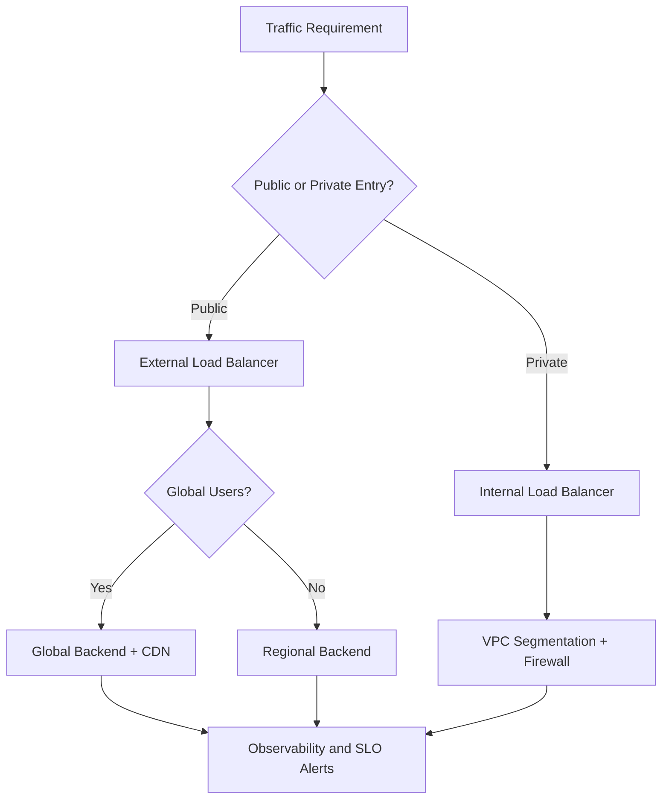
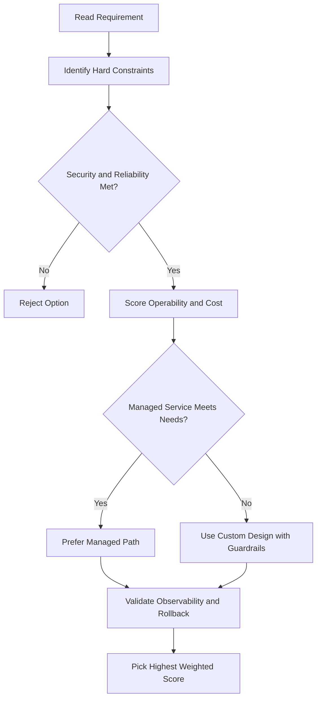
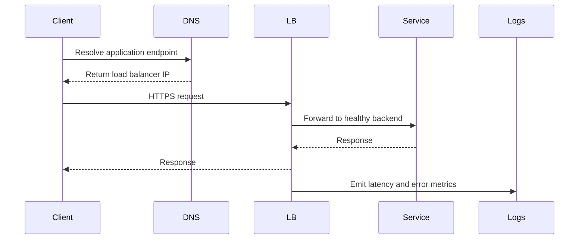

# 🌐 Virtual Private Cloud (VPC) Networking

## What is a VPC?

A **Virtual Private Cloud (VPC)** is a secure, private cloud environment hosted inside a public cloud (like Google Cloud).

- You can run code, store data, host websites — anything you'd do in a private cloud.
- But it's hosted and managed by the public cloud provider.
- Best of both worlds: **public cloud scalability + private cloud data isolation**.

---

## What VPC Networks Do

VPC networks connect Google Cloud resources to each other and to the internet. Key capabilities:

- **Segment networks** — divide your network into logical pieces
- **Firewall rules** — restrict access to specific instances
- **Static routes** — forward traffic to specific destinations

---

## Key Feature: VPCs Are Global

> Most people expect networks to be regional — but Google VPCs are **global**.

| Concept    | What it means                                                              |
| ---------- | -------------------------------------------------------------------------- |
| **VPC**    | Global — one VPC can span the entire world                                 |
| **Subnet** | Regional — a segmented piece of the VPC, tied to a specific Google region  |
| **Zone**   | Sub-division of a region — subnets can span multiple zones within a region |

---

## Subnets

- A **subnet** is a segmented piece of the larger VPC network.
- Subnets are **regional** — you place them in a specific region (e.g. `us-east1`, `asia-east1`).
- A subnet can **span multiple zones** within that region.
- Resources in **different zones** can sit on the **same subnet**.
- You can **expand a subnet** by increasing its IP address range — existing VMs are not affected.

---

## Example

> VPC named `vpc1` with two subnets: one in `asia-east1`, one in `us-east1`.
> Three Compute Engine VMs are attached to the same subnet.
> Even though the VMs are in different zones, they're neighbors on the same subnet.

This design makes it easy to build layouts that are:

- **Resilient** — spread across zones, so one zone failing doesn't take everything down
- **Simple** — still one clean network layout, no complex cross-network routing needed

---

## gcloud Commands

```bash
# List all VPC networks
gcloud compute networks list

# Create a VPC network (custom mode)
gcloud compute networks create my-vpc --subnet-mode=custom

# List subnets
gcloud compute networks subnets list

# Create a subnet
gcloud compute networks subnets create my-subnet \
  --network=my-vpc --region=us-central1 --range=10.0.0.0/24

# Delete a network
gcloud compute networks delete my-vpc
```

---

## Private Google Access

Allows VM instances **without external IP addresses** to reach Google APIs and services (Cloud Storage, BigQuery, etc.) through Google's private network:

- Enabled per subnet: `--enable-private-ip-google-access`
- Without it, VMs with only internal IPs cannot call Google APIs
- Traffic never leaves Google's network

```bash
gcloud compute networks subnets update my-subnet \
  --region=us-central1 --enable-private-ip-google-access
```

---

## VPC Flow Logs

Captures **network flow metadata** (5-tuple: src IP, dst IP, src port, dst port, protocol) for traffic in/out of VMs:

- Enabled per subnet
- Logs sent to Cloud Logging — can be exported to BigQuery or Pub/Sub
- Use cases: network monitoring, security forensics, cost optimisation
- Sampling rate configurable (default 50%) to manage cost

```bash
gcloud compute networks subnets update my-subnet \
  --region=us-central1 --enable-flow-logs
```

---

## Shared VPC

Allows resources in **multiple projects** to use a single VPC network:

| Concept              | Description                                                       |
| -------------------- | ----------------------------------------------------------------- |
| **Host project**     | Owns the shared VPC network                                       |
| **Service projects** | Use the shared network; cannot modify it                          |
| **Shared VPC Admin** | IAM role required to configure sharing (`roles/compute.xpnAdmin`) |

- Centralises network management and firewall rules
- Service project VMs communicate as if on the same network
- Billing stays per project

```bash
# Enable host project
gcloud compute shared-vpc enable HOST_PROJECT_ID

# Associate a service project
gcloud compute shared-vpc associated-projects add SERVICE_PROJECT_ID \
  --host-project=HOST_PROJECT_ID
```

---

## VPC Peering

Connects two VPC networks (same or different projects/organisations) so they can communicate privately:

- Traffic stays on Google's network — no external IPs needed
- **Not transitive** — if A peers with B and B peers with C, A cannot reach C
- Each side must create a peering connection independently
- Subnet CIDR ranges must not overlap

```bash
gcloud compute networks peerings create peer-a-to-b \
  --network=network-a \
  --peer-project=PROJECT_B \
  --peer-network=network-b
```

**Shared VPC vs VPC Peering:**

|                    | Shared VPC                       | VPC Peering                           |
| ------------------ | -------------------------------- | ------------------------------------- |
| Admin model        | Centralised (host project)       | Decentralised (each side manages own) |
| Cross-org          | No                               | Yes                                   |
| Transitive routing | N/A                              | No                                    |
| Use case           | Internal multi-project workloads | Partner/separate org connectivity     |

---

## VPC Service Controls

Creates a **security perimeter** around Google API services to prevent data exfiltration:

- Define which projects/services are inside the perimeter
- Requests crossing the perimeter boundary are denied by default
- Protects against: compromised credentials, insider threats, misconfigured buckets
- Works with Cloud Storage, BigQuery, Spanner, and many other APIs

---

## Secondary IP Ranges

Subnets can have **secondary IP ranges** — used by GKE for Pod and Service IPs:

```bash
gcloud compute networks subnets update my-subnet \
  --region=us-central1 \
  --add-secondary-ranges=pod-range=10.1.0.0/16,svc-range=10.2.0.0/20
```

- Primary range: VM primary interface IPs
- Secondary ranges: alias IPs for containers (GKE Pods) or additional interfaces

## ACE Exam-Style Practice Questions

### Q1
In a Virtual Private Cloud scenario, two answers seem technically possible. What tie-breaker should you apply first?

A. Pick the option with most manual steps
B. Pick the option with least privilege and least operational overhead that still meets requirements
C. Pick highest-cost option
D. Pick the oldest product

Answer: B
Trap: ACE-style scenarios reward secure, managed, requirement-fit decisions.

### Q2
For Virtual Private Cloud, what is the best way to reduce wrong answers in multi-choice questions?

A. Ignore scaling and security words
B. Identify trigger words, eliminate over-privileged choices, then choose the managed fit
C. Always pick Compute Engine
D. Always pick the shortest option

Answer: B
Trap: Structured elimination is more reliable than memorization alone.

<!-- ACE_DEEP_ENRICHMENT_START -->
## ACE Deep Enrichment

### Think Like a Google Engineer
- Primary optimization axis: Latency-resilience balance with private-by-default connectivity.
- Start with constraints first: SLO, security, compliance, latency, budget, and team operations capacity.
- Prefer managed services if they satisfy requirements with lower long-term operational toil.
- Minimize blast radius using environment isolation, least privilege, and failure-domain awareness.
- Design for day-2 operations: observability, rollback strategy, and quota or budget guardrails.

### Most Correct Option Filter (60 Seconds)
1. Eliminate options with broad access, single points of failure, or missing monitoring.
2. Confirm the option meets non-negotiables first: security and reliability requirements.
3. Compare remaining options on operational simplicity and long-term maintainability.
4. Use cost as an optimizer only after requirements and risk controls are satisfied.

### Weighted Decision Matrix
| Dimension | Weight | Strong Signal |
| --- | --- | --- |
| Security | 3 | Least privilege, secure defaults, no exposed blast radius |
| Reliability | 3 | Multi-zone or HA design, health checks, tested recovery path |
| Operability | 2 | Clear monitoring, alerting, rollout and rollback simplicity |
| Cost Efficiency | 2 | Right-sized resources, no waste, no reliability regression |
| Performance | 1 | Meets latency and throughput targets with headroom |

### Real-Life Scenario
An ecommerce platform serves customers across regions. The team must keep latency low, protect internal services, and survive zonal failures while controlling egress costs.

### Worked Example
- Place internet-facing services behind the correct external load balancer type.
- Keep internal services private with internal load balancers and private IP ranges.
- Use firewall rules by tags or service accounts, not wide open CIDR ranges.
- Add Cloud CDN or regional placement based on traffic profile and content type.

### Flowchart


### Optimization Decision Flow


### Interaction Sequence


### Extra Exam Practice (15 Questions)
#### Q1
Scenario Focus: 🌐 Virtual Private Cloud (VPC) Networking
A service must be reachable only from internal VMs. Which design is best?

A. Use an internal load balancer with private backend endpoints and private DNS.
B. Expose the service publicly and rely on app-level passwords.
C. Use one VM with a static external IP to simplify architecture.
D. Allow 0.0.0.0/0 ingress to speed up troubleshooting.

Answer: A
Why the other options are weaker: They typically ignore at least one hard constraint such as security, reliability, cost efficiency, or operational simplicity.
Google-engineer check: Reconfirm SLO fit, blast radius, and day-2 maintainability before finalizing.

#### Q2
Scenario Focus: 🌐 Virtual Private Cloud (VPC) Networking
You need to reduce global web latency for static assets. What should you choose?

A. Use one VM with a static external IP to simplify architecture.
B. Use an external application load balancer with Cloud CDN and cacheable content rules.
C. Allow 0.0.0.0/0 ingress to speed up troubleshooting.
D. Disable health checks to avoid accidental failover.

Answer: B
Why the other options are weaker: They typically ignore at least one hard constraint such as security, reliability, cost efficiency, or operational simplicity.
Google-engineer check: Reconfirm SLO fit, blast radius, and day-2 maintainability before finalizing.

#### Q3
Scenario Focus: 🌐 Virtual Private Cloud (VPC) Networking
Which firewall strategy best matches zero-trust network design?

A. Allow 0.0.0.0/0 ingress to speed up troubleshooting.
B. Disable health checks to avoid accidental failover.
C. Use least-privilege firewall policies scoped by service accounts or tags.
D. Route all traffic through manual bastion hops in production.

Answer: C
Why the other options are weaker: They typically ignore at least one hard constraint such as security, reliability, cost efficiency, or operational simplicity.
Google-engineer check: Reconfirm SLO fit, blast radius, and day-2 maintainability before finalizing.

#### Q4
Scenario Focus: 🌐 Virtual Private Cloud (VPC) Networking
A backend fails health checks in one zone. What architecture is best practice?

A. Disable health checks to avoid accidental failover.
B. Route all traffic through manual bastion hops in production.
C. Expose the service publicly and rely on app-level passwords.
D. Run multi-zone backends with health checks and automatic failover.

Answer: D
Why the other options are weaker: They typically ignore at least one hard constraint such as security, reliability, cost efficiency, or operational simplicity.
Google-engineer check: Reconfirm SLO fit, blast radius, and day-2 maintainability before finalizing.

#### Q5
Scenario Focus: 🌐 Virtual Private Cloud (VPC) Networking
You need private hybrid connectivity between on-prem and GCP. Which path is preferred?

A. Use HA VPN or Interconnect based on throughput and SLA requirements.
B. Route all traffic through manual bastion hops in production.
C. Expose the service publicly and rely on app-level passwords.
D. Use one VM with a static external IP to simplify architecture.

Answer: A
Why the other options are weaker: They typically ignore at least one hard constraint such as security, reliability, cost efficiency, or operational simplicity.
Google-engineer check: Reconfirm SLO fit, blast radius, and day-2 maintainability before finalizing.

#### Q6
Scenario Focus: 🌐 Virtual Private Cloud (VPC) Networking
Two designs both satisfy the happy path for 🌐 Virtual Private Cloud (VPC) Networking. Which choice is most correct?

A. Expose the service publicly and rely on app-level passwords.
B. Choose the option that preserves reliability and security while reducing operational burden.
C. Use one VM with a static external IP to simplify architecture.
D. Allow 0.0.0.0/0 ingress to speed up troubleshooting.

Answer: B
Why the other options are weaker: They typically ignore at least one hard constraint such as security, reliability, cost efficiency, or operational simplicity.
Google-engineer check: Reconfirm SLO fit, blast radius, and day-2 maintainability before finalizing.

#### Q7
Scenario Focus: 🌐 Virtual Private Cloud (VPC) Networking
What should you validate first before choosing an architecture for 🌐 Virtual Private Cloud (VPC) Networking?

A. Use one VM with a static external IP to simplify architecture.
B. Allow 0.0.0.0/0 ingress to speed up troubleshooting.
C. Validate SLO fit, blast radius, and least-privilege controls before comparing convenience.
D. Disable health checks to avoid accidental failover.

Answer: C
Why the other options are weaker: They typically ignore at least one hard constraint such as security, reliability, cost efficiency, or operational simplicity.
Google-engineer check: Reconfirm SLO fit, blast radius, and day-2 maintainability before finalizing.

#### Q8
Scenario Focus: 🌐 Virtual Private Cloud (VPC) Networking
A proposal lowers cost but increases failure risk. What is the best decision?

A. Allow 0.0.0.0/0 ingress to speed up troubleshooting.
B. Disable health checks to avoid accidental failover.
C. Route all traffic through manual bastion hops in production.
D. Reject it unless reliability and recovery objectives remain within required targets.

Answer: D
Why the other options are weaker: They typically ignore at least one hard constraint such as security, reliability, cost efficiency, or operational simplicity.
Google-engineer check: Reconfirm SLO fit, blast radius, and day-2 maintainability before finalizing.

#### Q9
Scenario Focus: 🌐 Virtual Private Cloud (VPC) Networking
Which option best reflects optimization for Latency-resilience balance with private-by-default connectivity?

A. Select the design that best meets Latency-resilience balance with private-by-default connectivity while keeping constraints balanced.
B. Disable health checks to avoid accidental failover.
C. Route all traffic through manual bastion hops in production.
D. Expose the service publicly and rely on app-level passwords.

Answer: A
Why the other options are weaker: They typically ignore at least one hard constraint such as security, reliability, cost efficiency, or operational simplicity.
Google-engineer check: Reconfirm SLO fit, blast radius, and day-2 maintainability before finalizing.

#### Q10
Scenario Focus: 🌐 Virtual Private Cloud (VPC) Networking
How should you evaluate a design that needs frequent manual interventions?

A. Route all traffic through manual bastion hops in production.
B. Treat it as high risk and prefer automation-friendly designs with observability and rollback.
C. Expose the service publicly and rely on app-level passwords.
D. Use one VM with a static external IP to simplify architecture.

Answer: B
Why the other options are weaker: They typically ignore at least one hard constraint such as security, reliability, cost efficiency, or operational simplicity.
Google-engineer check: Reconfirm SLO fit, blast radius, and day-2 maintainability before finalizing.

#### Q11
Scenario Focus: 🌐 Virtual Private Cloud (VPC) Networking
Two options have similar latency. Which tie-breaker is best?

A. Expose the service publicly and rely on app-level passwords.
B. Use one VM with a static external IP to simplify architecture.
C. Pick the option with stronger operability, clearer failure isolation, and simpler incident response.
D. Allow 0.0.0.0/0 ingress to speed up troubleshooting.

Answer: C
Why the other options are weaker: They typically ignore at least one hard constraint such as security, reliability, cost efficiency, or operational simplicity.
Google-engineer check: Reconfirm SLO fit, blast radius, and day-2 maintainability before finalizing.

#### Q12
Scenario Focus: 🌐 Virtual Private Cloud (VPC) Networking
What is the best way to choose between a custom stack and a managed service?

A. Use one VM with a static external IP to simplify architecture.
B. Allow 0.0.0.0/0 ingress to speed up troubleshooting.
C. Disable health checks to avoid accidental failover.
D. Prefer managed services when they meet requirements with lower long-term maintenance effort.

Answer: D
Why the other options are weaker: They typically ignore at least one hard constraint such as security, reliability, cost efficiency, or operational simplicity.
Google-engineer check: Reconfirm SLO fit, blast radius, and day-2 maintainability before finalizing.

#### Q13
Scenario Focus: 🌐 Virtual Private Cloud (VPC) Networking
How do you confirm a solution is production-ready for 

A. Verify monitoring, alerting, rollback path, quota and budget controls, and secure defaults.
B. Allow 0.0.0.0/0 ingress to speed up troubleshooting.
C. Disable health checks to avoid accidental failover.
D. Route all traffic through manual bastion hops in production.

Answer: A
Why the other options are weaker: They typically ignore at least one hard constraint such as security, reliability, cost efficiency, or operational simplicity.
Google-engineer check: Reconfirm SLO fit, blast radius, and day-2 maintainability before finalizing.

#### Q14
Scenario Focus: 🌐 Virtual Private Cloud (VPC) Networking
Which pattern usually wins in ACE scenario tie-breakers?

A. Disable health checks to avoid accidental failover.
B. Managed-service-first plus least-privilege access plus clear observability usually wins.
C. Route all traffic through manual bastion hops in production.
D. Expose the service publicly and rely on app-level passwords.

Answer: B
Why the other options are weaker: They typically ignore at least one hard constraint such as security, reliability, cost efficiency, or operational simplicity.
Google-engineer check: Reconfirm SLO fit, blast radius, and day-2 maintainability before finalizing.

#### Q15
Scenario Focus: 🌐 Virtual Private Cloud (VPC) Networking
What is the best final check before locking the answer?

A. Route all traffic through manual bastion hops in production.
B. Expose the service publicly and rely on app-level passwords.
C. Run a weighted check across security, reliability, cost, performance, and operability.
D. Use one VM with a static external IP to simplify architecture.

Answer: C
Why the other options are weaker: They typically ignore at least one hard constraint such as security, reliability, cost efficiency, or operational simplicity.
Google-engineer check: Reconfirm SLO fit, blast radius, and day-2 maintainability before finalizing.

### Quick Commands
```bash
gcloud compute firewall-rules list --project=PROJECT_ID
gcloud compute forwarding-rules list --global --project=PROJECT_ID
gcloud compute backend-services get-health BACKEND_NAME --global --project=PROJECT_ID
gcloud compute routes list --project=PROJECT_ID
```

### Fast Recall
- Pick load balancer type by traffic pattern, not preference.
- Private services should stay private end to end.
- Health checks and multi-zone design are core reliability controls.
<!-- ACE_DEEP_ENRICHMENT_END -->