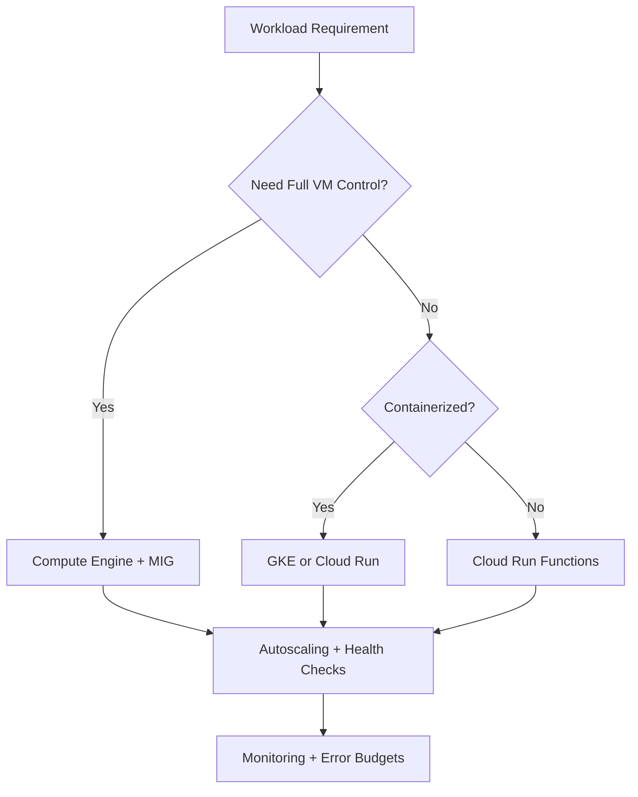
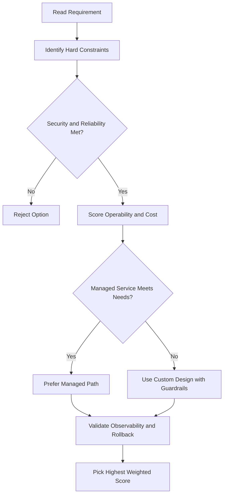
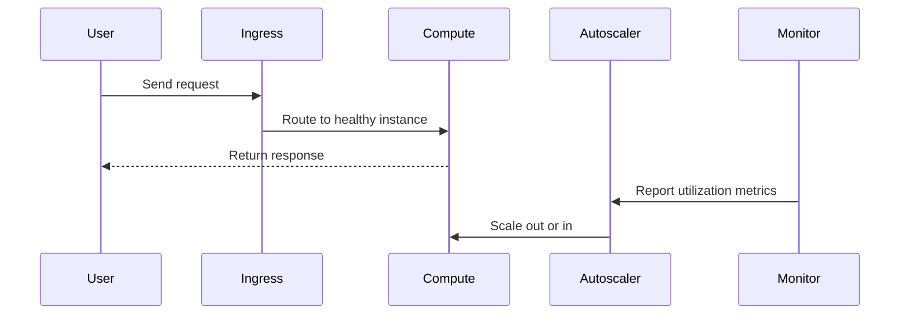

# 🖥️ Compute Engine

## What is Compute Engine?

Google Cloud's **IaaS** solution — lets you create and run virtual machines on Google's infrastructure.

- No upfront investment needed.
- Thousands of virtual CPUs can run simultaneously.
- Designed for speed and consistent performance.

---

## What a VM Can Do

Each VM has the full power of an operating system. You configure it like a physical server:

- How many **CPUs** and how much **memory**
- How much **storage** and what **type**
- Which **operating system**

### Ways to Create a VM

- **Google Cloud Console** — web-based UI
- **Google Cloud CLI** — command line
- **Compute Engine API** — programmatically

### Supported Operating Systems

- Linux and Windows Server images provided by Google
- Customized versions of those images
- Other operating systems you build yourself

---

## Cloud Marketplace

A quick way to get started — offers pre-configured solutions from Google and third-party vendors.

- No manual setup of software, VMs, storage, or networking.
- Most packages are free beyond normal Google Cloud usage fees.
- Third-party images with commercial software may have extra charges — all shown upfront before launch.

---

## Pricing & Billing

### Billing by the Second

- Compute Engine bills **per second**, with a **1-minute minimum**.

### Sustained-Use Discounts

- Automatically applied the longer a VM runs.
- If a VM runs for **more than 25% of a month**, Google automatically discounts every additional minute.

### Committed-Use Discounts

- For stable, predictable workloads.
- Commit to **1 year or 3 years** of a specific amount of vCPUs and memory.
- Save up to **57% off** normal prices.

---

## Preemptible & Spot VMs

For workloads that don't need a human waiting on them (e.g. batch jobs, data processing).

> Save up to **90%** compared to regular VMs.

The trade-off: Google can **terminate the VM at any time** if it needs those resources elsewhere.
You must ensure your job can be **stopped and restarted**.

### Preemptible vs. Spot VMs

| Feature             | Preemptible VM | Spot VM    |
| ------------------- | -------------- | ---------- |
| Max runtime         | 24 hours       | No maximum |
| More features       | ❌             | ✅         |
| Pricing (currently) | Same           | Same       |

---

## Storage

- High throughput between processing and persistent disks is the **default** — no special configuration needed.
- No extra cost for this.

---

## Custom Machine Types

You're not locked into predefined sizes. Choose exactly what you need:

- Set your own number of **virtual CPUs**
- Set your own amount of **memory**
- Pay only for what you actually use

---

## gcloud Commands

```bash
# List all VM instances
gcloud compute instances list

# Create a VM
gcloud compute instances create my-vm --zone=us-central1-a \
  --machine-type=e2-medium --image-family=debian-11 --image-project=debian-cloud

# SSH into a VM
gcloud compute ssh my-vm --zone=us-central1-a

# Delete a VM
gcloud compute instances delete my-vm --zone=us-central1-a
```

---

## Machine Families

| Family       | Purpose                                          | Examples                |
| ------------ | ------------------------------------------------ | ----------------------- |
| **E2**       | Cost-optimised, general purpose                  | e2-micro, e2-standard-2 |
| **N2 / N2D** | Balanced price-performance                       | n2-standard-4           |
| **C2 / C2D** | Compute-optimised (high CPU)                     | c2-standard-8           |
| **M1 / M2**  | Memory-optimised (SAP HANA, large in-memory DBs) | m1-ultramem-40          |
| **A2**       | Accelerator-optimised (GPU/ML workloads)         | a2-highgpu-1g           |
| **T2D**      | Scale-out workloads (AMD, cost-efficient)        | t2d-standard-1          |

- **Custom machine types** — set exact vCPU and memory; charged per vCPU-hour and per GB-hour
- **Extended memory** — add more RAM beyond standard ratio for memory-heavy workloads

---

## Disk Options

| Type                  | Speed                               | Use case                                  |
| --------------------- | ----------------------------------- | ----------------------------------------- |
| **Zonal Standard PD** | HDD — low cost                      | Sequential read/write, cold data          |
| **Zonal Balanced PD** | SSD — balanced                      | Most workloads                            |
| **Zonal SSD PD**      | SSD — high IOPS                     | Databases, latency-sensitive apps         |
| **Extreme PD**        | Highest IOPS                        | Large DBs (Oracle, SAP)                   |
| **Local SSD**         | Fastest (ephemeral)                 | Scratch space, caches — data lost on stop |
| **Hyperdisk**         | Next-gen (scalable IOPS/throughput) | Enterprise workloads                      |

- Persistent disks can be **resized** without stopping the VM
- **Boot disk** defaults to the OS image; data disks are attached separately
- Max 128 persistent disks per VM

### Snapshots

```bash
# Create a snapshot of a disk
gcloud compute disks snapshot my-disk --zone=us-central1-a \
  --snapshot-names=my-disk-snap

# Create a disk from a snapshot
gcloud compute disks create my-disk-restored \
  --source-snapshot=my-disk-snap --zone=us-central1-a
```

---

## Instance Templates and Managed Instance Groups (MIGs)

### Instance Template

A reusable VM configuration — machine type, boot disk, labels, metadata, network settings. Required for MIGs.

```bash
gcloud compute instance-templates create my-template \
  --machine-type=e2-medium \
  --image-family=debian-11 --image-project=debian-cloud
```

### Managed Instance Group (MIG)

A group of **identical VMs** created from an instance template. Used for autoscaling and high availability.

| Feature             | Detail                                                    |
| ------------------- | --------------------------------------------------------- |
| **Autoscaling**     | Scale out/in based on CPU, load balancing, custom metrics |
| **Autohealing**     | Replaces unhealthy VMs automatically using health checks  |
| **Rolling updates** | Update VMs progressively with zero downtime               |
| **Multi-zone**      | Spread VMs across zones for resilience                    |
| **Stateless**       | Best for stateless apps (web, API servers)                |

```bash
# Create a MIG
gcloud compute instance-groups managed create my-mig \
  --template=my-template --size=3 --zone=us-central1-a

# Set autoscaling
gcloud compute instance-groups managed set-autoscaling my-mig \
  --zone=us-central1-a --min-num-replicas=1 --max-num-replicas=10 \
  --target-cpu-utilization=0.6
```

---

## Startup and Shutdown Scripts

Run scripts automatically when a VM starts or stops:

```bash
# Pass a startup script at VM creation
gcloud compute instances create my-vm \
  --metadata=startup-script='#!/bin/bash
apt-get update
apt-get install -y nginx'

# Or reference a script file in GCS
gcloud compute instances create my-vm \
  --metadata=startup-script-url=gs://my-bucket/startup.sh
```

- Shutdown scripts run when the VM is stopped/preempted — useful for saving state or draining connections

---

## VM Images

| Type               | Description                                                    |
| ------------------ | -------------------------------------------------------------- |
| **Public images**  | Provided by Google, Canonical, Debian, etc.                    |
| **Custom images**  | Built from existing disk or snapshot; reusable across projects |
| **Machine images** | Full VM capture (disk + config + metadata) for backup/cloning  |

```bash
# Create a custom image from a disk
gcloud compute images create my-image --source-disk=my-disk \
  --source-disk-zone=us-central1-a
```

---

## OS Login

**OS Login** ties SSH access to Google accounts and IAM — replaces project-wide SSH key management.

- Enable per VM: `--metadata=enable-oslogin=TRUE`
- Grant SSH access: `roles/compute.osLogin` (non-sudo) or `roles/compute.osAdminLogin` (sudo)
- Keys are managed via your Google account — no manual key rotation

---

## Sole-Tenant Nodes

Physical servers dedicated exclusively to your project — useful for:

- Compliance requirements (no co-tenancy with other customers)
- Bring-your-own-license (BYOL) workloads (Windows Server, SQL Server)
- Performance isolation

---

## Key Takeaways

- Use **preemptible/spot VMs** for batch jobs to save up to 90%
- Use **committed-use discounts** for stable workloads (1 or 3 year)
- Use **instance templates + MIGs** for scalable, self-healing fleets
- Use **OS Login** instead of SSH keys for secure, auditable access
- Choose **machine family** based on workload: E2 (general), C2 (compute), M1/M2 (memory), A2 (GPU)

## ACE Exam-Style Practice Questions

### Q1
A Compute Engine workload requires full OS control and custom runtime with strict policy against managed platforms. Which compute option is best?

A. Compute Engine
B. Cloud Run Functions
C. App Engine Standard
D. Dataflow

Answer: A
Trap: Full host-level control is a strong Compute Engine signal.

### Q2
In a Compute Engine scenario, a fault-tolerant nightly batch workload is too expensive. What should you test and then use?

A. Spot or preemptible VMs after simulated interruption testing
B. Owner role on all instances
C. Single large sole-tenant node
D. Cloud DNS autoscaling

Answer: A
Trap: Interruptible workloads are classic candidates for discounted VM pricing models.

<!-- ACE_DEEP_ENRICHMENT_START -->
## ACE Deep Enrichment

### Think Like a Google Engineer
- Primary optimization axis: Elastic performance with minimum operational toil.
- Start with constraints first: SLO, security, compliance, latency, budget, and team operations capacity.
- Prefer managed services if they satisfy requirements with lower long-term operational toil.
- Minimize blast radius using environment isolation, least privilege, and failure-domain awareness.
- Design for day-2 operations: observability, rollback strategy, and quota or budget guardrails.

### Most Correct Option Filter (60 Seconds)
1. Eliminate options with broad access, single points of failure, or missing monitoring.
2. Confirm the option meets non-negotiables first: security and reliability requirements.
3. Compare remaining options on operational simplicity and long-term maintainability.
4. Use cost as an optimizer only after requirements and risk controls are satisfied.

### Weighted Decision Matrix
| Dimension | Weight | Strong Signal |
| --- | --- | --- |
| Security | 3 | Least privilege, secure defaults, no exposed blast radius |
| Reliability | 3 | Multi-zone or HA design, health checks, tested recovery path |
| Operability | 2 | Clear monitoring, alerting, rollout and rollback simplicity |
| Cost Efficiency | 2 | Right-sized resources, no waste, no reliability regression |
| Performance | 1 | Meets latency and throughput targets with headroom |

### Real-Life Scenario
A media startup has unpredictable traffic spikes during launches. They need faster releases, automatic scaling, and strong reliability without overpaying for idle capacity.

### Worked Example
- Choose managed compute first when operations overhead is a concern.
- For VM workloads, use managed instance groups with autoscaling and autohealing.
- For container workloads, use GKE node pools and rolling updates.
- For event-driven workloads, prefer Cloud Run or functions with concurrency controls.

### Flowchart


### Optimization Decision Flow


### Interaction Sequence


### Extra Exam Practice (10 Questions)
#### Q1
Scenario Focus: 🖥️ Compute Engine
Traffic triples during business hours and falls overnight. Which compute pattern is best?

A. Use autoscaling with target utilization and baseline minimum capacity.
B. Pin capacity to peak traffic all day for safety.
C. Restart failed instances manually as incidents occur.
D. Use one large VM because horizontal scaling is complex.

Answer: A
Why the other options are weaker: They typically ignore at least one hard constraint such as security, reliability, cost efficiency, or operational simplicity.
Google-engineer check: Reconfirm SLO fit, blast radius, and day-2 maintainability before finalizing.

#### Q2
Scenario Focus: 🖥️ Compute Engine
A VM app must self-heal when instances fail health checks. What should you use?

A. Restart failed instances manually as incidents occur.
B. Use a managed instance group with health checks and autohealing enabled.
C. Use one large VM because horizontal scaling is complex.
D. Deploy all changes at once without canary checks.

Answer: B
Why the other options are weaker: They typically ignore at least one hard constraint such as security, reliability, cost efficiency, or operational simplicity.
Google-engineer check: Reconfirm SLO fit, blast radius, and day-2 maintainability before finalizing.

#### Q3
Scenario Focus: 🖥️ Compute Engine
A team wants to deploy containers without managing nodes. Which platform fits best?

A. Use one large VM because horizontal scaling is complex.
B. Deploy all changes at once without canary checks.
C. Use Cloud Run for containerized services when node management is not required.
D. Ignore utilization metrics and optimize only by guesswork.

Answer: C
Why the other options are weaker: They typically ignore at least one hard constraint such as security, reliability, cost efficiency, or operational simplicity.
Google-engineer check: Reconfirm SLO fit, blast radius, and day-2 maintainability before finalizing.

#### Q4
Scenario Focus: 🖥️ Compute Engine
Which update strategy minimizes user impact during releases?

A. Deploy all changes at once without canary checks.
B. Ignore utilization metrics and optimize only by guesswork.
C. Pin capacity to peak traffic all day for safety.
D. Use rolling or blue-green deployment with health-based rollout checks.

Answer: D
Why the other options are weaker: They typically ignore at least one hard constraint such as security, reliability, cost efficiency, or operational simplicity.
Google-engineer check: Reconfirm SLO fit, blast radius, and day-2 maintainability before finalizing.

#### Q5
Scenario Focus: 🖥️ Compute Engine
How do you avoid overprovisioning while keeping performance stable?

A. Right-size resources and monitor saturation, latency, and error rates continuously.
B. Ignore utilization metrics and optimize only by guesswork.
C. Pin capacity to peak traffic all day for safety.
D. Restart failed instances manually as incidents occur.

Answer: A
Why the other options are weaker: They typically ignore at least one hard constraint such as security, reliability, cost efficiency, or operational simplicity.
Google-engineer check: Reconfirm SLO fit, blast radius, and day-2 maintainability before finalizing.

#### Q6
Scenario Focus: 🖥️ Compute Engine
Two designs both satisfy the happy path for 🖥️ Compute Engine. Which choice is most correct?

A. Pin capacity to peak traffic all day for safety.
B. Choose the option that preserves reliability and security while reducing operational burden.
C. Restart failed instances manually as incidents occur.
D. Use one large VM because horizontal scaling is complex.

Answer: B
Why the other options are weaker: They typically ignore at least one hard constraint such as security, reliability, cost efficiency, or operational simplicity.
Google-engineer check: Reconfirm SLO fit, blast radius, and day-2 maintainability before finalizing.

#### Q7
Scenario Focus: 🖥️ Compute Engine
What should you validate first before choosing an architecture for 🖥️ Compute Engine?

A. Restart failed instances manually as incidents occur.
B. Use one large VM because horizontal scaling is complex.
C. Validate SLO fit, blast radius, and least-privilege controls before comparing convenience.
D. Deploy all changes at once without canary checks.

Answer: C
Why the other options are weaker: They typically ignore at least one hard constraint such as security, reliability, cost efficiency, or operational simplicity.
Google-engineer check: Reconfirm SLO fit, blast radius, and day-2 maintainability before finalizing.

#### Q8
Scenario Focus: 🖥️ Compute Engine
A proposal lowers cost but increases failure risk. What is the best decision?

A. Use one large VM because horizontal scaling is complex.
B. Deploy all changes at once without canary checks.
C. Ignore utilization metrics and optimize only by guesswork.
D. Reject it unless reliability and recovery objectives remain within required targets.

Answer: D
Why the other options are weaker: They typically ignore at least one hard constraint such as security, reliability, cost efficiency, or operational simplicity.
Google-engineer check: Reconfirm SLO fit, blast radius, and day-2 maintainability before finalizing.

#### Q9
Scenario Focus: 🖥️ Compute Engine
Which option best reflects optimization for Elastic performance with minimum operational toil?

A. Select the design that best meets Elastic performance with minimum operational toil while keeping constraints balanced.
B. Deploy all changes at once without canary checks.
C. Ignore utilization metrics and optimize only by guesswork.
D. Pin capacity to peak traffic all day for safety.

Answer: A
Why the other options are weaker: They typically ignore at least one hard constraint such as security, reliability, cost efficiency, or operational simplicity.
Google-engineer check: Reconfirm SLO fit, blast radius, and day-2 maintainability before finalizing.

#### Q10
Scenario Focus: 🖥️ Compute Engine
How should you evaluate a design that needs frequent manual interventions?

A. Ignore utilization metrics and optimize only by guesswork.
B. Treat it as high risk and prefer automation-friendly designs with observability and rollback.
C. Pin capacity to peak traffic all day for safety.
D. Restart failed instances manually as incidents occur.

Answer: B
Why the other options are weaker: They typically ignore at least one hard constraint such as security, reliability, cost efficiency, or operational simplicity.
Google-engineer check: Reconfirm SLO fit, blast radius, and day-2 maintainability before finalizing.

### Quick Commands
```bash
gcloud compute instance-groups managed list --project=PROJECT_ID
gcloud compute instance-groups managed describe MIG_NAME --zone=ZONE --project=PROJECT_ID
gcloud run services list --region=REGION --project=PROJECT_ID
kubectl get pods -A
```

### Fast Recall
- Autoscaling is useful only with valid signals and guardrails.
- Managed offerings usually reduce operational burden.
- Deployment safety needs health checks and staged rollout.
<!-- ACE_DEEP_ENRICHMENT_END -->