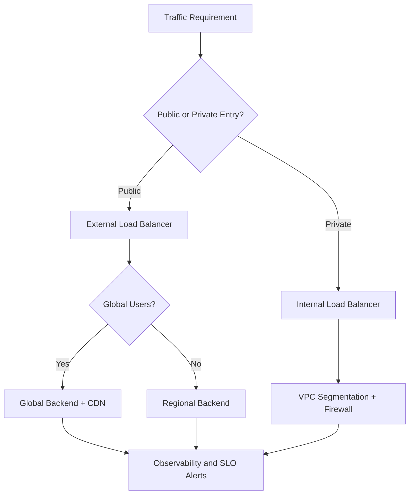
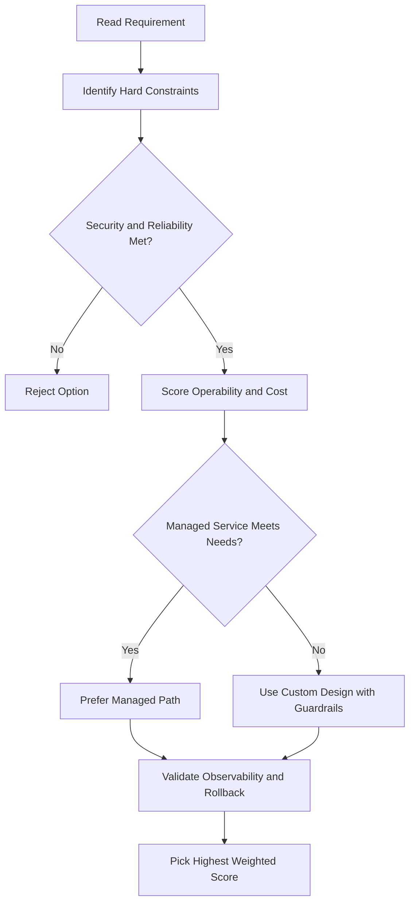
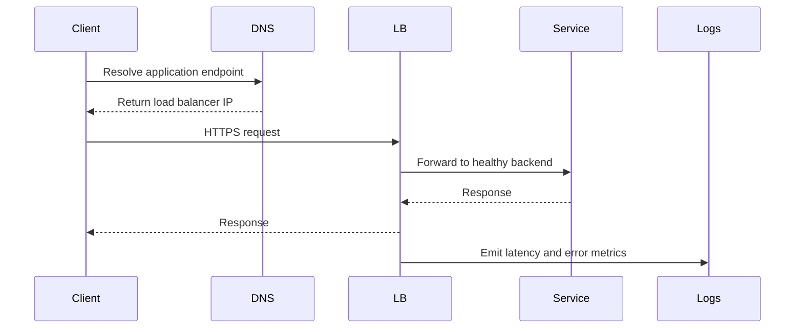

# 🔧 VPC Features

## Routing Tables

- VPCs have **built-in routing tables** — no router to provision or manage.
- Used to forward traffic:
  - Between instances on the **same network**
  - Across **subnetworks**
  - Between **Google Cloud zones**
- No external IP address needed for any of this.

---

## Firewall

- VPCs include a **global distributed firewall** — no setup required.
- Controls both **incoming (ingress)** and **outgoing (egress)** traffic.

### Network Tags

A convenient way to apply firewall rules without tracking IP addresses:

1. Tag your VMs (e.g. tag all web servers with `"WEB"`)
2. Write a firewall rule targeting that tag (e.g. allow traffic on ports 80 and 443 to any VM tagged `"WEB"`)
3. The rule applies to those VMs regardless of their IP address.

---

## Connecting VPCs Across Projects

VPCs belong to a Google Cloud project — but sometimes VPCs in different projects need to talk to each other.

### Option 1: VPC Network Peering

Allows **private connectivity** between two VPC networks regardless of whether they belong to the same project or the same organization. Traffic stays on Google's private network — no public IPs or VPNs needed.

#### When to use it

- Your organization has **multiple network administrative domains**
- You want to **peer with another organization** (e.g. offer SaaS services privately, or connect networks after a merger/acquisition)

#### Advantages over external IPs / VPNs

| Benefit             | Detail                                                                            |
| ------------------- | --------------------------------------------------------------------------------- |
| **Lower latency**   | Private networking is faster than routing over public IPs                         |
| **Better security** | Services are never exposed to the public internet                                 |
| **Lower cost**      | Peered networks use internal IPs, saving on Google Cloud egress bandwidth charges |

> Regular network pricing still applies to all traffic — only the egress bandwidth savings are specific to peering.

#### How it works

- Both sides must **each create a peering connection** pointing at the other network — it is not one-sided
- Works across projects and across organizations

### Option 2: Shared VPC

- Uses full **IAM controls** to manage who and what in one project can interact with a VPC in another.
- More control than peering — lets you define fine-grained access policies.

---

## gcloud Commands

```bash
# List firewall rules
gcloud compute firewall-rules list

# Create a firewall rule targeting a network tag
gcloud compute firewall-rules create allow-http \
  --network=my-vpc --allow=tcp:80 --target-tags=web-server

# Delete a firewall rule
gcloud compute firewall-rules delete allow-http

# Create VPC peering
gcloud compute networks peerings create my-peering \
  --network=my-vpc --peer-project=OTHER_PROJECT --peer-network=other-vpc
```

## ACE Exam-Style Practice Questions

### Q1
In a Vpc Features architecture with autoscaling tiers, traffic must flow web to API to database only. How should you enforce this?

A. Separate projects without firewall policy
B. Tags or service-account-based firewall rules between tiers
C. DNS records only
D. Disable internal communication

Answer: B
Trap: Layered firewall policy with identity or tags is robust against autoscaling IP changes.

### Q2
A private VM in Vpc Features needs outbound internet updates but no inbound internet. What should you configure?

A. External IP on each VM
B. Cloud NAT
C. Cloud Armor only
D. Internal TCP load balancer

Answer: B
Trap: Cloud NAT handles outbound internet for private instances without exposing inbound services.

<!-- ACE_DEEP_ENRICHMENT_START -->
## ACE Deep Enrichment

### Think Like a Google Engineer
- Primary optimization axis: Latency-resilience balance with private-by-default connectivity.
- Start with constraints first: SLO, security, compliance, latency, budget, and team operations capacity.
- Prefer managed services if they satisfy requirements with lower long-term operational toil.
- Minimize blast radius using environment isolation, least privilege, and failure-domain awareness.
- Design for day-2 operations: observability, rollback strategy, and quota or budget guardrails.

### Most Correct Option Filter (60 Seconds)
1. Eliminate options with broad access, single points of failure, or missing monitoring.
2. Confirm the option meets non-negotiables first: security and reliability requirements.
3. Compare remaining options on operational simplicity and long-term maintainability.
4. Use cost as an optimizer only after requirements and risk controls are satisfied.

### Weighted Decision Matrix
| Dimension | Weight | Strong Signal |
| --- | --- | --- |
| Security | 3 | Least privilege, secure defaults, no exposed blast radius |
| Reliability | 3 | Multi-zone or HA design, health checks, tested recovery path |
| Operability | 2 | Clear monitoring, alerting, rollout and rollback simplicity |
| Cost Efficiency | 2 | Right-sized resources, no waste, no reliability regression |
| Performance | 1 | Meets latency and throughput targets with headroom |

### Real-Life Scenario
An ecommerce platform serves customers across regions. The team must keep latency low, protect internal services, and survive zonal failures while controlling egress costs.

### Worked Example
- Place internet-facing services behind the correct external load balancer type.
- Keep internal services private with internal load balancers and private IP ranges.
- Use firewall rules by tags or service accounts, not wide open CIDR ranges.
- Add Cloud CDN or regional placement based on traffic profile and content type.

### Flowchart


### Optimization Decision Flow


### Interaction Sequence


### Extra Exam Practice (10 Questions)
#### Q1
Scenario Focus: 🔧 VPC Features
A service must be reachable only from internal VMs. Which design is best?

A. Use an internal load balancer with private backend endpoints and private DNS.
B. Expose the service publicly and rely on app-level passwords.
C. Use one VM with a static external IP to simplify architecture.
D. Allow 0.0.0.0/0 ingress to speed up troubleshooting.

Answer: A
Why the other options are weaker: They typically ignore at least one hard constraint such as security, reliability, cost efficiency, or operational simplicity.
Google-engineer check: Reconfirm SLO fit, blast radius, and day-2 maintainability before finalizing.

#### Q2
Scenario Focus: 🔧 VPC Features
You need to reduce global web latency for static assets. What should you choose?

A. Use one VM with a static external IP to simplify architecture.
B. Use an external application load balancer with Cloud CDN and cacheable content rules.
C. Allow 0.0.0.0/0 ingress to speed up troubleshooting.
D. Disable health checks to avoid accidental failover.

Answer: B
Why the other options are weaker: They typically ignore at least one hard constraint such as security, reliability, cost efficiency, or operational simplicity.
Google-engineer check: Reconfirm SLO fit, blast radius, and day-2 maintainability before finalizing.

#### Q3
Scenario Focus: 🔧 VPC Features
Which firewall strategy best matches zero-trust network design?

A. Allow 0.0.0.0/0 ingress to speed up troubleshooting.
B. Disable health checks to avoid accidental failover.
C. Use least-privilege firewall policies scoped by service accounts or tags.
D. Route all traffic through manual bastion hops in production.

Answer: C
Why the other options are weaker: They typically ignore at least one hard constraint such as security, reliability, cost efficiency, or operational simplicity.
Google-engineer check: Reconfirm SLO fit, blast radius, and day-2 maintainability before finalizing.

#### Q4
Scenario Focus: 🔧 VPC Features
A backend fails health checks in one zone. What architecture is best practice?

A. Disable health checks to avoid accidental failover.
B. Route all traffic through manual bastion hops in production.
C. Expose the service publicly and rely on app-level passwords.
D. Run multi-zone backends with health checks and automatic failover.

Answer: D
Why the other options are weaker: They typically ignore at least one hard constraint such as security, reliability, cost efficiency, or operational simplicity.
Google-engineer check: Reconfirm SLO fit, blast radius, and day-2 maintainability before finalizing.

#### Q5
Scenario Focus: 🔧 VPC Features
You need private hybrid connectivity between on-prem and GCP. Which path is preferred?

A. Use HA VPN or Interconnect based on throughput and SLA requirements.
B. Route all traffic through manual bastion hops in production.
C. Expose the service publicly and rely on app-level passwords.
D. Use one VM with a static external IP to simplify architecture.

Answer: A
Why the other options are weaker: They typically ignore at least one hard constraint such as security, reliability, cost efficiency, or operational simplicity.
Google-engineer check: Reconfirm SLO fit, blast radius, and day-2 maintainability before finalizing.

#### Q6
Scenario Focus: 🔧 VPC Features
Two designs both satisfy the happy path for 🔧 VPC Features. Which choice is most correct?

A. Expose the service publicly and rely on app-level passwords.
B. Choose the option that preserves reliability and security while reducing operational burden.
C. Use one VM with a static external IP to simplify architecture.
D. Allow 0.0.0.0/0 ingress to speed up troubleshooting.

Answer: B
Why the other options are weaker: They typically ignore at least one hard constraint such as security, reliability, cost efficiency, or operational simplicity.
Google-engineer check: Reconfirm SLO fit, blast radius, and day-2 maintainability before finalizing.

#### Q7
Scenario Focus: 🔧 VPC Features
What should you validate first before choosing an architecture for 🔧 VPC Features?

A. Use one VM with a static external IP to simplify architecture.
B. Allow 0.0.0.0/0 ingress to speed up troubleshooting.
C. Validate SLO fit, blast radius, and least-privilege controls before comparing convenience.
D. Disable health checks to avoid accidental failover.

Answer: C
Why the other options are weaker: They typically ignore at least one hard constraint such as security, reliability, cost efficiency, or operational simplicity.
Google-engineer check: Reconfirm SLO fit, blast radius, and day-2 maintainability before finalizing.

#### Q8
Scenario Focus: 🔧 VPC Features
A proposal lowers cost but increases failure risk. What is the best decision?

A. Allow 0.0.0.0/0 ingress to speed up troubleshooting.
B. Disable health checks to avoid accidental failover.
C. Route all traffic through manual bastion hops in production.
D. Reject it unless reliability and recovery objectives remain within required targets.

Answer: D
Why the other options are weaker: They typically ignore at least one hard constraint such as security, reliability, cost efficiency, or operational simplicity.
Google-engineer check: Reconfirm SLO fit, blast radius, and day-2 maintainability before finalizing.

#### Q9
Scenario Focus: 🔧 VPC Features
Which option best reflects optimization for Latency-resilience balance with private-by-default connectivity?

A. Select the design that best meets Latency-resilience balance with private-by-default connectivity while keeping constraints balanced.
B. Disable health checks to avoid accidental failover.
C. Route all traffic through manual bastion hops in production.
D. Expose the service publicly and rely on app-level passwords.

Answer: A
Why the other options are weaker: They typically ignore at least one hard constraint such as security, reliability, cost efficiency, or operational simplicity.
Google-engineer check: Reconfirm SLO fit, blast radius, and day-2 maintainability before finalizing.

#### Q10
Scenario Focus: 🔧 VPC Features
How should you evaluate a design that needs frequent manual interventions?

A. Route all traffic through manual bastion hops in production.
B. Treat it as high risk and prefer automation-friendly designs with observability and rollback.
C. Expose the service publicly and rely on app-level passwords.
D. Use one VM with a static external IP to simplify architecture.

Answer: B
Why the other options are weaker: They typically ignore at least one hard constraint such as security, reliability, cost efficiency, or operational simplicity.
Google-engineer check: Reconfirm SLO fit, blast radius, and day-2 maintainability before finalizing.

### Quick Commands
```bash
gcloud compute firewall-rules list --project=PROJECT_ID
gcloud compute forwarding-rules list --global --project=PROJECT_ID
gcloud compute backend-services get-health BACKEND_NAME --global --project=PROJECT_ID
gcloud compute routes list --project=PROJECT_ID
```

### Fast Recall
- Pick load balancer type by traffic pattern, not preference.
- Private services should stay private end to end.
- Health checks and multi-zone design are core reliability controls.
<!-- ACE_DEEP_ENRICHMENT_END -->