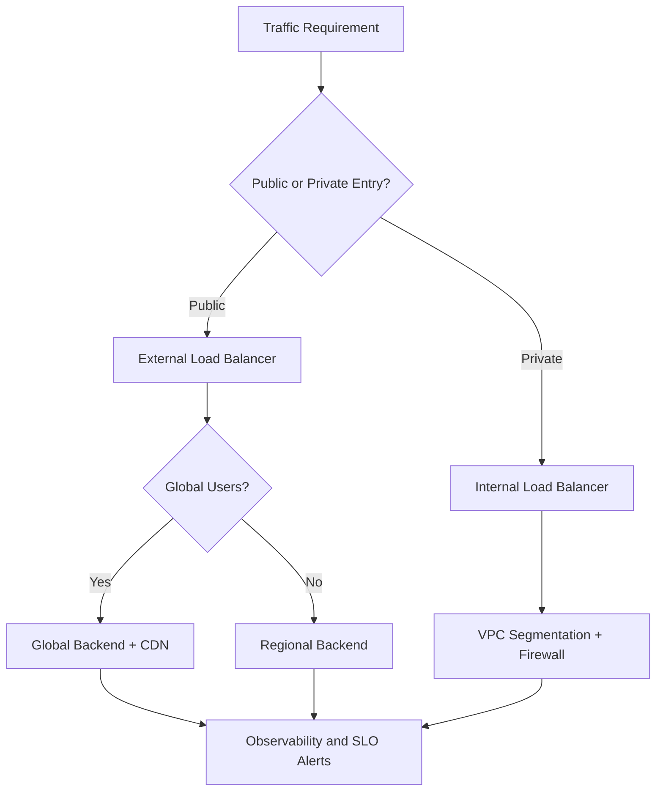
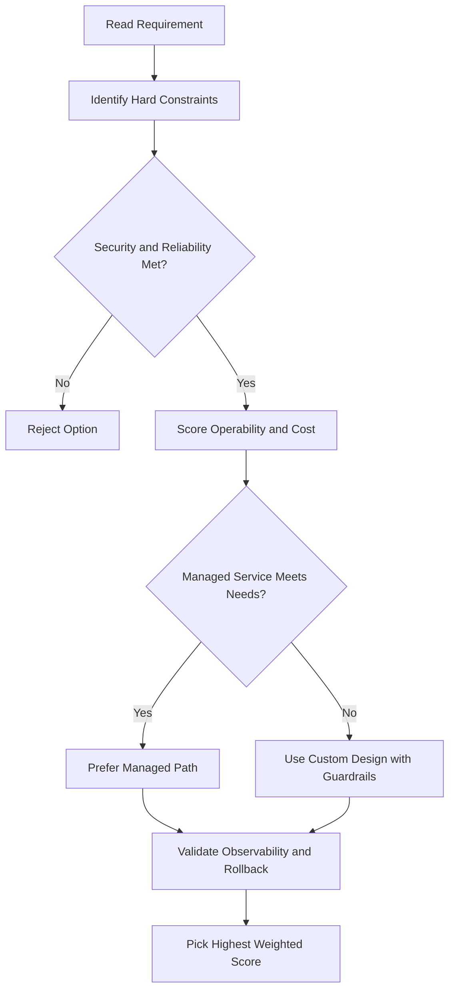
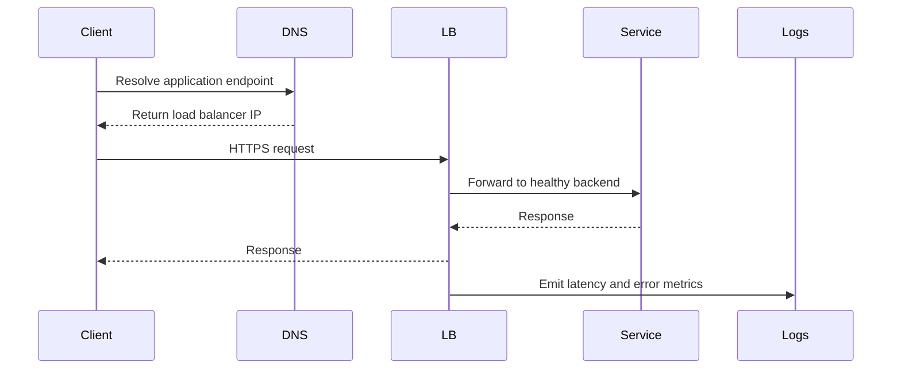

# 🌐 Google Cloud Connectivity Options

## Why Connect VPCs to Other Networks?

- Many customers need to connect Google VPCs to on-premises or other cloud networks.
- Several options exist, each with different trade-offs for security, reliability, and performance.

---

## 1. Cloud VPN

- **VPN tunnel** over the internet between your network and Google VPC.
- **Cloud Router** can be used for dynamic routing (BGP) — new subnets/routes are automatically shared.
- Good for private-to-private connectivity if internet bandwidth is sufficient.

---

## 2. Peering

- **Direct Peering**: Place a router in the same public data center as a Google point of presence (PoP) to exchange traffic.
- **Carrier Peering**: Use a service provider's network to connect your on-premises network to Google (Workspace, Cloud, etc.).
- Peering is not covered by a Google SLA.

---

## 3. Dedicated Interconnect

- **Direct, private connections** to Google from your data center.
- Can be covered by a Google SLA (up to 99.99%) if topology requirements are met.
- Can be backed up by VPN for extra reliability.

---

## 4. Partner Interconnect

- Connects your on-premises network to Google VPC via a supported service provider.
- Useful if you can't reach a Dedicated Interconnect facility or don't need a full 10 Gbps connection.
- Can be covered by a Google SLA (up to 99.99%) if requirements are met (but not for the partner's portion).

---

## 5. Cross-Cloud Interconnect

- Dedicated, high-bandwidth connection between Google Cloud and another cloud provider.
- Supports multicloud strategies, site-to-site transfer, and encryption.
- Available in 10 Gbps and 100 Gbps sizes.

---

## Choosing the Right Option

Ask yourself:

1. Do you need private-to-private connectivity?
2. Does your current internet connection meet your business needs?
3. Are you willing/able to install routing equipment in a Google PoP?

| Need/Constraint                        | Best Option              |
| -------------------------------------- | ------------------------ |
| Private-to-private, internet is fine   | Cloud VPN                |
| No private access, internet is fine    | Public IPs               |
| No private access, internet is slow    | Peering (Direct/Carrier) |
| Private, high-perf, no equipment       | Partner Interconnect     |
| Private, high-perf, can install equip. | Dedicated Interconnect   |
| Multicloud, high bandwidth             | Cross-Cloud Interconnect |

---

## gcloud Commands

```bash
# List VPN tunnels
gcloud compute vpn-tunnels list

# List Cloud Routers
gcloud compute routers list

# List Dedicated/Partner Interconnect attachments
gcloud compute interconnects attachments list

# List Cloud VPN gateways
gcloud compute vpn-gateways list
```

## ACE Exam-Style Practice Questions

### Q1
In a Connectivity Options scenario, two answers seem technically possible. What tie-breaker should you apply first?

A. Pick the option with most manual steps
B. Pick the option with least privilege and least operational overhead that still meets requirements
C. Pick highest-cost option
D. Pick the oldest product

Answer: B
Trap: ACE-style scenarios reward secure, managed, requirement-fit decisions.

### Q2
For Connectivity Options, what is the best way to reduce wrong answers in multi-choice questions?

A. Ignore scaling and security words
B. Identify trigger words, eliminate over-privileged choices, then choose the managed fit
C. Always pick Compute Engine
D. Always pick the shortest option

Answer: B
Trap: Structured elimination is more reliable than memorization alone.

<!-- ACE_DEEP_ENRICHMENT_START -->
## ACE Deep Enrichment

### Think Like a Google Engineer
- Primary optimization axis: Latency-resilience balance with private-by-default connectivity.
- Start with constraints first: SLO, security, compliance, latency, budget, and team operations capacity.
- Prefer managed services if they satisfy requirements with lower long-term operational toil.
- Minimize blast radius using environment isolation, least privilege, and failure-domain awareness.
- Design for day-2 operations: observability, rollback strategy, and quota or budget guardrails.

### Most Correct Option Filter (60 Seconds)
1. Eliminate options with broad access, single points of failure, or missing monitoring.
2. Confirm the option meets non-negotiables first: security and reliability requirements.
3. Compare remaining options on operational simplicity and long-term maintainability.
4. Use cost as an optimizer only after requirements and risk controls are satisfied.

### Weighted Decision Matrix
| Dimension | Weight | Strong Signal |
| --- | --- | --- |
| Security | 3 | Least privilege, secure defaults, no exposed blast radius |
| Reliability | 3 | Multi-zone or HA design, health checks, tested recovery path |
| Operability | 2 | Clear monitoring, alerting, rollout and rollback simplicity |
| Cost Efficiency | 2 | Right-sized resources, no waste, no reliability regression |
| Performance | 1 | Meets latency and throughput targets with headroom |

### Real-Life Scenario
An ecommerce platform serves customers across regions. The team must keep latency low, protect internal services, and survive zonal failures while controlling egress costs.

### Worked Example
- Place internet-facing services behind the correct external load balancer type.
- Keep internal services private with internal load balancers and private IP ranges.
- Use firewall rules by tags or service accounts, not wide open CIDR ranges.
- Add Cloud CDN or regional placement based on traffic profile and content type.

### Flowchart


### Optimization Decision Flow


### Interaction Sequence


### Extra Exam Practice (15 Questions)
#### Q1

Scenario Focus: 🌐 Google Cloud Connectivity Options

A service must be reachable only from internal VMs. Which design is best?

A. Use an internal load balancer with private backend endpoints and private DNS.  
B. Expose the service publicly and rely on app-level passwords.  
C. Use one VM with a static external IP to simplify architecture.  
D. Allow 0.0.0.0/0 ingress to speed up troubleshooting.

Answer: A  
Why the other options are weaker: They typically ignore at least one hard constraint such as security, reliability, cost efficiency, or operational simplicity.  
Google-engineer check: Reconfirm SLO fit, blast radius, and day-2 maintainability before finalizing.

#### Q2

Scenario Focus: 🌐 Google Cloud Connectivity Options

You need to reduce global web latency for static assets. What should you choose?

A. Use one VM with a static external IP to simplify architecture.  
B. Use an external application load balancer with Cloud CDN and cacheable content rules.  
C. Allow 0.0.0.0/0 ingress to speed up troubleshooting.  
D. Disable health checks to avoid accidental failover.

Answer: B  
Why the other options are weaker: They typically ignore at least one hard constraint such as security, reliability, cost efficiency, or operational simplicity.  
Google-engineer check: Reconfirm SLO fit, blast radius, and day-2 maintainability before finalizing.

#### Q3

Scenario Focus: 🌐 Google Cloud Connectivity Options

Which firewall strategy best matches zero-trust network design?

A. Allow 0.0.0.0/0 ingress to speed up troubleshooting.  
B. Disable health checks to avoid accidental failover.  
C. Use least-privilege firewall policies scoped by service accounts or tags.  
D. Route all traffic through manual bastion hops in production.

Answer: C  
Why the other options are weaker: They typically ignore at least one hard constraint such as security, reliability, cost efficiency, or operational simplicity.  
Google-engineer check: Reconfirm SLO fit, blast radius, and day-2 maintainability before finalizing.

#### Q4

Scenario Focus: 🌐 Google Cloud Connectivity Options

A backend fails health checks in one zone. What architecture is best practice?

A. Disable health checks to avoid accidental failover.  
B. Route all traffic through manual bastion hops in production.  
C. Expose the service publicly and rely on app-level passwords.  
D. Run multi-zone backends with health checks and automatic failover.

Answer: D  
Why the other options are weaker: They typically ignore at least one hard constraint such as security, reliability, cost efficiency, or operational simplicity.  
Google-engineer check: Reconfirm SLO fit, blast radius, and day-2 maintainability before finalizing.

#### Q5

Scenario Focus: 🌐 Google Cloud Connectivity Options

You need private hybrid connectivity between on-prem and GCP. Which path is preferred?

A. Use HA VPN or Interconnect based on throughput and SLA requirements.  
B. Route all traffic through manual bastion hops in production.  
C. Expose the service publicly and rely on app-level passwords.  
D. Use one VM with a static external IP to simplify architecture.

Answer: A  
Why the other options are weaker: They typically ignore at least one hard constraint such as security, reliability, cost efficiency, or operational simplicity.  
Google-engineer check: Reconfirm SLO fit, blast radius, and day-2 maintainability before finalizing.

#### Q6

Scenario Focus: 🌐 Google Cloud Connectivity Options

Two designs both satisfy the happy path for 🌐 Google Cloud Connectivity Options. Which choice is most correct?

A. Expose the service publicly and rely on app-level passwords.  
B. Choose the option that preserves reliability and security while reducing operational burden.  
C. Use one VM with a static external IP to simplify architecture.  
D. Allow 0.0.0.0/0 ingress to speed up troubleshooting.

Answer: B  
Why the other options are weaker: They typically ignore at least one hard constraint such as security, reliability, cost efficiency, or operational simplicity.  
Google-engineer check: Reconfirm SLO fit, blast radius, and day-2 maintainability before finalizing.

#### Q7

Scenario Focus: 🌐 Google Cloud Connectivity Options

What should you validate first before choosing an architecture for 🌐 Google Cloud Connectivity Options?

A. Use one VM with a static external IP to simplify architecture.  
B. Allow 0.0.0.0/0 ingress to speed up troubleshooting.  
C. Validate SLO fit, blast radius, and least-privilege controls before comparing convenience.  
D. Disable health checks to avoid accidental failover.

Answer: C  
Why the other options are weaker: They typically ignore at least one hard constraint such as security, reliability, cost efficiency, or operational simplicity.  
Google-engineer check: Reconfirm SLO fit, blast radius, and day-2 maintainability before finalizing.

#### Q8

Scenario Focus: 🌐 Google Cloud Connectivity Options

A proposal lowers cost but increases failure risk. What is the best decision?

A. Allow 0.0.0.0/0 ingress to speed up troubleshooting.  
B. Disable health checks to avoid accidental failover.  
C. Route all traffic through manual bastion hops in production.  
D. Reject it unless reliability and recovery objectives remain within required targets.

Answer: D  
Why the other options are weaker: They typically ignore at least one hard constraint such as security, reliability, cost efficiency, or operational simplicity.  
Google-engineer check: Reconfirm SLO fit, blast radius, and day-2 maintainability before finalizing.

#### Q9

Scenario Focus: 🌐 Google Cloud Connectivity Options

Which option best reflects optimization for Latency-resilience balance with private-by-default connectivity?

A. Select the design that best meets Latency-resilience balance with private-by-default connectivity while keeping constraints balanced.  
B. Disable health checks to avoid accidental failover.  
C. Route all traffic through manual bastion hops in production.  
D. Expose the service publicly and rely on app-level passwords.

Answer: A  
Why the other options are weaker: They typically ignore at least one hard constraint such as security, reliability, cost efficiency, or operational simplicity.  
Google-engineer check: Reconfirm SLO fit, blast radius, and day-2 maintainability before finalizing.

#### Q10

Scenario Focus: 🌐 Google Cloud Connectivity Options

How should you evaluate a design that needs frequent manual interventions?

A. Route all traffic through manual bastion hops in production.  
B. Treat it as high risk and prefer automation-friendly designs with observability and rollback.  
C. Expose the service publicly and rely on app-level passwords.  
D. Use one VM with a static external IP to simplify architecture.

Answer: B  
Why the other options are weaker: They typically ignore at least one hard constraint such as security, reliability, cost efficiency, or operational simplicity.  
Google-engineer check: Reconfirm SLO fit, blast radius, and day-2 maintainability before finalizing.

#### Q11

Scenario Focus: 🌐 Google Cloud Connectivity Options

Two options have similar latency. Which tie-breaker is best?

A. Expose the service publicly and rely on app-level passwords.  
B. Use one VM with a static external IP to simplify architecture.  
C. Pick the option with stronger operability, clearer failure isolation, and simpler incident response.  
D. Allow 0.0.0.0/0 ingress to speed up troubleshooting.

Answer: C  
Why the other options are weaker: They typically ignore at least one hard constraint such as security, reliability, cost efficiency, or operational simplicity.  
Google-engineer check: Reconfirm SLO fit, blast radius, and day-2 maintainability before finalizing.

#### Q12

Scenario Focus: 🌐 Google Cloud Connectivity Options

What is the best way to choose between a custom stack and a managed service?

A. Use one VM with a static external IP to simplify architecture.  
B. Allow 0.0.0.0/0 ingress to speed up troubleshooting.  
C. Disable health checks to avoid accidental failover.  
D. Prefer managed services when they meet requirements with lower long-term maintenance effort.

Answer: D  
Why the other options are weaker: They typically ignore at least one hard constraint such as security, reliability, cost efficiency, or operational simplicity.  
Google-engineer check: Reconfirm SLO fit, blast radius, and day-2 maintainability before finalizing.

#### Q13

Scenario Focus: 🌐 Google Cloud Connectivity Options

How do you confirm a solution is production-ready for 

A. Verify monitoring, alerting, rollback path, quota and budget controls, and secure defaults.  
B. Allow 0.0.0.0/0 ingress to speed up troubleshooting.  
C. Disable health checks to avoid accidental failover.  
D. Route all traffic through manual bastion hops in production.

Answer: A  
Why the other options are weaker: They typically ignore at least one hard constraint such as security, reliability, cost efficiency, or operational simplicity.  
Google-engineer check: Reconfirm SLO fit, blast radius, and day-2 maintainability before finalizing.

#### Q14

Scenario Focus: 🌐 Google Cloud Connectivity Options

Which pattern usually wins in ACE scenario tie-breakers?

A. Disable health checks to avoid accidental failover.  
B. Managed-service-first plus least-privilege access plus clear observability usually wins.  
C. Route all traffic through manual bastion hops in production.  
D. Expose the service publicly and rely on app-level passwords.

Answer: B  
Why the other options are weaker: They typically ignore at least one hard constraint such as security, reliability, cost efficiency, or operational simplicity.  
Google-engineer check: Reconfirm SLO fit, blast radius, and day-2 maintainability before finalizing.

#### Q15

Scenario Focus: 🌐 Google Cloud Connectivity Options

What is the best final check before locking the answer?

A. Route all traffic through manual bastion hops in production.  
B. Expose the service publicly and rely on app-level passwords.  
C. Run a weighted check across security, reliability, cost, performance, and operability.  
D. Use one VM with a static external IP to simplify architecture.

Answer: C  
Why the other options are weaker: They typically ignore at least one hard constraint such as security, reliability, cost efficiency, or operational simplicity.  
Google-engineer check: Reconfirm SLO fit, blast radius, and day-2 maintainability before finalizing.

### Quick Commands
```bash
gcloud compute firewall-rules list --project=PROJECT_ID
gcloud compute forwarding-rules list --global --project=PROJECT_ID
gcloud compute backend-services get-health BACKEND_NAME --global --project=PROJECT_ID
gcloud compute routes list --project=PROJECT_ID
```

### Fast Recall
- Pick load balancer type by traffic pattern, not preference.
- Private services should stay private end to end.
- Health checks and multi-zone design are core reliability controls.
<!-- ACE_DEEP_ENRICHMENT_END -->