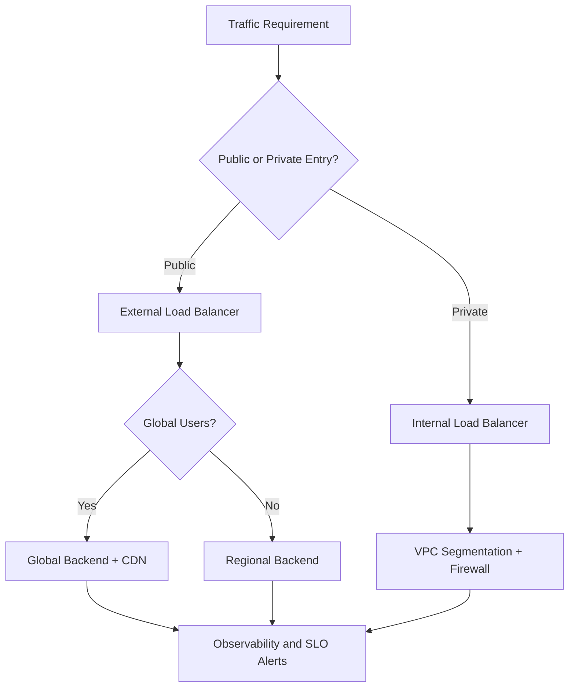
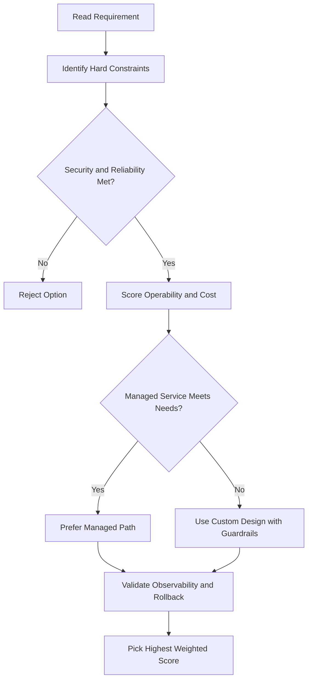
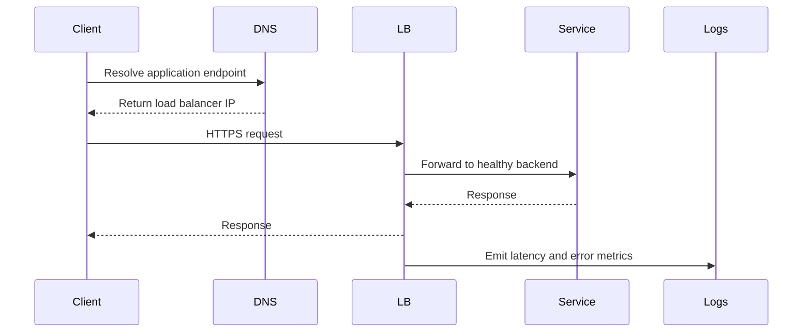

# Shared VPC and VPC Network Peering

Two configurations for sharing VPC networks across GCP projects.

---

## Shared VPC

- Connects resources from **multiple projects** to a **common VPC network** so they communicate using internal IP addresses
- Designate one project as the **host project**; attach one or more **service projects** to it
- The VPC networks in the host project are called **Shared VPC networks**
- Eligible resources from service projects can use subnets in the Shared VPC network
- Lets org admins **delegate** instance-level responsibilities to Service Project Admins while maintaining **centralized control** over subnets, routes, and firewalls

### Terminology

| Term               | Meaning                                                   |
| ------------------ | --------------------------------------------------------- |
| Host project       | Project that owns the shared VPC network                  |
| Service project    | Project attached to the host project; uses host's subnets |
| Standalone project | Project that does not participate in Shared VPC at all    |
| Standalone VPC     | An unshared VPC in a standalone or service project        |

---

## VPC Network Peering

- Enables **private RFC 1918 connectivity** across two VPC networks — regardless of project or organization
- Each VPC network maintains its own **global firewall rules and routing tables**
- To establish peering: **both sides** must create a peering connection (Producer → Consumer AND Consumer → Producer); once both are created the session becomes **Active** and routes are exchanged
- VMs communicate using **internal IP addresses**
- Avoids the latency, security, and cost drawbacks of external IPs or VPNs
- **Decentralized** — each VPC remains under its own admin group

---

## Shared VPC vs. VPC Network Peering

| Scenario                                                                    | Use                                                         |
| --------------------------------------------------------------------------- | ----------------------------------------------------------- |
| Private communication between VPCs in **different organizations**           | VPC Network Peering (Shared VPC is org-only)                |
| Private communication between VPCs in the **same project**                  | VPC Network Peering (Shared VPC requires multiple projects) |
| Private communication between VPCs **across projects in the same org**      | Either — depends on admin model                             |
| **Centralized** network administration (single network policy)              | Shared VPC                                                  |
| **Decentralized** network administration (each team controls their own VPC) | VPC Network Peering                                         |

## ACE Exam-Style Practice Questions

### Q1

You need private connectivity between two VPCs owned by different organizations in a Shared VPC and peering design. Which option is correct?

A. Shared VPC
B. VPC Network Peering
C. Cloud NAT
D. Internal passthrough load balancer

Answer: B
Trap: Shared VPC is for projects within the same organization and centralized administration model.

### Q2

Your platform team wants centralized control of subnets, routes, and firewall policies for multiple projects in one organization. What should you use?

A. Shared VPC with host and service projects
B. Separate stand-alone VPC per project with no sharing
C. Public IP routing only
D. Cloud DNS private zones only

Answer: A
Trap: VPC peering enables connectivity, but does not provide centralized network administration.

<!-- ACE_DEEP_ENRICHMENT_START -->
## ACE Deep Enrichment

### Think Like a Google Engineer
- Primary optimization axis: Latency-resilience balance with private-by-default connectivity.
- Start with constraints first: SLO, security, compliance, latency, budget, and team operations capacity.
- Prefer managed services if they satisfy requirements with lower long-term operational toil.
- Minimize blast radius using environment isolation, least privilege, and failure-domain awareness.
- Design for day-2 operations: observability, rollback strategy, and quota or budget guardrails.

### Most Correct Option Filter (60 Seconds)
1. Eliminate options with broad access, single points of failure, or missing monitoring.
2. Confirm the option meets non-negotiables first: security and reliability requirements.
3. Compare remaining options on operational simplicity and long-term maintainability.
4. Use cost as an optimizer only after requirements and risk controls are satisfied.

### Weighted Decision Matrix
| Dimension | Weight | Strong Signal |
| --- | --- | --- |
| Security | 3 | Least privilege, secure defaults, no exposed blast radius |
| Reliability | 3 | Multi-zone or HA design, health checks, tested recovery path |
| Operability | 2 | Clear monitoring, alerting, rollout and rollback simplicity |
| Cost Efficiency | 2 | Right-sized resources, no waste, no reliability regression |
| Performance | 1 | Meets latency and throughput targets with headroom |

### Real-Life Scenario
An ecommerce platform serves customers across regions. The team must keep latency low, protect internal services, and survive zonal failures while controlling egress costs.

### Worked Example
- Place internet-facing services behind the correct external load balancer type.
- Keep internal services private with internal load balancers and private IP ranges.
- Use firewall rules by tags or service accounts, not wide open CIDR ranges.
- Add Cloud CDN or regional placement based on traffic profile and content type.

### Flowchart


### Optimization Decision Flow


### Interaction Sequence


### Extra Exam Practice (10 Questions)
#### Q1
Scenario Focus: Shared VPC and VPC Network Peering
A service must be reachable only from internal VMs. Which design is best?

A. Use an internal load balancer with private backend endpoints and private DNS.
B. Expose the service publicly and rely on app-level passwords.
C. Use one VM with a static external IP to simplify architecture.
D. Allow 0.0.0.0/0 ingress to speed up troubleshooting.

Answer: A
Why the other options are weaker: They typically ignore at least one hard constraint such as security, reliability, cost efficiency, or operational simplicity.
Google-engineer check: Reconfirm SLO fit, blast radius, and day-2 maintainability before finalizing.

#### Q2
Scenario Focus: Shared VPC and VPC Network Peering
You need to reduce global web latency for static assets. What should you choose?

A. Use one VM with a static external IP to simplify architecture.
B. Use an external application load balancer with Cloud CDN and cacheable content rules.
C. Allow 0.0.0.0/0 ingress to speed up troubleshooting.
D. Disable health checks to avoid accidental failover.

Answer: B
Why the other options are weaker: They typically ignore at least one hard constraint such as security, reliability, cost efficiency, or operational simplicity.
Google-engineer check: Reconfirm SLO fit, blast radius, and day-2 maintainability before finalizing.

#### Q3
Scenario Focus: Shared VPC and VPC Network Peering
Which firewall strategy best matches zero-trust network design?

A. Allow 0.0.0.0/0 ingress to speed up troubleshooting.
B. Disable health checks to avoid accidental failover.
C. Use least-privilege firewall policies scoped by service accounts or tags.
D. Route all traffic through manual bastion hops in production.

Answer: C
Why the other options are weaker: They typically ignore at least one hard constraint such as security, reliability, cost efficiency, or operational simplicity.
Google-engineer check: Reconfirm SLO fit, blast radius, and day-2 maintainability before finalizing.

#### Q4
Scenario Focus: Shared VPC and VPC Network Peering
A backend fails health checks in one zone. What architecture is best practice?

A. Disable health checks to avoid accidental failover.
B. Route all traffic through manual bastion hops in production.
C. Expose the service publicly and rely on app-level passwords.
D. Run multi-zone backends with health checks and automatic failover.

Answer: D
Why the other options are weaker: They typically ignore at least one hard constraint such as security, reliability, cost efficiency, or operational simplicity.
Google-engineer check: Reconfirm SLO fit, blast radius, and day-2 maintainability before finalizing.

#### Q5
Scenario Focus: Shared VPC and VPC Network Peering
You need private hybrid connectivity between on-prem and GCP. Which path is preferred?

A. Use HA VPN or Interconnect based on throughput and SLA requirements.
B. Route all traffic through manual bastion hops in production.
C. Expose the service publicly and rely on app-level passwords.
D. Use one VM with a static external IP to simplify architecture.

Answer: A
Why the other options are weaker: They typically ignore at least one hard constraint such as security, reliability, cost efficiency, or operational simplicity.
Google-engineer check: Reconfirm SLO fit, blast radius, and day-2 maintainability before finalizing.

#### Q6
Scenario Focus: Shared VPC and VPC Network Peering
Two designs both satisfy the happy path for Shared VPC and VPC Network Peering. Which choice is most correct?

A. Expose the service publicly and rely on app-level passwords.
B. Choose the option that preserves reliability and security while reducing operational burden.
C. Use one VM with a static external IP to simplify architecture.
D. Allow 0.0.0.0/0 ingress to speed up troubleshooting.

Answer: B
Why the other options are weaker: They typically ignore at least one hard constraint such as security, reliability, cost efficiency, or operational simplicity.
Google-engineer check: Reconfirm SLO fit, blast radius, and day-2 maintainability before finalizing.

#### Q7
Scenario Focus: Shared VPC and VPC Network Peering
What should you validate first before choosing an architecture for Shared VPC and VPC Network Peering?

A. Use one VM with a static external IP to simplify architecture.
B. Allow 0.0.0.0/0 ingress to speed up troubleshooting.
C. Validate SLO fit, blast radius, and least-privilege controls before comparing convenience.
D. Disable health checks to avoid accidental failover.

Answer: C
Why the other options are weaker: They typically ignore at least one hard constraint such as security, reliability, cost efficiency, or operational simplicity.
Google-engineer check: Reconfirm SLO fit, blast radius, and day-2 maintainability before finalizing.

#### Q8
Scenario Focus: Shared VPC and VPC Network Peering
A proposal lowers cost but increases failure risk. What is the best decision?

A. Allow 0.0.0.0/0 ingress to speed up troubleshooting.
B. Disable health checks to avoid accidental failover.
C. Route all traffic through manual bastion hops in production.
D. Reject it unless reliability and recovery objectives remain within required targets.

Answer: D
Why the other options are weaker: They typically ignore at least one hard constraint such as security, reliability, cost efficiency, or operational simplicity.
Google-engineer check: Reconfirm SLO fit, blast radius, and day-2 maintainability before finalizing.

#### Q9
Scenario Focus: Shared VPC and VPC Network Peering
Which option best reflects optimization for Latency-resilience balance with private-by-default connectivity?

A. Select the design that best meets Latency-resilience balance with private-by-default connectivity while keeping constraints balanced.
B. Disable health checks to avoid accidental failover.
C. Route all traffic through manual bastion hops in production.
D. Expose the service publicly and rely on app-level passwords.

Answer: A
Why the other options are weaker: They typically ignore at least one hard constraint such as security, reliability, cost efficiency, or operational simplicity.
Google-engineer check: Reconfirm SLO fit, blast radius, and day-2 maintainability before finalizing.

#### Q10
Scenario Focus: Shared VPC and VPC Network Peering
How should you evaluate a design that needs frequent manual interventions?

A. Route all traffic through manual bastion hops in production.
B. Treat it as high risk and prefer automation-friendly designs with observability and rollback.
C. Expose the service publicly and rely on app-level passwords.
D. Use one VM with a static external IP to simplify architecture.

Answer: B
Why the other options are weaker: They typically ignore at least one hard constraint such as security, reliability, cost efficiency, or operational simplicity.
Google-engineer check: Reconfirm SLO fit, blast radius, and day-2 maintainability before finalizing.

### Quick Commands
```bash
gcloud compute firewall-rules list --project=PROJECT_ID
gcloud compute forwarding-rules list --global --project=PROJECT_ID
gcloud compute backend-services get-health BACKEND_NAME --global --project=PROJECT_ID
gcloud compute routes list --project=PROJECT_ID
```

### Fast Recall
- Pick load balancer type by traffic pattern, not preference.
- Private services should stay private end to end.
- Health checks and multi-zone design are core reliability controls.
<!-- ACE_DEEP_ENRICHMENT_END -->