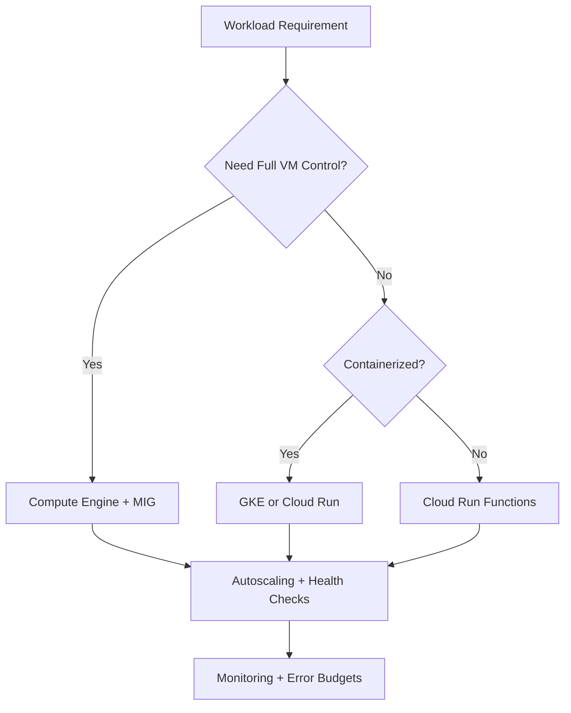
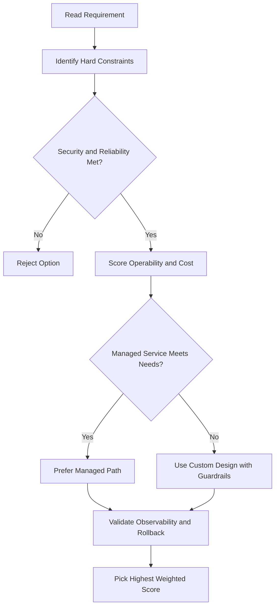
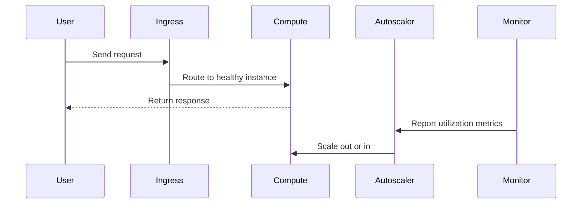

# MIG Autoscaling and Health Checks

## Autoscaling

Automatically adds or removes instances based on load — handles traffic spikes and reduces cost during low demand.

### How It Works

1. Define an **autoscaling policy**
2. The autoscaler measures load and scales accordingly

### Autoscaling Policy Types

| Policy                  | Description                                         |
| ----------------------- | --------------------------------------------------- |
| CPU utilization         | Scale to keep CPU below a target percentage         |
| Load balancing capacity | Scale based on load balancer utilization            |
| Monitoring metrics      | Scale based on any Cloud Monitoring metric          |
| Queue-based workload    | Scale based on queue depth (e.g., Pub/Sub)          |
| Schedule                | Scale based on start time, duration, and recurrence |

### Example — CPU-Based Autoscaling

- 2 instances at 100% and 85% CPU; target is 75%
- Autoscaler adds a third instance to spread load and stay below 75%
- If overall load drops well below target, autoscaler removes instances

### Monitoring Utilization

- Click on an instance group or individual VM to view metrics (CPU, disk, network)
- Default view: CPU utilization over the past hour; time frame and metric are configurable
- Can set up **alerts** via Cloud Monitoring with multiple notification channels

---

## Health Checks

Defines how Google Cloud determines whether an instance is healthy and should receive traffic.

### Configuration Parameters

| Parameter           | Description                                      |
| ------------------- | ------------------------------------------------ |
| Protocol            | e.g., HTTP, HTTPS, TCP                           |
| Port                | Port to check                                    |
| Check interval      | How often to check                               |
| Timeout             | How long to wait for a response                  |
| Healthy threshold   | Number of consecutive successes to mark healthy  |
| Unhealthy threshold | Number of consecutive failures to mark unhealthy |

> Example: unhealthy threshold of 2 with a 15-second window means the health check must fail twice over 15 seconds before the instance is considered unhealthy.

---

## Stateful IP Addresses

Preserves an instance's IP address across **autohealing, updates, and recreation events**.

- Both **internal and external IPv4 addresses** can be preserved
- IPs can be auto-assigned or manually assigned per instance

### When to Use Stateful IPs

- Application requires a static IP after initial assignment
- Application config depends on specific IP addresses
- Other services or users access a server via a dedicated static IP
- Migrating existing workloads without changing network config

### Configuring Stateful IPs on an Existing MIG

- Configure IPs as stateful for **all existing and future instances** — promotes ephemeral IPs to static
- Update existing stateful IP configuration at any time

## ACE Exam-Style Practice Questions

### Q1
A Mig Autoscaling Health Checks alert says new instances fail to create and desired capacity is not maintained. What should you check first?

A. Validate template configuration and resolve persistent disk name collisions; ensure autoDelete is set correctly
B. Disable health checks
C. Delete VPC routes
D. Recreate billing account

Answer: A
Trap: Template and disk naming collisions are frequent MIG creation failure causes.

### Q2
In a Mig Autoscaling Health Checks issue, CPU is at 100% and MIG already reached max replicas. What is the fastest mitigation?

A. Change metric to memory immediately
B. Increase autoscaler upper limit while investigating application bottleneck
C. Restart all VMs manually
D. Disable autoscaling

Answer: B
Trap: If ceiling is reached, immediate capacity headroom is the quickest stabilization action.

<!-- ACE_DEEP_ENRICHMENT_START -->
## ACE Deep Enrichment

### Think Like a Google Engineer
- Primary optimization axis: Elastic performance with minimum operational toil.
- Start with constraints first: SLO, security, compliance, latency, budget, and team operations capacity.
- Prefer managed services if they satisfy requirements with lower long-term operational toil.
- Minimize blast radius using environment isolation, least privilege, and failure-domain awareness.
- Design for day-2 operations: observability, rollback strategy, and quota or budget guardrails.

### Most Correct Option Filter (60 Seconds)
1. Eliminate options with broad access, single points of failure, or missing monitoring.
2. Confirm the option meets non-negotiables first: security and reliability requirements.
3. Compare remaining options on operational simplicity and long-term maintainability.
4. Use cost as an optimizer only after requirements and risk controls are satisfied.

### Weighted Decision Matrix
| Dimension | Weight | Strong Signal |
| --- | --- | --- |
| Security | 3 | Least privilege, secure defaults, no exposed blast radius |
| Reliability | 3 | Multi-zone or HA design, health checks, tested recovery path |
| Operability | 2 | Clear monitoring, alerting, rollout and rollback simplicity |
| Cost Efficiency | 2 | Right-sized resources, no waste, no reliability regression |
| Performance | 1 | Meets latency and throughput targets with headroom |

### Real-Life Scenario
A media startup has unpredictable traffic spikes during launches. They need faster releases, automatic scaling, and strong reliability without overpaying for idle capacity.

### Worked Example
- Choose managed compute first when operations overhead is a concern.
- For VM workloads, use managed instance groups with autoscaling and autohealing.
- For container workloads, use GKE node pools and rolling updates.
- For event-driven workloads, prefer Cloud Run or functions with concurrency controls.

### Flowchart


### Optimization Decision Flow


### Interaction Sequence


### Extra Exam Practice (15 Questions)
#### Q1
Scenario Focus: MIG Autoscaling and Health Checks
Traffic triples during business hours and falls overnight. Which compute pattern is best?

A. Use autoscaling with target utilization and baseline minimum capacity.
B. Pin capacity to peak traffic all day for safety.
C. Restart failed instances manually as incidents occur.
D. Use one large VM because horizontal scaling is complex.

Answer: A
Why the other options are weaker: They typically ignore at least one hard constraint such as security, reliability, cost efficiency, or operational simplicity.
Google-engineer check: Reconfirm SLO fit, blast radius, and day-2 maintainability before finalizing.

#### Q2
Scenario Focus: MIG Autoscaling and Health Checks
A VM app must self-heal when instances fail health checks. What should you use?

A. Restart failed instances manually as incidents occur.
B. Use a managed instance group with health checks and autohealing enabled.
C. Use one large VM because horizontal scaling is complex.
D. Deploy all changes at once without canary checks.

Answer: B
Why the other options are weaker: They typically ignore at least one hard constraint such as security, reliability, cost efficiency, or operational simplicity.
Google-engineer check: Reconfirm SLO fit, blast radius, and day-2 maintainability before finalizing.

#### Q3
Scenario Focus: MIG Autoscaling and Health Checks
A team wants to deploy containers without managing nodes. Which platform fits best?

A. Use one large VM because horizontal scaling is complex.
B. Deploy all changes at once without canary checks.
C. Use Cloud Run for containerized services when node management is not required.
D. Ignore utilization metrics and optimize only by guesswork.

Answer: C
Why the other options are weaker: They typically ignore at least one hard constraint such as security, reliability, cost efficiency, or operational simplicity.
Google-engineer check: Reconfirm SLO fit, blast radius, and day-2 maintainability before finalizing.

#### Q4
Scenario Focus: MIG Autoscaling and Health Checks
Which update strategy minimizes user impact during releases?

A. Deploy all changes at once without canary checks.
B. Ignore utilization metrics and optimize only by guesswork.
C. Pin capacity to peak traffic all day for safety.
D. Use rolling or blue-green deployment with health-based rollout checks.

Answer: D
Why the other options are weaker: They typically ignore at least one hard constraint such as security, reliability, cost efficiency, or operational simplicity.
Google-engineer check: Reconfirm SLO fit, blast radius, and day-2 maintainability before finalizing.

#### Q5
Scenario Focus: MIG Autoscaling and Health Checks
How do you avoid overprovisioning while keeping performance stable?

A. Right-size resources and monitor saturation, latency, and error rates continuously.
B. Ignore utilization metrics and optimize only by guesswork.
C. Pin capacity to peak traffic all day for safety.
D. Restart failed instances manually as incidents occur.

Answer: A
Why the other options are weaker: They typically ignore at least one hard constraint such as security, reliability, cost efficiency, or operational simplicity.
Google-engineer check: Reconfirm SLO fit, blast radius, and day-2 maintainability before finalizing.

#### Q6
Scenario Focus: MIG Autoscaling and Health Checks
Two designs both satisfy the happy path for MIG Autoscaling and Health Checks. Which choice is most correct?

A. Pin capacity to peak traffic all day for safety.
B. Choose the option that preserves reliability and security while reducing operational burden.
C. Restart failed instances manually as incidents occur.
D. Use one large VM because horizontal scaling is complex.

Answer: B
Why the other options are weaker: They typically ignore at least one hard constraint such as security, reliability, cost efficiency, or operational simplicity.
Google-engineer check: Reconfirm SLO fit, blast radius, and day-2 maintainability before finalizing.

#### Q7
Scenario Focus: MIG Autoscaling and Health Checks
What should you validate first before choosing an architecture for MIG Autoscaling and Health Checks?

A. Restart failed instances manually as incidents occur.
B. Use one large VM because horizontal scaling is complex.
C. Validate SLO fit, blast radius, and least-privilege controls before comparing convenience.
D. Deploy all changes at once without canary checks.

Answer: C
Why the other options are weaker: They typically ignore at least one hard constraint such as security, reliability, cost efficiency, or operational simplicity.
Google-engineer check: Reconfirm SLO fit, blast radius, and day-2 maintainability before finalizing.

#### Q8
Scenario Focus: MIG Autoscaling and Health Checks
A proposal lowers cost but increases failure risk. What is the best decision?

A. Use one large VM because horizontal scaling is complex.
B. Deploy all changes at once without canary checks.
C. Ignore utilization metrics and optimize only by guesswork.
D. Reject it unless reliability and recovery objectives remain within required targets.

Answer: D
Why the other options are weaker: They typically ignore at least one hard constraint such as security, reliability, cost efficiency, or operational simplicity.
Google-engineer check: Reconfirm SLO fit, blast radius, and day-2 maintainability before finalizing.

#### Q9
Scenario Focus: MIG Autoscaling and Health Checks
Which option best reflects optimization for Elastic performance with minimum operational toil?

A. Select the design that best meets Elastic performance with minimum operational toil while keeping constraints balanced.
B. Deploy all changes at once without canary checks.
C. Ignore utilization metrics and optimize only by guesswork.
D. Pin capacity to peak traffic all day for safety.

Answer: A
Why the other options are weaker: They typically ignore at least one hard constraint such as security, reliability, cost efficiency, or operational simplicity.
Google-engineer check: Reconfirm SLO fit, blast radius, and day-2 maintainability before finalizing.

#### Q10
Scenario Focus: MIG Autoscaling and Health Checks
How should you evaluate a design that needs frequent manual interventions?

A. Ignore utilization metrics and optimize only by guesswork.
B. Treat it as high risk and prefer automation-friendly designs with observability and rollback.
C. Pin capacity to peak traffic all day for safety.
D. Restart failed instances manually as incidents occur.

Answer: B
Why the other options are weaker: They typically ignore at least one hard constraint such as security, reliability, cost efficiency, or operational simplicity.
Google-engineer check: Reconfirm SLO fit, blast radius, and day-2 maintainability before finalizing.

#### Q11
Scenario Focus: MIG Autoscaling and Health Checks
Two options have similar latency. Which tie-breaker is best?

A. Pin capacity to peak traffic all day for safety.
B. Restart failed instances manually as incidents occur.
C. Pick the option with stronger operability, clearer failure isolation, and simpler incident response.
D. Use one large VM because horizontal scaling is complex.

Answer: C
Why the other options are weaker: They typically ignore at least one hard constraint such as security, reliability, cost efficiency, or operational simplicity.
Google-engineer check: Reconfirm SLO fit, blast radius, and day-2 maintainability before finalizing.

#### Q12
Scenario Focus: MIG Autoscaling and Health Checks
What is the best way to choose between a custom stack and a managed service?

A. Restart failed instances manually as incidents occur.
B. Use one large VM because horizontal scaling is complex.
C. Deploy all changes at once without canary checks.
D. Prefer managed services when they meet requirements with lower long-term maintenance effort.

Answer: D
Why the other options are weaker: They typically ignore at least one hard constraint such as security, reliability, cost efficiency, or operational simplicity.
Google-engineer check: Reconfirm SLO fit, blast radius, and day-2 maintainability before finalizing.

#### Q13
Scenario Focus: MIG Autoscaling and Health Checks
How do you confirm a solution is production-ready for 

A. Verify monitoring, alerting, rollback path, quota and budget controls, and secure defaults.
B. Use one large VM because horizontal scaling is complex.
C. Deploy all changes at once without canary checks.
D. Ignore utilization metrics and optimize only by guesswork.

Answer: A
Why the other options are weaker: They typically ignore at least one hard constraint such as security, reliability, cost efficiency, or operational simplicity.
Google-engineer check: Reconfirm SLO fit, blast radius, and day-2 maintainability before finalizing.

#### Q14
Scenario Focus: MIG Autoscaling and Health Checks
Which pattern usually wins in ACE scenario tie-breakers?

A. Deploy all changes at once without canary checks.
B. Managed-service-first plus least-privilege access plus clear observability usually wins.
C. Ignore utilization metrics and optimize only by guesswork.
D. Pin capacity to peak traffic all day for safety.

Answer: B
Why the other options are weaker: They typically ignore at least one hard constraint such as security, reliability, cost efficiency, or operational simplicity.
Google-engineer check: Reconfirm SLO fit, blast radius, and day-2 maintainability before finalizing.

#### Q15
Scenario Focus: MIG Autoscaling and Health Checks
What is the best final check before locking the answer?

A. Ignore utilization metrics and optimize only by guesswork.
B. Pin capacity to peak traffic all day for safety.
C. Run a weighted check across security, reliability, cost, performance, and operability.
D. Restart failed instances manually as incidents occur.

Answer: C
Why the other options are weaker: They typically ignore at least one hard constraint such as security, reliability, cost efficiency, or operational simplicity.
Google-engineer check: Reconfirm SLO fit, blast radius, and day-2 maintainability before finalizing.

### Quick Commands
```bash
gcloud compute instance-groups managed list --project=PROJECT_ID
gcloud compute instance-groups managed describe MIG_NAME --zone=ZONE --project=PROJECT_ID
gcloud run services list --region=REGION --project=PROJECT_ID
kubectl get pods -A
```

### Fast Recall
- Autoscaling is useful only with valid signals and guardrails.
- Managed offerings usually reduce operational burden.
- Deployment safety needs health checks and staged rollout.
<!-- ACE_DEEP_ENRICHMENT_END -->