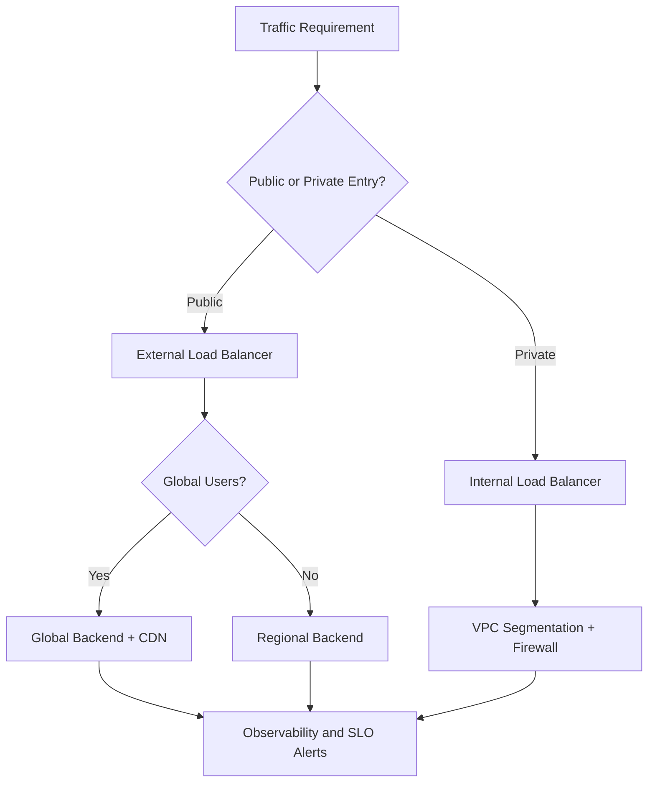
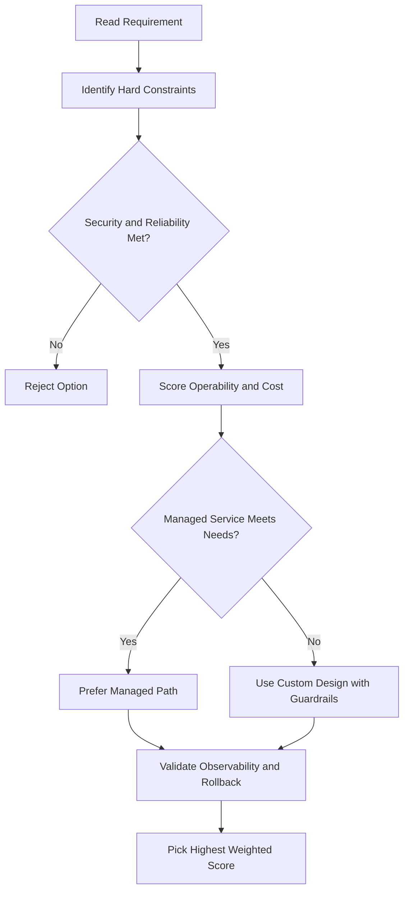
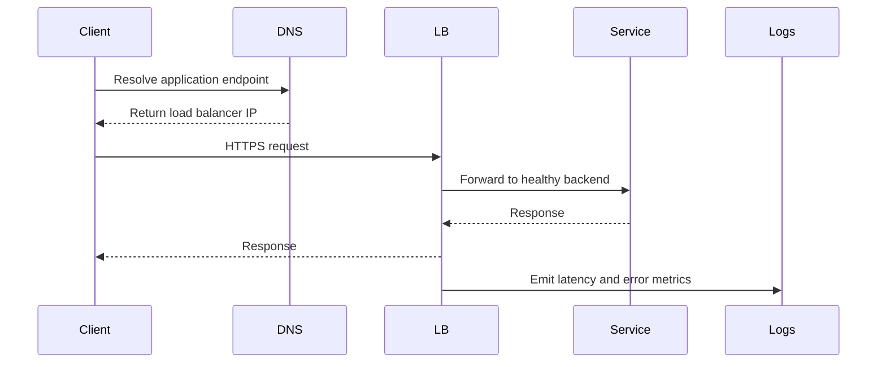

# Cloud CDN

## Overview

- Uses Google's globally distributed **edge Points of Presence (PoPs)** to cache HTTP(S) load-balanced content close to users
- **90+ cache sites** across Asia Pacific, Americas, and EMEA
- Caches content at the edges of Google's network → faster delivery + reduced serving costs
- Enable with a **single checkbox** when setting up the backend service of an Application Load Balancer

---

## How It Works — Response Flow

**Example setup:**
- Managed instance groups in `us-central1` and `asia-east1` (dynamic/PHP traffic)
- Cloud Storage bucket in `us-east1` (static content)
- URL map routes requests to the appropriate backend

**Cache Miss:**
1. User in San Francisco requests content for the first time
2. Cache site in San Francisco can't fulfill the request → **cache miss**
3. Cache checks a nearby cache (e.g., Los Angeles) first
4. If not found nearby, request is forwarded to the Application Load Balancer → backend
5. If the response is **cacheable**, the San Francisco cache stores it for future use

**Cache Hit:**
- Next user in San Francisco requests the same content
- Cache site serves it directly → **shorter round trip**, origin server not involved

> Every Cloud CDN request is **automatically logged** in Google Cloud, with a `Cache Hit` or `Cache Miss` status per HTTP request.

---

## Cache Modes

Control how Cloud CDN caches content and whether it respects cache directives from the origin.

| Cache Mode | Behavior |
|---|---|
| `USE_ORIGIN_HEADERS` | Only caches responses that include valid cache directives and caching headers from the origin |
| `CACHE_ALL_STATIC` | Automatically caches static content without `no-store`, `private`, or `no-cache` directives; also caches origin responses with valid caching directives |
| `FORCE_CACHE_ALL` | Unconditionally caches all responses, overriding any cache directives set by the origin |

> **Warning:** Do not use `FORCE_CACHE_ALL` with a shared backend that serves private, per-user content (e.g., dynamic HTML or API responses) — it will cache and serve that content to other users.

## ACE Exam-Style Practice Questions

### Q1
In a Cloud Cdn setup, you need low-latency global delivery of static assets. What should you use?

A. Cloud CDN
B. Cloud SQL read replica
C. Cloud VPN
D. Internal DNS only

Answer: A
Trap: Edge caching is the primary mechanism for global static content acceleration.

### Q2
For Cloud Cdn DNS design, what record type is valid for zone apex root domain mapping to a load balancer IP?

A. CNAME only
B. A record
C. TXT only
D. PTR only

Answer: B
Trap: Root domains cannot use CNAME in standard DNS setups.

<!-- ACE_DEEP_ENRICHMENT_START -->
## ACE Deep Enrichment

### Think Like a Google Engineer
- Primary optimization axis: Latency-resilience balance with private-by-default connectivity.
- Start with constraints first: SLO, security, compliance, latency, budget, and team operations capacity.
- Prefer managed services if they satisfy requirements with lower long-term operational toil.
- Minimize blast radius using environment isolation, least privilege, and failure-domain awareness.
- Design for day-2 operations: observability, rollback strategy, and quota or budget guardrails.

### Most Correct Option Filter (60 Seconds)
1. Eliminate options with broad access, single points of failure, or missing monitoring.
2. Confirm the option meets non-negotiables first: security and reliability requirements.
3. Compare remaining options on operational simplicity and long-term maintainability.
4. Use cost as an optimizer only after requirements and risk controls are satisfied.

### Weighted Decision Matrix
| Dimension | Weight | Strong Signal |
| --- | --- | --- |
| Security | 3 | Least privilege, secure defaults, no exposed blast radius |
| Reliability | 3 | Multi-zone or HA design, health checks, tested recovery path |
| Operability | 2 | Clear monitoring, alerting, rollout and rollback simplicity |
| Cost Efficiency | 2 | Right-sized resources, no waste, no reliability regression |
| Performance | 1 | Meets latency and throughput targets with headroom |

### Real-Life Scenario
An ecommerce platform serves customers across regions. The team must keep latency low, protect internal services, and survive zonal failures while controlling egress costs.

### Worked Example
- Place internet-facing services behind the correct external load balancer type.
- Keep internal services private with internal load balancers and private IP ranges.
- Use firewall rules by tags or service accounts, not wide open CIDR ranges.
- Add Cloud CDN or regional placement based on traffic profile and content type.

### Flowchart


### Optimization Decision Flow


### Interaction Sequence


### Extra Exam Practice (10 Questions)
#### Q1
Scenario Focus: Cloud CDN
A service must be reachable only from internal VMs. Which design is best?

A. Use an internal load balancer with private backend endpoints and private DNS.
B. Expose the service publicly and rely on app-level passwords.
C. Use one VM with a static external IP to simplify architecture.
D. Allow 0.0.0.0/0 ingress to speed up troubleshooting.

Answer: A
Why the other options are weaker: They typically ignore at least one hard constraint such as security, reliability, cost efficiency, or operational simplicity.
Google-engineer check: Reconfirm SLO fit, blast radius, and day-2 maintainability before finalizing.

#### Q2
Scenario Focus: Cloud CDN
You need to reduce global web latency for static assets. What should you choose?

A. Use one VM with a static external IP to simplify architecture.
B. Use an external application load balancer with Cloud CDN and cacheable content rules.
C. Allow 0.0.0.0/0 ingress to speed up troubleshooting.
D. Disable health checks to avoid accidental failover.

Answer: B
Why the other options are weaker: They typically ignore at least one hard constraint such as security, reliability, cost efficiency, or operational simplicity.
Google-engineer check: Reconfirm SLO fit, blast radius, and day-2 maintainability before finalizing.

#### Q3
Scenario Focus: Cloud CDN
Which firewall strategy best matches zero-trust network design?

A. Allow 0.0.0.0/0 ingress to speed up troubleshooting.
B. Disable health checks to avoid accidental failover.
C. Use least-privilege firewall policies scoped by service accounts or tags.
D. Route all traffic through manual bastion hops in production.

Answer: C
Why the other options are weaker: They typically ignore at least one hard constraint such as security, reliability, cost efficiency, or operational simplicity.
Google-engineer check: Reconfirm SLO fit, blast radius, and day-2 maintainability before finalizing.

#### Q4
Scenario Focus: Cloud CDN
A backend fails health checks in one zone. What architecture is best practice?

A. Disable health checks to avoid accidental failover.
B. Route all traffic through manual bastion hops in production.
C. Expose the service publicly and rely on app-level passwords.
D. Run multi-zone backends with health checks and automatic failover.

Answer: D
Why the other options are weaker: They typically ignore at least one hard constraint such as security, reliability, cost efficiency, or operational simplicity.
Google-engineer check: Reconfirm SLO fit, blast radius, and day-2 maintainability before finalizing.

#### Q5
Scenario Focus: Cloud CDN
You need private hybrid connectivity between on-prem and GCP. Which path is preferred?

A. Use HA VPN or Interconnect based on throughput and SLA requirements.
B. Route all traffic through manual bastion hops in production.
C. Expose the service publicly and rely on app-level passwords.
D. Use one VM with a static external IP to simplify architecture.

Answer: A
Why the other options are weaker: They typically ignore at least one hard constraint such as security, reliability, cost efficiency, or operational simplicity.
Google-engineer check: Reconfirm SLO fit, blast radius, and day-2 maintainability before finalizing.

#### Q6
Scenario Focus: Cloud CDN
Two designs both satisfy the happy path for Cloud CDN. Which choice is most correct?

A. Expose the service publicly and rely on app-level passwords.
B. Choose the option that preserves reliability and security while reducing operational burden.
C. Use one VM with a static external IP to simplify architecture.
D. Allow 0.0.0.0/0 ingress to speed up troubleshooting.

Answer: B
Why the other options are weaker: They typically ignore at least one hard constraint such as security, reliability, cost efficiency, or operational simplicity.
Google-engineer check: Reconfirm SLO fit, blast radius, and day-2 maintainability before finalizing.

#### Q7
Scenario Focus: Cloud CDN
What should you validate first before choosing an architecture for Cloud CDN?

A. Use one VM with a static external IP to simplify architecture.
B. Allow 0.0.0.0/0 ingress to speed up troubleshooting.
C. Validate SLO fit, blast radius, and least-privilege controls before comparing convenience.
D. Disable health checks to avoid accidental failover.

Answer: C
Why the other options are weaker: They typically ignore at least one hard constraint such as security, reliability, cost efficiency, or operational simplicity.
Google-engineer check: Reconfirm SLO fit, blast radius, and day-2 maintainability before finalizing.

#### Q8
Scenario Focus: Cloud CDN
A proposal lowers cost but increases failure risk. What is the best decision?

A. Allow 0.0.0.0/0 ingress to speed up troubleshooting.
B. Disable health checks to avoid accidental failover.
C. Route all traffic through manual bastion hops in production.
D. Reject it unless reliability and recovery objectives remain within required targets.

Answer: D
Why the other options are weaker: They typically ignore at least one hard constraint such as security, reliability, cost efficiency, or operational simplicity.
Google-engineer check: Reconfirm SLO fit, blast radius, and day-2 maintainability before finalizing.

#### Q9
Scenario Focus: Cloud CDN
Which option best reflects optimization for Latency-resilience balance with private-by-default connectivity?

A. Select the design that best meets Latency-resilience balance with private-by-default connectivity while keeping constraints balanced.
B. Disable health checks to avoid accidental failover.
C. Route all traffic through manual bastion hops in production.
D. Expose the service publicly and rely on app-level passwords.

Answer: A
Why the other options are weaker: They typically ignore at least one hard constraint such as security, reliability, cost efficiency, or operational simplicity.
Google-engineer check: Reconfirm SLO fit, blast radius, and day-2 maintainability before finalizing.

#### Q10
Scenario Focus: Cloud CDN
How should you evaluate a design that needs frequent manual interventions?

A. Route all traffic through manual bastion hops in production.
B. Treat it as high risk and prefer automation-friendly designs with observability and rollback.
C. Expose the service publicly and rely on app-level passwords.
D. Use one VM with a static external IP to simplify architecture.

Answer: B
Why the other options are weaker: They typically ignore at least one hard constraint such as security, reliability, cost efficiency, or operational simplicity.
Google-engineer check: Reconfirm SLO fit, blast radius, and day-2 maintainability before finalizing.

### Quick Commands
```bash
gcloud compute firewall-rules list --project=PROJECT_ID
gcloud compute forwarding-rules list --global --project=PROJECT_ID
gcloud compute backend-services get-health BACKEND_NAME --global --project=PROJECT_ID
gcloud compute routes list --project=PROJECT_ID
```

### Fast Recall
- Pick load balancer type by traffic pattern, not preference.
- Private services should stay private end to end.
- Health checks and multi-zone design are core reliability controls.
<!-- ACE_DEEP_ENRICHMENT_END -->