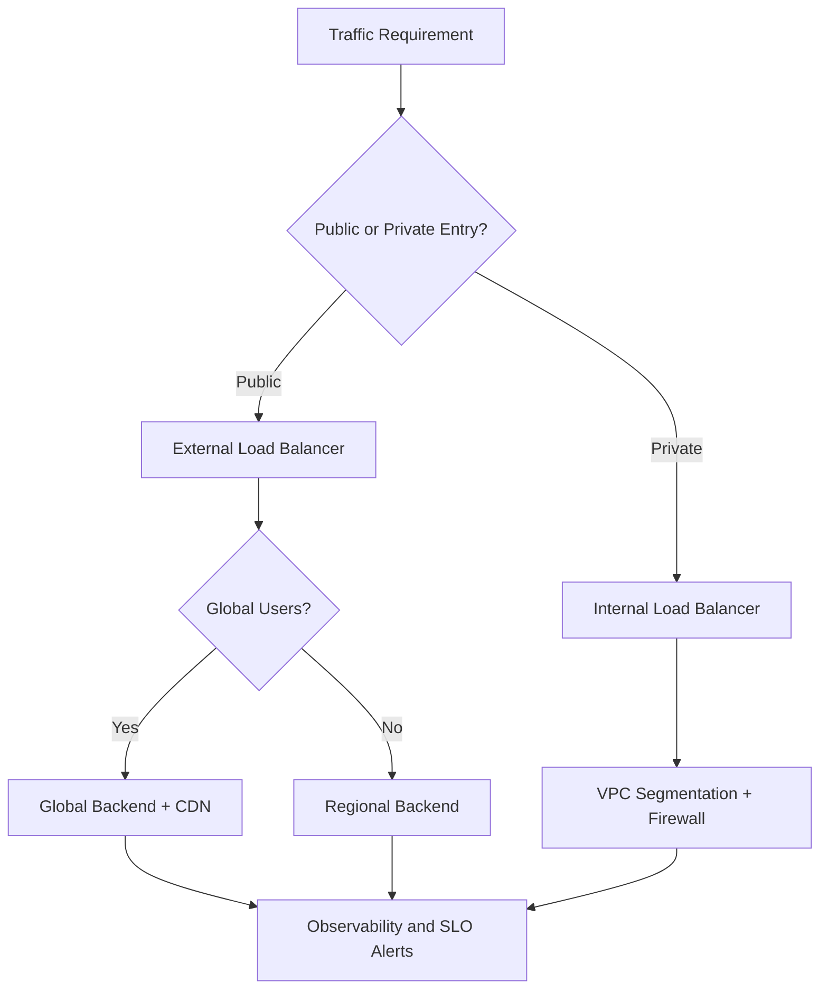
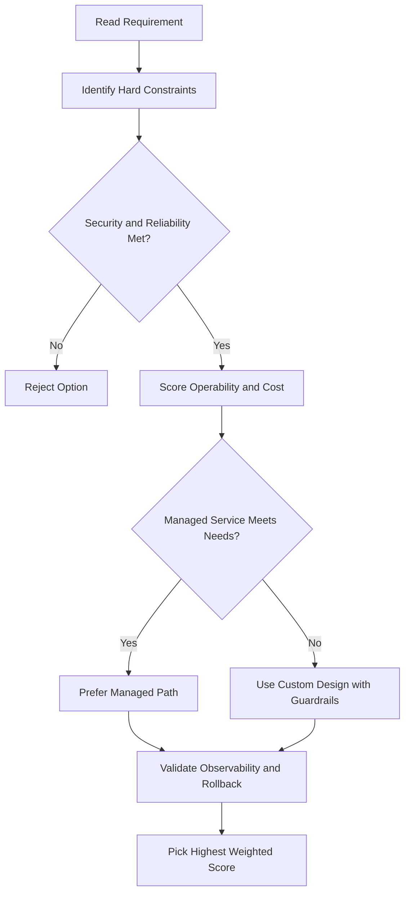
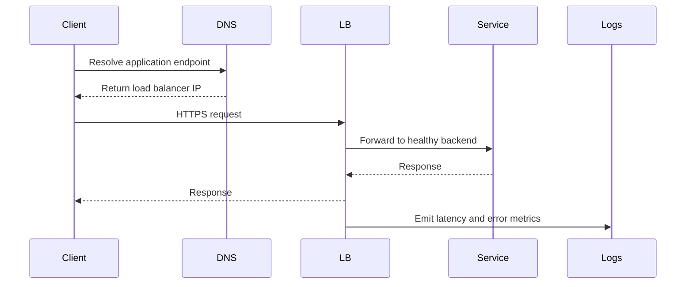

# Network Load Balancing

## Overview

- **Layer 4** load balancers that handle TCP, UDP, or other IP protocol traffic
- Can be **single-region or multi-region**
- Two types: **Proxy** or **Passthrough**

| Choose | When |
|---|---|
| **Proxy NLB** | You need a reverse proxy with advanced traffic controls; backends on-premises or in other clouds |
| **Passthrough NLB** | You need to preserve the client's source IP, prefer direct server return (DSR), or need to handle multiple IP protocols (TCP, UDP, ESP, GRE, ICMP, ICMPv6) |

---

## Proxy Network Load Balancers

- Layer 4 **reverse proxy** — traffic is **terminated at the load balancer**, then a new connection is forwarded to the closest available backend via TCP
- For **TCP traffic only** (with or without SSL) — use an Application Load Balancer for HTTP(S)
- Can be deployed **externally or internally**
- Built on **Google Front Ends (GFEs)** or **Envoy proxies**
- Deployment modes: **global, regional, or classic**

### Target TCP Proxy vs Target SSL Proxy

| Proxy Type | Traffic Handling |
|---|---|
| **Target TCP proxy** | TCP traffic; traffic between proxy and backend can use SSL or TCP (SSL recommended) |
| **Target SSL proxy** | SSL/TLS traffic; terminates SSL at the load balancer layer; backend traffic via SSL or TCP (SSL recommended) |

**Both work the same way:** traffic terminates at the global proxy layer → new connection to closest backend (e.g., Boston user → `us-east`, Iowa user → `us-central`, subject to capacity).

---

## Passthrough Network Load Balancers

- Layer 4 **regional** load balancers — distribute traffic to backends in the **same region**
- Implemented using **Andromeda virtual networking** and **Google Maglev**
- **Not a proxy** — packets are passed through with source/destination IP, protocol, and ports **unchanged**
- Connections terminate at the **backend VMs**, not at the load balancer
- Responses go **directly from backends to clients** — this is called **Direct Server Return (DSR)**
- Can be deployed **externally or internally**

### External Passthrough NLB

- Built on **Maglev**
- Accepts traffic from anywhere on the internet (regardless of Network Service Tier)
- Also accepts traffic from GCP VMs with external IPs, or VMs using Cloud NAT / instance-based NAT
- Backends configured via **backend service** (recommended for new deployments) or **target pool** (legacy)

### Backend Service-Based (Recommended)

Supports:
- IPv4 and IPv6
- Multiple protocols: TCP, UDP, ESP, GRE, ICMP, ICMPv6
- Managed and unmanaged instance group backends
- Zonal NEG backends with `GCE_VM_IP` endpoints
- Fine-grained traffic distribution controls and failover policies
- Non-legacy health checks (TCP, SSL, HTTP, HTTPS, HTTP/2)

### Target Pool (Legacy)

- Defines a group of instances that receive traffic from forwarding rules
- Load balancer picks an instance using a **hash of source IP:port + destination IP:port**
- Only supports **TCP and UDP** forwarding rules
- Limits:
  - Up to **50 target pools** per project
  - Each target pool can have **only one health check**
  - All instances must be in the **same region**

> You can migrate an existing target pool-based NLB to use a backend service instead.

## ACE Exam-Style Practice Questions

### Q1
A Network Load Balancing requirement needs host and path-based routing for internet users with managed TLS. Which option is best?

A. External Application Load Balancer
B. Internal passthrough load balancer
C. Cloud NAT
D. Direct VM IP without load balancing

Answer: A
Trap: URL map and host routing are Layer 7 capabilities.

### Q2
In a Network Load Balancing case, you must preserve original client IP and handle UDP. Which option should you pick?

A. Application Load Balancer
B. Passthrough Network Load Balancer
C. Cloud CDN only
D. Cloud DNS private zone

Answer: B
Trap: Client-IP preservation and UDP are Layer 4 passthrough patterns.

<!-- ACE_DEEP_ENRICHMENT_START -->
## ACE Deep Enrichment

### Think Like a Google Engineer
- Primary optimization axis: Latency-resilience balance with private-by-default connectivity.
- Start with constraints first: SLO, security, compliance, latency, budget, and team operations capacity.
- Prefer managed services if they satisfy requirements with lower long-term operational toil.
- Minimize blast radius using environment isolation, least privilege, and failure-domain awareness.
- Design for day-2 operations: observability, rollback strategy, and quota or budget guardrails.

### Most Correct Option Filter (60 Seconds)
1. Eliminate options with broad access, single points of failure, or missing monitoring.
2. Confirm the option meets non-negotiables first: security and reliability requirements.
3. Compare remaining options on operational simplicity and long-term maintainability.
4. Use cost as an optimizer only after requirements and risk controls are satisfied.

### Weighted Decision Matrix
| Dimension | Weight | Strong Signal |
| --- | --- | --- |
| Security | 3 | Least privilege, secure defaults, no exposed blast radius |
| Reliability | 3 | Multi-zone or HA design, health checks, tested recovery path |
| Operability | 2 | Clear monitoring, alerting, rollout and rollback simplicity |
| Cost Efficiency | 2 | Right-sized resources, no waste, no reliability regression |
| Performance | 1 | Meets latency and throughput targets with headroom |

### Real-Life Scenario
An ecommerce platform serves customers across regions. The team must keep latency low, protect internal services, and survive zonal failures while controlling egress costs.

### Worked Example
- Place internet-facing services behind the correct external load balancer type.
- Keep internal services private with internal load balancers and private IP ranges.
- Use firewall rules by tags or service accounts, not wide open CIDR ranges.
- Add Cloud CDN or regional placement based on traffic profile and content type.

### Flowchart


### Optimization Decision Flow


### Interaction Sequence


### Extra Exam Practice (10 Questions)
#### Q1
Scenario Focus: Network Load Balancing
A service must be reachable only from internal VMs. Which design is best?

A. Use an internal load balancer with private backend endpoints and private DNS.
B. Expose the service publicly and rely on app-level passwords.
C. Use one VM with a static external IP to simplify architecture.
D. Allow 0.0.0.0/0 ingress to speed up troubleshooting.

Answer: A
Why the other options are weaker: They typically ignore at least one hard constraint such as security, reliability, cost efficiency, or operational simplicity.
Google-engineer check: Reconfirm SLO fit, blast radius, and day-2 maintainability before finalizing.

#### Q2
Scenario Focus: Network Load Balancing
You need to reduce global web latency for static assets. What should you choose?

A. Use one VM with a static external IP to simplify architecture.
B. Use an external application load balancer with Cloud CDN and cacheable content rules.
C. Allow 0.0.0.0/0 ingress to speed up troubleshooting.
D. Disable health checks to avoid accidental failover.

Answer: B
Why the other options are weaker: They typically ignore at least one hard constraint such as security, reliability, cost efficiency, or operational simplicity.
Google-engineer check: Reconfirm SLO fit, blast radius, and day-2 maintainability before finalizing.

#### Q3
Scenario Focus: Network Load Balancing
Which firewall strategy best matches zero-trust network design?

A. Allow 0.0.0.0/0 ingress to speed up troubleshooting.
B. Disable health checks to avoid accidental failover.
C. Use least-privilege firewall policies scoped by service accounts or tags.
D. Route all traffic through manual bastion hops in production.

Answer: C
Why the other options are weaker: They typically ignore at least one hard constraint such as security, reliability, cost efficiency, or operational simplicity.
Google-engineer check: Reconfirm SLO fit, blast radius, and day-2 maintainability before finalizing.

#### Q4
Scenario Focus: Network Load Balancing
A backend fails health checks in one zone. What architecture is best practice?

A. Disable health checks to avoid accidental failover.
B. Route all traffic through manual bastion hops in production.
C. Expose the service publicly and rely on app-level passwords.
D. Run multi-zone backends with health checks and automatic failover.

Answer: D
Why the other options are weaker: They typically ignore at least one hard constraint such as security, reliability, cost efficiency, or operational simplicity.
Google-engineer check: Reconfirm SLO fit, blast radius, and day-2 maintainability before finalizing.

#### Q5
Scenario Focus: Network Load Balancing
You need private hybrid connectivity between on-prem and GCP. Which path is preferred?

A. Use HA VPN or Interconnect based on throughput and SLA requirements.
B. Route all traffic through manual bastion hops in production.
C. Expose the service publicly and rely on app-level passwords.
D. Use one VM with a static external IP to simplify architecture.

Answer: A
Why the other options are weaker: They typically ignore at least one hard constraint such as security, reliability, cost efficiency, or operational simplicity.
Google-engineer check: Reconfirm SLO fit, blast radius, and day-2 maintainability before finalizing.

#### Q6
Scenario Focus: Network Load Balancing
Two designs both satisfy the happy path for Network Load Balancing. Which choice is most correct?

A. Expose the service publicly and rely on app-level passwords.
B. Choose the option that preserves reliability and security while reducing operational burden.
C. Use one VM with a static external IP to simplify architecture.
D. Allow 0.0.0.0/0 ingress to speed up troubleshooting.

Answer: B
Why the other options are weaker: They typically ignore at least one hard constraint such as security, reliability, cost efficiency, or operational simplicity.
Google-engineer check: Reconfirm SLO fit, blast radius, and day-2 maintainability before finalizing.

#### Q7
Scenario Focus: Network Load Balancing
What should you validate first before choosing an architecture for Network Load Balancing?

A. Use one VM with a static external IP to simplify architecture.
B. Allow 0.0.0.0/0 ingress to speed up troubleshooting.
C. Validate SLO fit, blast radius, and least-privilege controls before comparing convenience.
D. Disable health checks to avoid accidental failover.

Answer: C
Why the other options are weaker: They typically ignore at least one hard constraint such as security, reliability, cost efficiency, or operational simplicity.
Google-engineer check: Reconfirm SLO fit, blast radius, and day-2 maintainability before finalizing.

#### Q8
Scenario Focus: Network Load Balancing
A proposal lowers cost but increases failure risk. What is the best decision?

A. Allow 0.0.0.0/0 ingress to speed up troubleshooting.
B. Disable health checks to avoid accidental failover.
C. Route all traffic through manual bastion hops in production.
D. Reject it unless reliability and recovery objectives remain within required targets.

Answer: D
Why the other options are weaker: They typically ignore at least one hard constraint such as security, reliability, cost efficiency, or operational simplicity.
Google-engineer check: Reconfirm SLO fit, blast radius, and day-2 maintainability before finalizing.

#### Q9
Scenario Focus: Network Load Balancing
Which option best reflects optimization for Latency-resilience balance with private-by-default connectivity?

A. Select the design that best meets Latency-resilience balance with private-by-default connectivity while keeping constraints balanced.
B. Disable health checks to avoid accidental failover.
C. Route all traffic through manual bastion hops in production.
D. Expose the service publicly and rely on app-level passwords.

Answer: A
Why the other options are weaker: They typically ignore at least one hard constraint such as security, reliability, cost efficiency, or operational simplicity.
Google-engineer check: Reconfirm SLO fit, blast radius, and day-2 maintainability before finalizing.

#### Q10
Scenario Focus: Network Load Balancing
How should you evaluate a design that needs frequent manual interventions?

A. Route all traffic through manual bastion hops in production.
B. Treat it as high risk and prefer automation-friendly designs with observability and rollback.
C. Expose the service publicly and rely on app-level passwords.
D. Use one VM with a static external IP to simplify architecture.

Answer: B
Why the other options are weaker: They typically ignore at least one hard constraint such as security, reliability, cost efficiency, or operational simplicity.
Google-engineer check: Reconfirm SLO fit, blast radius, and day-2 maintainability before finalizing.

### Quick Commands
```bash
gcloud compute firewall-rules list --project=PROJECT_ID
gcloud compute forwarding-rules list --global --project=PROJECT_ID
gcloud compute backend-services get-health BACKEND_NAME --global --project=PROJECT_ID
gcloud compute routes list --project=PROJECT_ID
```

### Fast Recall
- Pick load balancer type by traffic pattern, not preference.
- Private services should stay private end to end.
- Health checks and multi-zone design are core reliability controls.
<!-- ACE_DEEP_ENRICHMENT_END -->