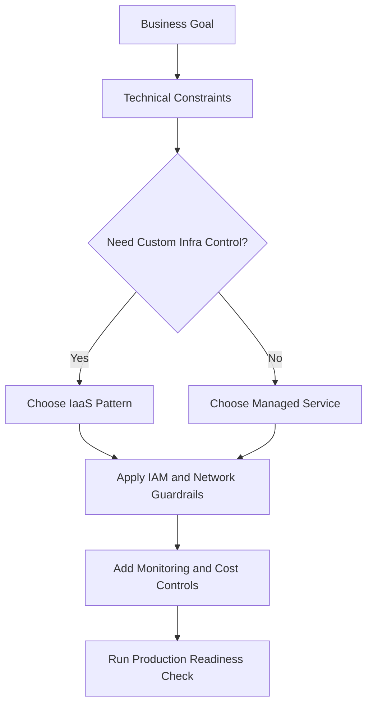
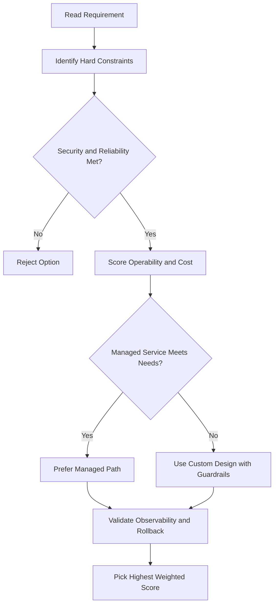
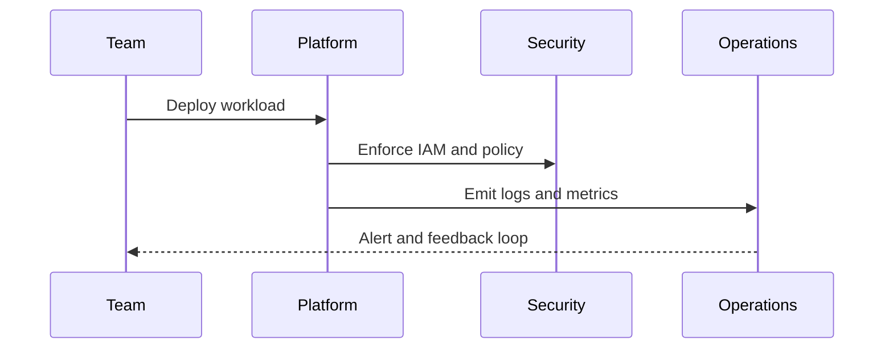

# Internal Load Balancer Lab Walkthrough

## What's Pre-Created
- A VPC network (`my-internal-app`) with two subnets (subnet A, subnet B)
- Firewall rules for ICMP, SSH, and RDP

---

## Task 1 — Create Firewall Rules

**Rule 1 — Allow HTTP:**
- Network: `my-internal-app`
- Target tag: `load-balancer-backend`
- Source IP ranges: `0.0.0.0/0`
- Protocol/port: TCP 80

**Rule 2 — Allow Health Check:**
- Network: `my-internal-app`
- Target tag: `load-balancer-backend`
- Source IP ranges: `130.211.0.0/22` and `35.191.0.0/16` (Google Cloud health checker ranges)
- Ports: allow all (or restrict to your health check port)

---

## Task 2 — Create Instance Templates

**Template 1 (subnet A):**
- Add startup script via metadata key `startup-script-url` pointing to the Cloud Storage bucket URL provided in the lab
- Networking: select `my-internal-app` network, subnet A, network tag: `load-balancer-backend`

**Template 2 (subnet B):**
- Copy template 1 → change subnet to subnet B

---

## Task 3 — Create Managed Instance Groups

**Instance Group 1:**
- Zone: `us-central1-a`
- Template: instance template 1
- Autoscaling: CPU target 80%, min 1, max 5, cool-down period 45 seconds

**Instance Group 2:**
- Zone: `us-central1-b`
- Template: instance template 2
- Same autoscaling settings

> After creation, each instance group will have one VM. Verify that group 1's VM is on subnet A and group 2's VM is on subnet B.

---

## Task 4 — Create a Utility VM

- Region: `us-central1`, zone: `us-central1-f` (or any zone in the same region)
- Machine type: small
- Network: `my-internal-app`, subnet A
- Internal IP: optionally set a custom ephemeral IP to match the lab diagram (e.g., `10.10.20.50`)

> Note: first two and last two IPs in any subnet are reserved, so usable IPs start at `.2`.

**Verify connectivity from utility VM:**
```bash
# SSH into utility VM, then curl each backend directly
curl 10.10.20.2   # instance group 1's VM
curl 10.10.30.2   # instance group 2's VM
```
Response shows the instance name, source IP, region, and zone — confirming direct connectivity.

---

## Task 5 — Create the Internal Load Balancer

**Navigation:** Network services → Load balancing → Create load balancer → TCP load balancing → Only between VMs (internal, regional)

**Backend configuration:**
- Region: `us-central1`
- Network: `my-internal-app`
- Backends: instance group 1 + instance group 2
- Health check: create new → name `my-internal-health-check`, protocol TCP, port 80

**Frontend configuration:**
- Subnet: subnet B
- Internal IP: reserve static → name `my-internal-advanced-ip`, custom address `10.10.30.5`
- Port: 80

Click **Create** and wait for the load balancer to be ready.

---

## Task 6 — Test the Load Balancer

SSH into the utility VM and curl the load balancer's internal IP:

```bash
curl 10.10.30.5
```

Run the command multiple times — you should see responses alternating between instance group 1 and instance group 2, confirming load balancing is working:

```
# Example output pattern across multiple curls:
# group 2, group 2, group 2, group 1, group 2, group 1 ...
```

## ACE Exam-Style Practice Questions

### Q1
In a Internal Load Balancer Lab scenario, two answers seem technically possible. What tie-breaker should you apply first?

A. Pick the option with most manual steps
B. Pick the option with least privilege and least operational overhead that still meets requirements
C. Pick highest-cost option
D. Pick the oldest product

Answer: B
Trap: ACE-style scenarios reward secure, managed, requirement-fit decisions.

### Q2
For Internal Load Balancer Lab, what is the best way to reduce wrong answers in multi-choice questions?

A. Ignore scaling and security words
B. Identify trigger words, eliminate over-privileged choices, then choose the managed fit
C. Always pick Compute Engine
D. Always pick the shortest option

Answer: B
Trap: Structured elimination is more reliable than memorization alone.

<!-- ACE_DEEP_ENRICHMENT_START -->
## ACE Deep Enrichment

### Think Like a Google Engineer
- Primary optimization axis: Managed-service-first design with reliability and security by default.
- Start with constraints first: SLO, security, compliance, latency, budget, and team operations capacity.
- Prefer managed services if they satisfy requirements with lower long-term operational toil.
- Minimize blast radius using environment isolation, least privilege, and failure-domain awareness.
- Design for day-2 operations: observability, rollback strategy, and quota or budget guardrails.

### Most Correct Option Filter (60 Seconds)
1. Eliminate options with broad access, single points of failure, or missing monitoring.
2. Confirm the option meets non-negotiables first: security and reliability requirements.
3. Compare remaining options on operational simplicity and long-term maintainability.
4. Use cost as an optimizer only after requirements and risk controls are satisfied.

### Weighted Decision Matrix
| Dimension | Weight | Strong Signal |
| --- | --- | --- |
| Security | 3 | Least privilege, secure defaults, no exposed blast radius |
| Reliability | 3 | Multi-zone or HA design, health checks, tested recovery path |
| Operability | 2 | Clear monitoring, alerting, rollout and rollback simplicity |
| Cost Efficiency | 2 | Right-sized resources, no waste, no reliability regression |
| Performance | 1 | Meets latency and throughput targets with headroom |

### Real-Life Scenario
A growing startup is moving from manual infrastructure to Google Cloud. They need fast delivery, better reliability, and clear operational controls while keeping architecture simple.

### Worked Example
- Translate business goals into technical constraints before selecting services.
- Favor managed services to reduce operational burden where possible.
- Apply least-privilege IAM and private-by-default networking decisions.
- Add monitoring, logging, and budget controls from the start.

### Flowchart


### Optimization Decision Flow


### Interaction Sequence


### Extra Exam Practice (15 Questions)
#### Q1
Scenario Focus: Internal Load Balancer Lab Walkthrough
Which design pattern is usually best for fast, safe cloud adoption?

A. Use managed services with least-privilege IAM and clear observability controls.
B. Start with manual scripts and unrestricted access, then harden later.
C. Use one project for everything to reduce setup effort.
D. Ignore telemetry until after first production incident.

Answer: A
Why the other options are weaker: They typically ignore at least one hard constraint such as security, reliability, cost efficiency, or operational simplicity.
Google-engineer check: Reconfirm SLO fit, blast radius, and day-2 maintainability before finalizing.

#### Q2
Scenario Focus: Internal Load Balancer Lab Walkthrough
A team wants speed and low ops overhead. What should they prioritize?

A. Use one project for everything to reduce setup effort.
B. Prefer services that reduce operational toil while meeting reliability goals.
C. Ignore telemetry until after first production incident.
D. Pick only the cheapest service regardless of reliability needs.

Answer: B
Why the other options are weaker: They typically ignore at least one hard constraint such as security, reliability, cost efficiency, or operational simplicity.
Google-engineer check: Reconfirm SLO fit, blast radius, and day-2 maintainability before finalizing.

#### Q3
Scenario Focus: Internal Load Balancer Lab Walkthrough
What is a common architecture trap in early cloud projects?

A. Ignore telemetry until after first production incident.
B. Pick only the cheapest service regardless of reliability needs.
C. Over-broad access and missing monitoring are high-risk trap patterns.
D. Keep architecture opaque to avoid governance overhead.

Answer: C
Why the other options are weaker: They typically ignore at least one hard constraint such as security, reliability, cost efficiency, or operational simplicity.
Google-engineer check: Reconfirm SLO fit, blast radius, and day-2 maintainability before finalizing.

#### Q4
Scenario Focus: Internal Load Balancer Lab Walkthrough
Which control set should be baseline for production?

A. Pick only the cheapest service regardless of reliability needs.
B. Keep architecture opaque to avoid governance overhead.
C. Start with manual scripts and unrestricted access, then harden later.
D. Baseline should include IAM guardrails, logging, monitoring, and cost alerts.

Answer: D
Why the other options are weaker: They typically ignore at least one hard constraint such as security, reliability, cost efficiency, or operational simplicity.
Google-engineer check: Reconfirm SLO fit, blast radius, and day-2 maintainability before finalizing.

#### Q5
Scenario Focus: Internal Load Balancer Lab Walkthrough
How should you evaluate conflicting requirements on the exam?

A. Choose the option that balances security, reliability, cost, and operability.
B. Keep architecture opaque to avoid governance overhead.
C. Start with manual scripts and unrestricted access, then harden later.
D. Use one project for everything to reduce setup effort.

Answer: A
Why the other options are weaker: They typically ignore at least one hard constraint such as security, reliability, cost efficiency, or operational simplicity.
Google-engineer check: Reconfirm SLO fit, blast radius, and day-2 maintainability before finalizing.

#### Q6
Scenario Focus: Internal Load Balancer Lab Walkthrough
Two designs both satisfy the happy path for Internal Load Balancer Lab Walkthrough. Which choice is most correct?

A. Start with manual scripts and unrestricted access, then harden later.
B. Choose the option that preserves reliability and security while reducing operational burden.
C. Use one project for everything to reduce setup effort.
D. Ignore telemetry until after first production incident.

Answer: B
Why the other options are weaker: They typically ignore at least one hard constraint such as security, reliability, cost efficiency, or operational simplicity.
Google-engineer check: Reconfirm SLO fit, blast radius, and day-2 maintainability before finalizing.

#### Q7
Scenario Focus: Internal Load Balancer Lab Walkthrough
What should you validate first before choosing an architecture for Internal Load Balancer Lab Walkthrough?

A. Use one project for everything to reduce setup effort.
B. Ignore telemetry until after first production incident.
C. Validate SLO fit, blast radius, and least-privilege controls before comparing convenience.
D. Pick only the cheapest service regardless of reliability needs.

Answer: C
Why the other options are weaker: They typically ignore at least one hard constraint such as security, reliability, cost efficiency, or operational simplicity.
Google-engineer check: Reconfirm SLO fit, blast radius, and day-2 maintainability before finalizing.

#### Q8
Scenario Focus: Internal Load Balancer Lab Walkthrough
A proposal lowers cost but increases failure risk. What is the best decision?

A. Ignore telemetry until after first production incident.
B. Pick only the cheapest service regardless of reliability needs.
C. Keep architecture opaque to avoid governance overhead.
D. Reject it unless reliability and recovery objectives remain within required targets.

Answer: D
Why the other options are weaker: They typically ignore at least one hard constraint such as security, reliability, cost efficiency, or operational simplicity.
Google-engineer check: Reconfirm SLO fit, blast radius, and day-2 maintainability before finalizing.

#### Q9
Scenario Focus: Internal Load Balancer Lab Walkthrough
Which option best reflects optimization for Managed-service-first design with reliability and security by default?

A. Select the design that best meets Managed-service-first design with reliability and security by default while keeping constraints balanced.
B. Pick only the cheapest service regardless of reliability needs.
C. Keep architecture opaque to avoid governance overhead.
D. Start with manual scripts and unrestricted access, then harden later.

Answer: A
Why the other options are weaker: They typically ignore at least one hard constraint such as security, reliability, cost efficiency, or operational simplicity.
Google-engineer check: Reconfirm SLO fit, blast radius, and day-2 maintainability before finalizing.

#### Q10
Scenario Focus: Internal Load Balancer Lab Walkthrough
How should you evaluate a design that needs frequent manual interventions?

A. Keep architecture opaque to avoid governance overhead.
B. Treat it as high risk and prefer automation-friendly designs with observability and rollback.
C. Start with manual scripts and unrestricted access, then harden later.
D. Use one project for everything to reduce setup effort.

Answer: B
Why the other options are weaker: They typically ignore at least one hard constraint such as security, reliability, cost efficiency, or operational simplicity.
Google-engineer check: Reconfirm SLO fit, blast radius, and day-2 maintainability before finalizing.

#### Q11
Scenario Focus: Internal Load Balancer Lab Walkthrough
Two options have similar latency. Which tie-breaker is best?

A. Start with manual scripts and unrestricted access, then harden later.
B. Use one project for everything to reduce setup effort.
C. Pick the option with stronger operability, clearer failure isolation, and simpler incident response.
D. Ignore telemetry until after first production incident.

Answer: C
Why the other options are weaker: They typically ignore at least one hard constraint such as security, reliability, cost efficiency, or operational simplicity.
Google-engineer check: Reconfirm SLO fit, blast radius, and day-2 maintainability before finalizing.

#### Q12
Scenario Focus: Internal Load Balancer Lab Walkthrough
What is the best way to choose between a custom stack and a managed service?

A. Use one project for everything to reduce setup effort.
B. Ignore telemetry until after first production incident.
C. Pick only the cheapest service regardless of reliability needs.
D. Prefer managed services when they meet requirements with lower long-term maintenance effort.

Answer: D
Why the other options are weaker: They typically ignore at least one hard constraint such as security, reliability, cost efficiency, or operational simplicity.
Google-engineer check: Reconfirm SLO fit, blast radius, and day-2 maintainability before finalizing.

#### Q13
Scenario Focus: Internal Load Balancer Lab Walkthrough
How do you confirm a solution is production-ready for 

A. Verify monitoring, alerting, rollback path, quota and budget controls, and secure defaults.
B. Ignore telemetry until after first production incident.
C. Pick only the cheapest service regardless of reliability needs.
D. Keep architecture opaque to avoid governance overhead.

Answer: A
Why the other options are weaker: They typically ignore at least one hard constraint such as security, reliability, cost efficiency, or operational simplicity.
Google-engineer check: Reconfirm SLO fit, blast radius, and day-2 maintainability before finalizing.

#### Q14
Scenario Focus: Internal Load Balancer Lab Walkthrough
Which pattern usually wins in ACE scenario tie-breakers?

A. Pick only the cheapest service regardless of reliability needs.
B. Managed-service-first plus least-privilege access plus clear observability usually wins.
C. Keep architecture opaque to avoid governance overhead.
D. Start with manual scripts and unrestricted access, then harden later.

Answer: B
Why the other options are weaker: They typically ignore at least one hard constraint such as security, reliability, cost efficiency, or operational simplicity.
Google-engineer check: Reconfirm SLO fit, blast radius, and day-2 maintainability before finalizing.

#### Q15
Scenario Focus: Internal Load Balancer Lab Walkthrough
What is the best final check before locking the answer?

A. Keep architecture opaque to avoid governance overhead.
B. Start with manual scripts and unrestricted access, then harden later.
C. Run a weighted check across security, reliability, cost, performance, and operability.
D. Use one project for everything to reduce setup effort.

Answer: C
Why the other options are weaker: They typically ignore at least one hard constraint such as security, reliability, cost efficiency, or operational simplicity.
Google-engineer check: Reconfirm SLO fit, blast radius, and day-2 maintainability before finalizing.

### Quick Commands
```bash
gcloud config list
gcloud projects describe PROJECT_ID
gcloud services list --enabled --project=PROJECT_ID
gcloud logging read "severity>=WARNING" --project=PROJECT_ID --freshness=2d --limit=20
```

### Fast Recall
- Good cloud design is constraint-driven, not tool-driven.
- Managed services usually improve delivery speed and reliability.
- Security and observability should be built in from day one.
<!-- ACE_DEEP_ENRICHMENT_END -->