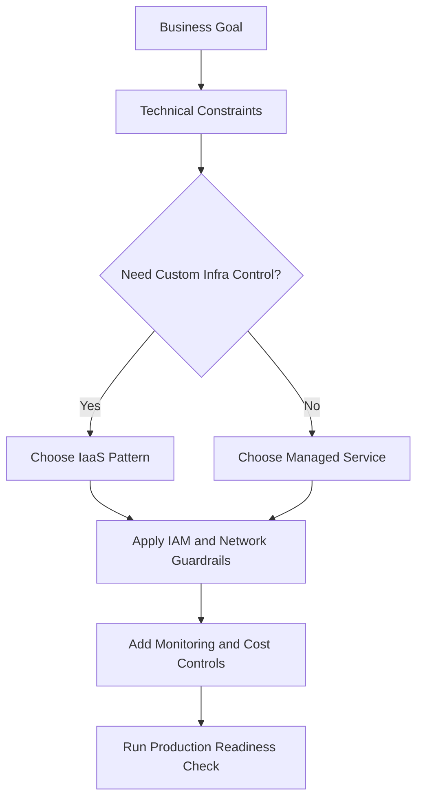
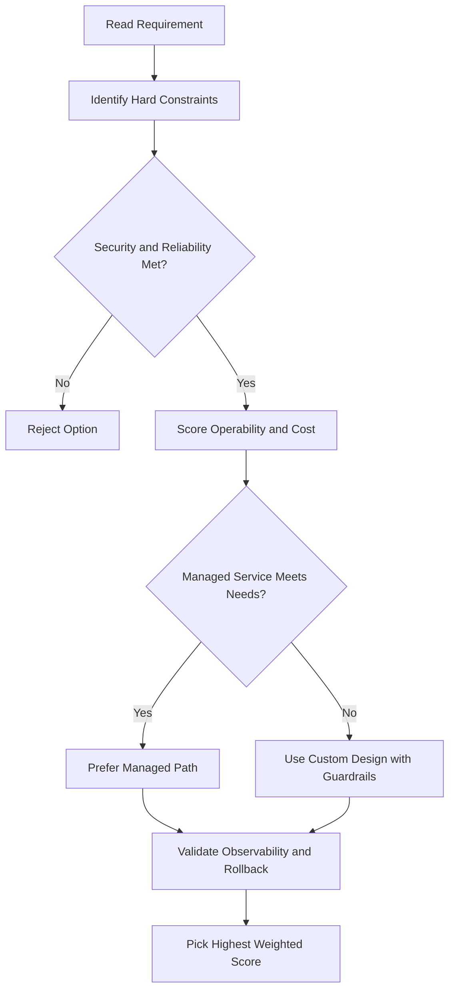
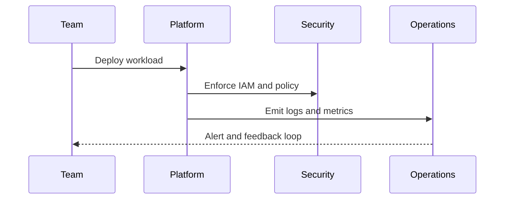

# Choosing the Right Load Balancer

## Decision by Traffic Type

| Traffic Type | Choose |
|---|---|
| HTTP(S) — flexible feature set | **Application Load Balancer** |
| TLS offload, TCP proxy, external LB to backends in multiple regions | **Proxy Network Load Balancer** |
| Preserve client source IP, avoid proxy overhead, UDP/ESP/ICMP protocols, expose client IP to apps | **Passthrough Network Load Balancer** |

---

## Further Narrowing by Scope and Direction

After choosing the traffic type, narrow down based on:

1. **External** (internet-facing) vs. **Internal** (within VPC)
2. **Global** backends vs. **Regional** backends

| Load Balancer | External / Internal | Global / Regional | Scheme |
|---|---|---|---|
| Global external Application LB | External | Global | MANAGED (GFE or Envoy) |
| Regional external Application LB | External | Regional | MANAGED (Envoy) |
| Classic Application LB | External | Global | MANAGED (GFE) |
| Regional internal Application LB | Internal | Regional | MANAGED (Envoy) |
| Cross-region internal Application LB | Internal | Global | MANAGED (Envoy) |
| Global external proxy Network LB | External | Global | MANAGED (GFE or Envoy) |
| Regional external proxy Network LB | External | Regional | MANAGED (Envoy) |
| Regional internal proxy Network LB | Internal | Regional | MANAGED (Envoy) |
| Cross-region internal proxy Network LB | Internal | Global | MANAGED (Envoy) |
| External passthrough Network LB | External | Regional | — |
| Internal passthrough Network LB | Internal | Regional | — |

---

## Key Concepts

- **Load-balancing scheme** — an attribute on the forwarding rule and backend service; indicates whether the LB handles internal or external traffic
- **MANAGED scheme** — load balancer is implemented as a managed service on **Google Front Ends (GFEs)** or **open-source Envoy proxy**; requests are routed to GFE or Envoy
- **Passthrough LBs** — not proxy-based; packets flow directly to backends with source/destination unchanged

## ACE Exam-Style Practice Questions

### Q1
A Choosing Load Balancer requirement needs host and path-based routing for internet users with managed TLS. Which option is best?

A. External Application Load Balancer
B. Internal passthrough load balancer
C. Cloud NAT
D. Direct VM IP without load balancing

Answer: A
Trap: URL map and host routing are Layer 7 capabilities.

### Q2
In a Choosing Load Balancer case, you must preserve original client IP and handle UDP. Which option should you pick?

A. Application Load Balancer
B. Passthrough Network Load Balancer
C. Cloud CDN only
D. Cloud DNS private zone

Answer: B
Trap: Client-IP preservation and UDP are Layer 4 passthrough patterns.

<!-- ACE_DEEP_ENRICHMENT_START -->
## ACE Deep Enrichment

### Think Like a Google Engineer
- Primary optimization axis: Managed-service-first design with reliability and security by default.
- Start with constraints first: SLO, security, compliance, latency, budget, and team operations capacity.
- Prefer managed services if they satisfy requirements with lower long-term operational toil.
- Minimize blast radius using environment isolation, least privilege, and failure-domain awareness.
- Design for day-2 operations: observability, rollback strategy, and quota or budget guardrails.

### Most Correct Option Filter (60 Seconds)
1. Eliminate options with broad access, single points of failure, or missing monitoring.
2. Confirm the option meets non-negotiables first: security and reliability requirements.
3. Compare remaining options on operational simplicity and long-term maintainability.
4. Use cost as an optimizer only after requirements and risk controls are satisfied.

### Weighted Decision Matrix
| Dimension | Weight | Strong Signal |
| --- | --- | --- |
| Security | 3 | Least privilege, secure defaults, no exposed blast radius |
| Reliability | 3 | Multi-zone or HA design, health checks, tested recovery path |
| Operability | 2 | Clear monitoring, alerting, rollout and rollback simplicity |
| Cost Efficiency | 2 | Right-sized resources, no waste, no reliability regression |
| Performance | 1 | Meets latency and throughput targets with headroom |

### Real-Life Scenario
A growing startup is moving from manual infrastructure to Google Cloud. They need fast delivery, better reliability, and clear operational controls while keeping architecture simple.

### Worked Example
- Translate business goals into technical constraints before selecting services.
- Favor managed services to reduce operational burden where possible.
- Apply least-privilege IAM and private-by-default networking decisions.
- Add monitoring, logging, and budget controls from the start.

### Flowchart


### Optimization Decision Flow


### Interaction Sequence


### Extra Exam Practice (15 Questions)
#### Q1

Scenario Focus: Choosing the Right Load Balancer

Which design pattern is usually best for fast, safe cloud adoption?

A. Use managed services with least-privilege IAM and clear observability controls.  
B. Start with manual scripts and unrestricted access, then harden later.  
C. Use one project for everything to reduce setup effort.  
D. Ignore telemetry until after first production incident.

Answer: A  
Why the other options are weaker: They typically ignore at least one hard constraint such as security, reliability, cost efficiency, or operational simplicity.  
Google-engineer check: Reconfirm SLO fit, blast radius, and day-2 maintainability before finalizing.

#### Q2

Scenario Focus: Choosing the Right Load Balancer

A team wants speed and low ops overhead. What should they prioritize?

A. Use one project for everything to reduce setup effort.  
B. Prefer services that reduce operational toil while meeting reliability goals.  
C. Ignore telemetry until after first production incident.  
D. Pick only the cheapest service regardless of reliability needs.

Answer: B  
Why the other options are weaker: They typically ignore at least one hard constraint such as security, reliability, cost efficiency, or operational simplicity.  
Google-engineer check: Reconfirm SLO fit, blast radius, and day-2 maintainability before finalizing.

#### Q3

Scenario Focus: Choosing the Right Load Balancer

What is a common architecture trap in early cloud projects?

A. Ignore telemetry until after first production incident.  
B. Pick only the cheapest service regardless of reliability needs.  
C. Over-broad access and missing monitoring are high-risk trap patterns.  
D. Keep architecture opaque to avoid governance overhead.

Answer: C  
Why the other options are weaker: They typically ignore at least one hard constraint such as security, reliability, cost efficiency, or operational simplicity.  
Google-engineer check: Reconfirm SLO fit, blast radius, and day-2 maintainability before finalizing.

#### Q4

Scenario Focus: Choosing the Right Load Balancer

Which control set should be baseline for production?

A. Pick only the cheapest service regardless of reliability needs.  
B. Keep architecture opaque to avoid governance overhead.  
C. Start with manual scripts and unrestricted access, then harden later.  
D. Baseline should include IAM guardrails, logging, monitoring, and cost alerts.

Answer: D  
Why the other options are weaker: They typically ignore at least one hard constraint such as security, reliability, cost efficiency, or operational simplicity.  
Google-engineer check: Reconfirm SLO fit, blast radius, and day-2 maintainability before finalizing.

#### Q5

Scenario Focus: Choosing the Right Load Balancer

How should you evaluate conflicting requirements on the exam?

A. Choose the option that balances security, reliability, cost, and operability.  
B. Keep architecture opaque to avoid governance overhead.  
C. Start with manual scripts and unrestricted access, then harden later.  
D. Use one project for everything to reduce setup effort.

Answer: A  
Why the other options are weaker: They typically ignore at least one hard constraint such as security, reliability, cost efficiency, or operational simplicity.  
Google-engineer check: Reconfirm SLO fit, blast radius, and day-2 maintainability before finalizing.

#### Q6

Scenario Focus: Choosing the Right Load Balancer

Two designs both satisfy the happy path for Choosing the Right Load Balancer. Which choice is most correct?

A. Start with manual scripts and unrestricted access, then harden later.  
B. Choose the option that preserves reliability and security while reducing operational burden.  
C. Use one project for everything to reduce setup effort.  
D. Ignore telemetry until after first production incident.

Answer: B  
Why the other options are weaker: They typically ignore at least one hard constraint such as security, reliability, cost efficiency, or operational simplicity.  
Google-engineer check: Reconfirm SLO fit, blast radius, and day-2 maintainability before finalizing.

#### Q7

Scenario Focus: Choosing the Right Load Balancer

What should you validate first before choosing an architecture for Choosing the Right Load Balancer?

A. Use one project for everything to reduce setup effort.  
B. Ignore telemetry until after first production incident.  
C. Validate SLO fit, blast radius, and least-privilege controls before comparing convenience.  
D. Pick only the cheapest service regardless of reliability needs.

Answer: C  
Why the other options are weaker: They typically ignore at least one hard constraint such as security, reliability, cost efficiency, or operational simplicity.  
Google-engineer check: Reconfirm SLO fit, blast radius, and day-2 maintainability before finalizing.

#### Q8

Scenario Focus: Choosing the Right Load Balancer

A proposal lowers cost but increases failure risk. What is the best decision?

A. Ignore telemetry until after first production incident.  
B. Pick only the cheapest service regardless of reliability needs.  
C. Keep architecture opaque to avoid governance overhead.  
D. Reject it unless reliability and recovery objectives remain within required targets.

Answer: D  
Why the other options are weaker: They typically ignore at least one hard constraint such as security, reliability, cost efficiency, or operational simplicity.  
Google-engineer check: Reconfirm SLO fit, blast radius, and day-2 maintainability before finalizing.

#### Q9

Scenario Focus: Choosing the Right Load Balancer

Which option best reflects optimization for Managed-service-first design with reliability and security by default?

A. Select the design that best meets Managed-service-first design with reliability and security by default while keeping constraints balanced.  
B. Pick only the cheapest service regardless of reliability needs.  
C. Keep architecture opaque to avoid governance overhead.  
D. Start with manual scripts and unrestricted access, then harden later.

Answer: A  
Why the other options are weaker: They typically ignore at least one hard constraint such as security, reliability, cost efficiency, or operational simplicity.  
Google-engineer check: Reconfirm SLO fit, blast radius, and day-2 maintainability before finalizing.

#### Q10

Scenario Focus: Choosing the Right Load Balancer

How should you evaluate a design that needs frequent manual interventions?

A. Keep architecture opaque to avoid governance overhead.  
B. Treat it as high risk and prefer automation-friendly designs with observability and rollback.  
C. Start with manual scripts and unrestricted access, then harden later.  
D. Use one project for everything to reduce setup effort.

Answer: B  
Why the other options are weaker: They typically ignore at least one hard constraint such as security, reliability, cost efficiency, or operational simplicity.  
Google-engineer check: Reconfirm SLO fit, blast radius, and day-2 maintainability before finalizing.

#### Q11

Scenario Focus: Choosing the Right Load Balancer

Two options have similar latency. Which tie-breaker is best?

A. Start with manual scripts and unrestricted access, then harden later.  
B. Use one project for everything to reduce setup effort.  
C. Pick the option with stronger operability, clearer failure isolation, and simpler incident response.  
D. Ignore telemetry until after first production incident.

Answer: C  
Why the other options are weaker: They typically ignore at least one hard constraint such as security, reliability, cost efficiency, or operational simplicity.  
Google-engineer check: Reconfirm SLO fit, blast radius, and day-2 maintainability before finalizing.

#### Q12

Scenario Focus: Choosing the Right Load Balancer

What is the best way to choose between a custom stack and a managed service?

A. Use one project for everything to reduce setup effort.  
B. Ignore telemetry until after first production incident.  
C. Pick only the cheapest service regardless of reliability needs.  
D. Prefer managed services when they meet requirements with lower long-term maintenance effort.

Answer: D  
Why the other options are weaker: They typically ignore at least one hard constraint such as security, reliability, cost efficiency, or operational simplicity.  
Google-engineer check: Reconfirm SLO fit, blast radius, and day-2 maintainability before finalizing.

#### Q13

Scenario Focus: Choosing the Right Load Balancer

How do you confirm a solution is production-ready for 

A. Verify monitoring, alerting, rollback path, quota and budget controls, and secure defaults.  
B. Ignore telemetry until after first production incident.  
C. Pick only the cheapest service regardless of reliability needs.  
D. Keep architecture opaque to avoid governance overhead.

Answer: A  
Why the other options are weaker: They typically ignore at least one hard constraint such as security, reliability, cost efficiency, or operational simplicity.  
Google-engineer check: Reconfirm SLO fit, blast radius, and day-2 maintainability before finalizing.

#### Q14

Scenario Focus: Choosing the Right Load Balancer

Which pattern usually wins in ACE scenario tie-breakers?

A. Pick only the cheapest service regardless of reliability needs.  
B. Managed-service-first plus least-privilege access plus clear observability usually wins.  
C. Keep architecture opaque to avoid governance overhead.  
D. Start with manual scripts and unrestricted access, then harden later.

Answer: B  
Why the other options are weaker: They typically ignore at least one hard constraint such as security, reliability, cost efficiency, or operational simplicity.  
Google-engineer check: Reconfirm SLO fit, blast radius, and day-2 maintainability before finalizing.

#### Q15

Scenario Focus: Choosing the Right Load Balancer

What is the best final check before locking the answer?

A. Keep architecture opaque to avoid governance overhead.  
B. Start with manual scripts and unrestricted access, then harden later.  
C. Run a weighted check across security, reliability, cost, performance, and operability.  
D. Use one project for everything to reduce setup effort.

Answer: C  
Why the other options are weaker: They typically ignore at least one hard constraint such as security, reliability, cost efficiency, or operational simplicity.  
Google-engineer check: Reconfirm SLO fit, blast radius, and day-2 maintainability before finalizing.

### Quick Commands
```bash
gcloud config list
gcloud projects describe PROJECT_ID
gcloud services list --enabled --project=PROJECT_ID
gcloud logging read "severity>=WARNING" --project=PROJECT_ID --freshness=2d --limit=20
```

### Fast Recall
- Good cloud design is constraint-driven, not tool-driven.
- Managed services usually improve delivery speed and reliability.
- Security and observability should be built in from day one.
<!-- ACE_DEEP_ENRICHMENT_END -->