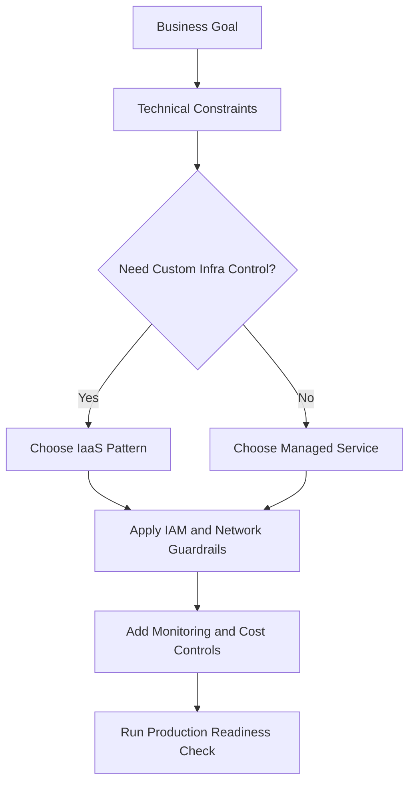
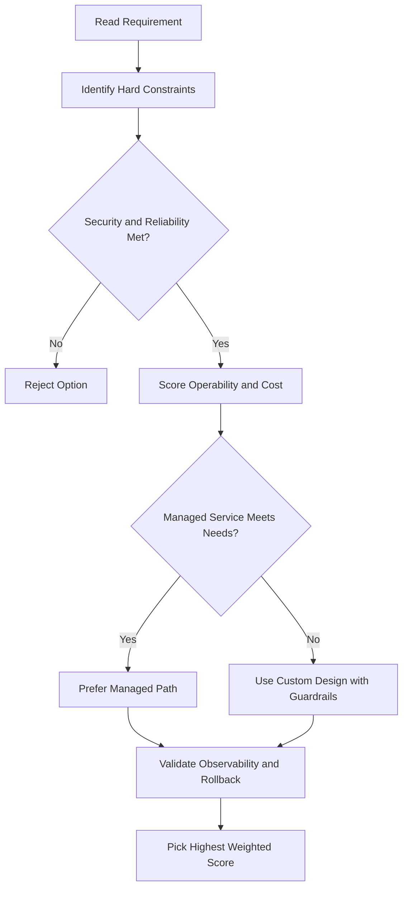
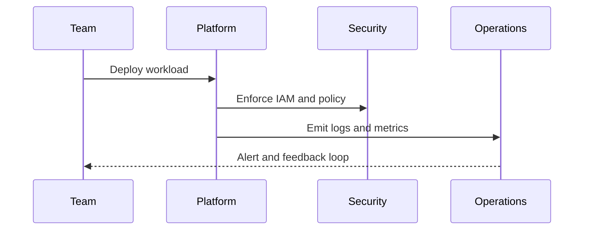

# Terraform and Infrastructure as Code

## Infrastructure as Code (IaC)

- Enables **quick provisioning and removal** of infrastructure on demand
- Can be integrated into a **CI/CD pipeline** for continuous deployment
- Infrastructure complexity is managed in code — changes are in one place
- Dev/test environments can easily **replicate production** and be deleted when not needed
- Google Cloud supports: **Terraform**, Chef, Puppet, Ansible, Packer

---

## Terraform Overview

- Provisions GCP resources — VMs, containers, storage, networking — using **declarative configuration files**
- Written in **HashiCorp Configuration Language (HCL)**: concise, human-readable blocks, arguments, and expressions
- **Declarative approach** — you specify _what_ you want; Terraform figures out _how_ to create it
- Deploys resources **in parallel** (unlike Cloud Shell which runs commands sequentially)
- Uses underlying GCP APIs; supports almost everything: instances, instance templates, VPC networks, firewall rules, VPN tunnels, Cloud Routers, load balancers, and more
- Already installed in **Cloud Shell**
- Works across multiple public and private clouds

### When to Use What

| Tool        | Best For                                               |
| ----------- | ------------------------------------------------------ |
| GCP Console | New to a service; prefer a UI                          |
| Cloud Shell | Comfortable with a service; quick CLI commands         |
| Terraform   | Repeatable, version-controlled infrastructure at scale |

---

## Terraform Language Structure

| Construct          | Description                                                                  |
| ------------------ | ---------------------------------------------------------------------------- |
| **Provider block** | Specifies the cloud provider (e.g., Google Cloud) and region                 |
| **Resource block** | Defines a GCP resource (e.g., Compute Engine VM, VPC network, firewall rule) |
| **Output block**   | Declares an output variable (e.g., an instance IP)                           |
| **Block**          | Represents an object; has zero or more labels and a body                     |
| **Argument**       | Assigns a value to a name inside a block                                     |
| **Expression**     | Represents a value that can be assigned to an identifier                     |

Configurations can span **multiple files and directories**; resources can be abstracted into **reusable modules**.

---

## Example — `main.tf` for Auto Mode Network with HTTP Firewall Rule

```hcl
provider "google" {
  region = "us-central1"
}

resource "google_compute_network" "my_network" {
  name                    = "my-auto-network"
  auto_create_subnetworks = true
  mtu                     = 1460
}

resource "google_compute_firewall" "http_firewall" {
  name    = "allow-http"
  network = google_compute_network.my_network.name

  allow {
    protocol = "tcp"
    ports    = ["80", "8080"]
  }
}

output "instance_ip" {
  value = google_compute_instance.my_vm.network_interface[0].access_config[0].nat_ip
}
```

---

## Core Terraform Commands

| Command           | Purpose                                                                                                         |
| ----------------- | --------------------------------------------------------------------------------------------------------------- |
| `terraform init`  | Initializes the configuration; downloads and installs the provider plugin (run in the same folder as `main.tf`) |
| `terraform plan`  | Shows what actions Terraform will take to reach the desired state — **no changes are made**                     |
| `terraform apply` | Creates or updates the infrastructure defined in the configuration files                                        |
| `terraform fmt`   | Rewrites configuration files into canonical format and style                                                    |

---

## Lab Walkthrough — Automating Infrastructure with Terraform

### What This Lab Covers

- Configure Cloud Shell with Terraform
- Create a VPC network and firewall rule using Terraform
- Build a reusable instance module
- Deploy two VM instances using that module
- Verify all resources in the GCP Console

---

### Step 1 — Verify Terraform in Cloud Shell

```bash
terraform version
```

- Terraform is pre-installed in Cloud Shell — no setup needed
- The lab works with version 12.2 or later

---

### Step 2 — Create the Provider File

Create a folder (e.g., `tf-infra`), open the Cloud Shell code editor, and create `provider.tf`:

```hcl
provider "google" {}
```

- This tells Terraform to use Google Cloud as the provider
- Run `terraform init` in the folder to download and initialize the Google provider plugin

---

### Step 3 — Create the VPC Network (`mynetwork.tf`)

```hcl
resource "google_compute_network" "mynetwork" {
  name                    = "mynetwork"
  auto_create_subnetworks = true
}
```

- `auto_create_subnetworks = true` → auto mode network; subnets are created in every region automatically

---

### Step 4 — Add the Firewall Rule (same file)

```hcl
resource "google_compute_firewall" "mynetwork_allow_http_ssh_rdp_icmp" {
  name    = "mynetwork-allow-http-ssh-rdp-icmp"
  network = google_compute_network.mynetwork.self_link

  allow {
    protocol = "tcp"
    ports    = ["22", "80", "3389"]
  }

  allow {
    protocol = "icmp"
  }
}
```

- `network = google_compute_network.mynetwork.self_link` → **self-link reference**: Terraform creates the network first before the firewall rule (dependency ordering)
- Allows: SSH (22), HTTP (80), RDP (3389), and ICMP (ping)

---

### Step 5 — Create the Instance Module

Create a subfolder `instance/` inside `tf-infra/`, then create `instance/main.tf`:

```hcl
variable "instance_name" {}
variable "instance_zone" {}
variable "instance_type" {
  default = "e2-micro"
}
variable "instance_subnetwork" {}

resource "google_compute_instance" "vm_instance" {
  name         = var.instance_name
  zone         = var.instance_zone
  machine_type = var.instance_type

  boot_disk {
    initialize_params {
      image = "debian-cloud/debian-11"
    }
  }

  network_interface {
    subnetwork = var.instance_subnetwork
    access_config {}
  }
}
```

- Input variables (`instance_name`, `instance_zone`, `instance_subnetwork`) are passed in from the parent configuration
- `instance_type` has a default value of `e2-micro` — no need to pass it unless you want a different type
- `access_config {}` allocates an external (public) IP to the instance

---

### Step 6 — Use the Module in `mynetwork.tf`

Add two module blocks to `mynetwork.tf` to create two VM instances:

```hcl
module "mynet-us-vm" {
  source              = "./instance"
  instance_name       = "mynet-us-vm"
  instance_zone       = "us-central1-a"
  instance_subnetwork = google_compute_network.mynetwork.self_link
}

module "mynet-eu-vm" {
  source              = "./instance"
  instance_name       = "mynet-eu-vm"
  instance_zone       = "europe-west1-d"
  instance_subnetwork = google_compute_network.mynetwork.self_link
}
```

- Both modules reuse the same `instance/` module with different input variables
- `self_link` references ensure instances are created only after the network exists

---

### Step 7 — Format, Init, Plan, Apply

```bash
# Format all files into canonical style
terraform fmt

# Re-initialize to pick up the new module
terraform init

# Preview what will be created (no changes made)
terraform plan

# Apply the configuration — type "yes" when prompted
terraform apply
```

**Apply creates 4 resources in this order:**

1. `google_compute_network.mynetwork` (created first — others depend on it)
2. `google_compute_firewall.mynetwork_allow_http_ssh_rdp_icmp` (in parallel with VMs, after network)
3. `module.mynet-us-vm` (in parallel)
4. `module.mynet-eu-vm` (in parallel)

> Terraform prints a progress update every 10 seconds while resources are being created.

---

### Step 8 — Verify in the GCP Console

| Where to check     | What to look for                                            |
| ------------------ | ----------------------------------------------------------- |
| **VPC Network**    | `mynetwork` appears as an auto mode network                 |
| **Firewall Rules** | `mynetwork-allow-http-ssh-rdp-icmp` rule is listed          |
| **Compute Engine** | Two VM instances (`mynet-us-vm`, `mynet-eu-vm`) are running |

### Step 9 — Test Connectivity

SSH into one VM and ping the other:

```bash
ping -c 3 <internal-or-external-IP-of-other-VM>
```

- Works because both VMs are on the same network and the firewall rule allows ICMP traffic

---

### Key Takeaways

- Terraform **incremental execution plans** let you build infrastructure step-by-step as config evolves
- **Modules** allow you to reuse the same resource config for multiple resources, with input variables for customization
- **Self-link references** enforce dependency ordering — Terraform knows to create dependent resources first
- Resources with no dependencies are created **in parallel**, making deployments faster
- The configuration you build can serve as a **starting point for future deployments**

---

## Variables and Outputs

### `variables.tf` — Input Variables

```hcl
variable "project_id" {
  description = "The GCP project ID"
  type        = string
  default     = "my-project-id"
}

variable "region" {
  default = "us-central1"
}

variable "zone" {
  default = "us-central1-a"
}
```

- Variables **without a default** are required — Terraform will prompt for them at apply time
- Variables **with a default** are optional — the default is used unless overridden
- Reference variables anywhere with `var.<name>` e.g. `var.project_id`
- Every module (root and child) should have its own `variables.tf`

### `outputs.tf` — Output Values

```hcl
output "bucket_name" {
  description = "The name of the created bucket"
  value       = google_storage_bucket.my_bucket.name
}
```

- Outputs are printed after `terraform apply` completes
- Child module outputs are accessed in the parent as `module.<module_name>.<output_name>`
- Useful for passing resource IDs/names between modules

---

## Terraform State

### What State Is

- Terraform stores a mapping between your config and the real-world resources it manages in a **state file** (`terraform.tfstate`)
- State tracks: resource IDs, metadata, dependency order, and cached attribute values
- Without state, Terraform cannot know what already exists and would try to recreate everything

### Why State Matters

| Purpose         | Detail                                                                           |
| --------------- | -------------------------------------------------------------------------------- |
| **Mapping**     | Links `resource "google_compute_instance" "foo"` → actual VM `i-abcd1234` in GCP |
| **Metadata**    | Stores dependency order so resources are destroyed in the right sequence         |
| **Performance** | Caches attribute values — avoids querying every resource on every `plan`         |
| **Sync**        | Remote state ensures everyone on a team works from the same source of truth      |

### Key State Commands

```bash
terraform show          # Print current state in human-readable form
terraform refresh       # Sync state with real-world infrastructure (no changes made)
terraform state list    # List all resources tracked in state
```

---

## Backends

A **backend** defines where Terraform stores its state and how operations are executed.

### Local Backend (default)

```hcl
terraform {
  backend "local" {
    path = "terraform/state/terraform.tfstate"
  }
}
```

- State stored on the local filesystem
- Fine for individual use; not suitable for teams

### GCS Backend (recommended for GCP teams)

```hcl
terraform {
  backend "gcs" {
    bucket = "my-tf-state-bucket"
    prefix = "terraform/state"
  }
}
```

- State stored as an object in a Cloud Storage bucket
- Supports **state locking** — prevents two users running `apply` at the same time
- State file path in bucket: `terraform/state/default.tfstate`

### Switching Backends

```bash
# After changing the backend block in main.tf, re-initialize:
terraform init -migrate-state
# Type "yes" to copy existing state to the new backend
```

- `terraform init` must be re-run any time the backend config changes
- Terraform will offer to migrate (copy) your existing state automatically

---

## Terraform Import

Use `terraform import` to bring **existing infrastructure** (created outside Terraform) under Terraform's management.

### Import Workflow (5 steps)

1. Identify the existing resource to import
2. Write an empty (or minimal) resource block in your `.tf` file
3. Run `terraform import` to load it into state
4. Run `terraform show` to see what was imported, then update your config to match
5. Run `terraform plan` to confirm no unexpected changes remain, then `terraform apply`

### Example — Import a VM

```bash
# 1. Add an empty resource block to your .tf file:
resource "google_compute_instance" "my_vm" {}

# 2. Import the existing VM into state:
terraform import google_compute_instance.my_vm \
  projects/PROJECT_ID/zones/ZONE/instances/INSTANCE_NAME

# 3. View what was imported:
terraform show

# 4. Seed your config from state (then manually trim to required args only):
terraform show -no-color > my_vm.tf

# 5. Verify plan is clean:
terraform plan
```

### Import Into a Module

```bash
terraform import module.instances.google_compute_instance.tf-instance-1 \
  projects/PROJECT_ID/zones/ZONE/instances/tf-instance-1
```

### Important Limitations

- Import only knows the **current state** — not whether the resource is healthy or why it was created
- Import does **not** generate configuration — you must write (or copy from `terraform show`) the HCL yourself
- Not all resources support import — check the provider documentation

---

## Modules from the Terraform Registry

The [Terraform Registry](https://registry.terraform.io) hosts community and official modules you can use directly.

### Using a Registry Module

```hcl
module "vpc" {
  source  = "terraform-google-modules/network/google"
  version = "10.0.0"

  project_id   = var.project_id
  network_name = "my-vpc"
  routing_mode = "GLOBAL"

  subnets = [
    {
      subnet_name   = "subnet-01"
      subnet_ip     = "10.10.10.0/24"
      subnet_region = "us-east1"
    }
  ]
}
```

- `source` — registry path in format `<namespace>/<module>/<provider>`
- `version` — always pin to a specific version to avoid breaking changes
- Run `terraform init` after adding a new module to download it
- Module outputs are accessed as `module.vpc.<output_name>`

### Recommended Module Structure

```
main.tf         # Main resources
variables.tf    # Input variable definitions
outputs.tf      # Output value definitions
README.md       # Documentation (not used by Terraform)
LICENSE         # License (not used by Terraform)
```

Files **not** to distribute with a module:

- `terraform.tfstate` / `terraform.tfstate.backup` — instance-specific state
- `.terraform/` — downloaded plugins and modules
- `*.tfvars` — variable value files

---

## Destroying Infrastructure

```bash
# Destroy all resources managed by the current configuration
terraform destroy
```

- Terraform reads state and destroys resources **in reverse dependency order**
- Prompts for confirmation — type `yes`
- Use `force_destroy = true` on storage buckets to allow destroying non-empty buckets:

```hcl
resource "google_storage_bucket" "my_bucket" {
  name          = "my-bucket"
  force_destroy = true
}
```

### Targeted Destroy / Apply

```bash
# Apply or destroy a single resource only
terraform apply  -target=module.instances.google_compute_instance.tf-instance-1 -auto-approve
terraform destroy -target=google_compute_firewall.tf-firewall -auto-approve
```

- `-target` is for **emergency/recovery use only** — not normal workflow
- Always run a plain `terraform apply` afterward to ensure state is fully in sync

## ACE Exam-Style Practice Questions

### Q1
For Terraform, the company wants repeatable multi-environment provisioning with minimal repetitive code. What should you use?

A. IaC templates and modules
B. Manual console steps each time
C. Ad-hoc scripts without version control
D. Spreadsheet-only process

Answer: A
Trap: Declarative IaC improves consistency, auditability, and reuse.

### Q2
In a Terraform scenario, you must deploy supported third-party software quickly with managed packaging. Which option is best?

A. Google Cloud Marketplace solution deployment
B. Build everything from source on one VM manually
C. Use Cloud Trace to install software
D. Export billing CSV first

Answer: A
Trap: Marketplace is designed for rapid deployment of curated solutions.

<!-- ACE_DEEP_ENRICHMENT_START -->
## ACE Deep Enrichment

### Think Like a Google Engineer
- Primary optimization axis: Managed-service-first design with reliability and security by default.
- Start with constraints first: SLO, security, compliance, latency, budget, and team operations capacity.
- Prefer managed services if they satisfy requirements with lower long-term operational toil.
- Minimize blast radius using environment isolation, least privilege, and failure-domain awareness.
- Design for day-2 operations: observability, rollback strategy, and quota or budget guardrails.

### Most Correct Option Filter (60 Seconds)
1. Eliminate options with broad access, single points of failure, or missing monitoring.
2. Confirm the option meets non-negotiables first: security and reliability requirements.
3. Compare remaining options on operational simplicity and long-term maintainability.
4. Use cost as an optimizer only after requirements and risk controls are satisfied.

### Weighted Decision Matrix
| Dimension | Weight | Strong Signal |
| --- | --- | --- |
| Security | 3 | Least privilege, secure defaults, no exposed blast radius |
| Reliability | 3 | Multi-zone or HA design, health checks, tested recovery path |
| Operability | 2 | Clear monitoring, alerting, rollout and rollback simplicity |
| Cost Efficiency | 2 | Right-sized resources, no waste, no reliability regression |
| Performance | 1 | Meets latency and throughput targets with headroom |

### Real-Life Scenario
A growing startup is moving from manual infrastructure to Google Cloud. They need fast delivery, better reliability, and clear operational controls while keeping architecture simple.

### Worked Example
- Translate business goals into technical constraints before selecting services.
- Favor managed services to reduce operational burden where possible.
- Apply least-privilege IAM and private-by-default networking decisions.
- Add monitoring, logging, and budget controls from the start.

### Flowchart


### Optimization Decision Flow


### Interaction Sequence


### Extra Exam Practice (15 Questions)
#### Q1

Scenario Focus: Terraform and Infrastructure as Code

Which design pattern is usually best for fast, safe cloud adoption?

A. Use managed services with least-privilege IAM and clear observability controls.  
B. Start with manual scripts and unrestricted access, then harden later.  
C. Use one project for everything to reduce setup effort.  
D. Ignore telemetry until after first production incident.

Answer: A  
Why the other options are weaker: They typically ignore at least one hard constraint such as security, reliability, cost efficiency, or operational simplicity.  
Google-engineer check: Reconfirm SLO fit, blast radius, and day-2 maintainability before finalizing.

#### Q2

Scenario Focus: Terraform and Infrastructure as Code

A team wants speed and low ops overhead. What should they prioritize?

A. Use one project for everything to reduce setup effort.  
B. Prefer services that reduce operational toil while meeting reliability goals.  
C. Ignore telemetry until after first production incident.  
D. Pick only the cheapest service regardless of reliability needs.

Answer: B  
Why the other options are weaker: They typically ignore at least one hard constraint such as security, reliability, cost efficiency, or operational simplicity.  
Google-engineer check: Reconfirm SLO fit, blast radius, and day-2 maintainability before finalizing.

#### Q3

Scenario Focus: Terraform and Infrastructure as Code

What is a common architecture trap in early cloud projects?

A. Ignore telemetry until after first production incident.  
B. Pick only the cheapest service regardless of reliability needs.  
C. Over-broad access and missing monitoring are high-risk trap patterns.  
D. Keep architecture opaque to avoid governance overhead.

Answer: C  
Why the other options are weaker: They typically ignore at least one hard constraint such as security, reliability, cost efficiency, or operational simplicity.  
Google-engineer check: Reconfirm SLO fit, blast radius, and day-2 maintainability before finalizing.

#### Q4

Scenario Focus: Terraform and Infrastructure as Code

Which control set should be baseline for production?

A. Pick only the cheapest service regardless of reliability needs.  
B. Keep architecture opaque to avoid governance overhead.  
C. Start with manual scripts and unrestricted access, then harden later.  
D. Baseline should include IAM guardrails, logging, monitoring, and cost alerts.

Answer: D  
Why the other options are weaker: They typically ignore at least one hard constraint such as security, reliability, cost efficiency, or operational simplicity.  
Google-engineer check: Reconfirm SLO fit, blast radius, and day-2 maintainability before finalizing.

#### Q5

Scenario Focus: Terraform and Infrastructure as Code

How should you evaluate conflicting requirements on the exam?

A. Choose the option that balances security, reliability, cost, and operability.  
B. Keep architecture opaque to avoid governance overhead.  
C. Start with manual scripts and unrestricted access, then harden later.  
D. Use one project for everything to reduce setup effort.

Answer: A  
Why the other options are weaker: They typically ignore at least one hard constraint such as security, reliability, cost efficiency, or operational simplicity.  
Google-engineer check: Reconfirm SLO fit, blast radius, and day-2 maintainability before finalizing.

#### Q6

Scenario Focus: Terraform and Infrastructure as Code

Two designs both satisfy the happy path for Terraform and Infrastructure as Code. Which choice is most correct?

A. Start with manual scripts and unrestricted access, then harden later.  
B. Choose the option that preserves reliability and security while reducing operational burden.  
C. Use one project for everything to reduce setup effort.  
D. Ignore telemetry until after first production incident.

Answer: B  
Why the other options are weaker: They typically ignore at least one hard constraint such as security, reliability, cost efficiency, or operational simplicity.  
Google-engineer check: Reconfirm SLO fit, blast radius, and day-2 maintainability before finalizing.

#### Q7

Scenario Focus: Terraform and Infrastructure as Code

What should you validate first before choosing an architecture for Terraform and Infrastructure as Code?

A. Use one project for everything to reduce setup effort.  
B. Ignore telemetry until after first production incident.  
C. Validate SLO fit, blast radius, and least-privilege controls before comparing convenience.  
D. Pick only the cheapest service regardless of reliability needs.

Answer: C  
Why the other options are weaker: They typically ignore at least one hard constraint such as security, reliability, cost efficiency, or operational simplicity.  
Google-engineer check: Reconfirm SLO fit, blast radius, and day-2 maintainability before finalizing.

#### Q8

Scenario Focus: Terraform and Infrastructure as Code

A proposal lowers cost but increases failure risk. What is the best decision?

A. Ignore telemetry until after first production incident.  
B. Pick only the cheapest service regardless of reliability needs.  
C. Keep architecture opaque to avoid governance overhead.  
D. Reject it unless reliability and recovery objectives remain within required targets.

Answer: D  
Why the other options are weaker: They typically ignore at least one hard constraint such as security, reliability, cost efficiency, or operational simplicity.  
Google-engineer check: Reconfirm SLO fit, blast radius, and day-2 maintainability before finalizing.

#### Q9

Scenario Focus: Terraform and Infrastructure as Code

Which option best reflects optimization for Managed-service-first design with reliability and security by default?

A. Select the design that best meets Managed-service-first design with reliability and security by default while keeping constraints balanced.  
B. Pick only the cheapest service regardless of reliability needs.  
C. Keep architecture opaque to avoid governance overhead.  
D. Start with manual scripts and unrestricted access, then harden later.

Answer: A  
Why the other options are weaker: They typically ignore at least one hard constraint such as security, reliability, cost efficiency, or operational simplicity.  
Google-engineer check: Reconfirm SLO fit, blast radius, and day-2 maintainability before finalizing.

#### Q10

Scenario Focus: Terraform and Infrastructure as Code

How should you evaluate a design that needs frequent manual interventions?

A. Keep architecture opaque to avoid governance overhead.  
B. Treat it as high risk and prefer automation-friendly designs with observability and rollback.  
C. Start with manual scripts and unrestricted access, then harden later.  
D. Use one project for everything to reduce setup effort.

Answer: B  
Why the other options are weaker: They typically ignore at least one hard constraint such as security, reliability, cost efficiency, or operational simplicity.  
Google-engineer check: Reconfirm SLO fit, blast radius, and day-2 maintainability before finalizing.

#### Q11

Scenario Focus: Terraform and Infrastructure as Code

Two options have similar latency. Which tie-breaker is best?

A. Start with manual scripts and unrestricted access, then harden later.  
B. Use one project for everything to reduce setup effort.  
C. Pick the option with stronger operability, clearer failure isolation, and simpler incident response.  
D. Ignore telemetry until after first production incident.

Answer: C  
Why the other options are weaker: They typically ignore at least one hard constraint such as security, reliability, cost efficiency, or operational simplicity.  
Google-engineer check: Reconfirm SLO fit, blast radius, and day-2 maintainability before finalizing.

#### Q12

Scenario Focus: Terraform and Infrastructure as Code

What is the best way to choose between a custom stack and a managed service?

A. Use one project for everything to reduce setup effort.  
B. Ignore telemetry until after first production incident.  
C. Pick only the cheapest service regardless of reliability needs.  
D. Prefer managed services when they meet requirements with lower long-term maintenance effort.

Answer: D  
Why the other options are weaker: They typically ignore at least one hard constraint such as security, reliability, cost efficiency, or operational simplicity.  
Google-engineer check: Reconfirm SLO fit, blast radius, and day-2 maintainability before finalizing.

#### Q13

Scenario Focus: Terraform and Infrastructure as Code

How do you confirm a solution is production-ready for 

A. Verify monitoring, alerting, rollback path, quota and budget controls, and secure defaults.  
B. Ignore telemetry until after first production incident.  
C. Pick only the cheapest service regardless of reliability needs.  
D. Keep architecture opaque to avoid governance overhead.

Answer: A  
Why the other options are weaker: They typically ignore at least one hard constraint such as security, reliability, cost efficiency, or operational simplicity.  
Google-engineer check: Reconfirm SLO fit, blast radius, and day-2 maintainability before finalizing.

#### Q14

Scenario Focus: Terraform and Infrastructure as Code

Which pattern usually wins in ACE scenario tie-breakers?

A. Pick only the cheapest service regardless of reliability needs.  
B. Managed-service-first plus least-privilege access plus clear observability usually wins.  
C. Keep architecture opaque to avoid governance overhead.  
D. Start with manual scripts and unrestricted access, then harden later.

Answer: B  
Why the other options are weaker: They typically ignore at least one hard constraint such as security, reliability, cost efficiency, or operational simplicity.  
Google-engineer check: Reconfirm SLO fit, blast radius, and day-2 maintainability before finalizing.

#### Q15

Scenario Focus: Terraform and Infrastructure as Code

What is the best final check before locking the answer?

A. Keep architecture opaque to avoid governance overhead.  
B. Start with manual scripts and unrestricted access, then harden later.  
C. Run a weighted check across security, reliability, cost, performance, and operability.  
D. Use one project for everything to reduce setup effort.

Answer: C  
Why the other options are weaker: They typically ignore at least one hard constraint such as security, reliability, cost efficiency, or operational simplicity.  
Google-engineer check: Reconfirm SLO fit, blast radius, and day-2 maintainability before finalizing.

### Quick Commands
```bash
gcloud config list
gcloud projects describe PROJECT_ID
gcloud services list --enabled --project=PROJECT_ID
gcloud logging read "severity>=WARNING" --project=PROJECT_ID --freshness=2d --limit=20
```

### Fast Recall
- Good cloud design is constraint-driven, not tool-driven.
- Managed services usually improve delivery speed and reliability.
- Security and observability should be built in from day one.
<!-- ACE_DEEP_ENRICHMENT_END -->