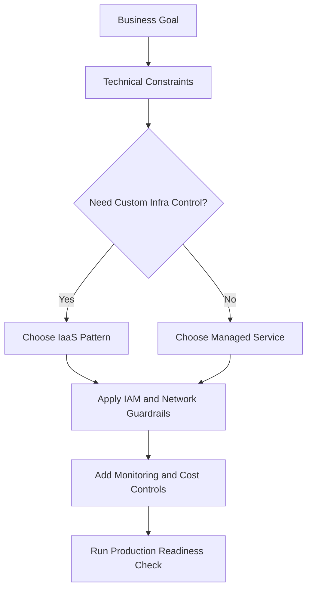
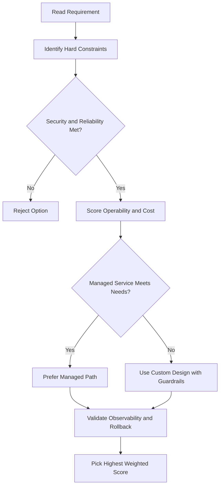
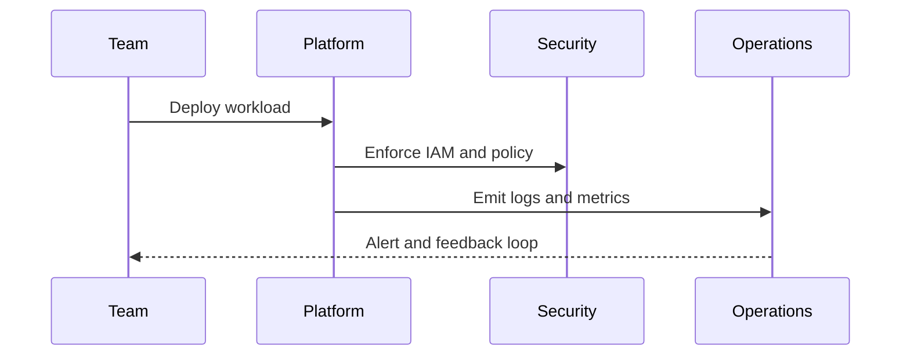

# Managed Services — Module Introduction

## What Are Managed Services?

- **Partial or complete solutions offered as a service** — you use them without building or maintaining the underlying infrastructure
- Exist on a continuum between **PaaS and SaaS**, depending on how much of the internal methods and controls are exposed
- Allow you to **outsource administrative and maintenance overhead to Google** when your application fits within the service offering

---

## Managed Services vs Infrastructure Automation

| Approach                                        | Description                                                                  |
| ----------------------------------------------- | ---------------------------------------------------------------------------- |
| **Infrastructure automation** (e.g., Terraform) | You define and manage the infrastructure; automation handles provisioning    |
| **Managed services**                            | You eliminate the need to create infrastructure entirely — Google manages it |

---

## Data Analytics Managed Services Covered in This Module

| Service                  | Purpose                                                                       |
| ------------------------ | ----------------------------------------------------------------------------- |
| **BigQuery**             | Fully managed, serverless data warehouse for large-scale analytics            |
| **Dataflow**             | Fully managed stream and batch data processing (Apache Beam)                  |
| **Dataprep by Trifacta** | Intelligent data service for visually exploring, cleaning, and preparing data |
| **Dataproc**             | Managed Spark and Hadoop service for big data processing                      |

> These services are all for **data analytics** purposes. This module provides an overview and a demo — no hands-on labs.

## ACE Exam-Style Practice Questions

### Q1
In a Managed Services Intro scenario, two answers seem technically possible. What tie-breaker should you apply first?

A. Pick the option with most manual steps
B. Pick the option with least privilege and least operational overhead that still meets requirements
C. Pick highest-cost option
D. Pick the oldest product

Answer: B
Trap: ACE-style scenarios reward secure, managed, requirement-fit decisions.

### Q2
For Managed Services Intro, what is the best way to reduce wrong answers in multi-choice questions?

A. Ignore scaling and security words
B. Identify trigger words, eliminate over-privileged choices, then choose the managed fit
C. Always pick Compute Engine
D. Always pick the shortest option

Answer: B
Trap: Structured elimination is more reliable than memorization alone.

<!-- ACE_DEEP_ENRICHMENT_START -->
## ACE Deep Enrichment

### Think Like a Google Engineer
- Primary optimization axis: Managed-service-first design with reliability and security by default.
- Start with constraints first: SLO, security, compliance, latency, budget, and team operations capacity.
- Prefer managed services if they satisfy requirements with lower long-term operational toil.
- Minimize blast radius using environment isolation, least privilege, and failure-domain awareness.
- Design for day-2 operations: observability, rollback strategy, and quota or budget guardrails.

### Most Correct Option Filter (60 Seconds)
1. Eliminate options with broad access, single points of failure, or missing monitoring.
2. Confirm the option meets non-negotiables first: security and reliability requirements.
3. Compare remaining options on operational simplicity and long-term maintainability.
4. Use cost as an optimizer only after requirements and risk controls are satisfied.

### Weighted Decision Matrix
| Dimension | Weight | Strong Signal |
| --- | --- | --- |
| Security | 3 | Least privilege, secure defaults, no exposed blast radius |
| Reliability | 3 | Multi-zone or HA design, health checks, tested recovery path |
| Operability | 2 | Clear monitoring, alerting, rollout and rollback simplicity |
| Cost Efficiency | 2 | Right-sized resources, no waste, no reliability regression |
| Performance | 1 | Meets latency and throughput targets with headroom |

### Real-Life Scenario
A growing startup is moving from manual infrastructure to Google Cloud. They need fast delivery, better reliability, and clear operational controls while keeping architecture simple.

### Worked Example
- Translate business goals into technical constraints before selecting services.
- Favor managed services to reduce operational burden where possible.
- Apply least-privilege IAM and private-by-default networking decisions.
- Add monitoring, logging, and budget controls from the start.

### Flowchart


### Optimization Decision Flow


### Interaction Sequence


### Extra Exam Practice (10 Questions)
#### Q1
Scenario Focus: Managed Services — Module Introduction
Which design pattern is usually best for fast, safe cloud adoption?

A. Use managed services with least-privilege IAM and clear observability controls.
B. Start with manual scripts and unrestricted access, then harden later.
C. Use one project for everything to reduce setup effort.
D. Ignore telemetry until after first production incident.

Answer: A
Why the other options are weaker: They typically ignore at least one hard constraint such as security, reliability, cost efficiency, or operational simplicity.
Google-engineer check: Reconfirm SLO fit, blast radius, and day-2 maintainability before finalizing.

#### Q2
Scenario Focus: Managed Services — Module Introduction
A team wants speed and low ops overhead. What should they prioritize?

A. Use one project for everything to reduce setup effort.
B. Prefer services that reduce operational toil while meeting reliability goals.
C. Ignore telemetry until after first production incident.
D. Pick only the cheapest service regardless of reliability needs.

Answer: B
Why the other options are weaker: They typically ignore at least one hard constraint such as security, reliability, cost efficiency, or operational simplicity.
Google-engineer check: Reconfirm SLO fit, blast radius, and day-2 maintainability before finalizing.

#### Q3
Scenario Focus: Managed Services — Module Introduction
What is a common architecture trap in early cloud projects?

A. Ignore telemetry until after first production incident.
B. Pick only the cheapest service regardless of reliability needs.
C. Over-broad access and missing monitoring are high-risk trap patterns.
D. Keep architecture opaque to avoid governance overhead.

Answer: C
Why the other options are weaker: They typically ignore at least one hard constraint such as security, reliability, cost efficiency, or operational simplicity.
Google-engineer check: Reconfirm SLO fit, blast radius, and day-2 maintainability before finalizing.

#### Q4
Scenario Focus: Managed Services — Module Introduction
Which control set should be baseline for production?

A. Pick only the cheapest service regardless of reliability needs.
B. Keep architecture opaque to avoid governance overhead.
C. Start with manual scripts and unrestricted access, then harden later.
D. Baseline should include IAM guardrails, logging, monitoring, and cost alerts.

Answer: D
Why the other options are weaker: They typically ignore at least one hard constraint such as security, reliability, cost efficiency, or operational simplicity.
Google-engineer check: Reconfirm SLO fit, blast radius, and day-2 maintainability before finalizing.

#### Q5
Scenario Focus: Managed Services — Module Introduction
How should you evaluate conflicting requirements on the exam?

A. Choose the option that balances security, reliability, cost, and operability.
B. Keep architecture opaque to avoid governance overhead.
C. Start with manual scripts and unrestricted access, then harden later.
D. Use one project for everything to reduce setup effort.

Answer: A
Why the other options are weaker: They typically ignore at least one hard constraint such as security, reliability, cost efficiency, or operational simplicity.
Google-engineer check: Reconfirm SLO fit, blast radius, and day-2 maintainability before finalizing.

#### Q6
Scenario Focus: Managed Services — Module Introduction
Two designs both satisfy the happy path for Managed Services — Module Introduction. Which choice is most correct?

A. Start with manual scripts and unrestricted access, then harden later.
B. Choose the option that preserves reliability and security while reducing operational burden.
C. Use one project for everything to reduce setup effort.
D. Ignore telemetry until after first production incident.

Answer: B
Why the other options are weaker: They typically ignore at least one hard constraint such as security, reliability, cost efficiency, or operational simplicity.
Google-engineer check: Reconfirm SLO fit, blast radius, and day-2 maintainability before finalizing.

#### Q7
Scenario Focus: Managed Services — Module Introduction
What should you validate first before choosing an architecture for Managed Services — Module Introduction?

A. Use one project for everything to reduce setup effort.
B. Ignore telemetry until after first production incident.
C. Validate SLO fit, blast radius, and least-privilege controls before comparing convenience.
D. Pick only the cheapest service regardless of reliability needs.

Answer: C
Why the other options are weaker: They typically ignore at least one hard constraint such as security, reliability, cost efficiency, or operational simplicity.
Google-engineer check: Reconfirm SLO fit, blast radius, and day-2 maintainability before finalizing.

#### Q8
Scenario Focus: Managed Services — Module Introduction
A proposal lowers cost but increases failure risk. What is the best decision?

A. Ignore telemetry until after first production incident.
B. Pick only the cheapest service regardless of reliability needs.
C. Keep architecture opaque to avoid governance overhead.
D. Reject it unless reliability and recovery objectives remain within required targets.

Answer: D
Why the other options are weaker: They typically ignore at least one hard constraint such as security, reliability, cost efficiency, or operational simplicity.
Google-engineer check: Reconfirm SLO fit, blast radius, and day-2 maintainability before finalizing.

#### Q9
Scenario Focus: Managed Services — Module Introduction
Which option best reflects optimization for Managed-service-first design with reliability and security by default?

A. Select the design that best meets Managed-service-first design with reliability and security by default while keeping constraints balanced.
B. Pick only the cheapest service regardless of reliability needs.
C. Keep architecture opaque to avoid governance overhead.
D. Start with manual scripts and unrestricted access, then harden later.

Answer: A
Why the other options are weaker: They typically ignore at least one hard constraint such as security, reliability, cost efficiency, or operational simplicity.
Google-engineer check: Reconfirm SLO fit, blast radius, and day-2 maintainability before finalizing.

#### Q10
Scenario Focus: Managed Services — Module Introduction
How should you evaluate a design that needs frequent manual interventions?

A. Keep architecture opaque to avoid governance overhead.
B. Treat it as high risk and prefer automation-friendly designs with observability and rollback.
C. Start with manual scripts and unrestricted access, then harden later.
D. Use one project for everything to reduce setup effort.

Answer: B
Why the other options are weaker: They typically ignore at least one hard constraint such as security, reliability, cost efficiency, or operational simplicity.
Google-engineer check: Reconfirm SLO fit, blast radius, and day-2 maintainability before finalizing.

### Quick Commands
```bash
gcloud config list
gcloud projects describe PROJECT_ID
gcloud services list --enabled --project=PROJECT_ID
gcloud logging read "severity>=WARNING" --project=PROJECT_ID --freshness=2d --limit=20
```

### Fast Recall
- Good cloud design is constraint-driven, not tool-driven.
- Managed services usually improve delivery speed and reliability.
- Security and observability should be built in from day one.
<!-- ACE_DEEP_ENRICHMENT_END -->