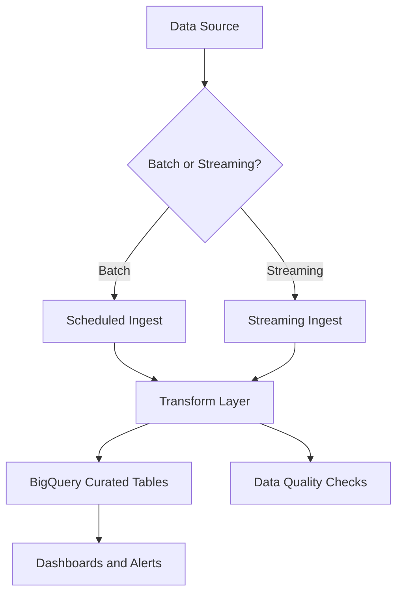
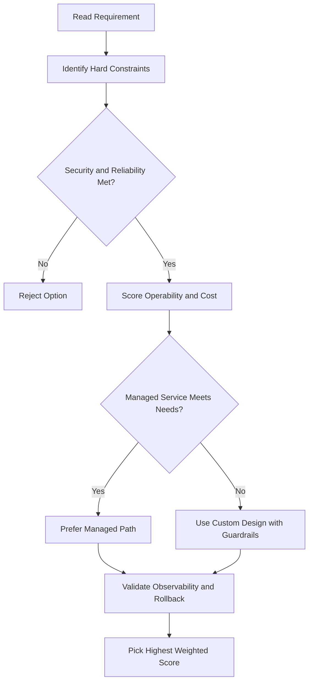
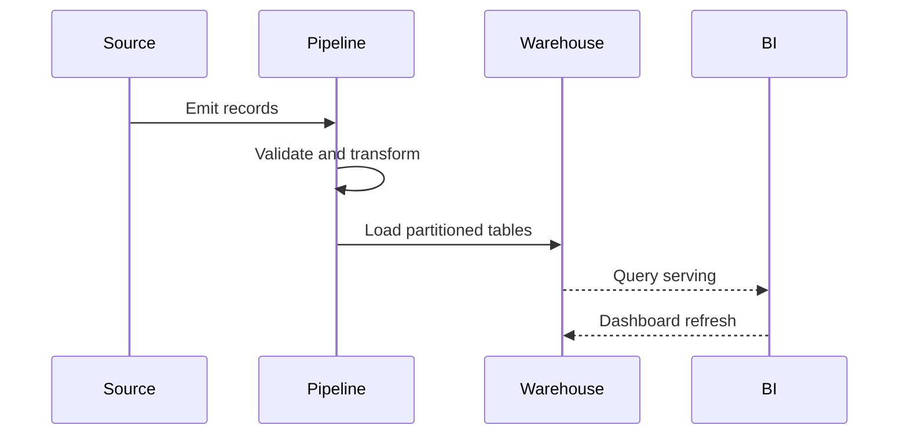

# Dataproc

## What Is Dataproc?

- A **fast, easy-to-use, fully managed cloud service** for running **Apache Spark** and **Apache Hadoop** clusters
- Designed to make big data processing simpler and cheaper than managing clusters yourself
- **Per-second billing** — pay only for resources you use
- Use **preemptible instances** in your cluster to reduce costs further

---

## Speed

| Operation         | Traditional (on-prem or other IaaS) | Dataproc            |
| ----------------- | ----------------------------------- | ------------------- |
| Create cluster    | 5–30 minutes                        | ~90 seconds or less |
| Scale cluster     | Minutes                             | ~90 seconds or less |
| Shut down cluster | Minutes                             | ~90 seconds or less |

> Fast cluster lifecycle means less waiting and more time working with your data.

---

## Key Features

- **Fully managed** — create clusters quickly, manage them easily, and shut them down when not needed (no idle cost)
- **Built-in integrations** with:
  - **BigQuery** — query and analyze data
  - **Cloud Storage** — persistent data storage
  - **Bigtable** — NoSQL data access
  - **Cloud Logging and Cloud Monitoring** — observability
- **No new tools needed** — if you already use Spark, Hadoop, Pig, or Hive, you can migrate existing projects without redevelopment

---

## Dataproc vs Dataflow

Both services support batch and streaming data processing — here's how to choose:

| Question                                                                     | Answer → Use       |
| ---------------------------------------------------------------------------- | ------------------ |
| Do you have dependencies on Apache Hadoop/Spark ecosystem tools or packages? | **Yes → Dataproc** |
| Do you prefer a hands-on / DevOps approach to cluster management?            | **Yes → Dataproc** |
| Do you prefer a hands-off / serverless approach?                             | **Yes → Dataflow** |

> In short: **Dataproc** for Hadoop/Spark workloads and DevOps control; **Dataflow** for serverless, fully managed pipelines.

## ACE Exam-Style Practice Questions

### Q1
A Dataproc migration requires moving existing Spark jobs with minimal code changes. What should you choose?

A. Dataproc
B. Cloud Run Functions
C. App Engine Standard
D. Compute Engine single VM only

Answer: A
Trap: Existing Spark and Hadoop workloads map directly to Dataproc.

### Q2
For Dataproc cost optimization on intermittent jobs, what is best?

A. Keep a large cluster running 24x7
B. Create ephemeral clusters per job and delete after completion
C. Disable autoscaling and logging
D. Move all jobs to Cloud DNS

Answer: B
Trap: Ephemeral clusters reduce idle cost while preserving Spark compatibility.

<!-- ACE_DEEP_ENRICHMENT_START -->
## ACE Deep Enrichment

### Think Like a Google Engineer
- Primary optimization axis: Data freshness and correctness with scalable transformation.
- Start with constraints first: SLO, security, compliance, latency, budget, and team operations capacity.
- Prefer managed services if they satisfy requirements with lower long-term operational toil.
- Minimize blast radius using environment isolation, least privilege, and failure-domain awareness.
- Design for day-2 operations: observability, rollback strategy, and quota or budget guardrails.

### Most Correct Option Filter (60 Seconds)
1. Eliminate options with broad access, single points of failure, or missing monitoring.
2. Confirm the option meets non-negotiables first: security and reliability requirements.
3. Compare remaining options on operational simplicity and long-term maintainability.
4. Use cost as an optimizer only after requirements and risk controls are satisfied.

### Weighted Decision Matrix
| Dimension | Weight | Strong Signal |
| --- | --- | --- |
| Security | 3 | Least privilege, secure defaults, no exposed blast radius |
| Reliability | 3 | Multi-zone or HA design, health checks, tested recovery path |
| Operability | 2 | Clear monitoring, alerting, rollout and rollback simplicity |
| Cost Efficiency | 2 | Right-sized resources, no waste, no reliability regression |
| Performance | 1 | Meets latency and throughput targets with headroom |

### Real-Life Scenario
A retail analytics team needs near-real-time dashboards and nightly reporting from multiple source systems while controlling pipeline failures and data quality regressions.

### Worked Example
- Ingest streaming or batch data through the right transport and landing zone.
- Use Dataflow or Dataproc based on transformation complexity and runtime control needs.
- Store analytics outputs in BigQuery with partitioning and clustering.
- Monitor pipeline lag, failed jobs, and schema drift with alerts.

### Flowchart


### Optimization Decision Flow


### Interaction Sequence


### Extra Exam Practice (15 Questions)
#### Q1
Scenario Focus: Dataproc
You need low-latency event processing with autoscaling transforms. Which service is best?

A. Use Dataflow for managed autoscaling stream and batch processing.
B. Run all ETL manually from local scripts on one VM.
C. Store analytical aggregates only in flat files.
D. Disable job retry and ignore dead-letter handling.

Answer: A
Why the other options are weaker: They typically ignore at least one hard constraint such as security, reliability, cost efficiency, or operational simplicity.
Google-engineer check: Reconfirm SLO fit, blast radius, and day-2 maintainability before finalizing.

#### Q2
Scenario Focus: Dataproc
What is the best BigQuery table strategy for time-series analytics?

A. Store analytical aggregates only in flat files.
B. Use partitioned tables and clustering for common filter dimensions.
C. Disable job retry and ignore dead-letter handling.
D. Use unpartitioned large tables for all query workloads.

Answer: B
Why the other options are weaker: They typically ignore at least one hard constraint such as security, reliability, cost efficiency, or operational simplicity.
Google-engineer check: Reconfirm SLO fit, blast radius, and day-2 maintainability before finalizing.

#### Q3
Scenario Focus: Dataproc
A pipeline keeps failing due to schema changes. What is the best first control?

A. Disable job retry and ignore dead-letter handling.
B. Use unpartitioned large tables for all query workloads.
C. Add schema validation and contract checks before loading curated tables.
D. Treat data quality checks as optional in production.

Answer: C
Why the other options are weaker: They typically ignore at least one hard constraint such as security, reliability, cost efficiency, or operational simplicity.
Google-engineer check: Reconfirm SLO fit, blast radius, and day-2 maintainability before finalizing.

#### Q4
Scenario Focus: Dataproc
Which architecture supports both nightly batch and near-real-time reporting?

A. Use unpartitioned large tables for all query workloads.
B. Treat data quality checks as optional in production.
C. Run all ETL manually from local scripts on one VM.
D. Use a shared transform layer that handles both streaming and scheduled batch paths.

Answer: D
Why the other options are weaker: They typically ignore at least one hard constraint such as security, reliability, cost efficiency, or operational simplicity.
Google-engineer check: Reconfirm SLO fit, blast radius, and day-2 maintainability before finalizing.

#### Q5
Scenario Focus: Dataproc
What should teams monitor to catch pipeline regressions early?

A. Monitor lag, failed jobs, data freshness, and quality rule violations.
B. Treat data quality checks as optional in production.
C. Run all ETL manually from local scripts on one VM.
D. Store analytical aggregates only in flat files.

Answer: A
Why the other options are weaker: They typically ignore at least one hard constraint such as security, reliability, cost efficiency, or operational simplicity.
Google-engineer check: Reconfirm SLO fit, blast radius, and day-2 maintainability before finalizing.

#### Q6
Scenario Focus: Dataproc
Two designs both satisfy the happy path for Dataproc. Which choice is most correct?

A. Run all ETL manually from local scripts on one VM.
B. Choose the option that preserves reliability and security while reducing operational burden.
C. Store analytical aggregates only in flat files.
D. Disable job retry and ignore dead-letter handling.

Answer: B
Why the other options are weaker: They typically ignore at least one hard constraint such as security, reliability, cost efficiency, or operational simplicity.
Google-engineer check: Reconfirm SLO fit, blast radius, and day-2 maintainability before finalizing.

#### Q7
Scenario Focus: Dataproc
What should you validate first before choosing an architecture for Dataproc?

A. Store analytical aggregates only in flat files.
B. Disable job retry and ignore dead-letter handling.
C. Validate SLO fit, blast radius, and least-privilege controls before comparing convenience.
D. Use unpartitioned large tables for all query workloads.

Answer: C
Why the other options are weaker: They typically ignore at least one hard constraint such as security, reliability, cost efficiency, or operational simplicity.
Google-engineer check: Reconfirm SLO fit, blast radius, and day-2 maintainability before finalizing.

#### Q8
Scenario Focus: Dataproc
A proposal lowers cost but increases failure risk. What is the best decision?

A. Disable job retry and ignore dead-letter handling.
B. Use unpartitioned large tables for all query workloads.
C. Treat data quality checks as optional in production.
D. Reject it unless reliability and recovery objectives remain within required targets.

Answer: D
Why the other options are weaker: They typically ignore at least one hard constraint such as security, reliability, cost efficiency, or operational simplicity.
Google-engineer check: Reconfirm SLO fit, blast radius, and day-2 maintainability before finalizing.

#### Q9
Scenario Focus: Dataproc
Which option best reflects optimization for Data freshness and correctness with scalable transformation?

A. Select the design that best meets Data freshness and correctness with scalable transformation while keeping constraints balanced.
B. Use unpartitioned large tables for all query workloads.
C. Treat data quality checks as optional in production.
D. Run all ETL manually from local scripts on one VM.

Answer: A
Why the other options are weaker: They typically ignore at least one hard constraint such as security, reliability, cost efficiency, or operational simplicity.
Google-engineer check: Reconfirm SLO fit, blast radius, and day-2 maintainability before finalizing.

#### Q10
Scenario Focus: Dataproc
How should you evaluate a design that needs frequent manual interventions?

A. Treat data quality checks as optional in production.
B. Treat it as high risk and prefer automation-friendly designs with observability and rollback.
C. Run all ETL manually from local scripts on one VM.
D. Store analytical aggregates only in flat files.

Answer: B
Why the other options are weaker: They typically ignore at least one hard constraint such as security, reliability, cost efficiency, or operational simplicity.
Google-engineer check: Reconfirm SLO fit, blast radius, and day-2 maintainability before finalizing.

#### Q11
Scenario Focus: Dataproc
Two options have similar latency. Which tie-breaker is best?

A. Run all ETL manually from local scripts on one VM.
B. Store analytical aggregates only in flat files.
C. Pick the option with stronger operability, clearer failure isolation, and simpler incident response.
D. Disable job retry and ignore dead-letter handling.

Answer: C
Why the other options are weaker: They typically ignore at least one hard constraint such as security, reliability, cost efficiency, or operational simplicity.
Google-engineer check: Reconfirm SLO fit, blast radius, and day-2 maintainability before finalizing.

#### Q12
Scenario Focus: Dataproc
What is the best way to choose between a custom stack and a managed service?

A. Store analytical aggregates only in flat files.
B. Disable job retry and ignore dead-letter handling.
C. Use unpartitioned large tables for all query workloads.
D. Prefer managed services when they meet requirements with lower long-term maintenance effort.

Answer: D
Why the other options are weaker: They typically ignore at least one hard constraint such as security, reliability, cost efficiency, or operational simplicity.
Google-engineer check: Reconfirm SLO fit, blast radius, and day-2 maintainability before finalizing.

#### Q13
Scenario Focus: Dataproc
How do you confirm a solution is production-ready for 

A. Verify monitoring, alerting, rollback path, quota and budget controls, and secure defaults.
B. Disable job retry and ignore dead-letter handling.
C. Use unpartitioned large tables for all query workloads.
D. Treat data quality checks as optional in production.

Answer: A
Why the other options are weaker: They typically ignore at least one hard constraint such as security, reliability, cost efficiency, or operational simplicity.
Google-engineer check: Reconfirm SLO fit, blast radius, and day-2 maintainability before finalizing.

#### Q14
Scenario Focus: Dataproc
Which pattern usually wins in ACE scenario tie-breakers?

A. Use unpartitioned large tables for all query workloads.
B. Managed-service-first plus least-privilege access plus clear observability usually wins.
C. Treat data quality checks as optional in production.
D. Run all ETL manually from local scripts on one VM.

Answer: B
Why the other options are weaker: They typically ignore at least one hard constraint such as security, reliability, cost efficiency, or operational simplicity.
Google-engineer check: Reconfirm SLO fit, blast radius, and day-2 maintainability before finalizing.

#### Q15
Scenario Focus: Dataproc
What is the best final check before locking the answer?

A. Treat data quality checks as optional in production.
B. Run all ETL manually from local scripts on one VM.
C. Run a weighted check across security, reliability, cost, performance, and operability.
D. Store analytical aggregates only in flat files.

Answer: C
Why the other options are weaker: They typically ignore at least one hard constraint such as security, reliability, cost efficiency, or operational simplicity.
Google-engineer check: Reconfirm SLO fit, blast radius, and day-2 maintainability before finalizing.

### Quick Commands
```bash
bq ls --project_id=PROJECT_ID
bq query --use_legacy_sql=false "SELECT COUNT(*) FROM DATASET.TABLE"
gcloud dataflow jobs list --region=REGION --project=PROJECT_ID
gcloud dataproc clusters list --region=REGION --project=PROJECT_ID
```

### Fast Recall
- Design pipeline by freshness target and transformation complexity.
- Partitioning and clustering are common BigQuery optimization tools.
- Data quality checks belong inside the pipeline, not after incidents.
<!-- ACE_DEEP_ENRICHMENT_END -->