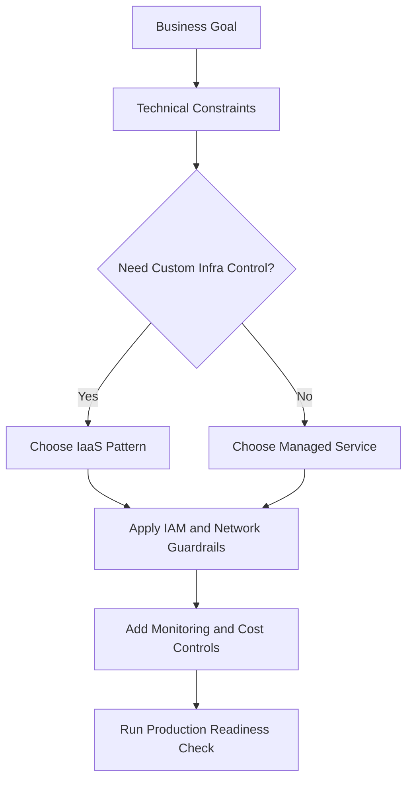
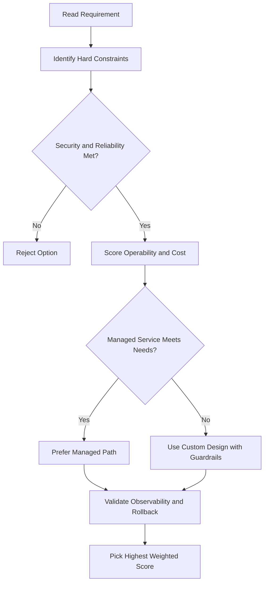
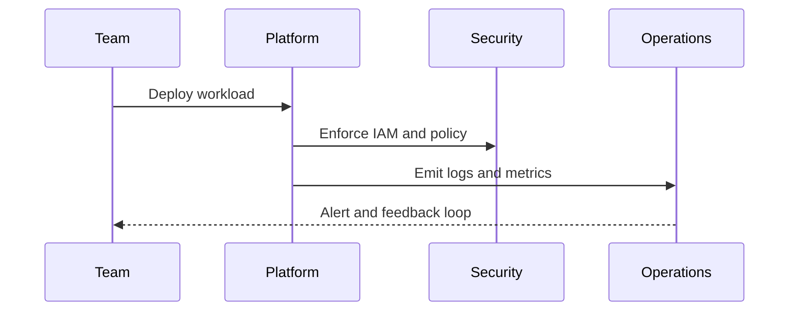

# Gemini Enterprise — Demo Walkthrough

## What This Demo Covers

- Create a Gemini Enterprise application
- Connect it to multiple data stores (Google Drive, Google Calendar, Cloud Storage)
- Explore pre-built agents (Idea Generation, Deep Research)
- Use NotebookLM to analyze and transform source content

---

## Step 1 — Create a Gemini Enterprise App

1. In the GCP Console, search for **Gemini Enterprise** and select it
2. On the homepage, click **Create your first app**
3. Give the app a name (e.g., `Symbol Foods Marketing Team`) and click **Create**

---

## Step 2 — Configure Identity

Before sharing the app with your workforce, you must configure identity:

1. Click **Setup identity**
2. Choose **Google Identity** as the identity provider
3. Click **Confirm Workforce Identity**

---

## Step 3 — Connect Data Stores

Navigate to **Connected data stores** → **New data store**

### Google Drive

- Select the **Google Drive** card
- Choose to sync all organization's shared drives
- Click **Continue**, give it a name (e.g., `Google Drive`), and click **Create**

### Google Calendar

- Select the **Google Calendar** card
- Give it a name (e.g., `Google Calendar`) and click **Create**

### Cloud Storage

- Select the **Cloud Storage** card
- **Data type**: Documents (for unstructured files like PDFs, HTML, TXT)
- **Sync frequency**: One time
- Click **Browse** → select your GCS bucket → **Select**
- Click **Continue**, give it a name (e.g., `Cloud Storage`), and click **Create**

> All three data stores are now connected to the app.

---

## Step 4 — Share and Use the App

- From the **Overview** page, copy the unique URL to share the app with your workforce
- Open the URL to access the Gemini Enterprise homepage

---

## Step 5 — Chat and Search

### Basic prompt

- Enter a prompt (e.g., _"Give me an update on our latest marketing data"_) and submit
- Gemini searches across internal and external sources and returns a context-aware response

### Multimodal prompt with enhanced settings

- Click **Enhance your conversation** to set search parameters:
  - Options include: generate videos with Veo, generate images with Nano Banana, or restrict to internal sources only
- Set to **search only internal sources**
- Enter a multimodal prompt (e.g., _"Summarize the customer sentiment pie chart"_)
- Gemini searches internal sources and generates a response based on the image content

---

## Step 6 — Pre-built Agents

### Idea Generation

- Go to **Idea Generation**
- Use case: a team of agents that plans, generates, and evaluates ideas on a topic
- Example prompt: _"Help me brainstorm a new marketing campaign for Gen-Z customers based on our latest products"_
- Gemini generates a marketing campaign plan → review it → click **Start session** to generate multiple ideas

### Deep Research

- Go to **Deep Research**
- Use case: in-depth analysis and comprehensive report generation on complex topics
- Example prompt: _"Research the latest marketing tips and tricks that food companies are using and generate a list of actionable steps our company can take to improve our current marketing strategy"_
- Gemini drafts a research plan → review and optionally modify it → click **Start research**
- Output: a comprehensive report + an audio summary

---

## Step 7 — NotebookLM

### What Is NotebookLM?

- A tool for uploading content from various sources and transforming it into dynamic formats

### Supported source types

- Google Docs
- Website URLs
- YouTube videos
- Copied text
- Files from your hard drive

### Steps

1. From the pinned section, select **NotebookLM**
2. Click **Create new notebook**
3. Upload your source files
4. Enter a prompt — e.g., _"What audience did the spring cookie promotion target?"_
   - Example response: _"Women aged 25 to 55 who are interested in baking and desserts in Oakland, California"_
5. Save useful responses as **notes** for easy access later

### Studio Tab

- Go to the **Studio** tab to transform source material into dynamic formats:
  - Audio overviews
  - Videos
  - Mind maps
  - Various report types
- Example: generate a **video overview** → output is a 5-minute video presentation titled _"Marketing by the Numbers"_

## ACE Exam-Style Practice Questions

### Q1
In a Gemini Enterprise Demo scenario, two answers seem technically possible. What tie-breaker should you apply first?

A. Pick the option with most manual steps
B. Pick the option with least privilege and least operational overhead that still meets requirements
C. Pick highest-cost option
D. Pick the oldest product

Answer: B
Trap: ACE-style scenarios reward secure, managed, requirement-fit decisions.

### Q2
For Gemini Enterprise Demo, what is the best way to reduce wrong answers in multi-choice questions?

A. Ignore scaling and security words
B. Identify trigger words, eliminate over-privileged choices, then choose the managed fit
C. Always pick Compute Engine
D. Always pick the shortest option

Answer: B
Trap: Structured elimination is more reliable than memorization alone.

<!-- ACE_DEEP_ENRICHMENT_START -->
## ACE Deep Enrichment

### Think Like a Google Engineer
- Primary optimization axis: Managed-service-first design with reliability and security by default.
- Start with constraints first: SLO, security, compliance, latency, budget, and team operations capacity.
- Prefer managed services if they satisfy requirements with lower long-term operational toil.
- Minimize blast radius using environment isolation, least privilege, and failure-domain awareness.
- Design for day-2 operations: observability, rollback strategy, and quota or budget guardrails.

### Most Correct Option Filter (60 Seconds)
1. Eliminate options with broad access, single points of failure, or missing monitoring.
2. Confirm the option meets non-negotiables first: security and reliability requirements.
3. Compare remaining options on operational simplicity and long-term maintainability.
4. Use cost as an optimizer only after requirements and risk controls are satisfied.

### Weighted Decision Matrix
| Dimension | Weight | Strong Signal |
| --- | --- | --- |
| Security | 3 | Least privilege, secure defaults, no exposed blast radius |
| Reliability | 3 | Multi-zone or HA design, health checks, tested recovery path |
| Operability | 2 | Clear monitoring, alerting, rollout and rollback simplicity |
| Cost Efficiency | 2 | Right-sized resources, no waste, no reliability regression |
| Performance | 1 | Meets latency and throughput targets with headroom |

### Real-Life Scenario
A growing startup is moving from manual infrastructure to Google Cloud. They need fast delivery, better reliability, and clear operational controls while keeping architecture simple.

### Worked Example
- Translate business goals into technical constraints before selecting services.
- Favor managed services to reduce operational burden where possible.
- Apply least-privilege IAM and private-by-default networking decisions.
- Add monitoring, logging, and budget controls from the start.

### Flowchart


### Optimization Decision Flow


### Interaction Sequence


### Extra Exam Practice (10 Questions)
#### Q1
Scenario Focus: Gemini Enterprise — Demo Walkthrough
Which design pattern is usually best for fast, safe cloud adoption?

A. Use managed services with least-privilege IAM and clear observability controls.
B. Start with manual scripts and unrestricted access, then harden later.
C. Use one project for everything to reduce setup effort.
D. Ignore telemetry until after first production incident.

Answer: A
Why the other options are weaker: They typically ignore at least one hard constraint such as security, reliability, cost efficiency, or operational simplicity.
Google-engineer check: Reconfirm SLO fit, blast radius, and day-2 maintainability before finalizing.

#### Q2
Scenario Focus: Gemini Enterprise — Demo Walkthrough
A team wants speed and low ops overhead. What should they prioritize?

A. Use one project for everything to reduce setup effort.
B. Prefer services that reduce operational toil while meeting reliability goals.
C. Ignore telemetry until after first production incident.
D. Pick only the cheapest service regardless of reliability needs.

Answer: B
Why the other options are weaker: They typically ignore at least one hard constraint such as security, reliability, cost efficiency, or operational simplicity.
Google-engineer check: Reconfirm SLO fit, blast radius, and day-2 maintainability before finalizing.

#### Q3
Scenario Focus: Gemini Enterprise — Demo Walkthrough
What is a common architecture trap in early cloud projects?

A. Ignore telemetry until after first production incident.
B. Pick only the cheapest service regardless of reliability needs.
C. Over-broad access and missing monitoring are high-risk trap patterns.
D. Keep architecture opaque to avoid governance overhead.

Answer: C
Why the other options are weaker: They typically ignore at least one hard constraint such as security, reliability, cost efficiency, or operational simplicity.
Google-engineer check: Reconfirm SLO fit, blast radius, and day-2 maintainability before finalizing.

#### Q4
Scenario Focus: Gemini Enterprise — Demo Walkthrough
Which control set should be baseline for production?

A. Pick only the cheapest service regardless of reliability needs.
B. Keep architecture opaque to avoid governance overhead.
C. Start with manual scripts and unrestricted access, then harden later.
D. Baseline should include IAM guardrails, logging, monitoring, and cost alerts.

Answer: D
Why the other options are weaker: They typically ignore at least one hard constraint such as security, reliability, cost efficiency, or operational simplicity.
Google-engineer check: Reconfirm SLO fit, blast radius, and day-2 maintainability before finalizing.

#### Q5
Scenario Focus: Gemini Enterprise — Demo Walkthrough
How should you evaluate conflicting requirements on the exam?

A. Choose the option that balances security, reliability, cost, and operability.
B. Keep architecture opaque to avoid governance overhead.
C. Start with manual scripts and unrestricted access, then harden later.
D. Use one project for everything to reduce setup effort.

Answer: A
Why the other options are weaker: They typically ignore at least one hard constraint such as security, reliability, cost efficiency, or operational simplicity.
Google-engineer check: Reconfirm SLO fit, blast radius, and day-2 maintainability before finalizing.

#### Q6
Scenario Focus: Gemini Enterprise — Demo Walkthrough
Two designs both satisfy the happy path for Gemini Enterprise — Demo Walkthrough. Which choice is most correct?

A. Start with manual scripts and unrestricted access, then harden later.
B. Choose the option that preserves reliability and security while reducing operational burden.
C. Use one project for everything to reduce setup effort.
D. Ignore telemetry until after first production incident.

Answer: B
Why the other options are weaker: They typically ignore at least one hard constraint such as security, reliability, cost efficiency, or operational simplicity.
Google-engineer check: Reconfirm SLO fit, blast radius, and day-2 maintainability before finalizing.

#### Q7
Scenario Focus: Gemini Enterprise — Demo Walkthrough
What should you validate first before choosing an architecture for Gemini Enterprise — Demo Walkthrough?

A. Use one project for everything to reduce setup effort.
B. Ignore telemetry until after first production incident.
C. Validate SLO fit, blast radius, and least-privilege controls before comparing convenience.
D. Pick only the cheapest service regardless of reliability needs.

Answer: C
Why the other options are weaker: They typically ignore at least one hard constraint such as security, reliability, cost efficiency, or operational simplicity.
Google-engineer check: Reconfirm SLO fit, blast radius, and day-2 maintainability before finalizing.

#### Q8
Scenario Focus: Gemini Enterprise — Demo Walkthrough
A proposal lowers cost but increases failure risk. What is the best decision?

A. Ignore telemetry until after first production incident.
B. Pick only the cheapest service regardless of reliability needs.
C. Keep architecture opaque to avoid governance overhead.
D. Reject it unless reliability and recovery objectives remain within required targets.

Answer: D
Why the other options are weaker: They typically ignore at least one hard constraint such as security, reliability, cost efficiency, or operational simplicity.
Google-engineer check: Reconfirm SLO fit, blast radius, and day-2 maintainability before finalizing.

#### Q9
Scenario Focus: Gemini Enterprise — Demo Walkthrough
Which option best reflects optimization for Managed-service-first design with reliability and security by default?

A. Select the design that best meets Managed-service-first design with reliability and security by default while keeping constraints balanced.
B. Pick only the cheapest service regardless of reliability needs.
C. Keep architecture opaque to avoid governance overhead.
D. Start with manual scripts and unrestricted access, then harden later.

Answer: A
Why the other options are weaker: They typically ignore at least one hard constraint such as security, reliability, cost efficiency, or operational simplicity.
Google-engineer check: Reconfirm SLO fit, blast radius, and day-2 maintainability before finalizing.

#### Q10
Scenario Focus: Gemini Enterprise — Demo Walkthrough
How should you evaluate a design that needs frequent manual interventions?

A. Keep architecture opaque to avoid governance overhead.
B. Treat it as high risk and prefer automation-friendly designs with observability and rollback.
C. Start with manual scripts and unrestricted access, then harden later.
D. Use one project for everything to reduce setup effort.

Answer: B
Why the other options are weaker: They typically ignore at least one hard constraint such as security, reliability, cost efficiency, or operational simplicity.
Google-engineer check: Reconfirm SLO fit, blast radius, and day-2 maintainability before finalizing.

### Quick Commands
```bash
gcloud config list
gcloud projects describe PROJECT_ID
gcloud services list --enabled --project=PROJECT_ID
gcloud logging read "severity>=WARNING" --project=PROJECT_ID --freshness=2d --limit=20
```

### Fast Recall
- Good cloud design is constraint-driven, not tool-driven.
- Managed services usually improve delivery speed and reliability.
- Security and observability should be built in from day one.
<!-- ACE_DEEP_ENRICHMENT_END -->