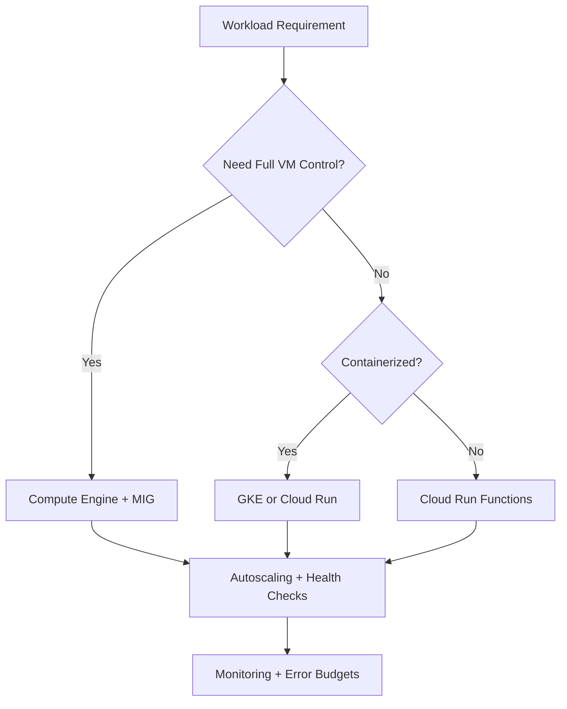
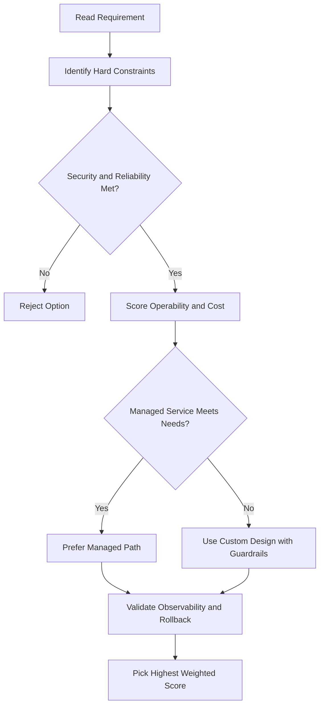
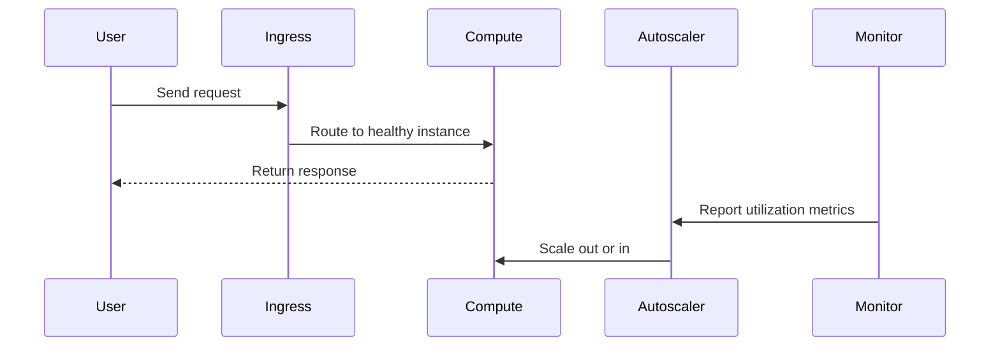

# What Is a Container?

## Evolution of Application Deployment

### Era 1 — Physical Servers

- Apps ran on dedicated local computers
- Required physical space, power, cooling, and network connectivity
- Install OS → install dependencies → install app
- Each machine typically had **one purpose** (database, web server, CDN)
- Wasted resources; slow to deploy, maintain, and scale

---

### Era 2 — Virtualization

- **Virtualization** = creating a virtual version of a physical resource (server, storage, network)
- A **hypervisor** breaks the dependency of an OS on the underlying hardware, allowing multiple VMs to share one physical host
- **KVM (Kernel-based Virtual Machine)** is one well-known hypervisor

#### Benefits over physical servers

| Benefit            | Detail                          |
| ------------------ | ------------------------------- |
| Faster deployment  | New servers provisioned quickly |
| Less waste         | Fewer idle machines             |
| Better portability | VMs can be imaged and moved     |

#### Remaining problems with VMs

- App + all dependencies + full OS are still bundled together
- Moving a VM between hypervisor products is not easy
- Each VM boot requires a full OS start-up
- **Multiple apps sharing one VM are not isolated:**
  - One app's resource use can starve others
  - A dependency upgrade for one app can break another
- Running a **dedicated VM per app** solves isolation but duplicates full kernels — doesn't scale to hundreds or thousands of apps

---

### Era 3 — Containers

> "Virtualize at the level of the application and its dependencies, not the entire machine."

- Only the **user space** is virtualized (all code above the kernel: apps + their dependencies)
- The kernel is shared — no need to boot a full OS per app

---

## What Is a Container?

> **Containers are isolated user spaces for running application code.**

- **Lightweight** — do not carry a full OS
- **Efficient** — scheduled and integrated tightly with the underlying system
- **Fast** — start/stop by creating/destroying OS processes, not booting VMs

---

## Why Containers Appeal to Developers

| Benefit                          | Detail                                                                                           |
| -------------------------------- | ------------------------------------------------------------------------------------------------ |
| **Code-centric delivery**        | High-performing, scalable apps without infrastructure complexity                                 |
| **Reliable, consistent runtime** | Linux kernel base means code runs the same locally and in production                             |
| **Fast incremental updates**     | Changes to a container built on a production image deploy with a single file copy                |
| **Microservices-friendly**       | Loosely coupled, fine-grained components; OS can scale/upgrade parts without affecting the whole |

---

## Key Concept: User Space vs. Kernel Space

```
┌────────────────────────────────┐
│  User space                    │  ← containers live here
│  (apps + dependencies)         │
├────────────────────────────────┤
│  Linux Kernel                  │  ← shared by all containers on the host
├────────────────────────────────┤
│  Hardware                      │
└────────────────────────────────┘
```

## ACE Exam-Style Practice Questions

### Q1
In a What Is A Container scenario, two answers seem technically possible. What tie-breaker should you apply first?

A. Pick the option with most manual steps
B. Pick the option with least privilege and least operational overhead that still meets requirements
C. Pick highest-cost option
D. Pick the oldest product

Answer: B
Trap: ACE-style scenarios reward secure, managed, requirement-fit decisions.

### Q2
For What Is A Container, what is the best way to reduce wrong answers in multi-choice questions?

A. Ignore scaling and security words
B. Identify trigger words, eliminate over-privileged choices, then choose the managed fit
C. Always pick Compute Engine
D. Always pick the shortest option

Answer: B
Trap: Structured elimination is more reliable than memorization alone.

<!-- ACE_DEEP_ENRICHMENT_START -->
## ACE Deep Enrichment

### Think Like a Google Engineer
- Primary optimization axis: Elastic performance with minimum operational toil.
- Start with constraints first: SLO, security, compliance, latency, budget, and team operations capacity.
- Prefer managed services if they satisfy requirements with lower long-term operational toil.
- Minimize blast radius using environment isolation, least privilege, and failure-domain awareness.
- Design for day-2 operations: observability, rollback strategy, and quota or budget guardrails.

### Most Correct Option Filter (60 Seconds)
1. Eliminate options with broad access, single points of failure, or missing monitoring.
2. Confirm the option meets non-negotiables first: security and reliability requirements.
3. Compare remaining options on operational simplicity and long-term maintainability.
4. Use cost as an optimizer only after requirements and risk controls are satisfied.

### Weighted Decision Matrix
| Dimension | Weight | Strong Signal |
| --- | --- | --- |
| Security | 3 | Least privilege, secure defaults, no exposed blast radius |
| Reliability | 3 | Multi-zone or HA design, health checks, tested recovery path |
| Operability | 2 | Clear monitoring, alerting, rollout and rollback simplicity |
| Cost Efficiency | 2 | Right-sized resources, no waste, no reliability regression |
| Performance | 1 | Meets latency and throughput targets with headroom |

### Real-Life Scenario
A media startup has unpredictable traffic spikes during launches. They need faster releases, automatic scaling, and strong reliability without overpaying for idle capacity.

### Worked Example
- Choose managed compute first when operations overhead is a concern.
- For VM workloads, use managed instance groups with autoscaling and autohealing.
- For container workloads, use GKE node pools and rolling updates.
- For event-driven workloads, prefer Cloud Run or functions with concurrency controls.

### Flowchart


### Optimization Decision Flow


### Interaction Sequence


### Extra Exam Practice (15 Questions)
#### Q1
Scenario Focus: What Is a Container?
Traffic triples during business hours and falls overnight. Which compute pattern is best?

A. Use autoscaling with target utilization and baseline minimum capacity.
B. Pin capacity to peak traffic all day for safety.
C. Restart failed instances manually as incidents occur.
D. Use one large VM because horizontal scaling is complex.

Answer: A
Why the other options are weaker: They typically ignore at least one hard constraint such as security, reliability, cost efficiency, or operational simplicity.
Google-engineer check: Reconfirm SLO fit, blast radius, and day-2 maintainability before finalizing.

#### Q2
Scenario Focus: What Is a Container?
A VM app must self-heal when instances fail health checks. What should you use?

A. Restart failed instances manually as incidents occur.
B. Use a managed instance group with health checks and autohealing enabled.
C. Use one large VM because horizontal scaling is complex.
D. Deploy all changes at once without canary checks.

Answer: B
Why the other options are weaker: They typically ignore at least one hard constraint such as security, reliability, cost efficiency, or operational simplicity.
Google-engineer check: Reconfirm SLO fit, blast radius, and day-2 maintainability before finalizing.

#### Q3
Scenario Focus: What Is a Container?
A team wants to deploy containers without managing nodes. Which platform fits best?

A. Use one large VM because horizontal scaling is complex.
B. Deploy all changes at once without canary checks.
C. Use Cloud Run for containerized services when node management is not required.
D. Ignore utilization metrics and optimize only by guesswork.

Answer: C
Why the other options are weaker: They typically ignore at least one hard constraint such as security, reliability, cost efficiency, or operational simplicity.
Google-engineer check: Reconfirm SLO fit, blast radius, and day-2 maintainability before finalizing.

#### Q4
Scenario Focus: What Is a Container?
Which update strategy minimizes user impact during releases?

A. Deploy all changes at once without canary checks.
B. Ignore utilization metrics and optimize only by guesswork.
C. Pin capacity to peak traffic all day for safety.
D. Use rolling or blue-green deployment with health-based rollout checks.

Answer: D
Why the other options are weaker: They typically ignore at least one hard constraint such as security, reliability, cost efficiency, or operational simplicity.
Google-engineer check: Reconfirm SLO fit, blast radius, and day-2 maintainability before finalizing.

#### Q5
Scenario Focus: What Is a Container?
How do you avoid overprovisioning while keeping performance stable?

A. Right-size resources and monitor saturation, latency, and error rates continuously.
B. Ignore utilization metrics and optimize only by guesswork.
C. Pin capacity to peak traffic all day for safety.
D. Restart failed instances manually as incidents occur.

Answer: A
Why the other options are weaker: They typically ignore at least one hard constraint such as security, reliability, cost efficiency, or operational simplicity.
Google-engineer check: Reconfirm SLO fit, blast radius, and day-2 maintainability before finalizing.

#### Q6
Scenario Focus: What Is a Container?
Two designs both satisfy the happy path for What Is a Container?. Which choice is most correct?

A. Pin capacity to peak traffic all day for safety.
B. Choose the option that preserves reliability and security while reducing operational burden.
C. Restart failed instances manually as incidents occur.
D. Use one large VM because horizontal scaling is complex.

Answer: B
Why the other options are weaker: They typically ignore at least one hard constraint such as security, reliability, cost efficiency, or operational simplicity.
Google-engineer check: Reconfirm SLO fit, blast radius, and day-2 maintainability before finalizing.

#### Q7
Scenario Focus: What Is a Container?
What should you validate first before choosing an architecture for What Is a Container??

A. Restart failed instances manually as incidents occur.
B. Use one large VM because horizontal scaling is complex.
C. Validate SLO fit, blast radius, and least-privilege controls before comparing convenience.
D. Deploy all changes at once without canary checks.

Answer: C
Why the other options are weaker: They typically ignore at least one hard constraint such as security, reliability, cost efficiency, or operational simplicity.
Google-engineer check: Reconfirm SLO fit, blast radius, and day-2 maintainability before finalizing.

#### Q8
Scenario Focus: What Is a Container?
A proposal lowers cost but increases failure risk. What is the best decision?

A. Use one large VM because horizontal scaling is complex.
B. Deploy all changes at once without canary checks.
C. Ignore utilization metrics and optimize only by guesswork.
D. Reject it unless reliability and recovery objectives remain within required targets.

Answer: D
Why the other options are weaker: They typically ignore at least one hard constraint such as security, reliability, cost efficiency, or operational simplicity.
Google-engineer check: Reconfirm SLO fit, blast radius, and day-2 maintainability before finalizing.

#### Q9
Scenario Focus: What Is a Container?
Which option best reflects optimization for Elastic performance with minimum operational toil?

A. Select the design that best meets Elastic performance with minimum operational toil while keeping constraints balanced.
B. Deploy all changes at once without canary checks.
C. Ignore utilization metrics and optimize only by guesswork.
D. Pin capacity to peak traffic all day for safety.

Answer: A
Why the other options are weaker: They typically ignore at least one hard constraint such as security, reliability, cost efficiency, or operational simplicity.
Google-engineer check: Reconfirm SLO fit, blast radius, and day-2 maintainability before finalizing.

#### Q10
Scenario Focus: What Is a Container?
How should you evaluate a design that needs frequent manual interventions?

A. Ignore utilization metrics and optimize only by guesswork.
B. Treat it as high risk and prefer automation-friendly designs with observability and rollback.
C. Pin capacity to peak traffic all day for safety.
D. Restart failed instances manually as incidents occur.

Answer: B
Why the other options are weaker: They typically ignore at least one hard constraint such as security, reliability, cost efficiency, or operational simplicity.
Google-engineer check: Reconfirm SLO fit, blast radius, and day-2 maintainability before finalizing.

#### Q11
Scenario Focus: What Is a Container?
Two options have similar latency. Which tie-breaker is best?

A. Pin capacity to peak traffic all day for safety.
B. Restart failed instances manually as incidents occur.
C. Pick the option with stronger operability, clearer failure isolation, and simpler incident response.
D. Use one large VM because horizontal scaling is complex.

Answer: C
Why the other options are weaker: They typically ignore at least one hard constraint such as security, reliability, cost efficiency, or operational simplicity.
Google-engineer check: Reconfirm SLO fit, blast radius, and day-2 maintainability before finalizing.

#### Q12
Scenario Focus: What Is a Container?
What is the best way to choose between a custom stack and a managed service?

A. Restart failed instances manually as incidents occur.
B. Use one large VM because horizontal scaling is complex.
C. Deploy all changes at once without canary checks.
D. Prefer managed services when they meet requirements with lower long-term maintenance effort.

Answer: D
Why the other options are weaker: They typically ignore at least one hard constraint such as security, reliability, cost efficiency, or operational simplicity.
Google-engineer check: Reconfirm SLO fit, blast radius, and day-2 maintainability before finalizing.

#### Q13
Scenario Focus: What Is a Container?
How do you confirm a solution is production-ready for 

A. Verify monitoring, alerting, rollback path, quota and budget controls, and secure defaults.
B. Use one large VM because horizontal scaling is complex.
C. Deploy all changes at once without canary checks.
D. Ignore utilization metrics and optimize only by guesswork.

Answer: A
Why the other options are weaker: They typically ignore at least one hard constraint such as security, reliability, cost efficiency, or operational simplicity.
Google-engineer check: Reconfirm SLO fit, blast radius, and day-2 maintainability before finalizing.

#### Q14
Scenario Focus: What Is a Container?
Which pattern usually wins in ACE scenario tie-breakers?

A. Deploy all changes at once without canary checks.
B. Managed-service-first plus least-privilege access plus clear observability usually wins.
C. Ignore utilization metrics and optimize only by guesswork.
D. Pin capacity to peak traffic all day for safety.

Answer: B
Why the other options are weaker: They typically ignore at least one hard constraint such as security, reliability, cost efficiency, or operational simplicity.
Google-engineer check: Reconfirm SLO fit, blast radius, and day-2 maintainability before finalizing.

#### Q15
Scenario Focus: What Is a Container?
What is the best final check before locking the answer?

A. Ignore utilization metrics and optimize only by guesswork.
B. Pin capacity to peak traffic all day for safety.
C. Run a weighted check across security, reliability, cost, performance, and operability.
D. Restart failed instances manually as incidents occur.

Answer: C
Why the other options are weaker: They typically ignore at least one hard constraint such as security, reliability, cost efficiency, or operational simplicity.
Google-engineer check: Reconfirm SLO fit, blast radius, and day-2 maintainability before finalizing.

### Quick Commands
```bash
gcloud compute instance-groups managed list --project=PROJECT_ID
gcloud compute instance-groups managed describe MIG_NAME --zone=ZONE --project=PROJECT_ID
gcloud run services list --region=REGION --project=PROJECT_ID
kubectl get pods -A
```

### Fast Recall
- Autoscaling is useful only with valid signals and guardrails.
- Managed offerings usually reduce operational burden.
- Deployment safety needs health checks and staged rollout.
<!-- ACE_DEEP_ENRICHMENT_END -->