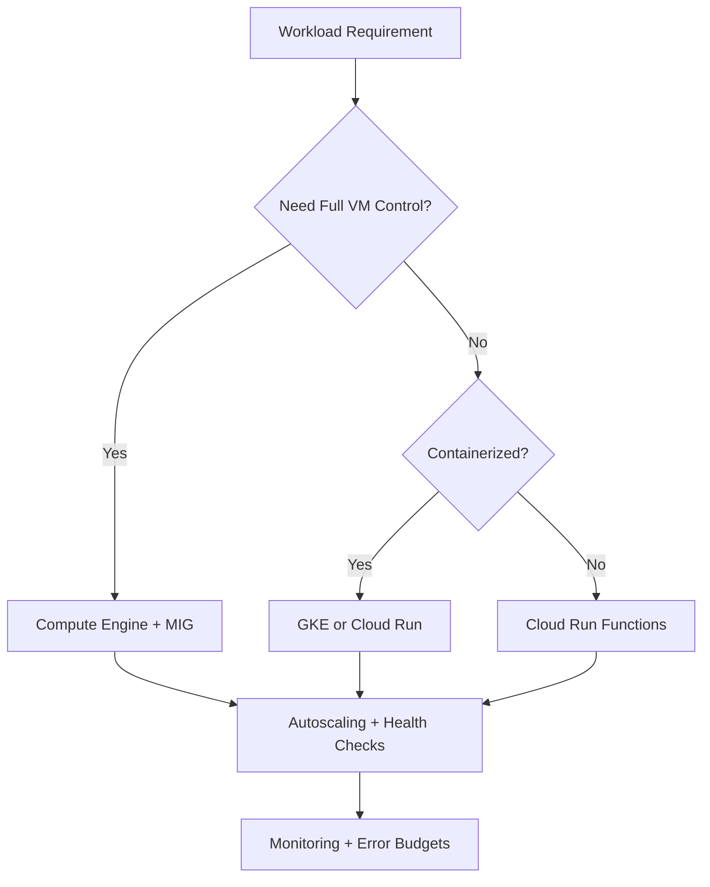
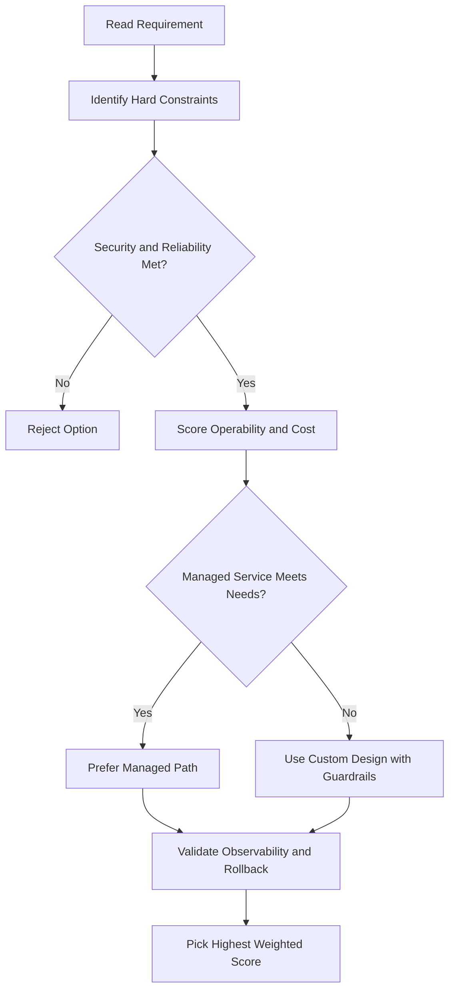
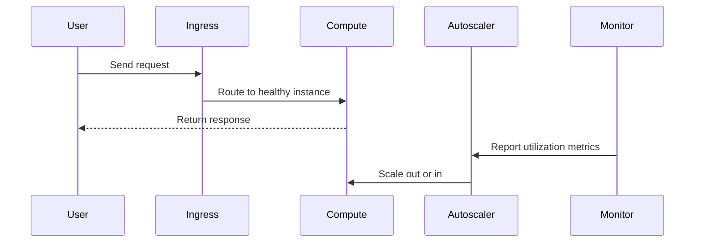

# Kubernetes Object Model and Declarative Management

## Two Core Concepts

### 1. The Kubernetes Object Model

- Everything Kubernetes manages is represented as an **object**
- You can view and change each object's attributes and state
- Objects are **persistent entities** that represent the state of something running in a cluster

Each object has two elements:

| Element           | Who sets it              | What it describes                 |
| ----------------- | ------------------------ | --------------------------------- |
| **Object spec**   | You                      | The _desired_ state of the object |
| **Object status** | Kubernetes control plane | The _current_ state of the object |

> **Kubernetes control plane** — the collection of system processes that collaborate to make a cluster work.

---

### 2. Declarative Management

- Tell Kubernetes the _desired state_; it figures out how to get there and stay there
- Implemented via a **watch loop**: Kubernetes continuously compares current state to desired state and remedies any drift

---

## Kubernetes Objects

- Objects represent:
  - Containerized applications
  - Resources available to them
  - Policies that affect their behavior
- Each object has a **kind** (its type)

---

## Pods — The Foundational Building Block

> A **Pod** is the smallest deployable Kubernetes object.

- Every running container in Kubernetes lives inside a Pod
- A Pod creates the environment where containers run
- A Pod can hold **one or more tightly coupled containers** that share resources

### Networking inside a Pod

- Kubernetes assigns each Pod a **unique IP address**
- All containers in a Pod share the same **network namespace** (IP address + ports)
- Containers within the same Pod communicate via **localhost (127.0.0.1)**

### Storage inside a Pod

- A Pod can specify **shared storage volumes** accessible by all its containers

---

## Declarative Management in Action — Example

**Goal:** Always keep 3 nginx web server containers running.

```
Desired state:  3 nginx Pods running
Current state:  0 Pods running
```

**Steps:**

1. Declare objects (Pods) representing the 3 nginx containers
2. Kubernetes control plane detects the mismatch (0 ≠ 3)
3. Kubernetes launches 3 Pods to match the desired state
4. Control plane **continuously monitors** the cluster, comparing reality to the declaration, and remediates as needed

```
Desired state (you declare) ──► Kubernetes watch loop ──► Current state (cluster)
                                        │
                          remediates drift automatically
```

## ACE Exam-Style Practice Questions

### Q1
In a Kubernetes Object Model Declarative Management cluster, one microservice is CPU-heavy while others are general purpose. How should you optimize?

A. Keep one node pool and only increase pod priority
B. Create dedicated compute-optimized node pool for CPU-heavy workload and keep general-purpose pool for others
C. Disable autoscaling
D. Move workload to Cloud Storage

Answer: B
Trap: Node pools allow workload-specific machine-family optimization.

### Q2
A Kubernetes Object Model Declarative Management deployment must be updated with minimal downtime. Which command pattern is best?

A. Delete and recreate service and deployment
B. kubectl set image deployment/NAME CONTAINER=NEW_IMAGE
C. Restart all cluster nodes
D. Create a new project for each version

Answer: B
Trap: Rolling image update is safer and faster than destructive redeploy patterns.

<!-- ACE_DEEP_ENRICHMENT_START -->
## ACE Deep Enrichment

### Think Like a Google Engineer
- Primary optimization axis: Elastic performance with minimum operational toil.
- Start with constraints first: SLO, security, compliance, latency, budget, and team operations capacity.
- Prefer managed services if they satisfy requirements with lower long-term operational toil.
- Minimize blast radius using environment isolation, least privilege, and failure-domain awareness.
- Design for day-2 operations: observability, rollback strategy, and quota or budget guardrails.

### Most Correct Option Filter (60 Seconds)
1. Eliminate options with broad access, single points of failure, or missing monitoring.
2. Confirm the option meets non-negotiables first: security and reliability requirements.
3. Compare remaining options on operational simplicity and long-term maintainability.
4. Use cost as an optimizer only after requirements and risk controls are satisfied.

### Weighted Decision Matrix
| Dimension | Weight | Strong Signal |
| --- | --- | --- |
| Security | 3 | Least privilege, secure defaults, no exposed blast radius |
| Reliability | 3 | Multi-zone or HA design, health checks, tested recovery path |
| Operability | 2 | Clear monitoring, alerting, rollout and rollback simplicity |
| Cost Efficiency | 2 | Right-sized resources, no waste, no reliability regression |
| Performance | 1 | Meets latency and throughput targets with headroom |

### Real-Life Scenario
A media startup has unpredictable traffic spikes during launches. They need faster releases, automatic scaling, and strong reliability without overpaying for idle capacity.

### Worked Example
- Choose managed compute first when operations overhead is a concern.
- For VM workloads, use managed instance groups with autoscaling and autohealing.
- For container workloads, use GKE node pools and rolling updates.
- For event-driven workloads, prefer Cloud Run or functions with concurrency controls.

### Flowchart


### Optimization Decision Flow


### Interaction Sequence


### Extra Exam Practice (10 Questions)
#### Q1
Scenario Focus: Kubernetes Object Model and Declarative Management
Traffic triples during business hours and falls overnight. Which compute pattern is best?

A. Use autoscaling with target utilization and baseline minimum capacity.
B. Pin capacity to peak traffic all day for safety.
C. Restart failed instances manually as incidents occur.
D. Use one large VM because horizontal scaling is complex.

Answer: A
Why the other options are weaker: They typically ignore at least one hard constraint such as security, reliability, cost efficiency, or operational simplicity.
Google-engineer check: Reconfirm SLO fit, blast radius, and day-2 maintainability before finalizing.

#### Q2
Scenario Focus: Kubernetes Object Model and Declarative Management
A VM app must self-heal when instances fail health checks. What should you use?

A. Restart failed instances manually as incidents occur.
B. Use a managed instance group with health checks and autohealing enabled.
C. Use one large VM because horizontal scaling is complex.
D. Deploy all changes at once without canary checks.

Answer: B
Why the other options are weaker: They typically ignore at least one hard constraint such as security, reliability, cost efficiency, or operational simplicity.
Google-engineer check: Reconfirm SLO fit, blast radius, and day-2 maintainability before finalizing.

#### Q3
Scenario Focus: Kubernetes Object Model and Declarative Management
A team wants to deploy containers without managing nodes. Which platform fits best?

A. Use one large VM because horizontal scaling is complex.
B. Deploy all changes at once without canary checks.
C. Use Cloud Run for containerized services when node management is not required.
D. Ignore utilization metrics and optimize only by guesswork.

Answer: C
Why the other options are weaker: They typically ignore at least one hard constraint such as security, reliability, cost efficiency, or operational simplicity.
Google-engineer check: Reconfirm SLO fit, blast radius, and day-2 maintainability before finalizing.

#### Q4
Scenario Focus: Kubernetes Object Model and Declarative Management
Which update strategy minimizes user impact during releases?

A. Deploy all changes at once without canary checks.
B. Ignore utilization metrics and optimize only by guesswork.
C. Pin capacity to peak traffic all day for safety.
D. Use rolling or blue-green deployment with health-based rollout checks.

Answer: D
Why the other options are weaker: They typically ignore at least one hard constraint such as security, reliability, cost efficiency, or operational simplicity.
Google-engineer check: Reconfirm SLO fit, blast radius, and day-2 maintainability before finalizing.

#### Q5
Scenario Focus: Kubernetes Object Model and Declarative Management
How do you avoid overprovisioning while keeping performance stable?

A. Right-size resources and monitor saturation, latency, and error rates continuously.
B. Ignore utilization metrics and optimize only by guesswork.
C. Pin capacity to peak traffic all day for safety.
D. Restart failed instances manually as incidents occur.

Answer: A
Why the other options are weaker: They typically ignore at least one hard constraint such as security, reliability, cost efficiency, or operational simplicity.
Google-engineer check: Reconfirm SLO fit, blast radius, and day-2 maintainability before finalizing.

#### Q6
Scenario Focus: Kubernetes Object Model and Declarative Management
Two designs both satisfy the happy path for Kubernetes Object Model and Declarative Management. Which choice is most correct?

A. Pin capacity to peak traffic all day for safety.
B. Choose the option that preserves reliability and security while reducing operational burden.
C. Restart failed instances manually as incidents occur.
D. Use one large VM because horizontal scaling is complex.

Answer: B
Why the other options are weaker: They typically ignore at least one hard constraint such as security, reliability, cost efficiency, or operational simplicity.
Google-engineer check: Reconfirm SLO fit, blast radius, and day-2 maintainability before finalizing.

#### Q7
Scenario Focus: Kubernetes Object Model and Declarative Management
What should you validate first before choosing an architecture for Kubernetes Object Model and Declarative Management?

A. Restart failed instances manually as incidents occur.
B. Use one large VM because horizontal scaling is complex.
C. Validate SLO fit, blast radius, and least-privilege controls before comparing convenience.
D. Deploy all changes at once without canary checks.

Answer: C
Why the other options are weaker: They typically ignore at least one hard constraint such as security, reliability, cost efficiency, or operational simplicity.
Google-engineer check: Reconfirm SLO fit, blast radius, and day-2 maintainability before finalizing.

#### Q8
Scenario Focus: Kubernetes Object Model and Declarative Management
A proposal lowers cost but increases failure risk. What is the best decision?

A. Use one large VM because horizontal scaling is complex.
B. Deploy all changes at once without canary checks.
C. Ignore utilization metrics and optimize only by guesswork.
D. Reject it unless reliability and recovery objectives remain within required targets.

Answer: D
Why the other options are weaker: They typically ignore at least one hard constraint such as security, reliability, cost efficiency, or operational simplicity.
Google-engineer check: Reconfirm SLO fit, blast radius, and day-2 maintainability before finalizing.

#### Q9
Scenario Focus: Kubernetes Object Model and Declarative Management
Which option best reflects optimization for Elastic performance with minimum operational toil?

A. Select the design that best meets Elastic performance with minimum operational toil while keeping constraints balanced.
B. Deploy all changes at once without canary checks.
C. Ignore utilization metrics and optimize only by guesswork.
D. Pin capacity to peak traffic all day for safety.

Answer: A
Why the other options are weaker: They typically ignore at least one hard constraint such as security, reliability, cost efficiency, or operational simplicity.
Google-engineer check: Reconfirm SLO fit, blast radius, and day-2 maintainability before finalizing.

#### Q10
Scenario Focus: Kubernetes Object Model and Declarative Management
How should you evaluate a design that needs frequent manual interventions?

A. Ignore utilization metrics and optimize only by guesswork.
B. Treat it as high risk and prefer automation-friendly designs with observability and rollback.
C. Pin capacity to peak traffic all day for safety.
D. Restart failed instances manually as incidents occur.

Answer: B
Why the other options are weaker: They typically ignore at least one hard constraint such as security, reliability, cost efficiency, or operational simplicity.
Google-engineer check: Reconfirm SLO fit, blast radius, and day-2 maintainability before finalizing.

### Quick Commands
```bash
gcloud compute instance-groups managed list --project=PROJECT_ID
gcloud compute instance-groups managed describe MIG_NAME --zone=ZONE --project=PROJECT_ID
gcloud run services list --region=REGION --project=PROJECT_ID
kubectl get pods -A
```

### Fast Recall
- Autoscaling is useful only with valid signals and guardrails.
- Managed offerings usually reduce operational burden.
- Deployment safety needs health checks and staged rollout.
<!-- ACE_DEEP_ENRICHMENT_END -->