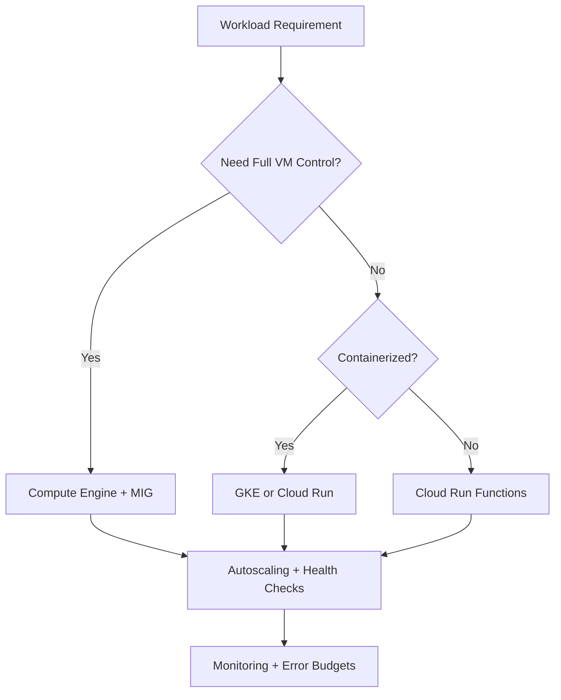
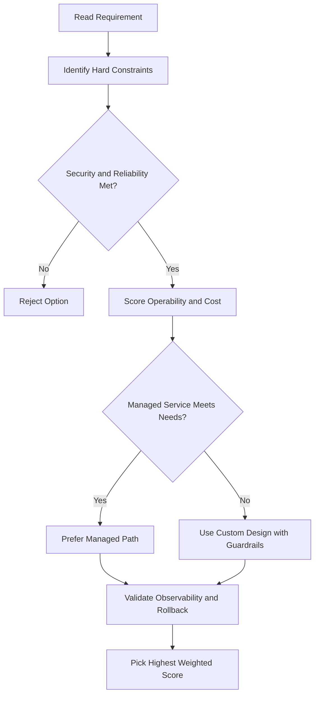
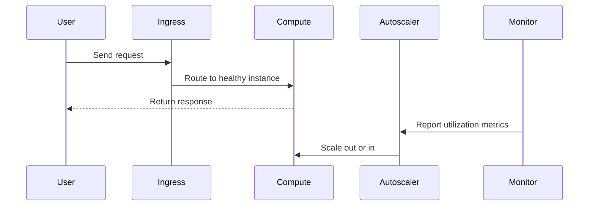

# Kubernetes Object Management

## Object Identity

Every Kubernetes object has:

| Identifier | Rules                                                                                                                                                    |
| ---------- | -------------------------------------------------------------------------------------------------------------------------------------------------------- |
| **Name**   | Unique string, max 253 characters; letters, numbers, hyphens, periods allowed; unique within a namespace at any given time; can be reused after deletion |
| **UID**    | Unique identifier generated by Kubernetes; unique across the entire life of the cluster                                                                  |
| **Labels** | Key-value pairs attached during or after creation; used to identify and organize objects                                                                 |

### Labels and Selectors

- Labels help identify and organize objects
- Use `kubectl` with **label selectors** to filter resources:
  - All resources where label `app=nginx`
  - All resources where label does NOT have a certain value
  - All resources where a label value is in a supplied set

---

## Manifest Files

- Objects are defined in **manifest files** — plain text files written in **YAML** (or JSON)
- Required fields in every manifest:

| Field        | Purpose                                                |
| ------------ | ------------------------------------------------------ |
| `apiVersion` | Kubernetes API version used to create the object       |
| `kind`       | The type of object (e.g., `Pod`, `Deployment`)         |
| `metadata`   | Name, unique ID, and optional namespace for the object |

### Best Practices for Manifests

- If several objects are related, define them all in the **same YAML file**
- Store YAML files in a **version-control repository** (e.g., Cloud Source Repositories)
  - Easier to track and manage changes
  - Easier to undo changes
  - Useful for recreating or restoring a cluster

---

## Pods vs. Controller Objects

### The Problem with Bare Pods

- Pods are **ephemeral and disposable** — they do not heal or repair themselves
- Not designed to run forever
- Declaring individual Pod objects does not guarantee high availability

### Controller Objects

A **controller object** manages the state of Pods automatically.

| Controller      | Use case                                                       |
| --------------- | -------------------------------------------------------------- |
| **Deployment**  | Long-lived components like web servers; manage a group of Pods |
| **StatefulSet** | Stateful apps that need stable identity and persistent storage |
| **DaemonSet**   | Run one Pod per node (e.g., log collectors, monitoring agents) |
| **Job**         | One-off or batch tasks that run to completion                  |

---

## Deployments — How They Work

**Goal:** Always keep 3 nginx Pods running.

```
Deployment (you declare)
    └── ReplicaSet (created by Deployment controller)
            ├── Pod 1 (nginx)
            ├── Pod 2 (nginx)
            └── Pod 3 (nginx)
```

**Flow:**

1. You declare a Deployment with `replicas: 3` in a single YAML manifest
2. `kube-scheduler` schedules Pods and notifies `kube-APIserver`
3. Deployment controller creates a **ReplicaSet** child object to launch the desired Pods
4. If a Pod fails, the ReplicaSet controller detects the drift (current ≠ desired) and launches a replacement

### What a Deployment Spec Defines

- Number of **replica Pods**
- Which **container image(s)** should run in the Pods
- Which **volumes** should be mounted

> A single Deployment YAML replaces the need for multiple individual Pod manifests.

## ACE Exam-Style Practice Questions

### Q1
In a Kubernetes Object Management cluster, one microservice is CPU-heavy while others are general purpose. How should you optimize?

A. Keep one node pool and only increase pod priority
B. Create dedicated compute-optimized node pool for CPU-heavy workload and keep general-purpose pool for others
C. Disable autoscaling
D. Move workload to Cloud Storage

Answer: B
Trap: Node pools allow workload-specific machine-family optimization.

### Q2
A Kubernetes Object Management deployment must be updated with minimal downtime. Which command pattern is best?

A. Delete and recreate service and deployment
B. kubectl set image deployment/NAME CONTAINER=NEW_IMAGE
C. Restart all cluster nodes
D. Create a new project for each version

Answer: B
Trap: Rolling image update is safer and faster than destructive redeploy patterns.

<!-- ACE_DEEP_ENRICHMENT_START -->
## ACE Deep Enrichment

### Think Like a Google Engineer
- Primary optimization axis: Elastic performance with minimum operational toil.
- Start with constraints first: SLO, security, compliance, latency, budget, and team operations capacity.
- Prefer managed services if they satisfy requirements with lower long-term operational toil.
- Minimize blast radius using environment isolation, least privilege, and failure-domain awareness.
- Design for day-2 operations: observability, rollback strategy, and quota or budget guardrails.

### Most Correct Option Filter (60 Seconds)
1. Eliminate options with broad access, single points of failure, or missing monitoring.
2. Confirm the option meets non-negotiables first: security and reliability requirements.
3. Compare remaining options on operational simplicity and long-term maintainability.
4. Use cost as an optimizer only after requirements and risk controls are satisfied.

### Weighted Decision Matrix
| Dimension | Weight | Strong Signal |
| --- | --- | --- |
| Security | 3 | Least privilege, secure defaults, no exposed blast radius |
| Reliability | 3 | Multi-zone or HA design, health checks, tested recovery path |
| Operability | 2 | Clear monitoring, alerting, rollout and rollback simplicity |
| Cost Efficiency | 2 | Right-sized resources, no waste, no reliability regression |
| Performance | 1 | Meets latency and throughput targets with headroom |

### Real-Life Scenario
A media startup has unpredictable traffic spikes during launches. They need faster releases, automatic scaling, and strong reliability without overpaying for idle capacity.

### Worked Example
- Choose managed compute first when operations overhead is a concern.
- For VM workloads, use managed instance groups with autoscaling and autohealing.
- For container workloads, use GKE node pools and rolling updates.
- For event-driven workloads, prefer Cloud Run or functions with concurrency controls.

### Flowchart


### Optimization Decision Flow


### Interaction Sequence


### Extra Exam Practice (15 Questions)
#### Q1
Scenario Focus: Kubernetes Object Management
Traffic triples during business hours and falls overnight. Which compute pattern is best?

A. Use autoscaling with target utilization and baseline minimum capacity.
B. Pin capacity to peak traffic all day for safety.
C. Restart failed instances manually as incidents occur.
D. Use one large VM because horizontal scaling is complex.

Answer: A
Why the other options are weaker: They typically ignore at least one hard constraint such as security, reliability, cost efficiency, or operational simplicity.
Google-engineer check: Reconfirm SLO fit, blast radius, and day-2 maintainability before finalizing.

#### Q2
Scenario Focus: Kubernetes Object Management
A VM app must self-heal when instances fail health checks. What should you use?

A. Restart failed instances manually as incidents occur.
B. Use a managed instance group with health checks and autohealing enabled.
C. Use one large VM because horizontal scaling is complex.
D. Deploy all changes at once without canary checks.

Answer: B
Why the other options are weaker: They typically ignore at least one hard constraint such as security, reliability, cost efficiency, or operational simplicity.
Google-engineer check: Reconfirm SLO fit, blast radius, and day-2 maintainability before finalizing.

#### Q3
Scenario Focus: Kubernetes Object Management
A team wants to deploy containers without managing nodes. Which platform fits best?

A. Use one large VM because horizontal scaling is complex.
B. Deploy all changes at once without canary checks.
C. Use Cloud Run for containerized services when node management is not required.
D. Ignore utilization metrics and optimize only by guesswork.

Answer: C
Why the other options are weaker: They typically ignore at least one hard constraint such as security, reliability, cost efficiency, or operational simplicity.
Google-engineer check: Reconfirm SLO fit, blast radius, and day-2 maintainability before finalizing.

#### Q4
Scenario Focus: Kubernetes Object Management
Which update strategy minimizes user impact during releases?

A. Deploy all changes at once without canary checks.
B. Ignore utilization metrics and optimize only by guesswork.
C. Pin capacity to peak traffic all day for safety.
D. Use rolling or blue-green deployment with health-based rollout checks.

Answer: D
Why the other options are weaker: They typically ignore at least one hard constraint such as security, reliability, cost efficiency, or operational simplicity.
Google-engineer check: Reconfirm SLO fit, blast radius, and day-2 maintainability before finalizing.

#### Q5
Scenario Focus: Kubernetes Object Management
How do you avoid overprovisioning while keeping performance stable?

A. Right-size resources and monitor saturation, latency, and error rates continuously.
B. Ignore utilization metrics and optimize only by guesswork.
C. Pin capacity to peak traffic all day for safety.
D. Restart failed instances manually as incidents occur.

Answer: A
Why the other options are weaker: They typically ignore at least one hard constraint such as security, reliability, cost efficiency, or operational simplicity.
Google-engineer check: Reconfirm SLO fit, blast radius, and day-2 maintainability before finalizing.

#### Q6
Scenario Focus: Kubernetes Object Management
Two designs both satisfy the happy path for Kubernetes Object Management. Which choice is most correct?

A. Pin capacity to peak traffic all day for safety.
B. Choose the option that preserves reliability and security while reducing operational burden.
C. Restart failed instances manually as incidents occur.
D. Use one large VM because horizontal scaling is complex.

Answer: B
Why the other options are weaker: They typically ignore at least one hard constraint such as security, reliability, cost efficiency, or operational simplicity.
Google-engineer check: Reconfirm SLO fit, blast radius, and day-2 maintainability before finalizing.

#### Q7
Scenario Focus: Kubernetes Object Management
What should you validate first before choosing an architecture for Kubernetes Object Management?

A. Restart failed instances manually as incidents occur.
B. Use one large VM because horizontal scaling is complex.
C. Validate SLO fit, blast radius, and least-privilege controls before comparing convenience.
D. Deploy all changes at once without canary checks.

Answer: C
Why the other options are weaker: They typically ignore at least one hard constraint such as security, reliability, cost efficiency, or operational simplicity.
Google-engineer check: Reconfirm SLO fit, blast radius, and day-2 maintainability before finalizing.

#### Q8
Scenario Focus: Kubernetes Object Management
A proposal lowers cost but increases failure risk. What is the best decision?

A. Use one large VM because horizontal scaling is complex.
B. Deploy all changes at once without canary checks.
C. Ignore utilization metrics and optimize only by guesswork.
D. Reject it unless reliability and recovery objectives remain within required targets.

Answer: D
Why the other options are weaker: They typically ignore at least one hard constraint such as security, reliability, cost efficiency, or operational simplicity.
Google-engineer check: Reconfirm SLO fit, blast radius, and day-2 maintainability before finalizing.

#### Q9
Scenario Focus: Kubernetes Object Management
Which option best reflects optimization for Elastic performance with minimum operational toil?

A. Select the design that best meets Elastic performance with minimum operational toil while keeping constraints balanced.
B. Deploy all changes at once without canary checks.
C. Ignore utilization metrics and optimize only by guesswork.
D. Pin capacity to peak traffic all day for safety.

Answer: A
Why the other options are weaker: They typically ignore at least one hard constraint such as security, reliability, cost efficiency, or operational simplicity.
Google-engineer check: Reconfirm SLO fit, blast radius, and day-2 maintainability before finalizing.

#### Q10
Scenario Focus: Kubernetes Object Management
How should you evaluate a design that needs frequent manual interventions?

A. Ignore utilization metrics and optimize only by guesswork.
B. Treat it as high risk and prefer automation-friendly designs with observability and rollback.
C. Pin capacity to peak traffic all day for safety.
D. Restart failed instances manually as incidents occur.

Answer: B
Why the other options are weaker: They typically ignore at least one hard constraint such as security, reliability, cost efficiency, or operational simplicity.
Google-engineer check: Reconfirm SLO fit, blast radius, and day-2 maintainability before finalizing.

#### Q11
Scenario Focus: Kubernetes Object Management
Two options have similar latency. Which tie-breaker is best?

A. Pin capacity to peak traffic all day for safety.
B. Restart failed instances manually as incidents occur.
C. Pick the option with stronger operability, clearer failure isolation, and simpler incident response.
D. Use one large VM because horizontal scaling is complex.

Answer: C
Why the other options are weaker: They typically ignore at least one hard constraint such as security, reliability, cost efficiency, or operational simplicity.
Google-engineer check: Reconfirm SLO fit, blast radius, and day-2 maintainability before finalizing.

#### Q12
Scenario Focus: Kubernetes Object Management
What is the best way to choose between a custom stack and a managed service?

A. Restart failed instances manually as incidents occur.
B. Use one large VM because horizontal scaling is complex.
C. Deploy all changes at once without canary checks.
D. Prefer managed services when they meet requirements with lower long-term maintenance effort.

Answer: D
Why the other options are weaker: They typically ignore at least one hard constraint such as security, reliability, cost efficiency, or operational simplicity.
Google-engineer check: Reconfirm SLO fit, blast radius, and day-2 maintainability before finalizing.

#### Q13
Scenario Focus: Kubernetes Object Management
How do you confirm a solution is production-ready for 

A. Verify monitoring, alerting, rollback path, quota and budget controls, and secure defaults.
B. Use one large VM because horizontal scaling is complex.
C. Deploy all changes at once without canary checks.
D. Ignore utilization metrics and optimize only by guesswork.

Answer: A
Why the other options are weaker: They typically ignore at least one hard constraint such as security, reliability, cost efficiency, or operational simplicity.
Google-engineer check: Reconfirm SLO fit, blast radius, and day-2 maintainability before finalizing.

#### Q14
Scenario Focus: Kubernetes Object Management
Which pattern usually wins in ACE scenario tie-breakers?

A. Deploy all changes at once without canary checks.
B. Managed-service-first plus least-privilege access plus clear observability usually wins.
C. Ignore utilization metrics and optimize only by guesswork.
D. Pin capacity to peak traffic all day for safety.

Answer: B
Why the other options are weaker: They typically ignore at least one hard constraint such as security, reliability, cost efficiency, or operational simplicity.
Google-engineer check: Reconfirm SLO fit, blast radius, and day-2 maintainability before finalizing.

#### Q15
Scenario Focus: Kubernetes Object Management
What is the best final check before locking the answer?

A. Ignore utilization metrics and optimize only by guesswork.
B. Pin capacity to peak traffic all day for safety.
C. Run a weighted check across security, reliability, cost, performance, and operability.
D. Restart failed instances manually as incidents occur.

Answer: C
Why the other options are weaker: They typically ignore at least one hard constraint such as security, reliability, cost efficiency, or operational simplicity.
Google-engineer check: Reconfirm SLO fit, blast radius, and day-2 maintainability before finalizing.

### Quick Commands
```bash
gcloud compute instance-groups managed list --project=PROJECT_ID
gcloud compute instance-groups managed describe MIG_NAME --zone=ZONE --project=PROJECT_ID
gcloud run services list --region=REGION --project=PROJECT_ID
kubectl get pods -A
```

### Fast Recall
- Autoscaling is useful only with valid signals and guardrails.
- Managed offerings usually reduce operational burden.
- Deployment safety needs health checks and staged rollout.
<!-- ACE_DEEP_ENRICHMENT_END -->