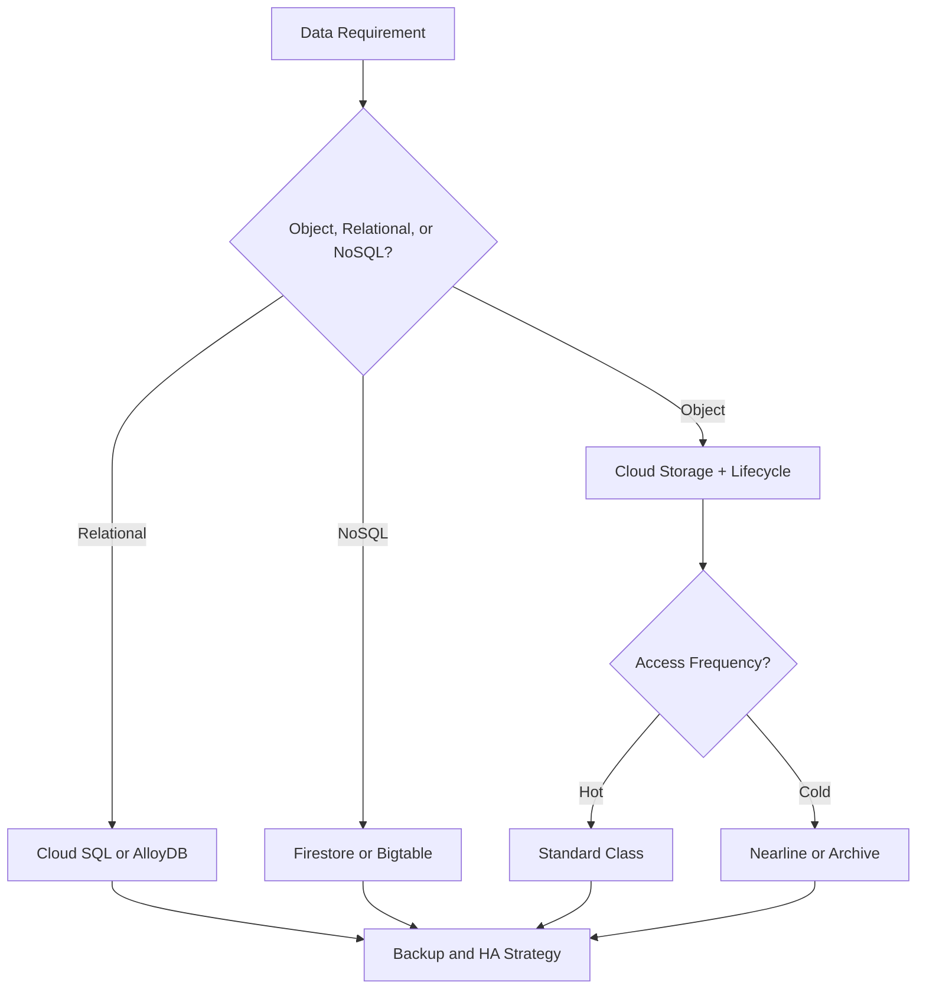
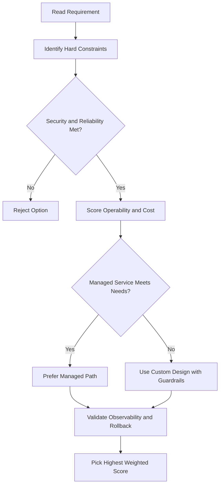
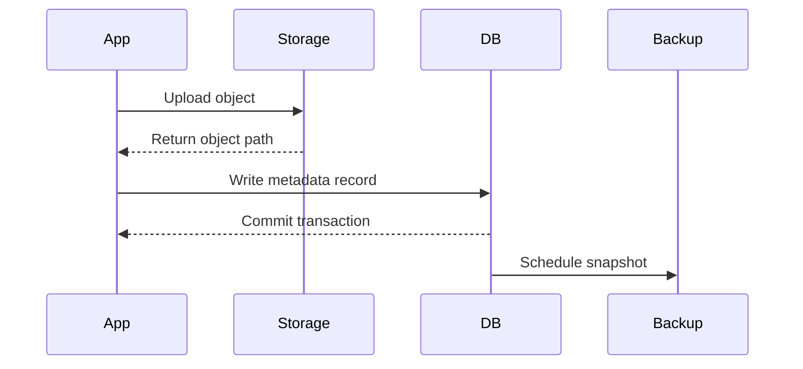

# 🔍 Storage Options Comparison

## Quick Reference

| Service           | Type       | Capacity    | Max Unit Size          | Best for                                                      |
| ----------------- | ---------- | ----------- | ---------------------- | ------------------------------------------------------------- |
| **Cloud Storage** | Object     | Petabytes   | 5 TB per object        | Immutable blobs >10 MB (images, videos, backups)              |
| **Cloud SQL**     | Relational | Up to 64 TB | —                      | Web frameworks, existing apps (user credentials, orders)      |
| **Spanner**       | Relational | Petabytes   | —                      | Full SQL + horizontal scalability, mission-critical workloads |
| **Firestore**     | NoSQL      | Terabytes   | 1 MB per entity        | Mobile/web apps needing real-time sync and offline support    |
| **Bigtable**      | NoSQL      | Petabytes   | 10 MB/cell, 100 MB/row | Analytical workloads, heavy read/write (AdTech, IoT, finance) |

---

## Decision Guide

- **Cloud Storage** — immutable blobs larger than 10 MB (images, videos, large files)
- **Cloud SQL** — full SQL + OLTP, existing web app frameworks
- **Spanner** — full SQL + OLTP, but needs horizontal scalability (beyond read replicas)
- **Firestore** — massive scaling, real-time queries, offline support, mobile/web apps
- **Bigtable** — large number of structured objects, no SQL/multi-row transactions needed, high read/write throughput

---

## What About BigQuery?

- BigQuery sits on the edge between **data storage and data processing**
- Not purely a storage product — main value is **big data analysis and interactive querying**
- Store data in BigQuery when you want to run large-scale analytics on it

---

## gcloud Commands

```bash
# Quick reference — list resources for each product
gcloud storage ls                   # Cloud Storage buckets
gcloud sql instances list           # Cloud SQL
gcloud spanner instances list       # Spanner
gcloud firestore databases list     # Firestore
gcloud bigtable instances list      # Bigtable
bq ls                               # BigQuery datasets (uses bq CLI, not gcloud)
```

## ACE Exam-Style Practice Questions

### Q1
In a Storage Comparison scenario, two answers seem technically possible. What tie-breaker should you apply first?

A. Pick the option with most manual steps
B. Pick the option with least privilege and least operational overhead that still meets requirements
C. Pick highest-cost option
D. Pick the oldest product

Answer: B
Trap: ACE-style scenarios reward secure, managed, requirement-fit decisions.

### Q2
For Storage Comparison, what is the best way to reduce wrong answers in multi-choice questions?

A. Ignore scaling and security words
B. Identify trigger words, eliminate over-privileged choices, then choose the managed fit
C. Always pick Compute Engine
D. Always pick the shortest option

Answer: B
Trap: Structured elimination is more reliable than memorization alone.

<!-- ACE_DEEP_ENRICHMENT_START -->
## ACE Deep Enrichment

### Think Like a Google Engineer
- Primary optimization axis: Durability and access-pattern fit at the lowest lifecycle cost.
- Start with constraints first: SLO, security, compliance, latency, budget, and team operations capacity.
- Prefer managed services if they satisfy requirements with lower long-term operational toil.
- Minimize blast radius using environment isolation, least privilege, and failure-domain awareness.
- Design for day-2 operations: observability, rollback strategy, and quota or budget guardrails.

### Most Correct Option Filter (60 Seconds)
1. Eliminate options with broad access, single points of failure, or missing monitoring.
2. Confirm the option meets non-negotiables first: security and reliability requirements.
3. Compare remaining options on operational simplicity and long-term maintainability.
4. Use cost as an optimizer only after requirements and risk controls are satisfied.

### Weighted Decision Matrix
| Dimension | Weight | Strong Signal |
| --- | --- | --- |
| Security | 3 | Least privilege, secure defaults, no exposed blast radius |
| Reliability | 3 | Multi-zone or HA design, health checks, tested recovery path |
| Operability | 2 | Clear monitoring, alerting, rollout and rollback simplicity |
| Cost Efficiency | 2 | Right-sized resources, no waste, no reliability regression |
| Performance | 1 | Meets latency and throughput targets with headroom |

### Real-Life Scenario
A healthcare SaaS stores user documents, transactional data, and low-latency session state. They must balance cost, durability, and performance under compliance constraints.

### Worked Example
- Map each data type to the right storage service by access pattern and consistency needs.
- Use lifecycle policies for object storage to control long-term cost.
- Select database engines based on query shape, scale, and relational requirements.
- Back up critical datasets and validate restore runbooks regularly.

### Flowchart


### Optimization Decision Flow


### Interaction Sequence


### Extra Exam Practice (15 Questions)
#### Q1

Scenario Focus: 🔍 Storage Options Comparison

Your logs are rarely accessed after 90 days. What storage policy is best?

A. Use lifecycle rules to transition objects to colder storage classes after 90 days.  
B. Keep everything in the most expensive hot class forever.  
C. Use local disk snapshots as the only backup strategy.  
D. Pick a database only by familiarity and ignore access patterns.

Answer: A  
Why the other options are weaker: They typically ignore at least one hard constraint such as security, reliability, cost efficiency, or operational simplicity.  
Google-engineer check: Reconfirm SLO fit, blast radius, and day-2 maintainability before finalizing.

#### Q2

Scenario Focus: 🔍 Storage Options Comparison

A workload requires relational transactions and managed operations. Which database is best?

A. Use local disk snapshots as the only backup strategy.  
B. Use Cloud SQL or AlloyDB for managed relational workloads with transaction support.  
C. Pick a database only by familiarity and ignore access patterns.  
D. Store transactional records only in object storage.

Answer: B  
Why the other options are weaker: They typically ignore at least one hard constraint such as security, reliability, cost efficiency, or operational simplicity.  
Google-engineer check: Reconfirm SLO fit, blast radius, and day-2 maintainability before finalizing.

#### Q3

Scenario Focus: 🔍 Storage Options Comparison

Which practice improves durability and recovery posture most?

A. Pick a database only by familiarity and ignore access patterns.  
B. Store transactional records only in object storage.  
C. Enable backups with tested restore procedures and clear recovery objectives.  
D. Skip restore drills because backups are assumed valid.

Answer: C  
Why the other options are weaker: They typically ignore at least one hard constraint such as security, reliability, cost efficiency, or operational simplicity.  
Google-engineer check: Reconfirm SLO fit, blast radius, and day-2 maintainability before finalizing.

#### Q4

Scenario Focus: 🔍 Storage Options Comparison

A key-value workload needs very high scale and low latency. Which service fits?

A. Store transactional records only in object storage.  
B. Skip restore drills because backups are assumed valid.  
C. Keep everything in the most expensive hot class forever.  
D. Use Bigtable for high-throughput low-latency wide-column workloads.

Answer: D  
Why the other options are weaker: They typically ignore at least one hard constraint such as security, reliability, cost efficiency, or operational simplicity.  
Google-engineer check: Reconfirm SLO fit, blast radius, and day-2 maintainability before finalizing.

#### Q5

Scenario Focus: 🔍 Storage Options Comparison

How should you choose a storage class on the exam?

A. Choose based on access frequency, retention period, and retrieval latency requirements.  
B. Skip restore drills because backups are assumed valid.  
C. Keep everything in the most expensive hot class forever.  
D. Use local disk snapshots as the only backup strategy.

Answer: A  
Why the other options are weaker: They typically ignore at least one hard constraint such as security, reliability, cost efficiency, or operational simplicity.  
Google-engineer check: Reconfirm SLO fit, blast radius, and day-2 maintainability before finalizing.

#### Q6

Scenario Focus: 🔍 Storage Options Comparison

Two designs both satisfy the happy path for 🔍 Storage Options Comparison. Which choice is most correct?

A. Keep everything in the most expensive hot class forever.  
B. Choose the option that preserves reliability and security while reducing operational burden.  
C. Use local disk snapshots as the only backup strategy.  
D. Pick a database only by familiarity and ignore access patterns.

Answer: B  
Why the other options are weaker: They typically ignore at least one hard constraint such as security, reliability, cost efficiency, or operational simplicity.  
Google-engineer check: Reconfirm SLO fit, blast radius, and day-2 maintainability before finalizing.

#### Q7

Scenario Focus: 🔍 Storage Options Comparison

What should you validate first before choosing an architecture for 🔍 Storage Options Comparison?

A. Use local disk snapshots as the only backup strategy.  
B. Pick a database only by familiarity and ignore access patterns.  
C. Validate SLO fit, blast radius, and least-privilege controls before comparing convenience.  
D. Store transactional records only in object storage.

Answer: C  
Why the other options are weaker: They typically ignore at least one hard constraint such as security, reliability, cost efficiency, or operational simplicity.  
Google-engineer check: Reconfirm SLO fit, blast radius, and day-2 maintainability before finalizing.

#### Q8

Scenario Focus: 🔍 Storage Options Comparison

A proposal lowers cost but increases failure risk. What is the best decision?

A. Pick a database only by familiarity and ignore access patterns.  
B. Store transactional records only in object storage.  
C. Skip restore drills because backups are assumed valid.  
D. Reject it unless reliability and recovery objectives remain within required targets.

Answer: D  
Why the other options are weaker: They typically ignore at least one hard constraint such as security, reliability, cost efficiency, or operational simplicity.  
Google-engineer check: Reconfirm SLO fit, blast radius, and day-2 maintainability before finalizing.

#### Q9

Scenario Focus: 🔍 Storage Options Comparison

Which option best reflects optimization for Durability and access-pattern fit at the lowest lifecycle cost?

A. Select the design that best meets Durability and access-pattern fit at the lowest lifecycle cost while keeping constraints balanced.  
B. Store transactional records only in object storage.  
C. Skip restore drills because backups are assumed valid.  
D. Keep everything in the most expensive hot class forever.

Answer: A  
Why the other options are weaker: They typically ignore at least one hard constraint such as security, reliability, cost efficiency, or operational simplicity.  
Google-engineer check: Reconfirm SLO fit, blast radius, and day-2 maintainability before finalizing.

#### Q10

Scenario Focus: 🔍 Storage Options Comparison

How should you evaluate a design that needs frequent manual interventions?

A. Skip restore drills because backups are assumed valid.  
B. Treat it as high risk and prefer automation-friendly designs with observability and rollback.  
C. Keep everything in the most expensive hot class forever.  
D. Use local disk snapshots as the only backup strategy.

Answer: B  
Why the other options are weaker: They typically ignore at least one hard constraint such as security, reliability, cost efficiency, or operational simplicity.  
Google-engineer check: Reconfirm SLO fit, blast radius, and day-2 maintainability before finalizing.

#### Q11

Scenario Focus: 🔍 Storage Options Comparison

Two options have similar latency. Which tie-breaker is best?

A. Keep everything in the most expensive hot class forever.  
B. Use local disk snapshots as the only backup strategy.  
C. Pick the option with stronger operability, clearer failure isolation, and simpler incident response.  
D. Pick a database only by familiarity and ignore access patterns.

Answer: C  
Why the other options are weaker: They typically ignore at least one hard constraint such as security, reliability, cost efficiency, or operational simplicity.  
Google-engineer check: Reconfirm SLO fit, blast radius, and day-2 maintainability before finalizing.

#### Q12

Scenario Focus: 🔍 Storage Options Comparison

What is the best way to choose between a custom stack and a managed service?

A. Use local disk snapshots as the only backup strategy.  
B. Pick a database only by familiarity and ignore access patterns.  
C. Store transactional records only in object storage.  
D. Prefer managed services when they meet requirements with lower long-term maintenance effort.

Answer: D  
Why the other options are weaker: They typically ignore at least one hard constraint such as security, reliability, cost efficiency, or operational simplicity.  
Google-engineer check: Reconfirm SLO fit, blast radius, and day-2 maintainability before finalizing.

#### Q13

Scenario Focus: 🔍 Storage Options Comparison

How do you confirm a solution is production-ready for 

A. Verify monitoring, alerting, rollback path, quota and budget controls, and secure defaults.  
B. Pick a database only by familiarity and ignore access patterns.  
C. Store transactional records only in object storage.  
D. Skip restore drills because backups are assumed valid.

Answer: A  
Why the other options are weaker: They typically ignore at least one hard constraint such as security, reliability, cost efficiency, or operational simplicity.  
Google-engineer check: Reconfirm SLO fit, blast radius, and day-2 maintainability before finalizing.

#### Q14

Scenario Focus: 🔍 Storage Options Comparison

Which pattern usually wins in ACE scenario tie-breakers?

A. Store transactional records only in object storage.  
B. Managed-service-first plus least-privilege access plus clear observability usually wins.  
C. Skip restore drills because backups are assumed valid.  
D. Keep everything in the most expensive hot class forever.

Answer: B  
Why the other options are weaker: They typically ignore at least one hard constraint such as security, reliability, cost efficiency, or operational simplicity.  
Google-engineer check: Reconfirm SLO fit, blast radius, and day-2 maintainability before finalizing.

#### Q15

Scenario Focus: 🔍 Storage Options Comparison

What is the best final check before locking the answer?

A. Skip restore drills because backups are assumed valid.  
B. Keep everything in the most expensive hot class forever.  
C. Run a weighted check across security, reliability, cost, performance, and operability.  
D. Use local disk snapshots as the only backup strategy.

Answer: C  
Why the other options are weaker: They typically ignore at least one hard constraint such as security, reliability, cost efficiency, or operational simplicity.  
Google-engineer check: Reconfirm SLO fit, blast radius, and day-2 maintainability before finalizing.

### Quick Commands
```bash
gcloud storage ls --project=PROJECT_ID
gcloud sql instances list --project=PROJECT_ID
gcloud firestore databases list --project=PROJECT_ID
gcloud bigtable instances list --project=PROJECT_ID
```

### Fast Recall
- Data service choice is a pattern-matching question.
- Lifecycle rules are a common cost optimization lever.
- Backup without restore validation is not a complete strategy.
<!-- ACE_DEEP_ENRICHMENT_END -->