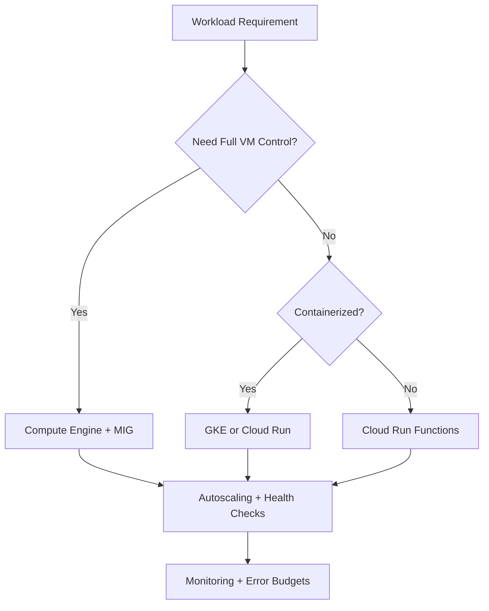
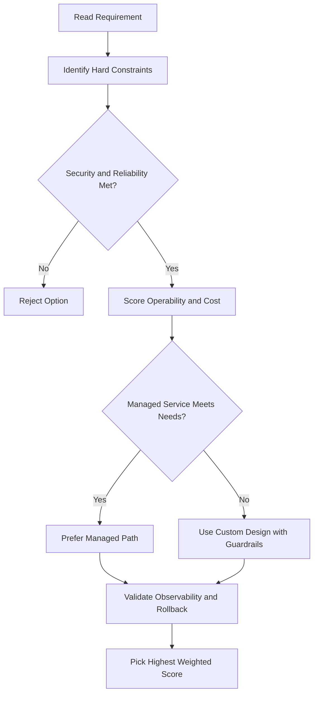
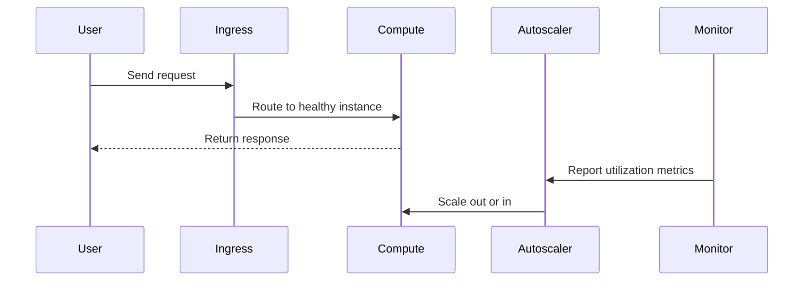

# 📦 Containers

## Evolution of Application Deployment

### Era 1 — Physical Servers

- Apps ran on dedicated local computers
- Required physical space, power, cooling, and network connectivity
- Each machine typically had **one purpose** (database, web server, CDN)
- Wasted resources, slow to deploy and scale

### Era 2 — Virtualization

- A **hypervisor** (e.g. KVM) breaks the dependency of an OS on the underlying hardware
- Multiple virtual machines share one physical host
- Faster to deploy, less hardware waste, better portability (VMs can be imaged and moved)
- **Still: each VM bundles the app + all dependencies + a full OS**

### The Dependency Problem with VMs

When multiple apps share a single VM:

- One app's heavy resource use **starves other apps**
- A dependency upgrade for one app **can break another**
- Locking down dependencies stops upgrades; allowing upgrades risks breakage
- Integration tests slow down development and don't always catch the problem

**Dedicated VMs per app** solve isolation, but at the cost of running a full duplicate kernel for every single app — inefficient at scale.

### Era 3 — Containers

Instead of virtualizing the whole machine, abstract at the level of the **user space** (everything above the kernel: apps + their dependencies).

> **User space** = all code that resides above the kernel, including applications and their dependencies.

- Containers are **isolated user spaces** for running application code
- They share the host OS kernel — no full guest OS per container
- Start and stop as fast as a regular OS process (no OS boot)
- Lightweight, portable, and can be scheduled tightly with the underlying system

---

## The Problem with Virtual Machines

With **IaaS** (like Compute Engine), you rent a virtual machine and get full control — your own OS, hardware access, RAM, storage, networking. Great flexibility, but with a catch:

- The **smallest deployable unit is an entire VM**
- The guest OS alone can be **gigabytes in size**
- Booting a VM can take **minutes**
- Scaling means copying the whole VM and booting a new OS each time — slow and expensive

---

## What is a Container?

Think of a container as an **invisible box around your code and everything it needs to run** (libraries, dependencies, config).

- It gets its own slice of the file system and hardware
- It starts **as fast as a regular process** (seconds, not minutes)
- It only needs the host OS kernel + a container runtime — no full guest OS required

> In simple terms: the OS itself is being virtualized, not the hardware.

---

## Why Containers Are Better for Scaling

|               | Virtual Machines    | Containers     |
| ------------- | ------------------- | -------------- |
| Startup time  | Minutes             | Seconds        |
| Size          | Gigabytes (full OS) | Megabytes      |
| Portability   | Hard to move        | Works anywhere |
| Scaling speed | Slow                | Very fast      |

- You can run **dozens or hundreds of containers on a single host**
- They scale up and down in **seconds**

---

## Containers Are Ultra Portable

Because the OS and hardware are treated as a black box, your container works the same everywhere:

- Your **laptop** → **staging** → **production**
- On-premise → **Google Cloud**

No rebuilding, no reconfiguring. Just move and run.

---

## Containers vs IaaS vs PaaS

|                 | IaaS | PaaS | Containers      |
| --------------- | ---- | ---- | --------------- |
| Flexibility     | High | Low  | High            |
| Scalability     | Slow | Fast | Fast            |
| Control over OS | Yes  | No   | Yes (via image) |

Containers give you the **scalability of PaaS** with the **flexibility of IaaS** — best of both worlds.

---

## Microservices with Containers

Instead of one giant app, you can split your application into small pieces called **microservices** — each running in its own container doing one job.

- Each piece can be **deployed independently**
- Each piece can be **scaled independently**
- They talk to each other over **network connections**

If one container fails, the rest keep running. If one part gets more traffic, only that container scales — not the whole app.

---

## Why Containers Appeal to Developers

1. **Code-centric delivery** — package code + all its dependencies together; the container engine makes them available at runtime
2. **Reliable, consistent environment** — Linux kernel base means code runs the same on a laptop, staging server, or production VM
3. **Fast incremental deploys** — changes based on a production image are a single file copy
4. **Microservices-friendly** — loosely coupled, fine-grained components that can be scaled and upgraded independently without affecting the whole application

---

## Key Takeaway

Containers make your code:

- **Portable** — run anywhere without changes
- **Lightweight** — no bloated OS per instance
- **Fast to scale** — spin up in seconds
- **Easy to manage** — break your app into focused, independent services

---

## Images vs Containers

- An **image** = the application + all its dependencies, packaged together
- A **container** = a running instance of an image
- Developers can build and ship an image without worrying about the target system

Software needed to build and run container images: **Docker** (open-source).
- Docker creates and runs containers but does not orchestrate them at scale — that's what Kubernetes does
- Google's **Cloud Build** is used to create Docker-formatted container images in GCP

---

## How Containers Achieve Isolation (Linux Technologies)

Containers combine four Linux technologies to isolate workloads:

| Technology | What it controls |
|---|---|
| **Linux processes** | Each process has its own virtual memory address space; can be rapidly created/destroyed |
| **Linux namespaces** | What an app can **see** — process IDs, directory trees, IP addresses, etc. |
| **Linux cgroups** | What an app can **use** — max CPU time, memory, I/O bandwidth, other resources |
| **Union file systems** | Bundles everything into clean, minimal layers |

> Note: Linux namespaces ≠ Kubernetes namespaces — they are different concepts.

---

## Container Images and Dockerfile Layers

A container image is built from **layers**, defined by a **Dockerfile** (the container manifest).

- Each instruction in a Dockerfile creates one read-only layer
- When a container runs, a thin **writable layer** is added on top (the container layer)

### Simple Dockerfile Example

```dockerfile
FROM ubuntu:22.04        # Base layer — pulled from a public repo
COPY . /app              # Layer 2 — copies files from build directory
RUN make /app            # Layer 3 — compiles the application
CMD ["/app/myapp"]       # Specifies the command to run at container launch
```

**Layer ordering rule:** Put layers least likely to change at the **top**, most likely to change at the **bottom** — this speeds up rebuilds.

### Multi-Stage Builds (Best Practice)

Building and shipping in the same container is not best practice:
- Build tools are clutter in a deployed container
- Build tools increase the attack surface

Modern approach: **multi-stage builds**
- Stage 1 container: builds the final executable
- Stage 2 container: receives only what is needed to run — no build tooling

---

## The Container Layer (Ephemeral Storage)

When a container starts, a writable **container layer** is added on top of the image layers:

- All writes (new files, modifications, deletions) go to this layer
- This layer is **ephemeral** — when the container is deleted, this data is gone forever
- The underlying image remains unchanged

**Implication for app design:** Permanent data must be stored outside the running container (e.g., a database, Cloud Storage, a persistent volume).

### How Multiple Containers Share an Image

- Multiple containers can share the same underlying image
- Each gets its own writable container layer, so each maintains its own data state
- Only the difference between versions needs to be copied — much faster than spinning up a new VM

Example:
- Base image: 200 MB
- Next point release: only 200 KB difference — just that delta layer is pulled/pushed

---

## Getting Container Images

### Where to get images

| Registry | Notes |
|---|---|
| **Google Artifact Registry** (`pkg.dev`) | Public open-source images + private project images; integrated with IAM |
| **Docker Hub** | Large public registry |
| **GitLab** | Also hosts public/private images |

### Google Artifact Registry
- Stores both public images and private project images
- Integrated with **Cloud IAM** — private images are access-controlled per project

---

## Cloud Build

Google's managed service for building container images.

- Integrated with **Cloud IAM**
- Retrieves source code from:
  - Cloud Source Repositories
  - GitHub
  - Bitbucket (any git-compatible repo)

### Build Steps
Each build step runs in a Docker container and can:
- Fetch dependencies
- Compile source code
- Run integration tests
- Use tools like Docker, Gradle, Maven

### Delivery Targets
After building, Cloud Build can deliver images to:
- **Google Kubernetes Engine (GKE)**
- **App Engine**
- **Cloud Run / Cloud Run functions**

---

## gcloud Commands

```bash
# Build and push a container image using Cloud Build
gcloud builds submit --tag gcr.io/PROJECT_ID/my-image .

# Create an Artifact Registry repository
gcloud artifacts repositories create my-repo \
  --repository-format=docker --location=us-central1

# List images in Artifact Registry
gcloud artifacts docker images list \
  us-central1-docker.pkg.dev/PROJECT_ID/my-repo
```

## ACE Exam-Style Practice Questions

### Q1
In a Containers scenario, two answers seem technically possible. What tie-breaker should you apply first?

A. Pick the option with most manual steps
B. Pick the option with least privilege and least operational overhead that still meets requirements
C. Pick highest-cost option
D. Pick the oldest product

Answer: B
Trap: ACE-style scenarios reward secure, managed, requirement-fit decisions.

### Q2
For Containers, what is the best way to reduce wrong answers in multi-choice questions?

A. Ignore scaling and security words
B. Identify trigger words, eliminate over-privileged choices, then choose the managed fit
C. Always pick Compute Engine
D. Always pick the shortest option

Answer: B
Trap: Structured elimination is more reliable than memorization alone.

<!-- ACE_DEEP_ENRICHMENT_START -->
## ACE Deep Enrichment

### Think Like a Google Engineer
- Primary optimization axis: Elastic performance with minimum operational toil.
- Start with constraints first: SLO, security, compliance, latency, budget, and team operations capacity.
- Prefer managed services if they satisfy requirements with lower long-term operational toil.
- Minimize blast radius using environment isolation, least privilege, and failure-domain awareness.
- Design for day-2 operations: observability, rollback strategy, and quota or budget guardrails.

### Most Correct Option Filter (60 Seconds)
1. Eliminate options with broad access, single points of failure, or missing monitoring.
2. Confirm the option meets non-negotiables first: security and reliability requirements.
3. Compare remaining options on operational simplicity and long-term maintainability.
4. Use cost as an optimizer only after requirements and risk controls are satisfied.

### Weighted Decision Matrix
| Dimension | Weight | Strong Signal |
| --- | --- | --- |
| Security | 3 | Least privilege, secure defaults, no exposed blast radius |
| Reliability | 3 | Multi-zone or HA design, health checks, tested recovery path |
| Operability | 2 | Clear monitoring, alerting, rollout and rollback simplicity |
| Cost Efficiency | 2 | Right-sized resources, no waste, no reliability regression |
| Performance | 1 | Meets latency and throughput targets with headroom |

### Real-Life Scenario
A media startup has unpredictable traffic spikes during launches. They need faster releases, automatic scaling, and strong reliability without overpaying for idle capacity.

### Worked Example
- Choose managed compute first when operations overhead is a concern.
- For VM workloads, use managed instance groups with autoscaling and autohealing.
- For container workloads, use GKE node pools and rolling updates.
- For event-driven workloads, prefer Cloud Run or functions with concurrency controls.

### Flowchart


### Optimization Decision Flow


### Interaction Sequence


### Extra Exam Practice (15 Questions)
#### Q1
Scenario Focus: 📦 Containers
Traffic triples during business hours and falls overnight. Which compute pattern is best?

A. Use autoscaling with target utilization and baseline minimum capacity.
B. Pin capacity to peak traffic all day for safety.
C. Restart failed instances manually as incidents occur.
D. Use one large VM because horizontal scaling is complex.

Answer: A
Why the other options are weaker: They typically ignore at least one hard constraint such as security, reliability, cost efficiency, or operational simplicity.
Google-engineer check: Reconfirm SLO fit, blast radius, and day-2 maintainability before finalizing.

#### Q2
Scenario Focus: 📦 Containers
A VM app must self-heal when instances fail health checks. What should you use?

A. Restart failed instances manually as incidents occur.
B. Use a managed instance group with health checks and autohealing enabled.
C. Use one large VM because horizontal scaling is complex.
D. Deploy all changes at once without canary checks.

Answer: B
Why the other options are weaker: They typically ignore at least one hard constraint such as security, reliability, cost efficiency, or operational simplicity.
Google-engineer check: Reconfirm SLO fit, blast radius, and day-2 maintainability before finalizing.

#### Q3
Scenario Focus: 📦 Containers
A team wants to deploy containers without managing nodes. Which platform fits best?

A. Use one large VM because horizontal scaling is complex.
B. Deploy all changes at once without canary checks.
C. Use Cloud Run for containerized services when node management is not required.
D. Ignore utilization metrics and optimize only by guesswork.

Answer: C
Why the other options are weaker: They typically ignore at least one hard constraint such as security, reliability, cost efficiency, or operational simplicity.
Google-engineer check: Reconfirm SLO fit, blast radius, and day-2 maintainability before finalizing.

#### Q4
Scenario Focus: 📦 Containers
Which update strategy minimizes user impact during releases?

A. Deploy all changes at once without canary checks.
B. Ignore utilization metrics and optimize only by guesswork.
C. Pin capacity to peak traffic all day for safety.
D. Use rolling or blue-green deployment with health-based rollout checks.

Answer: D
Why the other options are weaker: They typically ignore at least one hard constraint such as security, reliability, cost efficiency, or operational simplicity.
Google-engineer check: Reconfirm SLO fit, blast radius, and day-2 maintainability before finalizing.

#### Q5
Scenario Focus: 📦 Containers
How do you avoid overprovisioning while keeping performance stable?

A. Right-size resources and monitor saturation, latency, and error rates continuously.
B. Ignore utilization metrics and optimize only by guesswork.
C. Pin capacity to peak traffic all day for safety.
D. Restart failed instances manually as incidents occur.

Answer: A
Why the other options are weaker: They typically ignore at least one hard constraint such as security, reliability, cost efficiency, or operational simplicity.
Google-engineer check: Reconfirm SLO fit, blast radius, and day-2 maintainability before finalizing.

#### Q6
Scenario Focus: 📦 Containers
Two designs both satisfy the happy path for 📦 Containers. Which choice is most correct?

A. Pin capacity to peak traffic all day for safety.
B. Choose the option that preserves reliability and security while reducing operational burden.
C. Restart failed instances manually as incidents occur.
D. Use one large VM because horizontal scaling is complex.

Answer: B
Why the other options are weaker: They typically ignore at least one hard constraint such as security, reliability, cost efficiency, or operational simplicity.
Google-engineer check: Reconfirm SLO fit, blast radius, and day-2 maintainability before finalizing.

#### Q7
Scenario Focus: 📦 Containers
What should you validate first before choosing an architecture for 📦 Containers?

A. Restart failed instances manually as incidents occur.
B. Use one large VM because horizontal scaling is complex.
C. Validate SLO fit, blast radius, and least-privilege controls before comparing convenience.
D. Deploy all changes at once without canary checks.

Answer: C
Why the other options are weaker: They typically ignore at least one hard constraint such as security, reliability, cost efficiency, or operational simplicity.
Google-engineer check: Reconfirm SLO fit, blast radius, and day-2 maintainability before finalizing.

#### Q8
Scenario Focus: 📦 Containers
A proposal lowers cost but increases failure risk. What is the best decision?

A. Use one large VM because horizontal scaling is complex.
B. Deploy all changes at once without canary checks.
C. Ignore utilization metrics and optimize only by guesswork.
D. Reject it unless reliability and recovery objectives remain within required targets.

Answer: D
Why the other options are weaker: They typically ignore at least one hard constraint such as security, reliability, cost efficiency, or operational simplicity.
Google-engineer check: Reconfirm SLO fit, blast radius, and day-2 maintainability before finalizing.

#### Q9
Scenario Focus: 📦 Containers
Which option best reflects optimization for Elastic performance with minimum operational toil?

A. Select the design that best meets Elastic performance with minimum operational toil while keeping constraints balanced.
B. Deploy all changes at once without canary checks.
C. Ignore utilization metrics and optimize only by guesswork.
D. Pin capacity to peak traffic all day for safety.

Answer: A
Why the other options are weaker: They typically ignore at least one hard constraint such as security, reliability, cost efficiency, or operational simplicity.
Google-engineer check: Reconfirm SLO fit, blast radius, and day-2 maintainability before finalizing.

#### Q10
Scenario Focus: 📦 Containers
How should you evaluate a design that needs frequent manual interventions?

A. Ignore utilization metrics and optimize only by guesswork.
B. Treat it as high risk and prefer automation-friendly designs with observability and rollback.
C. Pin capacity to peak traffic all day for safety.
D. Restart failed instances manually as incidents occur.

Answer: B
Why the other options are weaker: They typically ignore at least one hard constraint such as security, reliability, cost efficiency, or operational simplicity.
Google-engineer check: Reconfirm SLO fit, blast radius, and day-2 maintainability before finalizing.

#### Q11
Scenario Focus: 📦 Containers
Two options have similar latency. Which tie-breaker is best?

A. Pin capacity to peak traffic all day for safety.
B. Restart failed instances manually as incidents occur.
C. Pick the option with stronger operability, clearer failure isolation, and simpler incident response.
D. Use one large VM because horizontal scaling is complex.

Answer: C
Why the other options are weaker: They typically ignore at least one hard constraint such as security, reliability, cost efficiency, or operational simplicity.
Google-engineer check: Reconfirm SLO fit, blast radius, and day-2 maintainability before finalizing.

#### Q12
Scenario Focus: 📦 Containers
What is the best way to choose between a custom stack and a managed service?

A. Restart failed instances manually as incidents occur.
B. Use one large VM because horizontal scaling is complex.
C. Deploy all changes at once without canary checks.
D. Prefer managed services when they meet requirements with lower long-term maintenance effort.

Answer: D
Why the other options are weaker: They typically ignore at least one hard constraint such as security, reliability, cost efficiency, or operational simplicity.
Google-engineer check: Reconfirm SLO fit, blast radius, and day-2 maintainability before finalizing.

#### Q13
Scenario Focus: 📦 Containers
How do you confirm a solution is production-ready for 

A. Verify monitoring, alerting, rollback path, quota and budget controls, and secure defaults.
B. Use one large VM because horizontal scaling is complex.
C. Deploy all changes at once without canary checks.
D. Ignore utilization metrics and optimize only by guesswork.

Answer: A
Why the other options are weaker: They typically ignore at least one hard constraint such as security, reliability, cost efficiency, or operational simplicity.
Google-engineer check: Reconfirm SLO fit, blast radius, and day-2 maintainability before finalizing.

#### Q14
Scenario Focus: 📦 Containers
Which pattern usually wins in ACE scenario tie-breakers?

A. Deploy all changes at once without canary checks.
B. Managed-service-first plus least-privilege access plus clear observability usually wins.
C. Ignore utilization metrics and optimize only by guesswork.
D. Pin capacity to peak traffic all day for safety.

Answer: B
Why the other options are weaker: They typically ignore at least one hard constraint such as security, reliability, cost efficiency, or operational simplicity.
Google-engineer check: Reconfirm SLO fit, blast radius, and day-2 maintainability before finalizing.

#### Q15
Scenario Focus: 📦 Containers
What is the best final check before locking the answer?

A. Ignore utilization metrics and optimize only by guesswork.
B. Pin capacity to peak traffic all day for safety.
C. Run a weighted check across security, reliability, cost, performance, and operability.
D. Restart failed instances manually as incidents occur.

Answer: C
Why the other options are weaker: They typically ignore at least one hard constraint such as security, reliability, cost efficiency, or operational simplicity.
Google-engineer check: Reconfirm SLO fit, blast radius, and day-2 maintainability before finalizing.

### Quick Commands
```bash
gcloud compute instance-groups managed list --project=PROJECT_ID
gcloud compute instance-groups managed describe MIG_NAME --zone=ZONE --project=PROJECT_ID
gcloud run services list --region=REGION --project=PROJECT_ID
kubectl get pods -A
```

### Fast Recall
- Autoscaling is useful only with valid signals and guardrails.
- Managed offerings usually reduce operational burden.
- Deployment safety needs health checks and staged rollout.
<!-- ACE_DEEP_ENRICHMENT_END -->