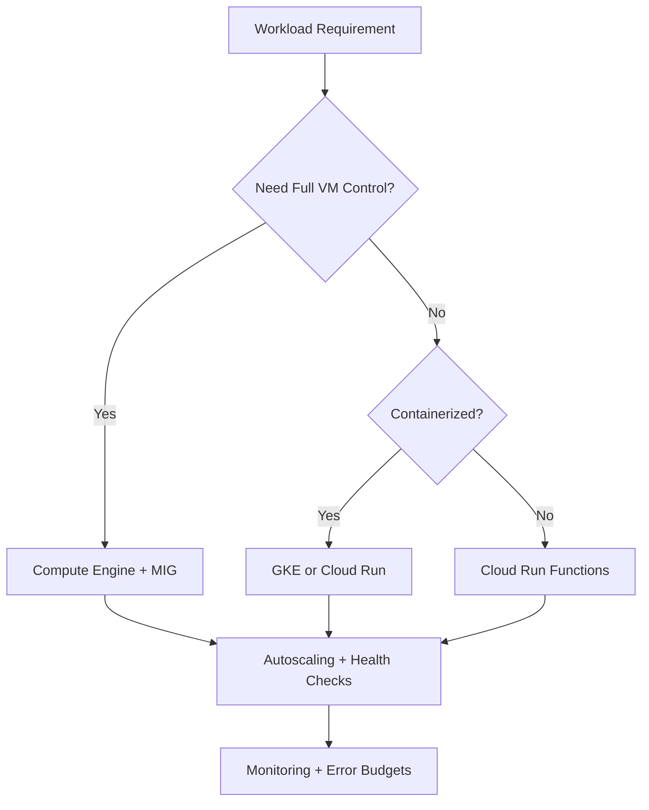
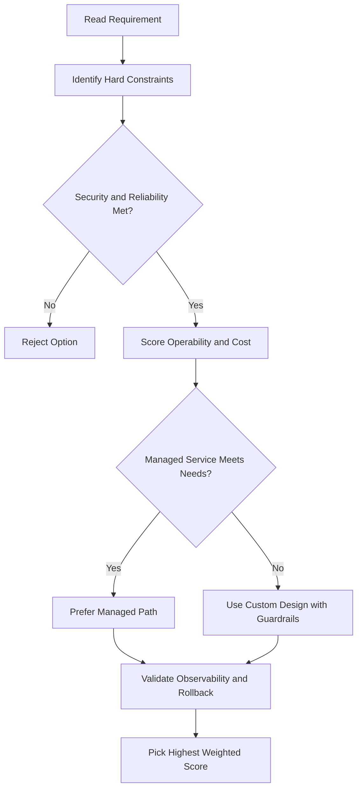
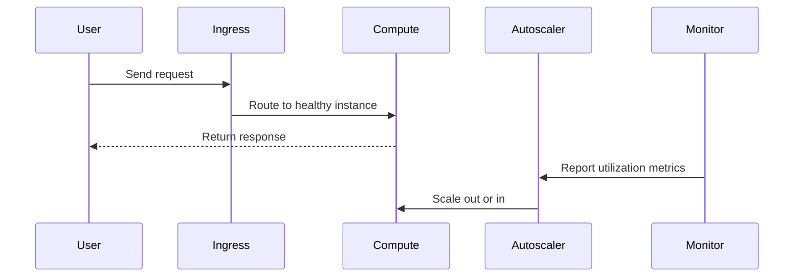

# ☸️ Kubernetes

## What is Kubernetes?

Kubernetes is an **open-source platform** for managing and scaling containerized applications.

Think of it as a supervisor for your containers — it decides where to run them, keeps them healthy, and scales them up or down as needed.

- Runs containers across many machines at once
- Handles scaling, restarts, and traffic routing automatically
- Works with microservices and large distributed apps

---

## Key Concepts

### Cluster

A **cluster** is the whole system — a group of machines (nodes) that Kubernetes manages together.

### Node

A **node** is a single machine in the cluster. It's where your containers actually run.

> Note: In Google Cloud, nodes are virtual machines running in Compute Engine — but in Kubernetes, "node" just means any computing instance.

### Pod

A **Pod** is the smallest unit you can deploy in Kubernetes. It wraps one or more containers together.

- Usually **one container per Pod**
- If two containers are tightly linked, you can put them in the same Pod — they share network and storage
- Each Pod gets its own **IP address and ports**
- A Pod represents a running process on your cluster

### Deployment

A **Deployment** is a group of identical Pods (called replicas).

- Keeps your Pods running even if a node crashes
- Can represent one part of your app or the entire app
- You tell it how many copies (replicas) to run

### Service

A **Service** gives your Pods a **stable, fixed IP address** so other parts of the app (or outside users) can reach them reliably.

- Pods can come and go, but the Service IP stays the same
- In GKE, a Service with external access gets a **network load balancer** with a public IP
- Example: your frontend always talks to the backend Service — even if backend Pods are replaced, the frontend doesn't notice

---

## Control Plane

The **control plane** is the brain of the cluster. It runs the primary Kubernetes components that manage everything — scheduling, scaling, monitoring — so you don't have to.

---

## Common Commands

| Command                        | What it does                                   |
| ------------------------------ | ---------------------------------------------- |
| `kubectl run`                  | Start a Deployment with a container in a Pod   |
| `kubectl get pods`             | List all running Pods                          |
| `kubectl get deployments`      | List all Deployments                           |
| `kubectl describe deployments` | Show details about your Deployments            |
| `kubectl scale`                | Change the number of Pod replicas              |
| `kubectl get services`         | List Services and their external IPs           |
| `kubectl apply`                | Apply a config file to create/update resources |
| `kubectl rollout`              | Roll out a new version of your app             |

---

## Imperative vs Declarative

### Imperative (command by command)

You tell Kubernetes what to do step by step — good for learning and testing.

```bash
kubectl scale deployment my-app --replicas=3
```

### Declarative (config file)

You write a file describing what you **want** the final state to look like, and Kubernetes figures out how to get there. This is the recommended approach for real apps.

```bash
kubectl apply -f deployment.yaml
```

- Update the config file → run `kubectl apply` → Kubernetes handles the rest
- Easier to version control and repeat

---

## Scaling

- Run `kubectl scale` to manually set the number of replicas
- Or set up **autoscaling** — e.g., "add more Pods when CPU goes above 80%"
- Kubernetes places Pods behind the Service automatically — traffic is load balanced across all replicas

---

## Rolling Updates (Updating Your App)

When you push a new version, you don't want all Pods to restart at once — that causes downtime.

Kubernetes handles this with a **rolling update** strategy:

1. Create one new Pod with the updated version
2. Wait until it's healthy
3. Remove one old Pod
4. Repeat until all Pods are updated

You trigger this with `kubectl rollout` or by updating your deployment config and running `kubectl apply`.

---

## GKE — Google Kubernetes Engine

Running Kubernetes yourself is complex. **GKE (Google Kubernetes Engine)** is Google's managed Kubernetes service — it sets up and maintains the cluster for you so you can focus on your app.

---

## Key Takeaway

Kubernetes lets you:

- **Run containers at scale** across many machines
- **Keep apps running** even when individual machines fail
- **Deploy updates safely** without downtime
- **Scale automatically** based on real traffic or resource usage

---

## gcloud Commands (GKE)

```bash
# Create a GKE cluster
gcloud container clusters create my-cluster \
  --zone=us-central1-a --num-nodes=3

# Get credentials (sets up kubectl access)
gcloud container clusters get-credentials my-cluster --zone=us-central1-a

# List GKE clusters
gcloud container clusters list

# Delete a cluster
gcloud container clusters delete my-cluster --zone=us-central1-a
```

---

## Additional Workload Types

Beyond Deployments, Kubernetes has specialised controllers:

| Type            | Purpose                                                                          |
| --------------- | -------------------------------------------------------------------------------- |
| **Deployment**  | Stateless apps — web servers, APIs                                               |
| **StatefulSet** | Stateful apps — databases, Kafka; stable network identity and persistent storage |
| **DaemonSet**   | Run one Pod per node — log collectors, monitoring agents                         |
| **Job**         | Run to completion — batch processing                                             |
| **CronJob**     | Run on a schedule — nightly reports, cleanup tasks                               |

---

## Namespaces

Namespaces partition a cluster into virtual sub-clusters — useful for multi-team environments.

```bash
kubectl get namespaces
kubectl create namespace my-team
kubectl get pods --namespace=my-team
```

- Default namespaces: `default`, `kube-system`, `kube-public`
- Resource quotas can be set per namespace to limit CPU/memory usage

---

## ConfigMaps and Secrets

### ConfigMap — non-sensitive configuration

```yaml
apiVersion: v1
kind: ConfigMap
metadata:
  name: app-config
data:
  DB_HOST: "db.example.com"
  DB_PORT: "5432"
```

### Secret — sensitive data (base64-encoded at rest)

```bash
kubectl create secret generic db-secret \
  --from-literal=password=mysecretpassword
```

- Secrets should be stored in a secret manager (e.g. Secret Manager) for production; K8s Secrets are only base64, not encrypted by default unless ETCD encryption is enabled

---

## Persistent Volumes (Storage)

For stateful apps that need data to survive Pod restarts:

| Object                          | Role                                                   |
| ------------------------------- | ------------------------------------------------------ |
| **PersistentVolume (PV)**       | A piece of storage provisioned in the cluster          |
| **PersistentVolumeClaim (PVC)** | A request for storage by a Pod                         |
| **StorageClass**                | Defines the type of storage (SSD, HDD) and provisioner |

```yaml
apiVersion: v1
kind: PersistentVolumeClaim
metadata:
  name: my-pvc
spec:
  accessModes: [ReadWriteOnce]
  resources:
    requests:
      storage: 10Gi
```

- In GKE, the default StorageClass provisions **Google Persistent Disks** automatically

---

## Resource Requests and Limits

```yaml
resources:
  requests:
    cpu: "250m" # 0.25 vCPU guaranteed
    memory: "128Mi"
  limits:
    cpu: "500m" # Max 0.5 vCPU
    memory: "256Mi"
```

- **Request** = minimum guaranteed; used for scheduling decisions
- **Limit** = hard cap; container is throttled (CPU) or killed (memory) if exceeded
- `m` = millicores (1000m = 1 vCPU)

---

## Horizontal Pod Autoscaler (HPA)

Automatically scales the number of Pods based on metrics:

```bash
kubectl autoscale deployment my-app \
  --cpu-percent=70 --min=2 --max=10
```

- Scales based on CPU, memory, or custom metrics
- Works alongside MIG autoscaling in GKE (node-level)

---

## Network Policies

Control which Pods can talk to which other Pods:

```yaml
apiVersion: networking.k8s.io/v1
kind: NetworkPolicy
metadata:
  name: deny-all
spec:
  podSelector: {}
  policyTypes: [Ingress, Egress]
```

- Default: all Pods can talk to all other Pods
- Network policies require a CNI plugin that supports them (e.g. Calico, used in GKE)

---

## Ingress

An **Ingress** routes external HTTP/HTTPS traffic to Services based on path or hostname — a single IP for multiple services:

```
example.com/api  → api-service
example.com/web  → web-service
```

- In GKE, an Ingress creates a **Google Cloud HTTP(S) Load Balancer** automatically
- Supports SSL termination, path-based routing, host-based routing

---

## RBAC (Role-Based Access Control)

Controls who can do what inside the cluster:

| Object                 | Scope                                                  |
| ---------------------- | ------------------------------------------------------ |
| **Role**               | Permissions within a single namespace                  |
| **ClusterRole**        | Permissions across the whole cluster                   |
| **RoleBinding**        | Grants a Role to a user/service account in a namespace |
| **ClusterRoleBinding** | Grants a ClusterRole cluster-wide                      |

```bash
# View current permissions
kubectl auth can-i list pods --namespace=default
```

---

## Labels and Selectors

Labels are key-value pairs attached to any object — used by Services and Deployments to find their Pods:

```yaml
metadata:
  labels:
    app: web
    env: production
```

```bash
# Filter resources by label
kubectl get pods -l app=web,env=production
```

---

## Key Takeaways

- **Deployment** for stateless; **StatefulSet** for stateful; **DaemonSet** for per-node agents
- **ConfigMaps** for config; **Secrets** for sensitive data
- **PVCs** request persistent storage; GKE provisions Persistent Disks automatically
- Set **resource requests/limits** to prevent noisy-neighbour issues and enable scheduling
- **HPA** scales Pods horizontally; configure alongside node autoscaling in GKE
- **Ingress** replaces multiple LoadBalancer Services with a single HTTP(S) LB
- **RBAC** restricts access inside the cluster — always follow least-privilege

## ACE Exam-Style Practice Questions

### Q1
In a Kubernetes cluster, one microservice is CPU-heavy while others are general purpose. How should you optimize?

A. Keep one node pool and only increase pod priority
B. Create dedicated compute-optimized node pool for CPU-heavy workload and keep general-purpose pool for others
C. Disable autoscaling
D. Move workload to Cloud Storage

Answer: B
Trap: Node pools allow workload-specific machine-family optimization.

### Q2
A Kubernetes deployment must be updated with minimal downtime. Which command pattern is best?

A. Delete and recreate service and deployment
B. kubectl set image deployment/NAME CONTAINER=NEW_IMAGE
C. Restart all cluster nodes
D. Create a new project for each version

Answer: B
Trap: Rolling image update is safer and faster than destructive redeploy patterns.

<!-- ACE_DEEP_ENRICHMENT_START -->
## ACE Deep Enrichment

### Think Like a Google Engineer
- Primary optimization axis: Elastic performance with minimum operational toil.
- Start with constraints first: SLO, security, compliance, latency, budget, and team operations capacity.
- Prefer managed services if they satisfy requirements with lower long-term operational toil.
- Minimize blast radius using environment isolation, least privilege, and failure-domain awareness.
- Design for day-2 operations: observability, rollback strategy, and quota or budget guardrails.

### Most Correct Option Filter (60 Seconds)
1. Eliminate options with broad access, single points of failure, or missing monitoring.
2. Confirm the option meets non-negotiables first: security and reliability requirements.
3. Compare remaining options on operational simplicity and long-term maintainability.
4. Use cost as an optimizer only after requirements and risk controls are satisfied.

### Weighted Decision Matrix
| Dimension | Weight | Strong Signal |
| --- | --- | --- |
| Security | 3 | Least privilege, secure defaults, no exposed blast radius |
| Reliability | 3 | Multi-zone or HA design, health checks, tested recovery path |
| Operability | 2 | Clear monitoring, alerting, rollout and rollback simplicity |
| Cost Efficiency | 2 | Right-sized resources, no waste, no reliability regression |
| Performance | 1 | Meets latency and throughput targets with headroom |

### Real-Life Scenario
A media startup has unpredictable traffic spikes during launches. They need faster releases, automatic scaling, and strong reliability without overpaying for idle capacity.

### Worked Example
- Choose managed compute first when operations overhead is a concern.
- For VM workloads, use managed instance groups with autoscaling and autohealing.
- For container workloads, use GKE node pools and rolling updates.
- For event-driven workloads, prefer Cloud Run or functions with concurrency controls.

### Flowchart


### Optimization Decision Flow


### Interaction Sequence


### Extra Exam Practice (10 Questions)
#### Q1
Scenario Focus: ☸️ Kubernetes
Traffic triples during business hours and falls overnight. Which compute pattern is best?

A. Use autoscaling with target utilization and baseline minimum capacity.
B. Pin capacity to peak traffic all day for safety.
C. Restart failed instances manually as incidents occur.
D. Use one large VM because horizontal scaling is complex.

Answer: A
Why the other options are weaker: They typically ignore at least one hard constraint such as security, reliability, cost efficiency, or operational simplicity.
Google-engineer check: Reconfirm SLO fit, blast radius, and day-2 maintainability before finalizing.

#### Q2
Scenario Focus: ☸️ Kubernetes
A VM app must self-heal when instances fail health checks. What should you use?

A. Restart failed instances manually as incidents occur.
B. Use a managed instance group with health checks and autohealing enabled.
C. Use one large VM because horizontal scaling is complex.
D. Deploy all changes at once without canary checks.

Answer: B
Why the other options are weaker: They typically ignore at least one hard constraint such as security, reliability, cost efficiency, or operational simplicity.
Google-engineer check: Reconfirm SLO fit, blast radius, and day-2 maintainability before finalizing.

#### Q3
Scenario Focus: ☸️ Kubernetes
A team wants to deploy containers without managing nodes. Which platform fits best?

A. Use one large VM because horizontal scaling is complex.
B. Deploy all changes at once without canary checks.
C. Use Cloud Run for containerized services when node management is not required.
D. Ignore utilization metrics and optimize only by guesswork.

Answer: C
Why the other options are weaker: They typically ignore at least one hard constraint such as security, reliability, cost efficiency, or operational simplicity.
Google-engineer check: Reconfirm SLO fit, blast radius, and day-2 maintainability before finalizing.

#### Q4
Scenario Focus: ☸️ Kubernetes
Which update strategy minimizes user impact during releases?

A. Deploy all changes at once without canary checks.
B. Ignore utilization metrics and optimize only by guesswork.
C. Pin capacity to peak traffic all day for safety.
D. Use rolling or blue-green deployment with health-based rollout checks.

Answer: D
Why the other options are weaker: They typically ignore at least one hard constraint such as security, reliability, cost efficiency, or operational simplicity.
Google-engineer check: Reconfirm SLO fit, blast radius, and day-2 maintainability before finalizing.

#### Q5
Scenario Focus: ☸️ Kubernetes
How do you avoid overprovisioning while keeping performance stable?

A. Right-size resources and monitor saturation, latency, and error rates continuously.
B. Ignore utilization metrics and optimize only by guesswork.
C. Pin capacity to peak traffic all day for safety.
D. Restart failed instances manually as incidents occur.

Answer: A
Why the other options are weaker: They typically ignore at least one hard constraint such as security, reliability, cost efficiency, or operational simplicity.
Google-engineer check: Reconfirm SLO fit, blast radius, and day-2 maintainability before finalizing.

#### Q6
Scenario Focus: ☸️ Kubernetes
Two designs both satisfy the happy path for ☸️ Kubernetes. Which choice is most correct?

A. Pin capacity to peak traffic all day for safety.
B. Choose the option that preserves reliability and security while reducing operational burden.
C. Restart failed instances manually as incidents occur.
D. Use one large VM because horizontal scaling is complex.

Answer: B
Why the other options are weaker: They typically ignore at least one hard constraint such as security, reliability, cost efficiency, or operational simplicity.
Google-engineer check: Reconfirm SLO fit, blast radius, and day-2 maintainability before finalizing.

#### Q7
Scenario Focus: ☸️ Kubernetes
What should you validate first before choosing an architecture for ☸️ Kubernetes?

A. Restart failed instances manually as incidents occur.
B. Use one large VM because horizontal scaling is complex.
C. Validate SLO fit, blast radius, and least-privilege controls before comparing convenience.
D. Deploy all changes at once without canary checks.

Answer: C
Why the other options are weaker: They typically ignore at least one hard constraint such as security, reliability, cost efficiency, or operational simplicity.
Google-engineer check: Reconfirm SLO fit, blast radius, and day-2 maintainability before finalizing.

#### Q8
Scenario Focus: ☸️ Kubernetes
A proposal lowers cost but increases failure risk. What is the best decision?

A. Use one large VM because horizontal scaling is complex.
B. Deploy all changes at once without canary checks.
C. Ignore utilization metrics and optimize only by guesswork.
D. Reject it unless reliability and recovery objectives remain within required targets.

Answer: D
Why the other options are weaker: They typically ignore at least one hard constraint such as security, reliability, cost efficiency, or operational simplicity.
Google-engineer check: Reconfirm SLO fit, blast radius, and day-2 maintainability before finalizing.

#### Q9
Scenario Focus: ☸️ Kubernetes
Which option best reflects optimization for Elastic performance with minimum operational toil?

A. Select the design that best meets Elastic performance with minimum operational toil while keeping constraints balanced.
B. Deploy all changes at once without canary checks.
C. Ignore utilization metrics and optimize only by guesswork.
D. Pin capacity to peak traffic all day for safety.

Answer: A
Why the other options are weaker: They typically ignore at least one hard constraint such as security, reliability, cost efficiency, or operational simplicity.
Google-engineer check: Reconfirm SLO fit, blast radius, and day-2 maintainability before finalizing.

#### Q10
Scenario Focus: ☸️ Kubernetes
How should you evaluate a design that needs frequent manual interventions?

A. Ignore utilization metrics and optimize only by guesswork.
B. Treat it as high risk and prefer automation-friendly designs with observability and rollback.
C. Pin capacity to peak traffic all day for safety.
D. Restart failed instances manually as incidents occur.

Answer: B
Why the other options are weaker: They typically ignore at least one hard constraint such as security, reliability, cost efficiency, or operational simplicity.
Google-engineer check: Reconfirm SLO fit, blast radius, and day-2 maintainability before finalizing.

### Quick Commands
```bash
gcloud compute instance-groups managed list --project=PROJECT_ID
gcloud compute instance-groups managed describe MIG_NAME --zone=ZONE --project=PROJECT_ID
gcloud run services list --region=REGION --project=PROJECT_ID
kubectl get pods -A
```

### Fast Recall
- Autoscaling is useful only with valid signals and guardrails.
- Managed offerings usually reduce operational burden.
- Deployment safety needs health checks and staged rollout.
<!-- ACE_DEEP_ENRICHMENT_END -->