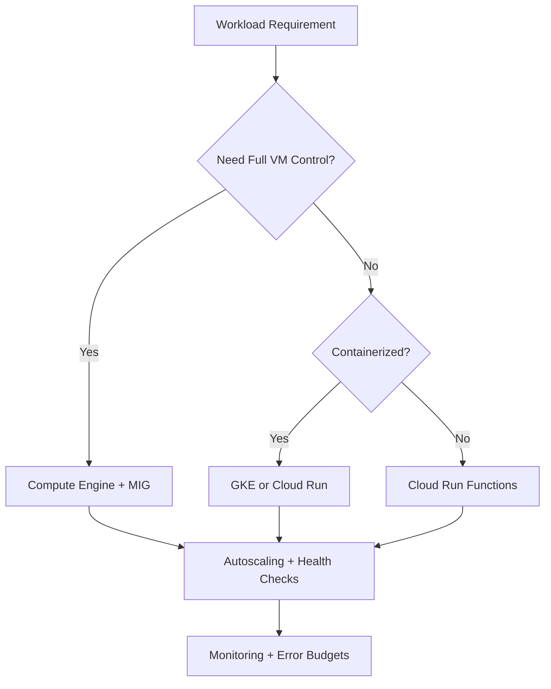
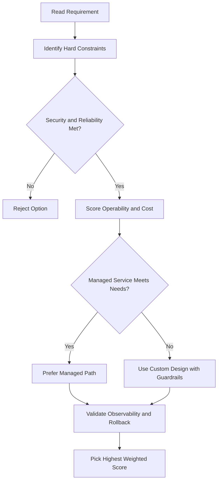
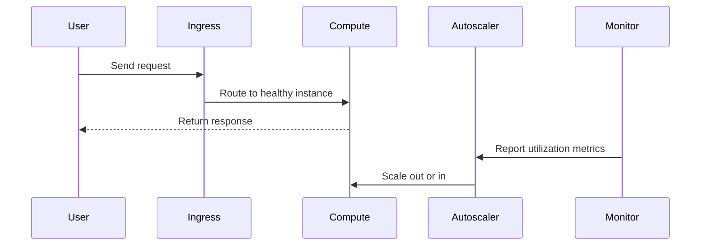

# ☁️ Google Kubernetes Engine (GKE)

## What is GKE?

**GKE (Google Kubernetes Engine)** is Google's fully managed Kubernetes service. Instead of setting up and running Kubernetes yourself, Google does most of the heavy lifting for you.

- Runs on **Compute Engine** virtual machines grouped into a cluster
- You still use standard Kubernetes commands and APIs
- Google manages the infrastructure behind the scenes

---

## GKE vs Kubernetes (Self-managed)

|                     | Self-managed Kubernetes | GKE                   |
| ------------------- | ----------------------- | --------------------- |
| Control plane setup | You do it               | Google handles it     |
| Node management     | You do it               | Depends on mode       |
| Upgrades & patching | Manual                  | Automatic (Autopilot) |
| Complexity          | High                    | Much simpler          |

With GKE, you still get a single IP address to send all your Kubernetes API requests to — but Google manages everything behind that address for you.

---

## Two Modes: Autopilot vs Standard

### Autopilot Mode (Recommended)

Google manages almost everything for you:

- Node configuration
- Autoscaling
- Auto-upgrades
- Security settings
- Networking config

Best for: **most production workloads** where you want simplicity and reliability.

### Standard Mode

You manage the underlying infrastructure:

- Configure individual nodes yourself
- More control, but more work

Best for: teams that need **very specific configuration control** that Autopilot doesn't allow.

> Unless you have a specific reason to use Standard, stick with **Autopilot**.

---

## What GKE Manages For You

- **Load balancing** — automatically routes traffic across your Compute Engine instances
- **Node pools** — lets you group nodes with different specs within the same cluster
- **Auto-scaling** — adds or removes nodes based on demand
- **Auto-upgrades** — keeps your node software up to date
- **Node auto-repair** — detects and fixes unhealthy nodes automatically
- **Logging & monitoring** — built-in visibility via Google Cloud Observability

---

## How to Create a GKE Cluster

### Option 1 — Google Cloud Console

Use the web UI to point and click your way to a cluster.

### Option 2 — gcloud command

```bash
gcloud container clusters create k1
```

That single command spins up a full Kubernetes cluster on GKE named `k1`.

---

## Customizing Your Cluster

GKE clusters are flexible — you can configure:

- **Machine types** (how powerful each node is)
- **Number of nodes**
- **Network settings**

Once the cluster is running, you use standard Kubernetes commands (`kubectl`) to deploy apps, manage workloads, set policies, and check health.

---

## Key Takeaway

GKE lets you use Kubernetes without the pain of managing it yourself:

- **Autopilot mode** = Google manages everything
- **Standard mode** = you manage the nodes
- Built-in scaling, upgrades, load balancing, and monitoring
- Get a cluster running with a single `gcloud` command

---

## GKE Networking

- **VPC-native clusters** (recommended) — Pods get IPs from a subnet secondary range; enables VPC firewall rules and VPC peering for Pods
- **Network policies** — control Pod-to-Pod traffic (requires enabling at cluster creation)
- **GKE Ingress** — automatically creates a Google Cloud HTTP(S) Load Balancer for external traffic
- **Internal Ingress** — creates an Internal Load Balancer for traffic inside your VPC

```bash
# Create cluster with network policy support
gcloud container clusters create my-cluster \
  --zone=us-central1-a \
  --enable-network-policy
```

---

## Workload Identity

The recommended way to let GKE workloads access Google Cloud APIs **without service account key files**:

- Maps a Kubernetes ServiceAccount → GCP Service Account
- Pods automatically receive short-lived credentials
- No key file to rotate, store, or leak

```bash
# Enable Workload Identity on a cluster
gcloud container clusters update my-cluster \
  --zone=us-central1-a \
  --workload-pool=PROJECT_ID.svc.id.goog

# Bind K8s SA to GCP SA
gcloud iam service-accounts add-iam-policy-binding gcp-sa@PROJECT_ID.iam.gserviceaccount.com \
  --role=roles/iam.workloadIdentityUser \
  --member="serviceAccount:PROJECT_ID.svc.id.goog[NAMESPACE/KSA_NAME]"
```

---

## Node Pools

A **node pool** is a group of nodes within a cluster that all have the same configuration:

- Different pools can have different machine types, disk sizes, labels, taints
- Useful for separating GPU nodes from CPU nodes, or spot from regular nodes

```bash
# Add a node pool
gcloud container node-pools create gpu-pool \
  --cluster=my-cluster --zone=us-central1-a \
  --machine-type=n1-standard-4 --accelerator=type=nvidia-tesla-t4,count=1
```

---

## Cluster Upgrades

| Setting                 | Detail                                                            |
| ----------------------- | ----------------------------------------------------------------- |
| **Auto-upgrade**        | Enabled by default; keeps nodes on a supported version            |
| **Release channels**    | `rapid`, `regular` (default), `stable` — controls upgrade cadence |
| **Surge upgrades**      | Controls how many extra nodes are created during rolling upgrade  |
| **Maintenance windows** | Restrict upgrade times to off-peak hours                          |

```bash
# Set release channel
gcloud container clusters update my-cluster \
  --zone=us-central1-a \
  --release-channel=regular
```

---

## Cluster Autoscaler

Automatically adds/removes **nodes** (not Pods) based on pending Pod resource requests:

```bash
gcloud container clusters update my-cluster \
  --zone=us-central1-a \
  --enable-autoscaling \
  --min-nodes=1 --max-nodes=10 \
  --node-pool=default-pool
```

- Works alongside HPA (which scales Pods) — cluster autoscaler adds nodes when Pods can't be scheduled

---

## Binary Authorization

Enforces that only **trusted container images** are deployed to GKE:

- Requires images to have an attestation (cryptographic signature) from a trusted authority
- Blocks unverified images at deploy time
- Integrates with Cloud Build and Artifact Registry

---

## Key Takeaways — GKE

| Topic                  | Key Point                                                         |
| ---------------------- | ----------------------------------------------------------------- |
| **Autopilot**          | Google manages nodes, scaling, security — best for most workloads |
| **Workload Identity**  | Always use instead of service account key files                   |
| **VPC-native**         | Use alias IP clusters for full VPC integration                    |
| **Node pools**         | Separate workloads by hardware requirements                       |
| **Release channels**   | Use `regular` for production stability                            |
| **Cluster autoscaler** | Scales nodes; HPA scales Pods — use both together                 |

## ACE Exam-Style Practice Questions

### Q1
In a Gke cluster, one microservice is CPU-heavy while others are general purpose. How should you optimize?

A. Keep one node pool and only increase pod priority
B. Create dedicated compute-optimized node pool for CPU-heavy workload and keep general-purpose pool for others
C. Disable autoscaling
D. Move workload to Cloud Storage

Answer: B
Trap: Node pools allow workload-specific machine-family optimization.

### Q2
A Gke deployment must be updated with minimal downtime. Which command pattern is best?

A. Delete and recreate service and deployment
B. kubectl set image deployment/NAME CONTAINER=NEW_IMAGE
C. Restart all cluster nodes
D. Create a new project for each version

Answer: B
Trap: Rolling image update is safer and faster than destructive redeploy patterns.

<!-- ACE_DEEP_ENRICHMENT_START -->
## ACE Deep Enrichment

### Think Like a Google Engineer
- Primary optimization axis: Elastic performance with minimum operational toil.
- Start with constraints first: SLO, security, compliance, latency, budget, and team operations capacity.
- Prefer managed services if they satisfy requirements with lower long-term operational toil.
- Minimize blast radius using environment isolation, least privilege, and failure-domain awareness.
- Design for day-2 operations: observability, rollback strategy, and quota or budget guardrails.

### Most Correct Option Filter (60 Seconds)
1. Eliminate options with broad access, single points of failure, or missing monitoring.
2. Confirm the option meets non-negotiables first: security and reliability requirements.
3. Compare remaining options on operational simplicity and long-term maintainability.
4. Use cost as an optimizer only after requirements and risk controls are satisfied.

### Weighted Decision Matrix
| Dimension | Weight | Strong Signal |
| --- | --- | --- |
| Security | 3 | Least privilege, secure defaults, no exposed blast radius |
| Reliability | 3 | Multi-zone or HA design, health checks, tested recovery path |
| Operability | 2 | Clear monitoring, alerting, rollout and rollback simplicity |
| Cost Efficiency | 2 | Right-sized resources, no waste, no reliability regression |
| Performance | 1 | Meets latency and throughput targets with headroom |

### Real-Life Scenario
A media startup has unpredictable traffic spikes during launches. They need faster releases, automatic scaling, and strong reliability without overpaying for idle capacity.

### Worked Example
- Choose managed compute first when operations overhead is a concern.
- For VM workloads, use managed instance groups with autoscaling and autohealing.
- For container workloads, use GKE node pools and rolling updates.
- For event-driven workloads, prefer Cloud Run or functions with concurrency controls.

### Flowchart


### Optimization Decision Flow


### Interaction Sequence


### Extra Exam Practice (15 Questions)
#### Q1
Scenario Focus: ☁️ Google Kubernetes Engine (GKE)
Traffic triples during business hours and falls overnight. Which compute pattern is best?

A. Use autoscaling with target utilization and baseline minimum capacity.
B. Pin capacity to peak traffic all day for safety.
C. Restart failed instances manually as incidents occur.
D. Use one large VM because horizontal scaling is complex.

Answer: A
Why the other options are weaker: They typically ignore at least one hard constraint such as security, reliability, cost efficiency, or operational simplicity.
Google-engineer check: Reconfirm SLO fit, blast radius, and day-2 maintainability before finalizing.

#### Q2
Scenario Focus: ☁️ Google Kubernetes Engine (GKE)
A VM app must self-heal when instances fail health checks. What should you use?

A. Restart failed instances manually as incidents occur.
B. Use a managed instance group with health checks and autohealing enabled.
C. Use one large VM because horizontal scaling is complex.
D. Deploy all changes at once without canary checks.

Answer: B
Why the other options are weaker: They typically ignore at least one hard constraint such as security, reliability, cost efficiency, or operational simplicity.
Google-engineer check: Reconfirm SLO fit, blast radius, and day-2 maintainability before finalizing.

#### Q3
Scenario Focus: ☁️ Google Kubernetes Engine (GKE)
A team wants to deploy containers without managing nodes. Which platform fits best?

A. Use one large VM because horizontal scaling is complex.
B. Deploy all changes at once without canary checks.
C. Use Cloud Run for containerized services when node management is not required.
D. Ignore utilization metrics and optimize only by guesswork.

Answer: C
Why the other options are weaker: They typically ignore at least one hard constraint such as security, reliability, cost efficiency, or operational simplicity.
Google-engineer check: Reconfirm SLO fit, blast radius, and day-2 maintainability before finalizing.

#### Q4
Scenario Focus: ☁️ Google Kubernetes Engine (GKE)
Which update strategy minimizes user impact during releases?

A. Deploy all changes at once without canary checks.
B. Ignore utilization metrics and optimize only by guesswork.
C. Pin capacity to peak traffic all day for safety.
D. Use rolling or blue-green deployment with health-based rollout checks.

Answer: D
Why the other options are weaker: They typically ignore at least one hard constraint such as security, reliability, cost efficiency, or operational simplicity.
Google-engineer check: Reconfirm SLO fit, blast radius, and day-2 maintainability before finalizing.

#### Q5
Scenario Focus: ☁️ Google Kubernetes Engine (GKE)
How do you avoid overprovisioning while keeping performance stable?

A. Right-size resources and monitor saturation, latency, and error rates continuously.
B. Ignore utilization metrics and optimize only by guesswork.
C. Pin capacity to peak traffic all day for safety.
D. Restart failed instances manually as incidents occur.

Answer: A
Why the other options are weaker: They typically ignore at least one hard constraint such as security, reliability, cost efficiency, or operational simplicity.
Google-engineer check: Reconfirm SLO fit, blast radius, and day-2 maintainability before finalizing.

#### Q6
Scenario Focus: ☁️ Google Kubernetes Engine (GKE)
Two designs both satisfy the happy path for ☁️ Google Kubernetes Engine (GKE). Which choice is most correct?

A. Pin capacity to peak traffic all day for safety.
B. Choose the option that preserves reliability and security while reducing operational burden.
C. Restart failed instances manually as incidents occur.
D. Use one large VM because horizontal scaling is complex.

Answer: B
Why the other options are weaker: They typically ignore at least one hard constraint such as security, reliability, cost efficiency, or operational simplicity.
Google-engineer check: Reconfirm SLO fit, blast radius, and day-2 maintainability before finalizing.

#### Q7
Scenario Focus: ☁️ Google Kubernetes Engine (GKE)
What should you validate first before choosing an architecture for ☁️ Google Kubernetes Engine (GKE)?

A. Restart failed instances manually as incidents occur.
B. Use one large VM because horizontal scaling is complex.
C. Validate SLO fit, blast radius, and least-privilege controls before comparing convenience.
D. Deploy all changes at once without canary checks.

Answer: C
Why the other options are weaker: They typically ignore at least one hard constraint such as security, reliability, cost efficiency, or operational simplicity.
Google-engineer check: Reconfirm SLO fit, blast radius, and day-2 maintainability before finalizing.

#### Q8
Scenario Focus: ☁️ Google Kubernetes Engine (GKE)
A proposal lowers cost but increases failure risk. What is the best decision?

A. Use one large VM because horizontal scaling is complex.
B. Deploy all changes at once without canary checks.
C. Ignore utilization metrics and optimize only by guesswork.
D. Reject it unless reliability and recovery objectives remain within required targets.

Answer: D
Why the other options are weaker: They typically ignore at least one hard constraint such as security, reliability, cost efficiency, or operational simplicity.
Google-engineer check: Reconfirm SLO fit, blast radius, and day-2 maintainability before finalizing.

#### Q9
Scenario Focus: ☁️ Google Kubernetes Engine (GKE)
Which option best reflects optimization for Elastic performance with minimum operational toil?

A. Select the design that best meets Elastic performance with minimum operational toil while keeping constraints balanced.
B. Deploy all changes at once without canary checks.
C. Ignore utilization metrics and optimize only by guesswork.
D. Pin capacity to peak traffic all day for safety.

Answer: A
Why the other options are weaker: They typically ignore at least one hard constraint such as security, reliability, cost efficiency, or operational simplicity.
Google-engineer check: Reconfirm SLO fit, blast radius, and day-2 maintainability before finalizing.

#### Q10
Scenario Focus: ☁️ Google Kubernetes Engine (GKE)
How should you evaluate a design that needs frequent manual interventions?

A. Ignore utilization metrics and optimize only by guesswork.
B. Treat it as high risk and prefer automation-friendly designs with observability and rollback.
C. Pin capacity to peak traffic all day for safety.
D. Restart failed instances manually as incidents occur.

Answer: B
Why the other options are weaker: They typically ignore at least one hard constraint such as security, reliability, cost efficiency, or operational simplicity.
Google-engineer check: Reconfirm SLO fit, blast radius, and day-2 maintainability before finalizing.

#### Q11
Scenario Focus: ☁️ Google Kubernetes Engine (GKE)
Two options have similar latency. Which tie-breaker is best?

A. Pin capacity to peak traffic all day for safety.
B. Restart failed instances manually as incidents occur.
C. Pick the option with stronger operability, clearer failure isolation, and simpler incident response.
D. Use one large VM because horizontal scaling is complex.

Answer: C
Why the other options are weaker: They typically ignore at least one hard constraint such as security, reliability, cost efficiency, or operational simplicity.
Google-engineer check: Reconfirm SLO fit, blast radius, and day-2 maintainability before finalizing.

#### Q12
Scenario Focus: ☁️ Google Kubernetes Engine (GKE)
What is the best way to choose between a custom stack and a managed service?

A. Restart failed instances manually as incidents occur.
B. Use one large VM because horizontal scaling is complex.
C. Deploy all changes at once without canary checks.
D. Prefer managed services when they meet requirements with lower long-term maintenance effort.

Answer: D
Why the other options are weaker: They typically ignore at least one hard constraint such as security, reliability, cost efficiency, or operational simplicity.
Google-engineer check: Reconfirm SLO fit, blast radius, and day-2 maintainability before finalizing.

#### Q13
Scenario Focus: ☁️ Google Kubernetes Engine (GKE)
How do you confirm a solution is production-ready for 

A. Verify monitoring, alerting, rollback path, quota and budget controls, and secure defaults.
B. Use one large VM because horizontal scaling is complex.
C. Deploy all changes at once without canary checks.
D. Ignore utilization metrics and optimize only by guesswork.

Answer: A
Why the other options are weaker: They typically ignore at least one hard constraint such as security, reliability, cost efficiency, or operational simplicity.
Google-engineer check: Reconfirm SLO fit, blast radius, and day-2 maintainability before finalizing.

#### Q14
Scenario Focus: ☁️ Google Kubernetes Engine (GKE)
Which pattern usually wins in ACE scenario tie-breakers?

A. Deploy all changes at once without canary checks.
B. Managed-service-first plus least-privilege access plus clear observability usually wins.
C. Ignore utilization metrics and optimize only by guesswork.
D. Pin capacity to peak traffic all day for safety.

Answer: B
Why the other options are weaker: They typically ignore at least one hard constraint such as security, reliability, cost efficiency, or operational simplicity.
Google-engineer check: Reconfirm SLO fit, blast radius, and day-2 maintainability before finalizing.

#### Q15
Scenario Focus: ☁️ Google Kubernetes Engine (GKE)
What is the best final check before locking the answer?

A. Ignore utilization metrics and optimize only by guesswork.
B. Pin capacity to peak traffic all day for safety.
C. Run a weighted check across security, reliability, cost, performance, and operability.
D. Restart failed instances manually as incidents occur.

Answer: C
Why the other options are weaker: They typically ignore at least one hard constraint such as security, reliability, cost efficiency, or operational simplicity.
Google-engineer check: Reconfirm SLO fit, blast radius, and day-2 maintainability before finalizing.

### Quick Commands
```bash
gcloud compute instance-groups managed list --project=PROJECT_ID
gcloud compute instance-groups managed describe MIG_NAME --zone=ZONE --project=PROJECT_ID
gcloud run services list --region=REGION --project=PROJECT_ID
kubectl get pods -A
```

### Fast Recall
- Autoscaling is useful only with valid signals and guardrails.
- Managed offerings usually reduce operational burden.
- Deployment safety needs health checks and staged rollout.
<!-- ACE_DEEP_ENRICHMENT_END -->