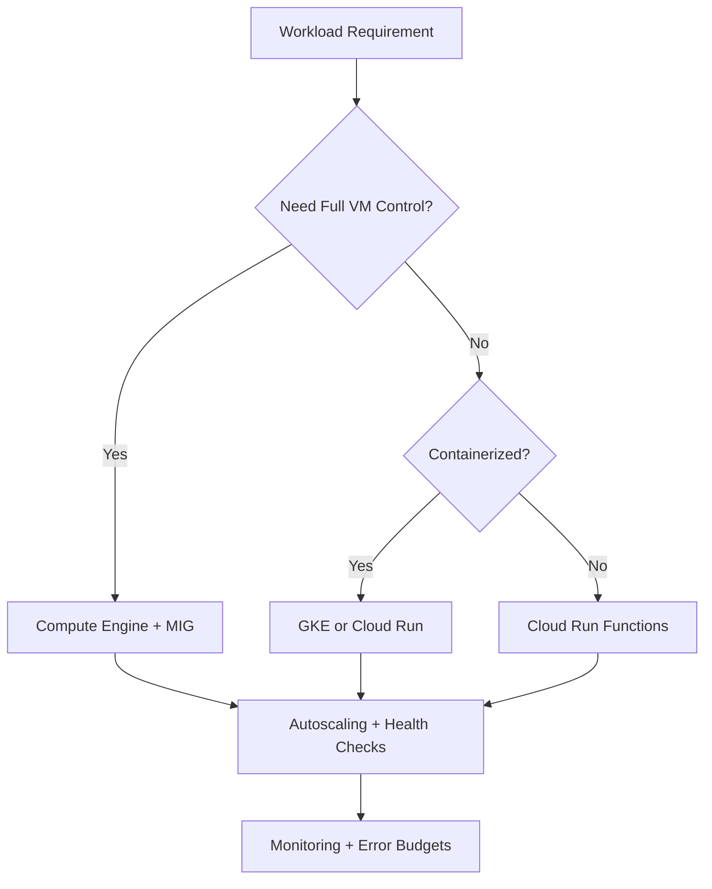
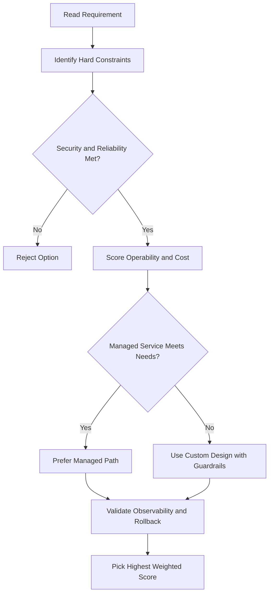
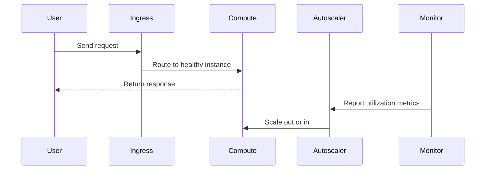

# 🚀 Cloud Run

## What is Cloud Run?

**Cloud Run** is a fully managed compute platform that runs your containerized apps — no servers to set up or maintain.

- Runs **stateless containers** triggered by web requests or Pub/Sub events
- Built on **Knative** (an open-source runtime built on top of Kubernetes)
- Can run on Google Cloud (fully managed), on GKE, or anywhere Knative runs
- **Serverless** — you focus on your app, Google handles the infrastructure

---

## Why Cloud Run?

- **No infrastructure to manage** — no VMs, no clusters, no patching
- **Scales from zero instantly** — if no requests come in, no containers run (and you pay nothing)
- **Pay only for what you use** — billed per 100 milliseconds of actual request handling
- **Any language** — runs any binary compiled for Linux 64-bit

---

## How It Works (3-Step Workflow)

1. **Write your app** — in any language, just make sure it starts a server that listens for HTTP requests
2. **Build a container image** — package your app into a container
3. **Deploy to Cloud Run** — push your image to Artifact Registry, and Cloud Run deploys it

After deployment, you get back a unique **HTTPS URL**. Cloud Run handles incoming traffic by spinning containers up and down automatically.

---

## Two Ways to Deploy

### Container-based workflow

You build and manage the container image yourself — more control and transparency.

### Source-based workflow

You push your **source code directly** — Cloud Run builds it into a container for you using **Buildpacks** (an open-source project). Good when you just want an HTTPS endpoint without worrying about containers.

---

## HTTPS Out of the Box

Cloud Run handles **HTTPS and encryption automatically**. You only need to handle the web request logic in your code — Cloud Run takes care of the rest.

---

## Pricing

- You pay **only when your container is handling requests**
- Billing granularity: **per 100 milliseconds**
- If no requests come in → **you pay nothing**
- Small fee per **1 million requests** served
- More vCPU and memory = higher cost per container

No over-provisioning, no idle costs.

---

## Supported Languages

Cloud Run can run **any binary compiled for Linux 64-bit**, which means:

**Popular languages:**

- Java, Python, Node.js, PHP, Go, C++

**Less common languages (also work fine):**

- Cobol, Haskell, Perl

As long as your app can handle web requests, Cloud Run can run it.

---

## Key Takeaway

Cloud Run is ideal when you want to:

- **Deploy containers without managing servers**
- **Scale automatically** — including down to zero
- **Pay only for actual usage**
- **Go from code to a live HTTPS endpoint** as quickly as possible

---

## gcloud Commands

```bash
# Deploy a container to Cloud Run
gcloud run deploy my-service \
  --image=gcr.io/PROJECT_ID/my-image --platform=managed --region=us-central1

# Deploy directly from source code
gcloud run deploy my-service --source . --region=us-central1

# List Cloud Run services
gcloud run services list --region=us-central1

# Delete a service
gcloud run services delete my-service --region=us-central1
```

---

## Configuration Options

```bash
gcloud run deploy my-service \
  --image=gcr.io/PROJECT_ID/my-image \
  --region=us-central1 \
  --memory=512Mi \
  --cpu=1 \
  --concurrency=80 \
  --timeout=300 \
  --max-instances=10 \
  --min-instances=0 \
  --service-account=my-sa@PROJECT_ID.iam.gserviceaccount.com
```

| Setting           | Default | Notes                                            |
| ----------------- | ------- | ------------------------------------------------ |
| `--memory`        | 512Mi   | Up to 32Gi                                       |
| `--cpu`           | 1       | Up to 8 vCPUs; can set fractional (0.08–8)       |
| `--concurrency`   | 80      | Max simultaneous requests per container instance |
| `--timeout`       | 300s    | Max 3600s (1 hour)                               |
| `--min-instances` | 0       | Set >0 to avoid cold starts                      |
| `--max-instances` | 1000    | Caps autoscaling                                 |

---

## Cold Starts

When `min-instances=0` and no container is running, the first request must wait for a new container to start — called a **cold start**:

- Cold starts typically add 1–5 seconds of latency
- Mitigation: set `--min-instances=1` (keeps one warm instance; adds cost)
- Keep container image small and startup logic minimal

---

## Authentication — Public vs Private

```bash
# Allow unauthenticated (public) access
gcloud run services add-iam-policy-binding my-service \
  --region=us-central1 \
  --member=allUsers \
  --role=roles/run.invoker

# Allow only a specific service account
gcloud run services add-iam-policy-binding my-service \
  --region=us-central1 \
  --member=serviceAccount:my-sa@PROJECT_ID.iam.gserviceaccount.com \
  --role=roles/run.invoker
```

- Default: **authentication required** (only authorised identities can invoke)
- Public APIs/websites: add `allUsers` as invoker

---

## Traffic Splitting and Canary Deployments

Split traffic between multiple revisions for gradual rollouts:

```bash
# Send 90% to latest, 10% to previous revision
gcloud run services update-traffic my-service \
  --region=us-central1 \
  --to-revisions=REVISION_NEW=90,REVISION_OLD=10

# Roll back to a previous revision
gcloud run services update-traffic my-service \
  --region=us-central1 \
  --to-revisions=REVISION_OLD=100
```

---

## Secrets and Environment Variables

```bash
# Set an environment variable
gcloud run services update my-service \
  --region=us-central1 \
  --set-env-vars=ENV=production,DB_HOST=db.example.com

# Mount a Secret Manager secret as an env variable
gcloud run services update my-service \
  --region=us-central1 \
  --set-secrets=DB_PASSWORD=my-secret:latest
```

- Always use **Secret Manager** for credentials — never hardcode in container images

---

## Eventarc Integration

Cloud Run can be triggered by events beyond HTTP:

| Trigger             | Example                                                    |
| ------------------- | ---------------------------------------------------------- |
| **HTTP**            | Direct web requests                                        |
| **Pub/Sub**         | Message queue events                                       |
| **Eventarc**        | Cloud Storage uploads, Audit Log events, Firestore changes |
| **Cloud Scheduler** | Cron-style scheduled jobs                                  |

```bash
# Trigger Cloud Run from a Pub/Sub topic
gcloud eventarc triggers create my-trigger \
  --location=us-central1 \
  --destination-run-service=my-service \
  --destination-run-region=us-central1 \
  --event-filters=type=google.cloud.pubsub.topic.v1.messagePublished \
  --transport-topic=my-topic
```

---

## Key Takeaways — Cloud Run

- Set **`min-instances=1`** only if cold start latency is unacceptable (adds cost)
- Use **Secret Manager** (`--set-secrets`) not environment variables for credentials
- Default authentication is **private** — explicitly add `allUsers` for public services
- Use **traffic splitting** for canary releases and safe rollbacks
- Cloud Run scales to **zero** — ideal for event-driven, bursty, or infrequent workloads

## ACE Exam-Style Practice Questions

### Q1
A Cloud Run service is event-driven and should scale automatically with minimal infrastructure management. Which option is usually best?

A. Cloud Run or Cloud Run Functions depending on trigger pattern
B. Unmanaged VMs only
C. Self-managed Kubernetes on Compute Engine
D. Dedicated interconnect

Answer: A
Trap: Event-driven and minimal-ops requirements typically map to serverless services.

### Q2
In a Cloud Run release, you need safe rollout and quick rollback using real traffic testing. What should you do?

A. Overwrite current version in place
B. Deploy new version and use traffic splitting or gradual migration
C. Delete old version before testing
D. Disable logging during rollout

Answer: B
Trap: Versioned deployments plus traffic control provide safer rollback paths.

<!-- ACE_DEEP_ENRICHMENT_START -->
## ACE Deep Enrichment

### Think Like a Google Engineer
- Primary optimization axis: Elastic performance with minimum operational toil.
- Start with constraints first: SLO, security, compliance, latency, budget, and team operations capacity.
- Prefer managed services if they satisfy requirements with lower long-term operational toil.
- Minimize blast radius using environment isolation, least privilege, and failure-domain awareness.
- Design for day-2 operations: observability, rollback strategy, and quota or budget guardrails.

### Most Correct Option Filter (60 Seconds)
1. Eliminate options with broad access, single points of failure, or missing monitoring.
2. Confirm the option meets non-negotiables first: security and reliability requirements.
3. Compare remaining options on operational simplicity and long-term maintainability.
4. Use cost as an optimizer only after requirements and risk controls are satisfied.

### Weighted Decision Matrix
| Dimension | Weight | Strong Signal |
| --- | --- | --- |
| Security | 3 | Least privilege, secure defaults, no exposed blast radius |
| Reliability | 3 | Multi-zone or HA design, health checks, tested recovery path |
| Operability | 2 | Clear monitoring, alerting, rollout and rollback simplicity |
| Cost Efficiency | 2 | Right-sized resources, no waste, no reliability regression |
| Performance | 1 | Meets latency and throughput targets with headroom |

### Real-Life Scenario
A media startup has unpredictable traffic spikes during launches. They need faster releases, automatic scaling, and strong reliability without overpaying for idle capacity.

### Worked Example
- Choose managed compute first when operations overhead is a concern.
- For VM workloads, use managed instance groups with autoscaling and autohealing.
- For container workloads, use GKE node pools and rolling updates.
- For event-driven workloads, prefer Cloud Run or functions with concurrency controls.

### Flowchart


### Optimization Decision Flow


### Interaction Sequence


### Extra Exam Practice (15 Questions)
#### Q1
Scenario Focus: 🚀 Cloud Run
Traffic triples during business hours and falls overnight. Which compute pattern is best?

A. Use autoscaling with target utilization and baseline minimum capacity.
B. Pin capacity to peak traffic all day for safety.
C. Restart failed instances manually as incidents occur.
D. Use one large VM because horizontal scaling is complex.

Answer: A
Why the other options are weaker: They typically ignore at least one hard constraint such as security, reliability, cost efficiency, or operational simplicity.
Google-engineer check: Reconfirm SLO fit, blast radius, and day-2 maintainability before finalizing.

#### Q2
Scenario Focus: 🚀 Cloud Run
A VM app must self-heal when instances fail health checks. What should you use?

A. Restart failed instances manually as incidents occur.
B. Use a managed instance group with health checks and autohealing enabled.
C. Use one large VM because horizontal scaling is complex.
D. Deploy all changes at once without canary checks.

Answer: B
Why the other options are weaker: They typically ignore at least one hard constraint such as security, reliability, cost efficiency, or operational simplicity.
Google-engineer check: Reconfirm SLO fit, blast radius, and day-2 maintainability before finalizing.

#### Q3
Scenario Focus: 🚀 Cloud Run
A team wants to deploy containers without managing nodes. Which platform fits best?

A. Use one large VM because horizontal scaling is complex.
B. Deploy all changes at once without canary checks.
C. Use Cloud Run for containerized services when node management is not required.
D. Ignore utilization metrics and optimize only by guesswork.

Answer: C
Why the other options are weaker: They typically ignore at least one hard constraint such as security, reliability, cost efficiency, or operational simplicity.
Google-engineer check: Reconfirm SLO fit, blast radius, and day-2 maintainability before finalizing.

#### Q4
Scenario Focus: 🚀 Cloud Run
Which update strategy minimizes user impact during releases?

A. Deploy all changes at once without canary checks.
B. Ignore utilization metrics and optimize only by guesswork.
C. Pin capacity to peak traffic all day for safety.
D. Use rolling or blue-green deployment with health-based rollout checks.

Answer: D
Why the other options are weaker: They typically ignore at least one hard constraint such as security, reliability, cost efficiency, or operational simplicity.
Google-engineer check: Reconfirm SLO fit, blast radius, and day-2 maintainability before finalizing.

#### Q5
Scenario Focus: 🚀 Cloud Run
How do you avoid overprovisioning while keeping performance stable?

A. Right-size resources and monitor saturation, latency, and error rates continuously.
B. Ignore utilization metrics and optimize only by guesswork.
C. Pin capacity to peak traffic all day for safety.
D. Restart failed instances manually as incidents occur.

Answer: A
Why the other options are weaker: They typically ignore at least one hard constraint such as security, reliability, cost efficiency, or operational simplicity.
Google-engineer check: Reconfirm SLO fit, blast radius, and day-2 maintainability before finalizing.

#### Q6
Scenario Focus: 🚀 Cloud Run
Two designs both satisfy the happy path for 🚀 Cloud Run. Which choice is most correct?

A. Pin capacity to peak traffic all day for safety.
B. Choose the option that preserves reliability and security while reducing operational burden.
C. Restart failed instances manually as incidents occur.
D. Use one large VM because horizontal scaling is complex.

Answer: B
Why the other options are weaker: They typically ignore at least one hard constraint such as security, reliability, cost efficiency, or operational simplicity.
Google-engineer check: Reconfirm SLO fit, blast radius, and day-2 maintainability before finalizing.

#### Q7
Scenario Focus: 🚀 Cloud Run
What should you validate first before choosing an architecture for 🚀 Cloud Run?

A. Restart failed instances manually as incidents occur.
B. Use one large VM because horizontal scaling is complex.
C. Validate SLO fit, blast radius, and least-privilege controls before comparing convenience.
D. Deploy all changes at once without canary checks.

Answer: C
Why the other options are weaker: They typically ignore at least one hard constraint such as security, reliability, cost efficiency, or operational simplicity.
Google-engineer check: Reconfirm SLO fit, blast radius, and day-2 maintainability before finalizing.

#### Q8
Scenario Focus: 🚀 Cloud Run
A proposal lowers cost but increases failure risk. What is the best decision?

A. Use one large VM because horizontal scaling is complex.
B. Deploy all changes at once without canary checks.
C. Ignore utilization metrics and optimize only by guesswork.
D. Reject it unless reliability and recovery objectives remain within required targets.

Answer: D
Why the other options are weaker: They typically ignore at least one hard constraint such as security, reliability, cost efficiency, or operational simplicity.
Google-engineer check: Reconfirm SLO fit, blast radius, and day-2 maintainability before finalizing.

#### Q9
Scenario Focus: 🚀 Cloud Run
Which option best reflects optimization for Elastic performance with minimum operational toil?

A. Select the design that best meets Elastic performance with minimum operational toil while keeping constraints balanced.
B. Deploy all changes at once without canary checks.
C. Ignore utilization metrics and optimize only by guesswork.
D. Pin capacity to peak traffic all day for safety.

Answer: A
Why the other options are weaker: They typically ignore at least one hard constraint such as security, reliability, cost efficiency, or operational simplicity.
Google-engineer check: Reconfirm SLO fit, blast radius, and day-2 maintainability before finalizing.

#### Q10
Scenario Focus: 🚀 Cloud Run
How should you evaluate a design that needs frequent manual interventions?

A. Ignore utilization metrics and optimize only by guesswork.
B. Treat it as high risk and prefer automation-friendly designs with observability and rollback.
C. Pin capacity to peak traffic all day for safety.
D. Restart failed instances manually as incidents occur.

Answer: B
Why the other options are weaker: They typically ignore at least one hard constraint such as security, reliability, cost efficiency, or operational simplicity.
Google-engineer check: Reconfirm SLO fit, blast radius, and day-2 maintainability before finalizing.

#### Q11
Scenario Focus: 🚀 Cloud Run
Two options have similar latency. Which tie-breaker is best?

A. Pin capacity to peak traffic all day for safety.
B. Restart failed instances manually as incidents occur.
C. Pick the option with stronger operability, clearer failure isolation, and simpler incident response.
D. Use one large VM because horizontal scaling is complex.

Answer: C
Why the other options are weaker: They typically ignore at least one hard constraint such as security, reliability, cost efficiency, or operational simplicity.
Google-engineer check: Reconfirm SLO fit, blast radius, and day-2 maintainability before finalizing.

#### Q12
Scenario Focus: 🚀 Cloud Run
What is the best way to choose between a custom stack and a managed service?

A. Restart failed instances manually as incidents occur.
B. Use one large VM because horizontal scaling is complex.
C. Deploy all changes at once without canary checks.
D. Prefer managed services when they meet requirements with lower long-term maintenance effort.

Answer: D
Why the other options are weaker: They typically ignore at least one hard constraint such as security, reliability, cost efficiency, or operational simplicity.
Google-engineer check: Reconfirm SLO fit, blast radius, and day-2 maintainability before finalizing.

#### Q13
Scenario Focus: 🚀 Cloud Run
How do you confirm a solution is production-ready for 

A. Verify monitoring, alerting, rollback path, quota and budget controls, and secure defaults.
B. Use one large VM because horizontal scaling is complex.
C. Deploy all changes at once without canary checks.
D. Ignore utilization metrics and optimize only by guesswork.

Answer: A
Why the other options are weaker: They typically ignore at least one hard constraint such as security, reliability, cost efficiency, or operational simplicity.
Google-engineer check: Reconfirm SLO fit, blast radius, and day-2 maintainability before finalizing.

#### Q14
Scenario Focus: 🚀 Cloud Run
Which pattern usually wins in ACE scenario tie-breakers?

A. Deploy all changes at once without canary checks.
B. Managed-service-first plus least-privilege access plus clear observability usually wins.
C. Ignore utilization metrics and optimize only by guesswork.
D. Pin capacity to peak traffic all day for safety.

Answer: B
Why the other options are weaker: They typically ignore at least one hard constraint such as security, reliability, cost efficiency, or operational simplicity.
Google-engineer check: Reconfirm SLO fit, blast radius, and day-2 maintainability before finalizing.

#### Q15
Scenario Focus: 🚀 Cloud Run
What is the best final check before locking the answer?

A. Ignore utilization metrics and optimize only by guesswork.
B. Pin capacity to peak traffic all day for safety.
C. Run a weighted check across security, reliability, cost, performance, and operability.
D. Restart failed instances manually as incidents occur.

Answer: C
Why the other options are weaker: They typically ignore at least one hard constraint such as security, reliability, cost efficiency, or operational simplicity.
Google-engineer check: Reconfirm SLO fit, blast radius, and day-2 maintainability before finalizing.

### Quick Commands
```bash
gcloud compute instance-groups managed list --project=PROJECT_ID
gcloud compute instance-groups managed describe MIG_NAME --zone=ZONE --project=PROJECT_ID
gcloud run services list --region=REGION --project=PROJECT_ID
kubectl get pods -A
```

### Fast Recall
- Autoscaling is useful only with valid signals and guardrails.
- Managed offerings usually reduce operational burden.
- Deployment safety needs health checks and staged rollout.
<!-- ACE_DEEP_ENRICHMENT_END -->