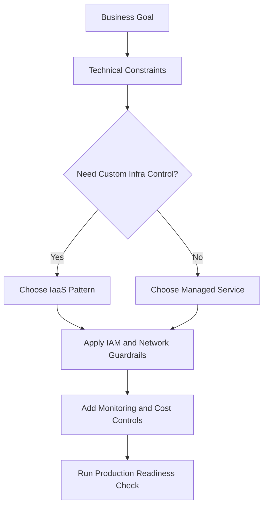
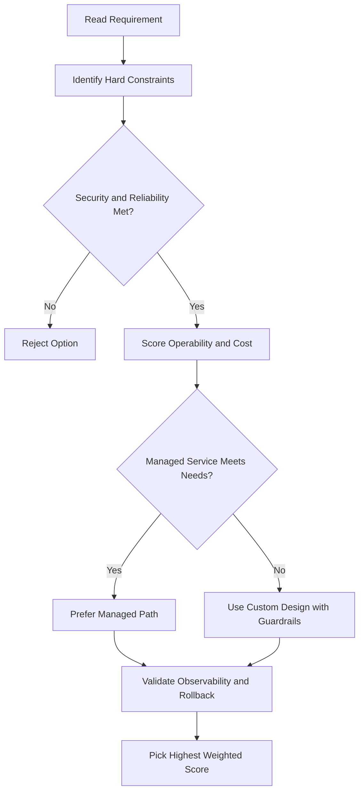
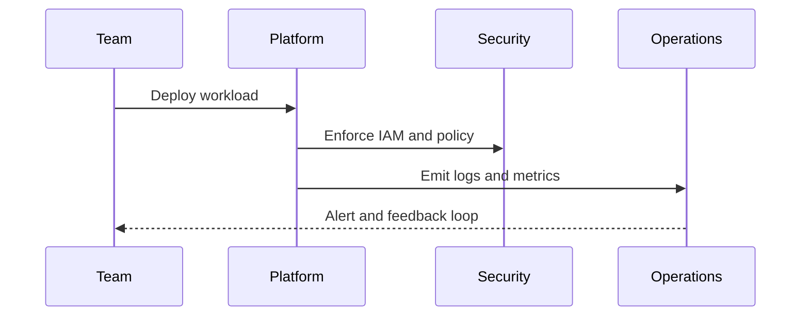

# 🧠 Google Cloud Prompt Engineering Guide

## Why This Matters

Generative AI and LLMs are powerful, but getting good output depends on how you ask.

This guide helps answer:

- What is **Generative AI**?
- What is an **LLM**?
- What is **prompt engineering**?
- What are the best practices for writing prompts?

---

## Generative AI vs LLM (Not Exactly the Same)

These two terms are often used together, but they are different.

### Generative AI

A broad category of AI models that can create new content, such as:

- Text
- Images
- Code
- Audio and more

### LLM (Large Language Model)

A specific type of generative AI focused on **language tasks**.

So:

- All LLMs are part of generative AI
- Not all generative AI models are LLMs

---

## What is Generative AI?

Generative AI is a type of AI that creates new content based on patterns it learned from training data.

- It can respond to prompts like a conversation
- It learns structure and patterns from large datasets
- It is used in software, healthcare, finance, sales, customer support, and more

A **prompt** is the instruction or question you give the model.

---

## What is an LLM?

An LLM is a very large, general-purpose language model that is:

- **Pre-trained** on huge datasets
- Then **fine-tuned** for specific tasks

### Why is it called “large”?

Because of two things:

1. Huge training data (sometimes petabyte scale)
2. Huge number of parameters (often billions/trillions)

Parameters are the model’s learned internal weights (its "learned memory" for pattern prediction).

---

## How LLM Training Works (Simple Version)

### Pre-training

The model is fed massive text, image, and code datasets to learn patterns and structure of language.

### Fine-tuning

The model is then adjusted on a smaller, targeted dataset for a specific goal.

When you send a prompt, the model predicts the most likely next tokens.

In simple terms, an LLM behaves like a very advanced autocomplete engine.

---

## Hallucinations: Why Models Can Be Wrong

Sometimes a model gives incorrect, made-up, or misleading output. This is called a **hallucination**.

Common reasons:

- Not enough quality training data
- Noisy or low-quality training data
- Prompt lacks context
- Prompt lacks constraints

Important limitations to remember:

- Model may not know your private business data
- Model may not have real-time information
- Model often assumes your prompt is correct
- Model cannot truly verify truth like a human expert

---

## Gemini in Google Cloud

Google Cloud offers **Gemini** as a built-in AI assistant across products.

Gemini can help:

- Developers
- Data scientists
- Cloud operators

With good prompts, Gemini can:

- Suggest architecture options
- Recommend Google Cloud resources
- Generate `gcloud` commands
- Help prototype faster inside Google Cloud Console/Cloud Shell

---

## What is Prompt Engineering?

Prompt engineering is the practice of structuring prompts clearly so the model gives better output.

Simple rule:
**Better prompt quality = better response quality**

---

## Prompt Types

### 1) Zero-shot

No examples given.

Example:
"What is the capital of France?"

### 2) One-shot

Give one example first.

Example:
"Italy -> Rome. What is the capital of France?"

### 3) Few-shot

Give two or more examples.

Example:
"Italy -> Rome, Japan -> Tokyo. What is the capital of France?"

### 4) Role prompt

Assign a role/persona to shape responses.

Example:
"Act as a cloud architect in Google Cloud..."

For technical tasks like architecture design, role prompts often improve relevance.

---

## Two Main Parts of a Prompt

### Preamble

The setup/context before the actual request.

Can include:

- Role/persona
- Task goal
- Constraints
- Examples

### Input

The core request or data the model should act on.

You do not always need every component. Order and format can vary by use case.

---

## Better Prompt Example (Sasha Scenario)

Original prompt:
"How can I create a network that uses IPv4 and IPv6 addresses?"

Improved prompt:
"Act as a Google Cloud architect. How can I use gcloud to create a network and subnet that support IPv4 and IPv6 (dual stack)?"

Even better follow-up in same chat context:
"How can I adjust the previous gcloud command to ensure the subnet is dual stack?"

This works because the role and objective are clear.

---

## Prompt Engineering Best Practices

1. **Be specific and explicit**
   Vague prompts create vague output.

2. **Set boundaries and constraints**
   Tell the model exactly what to produce.

3. **Prefer positive instructions**
   Say what to do, not only what to avoid.

4. **Add fallback behavior**
   Example fallback: "If uncertain, say: 'I’m still learning about that.'"

5. **Use a persona when useful**
   Role context improves task focus.

6. **Keep sentences short**
   Break large asks into smaller, clear steps.

7. **Iterate**
   Refine prompts based on the model’s output.

---

## Final Practical Example

Sasha (cloud architect) asks for a centrally managed VPC design connected across regions with simpler firewall policy management.

Because the prompt is clear and contextual, Gemini can recommend a **hub-and-spoke architecture**, which matches the requirement.

---

## Key Takeaway

Prompt engineering is not about "magic words." It is about:

- Clear context
- Clear task
- Clear constraints
- Iteration

When you do this well, tools like Gemini become reliable collaborators for cloud design, automation, and problem-solving.

## ACE Exam-Style Practice Questions

### Q1
In a Prompt Engineering Guide scenario, two answers seem technically possible. What tie-breaker should you apply first?

A. Pick the option with most manual steps
B. Pick the option with least privilege and least operational overhead that still meets requirements
C. Pick highest-cost option
D. Pick the oldest product

Answer: B
Trap: ACE-style scenarios reward secure, managed, requirement-fit decisions.

### Q2
For Prompt Engineering Guide, what is the best way to reduce wrong answers in multi-choice questions?

A. Ignore scaling and security words
B. Identify trigger words, eliminate over-privileged choices, then choose the managed fit
C. Always pick Compute Engine
D. Always pick the shortest option

Answer: B
Trap: Structured elimination is more reliable than memorization alone.

<!-- ACE_DEEP_ENRICHMENT_START -->
## ACE Deep Enrichment

### Think Like a Google Engineer
- Primary optimization axis: Managed-service-first design with reliability and security by default.
- Start with constraints first: SLO, security, compliance, latency, budget, and team operations capacity.
- Prefer managed services if they satisfy requirements with lower long-term operational toil.
- Minimize blast radius using environment isolation, least privilege, and failure-domain awareness.
- Design for day-2 operations: observability, rollback strategy, and quota or budget guardrails.

### Most Correct Option Filter (60 Seconds)
1. Eliminate options with broad access, single points of failure, or missing monitoring.
2. Confirm the option meets non-negotiables first: security and reliability requirements.
3. Compare remaining options on operational simplicity and long-term maintainability.
4. Use cost as an optimizer only after requirements and risk controls are satisfied.

### Weighted Decision Matrix
| Dimension | Weight | Strong Signal |
| --- | --- | --- |
| Security | 3 | Least privilege, secure defaults, no exposed blast radius |
| Reliability | 3 | Multi-zone or HA design, health checks, tested recovery path |
| Operability | 2 | Clear monitoring, alerting, rollout and rollback simplicity |
| Cost Efficiency | 2 | Right-sized resources, no waste, no reliability regression |
| Performance | 1 | Meets latency and throughput targets with headroom |

### Real-Life Scenario
A growing startup is moving from manual infrastructure to Google Cloud. They need fast delivery, better reliability, and clear operational controls while keeping architecture simple.

### Worked Example
- Translate business goals into technical constraints before selecting services.
- Favor managed services to reduce operational burden where possible.
- Apply least-privilege IAM and private-by-default networking decisions.
- Add monitoring, logging, and budget controls from the start.

### Flowchart


### Optimization Decision Flow


### Interaction Sequence


### Extra Exam Practice (15 Questions)
#### Q1
Scenario Focus: 🧠 Google Cloud Prompt Engineering Guide
Which design pattern is usually best for fast, safe cloud adoption?

A. Use managed services with least-privilege IAM and clear observability controls.
B. Start with manual scripts and unrestricted access, then harden later.
C. Use one project for everything to reduce setup effort.
D. Ignore telemetry until after first production incident.

Answer: A
Why the other options are weaker: They typically ignore at least one hard constraint such as security, reliability, cost efficiency, or operational simplicity.
Google-engineer check: Reconfirm SLO fit, blast radius, and day-2 maintainability before finalizing.

#### Q2
Scenario Focus: 🧠 Google Cloud Prompt Engineering Guide
A team wants speed and low ops overhead. What should they prioritize?

A. Use one project for everything to reduce setup effort.
B. Prefer services that reduce operational toil while meeting reliability goals.
C. Ignore telemetry until after first production incident.
D. Pick only the cheapest service regardless of reliability needs.

Answer: B
Why the other options are weaker: They typically ignore at least one hard constraint such as security, reliability, cost efficiency, or operational simplicity.
Google-engineer check: Reconfirm SLO fit, blast radius, and day-2 maintainability before finalizing.

#### Q3
Scenario Focus: 🧠 Google Cloud Prompt Engineering Guide
What is a common architecture trap in early cloud projects?

A. Ignore telemetry until after first production incident.
B. Pick only the cheapest service regardless of reliability needs.
C. Over-broad access and missing monitoring are high-risk trap patterns.
D. Keep architecture opaque to avoid governance overhead.

Answer: C
Why the other options are weaker: They typically ignore at least one hard constraint such as security, reliability, cost efficiency, or operational simplicity.
Google-engineer check: Reconfirm SLO fit, blast radius, and day-2 maintainability before finalizing.

#### Q4
Scenario Focus: 🧠 Google Cloud Prompt Engineering Guide
Which control set should be baseline for production?

A. Pick only the cheapest service regardless of reliability needs.
B. Keep architecture opaque to avoid governance overhead.
C. Start with manual scripts and unrestricted access, then harden later.
D. Baseline should include IAM guardrails, logging, monitoring, and cost alerts.

Answer: D
Why the other options are weaker: They typically ignore at least one hard constraint such as security, reliability, cost efficiency, or operational simplicity.
Google-engineer check: Reconfirm SLO fit, blast radius, and day-2 maintainability before finalizing.

#### Q5
Scenario Focus: 🧠 Google Cloud Prompt Engineering Guide
How should you evaluate conflicting requirements on the exam?

A. Choose the option that balances security, reliability, cost, and operability.
B. Keep architecture opaque to avoid governance overhead.
C. Start with manual scripts and unrestricted access, then harden later.
D. Use one project for everything to reduce setup effort.

Answer: A
Why the other options are weaker: They typically ignore at least one hard constraint such as security, reliability, cost efficiency, or operational simplicity.
Google-engineer check: Reconfirm SLO fit, blast radius, and day-2 maintainability before finalizing.

#### Q6
Scenario Focus: 🧠 Google Cloud Prompt Engineering Guide
Two designs both satisfy the happy path for 🧠 Google Cloud Prompt Engineering Guide. Which choice is most correct?

A. Start with manual scripts and unrestricted access, then harden later.
B. Choose the option that preserves reliability and security while reducing operational burden.
C. Use one project for everything to reduce setup effort.
D. Ignore telemetry until after first production incident.

Answer: B
Why the other options are weaker: They typically ignore at least one hard constraint such as security, reliability, cost efficiency, or operational simplicity.
Google-engineer check: Reconfirm SLO fit, blast radius, and day-2 maintainability before finalizing.

#### Q7
Scenario Focus: 🧠 Google Cloud Prompt Engineering Guide
What should you validate first before choosing an architecture for 🧠 Google Cloud Prompt Engineering Guide?

A. Use one project for everything to reduce setup effort.
B. Ignore telemetry until after first production incident.
C. Validate SLO fit, blast radius, and least-privilege controls before comparing convenience.
D. Pick only the cheapest service regardless of reliability needs.

Answer: C
Why the other options are weaker: They typically ignore at least one hard constraint such as security, reliability, cost efficiency, or operational simplicity.
Google-engineer check: Reconfirm SLO fit, blast radius, and day-2 maintainability before finalizing.

#### Q8
Scenario Focus: 🧠 Google Cloud Prompt Engineering Guide
A proposal lowers cost but increases failure risk. What is the best decision?

A. Ignore telemetry until after first production incident.
B. Pick only the cheapest service regardless of reliability needs.
C. Keep architecture opaque to avoid governance overhead.
D. Reject it unless reliability and recovery objectives remain within required targets.

Answer: D
Why the other options are weaker: They typically ignore at least one hard constraint such as security, reliability, cost efficiency, or operational simplicity.
Google-engineer check: Reconfirm SLO fit, blast radius, and day-2 maintainability before finalizing.

#### Q9
Scenario Focus: 🧠 Google Cloud Prompt Engineering Guide
Which option best reflects optimization for Managed-service-first design with reliability and security by default?

A. Select the design that best meets Managed-service-first design with reliability and security by default while keeping constraints balanced.
B. Pick only the cheapest service regardless of reliability needs.
C. Keep architecture opaque to avoid governance overhead.
D. Start with manual scripts and unrestricted access, then harden later.

Answer: A
Why the other options are weaker: They typically ignore at least one hard constraint such as security, reliability, cost efficiency, or operational simplicity.
Google-engineer check: Reconfirm SLO fit, blast radius, and day-2 maintainability before finalizing.

#### Q10
Scenario Focus: 🧠 Google Cloud Prompt Engineering Guide
How should you evaluate a design that needs frequent manual interventions?

A. Keep architecture opaque to avoid governance overhead.
B. Treat it as high risk and prefer automation-friendly designs with observability and rollback.
C. Start with manual scripts and unrestricted access, then harden later.
D. Use one project for everything to reduce setup effort.

Answer: B
Why the other options are weaker: They typically ignore at least one hard constraint such as security, reliability, cost efficiency, or operational simplicity.
Google-engineer check: Reconfirm SLO fit, blast radius, and day-2 maintainability before finalizing.

#### Q11
Scenario Focus: 🧠 Google Cloud Prompt Engineering Guide
Two options have similar latency. Which tie-breaker is best?

A. Start with manual scripts and unrestricted access, then harden later.
B. Use one project for everything to reduce setup effort.
C. Pick the option with stronger operability, clearer failure isolation, and simpler incident response.
D. Ignore telemetry until after first production incident.

Answer: C
Why the other options are weaker: They typically ignore at least one hard constraint such as security, reliability, cost efficiency, or operational simplicity.
Google-engineer check: Reconfirm SLO fit, blast radius, and day-2 maintainability before finalizing.

#### Q12
Scenario Focus: 🧠 Google Cloud Prompt Engineering Guide
What is the best way to choose between a custom stack and a managed service?

A. Use one project for everything to reduce setup effort.
B. Ignore telemetry until after first production incident.
C. Pick only the cheapest service regardless of reliability needs.
D. Prefer managed services when they meet requirements with lower long-term maintenance effort.

Answer: D
Why the other options are weaker: They typically ignore at least one hard constraint such as security, reliability, cost efficiency, or operational simplicity.
Google-engineer check: Reconfirm SLO fit, blast radius, and day-2 maintainability before finalizing.

#### Q13
Scenario Focus: 🧠 Google Cloud Prompt Engineering Guide
How do you confirm a solution is production-ready for 

A. Verify monitoring, alerting, rollback path, quota and budget controls, and secure defaults.
B. Ignore telemetry until after first production incident.
C. Pick only the cheapest service regardless of reliability needs.
D. Keep architecture opaque to avoid governance overhead.

Answer: A
Why the other options are weaker: They typically ignore at least one hard constraint such as security, reliability, cost efficiency, or operational simplicity.
Google-engineer check: Reconfirm SLO fit, blast radius, and day-2 maintainability before finalizing.

#### Q14
Scenario Focus: 🧠 Google Cloud Prompt Engineering Guide
Which pattern usually wins in ACE scenario tie-breakers?

A. Pick only the cheapest service regardless of reliability needs.
B. Managed-service-first plus least-privilege access plus clear observability usually wins.
C. Keep architecture opaque to avoid governance overhead.
D. Start with manual scripts and unrestricted access, then harden later.

Answer: B
Why the other options are weaker: They typically ignore at least one hard constraint such as security, reliability, cost efficiency, or operational simplicity.
Google-engineer check: Reconfirm SLO fit, blast radius, and day-2 maintainability before finalizing.

#### Q15
Scenario Focus: 🧠 Google Cloud Prompt Engineering Guide
What is the best final check before locking the answer?

A. Keep architecture opaque to avoid governance overhead.
B. Start with manual scripts and unrestricted access, then harden later.
C. Run a weighted check across security, reliability, cost, performance, and operability.
D. Use one project for everything to reduce setup effort.

Answer: C
Why the other options are weaker: They typically ignore at least one hard constraint such as security, reliability, cost efficiency, or operational simplicity.
Google-engineer check: Reconfirm SLO fit, blast radius, and day-2 maintainability before finalizing.

### Quick Commands
```bash
gcloud config list
gcloud projects describe PROJECT_ID
gcloud services list --enabled --project=PROJECT_ID
gcloud logging read "severity>=WARNING" --project=PROJECT_ID --freshness=2d --limit=20
```

### Fast Recall
- Good cloud design is constraint-driven, not tool-driven.
- Managed services usually improve delivery speed and reliability.
- Security and observability should be built in from day one.
<!-- ACE_DEEP_ENRICHMENT_END -->