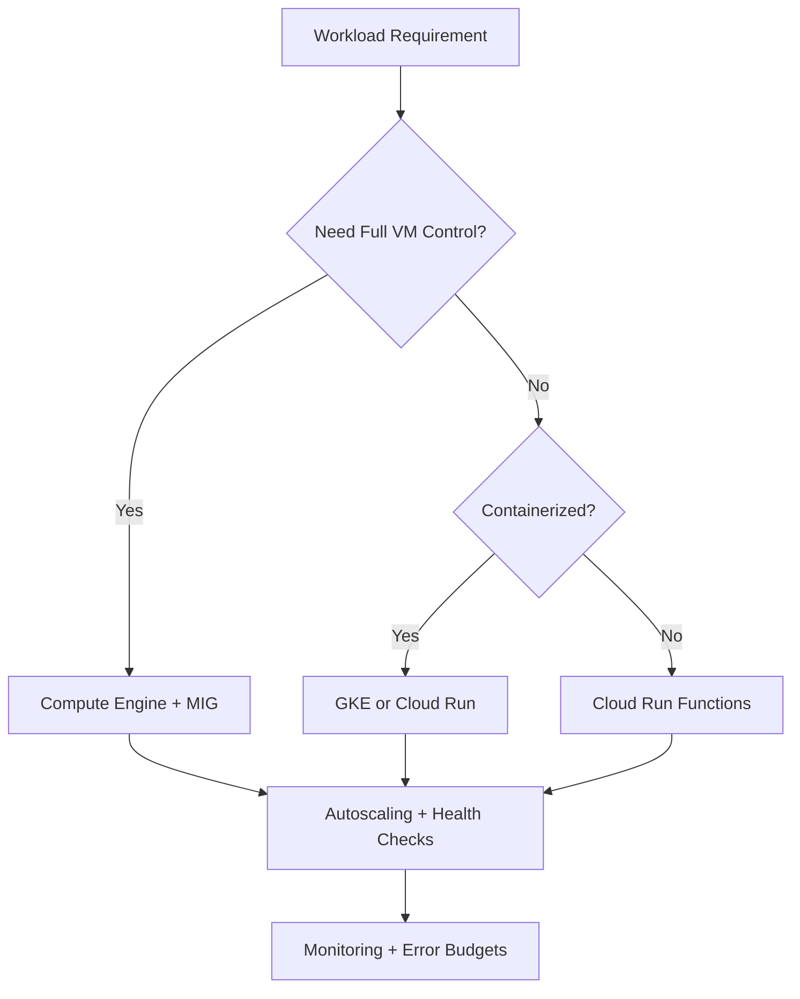
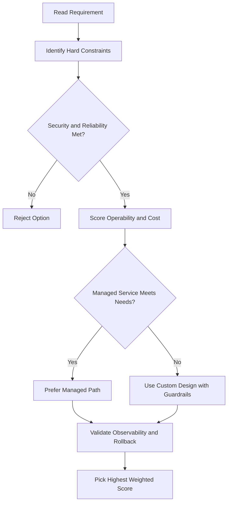
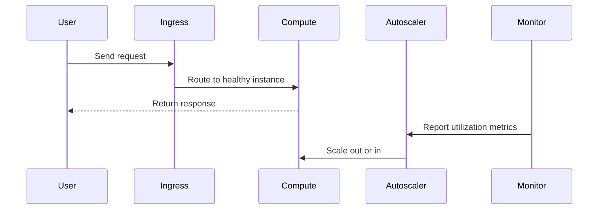

# 🏗️ Architecting with Google Compute Engine — Course Introduction

## What is Google Cloud?

Google Cloud is more than just a set of tools — it's part of a larger ecosystem that includes:

- Open-source software
- Third-party developers and partners
- Other cloud providers

Google is a strong supporter of open-source, and the same infrastructure that runs Gmail, Google Maps, Google Search, and Gemini is what Google Cloud is built on.

---

## Three Core Features of Google Cloud

1. **Infrastructure** — the physical and virtual foundation (servers, networking, storage)
2. **Platform** — services to build and run applications on top of that infrastructure
3. **Software** — ready-made tools and apps for end users

---

## Google Cloud's Global Network

Google Cloud is spread across the world with:

- **Regions** — geographic areas containing data centers
- **Zones** — isolated locations within a region
- **Points of presence** — network entry points

All connected via high-speed **fiber optic cables**.

> For the latest info on locations: [cloud.google.com/about/locations](https://cloud.google.com/about/locations)

---

## IaaS → PaaS → SaaS: A Spectrum of Control

Google Cloud spans the full range from full infrastructure control to fully managed software:

|          | What you manage               | Example               |
| -------- | ----------------------------- | --------------------- |
| **IaaS** | Everything (OS, runtime, app) | Compute Engine        |
| **PaaS** | Just your app                 | App Engine, Cloud Run |
| **SaaS** | Nothing — just use it         | Google Workspace      |

You can mix and match. For example:

- Spin up a VM with Compute Engine and install MySQL yourself (full control)
- Use Cloud SQL instead and let Google handle backups and patches
- Or go fully serverless with a NoSQL database that scales on its own

---

## IT Infrastructure: A City Analogy

Think of IT infrastructure like a city:

- The **roads, power, water, and communication networks** = the infrastructure
- The **people** = the users
- The **cars, buildings, and bikes** = the applications

Everything that supports and connects the applications to the users is infrastructure. That's what these courses focus on.

---

## Google Cloud Compute Services (Quick Overview)

### Compute Engine (IaaS)

Run virtual machines on demand. Maximum flexibility — you manage the OS and everything on it.

### Google Kubernetes Engine (GKE)

Run containerized apps on a Google-managed Kubernetes cluster. You stay in control, but Google handles the cluster.

### Cloud Run

Run stateless containers triggered by web requests or Pub/Sub events. Fully serverless — built on Knative.

### Cloud Run Functions

Write individual functions that run only when triggered by events. Serverless, auto-scales, pay only when your code runs.

---

## Course Series: Architecting with Google Compute Engine

This series is part of the **Cloud Engineer learning path**, meant for IT professionals who build, deploy, and maintain cloud applications.

### Course 1 — Essential Cloud Infrastructure: Foundation

- How to use the Google Cloud Console and Cloud Shell
- Creating VPC networks and networking objects
- Creating virtual machines with Compute Engine

### Course 2 — Essential Cloud Infrastructure: Core Services

- IAM (Identity and Access Management)
- Data storage services
- Resource management and billing
- Resource monitoring with Google Cloud Monitoring

### Course 3 — Elastic Cloud Infrastructure: Scaling and Automation

- Network interconnect options
- Load balancing and autoscaling
- Infrastructure automation with Terraform
- Other managed Google Cloud services

---

## What You Will Learn to Do

By the end of this series, you should be able to:

- Understand what different Google Cloud services do and when to use them
- Apply knowledge to real-world requirements
- Evaluate different options and choose the right one
- Build your own cloud solutions using Google Cloud building blocks

---

## Hands-On Labs

All courses include labs through the **Google Skills platform**, which gives you a real Google Cloud account with no cost to practice directly in the console.

---

## gcloud Commands

```bash
# Authenticate with Google Cloud
gcloud auth login

# Set default project
gcloud config set project PROJECT_ID

# Set default region and zone
gcloud config set compute/region us-central1
gcloud config set compute/zone us-central1-a

# View current configuration
gcloud config list
```

## ACE Exam-Style Practice Questions

### Q1
In a Architecting Intro scenario, two answers seem technically possible. What tie-breaker should you apply first?

A. Pick the option with most manual steps
B. Pick the option with least privilege and least operational overhead that still meets requirements
C. Pick highest-cost option
D. Pick the oldest product

Answer: B
Trap: ACE-style scenarios reward secure, managed, requirement-fit decisions.

### Q2
For Architecting Intro, what is the best way to reduce wrong answers in multi-choice questions?

A. Ignore scaling and security words
B. Identify trigger words, eliminate over-privileged choices, then choose the managed fit
C. Always pick Compute Engine
D. Always pick the shortest option

Answer: B
Trap: Structured elimination is more reliable than memorization alone.

<!-- ACE_DEEP_ENRICHMENT_START -->
## ACE Deep Enrichment

### Think Like a Google Engineer
- Primary optimization axis: Elastic performance with minimum operational toil.
- Start with constraints first: SLO, security, compliance, latency, budget, and team operations capacity.
- Prefer managed services if they satisfy requirements with lower long-term operational toil.
- Minimize blast radius using environment isolation, least privilege, and failure-domain awareness.
- Design for day-2 operations: observability, rollback strategy, and quota or budget guardrails.

### Most Correct Option Filter (60 Seconds)
1. Eliminate options with broad access, single points of failure, or missing monitoring.
2. Confirm the option meets non-negotiables first: security and reliability requirements.
3. Compare remaining options on operational simplicity and long-term maintainability.
4. Use cost as an optimizer only after requirements and risk controls are satisfied.

### Weighted Decision Matrix
| Dimension | Weight | Strong Signal |
| --- | --- | --- |
| Security | 3 | Least privilege, secure defaults, no exposed blast radius |
| Reliability | 3 | Multi-zone or HA design, health checks, tested recovery path |
| Operability | 2 | Clear monitoring, alerting, rollout and rollback simplicity |
| Cost Efficiency | 2 | Right-sized resources, no waste, no reliability regression |
| Performance | 1 | Meets latency and throughput targets with headroom |

### Real-Life Scenario
A media startup has unpredictable traffic spikes during launches. They need faster releases, automatic scaling, and strong reliability without overpaying for idle capacity.

### Worked Example
- Choose managed compute first when operations overhead is a concern.
- For VM workloads, use managed instance groups with autoscaling and autohealing.
- For container workloads, use GKE node pools and rolling updates.
- For event-driven workloads, prefer Cloud Run or functions with concurrency controls.

### Flowchart


### Optimization Decision Flow


### Interaction Sequence


### Extra Exam Practice (10 Questions)
#### Q1
Scenario Focus: 🏗️ Architecting with Google Compute Engine — Course Introduction
Traffic triples during business hours and falls overnight. Which compute pattern is best?

A. Use autoscaling with target utilization and baseline minimum capacity.
B. Pin capacity to peak traffic all day for safety.
C. Restart failed instances manually as incidents occur.
D. Use one large VM because horizontal scaling is complex.

Answer: A
Why the other options are weaker: They typically ignore at least one hard constraint such as security, reliability, cost efficiency, or operational simplicity.
Google-engineer check: Reconfirm SLO fit, blast radius, and day-2 maintainability before finalizing.

#### Q2
Scenario Focus: 🏗️ Architecting with Google Compute Engine — Course Introduction
A VM app must self-heal when instances fail health checks. What should you use?

A. Restart failed instances manually as incidents occur.
B. Use a managed instance group with health checks and autohealing enabled.
C. Use one large VM because horizontal scaling is complex.
D. Deploy all changes at once without canary checks.

Answer: B
Why the other options are weaker: They typically ignore at least one hard constraint such as security, reliability, cost efficiency, or operational simplicity.
Google-engineer check: Reconfirm SLO fit, blast radius, and day-2 maintainability before finalizing.

#### Q3
Scenario Focus: 🏗️ Architecting with Google Compute Engine — Course Introduction
A team wants to deploy containers without managing nodes. Which platform fits best?

A. Use one large VM because horizontal scaling is complex.
B. Deploy all changes at once without canary checks.
C. Use Cloud Run for containerized services when node management is not required.
D. Ignore utilization metrics and optimize only by guesswork.

Answer: C
Why the other options are weaker: They typically ignore at least one hard constraint such as security, reliability, cost efficiency, or operational simplicity.
Google-engineer check: Reconfirm SLO fit, blast radius, and day-2 maintainability before finalizing.

#### Q4
Scenario Focus: 🏗️ Architecting with Google Compute Engine — Course Introduction
Which update strategy minimizes user impact during releases?

A. Deploy all changes at once without canary checks.
B. Ignore utilization metrics and optimize only by guesswork.
C. Pin capacity to peak traffic all day for safety.
D. Use rolling or blue-green deployment with health-based rollout checks.

Answer: D
Why the other options are weaker: They typically ignore at least one hard constraint such as security, reliability, cost efficiency, or operational simplicity.
Google-engineer check: Reconfirm SLO fit, blast radius, and day-2 maintainability before finalizing.

#### Q5
Scenario Focus: 🏗️ Architecting with Google Compute Engine — Course Introduction
How do you avoid overprovisioning while keeping performance stable?

A. Right-size resources and monitor saturation, latency, and error rates continuously.
B. Ignore utilization metrics and optimize only by guesswork.
C. Pin capacity to peak traffic all day for safety.
D. Restart failed instances manually as incidents occur.

Answer: A
Why the other options are weaker: They typically ignore at least one hard constraint such as security, reliability, cost efficiency, or operational simplicity.
Google-engineer check: Reconfirm SLO fit, blast radius, and day-2 maintainability before finalizing.

#### Q6
Scenario Focus: 🏗️ Architecting with Google Compute Engine — Course Introduction
Two designs both satisfy the happy path for 🏗️ Architecting with Google Compute Engine — Course Introduction. Which choice is most correct?

A. Pin capacity to peak traffic all day for safety.
B. Choose the option that preserves reliability and security while reducing operational burden.
C. Restart failed instances manually as incidents occur.
D. Use one large VM because horizontal scaling is complex.

Answer: B
Why the other options are weaker: They typically ignore at least one hard constraint such as security, reliability, cost efficiency, or operational simplicity.
Google-engineer check: Reconfirm SLO fit, blast radius, and day-2 maintainability before finalizing.

#### Q7
Scenario Focus: 🏗️ Architecting with Google Compute Engine — Course Introduction
What should you validate first before choosing an architecture for 🏗️ Architecting with Google Compute Engine — Course Introduction?

A. Restart failed instances manually as incidents occur.
B. Use one large VM because horizontal scaling is complex.
C. Validate SLO fit, blast radius, and least-privilege controls before comparing convenience.
D. Deploy all changes at once without canary checks.

Answer: C
Why the other options are weaker: They typically ignore at least one hard constraint such as security, reliability, cost efficiency, or operational simplicity.
Google-engineer check: Reconfirm SLO fit, blast radius, and day-2 maintainability before finalizing.

#### Q8
Scenario Focus: 🏗️ Architecting with Google Compute Engine — Course Introduction
A proposal lowers cost but increases failure risk. What is the best decision?

A. Use one large VM because horizontal scaling is complex.
B. Deploy all changes at once without canary checks.
C. Ignore utilization metrics and optimize only by guesswork.
D. Reject it unless reliability and recovery objectives remain within required targets.

Answer: D
Why the other options are weaker: They typically ignore at least one hard constraint such as security, reliability, cost efficiency, or operational simplicity.
Google-engineer check: Reconfirm SLO fit, blast radius, and day-2 maintainability before finalizing.

#### Q9
Scenario Focus: 🏗️ Architecting with Google Compute Engine — Course Introduction
Which option best reflects optimization for Elastic performance with minimum operational toil?

A. Select the design that best meets Elastic performance with minimum operational toil while keeping constraints balanced.
B. Deploy all changes at once without canary checks.
C. Ignore utilization metrics and optimize only by guesswork.
D. Pin capacity to peak traffic all day for safety.

Answer: A
Why the other options are weaker: They typically ignore at least one hard constraint such as security, reliability, cost efficiency, or operational simplicity.
Google-engineer check: Reconfirm SLO fit, blast radius, and day-2 maintainability before finalizing.

#### Q10
Scenario Focus: 🏗️ Architecting with Google Compute Engine — Course Introduction
How should you evaluate a design that needs frequent manual interventions?

A. Ignore utilization metrics and optimize only by guesswork.
B. Treat it as high risk and prefer automation-friendly designs with observability and rollback.
C. Pin capacity to peak traffic all day for safety.
D. Restart failed instances manually as incidents occur.

Answer: B
Why the other options are weaker: They typically ignore at least one hard constraint such as security, reliability, cost efficiency, or operational simplicity.
Google-engineer check: Reconfirm SLO fit, blast radius, and day-2 maintainability before finalizing.

### Quick Commands
```bash
gcloud compute instance-groups managed list --project=PROJECT_ID
gcloud compute instance-groups managed describe MIG_NAME --zone=ZONE --project=PROJECT_ID
gcloud run services list --region=REGION --project=PROJECT_ID
kubectl get pods -A
```

### Fast Recall
- Autoscaling is useful only with valid signals and guardrails.
- Managed offerings usually reduce operational burden.
- Deployment safety needs health checks and staged rollout.
<!-- ACE_DEEP_ENRICHMENT_END -->