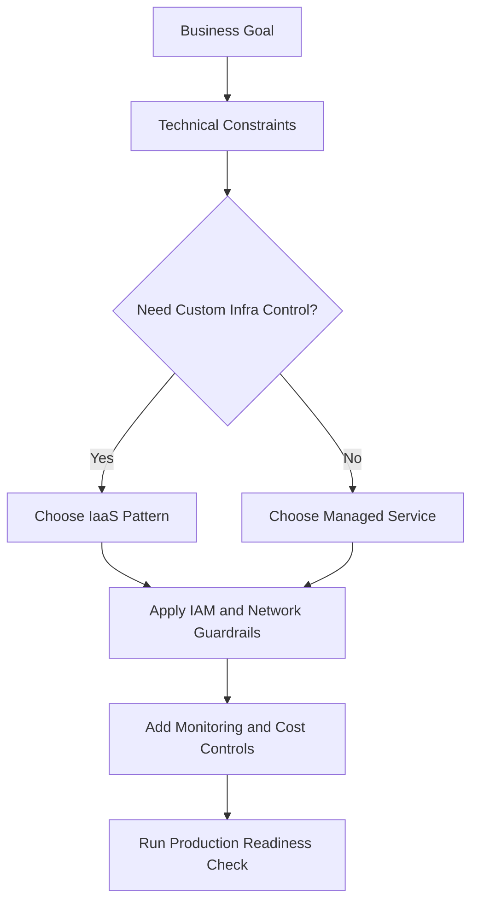
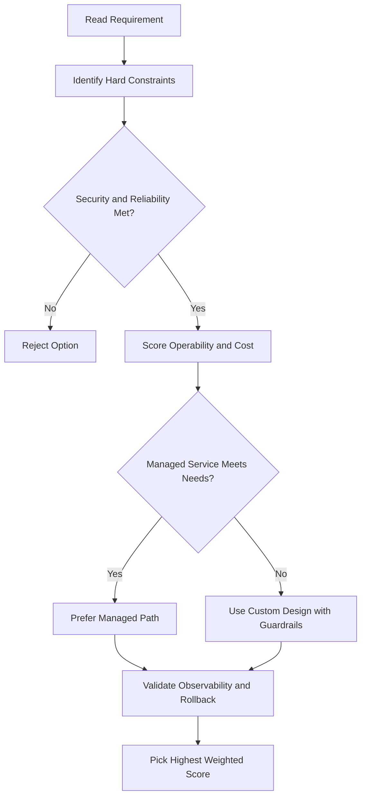
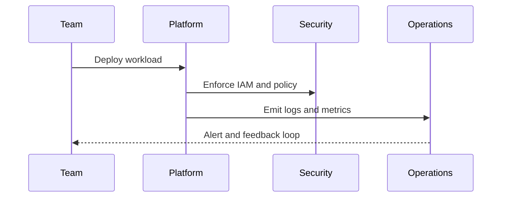

# 💻 Getting Started — Interacting with Google Cloud

## What This Module Covers

This module teaches you **how to actually use Google Cloud** — the tools and methods to interact with it.

By the end, you'll be familiar with all the ways to manage Google Cloud resources.

---

## Four Main Ways to Interact with Google Cloud

Google Cloud gives you multiple interfaces to get the job done. Pick whichever fits your style.

---

## 1) Google Cloud Console (Web UI)

The **graphical, web-based interface** for Google Cloud.

**Access:** console.cloud.google.com

**What you can do:**

- View your VMs, databases, storage, and all resources
- Click through menus to create and configure resources
- View dashboards and monitoring
- Point-and-click management

**Good for:** visual learners, learning, quick tasks, exploring Google Cloud.

### Understanding Console Navigation

Lab instructions often say: _"On the Navigation menu, click Compute Engine > VM instances."_

Here's how to follow that:

1. Click the **three horizontal lines icon** (≡) in the Console — this is the Navigation menu
2. A menu opens showing all Google Cloud products
3. **Hover over** "Compute Engine" to see a submenu
4. **Click** "VM instances"

You'll get comfortable with this as you do more labs.

---

## 2) Cloud Shell & Google Cloud CLI

### Cloud Shell

A **browser-based terminal** built right into the Google Cloud Console.

**What it is:**

- A temporary Linux virtual machine
- 5 GB of persistent disk storage (your files stay between sessions)
- Has the Google Cloud CLI (`gcloud`) pre-installed
- Free to use

Access it directly from the Console — no setup needed.

### Google Cloud CLI (gcloud)

A **command-line tool** for managing Google Cloud resources.

**Example commands:**

- `gcloud compute instances list` — list all your VMs
- `gcloud storage buckets create my-bucket` — create a storage bucket
- Works in Cloud Shell or any terminal on your computer

Lab instructions will sometimes say: "Copy and paste this command into Cloud Shell." You'll either use Cloud Shell in the Console or an SSH terminal — just copy and paste the command (sometimes you'll need to modify it, like for globally unique bucket names).

**Good for:** automation, scripting, power users, reproducible workflows.

---

## 3) APIs & Client Libraries

For programmers who want to build custom tools or integrate Google Cloud into applications.

### App APIs

- Access Google Cloud services from your code
- Optimized for languages like Python, Node.js, Java, Go, etc.
- Good for: building applications that use Google Cloud services

### Admin APIs

- Manage and automate resource creation/deletion
- Good for: building custom automation tools and scripts

**Example:** Write a program that automatically creates VMs when certain conditions are met.

---

## 4) Cloud Mobile App

Manage Google Cloud from your **Android or iOS device** on the go.

**What you can do:**

- Start, stop, and SSH into Compute Engine instances
- View logs from instances
- Create custom graphs for metrics (CPU, network, requests/sec, errors)
- Set up alerts and notifications
- View billing info and get budget alerts
- Incident management

**Download:** Google Play Store or App Store

**Good for:** quick management, monitoring on mobile, getting alerts while away.

---

## Cloud Marketplace

Google Cloud Marketplace offers pre-built solutions you can deploy in seconds — from any interface.

Instead of:

- Manually creating VMs
- Installing software
- Configuring networking
- Setting up storage

You just click "Deploy" on a pre-configured solution, and Google Cloud handles all the setup for you.

Examples:

- WordPress
- Jenkins
- Popular databases
- Open-source apps

---

## Projects

A **Project** is how Google Cloud organizes everything.

Think of it as a container that holds:

- All your resources (VMs, networks, databases, etc.)
- Billing information
- IAM permissions
- Quotas and limits

One Google Cloud account can have many projects, and projects are isolated from each other.

---

## Choosing Your Interface

| Task                   | Best Interface           |
| ---------------------- | ------------------------ |
| Learning/exploring     | Console (GUI)            |
| Quick one-off commands | Cloud Shell              |
| Automation/scripting   | Cloud Shell + gcloud CLI |
| Building custom tools  | APIs/Client libraries    |
| Mobile management      | Cloud Mobile App         |

---

## Key Takeaway

You're not locked into one way — use whichever tool makes sense for what you're doing:

- **Console** for visual, point-and-click management
- **Cloud Shell/gcloud CLI** for command-line automation
- **APIs** for custom applications
- **Mobile app** for on-the-go management
- **Cloud Marketplace** for instant pre-built solutions
- **Projects** to organize everything

## ACE Exam-Style Practice Questions

### Q1
In a Getting Started Interacting Gcp scenario, two answers seem technically possible. What tie-breaker should you apply first?

A. Pick the option with most manual steps
B. Pick the option with least privilege and least operational overhead that still meets requirements
C. Pick highest-cost option
D. Pick the oldest product

Answer: B
Trap: ACE-style scenarios reward secure, managed, requirement-fit decisions.

### Q2
For Getting Started Interacting Gcp, what is the best way to reduce wrong answers in multi-choice questions?

A. Ignore scaling and security words
B. Identify trigger words, eliminate over-privileged choices, then choose the managed fit
C. Always pick Compute Engine
D. Always pick the shortest option

Answer: B
Trap: Structured elimination is more reliable than memorization alone.

<!-- ACE_DEEP_ENRICHMENT_START -->
## ACE Deep Enrichment

### Think Like a Google Engineer
- Primary optimization axis: Managed-service-first design with reliability and security by default.
- Start with constraints first: SLO, security, compliance, latency, budget, and team operations capacity.
- Prefer managed services if they satisfy requirements with lower long-term operational toil.
- Minimize blast radius using environment isolation, least privilege, and failure-domain awareness.
- Design for day-2 operations: observability, rollback strategy, and quota or budget guardrails.

### Most Correct Option Filter (60 Seconds)
1. Eliminate options with broad access, single points of failure, or missing monitoring.
2. Confirm the option meets non-negotiables first: security and reliability requirements.
3. Compare remaining options on operational simplicity and long-term maintainability.
4. Use cost as an optimizer only after requirements and risk controls are satisfied.

### Weighted Decision Matrix
| Dimension | Weight | Strong Signal |
| --- | --- | --- |
| Security | 3 | Least privilege, secure defaults, no exposed blast radius |
| Reliability | 3 | Multi-zone or HA design, health checks, tested recovery path |
| Operability | 2 | Clear monitoring, alerting, rollout and rollback simplicity |
| Cost Efficiency | 2 | Right-sized resources, no waste, no reliability regression |
| Performance | 1 | Meets latency and throughput targets with headroom |

### Real-Life Scenario
A growing startup is moving from manual infrastructure to Google Cloud. They need fast delivery, better reliability, and clear operational controls while keeping architecture simple.

### Worked Example
- Translate business goals into technical constraints before selecting services.
- Favor managed services to reduce operational burden where possible.
- Apply least-privilege IAM and private-by-default networking decisions.
- Add monitoring, logging, and budget controls from the start.

### Flowchart


### Optimization Decision Flow


### Interaction Sequence


### Extra Exam Practice (15 Questions)
#### Q1
Scenario Focus: 💻 Getting Started — Interacting with Google Cloud
Which design pattern is usually best for fast, safe cloud adoption?

A. Use managed services with least-privilege IAM and clear observability controls.
B. Start with manual scripts and unrestricted access, then harden later.
C. Use one project for everything to reduce setup effort.
D. Ignore telemetry until after first production incident.

Answer: A
Why the other options are weaker: They typically ignore at least one hard constraint such as security, reliability, cost efficiency, or operational simplicity.
Google-engineer check: Reconfirm SLO fit, blast radius, and day-2 maintainability before finalizing.

#### Q2
Scenario Focus: 💻 Getting Started — Interacting with Google Cloud
A team wants speed and low ops overhead. What should they prioritize?

A. Use one project for everything to reduce setup effort.
B. Prefer services that reduce operational toil while meeting reliability goals.
C. Ignore telemetry until after first production incident.
D. Pick only the cheapest service regardless of reliability needs.

Answer: B
Why the other options are weaker: They typically ignore at least one hard constraint such as security, reliability, cost efficiency, or operational simplicity.
Google-engineer check: Reconfirm SLO fit, blast radius, and day-2 maintainability before finalizing.

#### Q3
Scenario Focus: 💻 Getting Started — Interacting with Google Cloud
What is a common architecture trap in early cloud projects?

A. Ignore telemetry until after first production incident.
B. Pick only the cheapest service regardless of reliability needs.
C. Over-broad access and missing monitoring are high-risk trap patterns.
D. Keep architecture opaque to avoid governance overhead.

Answer: C
Why the other options are weaker: They typically ignore at least one hard constraint such as security, reliability, cost efficiency, or operational simplicity.
Google-engineer check: Reconfirm SLO fit, blast radius, and day-2 maintainability before finalizing.

#### Q4
Scenario Focus: 💻 Getting Started — Interacting with Google Cloud
Which control set should be baseline for production?

A. Pick only the cheapest service regardless of reliability needs.
B. Keep architecture opaque to avoid governance overhead.
C. Start with manual scripts and unrestricted access, then harden later.
D. Baseline should include IAM guardrails, logging, monitoring, and cost alerts.

Answer: D
Why the other options are weaker: They typically ignore at least one hard constraint such as security, reliability, cost efficiency, or operational simplicity.
Google-engineer check: Reconfirm SLO fit, blast radius, and day-2 maintainability before finalizing.

#### Q5
Scenario Focus: 💻 Getting Started — Interacting with Google Cloud
How should you evaluate conflicting requirements on the exam?

A. Choose the option that balances security, reliability, cost, and operability.
B. Keep architecture opaque to avoid governance overhead.
C. Start with manual scripts and unrestricted access, then harden later.
D. Use one project for everything to reduce setup effort.

Answer: A
Why the other options are weaker: They typically ignore at least one hard constraint such as security, reliability, cost efficiency, or operational simplicity.
Google-engineer check: Reconfirm SLO fit, blast radius, and day-2 maintainability before finalizing.

#### Q6
Scenario Focus: 💻 Getting Started — Interacting with Google Cloud
Two designs both satisfy the happy path for 💻 Getting Started — Interacting with Google Cloud. Which choice is most correct?

A. Start with manual scripts and unrestricted access, then harden later.
B. Choose the option that preserves reliability and security while reducing operational burden.
C. Use one project for everything to reduce setup effort.
D. Ignore telemetry until after first production incident.

Answer: B
Why the other options are weaker: They typically ignore at least one hard constraint such as security, reliability, cost efficiency, or operational simplicity.
Google-engineer check: Reconfirm SLO fit, blast radius, and day-2 maintainability before finalizing.

#### Q7
Scenario Focus: 💻 Getting Started — Interacting with Google Cloud
What should you validate first before choosing an architecture for 💻 Getting Started — Interacting with Google Cloud?

A. Use one project for everything to reduce setup effort.
B. Ignore telemetry until after first production incident.
C. Validate SLO fit, blast radius, and least-privilege controls before comparing convenience.
D. Pick only the cheapest service regardless of reliability needs.

Answer: C
Why the other options are weaker: They typically ignore at least one hard constraint such as security, reliability, cost efficiency, or operational simplicity.
Google-engineer check: Reconfirm SLO fit, blast radius, and day-2 maintainability before finalizing.

#### Q8
Scenario Focus: 💻 Getting Started — Interacting with Google Cloud
A proposal lowers cost but increases failure risk. What is the best decision?

A. Ignore telemetry until after first production incident.
B. Pick only the cheapest service regardless of reliability needs.
C. Keep architecture opaque to avoid governance overhead.
D. Reject it unless reliability and recovery objectives remain within required targets.

Answer: D
Why the other options are weaker: They typically ignore at least one hard constraint such as security, reliability, cost efficiency, or operational simplicity.
Google-engineer check: Reconfirm SLO fit, blast radius, and day-2 maintainability before finalizing.

#### Q9
Scenario Focus: 💻 Getting Started — Interacting with Google Cloud
Which option best reflects optimization for Managed-service-first design with reliability and security by default?

A. Select the design that best meets Managed-service-first design with reliability and security by default while keeping constraints balanced.
B. Pick only the cheapest service regardless of reliability needs.
C. Keep architecture opaque to avoid governance overhead.
D. Start with manual scripts and unrestricted access, then harden later.

Answer: A
Why the other options are weaker: They typically ignore at least one hard constraint such as security, reliability, cost efficiency, or operational simplicity.
Google-engineer check: Reconfirm SLO fit, blast radius, and day-2 maintainability before finalizing.

#### Q10
Scenario Focus: 💻 Getting Started — Interacting with Google Cloud
How should you evaluate a design that needs frequent manual interventions?

A. Keep architecture opaque to avoid governance overhead.
B. Treat it as high risk and prefer automation-friendly designs with observability and rollback.
C. Start with manual scripts and unrestricted access, then harden later.
D. Use one project for everything to reduce setup effort.

Answer: B
Why the other options are weaker: They typically ignore at least one hard constraint such as security, reliability, cost efficiency, or operational simplicity.
Google-engineer check: Reconfirm SLO fit, blast radius, and day-2 maintainability before finalizing.

#### Q11
Scenario Focus: 💻 Getting Started — Interacting with Google Cloud
Two options have similar latency. Which tie-breaker is best?

A. Start with manual scripts and unrestricted access, then harden later.
B. Use one project for everything to reduce setup effort.
C. Pick the option with stronger operability, clearer failure isolation, and simpler incident response.
D. Ignore telemetry until after first production incident.

Answer: C
Why the other options are weaker: They typically ignore at least one hard constraint such as security, reliability, cost efficiency, or operational simplicity.
Google-engineer check: Reconfirm SLO fit, blast radius, and day-2 maintainability before finalizing.

#### Q12
Scenario Focus: 💻 Getting Started — Interacting with Google Cloud
What is the best way to choose between a custom stack and a managed service?

A. Use one project for everything to reduce setup effort.
B. Ignore telemetry until after first production incident.
C. Pick only the cheapest service regardless of reliability needs.
D. Prefer managed services when they meet requirements with lower long-term maintenance effort.

Answer: D
Why the other options are weaker: They typically ignore at least one hard constraint such as security, reliability, cost efficiency, or operational simplicity.
Google-engineer check: Reconfirm SLO fit, blast radius, and day-2 maintainability before finalizing.

#### Q13
Scenario Focus: 💻 Getting Started — Interacting with Google Cloud
How do you confirm a solution is production-ready for 

A. Verify monitoring, alerting, rollback path, quota and budget controls, and secure defaults.
B. Ignore telemetry until after first production incident.
C. Pick only the cheapest service regardless of reliability needs.
D. Keep architecture opaque to avoid governance overhead.

Answer: A
Why the other options are weaker: They typically ignore at least one hard constraint such as security, reliability, cost efficiency, or operational simplicity.
Google-engineer check: Reconfirm SLO fit, blast radius, and day-2 maintainability before finalizing.

#### Q14
Scenario Focus: 💻 Getting Started — Interacting with Google Cloud
Which pattern usually wins in ACE scenario tie-breakers?

A. Pick only the cheapest service regardless of reliability needs.
B. Managed-service-first plus least-privilege access plus clear observability usually wins.
C. Keep architecture opaque to avoid governance overhead.
D. Start with manual scripts and unrestricted access, then harden later.

Answer: B
Why the other options are weaker: They typically ignore at least one hard constraint such as security, reliability, cost efficiency, or operational simplicity.
Google-engineer check: Reconfirm SLO fit, blast radius, and day-2 maintainability before finalizing.

#### Q15
Scenario Focus: 💻 Getting Started — Interacting with Google Cloud
What is the best final check before locking the answer?

A. Keep architecture opaque to avoid governance overhead.
B. Start with manual scripts and unrestricted access, then harden later.
C. Run a weighted check across security, reliability, cost, performance, and operability.
D. Use one project for everything to reduce setup effort.

Answer: C
Why the other options are weaker: They typically ignore at least one hard constraint such as security, reliability, cost efficiency, or operational simplicity.
Google-engineer check: Reconfirm SLO fit, blast radius, and day-2 maintainability before finalizing.

### Quick Commands
```bash
gcloud config list
gcloud projects describe PROJECT_ID
gcloud services list --enabled --project=PROJECT_ID
gcloud logging read "severity>=WARNING" --project=PROJECT_ID --freshness=2d --limit=20
```

### Fast Recall
- Good cloud design is constraint-driven, not tool-driven.
- Managed services usually improve delivery speed and reliability.
- Security and observability should be built in from day one.
<!-- ACE_DEEP_ENRICHMENT_END -->