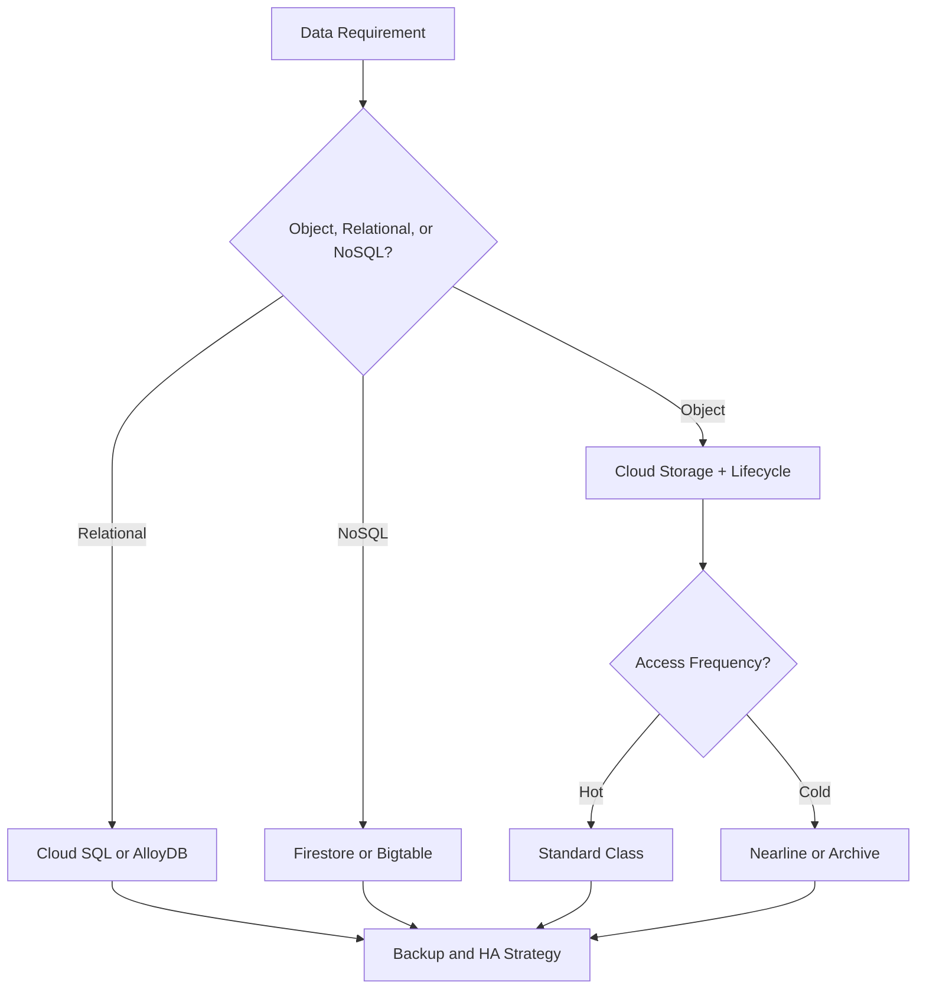
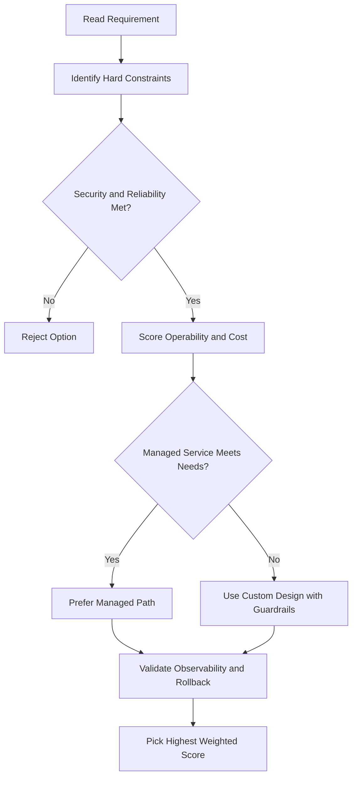
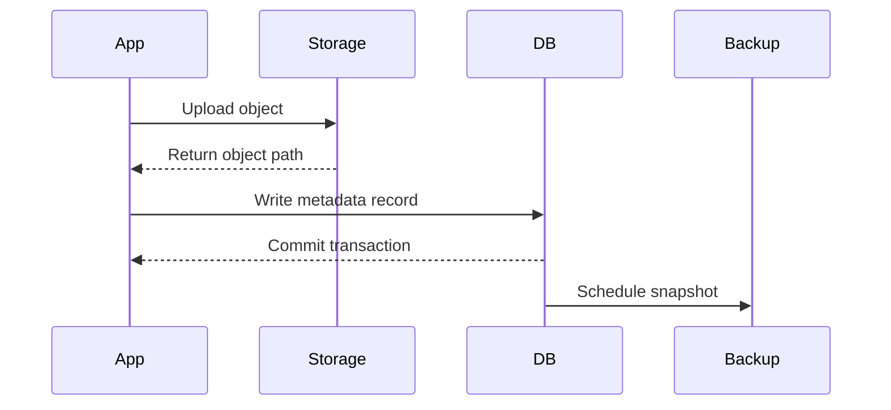

# 📦 Lab: Creating Storage Buckets and Cloud Shell Persistence

## Lab Overview

This lab walks through creating Cloud Storage buckets using both the Console and Cloud Shell, uploading files, and setting up persistent configuration.

---

## Console vs Cloud Shell — They're Complementary

**Google Cloud Console:**

- Keeps track of your configuration context
- Uses APIs to determine what options are valid
- Great for repetitive, guided tasks
- Good for visual learners

**Cloud Shell:**

- Offers precise, detailed control
- Lets you script and automate activities
- Good for power users and automation
- Repeatable, scriptable workflows

**Bottom line:** Don't think of them as alternatives — think of them as **one flexible, powerful interface**. Use whichever makes sense for the task.

---

## Part 1: Creating a Bucket in the Console

1. Open the **Navigation menu** (three horizontal lines, top-left corner)
2. Scroll down to **Storage** → click **Browser**
3. Click **Create bucket**
4. Enter a **globally unique name** (tip: use your project ID to ensure uniqueness)
5. Leave default settings (or adjust storage class if needed)
6. Click **Create**

Your bucket now appears in the bucket list.

---

## Part 2: Creating a Bucket in Cloud Shell

1. Click **Activate Cloud Shell** button (top-right corner)
2. When prompted, start Cloud Shell
3. Use the `gsutil` command to create a bucket:

```bash
gsutil mb gs://YOUR-UNIQUE-BUCKET-NAME-shell
```

Replace `YOUR-UNIQUE-BUCKET-NAME` with a globally unique name.

**Tip:** You can append `-shell` to your project ID to make it unique.

If you go back to the Console, you'll see both buckets now exist.

---

## Part 3: Uploading and Copying Files

### Upload a File in Cloud Shell

1. Click the **three dots menu** in Cloud Shell
2. Select **Upload file**
3. Choose a file from your computer
4. Click **Open**

The file uploads to Cloud Shell's temporary storage.

### Copy File to Cloud Storage

Use `gsutil cp` to copy a file from Cloud Shell to your bucket:

```bash
gsutil cp MyFile.txt gs://YOUR-BUCKET-NAME/
```

You can verify the file arrived by navigating to the bucket in the Console.

---

## Part 4: Creating Persistent Configuration

Cloud Shell is temporary — it resets between sessions. But you can create configuration that persists.

### Set Environment Variables

List available regions:

```bash
gcloud compute regions list
```

Store a region in a variable:

```bash
REGION=us-central1
```

Verify it was stored:

```bash
echo $REGION
```

### Create a Configuration File

Create a folder:

```bash
mkdir infraclass
```

Create a config file and store variables in it:

```bash
echo "REGION=us-central1" >> infraclass/config
echo "PROJECT_ID=$(gcloud config get-value project)" >> infraclass/config
```

Verify it worked:

```bash
cat infraclass/config
```

---

## Part 5: Auto-load Configuration on Startup

Every time you open Cloud Shell, you have to manually load your config. To make it automatic:

1. Edit the `.profile` file (runs automatically when Cloud Shell starts):

```bash
nano ~/.profile
```

2. Add this line at the end:

```bash
source infraclass/config
```

3. Save and exit (Ctrl+O, Enter, Ctrl+X in nano)

4. Close and reopen Cloud Shell

5. Verify your variables are loaded:

```bash
echo $PROJECT_ID
```

Now your configuration loads automatically every time!

---

## Key Commands Reference

| Command                       | What it does               |
| ----------------------------- | -------------------------- |
| `gsutil mb gs://BUCKET-NAME`  | Make (create) a bucket     |
| `gsutil cp FILE gs://BUCKET/` | Copy file to bucket        |
| `gcloud compute regions list` | List available regions     |
| `echo $VARIABLE`              | Display a variable's value |
| `mkdir FOLDER`                | Create a directory         |
| `cat FILE`                    | View file contents         |
| `nano FILE`                   | Edit a file                |

---

## Key Takeaway

- Use the **Console** for learning and visual tasks
- Use **Cloud Shell** for automation and scripting
- Store configuration in files so it persists
- Edit `.profile` to auto-load config on startup
- You can combine both approaches for maximum flexibility

## ACE Exam-Style Practice Questions

### Q1
In a Cloud Storage Bucket Lab scenario, files are used continually by an analytics pipeline in one region. Which storage class is best for minimal cost and performance fit?

A. Standard in closest region
B. Nearline in closest region
C. Archive in dual-region
D. Coldline in dual-region

Answer: A
Trap: Continual access generally means Standard, while colder classes penalize frequent retrieval.

### Q2
Backup files older than 90 days must be removed automatically in a Cloud Storage Bucket Lab bucket. What should you do?

A. Manual deletion script only
B. Lifecycle rule in JSON with Delete action and Age condition 90
C. Rename old files to another prefix only
D. Disable object versioning

Answer: B
Trap: Lifecycle rules are the managed and auditable approach for retention cleanup.

<!-- ACE_DEEP_ENRICHMENT_START -->
## ACE Deep Enrichment

### Think Like a Google Engineer
- Primary optimization axis: Durability and access-pattern fit at the lowest lifecycle cost.
- Start with constraints first: SLO, security, compliance, latency, budget, and team operations capacity.
- Prefer managed services if they satisfy requirements with lower long-term operational toil.
- Minimize blast radius using environment isolation, least privilege, and failure-domain awareness.
- Design for day-2 operations: observability, rollback strategy, and quota or budget guardrails.

### Most Correct Option Filter (60 Seconds)
1. Eliminate options with broad access, single points of failure, or missing monitoring.
2. Confirm the option meets non-negotiables first: security and reliability requirements.
3. Compare remaining options on operational simplicity and long-term maintainability.
4. Use cost as an optimizer only after requirements and risk controls are satisfied.

### Weighted Decision Matrix
| Dimension | Weight | Strong Signal |
| --- | --- | --- |
| Security | 3 | Least privilege, secure defaults, no exposed blast radius |
| Reliability | 3 | Multi-zone or HA design, health checks, tested recovery path |
| Operability | 2 | Clear monitoring, alerting, rollout and rollback simplicity |
| Cost Efficiency | 2 | Right-sized resources, no waste, no reliability regression |
| Performance | 1 | Meets latency and throughput targets with headroom |

### Real-Life Scenario
A healthcare SaaS stores user documents, transactional data, and low-latency session state. They must balance cost, durability, and performance under compliance constraints.

### Worked Example
- Map each data type to the right storage service by access pattern and consistency needs.
- Use lifecycle policies for object storage to control long-term cost.
- Select database engines based on query shape, scale, and relational requirements.
- Back up critical datasets and validate restore runbooks regularly.

### Flowchart


### Optimization Decision Flow


### Interaction Sequence


### Extra Exam Practice (10 Questions)
#### Q1
Scenario Focus: 📦 Lab: Creating Storage Buckets and Cloud Shell Persistence
Your logs are rarely accessed after 90 days. What storage policy is best?

A. Use lifecycle rules to transition objects to colder storage classes after 90 days.
B. Keep everything in the most expensive hot class forever.
C. Use local disk snapshots as the only backup strategy.
D. Pick a database only by familiarity and ignore access patterns.

Answer: A
Why the other options are weaker: They typically ignore at least one hard constraint such as security, reliability, cost efficiency, or operational simplicity.
Google-engineer check: Reconfirm SLO fit, blast radius, and day-2 maintainability before finalizing.

#### Q2
Scenario Focus: 📦 Lab: Creating Storage Buckets and Cloud Shell Persistence
A workload requires relational transactions and managed operations. Which database is best?

A. Use local disk snapshots as the only backup strategy.
B. Use Cloud SQL or AlloyDB for managed relational workloads with transaction support.
C. Pick a database only by familiarity and ignore access patterns.
D. Store transactional records only in object storage.

Answer: B
Why the other options are weaker: They typically ignore at least one hard constraint such as security, reliability, cost efficiency, or operational simplicity.
Google-engineer check: Reconfirm SLO fit, blast radius, and day-2 maintainability before finalizing.

#### Q3
Scenario Focus: 📦 Lab: Creating Storage Buckets and Cloud Shell Persistence
Which practice improves durability and recovery posture most?

A. Pick a database only by familiarity and ignore access patterns.
B. Store transactional records only in object storage.
C. Enable backups with tested restore procedures and clear recovery objectives.
D. Skip restore drills because backups are assumed valid.

Answer: C
Why the other options are weaker: They typically ignore at least one hard constraint such as security, reliability, cost efficiency, or operational simplicity.
Google-engineer check: Reconfirm SLO fit, blast radius, and day-2 maintainability before finalizing.

#### Q4
Scenario Focus: 📦 Lab: Creating Storage Buckets and Cloud Shell Persistence
A key-value workload needs very high scale and low latency. Which service fits?

A. Store transactional records only in object storage.
B. Skip restore drills because backups are assumed valid.
C. Keep everything in the most expensive hot class forever.
D. Use Bigtable for high-throughput low-latency wide-column workloads.

Answer: D
Why the other options are weaker: They typically ignore at least one hard constraint such as security, reliability, cost efficiency, or operational simplicity.
Google-engineer check: Reconfirm SLO fit, blast radius, and day-2 maintainability before finalizing.

#### Q5
Scenario Focus: 📦 Lab: Creating Storage Buckets and Cloud Shell Persistence
How should you choose a storage class on the exam?

A. Choose based on access frequency, retention period, and retrieval latency requirements.
B. Skip restore drills because backups are assumed valid.
C. Keep everything in the most expensive hot class forever.
D. Use local disk snapshots as the only backup strategy.

Answer: A
Why the other options are weaker: They typically ignore at least one hard constraint such as security, reliability, cost efficiency, or operational simplicity.
Google-engineer check: Reconfirm SLO fit, blast radius, and day-2 maintainability before finalizing.

#### Q6
Scenario Focus: 📦 Lab: Creating Storage Buckets and Cloud Shell Persistence
Two designs both satisfy the happy path for 📦 Lab: Creating Storage Buckets and Cloud Shell Persistence. Which choice is most correct?

A. Keep everything in the most expensive hot class forever.
B. Choose the option that preserves reliability and security while reducing operational burden.
C. Use local disk snapshots as the only backup strategy.
D. Pick a database only by familiarity and ignore access patterns.

Answer: B
Why the other options are weaker: They typically ignore at least one hard constraint such as security, reliability, cost efficiency, or operational simplicity.
Google-engineer check: Reconfirm SLO fit, blast radius, and day-2 maintainability before finalizing.

#### Q7
Scenario Focus: 📦 Lab: Creating Storage Buckets and Cloud Shell Persistence
What should you validate first before choosing an architecture for 📦 Lab: Creating Storage Buckets and Cloud Shell Persistence?

A. Use local disk snapshots as the only backup strategy.
B. Pick a database only by familiarity and ignore access patterns.
C. Validate SLO fit, blast radius, and least-privilege controls before comparing convenience.
D. Store transactional records only in object storage.

Answer: C
Why the other options are weaker: They typically ignore at least one hard constraint such as security, reliability, cost efficiency, or operational simplicity.
Google-engineer check: Reconfirm SLO fit, blast radius, and day-2 maintainability before finalizing.

#### Q8
Scenario Focus: 📦 Lab: Creating Storage Buckets and Cloud Shell Persistence
A proposal lowers cost but increases failure risk. What is the best decision?

A. Pick a database only by familiarity and ignore access patterns.
B. Store transactional records only in object storage.
C. Skip restore drills because backups are assumed valid.
D. Reject it unless reliability and recovery objectives remain within required targets.

Answer: D
Why the other options are weaker: They typically ignore at least one hard constraint such as security, reliability, cost efficiency, or operational simplicity.
Google-engineer check: Reconfirm SLO fit, blast radius, and day-2 maintainability before finalizing.

#### Q9
Scenario Focus: 📦 Lab: Creating Storage Buckets and Cloud Shell Persistence
Which option best reflects optimization for Durability and access-pattern fit at the lowest lifecycle cost?

A. Select the design that best meets Durability and access-pattern fit at the lowest lifecycle cost while keeping constraints balanced.
B. Store transactional records only in object storage.
C. Skip restore drills because backups are assumed valid.
D. Keep everything in the most expensive hot class forever.

Answer: A
Why the other options are weaker: They typically ignore at least one hard constraint such as security, reliability, cost efficiency, or operational simplicity.
Google-engineer check: Reconfirm SLO fit, blast radius, and day-2 maintainability before finalizing.

#### Q10
Scenario Focus: 📦 Lab: Creating Storage Buckets and Cloud Shell Persistence
How should you evaluate a design that needs frequent manual interventions?

A. Skip restore drills because backups are assumed valid.
B. Treat it as high risk and prefer automation-friendly designs with observability and rollback.
C. Keep everything in the most expensive hot class forever.
D. Use local disk snapshots as the only backup strategy.

Answer: B
Why the other options are weaker: They typically ignore at least one hard constraint such as security, reliability, cost efficiency, or operational simplicity.
Google-engineer check: Reconfirm SLO fit, blast radius, and day-2 maintainability before finalizing.

### Quick Commands
```bash
gcloud storage ls --project=PROJECT_ID
gcloud sql instances list --project=PROJECT_ID
gcloud firestore databases list --project=PROJECT_ID
gcloud bigtable instances list --project=PROJECT_ID
```

### Fast Recall
- Data service choice is a pattern-matching question.
- Lifecycle rules are a common cost optimization lever.
- Backup without restore validation is not a complete strategy.
<!-- ACE_DEEP_ENRICHMENT_END -->