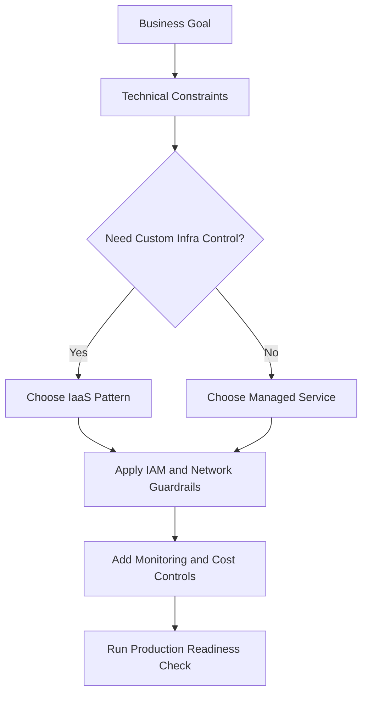
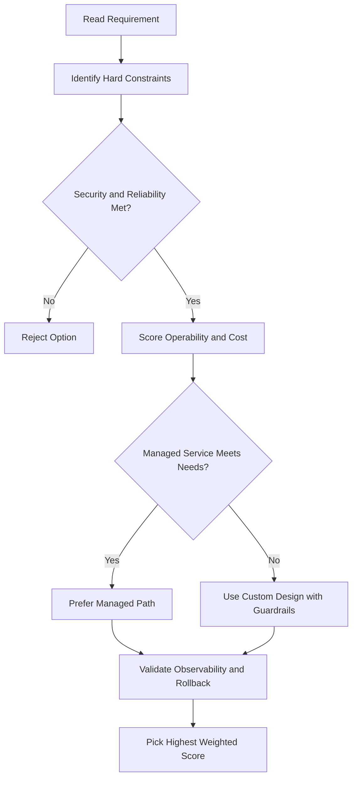
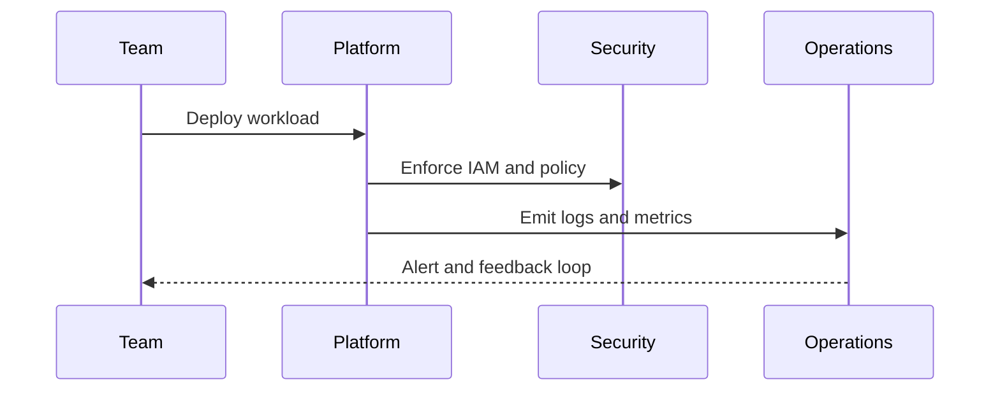

# 🔁 Lab: Launching Jenkins from Google Cloud Marketplace

## Lab Overview

In this lab, you launched a full **continuous integration (CI)** solution in just a few minutes using **Google Cloud Marketplace**.

You also proved that:

- You could access **Jenkins through its web UI**
- You had **admin-level control** by connecting to the VM over SSH
- You could **stop and restart** the Jenkins service manually

This lab also quietly used several Google Cloud concepts that the course covers later, such as:

- Creating and assigning a network IP address
- Provisioning a virtual machine
- Installing software automatically on that VM
- Passing setup information during deployment

---

## Why Marketplace is Useful

Google Cloud Marketplace lets you deploy complex software quickly without manually doing all the setup yourself.

Instead of manually:

- Creating a VM
- Installing Jenkins
- Opening firewall ports
- Configuring software dependencies

You pick a ready-made solution and Google Cloud handles most of the setup for you.

---

## Part 1: Find Jenkins in Marketplace

1. Open the **Navigation menu** in the Google Cloud Console
2. Click **Marketplace**
3. Search for **Jenkins Certified by Bitnami**
4. Open the listing

Before deploying, you can review:

- What software is included
- Which operating system it uses
- Pricing details
- Whether there are extra usage fees

In this example, the main cost comes from the VM itself.

---

## Part 2: Launch Jenkins on Compute Engine

1. Click **Launch on Compute Engine**
2. Review or change deployment settings such as:

- Deployment name
- Zone
- Machine type
- Other VM-related settings

3. Accept the **Terms of Service**
4. Click **Deploy**

At this point, Google Cloud starts building the environment for you.

---

## Part 3: What Google Cloud Builds Behind the Scenes

Once deployment starts, you move into the deployment view.

Here you can see that Google Cloud is creating:

- A **VM instance**
- **Firewall rules** for ports **80** and **443**
- Software configuration steps
- Deployment configuration files

This is useful because it shows that Marketplace is not "magic". It is automating the same underlying infrastructure tasks you could do manually.

---

## Part 4: Wait for Jenkins to Finish Starting

Even after the VM is running, Jenkins itself may still need a little time to finish starting.

Once ready, the deployment page shows useful details such as:

- Admin username
- Temporary password
- A **Visit the site** link

Clicking **Visit the site** opens Jenkins using the VM's external IP address.

At first, Jenkins may still show that it is starting. That is normal.

---

## Part 5: Log In to Jenkins

1. Copy the provided **admin username** and **temporary password**
2. Open the Jenkins page
3. Sign in
4. Follow the setup wizard
5. Install the suggested plugins
6. Finish the initial setup

After that, Jenkins is ready to use.

---

## Part 6: Recommended Next Steps After Deployment

Marketplace also suggests some follow-up improvements.

Examples:

- Change the **temporary password**
- Assign a **static external IP address**

Why use a static IP?
Because if the external IP changes later, your Jenkins URL changes too. A static IP helps if you want stable access or want to attach DNS to it.

---

## Part 7: Administer Jenkins Through SSH

You can also manage Jenkins directly from the VM.

1. Go back to the deployment or VM page in the Console
2. Click **SSH** for the Jenkins VM
3. This opens a terminal session into the machine

From there, you can run commands from the lab to manage the Jenkins service.

This proves that even though Marketplace automates the setup, you still have low-level access when needed.

---

## Part 8: Stop and Restart Jenkins

In the lab, you stopped the Jenkins services from the SSH session.

After stopping them:

- Refreshing the Jenkins page shows that the service is down

Then you restarted the service from the terminal.

After a few refreshes:

- Jenkins comes back online
- The UI becomes available again

This confirms that you have real administrative control over the software running on the VM.

---

## What This Lab Really Demonstrates

This lab is not just about Jenkins.
It demonstrates how Google Cloud can quickly provision and configure a working solution using multiple services together.

You used:

- **Marketplace** to deploy the solution
- **Compute Engine** to host Jenkins
- **Firewall rules** to allow web traffic
- **External IP addressing** to reach the service
- **SSH** for administration

---

## Key Takeaway

Google Cloud Marketplace helps you launch complete solutions very quickly, but you still keep administrative control.

In this lab, you:

- Deployed Jenkins in minutes
- Logged into the Jenkins UI
- Used SSH to manage the VM
- Stopped and restarted the Jenkins service
- Saw how Google Cloud automates infrastructure setup behind the scenes

---

## gcloud Commands

```bash
# List Deployment Manager deployments
gcloud deployment-manager deployments list

# Describe a deployment
gcloud deployment-manager deployments describe DEPLOYMENT_NAME

# SSH into the Marketplace-deployed VM
gcloud compute ssh INSTANCE_NAME --zone=ZONE
```

## ACE Exam-Style Practice Questions

### Q1
For Jenkins Marketplace Lab, the company wants repeatable multi-environment provisioning with minimal repetitive code. What should you use?

A. IaC templates and modules
B. Manual console steps each time
C. Ad-hoc scripts without version control
D. Spreadsheet-only process

Answer: A
Trap: Declarative IaC improves consistency, auditability, and reuse.

### Q2
In a Jenkins Marketplace Lab scenario, you must deploy supported third-party software quickly with managed packaging. Which option is best?

A. Google Cloud Marketplace solution deployment
B. Build everything from source on one VM manually
C. Use Cloud Trace to install software
D. Export billing CSV first

Answer: A
Trap: Marketplace is designed for rapid deployment of curated solutions.

<!-- ACE_DEEP_ENRICHMENT_START -->
## ACE Deep Enrichment

### Think Like a Google Engineer
- Primary optimization axis: Managed-service-first design with reliability and security by default.
- Start with constraints first: SLO, security, compliance, latency, budget, and team operations capacity.
- Prefer managed services if they satisfy requirements with lower long-term operational toil.
- Minimize blast radius using environment isolation, least privilege, and failure-domain awareness.
- Design for day-2 operations: observability, rollback strategy, and quota or budget guardrails.

### Most Correct Option Filter (60 Seconds)
1. Eliminate options with broad access, single points of failure, or missing monitoring.
2. Confirm the option meets non-negotiables first: security and reliability requirements.
3. Compare remaining options on operational simplicity and long-term maintainability.
4. Use cost as an optimizer only after requirements and risk controls are satisfied.

### Weighted Decision Matrix
| Dimension | Weight | Strong Signal |
| --- | --- | --- |
| Security | 3 | Least privilege, secure defaults, no exposed blast radius |
| Reliability | 3 | Multi-zone or HA design, health checks, tested recovery path |
| Operability | 2 | Clear monitoring, alerting, rollout and rollback simplicity |
| Cost Efficiency | 2 | Right-sized resources, no waste, no reliability regression |
| Performance | 1 | Meets latency and throughput targets with headroom |

### Real-Life Scenario
A growing startup is moving from manual infrastructure to Google Cloud. They need fast delivery, better reliability, and clear operational controls while keeping architecture simple.

### Worked Example
- Translate business goals into technical constraints before selecting services.
- Favor managed services to reduce operational burden where possible.
- Apply least-privilege IAM and private-by-default networking decisions.
- Add monitoring, logging, and budget controls from the start.

### Flowchart


### Optimization Decision Flow


### Interaction Sequence


### Extra Exam Practice (10 Questions)
#### Q1
Scenario Focus: 🔁 Lab: Launching Jenkins from Google Cloud Marketplace
Which design pattern is usually best for fast, safe cloud adoption?

A. Use managed services with least-privilege IAM and clear observability controls.
B. Start with manual scripts and unrestricted access, then harden later.
C. Use one project for everything to reduce setup effort.
D. Ignore telemetry until after first production incident.

Answer: A
Why the other options are weaker: They typically ignore at least one hard constraint such as security, reliability, cost efficiency, or operational simplicity.
Google-engineer check: Reconfirm SLO fit, blast radius, and day-2 maintainability before finalizing.

#### Q2
Scenario Focus: 🔁 Lab: Launching Jenkins from Google Cloud Marketplace
A team wants speed and low ops overhead. What should they prioritize?

A. Use one project for everything to reduce setup effort.
B. Prefer services that reduce operational toil while meeting reliability goals.
C. Ignore telemetry until after first production incident.
D. Pick only the cheapest service regardless of reliability needs.

Answer: B
Why the other options are weaker: They typically ignore at least one hard constraint such as security, reliability, cost efficiency, or operational simplicity.
Google-engineer check: Reconfirm SLO fit, blast radius, and day-2 maintainability before finalizing.

#### Q3
Scenario Focus: 🔁 Lab: Launching Jenkins from Google Cloud Marketplace
What is a common architecture trap in early cloud projects?

A. Ignore telemetry until after first production incident.
B. Pick only the cheapest service regardless of reliability needs.
C. Over-broad access and missing monitoring are high-risk trap patterns.
D. Keep architecture opaque to avoid governance overhead.

Answer: C
Why the other options are weaker: They typically ignore at least one hard constraint such as security, reliability, cost efficiency, or operational simplicity.
Google-engineer check: Reconfirm SLO fit, blast radius, and day-2 maintainability before finalizing.

#### Q4
Scenario Focus: 🔁 Lab: Launching Jenkins from Google Cloud Marketplace
Which control set should be baseline for production?

A. Pick only the cheapest service regardless of reliability needs.
B. Keep architecture opaque to avoid governance overhead.
C. Start with manual scripts and unrestricted access, then harden later.
D. Baseline should include IAM guardrails, logging, monitoring, and cost alerts.

Answer: D
Why the other options are weaker: They typically ignore at least one hard constraint such as security, reliability, cost efficiency, or operational simplicity.
Google-engineer check: Reconfirm SLO fit, blast radius, and day-2 maintainability before finalizing.

#### Q5
Scenario Focus: 🔁 Lab: Launching Jenkins from Google Cloud Marketplace
How should you evaluate conflicting requirements on the exam?

A. Choose the option that balances security, reliability, cost, and operability.
B. Keep architecture opaque to avoid governance overhead.
C. Start with manual scripts and unrestricted access, then harden later.
D. Use one project for everything to reduce setup effort.

Answer: A
Why the other options are weaker: They typically ignore at least one hard constraint such as security, reliability, cost efficiency, or operational simplicity.
Google-engineer check: Reconfirm SLO fit, blast radius, and day-2 maintainability before finalizing.

#### Q6
Scenario Focus: 🔁 Lab: Launching Jenkins from Google Cloud Marketplace
Two designs both satisfy the happy path for 🔁 Lab: Launching Jenkins from Google Cloud Marketplace. Which choice is most correct?

A. Start with manual scripts and unrestricted access, then harden later.
B. Choose the option that preserves reliability and security while reducing operational burden.
C. Use one project for everything to reduce setup effort.
D. Ignore telemetry until after first production incident.

Answer: B
Why the other options are weaker: They typically ignore at least one hard constraint such as security, reliability, cost efficiency, or operational simplicity.
Google-engineer check: Reconfirm SLO fit, blast radius, and day-2 maintainability before finalizing.

#### Q7
Scenario Focus: 🔁 Lab: Launching Jenkins from Google Cloud Marketplace
What should you validate first before choosing an architecture for 🔁 Lab: Launching Jenkins from Google Cloud Marketplace?

A. Use one project for everything to reduce setup effort.
B. Ignore telemetry until after first production incident.
C. Validate SLO fit, blast radius, and least-privilege controls before comparing convenience.
D. Pick only the cheapest service regardless of reliability needs.

Answer: C
Why the other options are weaker: They typically ignore at least one hard constraint such as security, reliability, cost efficiency, or operational simplicity.
Google-engineer check: Reconfirm SLO fit, blast radius, and day-2 maintainability before finalizing.

#### Q8
Scenario Focus: 🔁 Lab: Launching Jenkins from Google Cloud Marketplace
A proposal lowers cost but increases failure risk. What is the best decision?

A. Ignore telemetry until after first production incident.
B. Pick only the cheapest service regardless of reliability needs.
C. Keep architecture opaque to avoid governance overhead.
D. Reject it unless reliability and recovery objectives remain within required targets.

Answer: D
Why the other options are weaker: They typically ignore at least one hard constraint such as security, reliability, cost efficiency, or operational simplicity.
Google-engineer check: Reconfirm SLO fit, blast radius, and day-2 maintainability before finalizing.

#### Q9
Scenario Focus: 🔁 Lab: Launching Jenkins from Google Cloud Marketplace
Which option best reflects optimization for Managed-service-first design with reliability and security by default?

A. Select the design that best meets Managed-service-first design with reliability and security by default while keeping constraints balanced.
B. Pick only the cheapest service regardless of reliability needs.
C. Keep architecture opaque to avoid governance overhead.
D. Start with manual scripts and unrestricted access, then harden later.

Answer: A
Why the other options are weaker: They typically ignore at least one hard constraint such as security, reliability, cost efficiency, or operational simplicity.
Google-engineer check: Reconfirm SLO fit, blast radius, and day-2 maintainability before finalizing.

#### Q10
Scenario Focus: 🔁 Lab: Launching Jenkins from Google Cloud Marketplace
How should you evaluate a design that needs frequent manual interventions?

A. Keep architecture opaque to avoid governance overhead.
B. Treat it as high risk and prefer automation-friendly designs with observability and rollback.
C. Start with manual scripts and unrestricted access, then harden later.
D. Use one project for everything to reduce setup effort.

Answer: B
Why the other options are weaker: They typically ignore at least one hard constraint such as security, reliability, cost efficiency, or operational simplicity.
Google-engineer check: Reconfirm SLO fit, blast radius, and day-2 maintainability before finalizing.

### Quick Commands
```bash
gcloud config list
gcloud projects describe PROJECT_ID
gcloud services list --enabled --project=PROJECT_ID
gcloud logging read "severity>=WARNING" --project=PROJECT_ID --freshness=2d --limit=20
```

### Fast Recall
- Good cloud design is constraint-driven, not tool-driven.
- Managed services usually improve delivery speed and reliability.
- Security and observability should be built in from day one.
<!-- ACE_DEEP_ENRICHMENT_END -->