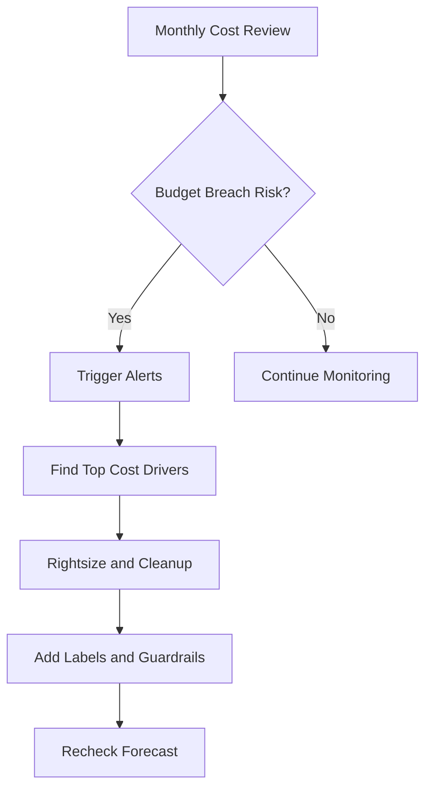
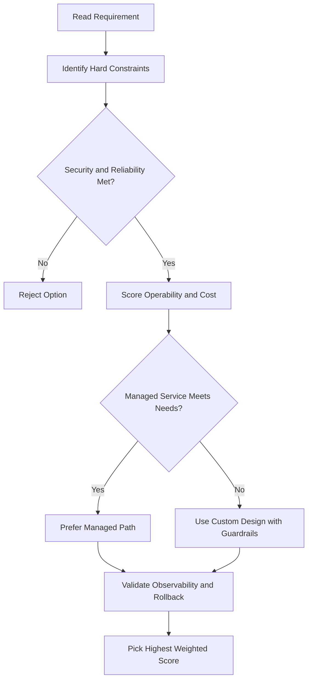
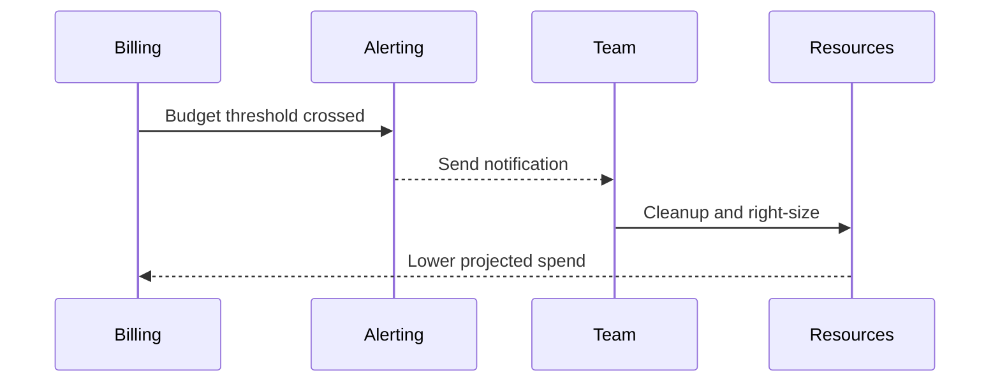

# 📁 Projects in Google Cloud

## Why Projects Matter

In Google Cloud, **projects are the main way resources are organized**.

A project acts like a container for:

- Virtual machines
- Networks
- Storage buckets
- Databases
- Permissions
- Billing usage

**Important rule:** resources can only be created and used inside a project.

This is how Google Cloud keeps related resources grouped together and isolated from other work.

---

## Projects and Billing

Projects are also how Google Cloud connects resource usage to a **billing account**.

That means:

- Your resources live inside a project
- The costs for those resources are tracked through that project
- The project is linked to a billing account

So projects are not just folders. They are the basic unit for:

- Organization
- Access control
- Quotas
- Billing

---

## Creating a Project in the Console

To create a project in the Google Cloud Console:

1. Click the **project selector** at the top of the Console
2. Click **New Project**
3. Enter a **project name**
4. Google Cloud automatically creates a **project ID**
5. Click **Create**

### Project Name vs Project ID

- **Project name**: human-friendly, not necessarily unique
- **Project ID**: unique across Google Cloud

So you might name a project:

- `My New Project`

But Google Cloud creates a unique project ID behind it.

---

## Watching Project Creation

After you create a project, the Console shows progress in the **notification pane**.

One thing to remember:

- A newly created project may not have every service ready immediately
- Some services can take a little time to become available

---

## Switching Between Projects in the Console

You can switch project context from the top of the Console.

Once you select a different project:

- The Console changes focus to that project
- Any resources you view or create will belong to that project

This is important because Google Cloud actions always happen **in the currently selected project**.

---

## Deleting a Project (Shutdown)

In the Console, deleting a project is usually shown as **shutting it down**.

When you shut down a project:

- Resource activity stops
- Billing for active usage stops over time
- The project is scheduled for deletion
- Google gives you a **30-day recovery window** in case you change your mind

To shut down a project, Google Cloud asks you to type the **project ID** as confirmation.

This helps prevent accidental deletion.

---

## Projects in Cloud Shell

You can also view and change your current project from **Cloud Shell** using the `gcloud` command.

### Check current configuration

```bash
gcloud config list
```

This shows your active configuration, including the currently selected project.

### Show just the project

```bash
gcloud config list | grep project
```

This is a quick way to see which project Cloud Shell is currently using.

---

## Console Project vs Cloud Shell Project

A useful thing to know:

- Changing the active project in the **Console** does not always automatically change Cloud Shell's current project
- Cloud Shell uses its own `gcloud` configuration

So it is possible for:

- The Console to be focused on one project
- Cloud Shell to still be focused on another project

Always check before running commands.

---

## Changing Projects in Cloud Shell

To switch Cloud Shell to another project:

```bash
gcloud config set project PROJECT_ID
```

Example:

```bash
gcloud config set project my-second-project-123
```

After that, verify the change:

```bash
gcloud config list | grep project
```

---

## Using Environment Variables for Easy Switching

You can store project IDs in variables to switch between them more easily.

Example:

```bash
PROJECT_ID1=my-first-project-123
PROJECT_ID2=my-second-project-456
```

Then switch using:

```bash
gcloud config set project $PROJECT_ID1
```

or:

```bash
gcloud config set project $PROJECT_ID2
```

This is useful when you move back and forth between multiple projects.

---

## What This Demo Shows

This walkthrough demonstrates that you can:

- Create projects
- Delete (shut down) projects
- Switch between projects in the Console
- Switch between projects in Cloud Shell
- Confirm which project your commands are targeting

---

## Key Takeaway

Projects are the **core organizer** in Google Cloud.

They control:

- Where resources live
- How resources are isolated
- Which billing account pays for usage
- What context your Console and Cloud Shell commands operate in

If you understand projects, you understand the foundation of how Google Cloud stays organized.

## ACE Exam-Style Practice Questions

### Q1

You need a separate environment with isolated IAM, API enablement, quotas, and billing for a new team. What should you do first?

A. Add the team as Editor on an existing project
B. Create a new project and link it to the correct billing account
C. Create only a folder and keep one shared project
D. Use one service account for every team

Answer: B
Trap: The project is the core isolation boundary for billing, IAM, APIs, and quotas.

### Q2

You want automatic notifications at 50%, 90%, and 100% spend and also want to prevent runaway usage in sandbox projects. What is best?

A. Budgets only
B. Quotas only
C. Budget alerts plus quotas
D. Billing export only

Answer: C
Trap: Budgets provide alerts, while quotas enforce hard usage limits.

<!-- ACE_DEEP_ENRICHMENT_START -->
## ACE Deep Enrichment

### Think Like a Google Engineer
- Primary optimization axis: Predictable spend guardrails without reliability regression.
- Start with constraints first: SLO, security, compliance, latency, budget, and team operations capacity.
- Prefer managed services if they satisfy requirements with lower long-term operational toil.
- Minimize blast radius using environment isolation, least privilege, and failure-domain awareness.
- Design for day-2 operations: observability, rollback strategy, and quota or budget guardrails.

### Most Correct Option Filter (60 Seconds)
1. Eliminate options with broad access, single points of failure, or missing monitoring.
2. Confirm the option meets non-negotiables first: security and reliability requirements.
3. Compare remaining options on operational simplicity and long-term maintainability.
4. Use cost as an optimizer only after requirements and risk controls are satisfied.

### Weighted Decision Matrix
| Dimension | Weight | Strong Signal |
| --- | --- | --- |
| Security | 3 | Least privilege, secure defaults, no exposed blast radius |
| Reliability | 3 | Multi-zone or HA design, health checks, tested recovery path |
| Operability | 2 | Clear monitoring, alerting, rollout and rollback simplicity |
| Cost Efficiency | 2 | Right-sized resources, no waste, no reliability regression |
| Performance | 1 | Meets latency and throughput targets with headroom |

### Real-Life Scenario
A scale-up exceeded budget for two months due to idle resources and untracked growth. Leadership needs predictable spend without breaking product velocity.

### Worked Example
- Set budgets and alerts at billing account and project levels.
- Use labels for environment, team, and cost center to attribute spend.
- Right-size compute and remove idle disks, snapshots, and static IPs.
- Export billing data for trend analysis and anomaly detection.

### Flowchart


### Optimization Decision Flow


### Interaction Sequence


### Extra Exam Practice (15 Questions)
#### Q1

Scenario Focus: 📁 Projects in Google Cloud

A project is constantly over budget. What is the highest-impact first step?

A. Create budgets with alerts and investigate top cost drivers immediately.  
B. Wait until the invoice arrives, then react next month.  
C. Disable all monitoring because it has a minor cost.  
D. Give every team unrestricted quotas for speed.

Answer: A  
Why the other options are weaker: They typically ignore at least one hard constraint such as security, reliability, cost efficiency, or operational simplicity.  
Google-engineer check: Reconfirm SLO fit, blast radius, and day-2 maintainability before finalizing.

#### Q2

Scenario Focus: 📁 Projects in Google Cloud

Which resource tagging strategy improves chargeback visibility?

A. Disable all monitoring because it has a minor cost.  
B. Apply consistent labels for owner, environment, and cost center.  
C. Give every team unrestricted quotas for speed.  
D. Keep orphaned resources as backups without tracking.

Answer: B  
Why the other options are weaker: They typically ignore at least one hard constraint such as security, reliability, cost efficiency, or operational simplicity.  
Google-engineer check: Reconfirm SLO fit, blast radius, and day-2 maintainability before finalizing.

#### Q3

Scenario Focus: 📁 Projects in Google Cloud

How should you control runaway spend in exam scenarios?

A. Give every team unrestricted quotas for speed.  
B. Keep orphaned resources as backups without tracking.  
C. Use quotas, budgets, and alerting guardrails before incidents happen.  
D. Use one shared project for all environments and teams.

Answer: C  
Why the other options are weaker: They typically ignore at least one hard constraint such as security, reliability, cost efficiency, or operational simplicity.  
Google-engineer check: Reconfirm SLO fit, blast radius, and day-2 maintainability before finalizing.

#### Q4

Scenario Focus: 📁 Projects in Google Cloud

What is the best way to identify long-term cost trends?

A. Keep orphaned resources as backups without tracking.  
B. Use one shared project for all environments and teams.  
C. Wait until the invoice arrives, then react next month.  
D. Export billing data and analyze trends with dashboards and anomaly checks.

Answer: D  
Why the other options are weaker: They typically ignore at least one hard constraint such as security, reliability, cost efficiency, or operational simplicity.  
Google-engineer check: Reconfirm SLO fit, blast radius, and day-2 maintainability before finalizing.

#### Q5

Scenario Focus: 📁 Projects in Google Cloud

Which decision reduces waste while preserving reliability?

A. Right-size resources using utilization metrics and remove idle assets.  
B. Use one shared project for all environments and teams.  
C. Wait until the invoice arrives, then react next month.  
D. Disable all monitoring because it has a minor cost.

Answer: A  
Why the other options are weaker: They typically ignore at least one hard constraint such as security, reliability, cost efficiency, or operational simplicity.  
Google-engineer check: Reconfirm SLO fit, blast radius, and day-2 maintainability before finalizing.

#### Q6

Scenario Focus: 📁 Projects in Google Cloud

Two designs both satisfy the happy path for 📁 Projects in Google Cloud. Which choice is most correct?

A. Wait until the invoice arrives, then react next month.  
B. Choose the option that preserves reliability and security while reducing operational burden.  
C. Disable all monitoring because it has a minor cost.  
D. Give every team unrestricted quotas for speed.

Answer: B  
Why the other options are weaker: They typically ignore at least one hard constraint such as security, reliability, cost efficiency, or operational simplicity.  
Google-engineer check: Reconfirm SLO fit, blast radius, and day-2 maintainability before finalizing.

#### Q7

Scenario Focus: 📁 Projects in Google Cloud

What should you validate first before choosing an architecture for 📁 Projects in Google Cloud?

A. Disable all monitoring because it has a minor cost.  
B. Give every team unrestricted quotas for speed.  
C. Validate SLO fit, blast radius, and least-privilege controls before comparing convenience.  
D. Keep orphaned resources as backups without tracking.

Answer: C  
Why the other options are weaker: They typically ignore at least one hard constraint such as security, reliability, cost efficiency, or operational simplicity.  
Google-engineer check: Reconfirm SLO fit, blast radius, and day-2 maintainability before finalizing.

#### Q8

Scenario Focus: 📁 Projects in Google Cloud

A proposal lowers cost but increases failure risk. What is the best decision?

A. Give every team unrestricted quotas for speed.  
B. Keep orphaned resources as backups without tracking.  
C. Use one shared project for all environments and teams.  
D. Reject it unless reliability and recovery objectives remain within required targets.

Answer: D  
Why the other options are weaker: They typically ignore at least one hard constraint such as security, reliability, cost efficiency, or operational simplicity.  
Google-engineer check: Reconfirm SLO fit, blast radius, and day-2 maintainability before finalizing.

#### Q9

Scenario Focus: 📁 Projects in Google Cloud

Which option best reflects optimization for Predictable spend guardrails without reliability regression?

A. Select the design that best meets Predictable spend guardrails without reliability regression while keeping constraints balanced.  
B. Keep orphaned resources as backups without tracking.  
C. Use one shared project for all environments and teams.  
D. Wait until the invoice arrives, then react next month.

Answer: A  
Why the other options are weaker: They typically ignore at least one hard constraint such as security, reliability, cost efficiency, or operational simplicity.  
Google-engineer check: Reconfirm SLO fit, blast radius, and day-2 maintainability before finalizing.

#### Q10

Scenario Focus: 📁 Projects in Google Cloud

How should you evaluate a design that needs frequent manual interventions?

A. Use one shared project for all environments and teams.  
B. Treat it as high risk and prefer automation-friendly designs with observability and rollback.  
C. Wait until the invoice arrives, then react next month.  
D. Disable all monitoring because it has a minor cost.

Answer: B  
Why the other options are weaker: They typically ignore at least one hard constraint such as security, reliability, cost efficiency, or operational simplicity.  
Google-engineer check: Reconfirm SLO fit, blast radius, and day-2 maintainability before finalizing.

#### Q11

Scenario Focus: 📁 Projects in Google Cloud

Two options have similar latency. Which tie-breaker is best?

A. Wait until the invoice arrives, then react next month.  
B. Disable all monitoring because it has a minor cost.  
C. Pick the option with stronger operability, clearer failure isolation, and simpler incident response.  
D. Give every team unrestricted quotas for speed.

Answer: C  
Why the other options are weaker: They typically ignore at least one hard constraint such as security, reliability, cost efficiency, or operational simplicity.  
Google-engineer check: Reconfirm SLO fit, blast radius, and day-2 maintainability before finalizing.

#### Q12

Scenario Focus: 📁 Projects in Google Cloud

What is the best way to choose between a custom stack and a managed service?

A. Disable all monitoring because it has a minor cost.  
B. Give every team unrestricted quotas for speed.  
C. Keep orphaned resources as backups without tracking.  
D. Prefer managed services when they meet requirements with lower long-term maintenance effort.

Answer: D  
Why the other options are weaker: They typically ignore at least one hard constraint such as security, reliability, cost efficiency, or operational simplicity.  
Google-engineer check: Reconfirm SLO fit, blast radius, and day-2 maintainability before finalizing.

#### Q13

Scenario Focus: 📁 Projects in Google Cloud

How do you confirm a solution is production-ready for 

A. Verify monitoring, alerting, rollback path, quota and budget controls, and secure defaults.  
B. Give every team unrestricted quotas for speed.  
C. Keep orphaned resources as backups without tracking.  
D. Use one shared project for all environments and teams.

Answer: A  
Why the other options are weaker: They typically ignore at least one hard constraint such as security, reliability, cost efficiency, or operational simplicity.  
Google-engineer check: Reconfirm SLO fit, blast radius, and day-2 maintainability before finalizing.

#### Q14

Scenario Focus: 📁 Projects in Google Cloud

Which pattern usually wins in ACE scenario tie-breakers?

A. Keep orphaned resources as backups without tracking.  
B. Managed-service-first plus least-privilege access plus clear observability usually wins.  
C. Use one shared project for all environments and teams.  
D. Wait until the invoice arrives, then react next month.

Answer: B  
Why the other options are weaker: They typically ignore at least one hard constraint such as security, reliability, cost efficiency, or operational simplicity.  
Google-engineer check: Reconfirm SLO fit, blast radius, and day-2 maintainability before finalizing.

#### Q15

Scenario Focus: 📁 Projects in Google Cloud

What is the best final check before locking the answer?

A. Use one shared project for all environments and teams.  
B. Wait until the invoice arrives, then react next month.  
C. Run a weighted check across security, reliability, cost, performance, and operability.  
D. Disable all monitoring because it has a minor cost.

Answer: C  
Why the other options are weaker: They typically ignore at least one hard constraint such as security, reliability, cost efficiency, or operational simplicity.  
Google-engineer check: Reconfirm SLO fit, blast radius, and day-2 maintainability before finalizing.

### Quick Commands
```bash
gcloud beta billing budgets list --billing-account=BILLING_ACCOUNT_ID
gcloud compute instances list --project=PROJECT_ID
gcloud compute disks list --project=PROJECT_ID
gcloud resource-manager tags keys list --parent=projects/PROJECT_NUMBER
```

### Fast Recall
- Budgets and alerts are preventive controls, not reporting after the fact.
- Label discipline enables real cost accountability.
- Rightsizing requires metrics, not assumptions.
<!-- ACE_DEEP_ENRICHMENT_END -->