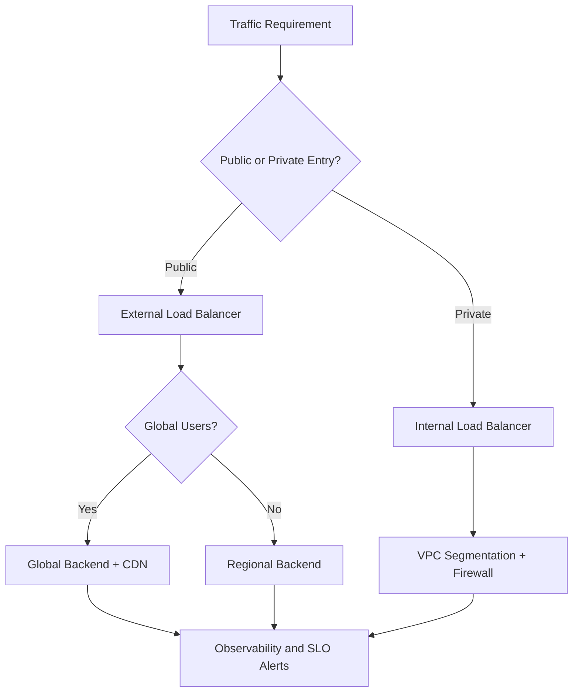
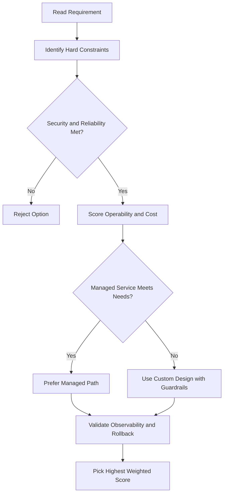
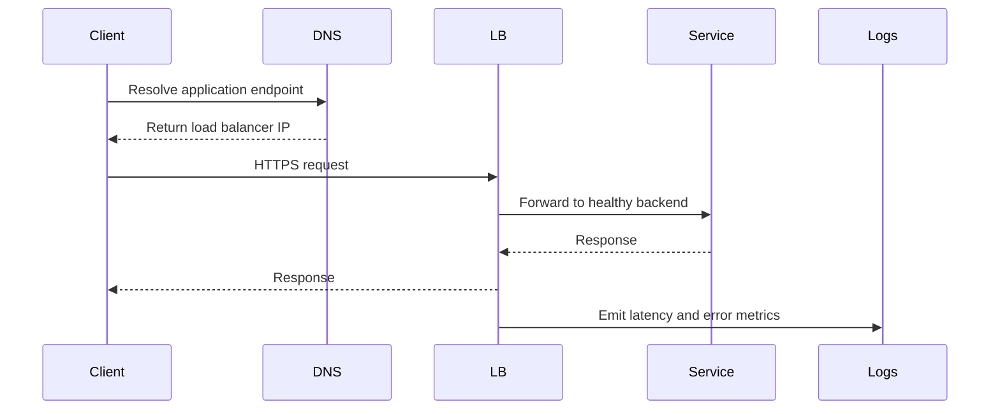

# 🌐 Virtual Networks in Google Cloud

## What This Module Covers

This module introduces **virtual networking** in Google Cloud.

Google Cloud networking is not built like a traditional hardware network. Instead, it uses a **software-defined network** running on Google's global fiber infrastructure.

That gives Google Cloud one of the largest and fastest networks in the world.

---

## Think in Services, Not Hardware

A useful mindset in Google Cloud is this:

**Think of resources as services, not as physical hardware.**

That makes it easier to understand:

- What networking options exist
- How they behave
- Why they are flexible and scalable

---

## What is VPC?

**VPC (Virtual Private Cloud)** is Google's managed networking service for your cloud resources.

It is the main way you connect resources like:

- Virtual machines
- Databases
- Load balancers
- Other cloud services

A VPC lets you define how your resources communicate with each other and with the outside world.

---

## Core Networking Building Blocks

This module breaks networking into the main parts you need to understand:

- **Projects** — the top-level container that owns resources
- **Networks** — the overall private network space
- **Subnetworks** — smaller regional parts of a network
- **IP addresses** — identities for resources on a network
- **Routes** — rules for where traffic goes
- **Firewall rules** — rules for what traffic is allowed or blocked
- **Network pricing** — how traffic and networking choices affect cost

These are the basic pieces of Google Cloud networking.

---

## Hands-On Network Lab

In the lab for this module, you will:

- Create different types of networks
- Explore how those networks relate to one another
- See how Google Cloud networking is structured in practice

This is important because networking concepts become much clearer once you build and inspect them yourself.

---

## Common Network Designs

After learning the building blocks, the module moves into **common network design patterns**.

That means you will not just learn what each piece does, but also how they are combined in real-world architectures.

---

## Google Cloud's Global Network Structure

At a high level, Google Cloud consists of:

- **Regions**
- **Points of Presence (PoPs)**
- **A global private network**
- **Cloud services**

All of these work together to deliver Google Cloud networking worldwide.

---

## Regions

A **region** is a specific geographic location where you run resources.

Examples:

- `us-central1`
- `europe-west1`
- `asia-south1`

Regions usually contain multiple **zones**.

### Zones

A **zone** is an isolated location inside a region.

For example, the `us-central1` region includes zones such as:

- `us-central1-a`
- `us-central1-b`
- `us-central1-c`
- `us-central1-f`

Most regions have three zones, but some regions can differ.

---

## Points of Presence (PoPs)

**PoPs** are where Google's network connects to the public internet.

You can think of them as Google's edge connection points.

Why they matter:

- They bring Google traffic closer to internet users and peers
- They reduce latency
- They can reduce costs
- They improve user experience

---

## The Global Private Network

Google Cloud regions and PoPs are connected by Google's **global private fiber network**.

This network includes:

- High-speed fiber optic cables
- Long-distance backbone connections
- Submarine cable investments

This is one reason Google Cloud networking is fast and globally scalable.

---

## Why This Matters

Because Google Cloud has a global private network:

- Services can communicate efficiently across regions
- Google can control traffic more directly
- Performance is often better than relying only on the public internet

This network is a major part of what makes Google Cloud different from a traditional on-premises setup.

---

## Key Takeaway

Google Cloud networking starts with **VPC** and is built on top of Google's global software-defined network.

To understand networking in Google Cloud, you need to understand:

- Projects
- Networks
- Subnets
- IP addresses
- Routes
- Firewall rules
- Regions, zones, and PoPs

Once you understand those pieces, the rest of Google Cloud networking becomes much easier to follow.

---

## gcloud Commands

```bash
# List VPC networks
gcloud compute networks list

# List subnets
gcloud compute networks subnets list

# List all regions
gcloud compute regions list

# List all zones
gcloud compute zones list
```

## ACE Exam-Style Practice Questions

### Q1
In a Virtual Networks Intro architecture with autoscaling tiers, traffic must flow web to API to database only. How should you enforce this?

A. Separate projects without firewall policy
B. Tags or service-account-based firewall rules between tiers
C. DNS records only
D. Disable internal communication

Answer: B
Trap: Layered firewall policy with identity or tags is robust against autoscaling IP changes.

### Q2
A private VM in Virtual Networks Intro needs outbound internet updates but no inbound internet. What should you configure?

A. External IP on each VM
B. Cloud NAT
C. Cloud Armor only
D. Internal TCP load balancer

Answer: B
Trap: Cloud NAT handles outbound internet for private instances without exposing inbound services.

<!-- ACE_DEEP_ENRICHMENT_START -->
## ACE Deep Enrichment

### Think Like a Google Engineer
- Primary optimization axis: Latency-resilience balance with private-by-default connectivity.
- Start with constraints first: SLO, security, compliance, latency, budget, and team operations capacity.
- Prefer managed services if they satisfy requirements with lower long-term operational toil.
- Minimize blast radius using environment isolation, least privilege, and failure-domain awareness.
- Design for day-2 operations: observability, rollback strategy, and quota or budget guardrails.

### Most Correct Option Filter (60 Seconds)
1. Eliminate options with broad access, single points of failure, or missing monitoring.
2. Confirm the option meets non-negotiables first: security and reliability requirements.
3. Compare remaining options on operational simplicity and long-term maintainability.
4. Use cost as an optimizer only after requirements and risk controls are satisfied.

### Weighted Decision Matrix
| Dimension | Weight | Strong Signal |
| --- | --- | --- |
| Security | 3 | Least privilege, secure defaults, no exposed blast radius |
| Reliability | 3 | Multi-zone or HA design, health checks, tested recovery path |
| Operability | 2 | Clear monitoring, alerting, rollout and rollback simplicity |
| Cost Efficiency | 2 | Right-sized resources, no waste, no reliability regression |
| Performance | 1 | Meets latency and throughput targets with headroom |

### Real-Life Scenario
An ecommerce platform serves customers across regions. The team must keep latency low, protect internal services, and survive zonal failures while controlling egress costs.

### Worked Example
- Place internet-facing services behind the correct external load balancer type.
- Keep internal services private with internal load balancers and private IP ranges.
- Use firewall rules by tags or service accounts, not wide open CIDR ranges.
- Add Cloud CDN or regional placement based on traffic profile and content type.

### Flowchart


### Optimization Decision Flow


### Interaction Sequence


### Extra Exam Practice (10 Questions)
#### Q1
Scenario Focus: 🌐 Virtual Networks in Google Cloud
A service must be reachable only from internal VMs. Which design is best?

A. Use an internal load balancer with private backend endpoints and private DNS.
B. Expose the service publicly and rely on app-level passwords.
C. Use one VM with a static external IP to simplify architecture.
D. Allow 0.0.0.0/0 ingress to speed up troubleshooting.

Answer: A
Why the other options are weaker: They typically ignore at least one hard constraint such as security, reliability, cost efficiency, or operational simplicity.
Google-engineer check: Reconfirm SLO fit, blast radius, and day-2 maintainability before finalizing.

#### Q2
Scenario Focus: 🌐 Virtual Networks in Google Cloud
You need to reduce global web latency for static assets. What should you choose?

A. Use one VM with a static external IP to simplify architecture.
B. Use an external application load balancer with Cloud CDN and cacheable content rules.
C. Allow 0.0.0.0/0 ingress to speed up troubleshooting.
D. Disable health checks to avoid accidental failover.

Answer: B
Why the other options are weaker: They typically ignore at least one hard constraint such as security, reliability, cost efficiency, or operational simplicity.
Google-engineer check: Reconfirm SLO fit, blast radius, and day-2 maintainability before finalizing.

#### Q3
Scenario Focus: 🌐 Virtual Networks in Google Cloud
Which firewall strategy best matches zero-trust network design?

A. Allow 0.0.0.0/0 ingress to speed up troubleshooting.
B. Disable health checks to avoid accidental failover.
C. Use least-privilege firewall policies scoped by service accounts or tags.
D. Route all traffic through manual bastion hops in production.

Answer: C
Why the other options are weaker: They typically ignore at least one hard constraint such as security, reliability, cost efficiency, or operational simplicity.
Google-engineer check: Reconfirm SLO fit, blast radius, and day-2 maintainability before finalizing.

#### Q4
Scenario Focus: 🌐 Virtual Networks in Google Cloud
A backend fails health checks in one zone. What architecture is best practice?

A. Disable health checks to avoid accidental failover.
B. Route all traffic through manual bastion hops in production.
C. Expose the service publicly and rely on app-level passwords.
D. Run multi-zone backends with health checks and automatic failover.

Answer: D
Why the other options are weaker: They typically ignore at least one hard constraint such as security, reliability, cost efficiency, or operational simplicity.
Google-engineer check: Reconfirm SLO fit, blast radius, and day-2 maintainability before finalizing.

#### Q5
Scenario Focus: 🌐 Virtual Networks in Google Cloud
You need private hybrid connectivity between on-prem and GCP. Which path is preferred?

A. Use HA VPN or Interconnect based on throughput and SLA requirements.
B. Route all traffic through manual bastion hops in production.
C. Expose the service publicly and rely on app-level passwords.
D. Use one VM with a static external IP to simplify architecture.

Answer: A
Why the other options are weaker: They typically ignore at least one hard constraint such as security, reliability, cost efficiency, or operational simplicity.
Google-engineer check: Reconfirm SLO fit, blast radius, and day-2 maintainability before finalizing.

#### Q6
Scenario Focus: 🌐 Virtual Networks in Google Cloud
Two designs both satisfy the happy path for 🌐 Virtual Networks in Google Cloud. Which choice is most correct?

A. Expose the service publicly and rely on app-level passwords.
B. Choose the option that preserves reliability and security while reducing operational burden.
C. Use one VM with a static external IP to simplify architecture.
D. Allow 0.0.0.0/0 ingress to speed up troubleshooting.

Answer: B
Why the other options are weaker: They typically ignore at least one hard constraint such as security, reliability, cost efficiency, or operational simplicity.
Google-engineer check: Reconfirm SLO fit, blast radius, and day-2 maintainability before finalizing.

#### Q7
Scenario Focus: 🌐 Virtual Networks in Google Cloud
What should you validate first before choosing an architecture for 🌐 Virtual Networks in Google Cloud?

A. Use one VM with a static external IP to simplify architecture.
B. Allow 0.0.0.0/0 ingress to speed up troubleshooting.
C. Validate SLO fit, blast radius, and least-privilege controls before comparing convenience.
D. Disable health checks to avoid accidental failover.

Answer: C
Why the other options are weaker: They typically ignore at least one hard constraint such as security, reliability, cost efficiency, or operational simplicity.
Google-engineer check: Reconfirm SLO fit, blast radius, and day-2 maintainability before finalizing.

#### Q8
Scenario Focus: 🌐 Virtual Networks in Google Cloud
A proposal lowers cost but increases failure risk. What is the best decision?

A. Allow 0.0.0.0/0 ingress to speed up troubleshooting.
B. Disable health checks to avoid accidental failover.
C. Route all traffic through manual bastion hops in production.
D. Reject it unless reliability and recovery objectives remain within required targets.

Answer: D
Why the other options are weaker: They typically ignore at least one hard constraint such as security, reliability, cost efficiency, or operational simplicity.
Google-engineer check: Reconfirm SLO fit, blast radius, and day-2 maintainability before finalizing.

#### Q9
Scenario Focus: 🌐 Virtual Networks in Google Cloud
Which option best reflects optimization for Latency-resilience balance with private-by-default connectivity?

A. Select the design that best meets Latency-resilience balance with private-by-default connectivity while keeping constraints balanced.
B. Disable health checks to avoid accidental failover.
C. Route all traffic through manual bastion hops in production.
D. Expose the service publicly and rely on app-level passwords.

Answer: A
Why the other options are weaker: They typically ignore at least one hard constraint such as security, reliability, cost efficiency, or operational simplicity.
Google-engineer check: Reconfirm SLO fit, blast radius, and day-2 maintainability before finalizing.

#### Q10
Scenario Focus: 🌐 Virtual Networks in Google Cloud
How should you evaluate a design that needs frequent manual interventions?

A. Route all traffic through manual bastion hops in production.
B. Treat it as high risk and prefer automation-friendly designs with observability and rollback.
C. Expose the service publicly and rely on app-level passwords.
D. Use one VM with a static external IP to simplify architecture.

Answer: B
Why the other options are weaker: They typically ignore at least one hard constraint such as security, reliability, cost efficiency, or operational simplicity.
Google-engineer check: Reconfirm SLO fit, blast radius, and day-2 maintainability before finalizing.

### Quick Commands
```bash
gcloud compute firewall-rules list --project=PROJECT_ID
gcloud compute forwarding-rules list --global --project=PROJECT_ID
gcloud compute backend-services get-health BACKEND_NAME --global --project=PROJECT_ID
gcloud compute routes list --project=PROJECT_ID
```

### Fast Recall
- Pick load balancer type by traffic pattern, not preference.
- Private services should stay private end to end.
- Health checks and multi-zone design are core reliability controls.
<!-- ACE_DEEP_ENRICHMENT_END -->