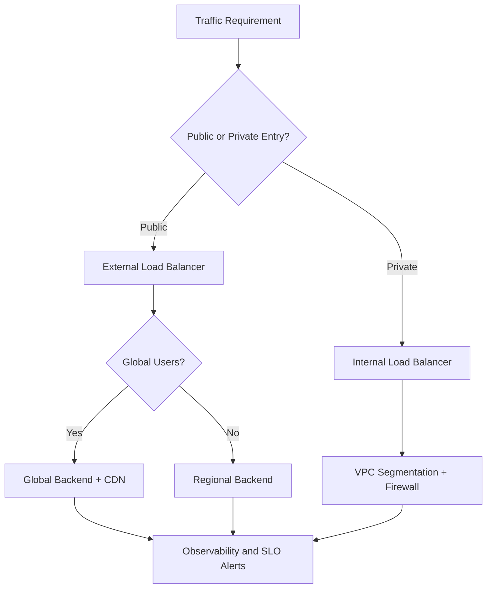
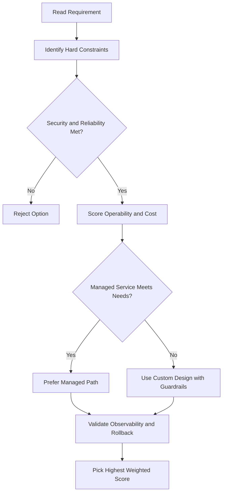
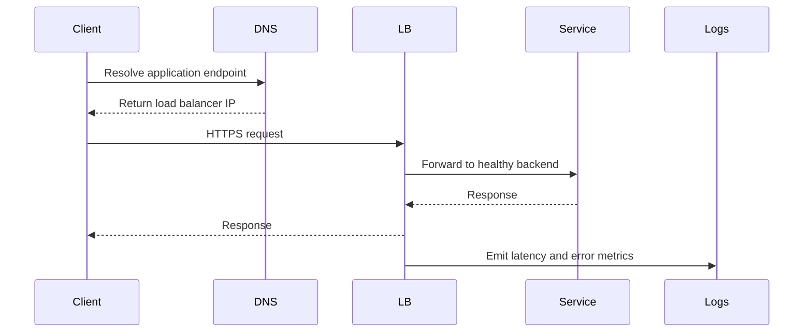

# 🧩 VPC Objects Overview

## What is VPC in Google Cloud?

**VPC (Virtual Private Cloud)** is Google's managed networking system for your cloud resources.

With a VPC, you can:

- Provision Google Cloud resources
- Connect resources to each other
- Isolate resources from each other
- Define detailed networking policies
- Control connectivity between Google Cloud, on-premises, and other public clouds

In simple terms, VPC is the main networking layer for your Google Cloud environment.

---

## VPC is a Set of Networking Objects

VPC is not just one thing. It is a collection of Google-managed networking objects that work together.

This module introduces the main ones at a high level.

---

## 1) Projects

A **project** is the top-level container for Google Cloud resources.

That means:

- Every service you use belongs to a project
- Networks also belong to projects
- Resources are created and managed inside projects

So before you even think about networking, you need to know which project owns the network.

---

## 2) Networks

A **network** is the overall private networking space for your resources.

In Google Cloud, networks come in **three flavors**:

### Default network

A built-in network Google Cloud often provides automatically.

Good for:

- Quick testing
- Simple learning environments

But for real-world production work, teams often avoid relying on the default setup.

### Auto mode network

Google Cloud automatically creates one subnet per region for you.

Good for:

- Fast setup
- Simpler starting point

Tradeoff:

- Less control over how subnet ranges are designed

### Custom mode network

You create your own subnets manually.

Good for:

- Production environments
- Better planning
- More control over IP ranges and layout

This is usually the preferred option for serious network design.

---

## 3) Subnetworks

**Subnetworks** let you divide and separate your environment into smaller pieces.

Why this matters:

- You can organize workloads better
- You can separate environments like dev, test, and prod
- You can control IP ranges more carefully

A subnet belongs to a **region**, even though the VPC itself is global.

---

## 4) Regions and Zones

**Regions** and **zones** represent Google's data center locations.

### Region

A region is a geographic area where you run resources.

### Zone

A zone is an isolated location inside a region.

Why they matter:

- Help with high availability
- Help with resilience
- Support continuous data protection

By placing resources across zones, you reduce the chance that one failure takes down everything.

---

## 5) IP Addresses

VPC provides **internal and external IP addresses**.

### Internal IP addresses

Used for communication between resources inside Google Cloud.

### External IP addresses

Used when resources need to be reached from the internet.

Google Cloud also gives you granular control over IP ranges, which helps when designing networks cleanly and avoiding conflicts.

---

## 6) Virtual Machines from a Networking Perspective

In this module, virtual machines are looked at mainly from the networking side.

That means focusing on questions like:

- Which network is the VM attached to?
- Which subnet is it using?
- What internal IP does it have?
- Does it have an external IP?
- Which firewall rules apply to it?

So the VM is not just a compute resource. It is also a network participant.

---

## 7) Routes

**Routes** tell traffic where to go.

They define the path packets should take to reach a destination.

Without routes, your resources would not know how to reach:

- Other resources in the network
- Other networks
- The internet

---

## 8) Firewall Rules

**Firewall rules** control what traffic is allowed or denied.

They help you define:

- Who can connect to a resource
- Which ports are open
- Which protocols are allowed
- Whether traffic should be inbound or outbound

This is one of the main tools for controlling security at the network level.

---

## Why All of This Matters

When you work with Google Cloud networking, you are really working with a set of connected building blocks:

- Project owns the network
- Network contains subnetworks
- Subnetworks provide IP ranges
- VMs use those IPs
- Routes move traffic
- Firewall rules secure traffic

Once you see how these parts fit together, VPC becomes much easier to understand.

---

## Key Takeaway

VPC is Google's managed networking foundation.

At a high level, the main objects are:

- Projects
- Networks
- Subnetworks
- Regions and zones
- IP addresses
- Virtual machines
- Routes
- Firewall rules

These are the core pieces you need to understand before going deeper into Google Cloud networking.

---

## gcloud Commands

```bash
# List VPC networks
gcloud compute networks list

# Describe a specific network
gcloud compute networks describe NETWORK_NAME

# List subnets filtered by region
gcloud compute networks subnets list --filter="region:us-central1"

# List firewall rules
gcloud compute firewall-rules list
```

## ACE Exam-Style Practice Questions

### Q1
In a Vpc Objects Overview architecture with autoscaling tiers, traffic must flow web to API to database only. How should you enforce this?

A. Separate projects without firewall policy
B. Tags or service-account-based firewall rules between tiers
C. DNS records only
D. Disable internal communication

Answer: B
Trap: Layered firewall policy with identity or tags is robust against autoscaling IP changes.

### Q2
A private VM in Vpc Objects Overview needs outbound internet updates but no inbound internet. What should you configure?

A. External IP on each VM
B. Cloud NAT
C. Cloud Armor only
D. Internal TCP load balancer

Answer: B
Trap: Cloud NAT handles outbound internet for private instances without exposing inbound services.

<!-- ACE_DEEP_ENRICHMENT_START -->
## ACE Deep Enrichment

### Think Like a Google Engineer
- Primary optimization axis: Latency-resilience balance with private-by-default connectivity.
- Start with constraints first: SLO, security, compliance, latency, budget, and team operations capacity.
- Prefer managed services if they satisfy requirements with lower long-term operational toil.
- Minimize blast radius using environment isolation, least privilege, and failure-domain awareness.
- Design for day-2 operations: observability, rollback strategy, and quota or budget guardrails.

### Most Correct Option Filter (60 Seconds)
1. Eliminate options with broad access, single points of failure, or missing monitoring.
2. Confirm the option meets non-negotiables first: security and reliability requirements.
3. Compare remaining options on operational simplicity and long-term maintainability.
4. Use cost as an optimizer only after requirements and risk controls are satisfied.

### Weighted Decision Matrix
| Dimension | Weight | Strong Signal |
| --- | --- | --- |
| Security | 3 | Least privilege, secure defaults, no exposed blast radius |
| Reliability | 3 | Multi-zone or HA design, health checks, tested recovery path |
| Operability | 2 | Clear monitoring, alerting, rollout and rollback simplicity |
| Cost Efficiency | 2 | Right-sized resources, no waste, no reliability regression |
| Performance | 1 | Meets latency and throughput targets with headroom |

### Real-Life Scenario
An ecommerce platform serves customers across regions. The team must keep latency low, protect internal services, and survive zonal failures while controlling egress costs.

### Worked Example
- Place internet-facing services behind the correct external load balancer type.
- Keep internal services private with internal load balancers and private IP ranges.
- Use firewall rules by tags or service accounts, not wide open CIDR ranges.
- Add Cloud CDN or regional placement based on traffic profile and content type.

### Flowchart


### Optimization Decision Flow


### Interaction Sequence


### Extra Exam Practice (10 Questions)
#### Q1
Scenario Focus: 🧩 VPC Objects Overview
A service must be reachable only from internal VMs. Which design is best?

A. Use an internal load balancer with private backend endpoints and private DNS.
B. Expose the service publicly and rely on app-level passwords.
C. Use one VM with a static external IP to simplify architecture.
D. Allow 0.0.0.0/0 ingress to speed up troubleshooting.

Answer: A
Why the other options are weaker: They typically ignore at least one hard constraint such as security, reliability, cost efficiency, or operational simplicity.
Google-engineer check: Reconfirm SLO fit, blast radius, and day-2 maintainability before finalizing.

#### Q2
Scenario Focus: 🧩 VPC Objects Overview
You need to reduce global web latency for static assets. What should you choose?

A. Use one VM with a static external IP to simplify architecture.
B. Use an external application load balancer with Cloud CDN and cacheable content rules.
C. Allow 0.0.0.0/0 ingress to speed up troubleshooting.
D. Disable health checks to avoid accidental failover.

Answer: B
Why the other options are weaker: They typically ignore at least one hard constraint such as security, reliability, cost efficiency, or operational simplicity.
Google-engineer check: Reconfirm SLO fit, blast radius, and day-2 maintainability before finalizing.

#### Q3
Scenario Focus: 🧩 VPC Objects Overview
Which firewall strategy best matches zero-trust network design?

A. Allow 0.0.0.0/0 ingress to speed up troubleshooting.
B. Disable health checks to avoid accidental failover.
C. Use least-privilege firewall policies scoped by service accounts or tags.
D. Route all traffic through manual bastion hops in production.

Answer: C
Why the other options are weaker: They typically ignore at least one hard constraint such as security, reliability, cost efficiency, or operational simplicity.
Google-engineer check: Reconfirm SLO fit, blast radius, and day-2 maintainability before finalizing.

#### Q4
Scenario Focus: 🧩 VPC Objects Overview
A backend fails health checks in one zone. What architecture is best practice?

A. Disable health checks to avoid accidental failover.
B. Route all traffic through manual bastion hops in production.
C. Expose the service publicly and rely on app-level passwords.
D. Run multi-zone backends with health checks and automatic failover.

Answer: D
Why the other options are weaker: They typically ignore at least one hard constraint such as security, reliability, cost efficiency, or operational simplicity.
Google-engineer check: Reconfirm SLO fit, blast radius, and day-2 maintainability before finalizing.

#### Q5
Scenario Focus: 🧩 VPC Objects Overview
You need private hybrid connectivity between on-prem and GCP. Which path is preferred?

A. Use HA VPN or Interconnect based on throughput and SLA requirements.
B. Route all traffic through manual bastion hops in production.
C. Expose the service publicly and rely on app-level passwords.
D. Use one VM with a static external IP to simplify architecture.

Answer: A
Why the other options are weaker: They typically ignore at least one hard constraint such as security, reliability, cost efficiency, or operational simplicity.
Google-engineer check: Reconfirm SLO fit, blast radius, and day-2 maintainability before finalizing.

#### Q6
Scenario Focus: 🧩 VPC Objects Overview
Two designs both satisfy the happy path for 🧩 VPC Objects Overview. Which choice is most correct?

A. Expose the service publicly and rely on app-level passwords.
B. Choose the option that preserves reliability and security while reducing operational burden.
C. Use one VM with a static external IP to simplify architecture.
D. Allow 0.0.0.0/0 ingress to speed up troubleshooting.

Answer: B
Why the other options are weaker: They typically ignore at least one hard constraint such as security, reliability, cost efficiency, or operational simplicity.
Google-engineer check: Reconfirm SLO fit, blast radius, and day-2 maintainability before finalizing.

#### Q7
Scenario Focus: 🧩 VPC Objects Overview
What should you validate first before choosing an architecture for 🧩 VPC Objects Overview?

A. Use one VM with a static external IP to simplify architecture.
B. Allow 0.0.0.0/0 ingress to speed up troubleshooting.
C. Validate SLO fit, blast radius, and least-privilege controls before comparing convenience.
D. Disable health checks to avoid accidental failover.

Answer: C
Why the other options are weaker: They typically ignore at least one hard constraint such as security, reliability, cost efficiency, or operational simplicity.
Google-engineer check: Reconfirm SLO fit, blast radius, and day-2 maintainability before finalizing.

#### Q8
Scenario Focus: 🧩 VPC Objects Overview
A proposal lowers cost but increases failure risk. What is the best decision?

A. Allow 0.0.0.0/0 ingress to speed up troubleshooting.
B. Disable health checks to avoid accidental failover.
C. Route all traffic through manual bastion hops in production.
D. Reject it unless reliability and recovery objectives remain within required targets.

Answer: D
Why the other options are weaker: They typically ignore at least one hard constraint such as security, reliability, cost efficiency, or operational simplicity.
Google-engineer check: Reconfirm SLO fit, blast radius, and day-2 maintainability before finalizing.

#### Q9
Scenario Focus: 🧩 VPC Objects Overview
Which option best reflects optimization for Latency-resilience balance with private-by-default connectivity?

A. Select the design that best meets Latency-resilience balance with private-by-default connectivity while keeping constraints balanced.
B. Disable health checks to avoid accidental failover.
C. Route all traffic through manual bastion hops in production.
D. Expose the service publicly and rely on app-level passwords.

Answer: A
Why the other options are weaker: They typically ignore at least one hard constraint such as security, reliability, cost efficiency, or operational simplicity.
Google-engineer check: Reconfirm SLO fit, blast radius, and day-2 maintainability before finalizing.

#### Q10
Scenario Focus: 🧩 VPC Objects Overview
How should you evaluate a design that needs frequent manual interventions?

A. Route all traffic through manual bastion hops in production.
B. Treat it as high risk and prefer automation-friendly designs with observability and rollback.
C. Expose the service publicly and rely on app-level passwords.
D. Use one VM with a static external IP to simplify architecture.

Answer: B
Why the other options are weaker: They typically ignore at least one hard constraint such as security, reliability, cost efficiency, or operational simplicity.
Google-engineer check: Reconfirm SLO fit, blast radius, and day-2 maintainability before finalizing.

### Quick Commands
```bash
gcloud compute firewall-rules list --project=PROJECT_ID
gcloud compute forwarding-rules list --global --project=PROJECT_ID
gcloud compute backend-services get-health BACKEND_NAME --global --project=PROJECT_ID
gcloud compute routes list --project=PROJECT_ID
```

### Fast Recall
- Pick load balancer type by traffic pattern, not preference.
- Private services should stay private end to end.
- Health checks and multi-zone design are core reliability controls.
<!-- ACE_DEEP_ENRICHMENT_END -->