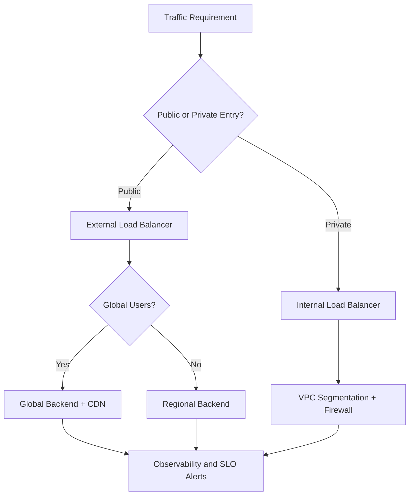
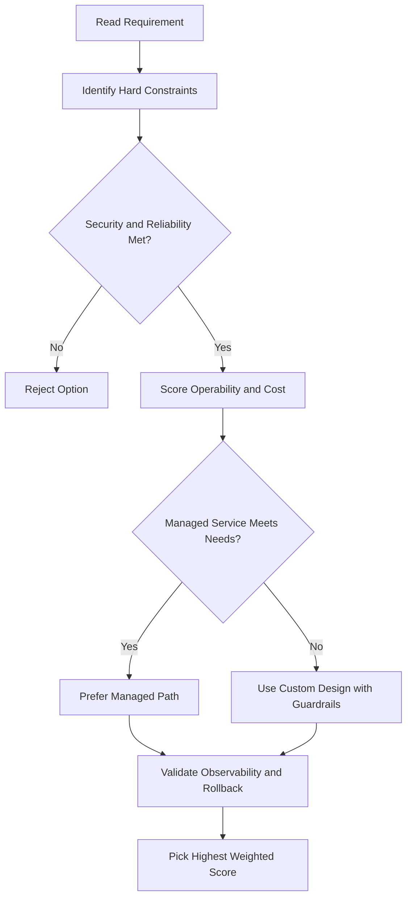
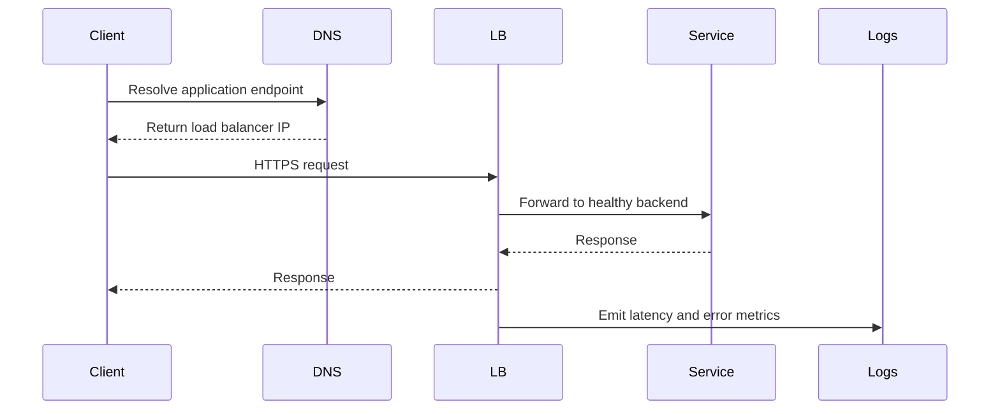

# 🏗️ Projects, Networks, and Subnetworks

## Why These Three Matter

To understand Google Cloud networking, you need to understand the relationship between:

- **Projects**
- **Networks**
- **Subnetworks**

These are some of the most important VPC building blocks.

---

## Projects

A **project** is the main organizer of infrastructure resources in Google Cloud.

A project does several things:

- Groups related resources together
- Connects those resources to **billing**
- Controls quotas and limits
- Owns networks and other services

One unusual but important detail in Google Cloud is that **projects contain entire networks**.

### Network quota per project

By default, each project can have **15 networks**.

If you need more, you can request additional quota in the Google Cloud Console.

### Networks across projects

Networks can also work across project boundaries in two important ways:

- They can be **shared** with other projects
- They can be **peered** with networks in other projects

These are more advanced topics, but they matter when you design larger environments.

---

## Networks

A **network** is the overall private network space for your Google Cloud resources.

Important characteristics:

- A network belongs to a **project**
- Networks are **global**
- A network itself does **not** have a single IP range
- Instead, it is the overall construct that contains subnets, IP addresses, routes, firewall rules, and connected resources

### Global by design

Google Cloud VPC networks are **global**, which means one network can span:

- Asia
  n- Europe
- The Americas
- Any other Google Cloud region

So you can have one VPC network that exists worldwide at the same time.

This is different from many traditional networking models where networks are limited to one location or region.

---

## Subnetworks

A **subnetwork** (or subnet) is how you divide a VPC network into smaller, regional sections.

Subnetworks let you:

- Separate environments
- Organize workloads
- Assign IP ranges to different parts of your architecture

### Key idea

- **VPC network** = global
- **Subnet** = regional

So the large network spans the world, but each subnet belongs to a specific region.

---

## Three Types of Networks

Google Cloud has three main network types:

- **Default**
- **Auto mode**
- **Custom mode**

---

## 1) Default Network

Every new project is usually given a **default VPC network**.

The default network includes:

- Pre-created subnets
- Pre-created firewall rules

### What it sets up automatically

It creates:

- One subnet for each region
- Non-overlapping CIDR blocks
- Firewall rules that allow:
  - **ICMP** from anywhere
  - **RDP** from anywhere
  - **SSH** from anywhere
  - Traffic from within the default network for all protocols and ports

This makes it easy to get started quickly.

### Downside

The default setup is convenient, but it is often too open or too automatic for production environments.

---

## 2) Auto Mode Network

An **auto mode network** automatically creates one subnet in each region.

In fact:

- The **default network is an auto mode network**

### IP range behavior

These auto-created subnets:

- Use predefined IP ranges
- Start with a **/20** subnet mask
- Can be expanded up to **/16**
- Fit inside the overall **10.128.0.0/9** CIDR block

### Important behavior

When Google Cloud adds a new region in the future:

- Auto mode networks automatically get a new subnet for that region

This is convenient, but it also means subnet creation is not fully under your control.

---

## 3) Custom Mode Network

A **custom mode network** does **not** create subnets automatically.

You decide:

- Which regions to use
- Which subnets to create
- Which IP ranges each subnet gets

### Why teams prefer custom mode

Custom mode gives you:

- Better control
- Better planning
- Cleaner production design
- Flexibility for future growth

### Important rule

Subnet IP ranges in the same VPC network **cannot overlap**.

---

## Auto Mode to Custom Mode

You can convert:

- **Auto mode network → Custom mode network**

But this conversion is **one-way**.

You cannot convert:

- **Custom mode network → Auto mode network**

So you should think carefully before choosing auto mode for long-term use.

---

## IPv6 Support

Google Cloud supports **IPv6** in **custom VPC network mode**.

For example, you can configure **dual-stack** VM instances that run with:

- IPv4
- IPv6

This is useful when you need modern IP addressing support.

---

## How VMs Communicate Across Regions

Because VPC networks are global, VM instances in the **same VPC network** can communicate using **internal IP addresses**, even if they are in different regions.

### Example

If:

- VM A is in Asia
- VM B is in Europe
- Both are in **Network 1**

Then they can communicate privately using internal IPs.

This works because they are using Google's global private fiber network.

In practice, it can feel as if the VMs are sitting very close together from a networking point of view.

---

## VMs in Different Networks

If two VMs are **not** in the same VPC network, then by default they usually need to communicate using **external IP addresses**.

Example:

- VM C in Network 2
- VM D in Network 3
- Same region, but different networks

Even though they are geographically close, they are not in the same private network.

### Important detail

That traffic still may not go out to the open public internet. It can stay within Google's infrastructure and go through Google's edge routers.

But the billing and security behavior is different than private internal communication inside one VPC.

---

## Why One VPC Can Simplify VPN Design

Because a VPC network is global, a **single VPN** can connect your on-premises environment to VM instances in multiple regions.

Example:

- One on-premises network
- One VPN gateway
- VMs in `us-west1` and `us-east1`
- All connected through the same global VPC

This can reduce:

- Cost
- Complexity
- Network management effort

---

## Subnets Are Regional but Can Cross Zones

A subnet belongs to **one region**, but it can span **multiple zones inside that region**.

That means:

- VM 1 in Zone A
- VM 2 in Zone B
- Same region
- Same subnet

Both VMs can still use the same subnet IP range.

This is useful because:

- They can communicate privately
- One firewall rule can apply to both
- You get resilience across zones without needing separate subnets

---

## Reserved IP Addresses in Each Subnet

Every subnet reserves **four IP addresses** in its primary IP range.

These are:

- The **first address** for the network
- The **second address** for the subnet gateway
- The **second-to-last address** reserved by Google Cloud
- The **last address** reserved as the broadcast address

So the first usable VM addresses start after those reserved addresses.

---

## Expanding Subnet IP Ranges

Google Cloud lets you **expand a subnet's IP range** without shutting down workloads.

That means you can grow the subnet while your VMs keep running.

### Rules to remember

- The expanded range must **not overlap** with any other subnet in the same VPC
- Every subnet range must be a unique valid CIDR block
- The new range must be **larger** than the old one
- You **cannot undo** a subnet expansion

In other words:

- Expansion is possible
- Shrinking back is not

---

## Auto Mode Subnet Expansion Limits

Auto mode subnets:

- Start at **/20**
- Can grow to **/16**
- Cannot grow larger unless you move to a custom-mode approach

If you need more flexibility, converting the network to **custom mode** gives you more control.

---

## Avoid Oversized Subnets

Do not make subnets bigger than you really need.

Overly large subnets increase the chance of **CIDR conflicts** when using:

- Multiple network interfaces
- VPC Network Peering
- VPN connections
- On-premises connectivity

A good subnet design leaves room to grow without wasting address space.

---

## Key Takeaway

Projects, networks, and subnets work together like this:

- **Project** owns the network and ties it to billing
- **Network** is a global private communication space
- **Subnet** is a regional IP range inside that network

The biggest ideas to remember are:

- VPC networks are **global**
- Subnets are **regional**
- VMs in the same VPC can communicate privately across regions
- Custom mode gives the most control
- Subnet planning matters for scaling, security, and future connectivity

---

## gcloud Commands

```bash
# Create an auto-mode network
gcloud compute networks create my-auto-net --subnet-mode=auto

# Create a custom-mode network
gcloud compute networks create my-custom-net --subnet-mode=custom

# Create a subnet in a custom network
gcloud compute networks subnets create my-subnet \
  --network=my-custom-net --region=us-central1 --range=10.0.0.0/24

# Delete a network
gcloud compute networks delete my-network
```

## ACE Exam-Style Practice Questions

### Q1

In a projects, networks, and subnets design, autoscaling tiers must allow only web to API to database traffic without relying on static IP addresses. What is best?

A. DNS records only
B. Firewall rules based on network tags or service accounts
C. Disable internal traffic by default and manage manually
D. One flat subnet with no firewall policy

Answer: B
Trap: Autoscaling changes instance IPs, so identity or tag-based firewall controls are more stable.

### Q2

Your private VM in this network has no external IP but must still install patches from the internet. What should you configure?

A. Public IP per VM
B. Cloud NAT
C. Internal passthrough load balancer
D. Cloud Armor only

Answer: B
Trap: Cloud NAT provides outbound internet for private instances without opening inbound paths.

<!-- ACE_DEEP_ENRICHMENT_START -->
## ACE Deep Enrichment

### Think Like a Google Engineer
- Primary optimization axis: Latency-resilience balance with private-by-default connectivity.
- Start with constraints first: SLO, security, compliance, latency, budget, and team operations capacity.
- Prefer managed services if they satisfy requirements with lower long-term operational toil.
- Minimize blast radius using environment isolation, least privilege, and failure-domain awareness.
- Design for day-2 operations: observability, rollback strategy, and quota or budget guardrails.

### Most Correct Option Filter (60 Seconds)
1. Eliminate options with broad access, single points of failure, or missing monitoring.
2. Confirm the option meets non-negotiables first: security and reliability requirements.
3. Compare remaining options on operational simplicity and long-term maintainability.
4. Use cost as an optimizer only after requirements and risk controls are satisfied.

### Weighted Decision Matrix
| Dimension | Weight | Strong Signal |
| --- | --- | --- |
| Security | 3 | Least privilege, secure defaults, no exposed blast radius |
| Reliability | 3 | Multi-zone or HA design, health checks, tested recovery path |
| Operability | 2 | Clear monitoring, alerting, rollout and rollback simplicity |
| Cost Efficiency | 2 | Right-sized resources, no waste, no reliability regression |
| Performance | 1 | Meets latency and throughput targets with headroom |

### Real-Life Scenario
An ecommerce platform serves customers across regions. The team must keep latency low, protect internal services, and survive zonal failures while controlling egress costs.

### Worked Example
- Place internet-facing services behind the correct external load balancer type.
- Keep internal services private with internal load balancers and private IP ranges.
- Use firewall rules by tags or service accounts, not wide open CIDR ranges.
- Add Cloud CDN or regional placement based on traffic profile and content type.

### Flowchart


### Optimization Decision Flow


### Interaction Sequence


### Extra Exam Practice (10 Questions)
#### Q1
Scenario Focus: 🏗️ Projects, Networks, and Subnetworks
A service must be reachable only from internal VMs. Which design is best?

A. Use an internal load balancer with private backend endpoints and private DNS.
B. Expose the service publicly and rely on app-level passwords.
C. Use one VM with a static external IP to simplify architecture.
D. Allow 0.0.0.0/0 ingress to speed up troubleshooting.

Answer: A
Why the other options are weaker: They typically ignore at least one hard constraint such as security, reliability, cost efficiency, or operational simplicity.
Google-engineer check: Reconfirm SLO fit, blast radius, and day-2 maintainability before finalizing.

#### Q2
Scenario Focus: 🏗️ Projects, Networks, and Subnetworks
You need to reduce global web latency for static assets. What should you choose?

A. Use one VM with a static external IP to simplify architecture.
B. Use an external application load balancer with Cloud CDN and cacheable content rules.
C. Allow 0.0.0.0/0 ingress to speed up troubleshooting.
D. Disable health checks to avoid accidental failover.

Answer: B
Why the other options are weaker: They typically ignore at least one hard constraint such as security, reliability, cost efficiency, or operational simplicity.
Google-engineer check: Reconfirm SLO fit, blast radius, and day-2 maintainability before finalizing.

#### Q3
Scenario Focus: 🏗️ Projects, Networks, and Subnetworks
Which firewall strategy best matches zero-trust network design?

A. Allow 0.0.0.0/0 ingress to speed up troubleshooting.
B. Disable health checks to avoid accidental failover.
C. Use least-privilege firewall policies scoped by service accounts or tags.
D. Route all traffic through manual bastion hops in production.

Answer: C
Why the other options are weaker: They typically ignore at least one hard constraint such as security, reliability, cost efficiency, or operational simplicity.
Google-engineer check: Reconfirm SLO fit, blast radius, and day-2 maintainability before finalizing.

#### Q4
Scenario Focus: 🏗️ Projects, Networks, and Subnetworks
A backend fails health checks in one zone. What architecture is best practice?

A. Disable health checks to avoid accidental failover.
B. Route all traffic through manual bastion hops in production.
C. Expose the service publicly and rely on app-level passwords.
D. Run multi-zone backends with health checks and automatic failover.

Answer: D
Why the other options are weaker: They typically ignore at least one hard constraint such as security, reliability, cost efficiency, or operational simplicity.
Google-engineer check: Reconfirm SLO fit, blast radius, and day-2 maintainability before finalizing.

#### Q5
Scenario Focus: 🏗️ Projects, Networks, and Subnetworks
You need private hybrid connectivity between on-prem and GCP. Which path is preferred?

A. Use HA VPN or Interconnect based on throughput and SLA requirements.
B. Route all traffic through manual bastion hops in production.
C. Expose the service publicly and rely on app-level passwords.
D. Use one VM with a static external IP to simplify architecture.

Answer: A
Why the other options are weaker: They typically ignore at least one hard constraint such as security, reliability, cost efficiency, or operational simplicity.
Google-engineer check: Reconfirm SLO fit, blast radius, and day-2 maintainability before finalizing.

#### Q6
Scenario Focus: 🏗️ Projects, Networks, and Subnetworks
Two designs both satisfy the happy path for 🏗️ Projects, Networks, and Subnetworks. Which choice is most correct?

A. Expose the service publicly and rely on app-level passwords.
B. Choose the option that preserves reliability and security while reducing operational burden.
C. Use one VM with a static external IP to simplify architecture.
D. Allow 0.0.0.0/0 ingress to speed up troubleshooting.

Answer: B
Why the other options are weaker: They typically ignore at least one hard constraint such as security, reliability, cost efficiency, or operational simplicity.
Google-engineer check: Reconfirm SLO fit, blast radius, and day-2 maintainability before finalizing.

#### Q7
Scenario Focus: 🏗️ Projects, Networks, and Subnetworks
What should you validate first before choosing an architecture for 🏗️ Projects, Networks, and Subnetworks?

A. Use one VM with a static external IP to simplify architecture.
B. Allow 0.0.0.0/0 ingress to speed up troubleshooting.
C. Validate SLO fit, blast radius, and least-privilege controls before comparing convenience.
D. Disable health checks to avoid accidental failover.

Answer: C
Why the other options are weaker: They typically ignore at least one hard constraint such as security, reliability, cost efficiency, or operational simplicity.
Google-engineer check: Reconfirm SLO fit, blast radius, and day-2 maintainability before finalizing.

#### Q8
Scenario Focus: 🏗️ Projects, Networks, and Subnetworks
A proposal lowers cost but increases failure risk. What is the best decision?

A. Allow 0.0.0.0/0 ingress to speed up troubleshooting.
B. Disable health checks to avoid accidental failover.
C. Route all traffic through manual bastion hops in production.
D. Reject it unless reliability and recovery objectives remain within required targets.

Answer: D
Why the other options are weaker: They typically ignore at least one hard constraint such as security, reliability, cost efficiency, or operational simplicity.
Google-engineer check: Reconfirm SLO fit, blast radius, and day-2 maintainability before finalizing.

#### Q9
Scenario Focus: 🏗️ Projects, Networks, and Subnetworks
Which option best reflects optimization for Latency-resilience balance with private-by-default connectivity?

A. Select the design that best meets Latency-resilience balance with private-by-default connectivity while keeping constraints balanced.
B. Disable health checks to avoid accidental failover.
C. Route all traffic through manual bastion hops in production.
D. Expose the service publicly and rely on app-level passwords.

Answer: A
Why the other options are weaker: They typically ignore at least one hard constraint such as security, reliability, cost efficiency, or operational simplicity.
Google-engineer check: Reconfirm SLO fit, blast radius, and day-2 maintainability before finalizing.

#### Q10
Scenario Focus: 🏗️ Projects, Networks, and Subnetworks
How should you evaluate a design that needs frequent manual interventions?

A. Route all traffic through manual bastion hops in production.
B. Treat it as high risk and prefer automation-friendly designs with observability and rollback.
C. Expose the service publicly and rely on app-level passwords.
D. Use one VM with a static external IP to simplify architecture.

Answer: B
Why the other options are weaker: They typically ignore at least one hard constraint such as security, reliability, cost efficiency, or operational simplicity.
Google-engineer check: Reconfirm SLO fit, blast radius, and day-2 maintainability before finalizing.

### Quick Commands
```bash
gcloud compute firewall-rules list --project=PROJECT_ID
gcloud compute forwarding-rules list --global --project=PROJECT_ID
gcloud compute backend-services get-health BACKEND_NAME --global --project=PROJECT_ID
gcloud compute routes list --project=PROJECT_ID
```

### Fast Recall
- Pick load balancer type by traffic pattern, not preference.
- Private services should stay private end to end.
- Health checks and multi-zone design are core reliability controls.
<!-- ACE_DEEP_ENRICHMENT_END -->