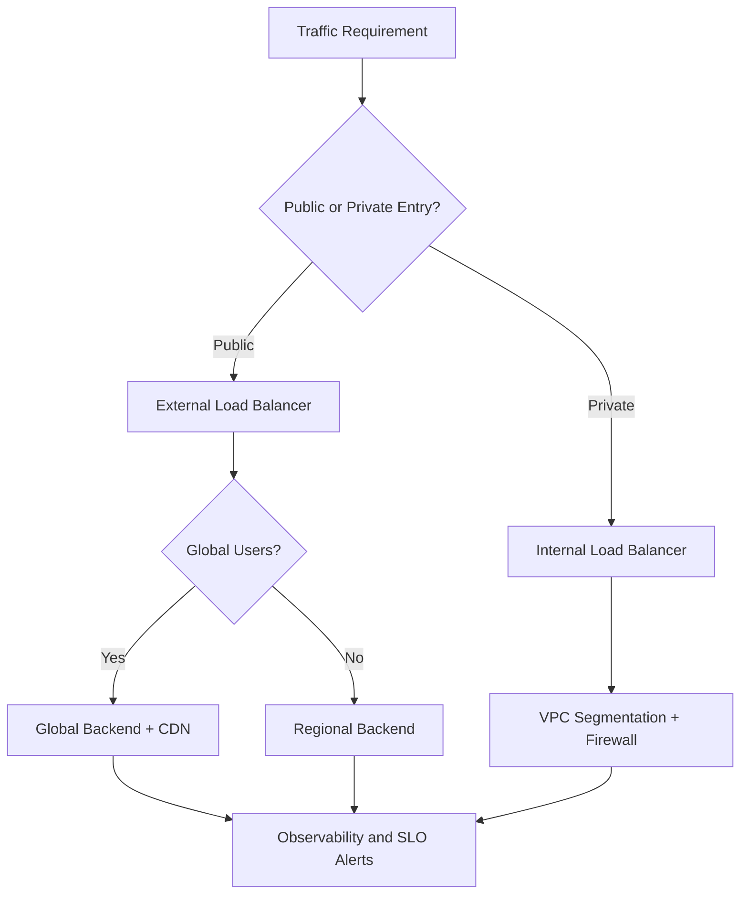
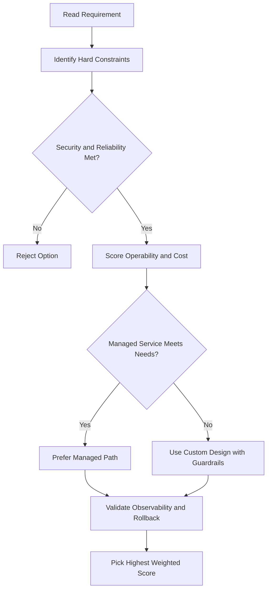
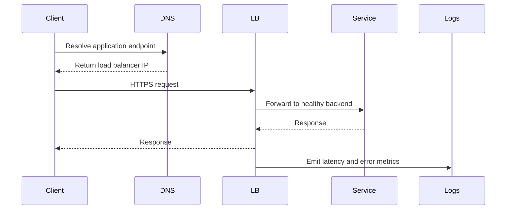

# 📈 Lab: Expanding a Custom Subnet in Google Cloud

## Lab Goal

This lab shows how to expand a **custom subnet** when you run out of internal IP addresses.

Key outcome:

- You can increase subnet IP range size **without shutting down running workloads**.

---

## Starting Point

You begin with a custom subnet using a **/29** CIDR range.

### What /29 means

A `/29` subnet has **8 total IP addresses**.

In Google Cloud, **4 addresses are reserved**, so only **4 usable addresses** are left for VM instances.

That means once 4 VMs are running, the subnet has no free internal IPs left.

---

## Step 1: Confirm IP Exhaustion

1. Open Compute Engine VM instances in the Console
2. Verify that 4 VM instances already exist in the subnet
3. Start creating a 5th VM in the same subnet

Expected result:

- VM creation fails
- Error indicates subnet IP space is exhausted

You can also watch this in the notification panel during creation.

---

## Step 2: Expand the Subnet

After the failure, expand the subnet range.

Two ways to navigate there:

- Through VPC Network settings
- Or from VM network interface details (for example, by clicking NIC/subnet links)

Then:

1. Open the subnet
2. Click Edit
3. Change subnet mask from `/29` to `/23`
4. Save changes

A `/23` subnet supports far more addresses (enough for hundreds of instances).

---

## Step 3: Retry VM Creation

Once subnet update is complete:

1. Use Retry from the failed VM creation flow (or create the VM again)
2. Wait for staging and provisioning
3. Confirm the new VM gets an internal IP

Expected result:

- VM 5 is created successfully
- Internal IP allocation works because subnet now has enough free space

---

## Why This Matters

This lab demonstrates an important operational benefit:

- Existing VMs keep running during subnet expansion
- No shutdown required
- No workload downtime required

So when subnet capacity is exhausted, you can scale networking capacity live.

---

## Practical Rules to Remember

1. Plan subnet sizes based on expected growth.
2. Small subnets like `/29` are useful for testing but exhaust quickly.
3. Expansion is safer than emergency redesign.
4. Subnet expansion is one-way for size growth in practice: design carefully before large changes.

---

## Quick Example Math

- `/29` => 8 total IPs
- 4 reserved by Google Cloud
- 4 usable for VMs

If you already have 4 VMs, a 5th VM in the same subnet fails until the subnet is expanded.

---

## Key Takeaway

Subnet IP exhaustion is common in small test ranges.

Google Cloud lets you fix it quickly by expanding the custom subnet range, and you can do this **without stopping existing VM workloads**.

---

## gcloud Commands

```bash
# Expand a subnet's IP range (e.g. /29 → /23)
gcloud compute networks subnets expand-ip-range my-subnet \
  --region=us-central1 --prefix-length=23

# Verify the new range
gcloud compute networks subnets describe my-subnet --region=us-central1
```

## ACE Exam-Style Practice Questions

### Q1
In a Custom Subnet Expansion Lab architecture with autoscaling tiers, traffic must flow web to API to database only. How should you enforce this?

A. Separate projects without firewall policy
B. Tags or service-account-based firewall rules between tiers
C. DNS records only
D. Disable internal communication

Answer: B
Trap: Layered firewall policy with identity or tags is robust against autoscaling IP changes.

### Q2
A private VM in Custom Subnet Expansion Lab needs outbound internet updates but no inbound internet. What should you configure?

A. External IP on each VM
B. Cloud NAT
C. Cloud Armor only
D. Internal TCP load balancer

Answer: B
Trap: Cloud NAT handles outbound internet for private instances without exposing inbound services.

<!-- ACE_DEEP_ENRICHMENT_START -->
## ACE Deep Enrichment

### Think Like a Google Engineer
- Primary optimization axis: Latency-resilience balance with private-by-default connectivity.
- Start with constraints first: SLO, security, compliance, latency, budget, and team operations capacity.
- Prefer managed services if they satisfy requirements with lower long-term operational toil.
- Minimize blast radius using environment isolation, least privilege, and failure-domain awareness.
- Design for day-2 operations: observability, rollback strategy, and quota or budget guardrails.

### Most Correct Option Filter (60 Seconds)
1. Eliminate options with broad access, single points of failure, or missing monitoring.
2. Confirm the option meets non-negotiables first: security and reliability requirements.
3. Compare remaining options on operational simplicity and long-term maintainability.
4. Use cost as an optimizer only after requirements and risk controls are satisfied.

### Weighted Decision Matrix
| Dimension | Weight | Strong Signal |
| --- | --- | --- |
| Security | 3 | Least privilege, secure defaults, no exposed blast radius |
| Reliability | 3 | Multi-zone or HA design, health checks, tested recovery path |
| Operability | 2 | Clear monitoring, alerting, rollout and rollback simplicity |
| Cost Efficiency | 2 | Right-sized resources, no waste, no reliability regression |
| Performance | 1 | Meets latency and throughput targets with headroom |

### Real-Life Scenario
An ecommerce platform serves customers across regions. The team must keep latency low, protect internal services, and survive zonal failures while controlling egress costs.

### Worked Example
- Place internet-facing services behind the correct external load balancer type.
- Keep internal services private with internal load balancers and private IP ranges.
- Use firewall rules by tags or service accounts, not wide open CIDR ranges.
- Add Cloud CDN or regional placement based on traffic profile and content type.

### Flowchart


### Optimization Decision Flow


### Interaction Sequence


### Extra Exam Practice (15 Questions)
#### Q1

Scenario Focus: 📈 Lab: Expanding a Custom Subnet in Google Cloud

A service must be reachable only from internal VMs. Which design is best?

A. Use an internal load balancer with private backend endpoints and private DNS.  
B. Expose the service publicly and rely on app-level passwords.  
C. Use one VM with a static external IP to simplify architecture.  
D. Allow 0.0.0.0/0 ingress to speed up troubleshooting.

Answer: A  
Why the other options are weaker: They typically ignore at least one hard constraint such as security, reliability, cost efficiency, or operational simplicity.  
Google-engineer check: Reconfirm SLO fit, blast radius, and day-2 maintainability before finalizing.

#### Q2

Scenario Focus: 📈 Lab: Expanding a Custom Subnet in Google Cloud

You need to reduce global web latency for static assets. What should you choose?

A. Use one VM with a static external IP to simplify architecture.  
B. Use an external application load balancer with Cloud CDN and cacheable content rules.  
C. Allow 0.0.0.0/0 ingress to speed up troubleshooting.  
D. Disable health checks to avoid accidental failover.

Answer: B  
Why the other options are weaker: They typically ignore at least one hard constraint such as security, reliability, cost efficiency, or operational simplicity.  
Google-engineer check: Reconfirm SLO fit, blast radius, and day-2 maintainability before finalizing.

#### Q3

Scenario Focus: 📈 Lab: Expanding a Custom Subnet in Google Cloud

Which firewall strategy best matches zero-trust network design?

A. Allow 0.0.0.0/0 ingress to speed up troubleshooting.  
B. Disable health checks to avoid accidental failover.  
C. Use least-privilege firewall policies scoped by service accounts or tags.  
D. Route all traffic through manual bastion hops in production.

Answer: C  
Why the other options are weaker: They typically ignore at least one hard constraint such as security, reliability, cost efficiency, or operational simplicity.  
Google-engineer check: Reconfirm SLO fit, blast radius, and day-2 maintainability before finalizing.

#### Q4

Scenario Focus: 📈 Lab: Expanding a Custom Subnet in Google Cloud

A backend fails health checks in one zone. What architecture is best practice?

A. Disable health checks to avoid accidental failover.  
B. Route all traffic through manual bastion hops in production.  
C. Expose the service publicly and rely on app-level passwords.  
D. Run multi-zone backends with health checks and automatic failover.

Answer: D  
Why the other options are weaker: They typically ignore at least one hard constraint such as security, reliability, cost efficiency, or operational simplicity.  
Google-engineer check: Reconfirm SLO fit, blast radius, and day-2 maintainability before finalizing.

#### Q5

Scenario Focus: 📈 Lab: Expanding a Custom Subnet in Google Cloud

You need private hybrid connectivity between on-prem and GCP. Which path is preferred?

A. Use HA VPN or Interconnect based on throughput and SLA requirements.  
B. Route all traffic through manual bastion hops in production.  
C. Expose the service publicly and rely on app-level passwords.  
D. Use one VM with a static external IP to simplify architecture.

Answer: A  
Why the other options are weaker: They typically ignore at least one hard constraint such as security, reliability, cost efficiency, or operational simplicity.  
Google-engineer check: Reconfirm SLO fit, blast radius, and day-2 maintainability before finalizing.

#### Q6

Scenario Focus: 📈 Lab: Expanding a Custom Subnet in Google Cloud

Two designs both satisfy the happy path for 📈 Lab: Expanding a Custom Subnet in Google Cloud. Which choice is most correct?

A. Expose the service publicly and rely on app-level passwords.  
B. Choose the option that preserves reliability and security while reducing operational burden.  
C. Use one VM with a static external IP to simplify architecture.  
D. Allow 0.0.0.0/0 ingress to speed up troubleshooting.

Answer: B  
Why the other options are weaker: They typically ignore at least one hard constraint such as security, reliability, cost efficiency, or operational simplicity.  
Google-engineer check: Reconfirm SLO fit, blast radius, and day-2 maintainability before finalizing.

#### Q7

Scenario Focus: 📈 Lab: Expanding a Custom Subnet in Google Cloud

What should you validate first before choosing an architecture for 📈 Lab: Expanding a Custom Subnet in Google Cloud?

A. Use one VM with a static external IP to simplify architecture.  
B. Allow 0.0.0.0/0 ingress to speed up troubleshooting.  
C. Validate SLO fit, blast radius, and least-privilege controls before comparing convenience.  
D. Disable health checks to avoid accidental failover.

Answer: C  
Why the other options are weaker: They typically ignore at least one hard constraint such as security, reliability, cost efficiency, or operational simplicity.  
Google-engineer check: Reconfirm SLO fit, blast radius, and day-2 maintainability before finalizing.

#### Q8

Scenario Focus: 📈 Lab: Expanding a Custom Subnet in Google Cloud

A proposal lowers cost but increases failure risk. What is the best decision?

A. Allow 0.0.0.0/0 ingress to speed up troubleshooting.  
B. Disable health checks to avoid accidental failover.  
C. Route all traffic through manual bastion hops in production.  
D. Reject it unless reliability and recovery objectives remain within required targets.

Answer: D  
Why the other options are weaker: They typically ignore at least one hard constraint such as security, reliability, cost efficiency, or operational simplicity.  
Google-engineer check: Reconfirm SLO fit, blast radius, and day-2 maintainability before finalizing.

#### Q9

Scenario Focus: 📈 Lab: Expanding a Custom Subnet in Google Cloud

Which option best reflects optimization for Latency-resilience balance with private-by-default connectivity?

A. Select the design that best meets Latency-resilience balance with private-by-default connectivity while keeping constraints balanced.  
B. Disable health checks to avoid accidental failover.  
C. Route all traffic through manual bastion hops in production.  
D. Expose the service publicly and rely on app-level passwords.

Answer: A  
Why the other options are weaker: They typically ignore at least one hard constraint such as security, reliability, cost efficiency, or operational simplicity.  
Google-engineer check: Reconfirm SLO fit, blast radius, and day-2 maintainability before finalizing.

#### Q10

Scenario Focus: 📈 Lab: Expanding a Custom Subnet in Google Cloud

How should you evaluate a design that needs frequent manual interventions?

A. Route all traffic through manual bastion hops in production.  
B. Treat it as high risk and prefer automation-friendly designs with observability and rollback.  
C. Expose the service publicly and rely on app-level passwords.  
D. Use one VM with a static external IP to simplify architecture.

Answer: B  
Why the other options are weaker: They typically ignore at least one hard constraint such as security, reliability, cost efficiency, or operational simplicity.  
Google-engineer check: Reconfirm SLO fit, blast radius, and day-2 maintainability before finalizing.

#### Q11

Scenario Focus: 📈 Lab: Expanding a Custom Subnet in Google Cloud

Two options have similar latency. Which tie-breaker is best?

A. Expose the service publicly and rely on app-level passwords.  
B. Use one VM with a static external IP to simplify architecture.  
C. Pick the option with stronger operability, clearer failure isolation, and simpler incident response.  
D. Allow 0.0.0.0/0 ingress to speed up troubleshooting.

Answer: C  
Why the other options are weaker: They typically ignore at least one hard constraint such as security, reliability, cost efficiency, or operational simplicity.  
Google-engineer check: Reconfirm SLO fit, blast radius, and day-2 maintainability before finalizing.

#### Q12

Scenario Focus: 📈 Lab: Expanding a Custom Subnet in Google Cloud

What is the best way to choose between a custom stack and a managed service?

A. Use one VM with a static external IP to simplify architecture.  
B. Allow 0.0.0.0/0 ingress to speed up troubleshooting.  
C. Disable health checks to avoid accidental failover.  
D. Prefer managed services when they meet requirements with lower long-term maintenance effort.

Answer: D  
Why the other options are weaker: They typically ignore at least one hard constraint such as security, reliability, cost efficiency, or operational simplicity.  
Google-engineer check: Reconfirm SLO fit, blast radius, and day-2 maintainability before finalizing.

#### Q13

Scenario Focus: 📈 Lab: Expanding a Custom Subnet in Google Cloud

How do you confirm a solution is production-ready for 

A. Verify monitoring, alerting, rollback path, quota and budget controls, and secure defaults.  
B. Allow 0.0.0.0/0 ingress to speed up troubleshooting.  
C. Disable health checks to avoid accidental failover.  
D. Route all traffic through manual bastion hops in production.

Answer: A  
Why the other options are weaker: They typically ignore at least one hard constraint such as security, reliability, cost efficiency, or operational simplicity.  
Google-engineer check: Reconfirm SLO fit, blast radius, and day-2 maintainability before finalizing.

#### Q14

Scenario Focus: 📈 Lab: Expanding a Custom Subnet in Google Cloud

Which pattern usually wins in ACE scenario tie-breakers?

A. Disable health checks to avoid accidental failover.  
B. Managed-service-first plus least-privilege access plus clear observability usually wins.  
C. Route all traffic through manual bastion hops in production.  
D. Expose the service publicly and rely on app-level passwords.

Answer: B  
Why the other options are weaker: They typically ignore at least one hard constraint such as security, reliability, cost efficiency, or operational simplicity.  
Google-engineer check: Reconfirm SLO fit, blast radius, and day-2 maintainability before finalizing.

#### Q15

Scenario Focus: 📈 Lab: Expanding a Custom Subnet in Google Cloud

What is the best final check before locking the answer?

A. Route all traffic through manual bastion hops in production.  
B. Expose the service publicly and rely on app-level passwords.  
C. Run a weighted check across security, reliability, cost, performance, and operability.  
D. Use one VM with a static external IP to simplify architecture.

Answer: C  
Why the other options are weaker: They typically ignore at least one hard constraint such as security, reliability, cost efficiency, or operational simplicity.  
Google-engineer check: Reconfirm SLO fit, blast radius, and day-2 maintainability before finalizing.

### Quick Commands
```bash
gcloud compute firewall-rules list --project=PROJECT_ID
gcloud compute forwarding-rules list --global --project=PROJECT_ID
gcloud compute backend-services get-health BACKEND_NAME --global --project=PROJECT_ID
gcloud compute routes list --project=PROJECT_ID
```

### Fast Recall
- Pick load balancer type by traffic pattern, not preference.
- Private services should stay private end to end.
- Health checks and multi-zone design are core reliability controls.
<!-- ACE_DEEP_ENRICHMENT_END -->