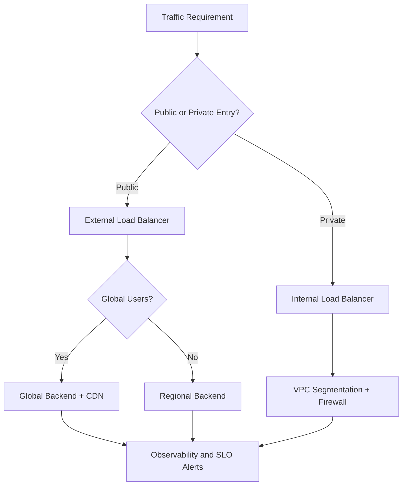
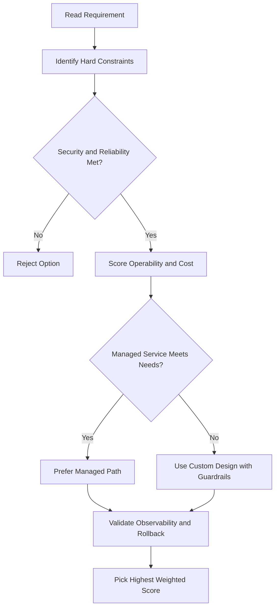
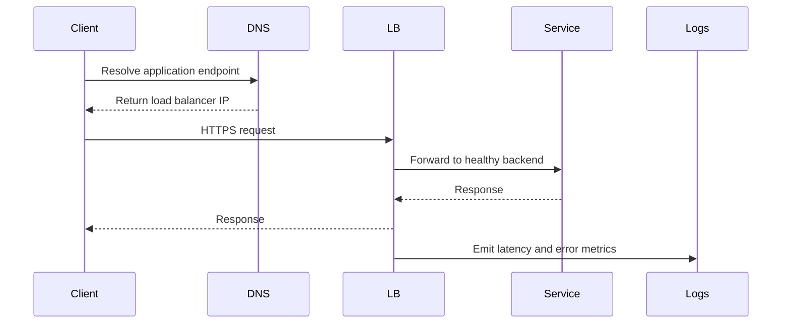

# 🧭 IP Addresses in Google Cloud

## Why IP Addresses Matter

After understanding networks and subnets, the next key concept is IP addressing.

In Google Cloud, a VM can have:

- An **internal IP address**
- An **external IP address** (optional)

---

## Internal IP Address

Every VM gets an internal IP address.

### How it is assigned

- Assigned automatically through **DHCP** inside the VPC network
- Used for private communication between resources

### Who gets internal IPs

Not just Compute Engine VMs. Services built on VMs also depend on internal IPs.

Examples include:

- App Engine (in underlying infrastructure context)
- Google Kubernetes Engine (GKE) components

---

## Internal DNS and VM Names

When you create a VM, Google Cloud registers its name in an internal DNS service.

That DNS service:

- Maps VM names to internal IP addresses
- Works within the same network scope

### Important DNS scope rule

Internal DNS is scoped to the **network**.

That means:

- A VM can resolve names of hosts in the same network
- It cannot resolve host names from VMs in a different network (by default network-scoped behavior)

---

## External IP Address (Optional)

A VM may also have an external IP if it needs to be reachable from outside Google Cloud.

Use external IPs for:

- Public-facing services
- Remote access from outside the VPC
- Internet-facing workloads

If a VM is not externally facing, it may not need one.

---

## Ephemeral vs Static External IPs

Google Cloud offers two main external IP options:

### Ephemeral external IP

- Assigned from a pool automatically
- Typically attached during VM lifecycle
- Can change when resource is recreated/restarted in some scenarios

### Static external IP

- Reserved for your project
- Stays fixed until you release it
- Useful when you need stable endpoints (DNS records, allowlists, integrations)

---

## Pricing Note for Static IPs

If you reserve a static external IP but do **not** attach it to a resource:

- Google Cloud charges a higher rate for that unused reserved IP

In short:

- **In-use IPs** are cheaper than **reserved-but-unused static IPs**

So reserve static IPs intentionally and avoid leaving them idle.

---

## Bring Your Own Public IPs (BYOIP)

Google Cloud can also use your own publicly routable IP prefixes as external addresses.

To be eligible, you must bring:

- A public IP block of **/24 or larger**

This is useful when organizations want to keep consistent public IP ownership and internet advertisement.

---

## Quick Comparison

| Type                    | Required?     | Scope                     | Typical Use                |
| ----------------------- | ------------- | ------------------------- | -------------------------- |
| Internal IP             | Yes (for VMs) | Private VPC communication | Service-to-service traffic |
| External IP (Ephemeral) | Optional      | Internet reachable        | Temporary/public access    |
| External IP (Static)    | Optional      | Internet reachable        | Stable endpoint and DNS    |

---

## Key Takeaway

In Google Cloud:

- Internal IPs are default and power private communication
- External IPs are optional and used for public access
- Internal DNS resolves names within the same network
- Static IPs are best for stable endpoints, but unused reserved static IPs cost more
- You can even bring your own /24+ public prefix when needed

---

## gcloud Commands

```bash
# List all IP addresses (static and ephemeral)
gcloud compute addresses list

# Reserve a static external IP
gcloud compute addresses create my-static-ip --region=us-central1

# Reserve a static internal IP in a subnet
gcloud compute addresses create my-internal-ip \
  --region=us-central1 --subnet=my-subnet --addresses=10.0.0.5

# Release a static IP
gcloud compute addresses delete my-static-ip --region=us-central1
```

## ACE Exam-Style Practice Questions

### Q1
In a Ip Addresses In Google Cloud architecture with autoscaling tiers, traffic must flow web to API to database only. How should you enforce this?

A. Separate projects without firewall policy
B. Tags or service-account-based firewall rules between tiers
C. DNS records only
D. Disable internal communication

Answer: B
Trap: Layered firewall policy with identity or tags is robust against autoscaling IP changes.

### Q2
A private VM in Ip Addresses In Google Cloud needs outbound internet updates but no inbound internet. What should you configure?

A. External IP on each VM
B. Cloud NAT
C. Cloud Armor only
D. Internal TCP load balancer

Answer: B
Trap: Cloud NAT handles outbound internet for private instances without exposing inbound services.

<!-- ACE_DEEP_ENRICHMENT_START -->
## ACE Deep Enrichment

### Think Like a Google Engineer
- Primary optimization axis: Latency-resilience balance with private-by-default connectivity.
- Start with constraints first: SLO, security, compliance, latency, budget, and team operations capacity.
- Prefer managed services if they satisfy requirements with lower long-term operational toil.
- Minimize blast radius using environment isolation, least privilege, and failure-domain awareness.
- Design for day-2 operations: observability, rollback strategy, and quota or budget guardrails.

### Most Correct Option Filter (60 Seconds)
1. Eliminate options with broad access, single points of failure, or missing monitoring.
2. Confirm the option meets non-negotiables first: security and reliability requirements.
3. Compare remaining options on operational simplicity and long-term maintainability.
4. Use cost as an optimizer only after requirements and risk controls are satisfied.

### Weighted Decision Matrix
| Dimension | Weight | Strong Signal |
| --- | --- | --- |
| Security | 3 | Least privilege, secure defaults, no exposed blast radius |
| Reliability | 3 | Multi-zone or HA design, health checks, tested recovery path |
| Operability | 2 | Clear monitoring, alerting, rollout and rollback simplicity |
| Cost Efficiency | 2 | Right-sized resources, no waste, no reliability regression |
| Performance | 1 | Meets latency and throughput targets with headroom |

### Real-Life Scenario
An ecommerce platform serves customers across regions. The team must keep latency low, protect internal services, and survive zonal failures while controlling egress costs.

### Worked Example
- Place internet-facing services behind the correct external load balancer type.
- Keep internal services private with internal load balancers and private IP ranges.
- Use firewall rules by tags or service accounts, not wide open CIDR ranges.
- Add Cloud CDN or regional placement based on traffic profile and content type.

### Flowchart


### Optimization Decision Flow


### Interaction Sequence


### Extra Exam Practice (15 Questions)
#### Q1

Scenario Focus: 🧭 IP Addresses in Google Cloud

A service must be reachable only from internal VMs. Which design is best?

A. Use an internal load balancer with private backend endpoints and private DNS.  
B. Expose the service publicly and rely on app-level passwords.  
C. Use one VM with a static external IP to simplify architecture.  
D. Allow 0.0.0.0/0 ingress to speed up troubleshooting.

Answer: A  
Why the other options are weaker: They typically ignore at least one hard constraint such as security, reliability, cost efficiency, or operational simplicity.  
Google-engineer check: Reconfirm SLO fit, blast radius, and day-2 maintainability before finalizing.

#### Q2

Scenario Focus: 🧭 IP Addresses in Google Cloud

You need to reduce global web latency for static assets. What should you choose?

A. Use one VM with a static external IP to simplify architecture.  
B. Use an external application load balancer with Cloud CDN and cacheable content rules.  
C. Allow 0.0.0.0/0 ingress to speed up troubleshooting.  
D. Disable health checks to avoid accidental failover.

Answer: B  
Why the other options are weaker: They typically ignore at least one hard constraint such as security, reliability, cost efficiency, or operational simplicity.  
Google-engineer check: Reconfirm SLO fit, blast radius, and day-2 maintainability before finalizing.

#### Q3

Scenario Focus: 🧭 IP Addresses in Google Cloud

Which firewall strategy best matches zero-trust network design?

A. Allow 0.0.0.0/0 ingress to speed up troubleshooting.  
B. Disable health checks to avoid accidental failover.  
C. Use least-privilege firewall policies scoped by service accounts or tags.  
D. Route all traffic through manual bastion hops in production.

Answer: C  
Why the other options are weaker: They typically ignore at least one hard constraint such as security, reliability, cost efficiency, or operational simplicity.  
Google-engineer check: Reconfirm SLO fit, blast radius, and day-2 maintainability before finalizing.

#### Q4

Scenario Focus: 🧭 IP Addresses in Google Cloud

A backend fails health checks in one zone. What architecture is best practice?

A. Disable health checks to avoid accidental failover.  
B. Route all traffic through manual bastion hops in production.  
C. Expose the service publicly and rely on app-level passwords.  
D. Run multi-zone backends with health checks and automatic failover.

Answer: D  
Why the other options are weaker: They typically ignore at least one hard constraint such as security, reliability, cost efficiency, or operational simplicity.  
Google-engineer check: Reconfirm SLO fit, blast radius, and day-2 maintainability before finalizing.

#### Q5

Scenario Focus: 🧭 IP Addresses in Google Cloud

You need private hybrid connectivity between on-prem and GCP. Which path is preferred?

A. Use HA VPN or Interconnect based on throughput and SLA requirements.  
B. Route all traffic through manual bastion hops in production.  
C. Expose the service publicly and rely on app-level passwords.  
D. Use one VM with a static external IP to simplify architecture.

Answer: A  
Why the other options are weaker: They typically ignore at least one hard constraint such as security, reliability, cost efficiency, or operational simplicity.  
Google-engineer check: Reconfirm SLO fit, blast radius, and day-2 maintainability before finalizing.

#### Q6

Scenario Focus: 🧭 IP Addresses in Google Cloud

Two designs both satisfy the happy path for 🧭 IP Addresses in Google Cloud. Which choice is most correct?

A. Expose the service publicly and rely on app-level passwords.  
B. Choose the option that preserves reliability and security while reducing operational burden.  
C. Use one VM with a static external IP to simplify architecture.  
D. Allow 0.0.0.0/0 ingress to speed up troubleshooting.

Answer: B  
Why the other options are weaker: They typically ignore at least one hard constraint such as security, reliability, cost efficiency, or operational simplicity.  
Google-engineer check: Reconfirm SLO fit, blast radius, and day-2 maintainability before finalizing.

#### Q7

Scenario Focus: 🧭 IP Addresses in Google Cloud

What should you validate first before choosing an architecture for 🧭 IP Addresses in Google Cloud?

A. Use one VM with a static external IP to simplify architecture.  
B. Allow 0.0.0.0/0 ingress to speed up troubleshooting.  
C. Validate SLO fit, blast radius, and least-privilege controls before comparing convenience.  
D. Disable health checks to avoid accidental failover.

Answer: C  
Why the other options are weaker: They typically ignore at least one hard constraint such as security, reliability, cost efficiency, or operational simplicity.  
Google-engineer check: Reconfirm SLO fit, blast radius, and day-2 maintainability before finalizing.

#### Q8

Scenario Focus: 🧭 IP Addresses in Google Cloud

A proposal lowers cost but increases failure risk. What is the best decision?

A. Allow 0.0.0.0/0 ingress to speed up troubleshooting.  
B. Disable health checks to avoid accidental failover.  
C. Route all traffic through manual bastion hops in production.  
D. Reject it unless reliability and recovery objectives remain within required targets.

Answer: D  
Why the other options are weaker: They typically ignore at least one hard constraint such as security, reliability, cost efficiency, or operational simplicity.  
Google-engineer check: Reconfirm SLO fit, blast radius, and day-2 maintainability before finalizing.

#### Q9

Scenario Focus: 🧭 IP Addresses in Google Cloud

Which option best reflects optimization for Latency-resilience balance with private-by-default connectivity?

A. Select the design that best meets Latency-resilience balance with private-by-default connectivity while keeping constraints balanced.  
B. Disable health checks to avoid accidental failover.  
C. Route all traffic through manual bastion hops in production.  
D. Expose the service publicly and rely on app-level passwords.

Answer: A  
Why the other options are weaker: They typically ignore at least one hard constraint such as security, reliability, cost efficiency, or operational simplicity.  
Google-engineer check: Reconfirm SLO fit, blast radius, and day-2 maintainability before finalizing.

#### Q10

Scenario Focus: 🧭 IP Addresses in Google Cloud

How should you evaluate a design that needs frequent manual interventions?

A. Route all traffic through manual bastion hops in production.  
B. Treat it as high risk and prefer automation-friendly designs with observability and rollback.  
C. Expose the service publicly and rely on app-level passwords.  
D. Use one VM with a static external IP to simplify architecture.

Answer: B  
Why the other options are weaker: They typically ignore at least one hard constraint such as security, reliability, cost efficiency, or operational simplicity.  
Google-engineer check: Reconfirm SLO fit, blast radius, and day-2 maintainability before finalizing.

#### Q11

Scenario Focus: 🧭 IP Addresses in Google Cloud

Two options have similar latency. Which tie-breaker is best?

A. Expose the service publicly and rely on app-level passwords.  
B. Use one VM with a static external IP to simplify architecture.  
C. Pick the option with stronger operability, clearer failure isolation, and simpler incident response.  
D. Allow 0.0.0.0/0 ingress to speed up troubleshooting.

Answer: C  
Why the other options are weaker: They typically ignore at least one hard constraint such as security, reliability, cost efficiency, or operational simplicity.  
Google-engineer check: Reconfirm SLO fit, blast radius, and day-2 maintainability before finalizing.

#### Q12

Scenario Focus: 🧭 IP Addresses in Google Cloud

What is the best way to choose between a custom stack and a managed service?

A. Use one VM with a static external IP to simplify architecture.  
B. Allow 0.0.0.0/0 ingress to speed up troubleshooting.  
C. Disable health checks to avoid accidental failover.  
D. Prefer managed services when they meet requirements with lower long-term maintenance effort.

Answer: D  
Why the other options are weaker: They typically ignore at least one hard constraint such as security, reliability, cost efficiency, or operational simplicity.  
Google-engineer check: Reconfirm SLO fit, blast radius, and day-2 maintainability before finalizing.

#### Q13

Scenario Focus: 🧭 IP Addresses in Google Cloud

How do you confirm a solution is production-ready for 

A. Verify monitoring, alerting, rollback path, quota and budget controls, and secure defaults.  
B. Allow 0.0.0.0/0 ingress to speed up troubleshooting.  
C. Disable health checks to avoid accidental failover.  
D. Route all traffic through manual bastion hops in production.

Answer: A  
Why the other options are weaker: They typically ignore at least one hard constraint such as security, reliability, cost efficiency, or operational simplicity.  
Google-engineer check: Reconfirm SLO fit, blast radius, and day-2 maintainability before finalizing.

#### Q14

Scenario Focus: 🧭 IP Addresses in Google Cloud

Which pattern usually wins in ACE scenario tie-breakers?

A. Disable health checks to avoid accidental failover.  
B. Managed-service-first plus least-privilege access plus clear observability usually wins.  
C. Route all traffic through manual bastion hops in production.  
D. Expose the service publicly and rely on app-level passwords.

Answer: B  
Why the other options are weaker: They typically ignore at least one hard constraint such as security, reliability, cost efficiency, or operational simplicity.  
Google-engineer check: Reconfirm SLO fit, blast radius, and day-2 maintainability before finalizing.

#### Q15

Scenario Focus: 🧭 IP Addresses in Google Cloud

What is the best final check before locking the answer?

A. Route all traffic through manual bastion hops in production.  
B. Expose the service publicly and rely on app-level passwords.  
C. Run a weighted check across security, reliability, cost, performance, and operability.  
D. Use one VM with a static external IP to simplify architecture.

Answer: C  
Why the other options are weaker: They typically ignore at least one hard constraint such as security, reliability, cost efficiency, or operational simplicity.  
Google-engineer check: Reconfirm SLO fit, blast radius, and day-2 maintainability before finalizing.

### Quick Commands
```bash
gcloud compute firewall-rules list --project=PROJECT_ID
gcloud compute forwarding-rules list --global --project=PROJECT_ID
gcloud compute backend-services get-health BACKEND_NAME --global --project=PROJECT_ID
gcloud compute routes list --project=PROJECT_ID
```

### Fast Recall
- Pick load balancer type by traffic pattern, not preference.
- Private services should stay private end to end.
- Health checks and multi-zone design are core reliability controls.
<!-- ACE_DEEP_ENRICHMENT_END -->