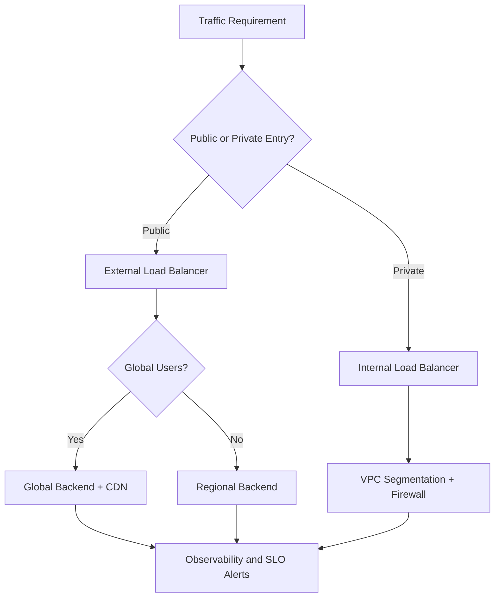
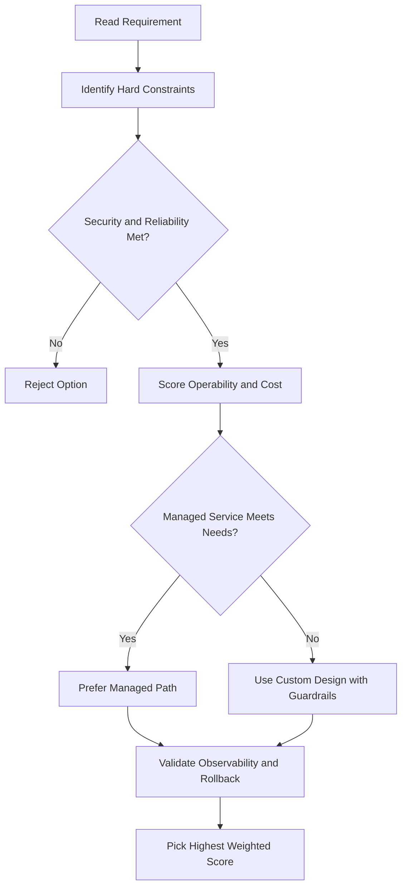
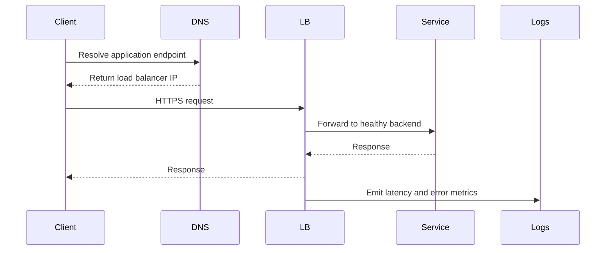

# 🧪 Lab: Internal vs External IPs on a VM

## Lab Goal

This lab demonstrates three key behaviors in Google Cloud:

- Every VM needs an internal IP address
- External IP addresses are optional
- Ephemeral external IPs can change after stop/start

---

## Step 1: Create a VM and Open Networking Options

From **Compute Engine > VM instances**:

1. Click **Create Instance**
2. Expand **Management, security, networking, sole tenancy**
3. Open the **Networking** section
4. Edit the network interface (pencil icon)

This is where you choose internal and external IP behavior.

---

## Step 2: Choose Internal and External IP Settings

Inside the network interface settings, you can select:

- VPC network/subnet
- Internal IP option
- External IP option

### Internal IP options

You can use:

- **Ephemeral internal IP** (auto-assigned)
- **Custom internal IP** (manually choose within subnet range)
- **Reserved static internal IP** (keep the same internal IP long-term)

### External IP options

You can use:

- **Ephemeral external IP**
- **Reserved static external IP**
- **None** (no external access)

Important: External IP is optional. Internal IP is not.

---

## Step 3: Instance and Address Capacity Notes

In the walkthrough example, subnet size is **/20**, which gives a large address pool (roughly 4096 addresses).

But address range size is not the only limit. Also consider:

- Project/network quotas
- VM-per-network limits (example mentioned around 15,000 at recording time)
- Actual regional/zonal hardware capacity

So having IP space does not always guarantee unlimited VM creation.

---

## Step 4: Create the VM and Observe IPs

After creation, note both values in the VM list/details:

- Internal IP
- External IP

Expected behavior:

- Internal IP is from your subnet range
- External ephemeral IP is from Google's public pool

---

## Step 5: Stop the VM and Watch IP Changes

1. Select VM
2. Click **Stop**
3. Confirm stop action

During stop:

- Google Cloud allows time for graceful shutdown (for example, shutdown scripts)
- If scripts exceed timeout, a forced stop can occur

After VM is stopped:

- External ephemeral IP is released
- Internal IP usually remains associated with the VM

---

## Step 6: Start the VM Again

1. Click **Start**
2. Wait for instance to return to Running
3. Compare old vs new IP values

Typical result in this scenario:

- Internal IP stayed the same
- External IP changed (because it was ephemeral)

---

## What This Lab Proves

- Internal IP addresses are required for VM networking
- External IP addresses are optional for internet-facing access
- Ephemeral external IPs are not guaranteed to persist across stop/start
- If you need a stable public endpoint, reserve and attach a static external IP

---

## Key Takeaway

When designing VM connectivity:

- Use internal IPs for private communication
- Add external IP only when required
- Use static external IP for stable DNS/integration endpoints
- Expect ephemeral external IP to change after VM lifecycle events like stop/start

---

## gcloud Commands

```bash
# Create a VM with no external IP
gcloud compute instances create my-vm --zone=us-central1-a \
  --network-interface=no-address

# Assign a static external IP to a running VM
gcloud compute instances add-access-config my-vm --zone=us-central1-a \
  --access-config-name="External NAT" --address=STATIC_IP

# View a VM's IP addresses
gcloud compute instances describe my-vm --zone=us-central1-a \
  --format="get(networkInterfaces)"
```

## ACE Exam-Style Practice Questions

### Q1
A Vm Internal External Ip Lab workload requires full OS control and custom runtime with strict policy against managed platforms. Which compute option is best?

A. Compute Engine
B. Cloud Run Functions
C. App Engine Standard
D. Dataflow

Answer: A
Trap: Full host-level control is a strong Compute Engine signal.

### Q2
In a Vm Internal External Ip Lab scenario, a fault-tolerant nightly batch workload is too expensive. What should you test and then use?

A. Spot or preemptible VMs after simulated interruption testing
B. Owner role on all instances
C. Single large sole-tenant node
D. Cloud DNS autoscaling

Answer: A
Trap: Interruptible workloads are classic candidates for discounted VM pricing models.

<!-- ACE_DEEP_ENRICHMENT_START -->
## ACE Deep Enrichment

### Think Like a Google Engineer
- Primary optimization axis: Latency-resilience balance with private-by-default connectivity.
- Start with constraints first: SLO, security, compliance, latency, budget, and team operations capacity.
- Prefer managed services if they satisfy requirements with lower long-term operational toil.
- Minimize blast radius using environment isolation, least privilege, and failure-domain awareness.
- Design for day-2 operations: observability, rollback strategy, and quota or budget guardrails.

### Most Correct Option Filter (60 Seconds)
1. Eliminate options with broad access, single points of failure, or missing monitoring.
2. Confirm the option meets non-negotiables first: security and reliability requirements.
3. Compare remaining options on operational simplicity and long-term maintainability.
4. Use cost as an optimizer only after requirements and risk controls are satisfied.

### Weighted Decision Matrix
| Dimension | Weight | Strong Signal |
| --- | --- | --- |
| Security | 3 | Least privilege, secure defaults, no exposed blast radius |
| Reliability | 3 | Multi-zone or HA design, health checks, tested recovery path |
| Operability | 2 | Clear monitoring, alerting, rollout and rollback simplicity |
| Cost Efficiency | 2 | Right-sized resources, no waste, no reliability regression |
| Performance | 1 | Meets latency and throughput targets with headroom |

### Real-Life Scenario
An ecommerce platform serves customers across regions. The team must keep latency low, protect internal services, and survive zonal failures while controlling egress costs.

### Worked Example
- Place internet-facing services behind the correct external load balancer type.
- Keep internal services private with internal load balancers and private IP ranges.
- Use firewall rules by tags or service accounts, not wide open CIDR ranges.
- Add Cloud CDN or regional placement based on traffic profile and content type.

### Flowchart


### Optimization Decision Flow


### Interaction Sequence


### Extra Exam Practice (15 Questions)
#### Q1

Scenario Focus: 🧪 Lab: Internal vs External IPs on a VM

A service must be reachable only from internal VMs. Which design is best?

A. Use an internal load balancer with private backend endpoints and private DNS.  
B. Expose the service publicly and rely on app-level passwords.  
C. Use one VM with a static external IP to simplify architecture.  
D. Allow 0.0.0.0/0 ingress to speed up troubleshooting.

Answer: A  
Why the other options are weaker: They typically ignore at least one hard constraint such as security, reliability, cost efficiency, or operational simplicity.  
Google-engineer check: Reconfirm SLO fit, blast radius, and day-2 maintainability before finalizing.

#### Q2

Scenario Focus: 🧪 Lab: Internal vs External IPs on a VM

You need to reduce global web latency for static assets. What should you choose?

A. Use one VM with a static external IP to simplify architecture.  
B. Use an external application load balancer with Cloud CDN and cacheable content rules.  
C. Allow 0.0.0.0/0 ingress to speed up troubleshooting.  
D. Disable health checks to avoid accidental failover.

Answer: B  
Why the other options are weaker: They typically ignore at least one hard constraint such as security, reliability, cost efficiency, or operational simplicity.  
Google-engineer check: Reconfirm SLO fit, blast radius, and day-2 maintainability before finalizing.

#### Q3

Scenario Focus: 🧪 Lab: Internal vs External IPs on a VM

Which firewall strategy best matches zero-trust network design?

A. Allow 0.0.0.0/0 ingress to speed up troubleshooting.  
B. Disable health checks to avoid accidental failover.  
C. Use least-privilege firewall policies scoped by service accounts or tags.  
D. Route all traffic through manual bastion hops in production.

Answer: C  
Why the other options are weaker: They typically ignore at least one hard constraint such as security, reliability, cost efficiency, or operational simplicity.  
Google-engineer check: Reconfirm SLO fit, blast radius, and day-2 maintainability before finalizing.

#### Q4

Scenario Focus: 🧪 Lab: Internal vs External IPs on a VM

A backend fails health checks in one zone. What architecture is best practice?

A. Disable health checks to avoid accidental failover.  
B. Route all traffic through manual bastion hops in production.  
C. Expose the service publicly and rely on app-level passwords.  
D. Run multi-zone backends with health checks and automatic failover.

Answer: D  
Why the other options are weaker: They typically ignore at least one hard constraint such as security, reliability, cost efficiency, or operational simplicity.  
Google-engineer check: Reconfirm SLO fit, blast radius, and day-2 maintainability before finalizing.

#### Q5

Scenario Focus: 🧪 Lab: Internal vs External IPs on a VM

You need private hybrid connectivity between on-prem and GCP. Which path is preferred?

A. Use HA VPN or Interconnect based on throughput and SLA requirements.  
B. Route all traffic through manual bastion hops in production.  
C. Expose the service publicly and rely on app-level passwords.  
D. Use one VM with a static external IP to simplify architecture.

Answer: A  
Why the other options are weaker: They typically ignore at least one hard constraint such as security, reliability, cost efficiency, or operational simplicity.  
Google-engineer check: Reconfirm SLO fit, blast radius, and day-2 maintainability before finalizing.

#### Q6

Scenario Focus: 🧪 Lab: Internal vs External IPs on a VM

Two designs both satisfy the happy path for 🧪 Lab: Internal vs External IPs on a VM. Which choice is most correct?

A. Expose the service publicly and rely on app-level passwords.  
B. Choose the option that preserves reliability and security while reducing operational burden.  
C. Use one VM with a static external IP to simplify architecture.  
D. Allow 0.0.0.0/0 ingress to speed up troubleshooting.

Answer: B  
Why the other options are weaker: They typically ignore at least one hard constraint such as security, reliability, cost efficiency, or operational simplicity.  
Google-engineer check: Reconfirm SLO fit, blast radius, and day-2 maintainability before finalizing.

#### Q7

Scenario Focus: 🧪 Lab: Internal vs External IPs on a VM

What should you validate first before choosing an architecture for 🧪 Lab: Internal vs External IPs on a VM?

A. Use one VM with a static external IP to simplify architecture.  
B. Allow 0.0.0.0/0 ingress to speed up troubleshooting.  
C. Validate SLO fit, blast radius, and least-privilege controls before comparing convenience.  
D. Disable health checks to avoid accidental failover.

Answer: C  
Why the other options are weaker: They typically ignore at least one hard constraint such as security, reliability, cost efficiency, or operational simplicity.  
Google-engineer check: Reconfirm SLO fit, blast radius, and day-2 maintainability before finalizing.

#### Q8

Scenario Focus: 🧪 Lab: Internal vs External IPs on a VM

A proposal lowers cost but increases failure risk. What is the best decision?

A. Allow 0.0.0.0/0 ingress to speed up troubleshooting.  
B. Disable health checks to avoid accidental failover.  
C. Route all traffic through manual bastion hops in production.  
D. Reject it unless reliability and recovery objectives remain within required targets.

Answer: D  
Why the other options are weaker: They typically ignore at least one hard constraint such as security, reliability, cost efficiency, or operational simplicity.  
Google-engineer check: Reconfirm SLO fit, blast radius, and day-2 maintainability before finalizing.

#### Q9

Scenario Focus: 🧪 Lab: Internal vs External IPs on a VM

Which option best reflects optimization for Latency-resilience balance with private-by-default connectivity?

A. Select the design that best meets Latency-resilience balance with private-by-default connectivity while keeping constraints balanced.  
B. Disable health checks to avoid accidental failover.  
C. Route all traffic through manual bastion hops in production.  
D. Expose the service publicly and rely on app-level passwords.

Answer: A  
Why the other options are weaker: They typically ignore at least one hard constraint such as security, reliability, cost efficiency, or operational simplicity.  
Google-engineer check: Reconfirm SLO fit, blast radius, and day-2 maintainability before finalizing.

#### Q10

Scenario Focus: 🧪 Lab: Internal vs External IPs on a VM

How should you evaluate a design that needs frequent manual interventions?

A. Route all traffic through manual bastion hops in production.  
B. Treat it as high risk and prefer automation-friendly designs with observability and rollback.  
C. Expose the service publicly and rely on app-level passwords.  
D. Use one VM with a static external IP to simplify architecture.

Answer: B  
Why the other options are weaker: They typically ignore at least one hard constraint such as security, reliability, cost efficiency, or operational simplicity.  
Google-engineer check: Reconfirm SLO fit, blast radius, and day-2 maintainability before finalizing.

#### Q11

Scenario Focus: 🧪 Lab: Internal vs External IPs on a VM

Two options have similar latency. Which tie-breaker is best?

A. Expose the service publicly and rely on app-level passwords.  
B. Use one VM with a static external IP to simplify architecture.  
C. Pick the option with stronger operability, clearer failure isolation, and simpler incident response.  
D. Allow 0.0.0.0/0 ingress to speed up troubleshooting.

Answer: C  
Why the other options are weaker: They typically ignore at least one hard constraint such as security, reliability, cost efficiency, or operational simplicity.  
Google-engineer check: Reconfirm SLO fit, blast radius, and day-2 maintainability before finalizing.

#### Q12

Scenario Focus: 🧪 Lab: Internal vs External IPs on a VM

What is the best way to choose between a custom stack and a managed service?

A. Use one VM with a static external IP to simplify architecture.  
B. Allow 0.0.0.0/0 ingress to speed up troubleshooting.  
C. Disable health checks to avoid accidental failover.  
D. Prefer managed services when they meet requirements with lower long-term maintenance effort.

Answer: D  
Why the other options are weaker: They typically ignore at least one hard constraint such as security, reliability, cost efficiency, or operational simplicity.  
Google-engineer check: Reconfirm SLO fit, blast radius, and day-2 maintainability before finalizing.

#### Q13

Scenario Focus: 🧪 Lab: Internal vs External IPs on a VM

How do you confirm a solution is production-ready for 

A. Verify monitoring, alerting, rollback path, quota and budget controls, and secure defaults.  
B. Allow 0.0.0.0/0 ingress to speed up troubleshooting.  
C. Disable health checks to avoid accidental failover.  
D. Route all traffic through manual bastion hops in production.

Answer: A  
Why the other options are weaker: They typically ignore at least one hard constraint such as security, reliability, cost efficiency, or operational simplicity.  
Google-engineer check: Reconfirm SLO fit, blast radius, and day-2 maintainability before finalizing.

#### Q14

Scenario Focus: 🧪 Lab: Internal vs External IPs on a VM

Which pattern usually wins in ACE scenario tie-breakers?

A. Disable health checks to avoid accidental failover.  
B. Managed-service-first plus least-privilege access plus clear observability usually wins.  
C. Route all traffic through manual bastion hops in production.  
D. Expose the service publicly and rely on app-level passwords.

Answer: B  
Why the other options are weaker: They typically ignore at least one hard constraint such as security, reliability, cost efficiency, or operational simplicity.  
Google-engineer check: Reconfirm SLO fit, blast radius, and day-2 maintainability before finalizing.

#### Q15

Scenario Focus: 🧪 Lab: Internal vs External IPs on a VM

What is the best final check before locking the answer?

A. Route all traffic through manual bastion hops in production.  
B. Expose the service publicly and rely on app-level passwords.  
C. Run a weighted check across security, reliability, cost, performance, and operability.  
D. Use one VM with a static external IP to simplify architecture.

Answer: C  
Why the other options are weaker: They typically ignore at least one hard constraint such as security, reliability, cost efficiency, or operational simplicity.  
Google-engineer check: Reconfirm SLO fit, blast radius, and day-2 maintainability before finalizing.

### Quick Commands
```bash
gcloud compute firewall-rules list --project=PROJECT_ID
gcloud compute forwarding-rules list --global --project=PROJECT_ID
gcloud compute backend-services get-health BACKEND_NAME --global --project=PROJECT_ID
gcloud compute routes list --project=PROJECT_ID
```

### Fast Recall
- Pick load balancer type by traffic pattern, not preference.
- Private services should stay private end to end.
- Health checks and multi-zone design are core reliability controls.
<!-- ACE_DEEP_ENRICHMENT_END -->