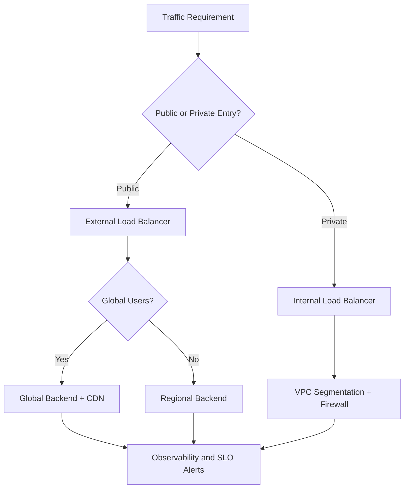
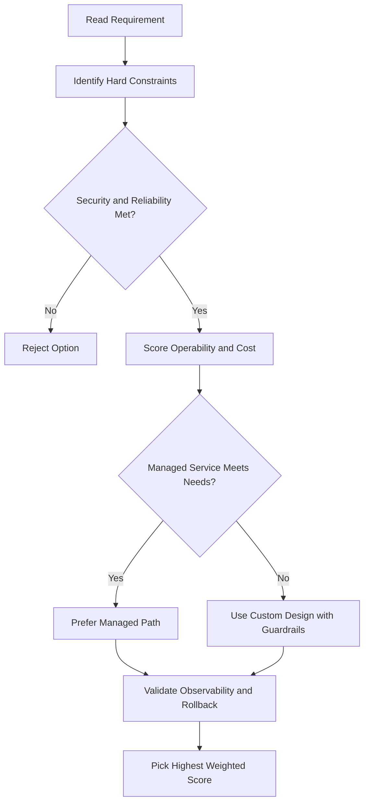
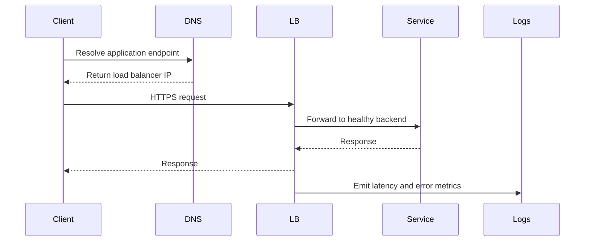

# 🛣️ Routes and Firewall Rules in Google Cloud

## What This Section Covers

After understanding networks, subnets, and IPs, the next layer is how traffic actually flows.

That involves:

- **Routes** — decide where packets go
- **Firewall rules** — decide whether packets are allowed

---

## Routes

A **route** is an instruction that tells Google Cloud how to deliver packets to a destination IP address.

Every network automatically includes default routes that:

- Allow instances on the same network to communicate with each other (even across subnets)
- Allow instances to send traffic to destinations outside the network (to the internet)

---

## Creating Additional Routes

You can create custom routes that override the default behavior.

However, **just creating a route is not enough**.

For traffic to actually flow:

1. A matching route must exist (tells where to send the packet)
2. A matching firewall rule must allow it (approves the traffic)

Both conditions are required.

---

## Default Firewall Behavior

The **default network** comes pre-configured with firewall rules that allow:

- All instances in the network to talk to each other
- Some basic protocols

But **manually created networks** do NOT have these rules by default.

If you create a custom network, you must create firewall rules yourself to allow communication between instances.

---

## How Routes Work

Routes are evaluated based on **destination IP address**.

Each route may apply to:

- A specific instance (using instance tags)
- All instances in the network (if no tags specified)

When a packet leaves a VM:

1. Google Cloud checks the VM's routing table
2. Finds a matching route based on destination IP
3. Uses that route to determine the next hop

---

## The Virtual Router

At the core of each VPC network is a **virtual router**.

Think of it as:

- A logical router that every VM connects to
- Every packet leaving a VM goes through this router first
- The router consults the routing table to decide where to send the packet

This massively scalable virtual architecture allows:

- Thousands of VMs in one network
- Consistent routing behavior
- Centralized routing policy

---

## Firewall Rules

**Firewall rules** protect VMs from unapproved connections.

They apply to:

- Inbound connections (**ingress**)
- Outbound connections (**egress**)

A VPC network acts as a **distributed firewall** between:

- Instances and external networks
- Individual instances within the same network

So firewall rules can restrict communication even between VMs on the same subnet.

---

## Firewall Rules Are Stateful

An important property: **firewall rules are stateful**.

That means:

- If a connection is allowed from source A to destination B, the return traffic is also allowed
- You do not need separate rules for each direction once a session starts
- Bidirectional communication happens automatically for established connections

---

## What Happens if All Rules Are Deleted

If all firewall rules in a network are removed:

- There is an implied **"Deny all" ingress** rule (blocks incoming)
- There is an implied **"Allow all" egress** rule (allows outgoing)

This safe default prevents accidental misconfiguration from leaving instances wide open.

---

## Firewall Rule Components

Every firewall rule has:

### 1) Direction

- **Ingress** — incoming connections to the instance
- **Egress** — outgoing connections from the instance

### 2) Source or Destination

- **Ingress rules** match by source IP CIDR range
- **Egress rules** match by destination IP CIDR range

### 3) Protocol and Port

Rules can specify:

- Specific protocols (TCP, UDP, ICMP, etc.)
- Specific ports
- All protocols
- All ports

### 4) Action

- **Allow** — permit matching traffic
- **Deny** — block matching traffic

### 5) Priority

Rules are evaluated in priority order.

The first matching rule is applied, and later rules do not override it.

Lower priority number = evaluated first.

### 6) Target Assignment

By default, rules apply to all instances in the network.

But you can limit rules to specific instances using **tags**.

---

## Egress Firewall Rules

**Egress** rules control outbound connections from VMs.

### Egress Allow Rules

Permit specific outbound connections based on:

- Destination IP range
- Protocol
- Port

### Egress Deny Rules

Block specific outbound connections to:

- External hosts (prevent data exfiltration)
- Specific Google Cloud IP ranges (prevent internal misconfiguration)

Example use case:

- Prevent a VM from connecting to suspicious external IPs
- Prevent a VM in one subnet from connecting to a database VM in another subnet (enforce microservice boundaries)

---

## Ingress Firewall Rules

**Ingress** rules control incoming connections to VMs.

### Ingress Allow Rules

Permit specific inbound connections based on:

- Source IP range
- Protocol
- Port

### Ingress Deny Rules

Block specific inbound connections from:

- External networks (prevent unauthorized external access)
- Specific Google Cloud IP ranges (prevent internal unauthorized access)

Example use case:

- Allow external web traffic to port 443 (HTTPS) only
- Block a VM from receiving connections from untrusted internal networks

---

## Firewall Rule Design

When designing firewall rules:

- Use source/destination CIDR ranges to be specific
- Use tags to apply rules to certain instances only
- Combine with routes to enforce network topology
- Remember stateful behavior means you only need allow rules in one direction
- Set appropriate priorities to avoid conflicts

---

## Key Takeaway

Routes and firewall rules work together:

- **Routes** determine where packets go
- **Firewall rules** determine if packets are allowed

Both are required for traffic to flow successfully.

Understanding this two-layer approach helps you design secure, controlled networks in Google Cloud.

---

## gcloud Commands

```bash
# List routes in a network
gcloud compute routes list --filter="network=my-vpc"

# Create a custom route
gcloud compute routes create my-route --network=my-vpc \
  --destination-range=10.1.0.0/24 --next-hop-gateway=default-internet-gateway

# List firewall rules
gcloud compute firewall-rules list --filter="network=my-vpc"

# Create a firewall rule
gcloud compute firewall-rules create allow-ssh \
  --network=my-vpc --allow=tcp:22 --source-ranges=0.0.0.0/0

# Delete a firewall rule
gcloud compute firewall-rules delete allow-ssh
```

## ACE Exam-Style Practice Questions

### Q1
In a Routes And Firewall Rules architecture with autoscaling tiers, traffic must flow web to API to database only. How should you enforce this?

A. Separate projects without firewall policy
B. Tags or service-account-based firewall rules between tiers
C. DNS records only
D. Disable internal communication

Answer: B
Trap: Layered firewall policy with identity or tags is robust against autoscaling IP changes.

### Q2
A private VM in Routes And Firewall Rules needs outbound internet updates but no inbound internet. What should you configure?

A. External IP on each VM
B. Cloud NAT
C. Cloud Armor only
D. Internal TCP load balancer

Answer: B
Trap: Cloud NAT handles outbound internet for private instances without exposing inbound services.

<!-- ACE_DEEP_ENRICHMENT_START -->
## ACE Deep Enrichment

### Think Like a Google Engineer
- Primary optimization axis: Latency-resilience balance with private-by-default connectivity.
- Start with constraints first: SLO, security, compliance, latency, budget, and team operations capacity.
- Prefer managed services if they satisfy requirements with lower long-term operational toil.
- Minimize blast radius using environment isolation, least privilege, and failure-domain awareness.
- Design for day-2 operations: observability, rollback strategy, and quota or budget guardrails.

### Most Correct Option Filter (60 Seconds)
1. Eliminate options with broad access, single points of failure, or missing monitoring.
2. Confirm the option meets non-negotiables first: security and reliability requirements.
3. Compare remaining options on operational simplicity and long-term maintainability.
4. Use cost as an optimizer only after requirements and risk controls are satisfied.

### Weighted Decision Matrix
| Dimension | Weight | Strong Signal |
| --- | --- | --- |
| Security | 3 | Least privilege, secure defaults, no exposed blast radius |
| Reliability | 3 | Multi-zone or HA design, health checks, tested recovery path |
| Operability | 2 | Clear monitoring, alerting, rollout and rollback simplicity |
| Cost Efficiency | 2 | Right-sized resources, no waste, no reliability regression |
| Performance | 1 | Meets latency and throughput targets with headroom |

### Real-Life Scenario
An ecommerce platform serves customers across regions. The team must keep latency low, protect internal services, and survive zonal failures while controlling egress costs.

### Worked Example
- Place internet-facing services behind the correct external load balancer type.
- Keep internal services private with internal load balancers and private IP ranges.
- Use firewall rules by tags or service accounts, not wide open CIDR ranges.
- Add Cloud CDN or regional placement based on traffic profile and content type.

### Flowchart


### Optimization Decision Flow


### Interaction Sequence


### Extra Exam Practice (15 Questions)
#### Q1
Scenario Focus: 🛣️ Routes and Firewall Rules in Google Cloud
A service must be reachable only from internal VMs. Which design is best?

A. Use an internal load balancer with private backend endpoints and private DNS.
B. Expose the service publicly and rely on app-level passwords.
C. Use one VM with a static external IP to simplify architecture.
D. Allow 0.0.0.0/0 ingress to speed up troubleshooting.

Answer: A
Why the other options are weaker: They typically ignore at least one hard constraint such as security, reliability, cost efficiency, or operational simplicity.
Google-engineer check: Reconfirm SLO fit, blast radius, and day-2 maintainability before finalizing.

#### Q2
Scenario Focus: 🛣️ Routes and Firewall Rules in Google Cloud
You need to reduce global web latency for static assets. What should you choose?

A. Use one VM with a static external IP to simplify architecture.
B. Use an external application load balancer with Cloud CDN and cacheable content rules.
C. Allow 0.0.0.0/0 ingress to speed up troubleshooting.
D. Disable health checks to avoid accidental failover.

Answer: B
Why the other options are weaker: They typically ignore at least one hard constraint such as security, reliability, cost efficiency, or operational simplicity.
Google-engineer check: Reconfirm SLO fit, blast radius, and day-2 maintainability before finalizing.

#### Q3
Scenario Focus: 🛣️ Routes and Firewall Rules in Google Cloud
Which firewall strategy best matches zero-trust network design?

A. Allow 0.0.0.0/0 ingress to speed up troubleshooting.
B. Disable health checks to avoid accidental failover.
C. Use least-privilege firewall policies scoped by service accounts or tags.
D. Route all traffic through manual bastion hops in production.

Answer: C
Why the other options are weaker: They typically ignore at least one hard constraint such as security, reliability, cost efficiency, or operational simplicity.
Google-engineer check: Reconfirm SLO fit, blast radius, and day-2 maintainability before finalizing.

#### Q4
Scenario Focus: 🛣️ Routes and Firewall Rules in Google Cloud
A backend fails health checks in one zone. What architecture is best practice?

A. Disable health checks to avoid accidental failover.
B. Route all traffic through manual bastion hops in production.
C. Expose the service publicly and rely on app-level passwords.
D. Run multi-zone backends with health checks and automatic failover.

Answer: D
Why the other options are weaker: They typically ignore at least one hard constraint such as security, reliability, cost efficiency, or operational simplicity.
Google-engineer check: Reconfirm SLO fit, blast radius, and day-2 maintainability before finalizing.

#### Q5
Scenario Focus: 🛣️ Routes and Firewall Rules in Google Cloud
You need private hybrid connectivity between on-prem and GCP. Which path is preferred?

A. Use HA VPN or Interconnect based on throughput and SLA requirements.
B. Route all traffic through manual bastion hops in production.
C. Expose the service publicly and rely on app-level passwords.
D. Use one VM with a static external IP to simplify architecture.

Answer: A
Why the other options are weaker: They typically ignore at least one hard constraint such as security, reliability, cost efficiency, or operational simplicity.
Google-engineer check: Reconfirm SLO fit, blast radius, and day-2 maintainability before finalizing.

#### Q6
Scenario Focus: 🛣️ Routes and Firewall Rules in Google Cloud
Two designs both satisfy the happy path for 🛣️ Routes and Firewall Rules in Google Cloud. Which choice is most correct?

A. Expose the service publicly and rely on app-level passwords.
B. Choose the option that preserves reliability and security while reducing operational burden.
C. Use one VM with a static external IP to simplify architecture.
D. Allow 0.0.0.0/0 ingress to speed up troubleshooting.

Answer: B
Why the other options are weaker: They typically ignore at least one hard constraint such as security, reliability, cost efficiency, or operational simplicity.
Google-engineer check: Reconfirm SLO fit, blast radius, and day-2 maintainability before finalizing.

#### Q7
Scenario Focus: 🛣️ Routes and Firewall Rules in Google Cloud
What should you validate first before choosing an architecture for 🛣️ Routes and Firewall Rules in Google Cloud?

A. Use one VM with a static external IP to simplify architecture.
B. Allow 0.0.0.0/0 ingress to speed up troubleshooting.
C. Validate SLO fit, blast radius, and least-privilege controls before comparing convenience.
D. Disable health checks to avoid accidental failover.

Answer: C
Why the other options are weaker: They typically ignore at least one hard constraint such as security, reliability, cost efficiency, or operational simplicity.
Google-engineer check: Reconfirm SLO fit, blast radius, and day-2 maintainability before finalizing.

#### Q8
Scenario Focus: 🛣️ Routes and Firewall Rules in Google Cloud
A proposal lowers cost but increases failure risk. What is the best decision?

A. Allow 0.0.0.0/0 ingress to speed up troubleshooting.
B. Disable health checks to avoid accidental failover.
C. Route all traffic through manual bastion hops in production.
D. Reject it unless reliability and recovery objectives remain within required targets.

Answer: D
Why the other options are weaker: They typically ignore at least one hard constraint such as security, reliability, cost efficiency, or operational simplicity.
Google-engineer check: Reconfirm SLO fit, blast radius, and day-2 maintainability before finalizing.

#### Q9
Scenario Focus: 🛣️ Routes and Firewall Rules in Google Cloud
Which option best reflects optimization for Latency-resilience balance with private-by-default connectivity?

A. Select the design that best meets Latency-resilience balance with private-by-default connectivity while keeping constraints balanced.
B. Disable health checks to avoid accidental failover.
C. Route all traffic through manual bastion hops in production.
D. Expose the service publicly and rely on app-level passwords.

Answer: A
Why the other options are weaker: They typically ignore at least one hard constraint such as security, reliability, cost efficiency, or operational simplicity.
Google-engineer check: Reconfirm SLO fit, blast radius, and day-2 maintainability before finalizing.

#### Q10
Scenario Focus: 🛣️ Routes and Firewall Rules in Google Cloud
How should you evaluate a design that needs frequent manual interventions?

A. Route all traffic through manual bastion hops in production.
B. Treat it as high risk and prefer automation-friendly designs with observability and rollback.
C. Expose the service publicly and rely on app-level passwords.
D. Use one VM with a static external IP to simplify architecture.

Answer: B
Why the other options are weaker: They typically ignore at least one hard constraint such as security, reliability, cost efficiency, or operational simplicity.
Google-engineer check: Reconfirm SLO fit, blast radius, and day-2 maintainability before finalizing.

#### Q11
Scenario Focus: 🛣️ Routes and Firewall Rules in Google Cloud
Two options have similar latency. Which tie-breaker is best?

A. Expose the service publicly and rely on app-level passwords.
B. Use one VM with a static external IP to simplify architecture.
C. Pick the option with stronger operability, clearer failure isolation, and simpler incident response.
D. Allow 0.0.0.0/0 ingress to speed up troubleshooting.

Answer: C
Why the other options are weaker: They typically ignore at least one hard constraint such as security, reliability, cost efficiency, or operational simplicity.
Google-engineer check: Reconfirm SLO fit, blast radius, and day-2 maintainability before finalizing.

#### Q12
Scenario Focus: 🛣️ Routes and Firewall Rules in Google Cloud
What is the best way to choose between a custom stack and a managed service?

A. Use one VM with a static external IP to simplify architecture.
B. Allow 0.0.0.0/0 ingress to speed up troubleshooting.
C. Disable health checks to avoid accidental failover.
D. Prefer managed services when they meet requirements with lower long-term maintenance effort.

Answer: D
Why the other options are weaker: They typically ignore at least one hard constraint such as security, reliability, cost efficiency, or operational simplicity.
Google-engineer check: Reconfirm SLO fit, blast radius, and day-2 maintainability before finalizing.

#### Q13
Scenario Focus: 🛣️ Routes and Firewall Rules in Google Cloud
How do you confirm a solution is production-ready for 

A. Verify monitoring, alerting, rollback path, quota and budget controls, and secure defaults.
B. Allow 0.0.0.0/0 ingress to speed up troubleshooting.
C. Disable health checks to avoid accidental failover.
D. Route all traffic through manual bastion hops in production.

Answer: A
Why the other options are weaker: They typically ignore at least one hard constraint such as security, reliability, cost efficiency, or operational simplicity.
Google-engineer check: Reconfirm SLO fit, blast radius, and day-2 maintainability before finalizing.

#### Q14
Scenario Focus: 🛣️ Routes and Firewall Rules in Google Cloud
Which pattern usually wins in ACE scenario tie-breakers?

A. Disable health checks to avoid accidental failover.
B. Managed-service-first plus least-privilege access plus clear observability usually wins.
C. Route all traffic through manual bastion hops in production.
D. Expose the service publicly and rely on app-level passwords.

Answer: B
Why the other options are weaker: They typically ignore at least one hard constraint such as security, reliability, cost efficiency, or operational simplicity.
Google-engineer check: Reconfirm SLO fit, blast radius, and day-2 maintainability before finalizing.

#### Q15
Scenario Focus: 🛣️ Routes and Firewall Rules in Google Cloud
What is the best final check before locking the answer?

A. Route all traffic through manual bastion hops in production.
B. Expose the service publicly and rely on app-level passwords.
C. Run a weighted check across security, reliability, cost, performance, and operability.
D. Use one VM with a static external IP to simplify architecture.

Answer: C
Why the other options are weaker: They typically ignore at least one hard constraint such as security, reliability, cost efficiency, or operational simplicity.
Google-engineer check: Reconfirm SLO fit, blast radius, and day-2 maintainability before finalizing.

### Quick Commands
```bash
gcloud compute firewall-rules list --project=PROJECT_ID
gcloud compute forwarding-rules list --global --project=PROJECT_ID
gcloud compute backend-services get-health BACKEND_NAME --global --project=PROJECT_ID
gcloud compute routes list --project=PROJECT_ID
```

### Fast Recall
- Pick load balancer type by traffic pattern, not preference.
- Private services should stay private end to end.
- Health checks and multi-zone design are core reliability controls.
<!-- ACE_DEEP_ENRICHMENT_END -->