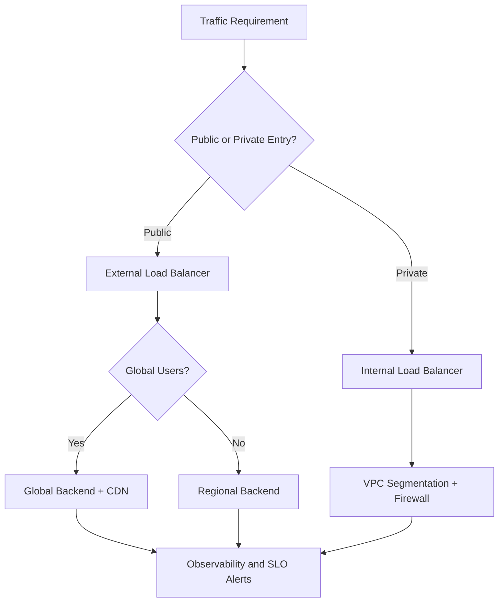
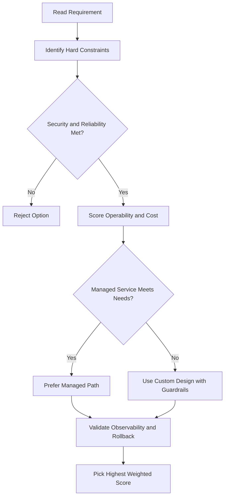
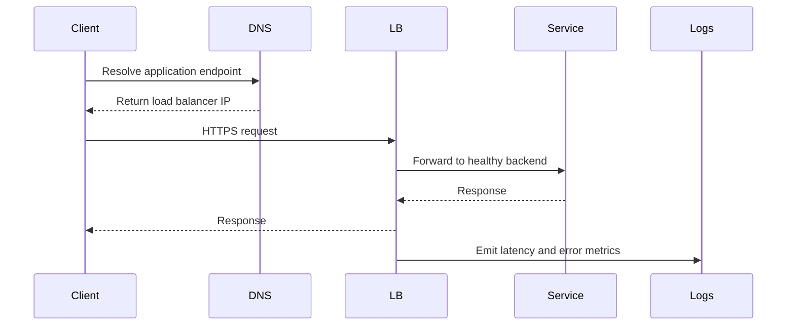

# 💰 Network Pricing in Google Cloud

## Overview

Understanding when you're charged for network traffic is important for cost management in Google Cloud. Different traffic types have different pricing rules.

## Ingress Traffic (Coming In)

**Free** — Traffic coming into Google Cloud is not charged.

**Exception:** If you have a resource like a Load Balancer actively processing the ingress traffic, you pay for that service (but not for the ingress itself).

## Egress Traffic (Going Out)

Responses to requests count as egress and **are charged**.

### Free Egress Scenarios

| Scenario                                                   | Cost    |
| ---------------------------------------------------------- | ------- |
| Same zone egress (via internal IP)                         | ✅ Free |
| Traffic to Google products (YouTube, Maps, Drive, Gmail)   | ✅ Free |
| Traffic to another Google Cloud service in the same region | ✅ Free |

### Charged Egress Scenarios

| Scenario                                 | Cost       |
| ---------------------------------------- | ---------- |
| Between zones in the same region         | ❌ Charged |
| Same zone egress via external IP address | ❌ Charged |
| Between different regions                | ❌ Charged |

**Why external IP costs more in same zone:** Google Cloud cannot determine a VM's zone from its external IP address, so traffic through an external IP is treated as if it's going between zones.

## External IP Address Pricing

You pay for both static and ephemeral external IPs when they're assigned to a resource.

### IP Address Costs

| IP Type                                           | Cost                           |
| ------------------------------------------------- | ------------------------------ |
| Static IP in use                                  | Standard charge                |
| Ephemeral IP in use                               | Standard charge                |
| Static IP **not** assigned to any resource (idle) | Higher charge                  |
| External IP on preemptible VMs                    | Lower charge than standard VMs |

**Key insight:** Unused static IPs cost more than in-use IPs, so release IPs you're not actively using.

## Cost Estimation: Pricing Calculator

### What It Is

A web-based tool that helps you estimate costs for Google Cloud resources.

### How to Use It

1. Specify your expected resource usage:
   - Instance type (e.g., `n1-standard-4`)
   - Region (e.g., `us-central1`)
   - Monthly egress traffic volumes (e.g., 100 GB to Americas)

2. The calculator returns a total estimated cost

3. You can:
   - Adjust currency and time frame (monthly, yearly, etc.)
   - Email the estimate to yourself
   - Save to a unique URL for future reference

### Example

Specify `n1-standard-2` instance in `us-central1` with 100 GB monthly egress to Americas and EMEA → Get total monthly cost estimate.

## Key Takeaways

- ✅ **Ingress is free** (unless processed by a load balancer)
- ❌ **Egress is usually charged** (except to Google services or same-zone same-region via internal IP)
- 💡 **Use internal IPs** to avoid inter-zone charges within a region
- 💡 **Release unused static IPs** to avoid overpaying
- 🧮 **Use the pricing calculator** before deploying to estimate costs
- ⚠️ **Pricing changes** — Always check official Google Cloud pricing documentation for current rates

---

## gcloud Commands

```bash
# List reserved IP addresses (unused ones still cost money)
gcloud compute addresses list

# Describe a project's billing account
gcloud billing projects describe PROJECT_ID

# List billing accounts
gcloud billing accounts list
```

## ACE Exam-Style Practice Questions

### Q1
In a Network Pricing scenario, two answers seem technically possible. What tie-breaker should you apply first?

A. Pick the option with most manual steps
B. Pick the option with least privilege and least operational overhead that still meets requirements
C. Pick highest-cost option
D. Pick the oldest product

Answer: B
Trap: ACE-style scenarios reward secure, managed, requirement-fit decisions.

### Q2
For Network Pricing, what is the best way to reduce wrong answers in multi-choice questions?

A. Ignore scaling and security words
B. Identify trigger words, eliminate over-privileged choices, then choose the managed fit
C. Always pick Compute Engine
D. Always pick the shortest option

Answer: B
Trap: Structured elimination is more reliable than memorization alone.

<!-- ACE_DEEP_ENRICHMENT_START -->
## ACE Deep Enrichment

### Think Like a Google Engineer
- Primary optimization axis: Latency-resilience balance with private-by-default connectivity.
- Start with constraints first: SLO, security, compliance, latency, budget, and team operations capacity.
- Prefer managed services if they satisfy requirements with lower long-term operational toil.
- Minimize blast radius using environment isolation, least privilege, and failure-domain awareness.
- Design for day-2 operations: observability, rollback strategy, and quota or budget guardrails.

### Most Correct Option Filter (60 Seconds)
1. Eliminate options with broad access, single points of failure, or missing monitoring.
2. Confirm the option meets non-negotiables first: security and reliability requirements.
3. Compare remaining options on operational simplicity and long-term maintainability.
4. Use cost as an optimizer only after requirements and risk controls are satisfied.

### Weighted Decision Matrix
| Dimension | Weight | Strong Signal |
| --- | --- | --- |
| Security | 3 | Least privilege, secure defaults, no exposed blast radius |
| Reliability | 3 | Multi-zone or HA design, health checks, tested recovery path |
| Operability | 2 | Clear monitoring, alerting, rollout and rollback simplicity |
| Cost Efficiency | 2 | Right-sized resources, no waste, no reliability regression |
| Performance | 1 | Meets latency and throughput targets with headroom |

### Real-Life Scenario
An ecommerce platform serves customers across regions. The team must keep latency low, protect internal services, and survive zonal failures while controlling egress costs.

### Worked Example
- Place internet-facing services behind the correct external load balancer type.
- Keep internal services private with internal load balancers and private IP ranges.
- Use firewall rules by tags or service accounts, not wide open CIDR ranges.
- Add Cloud CDN or regional placement based on traffic profile and content type.

### Flowchart


### Optimization Decision Flow


### Interaction Sequence


### Extra Exam Practice (10 Questions)
#### Q1
Scenario Focus: 💰 Network Pricing in Google Cloud
A service must be reachable only from internal VMs. Which design is best?

A. Use an internal load balancer with private backend endpoints and private DNS.
B. Expose the service publicly and rely on app-level passwords.
C. Use one VM with a static external IP to simplify architecture.
D. Allow 0.0.0.0/0 ingress to speed up troubleshooting.

Answer: A
Why the other options are weaker: They typically ignore at least one hard constraint such as security, reliability, cost efficiency, or operational simplicity.
Google-engineer check: Reconfirm SLO fit, blast radius, and day-2 maintainability before finalizing.

#### Q2
Scenario Focus: 💰 Network Pricing in Google Cloud
You need to reduce global web latency for static assets. What should you choose?

A. Use one VM with a static external IP to simplify architecture.
B. Use an external application load balancer with Cloud CDN and cacheable content rules.
C. Allow 0.0.0.0/0 ingress to speed up troubleshooting.
D. Disable health checks to avoid accidental failover.

Answer: B
Why the other options are weaker: They typically ignore at least one hard constraint such as security, reliability, cost efficiency, or operational simplicity.
Google-engineer check: Reconfirm SLO fit, blast radius, and day-2 maintainability before finalizing.

#### Q3
Scenario Focus: 💰 Network Pricing in Google Cloud
Which firewall strategy best matches zero-trust network design?

A. Allow 0.0.0.0/0 ingress to speed up troubleshooting.
B. Disable health checks to avoid accidental failover.
C. Use least-privilege firewall policies scoped by service accounts or tags.
D. Route all traffic through manual bastion hops in production.

Answer: C
Why the other options are weaker: They typically ignore at least one hard constraint such as security, reliability, cost efficiency, or operational simplicity.
Google-engineer check: Reconfirm SLO fit, blast radius, and day-2 maintainability before finalizing.

#### Q4
Scenario Focus: 💰 Network Pricing in Google Cloud
A backend fails health checks in one zone. What architecture is best practice?

A. Disable health checks to avoid accidental failover.
B. Route all traffic through manual bastion hops in production.
C. Expose the service publicly and rely on app-level passwords.
D. Run multi-zone backends with health checks and automatic failover.

Answer: D
Why the other options are weaker: They typically ignore at least one hard constraint such as security, reliability, cost efficiency, or operational simplicity.
Google-engineer check: Reconfirm SLO fit, blast radius, and day-2 maintainability before finalizing.

#### Q5
Scenario Focus: 💰 Network Pricing in Google Cloud
You need private hybrid connectivity between on-prem and GCP. Which path is preferred?

A. Use HA VPN or Interconnect based on throughput and SLA requirements.
B. Route all traffic through manual bastion hops in production.
C. Expose the service publicly and rely on app-level passwords.
D. Use one VM with a static external IP to simplify architecture.

Answer: A
Why the other options are weaker: They typically ignore at least one hard constraint such as security, reliability, cost efficiency, or operational simplicity.
Google-engineer check: Reconfirm SLO fit, blast radius, and day-2 maintainability before finalizing.

#### Q6
Scenario Focus: 💰 Network Pricing in Google Cloud
Two designs both satisfy the happy path for 💰 Network Pricing in Google Cloud. Which choice is most correct?

A. Expose the service publicly and rely on app-level passwords.
B. Choose the option that preserves reliability and security while reducing operational burden.
C. Use one VM with a static external IP to simplify architecture.
D. Allow 0.0.0.0/0 ingress to speed up troubleshooting.

Answer: B
Why the other options are weaker: They typically ignore at least one hard constraint such as security, reliability, cost efficiency, or operational simplicity.
Google-engineer check: Reconfirm SLO fit, blast radius, and day-2 maintainability before finalizing.

#### Q7
Scenario Focus: 💰 Network Pricing in Google Cloud
What should you validate first before choosing an architecture for 💰 Network Pricing in Google Cloud?

A. Use one VM with a static external IP to simplify architecture.
B. Allow 0.0.0.0/0 ingress to speed up troubleshooting.
C. Validate SLO fit, blast radius, and least-privilege controls before comparing convenience.
D. Disable health checks to avoid accidental failover.

Answer: C
Why the other options are weaker: They typically ignore at least one hard constraint such as security, reliability, cost efficiency, or operational simplicity.
Google-engineer check: Reconfirm SLO fit, blast radius, and day-2 maintainability before finalizing.

#### Q8
Scenario Focus: 💰 Network Pricing in Google Cloud
A proposal lowers cost but increases failure risk. What is the best decision?

A. Allow 0.0.0.0/0 ingress to speed up troubleshooting.
B. Disable health checks to avoid accidental failover.
C. Route all traffic through manual bastion hops in production.
D. Reject it unless reliability and recovery objectives remain within required targets.

Answer: D
Why the other options are weaker: They typically ignore at least one hard constraint such as security, reliability, cost efficiency, or operational simplicity.
Google-engineer check: Reconfirm SLO fit, blast radius, and day-2 maintainability before finalizing.

#### Q9
Scenario Focus: 💰 Network Pricing in Google Cloud
Which option best reflects optimization for Latency-resilience balance with private-by-default connectivity?

A. Select the design that best meets Latency-resilience balance with private-by-default connectivity while keeping constraints balanced.
B. Disable health checks to avoid accidental failover.
C. Route all traffic through manual bastion hops in production.
D. Expose the service publicly and rely on app-level passwords.

Answer: A
Why the other options are weaker: They typically ignore at least one hard constraint such as security, reliability, cost efficiency, or operational simplicity.
Google-engineer check: Reconfirm SLO fit, blast radius, and day-2 maintainability before finalizing.

#### Q10
Scenario Focus: 💰 Network Pricing in Google Cloud
How should you evaluate a design that needs frequent manual interventions?

A. Route all traffic through manual bastion hops in production.
B. Treat it as high risk and prefer automation-friendly designs with observability and rollback.
C. Expose the service publicly and rely on app-level passwords.
D. Use one VM with a static external IP to simplify architecture.

Answer: B
Why the other options are weaker: They typically ignore at least one hard constraint such as security, reliability, cost efficiency, or operational simplicity.
Google-engineer check: Reconfirm SLO fit, blast radius, and day-2 maintainability before finalizing.

### Quick Commands
```bash
gcloud compute firewall-rules list --project=PROJECT_ID
gcloud compute forwarding-rules list --global --project=PROJECT_ID
gcloud compute backend-services get-health BACKEND_NAME --global --project=PROJECT_ID
gcloud compute routes list --project=PROJECT_ID
```

### Fast Recall
- Pick load balancer type by traffic pattern, not preference.
- Private services should stay private end to end.
- Health checks and multi-zone design are core reliability controls.
<!-- ACE_DEEP_ENRICHMENT_END -->