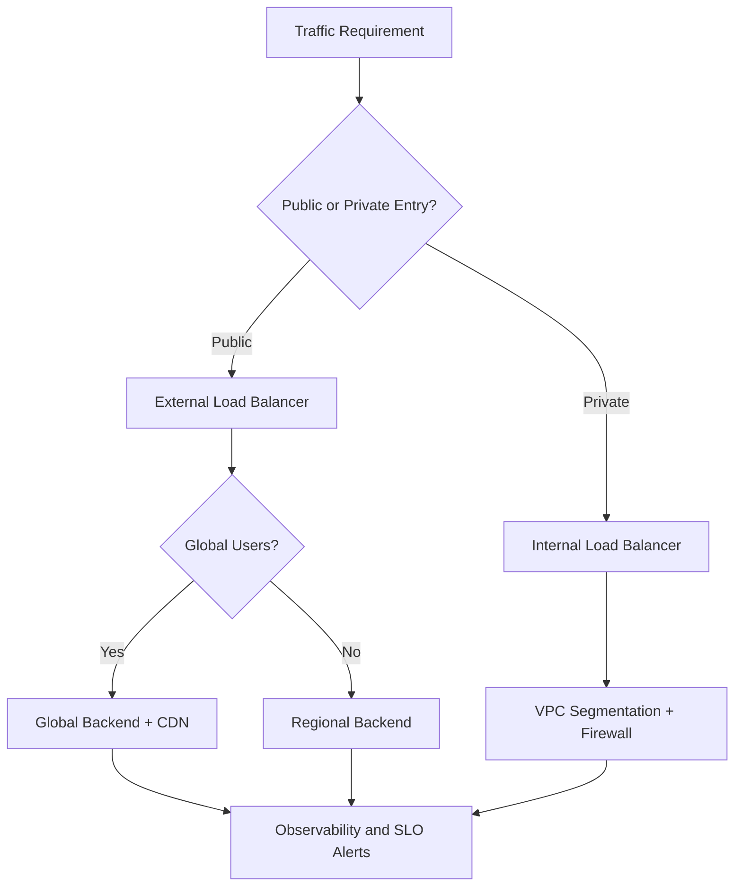
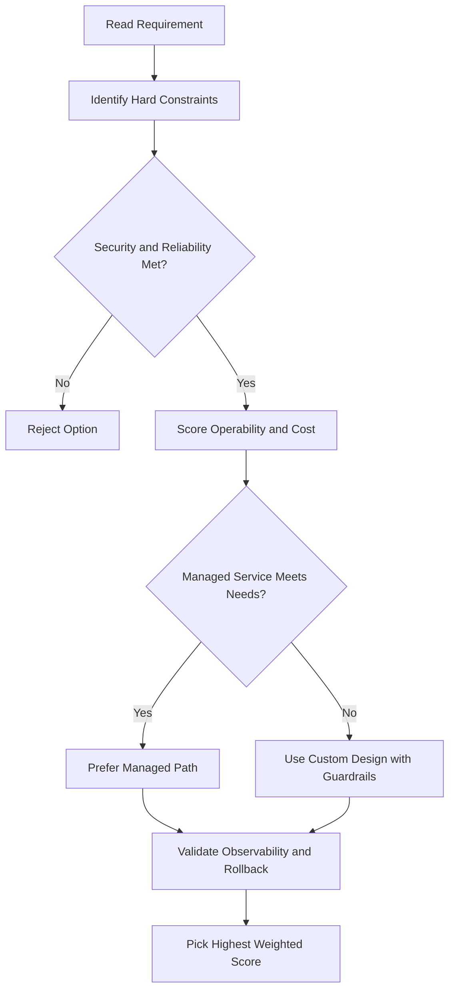
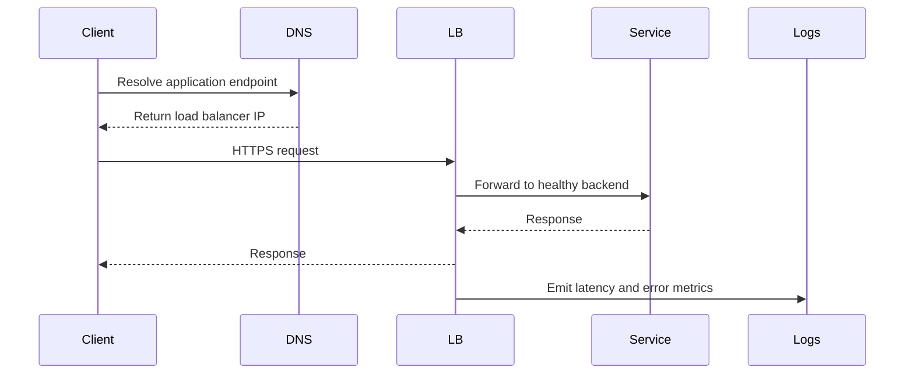

# Lab Notes: VPC Networks, VM Creation, and Connectivity Testing

## What this lab teaches

This lab shows three practical ideas:

1. You cannot create VM instances without at least one VPC network.
2. Auto mode VPCs are quick for learning, but custom mode VPCs are better for production control.
3. Different VPC networks are isolated by default, so internal IP communication across networks does not work unless you connect them (for example with VPC Peering or VPN).

---

## Part 1: Explore and remove the default network

### What you saw

- Most projects start with a default VPC network (unless org policy blocks it).
- That default network already has:
  - subnets in many regions
  - routes (including default route to internet)
  - firewall rules (ICMP, SSH, RDP, and internal allow rules)

### What you did

- Deleted default firewall rules.
- Deleted the default VPC network.
- Confirmed related routes disappeared.

### Important result

After removing all VPC networks, VM creation fails because VM instances must attach to a network.

---

## Part 2: Create an auto mode VPC and test same-network connectivity

### Network created

- VPC name: mynetwork
- Subnet mode: Auto

Auto mode automatically creates regional subnets and assigns preset IP ranges.

### VM instances created

- mynet-us-vm (us-central1-c)
- mynet-eu-vm (europe-west1-c)

### What you validated

- Both VMs received internal IPs from their subnet ranges.
- Internal ping between these two VMs worked, even though they are in different regions.

Why it worked:

- They are in the same VPC network.
- Firewall rules allowed internal communication.

### DNS takeaway

You can use VM names (internal DNS) instead of internal IPs. This is useful because internal IPs can change.

---

## Part 3: Convert auto mode to custom mode

### What you changed

- Edited mynetwork and changed subnet mode from Auto to Custom.

### Why this matters

- Auto mode is convenient but broad.
- Custom mode gives better control of subnet design, IP planning, and production architecture.

---

## Part 4: Create two more custom VPC networks

You created additional networks using both methods:

- Console method: managementnet
- gcloud command line method: privatenet

For custom mode networks, you must define subnets manually (name, region, CIDR range).

---

## Part 5: Add firewall rules

You created ingress firewall rules (for ICMP, SSH, RDP) for the new networks.

### Main idea

Firewall rules are network-specific. A rule in one VPC does not automatically apply to another VPC.

---

## Part 6: Create VMs in these new networks

After creating new VM instances in the added VPCs, you tested network behavior using both external and internal IP addresses.

---

## Connectivity results explained

### External IP ping across different VPCs

- Worked.

Reason:

- You allowed needed traffic with firewall rules.
- External IP traffic goes through public routing, not private same-VPC routing.

### Internal IP ping across different VPCs

- Failed.

Reason:

- VPC networks are isolated private domains by default.
- Internal addresses are reachable only within the same VPC unless you configure a connection.

---

## How to connect internal IPs across VPCs

You need an explicit inter-network setup, such as:

- VPC Peering
- Cloud VPN
- Other private connectivity designs

Without that, internal traffic between different VPC networks is blocked by architecture.

---

## Useful command patterns seen in this lab

### Create a custom VPC

```bash
gcloud compute networks create NETWORK_NAME --subnet-mode=custom
```

### Create a subnet

```bash
gcloud compute networks subnets create SUBNET_NAME \
  --network=NETWORK_NAME \
  --region=REGION \
  --range=CIDR_RANGE
```

### Create firewall rule

```bash
gcloud compute firewall-rules create RULE_NAME \
  --network=NETWORK_NAME \
  --direction=INGRESS \
  --action=ALLOW \
  --rules=tcp:22,tcp:3389,icmp \
  --source-ranges=0.0.0.0/0
```

### Create VM with minimum required inputs

```bash
gcloud compute instances create VM_NAME \
  --zone=ZONE \
  --machine-type=e2-micro \
  --subnet=SUBNET_NAME
```

---

## Final takeaway

- No VPC network = no VM creation.
- Same VPC usually means internal communication can work (if firewall allows it).
- Different VPCs are isolated by default for internal traffic.
- External ping can still work across VPCs if firewall rules allow it.
- For production, custom mode VPCs are preferred because they give you tighter control.

## ACE Exam-Style Practice Questions

### Q1
In a Vpc Network Lab Connectivity architecture with autoscaling tiers, traffic must flow web to API to database only. How should you enforce this?

A. Separate projects without firewall policy
B. Tags or service-account-based firewall rules between tiers
C. DNS records only
D. Disable internal communication

Answer: B
Trap: Layered firewall policy with identity or tags is robust against autoscaling IP changes.

### Q2
A private VM in Vpc Network Lab Connectivity needs outbound internet updates but no inbound internet. What should you configure?

A. External IP on each VM
B. Cloud NAT
C. Cloud Armor only
D. Internal TCP load balancer

Answer: B
Trap: Cloud NAT handles outbound internet for private instances without exposing inbound services.

<!-- ACE_DEEP_ENRICHMENT_START -->
## ACE Deep Enrichment

### Think Like a Google Engineer
- Primary optimization axis: Latency-resilience balance with private-by-default connectivity.
- Start with constraints first: SLO, security, compliance, latency, budget, and team operations capacity.
- Prefer managed services if they satisfy requirements with lower long-term operational toil.
- Minimize blast radius using environment isolation, least privilege, and failure-domain awareness.
- Design for day-2 operations: observability, rollback strategy, and quota or budget guardrails.

### Most Correct Option Filter (60 Seconds)
1. Eliminate options with broad access, single points of failure, or missing monitoring.
2. Confirm the option meets non-negotiables first: security and reliability requirements.
3. Compare remaining options on operational simplicity and long-term maintainability.
4. Use cost as an optimizer only after requirements and risk controls are satisfied.

### Weighted Decision Matrix
| Dimension | Weight | Strong Signal |
| --- | --- | --- |
| Security | 3 | Least privilege, secure defaults, no exposed blast radius |
| Reliability | 3 | Multi-zone or HA design, health checks, tested recovery path |
| Operability | 2 | Clear monitoring, alerting, rollout and rollback simplicity |
| Cost Efficiency | 2 | Right-sized resources, no waste, no reliability regression |
| Performance | 1 | Meets latency and throughput targets with headroom |

### Real-Life Scenario
An ecommerce platform serves customers across regions. The team must keep latency low, protect internal services, and survive zonal failures while controlling egress costs.

### Worked Example
- Place internet-facing services behind the correct external load balancer type.
- Keep internal services private with internal load balancers and private IP ranges.
- Use firewall rules by tags or service accounts, not wide open CIDR ranges.
- Add Cloud CDN or regional placement based on traffic profile and content type.

### Flowchart


### Optimization Decision Flow


### Interaction Sequence


### Extra Exam Practice (15 Questions)
#### Q1

Scenario Focus: Lab Notes: VPC Networks, VM Creation, and Connectivity Testing

A service must be reachable only from internal VMs. Which design is best?

A. Use an internal load balancer with private backend endpoints and private DNS.  
B. Expose the service publicly and rely on app-level passwords.  
C. Use one VM with a static external IP to simplify architecture.  
D. Allow 0.0.0.0/0 ingress to speed up troubleshooting.

Answer: A  
Why the other options are weaker: They typically ignore at least one hard constraint such as security, reliability, cost efficiency, or operational simplicity.  
Google-engineer check: Reconfirm SLO fit, blast radius, and day-2 maintainability before finalizing.

#### Q2

Scenario Focus: Lab Notes: VPC Networks, VM Creation, and Connectivity Testing

You need to reduce global web latency for static assets. What should you choose?

A. Use one VM with a static external IP to simplify architecture.  
B. Use an external application load balancer with Cloud CDN and cacheable content rules.  
C. Allow 0.0.0.0/0 ingress to speed up troubleshooting.  
D. Disable health checks to avoid accidental failover.

Answer: B  
Why the other options are weaker: They typically ignore at least one hard constraint such as security, reliability, cost efficiency, or operational simplicity.  
Google-engineer check: Reconfirm SLO fit, blast radius, and day-2 maintainability before finalizing.

#### Q3

Scenario Focus: Lab Notes: VPC Networks, VM Creation, and Connectivity Testing

Which firewall strategy best matches zero-trust network design?

A. Allow 0.0.0.0/0 ingress to speed up troubleshooting.  
B. Disable health checks to avoid accidental failover.  
C. Use least-privilege firewall policies scoped by service accounts or tags.  
D. Route all traffic through manual bastion hops in production.

Answer: C  
Why the other options are weaker: They typically ignore at least one hard constraint such as security, reliability, cost efficiency, or operational simplicity.  
Google-engineer check: Reconfirm SLO fit, blast radius, and day-2 maintainability before finalizing.

#### Q4

Scenario Focus: Lab Notes: VPC Networks, VM Creation, and Connectivity Testing

A backend fails health checks in one zone. What architecture is best practice?

A. Disable health checks to avoid accidental failover.  
B. Route all traffic through manual bastion hops in production.  
C. Expose the service publicly and rely on app-level passwords.  
D. Run multi-zone backends with health checks and automatic failover.

Answer: D  
Why the other options are weaker: They typically ignore at least one hard constraint such as security, reliability, cost efficiency, or operational simplicity.  
Google-engineer check: Reconfirm SLO fit, blast radius, and day-2 maintainability before finalizing.

#### Q5

Scenario Focus: Lab Notes: VPC Networks, VM Creation, and Connectivity Testing

You need private hybrid connectivity between on-prem and GCP. Which path is preferred?

A. Use HA VPN or Interconnect based on throughput and SLA requirements.  
B. Route all traffic through manual bastion hops in production.  
C. Expose the service publicly and rely on app-level passwords.  
D. Use one VM with a static external IP to simplify architecture.

Answer: A  
Why the other options are weaker: They typically ignore at least one hard constraint such as security, reliability, cost efficiency, or operational simplicity.  
Google-engineer check: Reconfirm SLO fit, blast radius, and day-2 maintainability before finalizing.

#### Q6

Scenario Focus: Lab Notes: VPC Networks, VM Creation, and Connectivity Testing

Two designs both satisfy the happy path for Lab Notes: VPC Networks, VM Creation, and Connectivity Testing. Which choice is most correct?

A. Expose the service publicly and rely on app-level passwords.  
B. Choose the option that preserves reliability and security while reducing operational burden.  
C. Use one VM with a static external IP to simplify architecture.  
D. Allow 0.0.0.0/0 ingress to speed up troubleshooting.

Answer: B  
Why the other options are weaker: They typically ignore at least one hard constraint such as security, reliability, cost efficiency, or operational simplicity.  
Google-engineer check: Reconfirm SLO fit, blast radius, and day-2 maintainability before finalizing.

#### Q7

Scenario Focus: Lab Notes: VPC Networks, VM Creation, and Connectivity Testing

What should you validate first before choosing an architecture for Lab Notes: VPC Networks, VM Creation, and Connectivity Testing?

A. Use one VM with a static external IP to simplify architecture.  
B. Allow 0.0.0.0/0 ingress to speed up troubleshooting.  
C. Validate SLO fit, blast radius, and least-privilege controls before comparing convenience.  
D. Disable health checks to avoid accidental failover.

Answer: C  
Why the other options are weaker: They typically ignore at least one hard constraint such as security, reliability, cost efficiency, or operational simplicity.  
Google-engineer check: Reconfirm SLO fit, blast radius, and day-2 maintainability before finalizing.

#### Q8

Scenario Focus: Lab Notes: VPC Networks, VM Creation, and Connectivity Testing

A proposal lowers cost but increases failure risk. What is the best decision?

A. Allow 0.0.0.0/0 ingress to speed up troubleshooting.  
B. Disable health checks to avoid accidental failover.  
C. Route all traffic through manual bastion hops in production.  
D. Reject it unless reliability and recovery objectives remain within required targets.

Answer: D  
Why the other options are weaker: They typically ignore at least one hard constraint such as security, reliability, cost efficiency, or operational simplicity.  
Google-engineer check: Reconfirm SLO fit, blast radius, and day-2 maintainability before finalizing.

#### Q9

Scenario Focus: Lab Notes: VPC Networks, VM Creation, and Connectivity Testing

Which option best reflects optimization for Latency-resilience balance with private-by-default connectivity?

A. Select the design that best meets Latency-resilience balance with private-by-default connectivity while keeping constraints balanced.  
B. Disable health checks to avoid accidental failover.  
C. Route all traffic through manual bastion hops in production.  
D. Expose the service publicly and rely on app-level passwords.

Answer: A  
Why the other options are weaker: They typically ignore at least one hard constraint such as security, reliability, cost efficiency, or operational simplicity.  
Google-engineer check: Reconfirm SLO fit, blast radius, and day-2 maintainability before finalizing.

#### Q10

Scenario Focus: Lab Notes: VPC Networks, VM Creation, and Connectivity Testing

How should you evaluate a design that needs frequent manual interventions?

A. Route all traffic through manual bastion hops in production.  
B. Treat it as high risk and prefer automation-friendly designs with observability and rollback.  
C. Expose the service publicly and rely on app-level passwords.  
D. Use one VM with a static external IP to simplify architecture.

Answer: B  
Why the other options are weaker: They typically ignore at least one hard constraint such as security, reliability, cost efficiency, or operational simplicity.  
Google-engineer check: Reconfirm SLO fit, blast radius, and day-2 maintainability before finalizing.

#### Q11

Scenario Focus: Lab Notes: VPC Networks, VM Creation, and Connectivity Testing

Two options have similar latency. Which tie-breaker is best?

A. Expose the service publicly and rely on app-level passwords.  
B. Use one VM with a static external IP to simplify architecture.  
C. Pick the option with stronger operability, clearer failure isolation, and simpler incident response.  
D. Allow 0.0.0.0/0 ingress to speed up troubleshooting.

Answer: C  
Why the other options are weaker: They typically ignore at least one hard constraint such as security, reliability, cost efficiency, or operational simplicity.  
Google-engineer check: Reconfirm SLO fit, blast radius, and day-2 maintainability before finalizing.

#### Q12

Scenario Focus: Lab Notes: VPC Networks, VM Creation, and Connectivity Testing

What is the best way to choose between a custom stack and a managed service?

A. Use one VM with a static external IP to simplify architecture.  
B. Allow 0.0.0.0/0 ingress to speed up troubleshooting.  
C. Disable health checks to avoid accidental failover.  
D. Prefer managed services when they meet requirements with lower long-term maintenance effort.

Answer: D  
Why the other options are weaker: They typically ignore at least one hard constraint such as security, reliability, cost efficiency, or operational simplicity.  
Google-engineer check: Reconfirm SLO fit, blast radius, and day-2 maintainability before finalizing.

#### Q13

Scenario Focus: Lab Notes: VPC Networks, VM Creation, and Connectivity Testing

How do you confirm a solution is production-ready for 

A. Verify monitoring, alerting, rollback path, quota and budget controls, and secure defaults.  
B. Allow 0.0.0.0/0 ingress to speed up troubleshooting.  
C. Disable health checks to avoid accidental failover.  
D. Route all traffic through manual bastion hops in production.

Answer: A  
Why the other options are weaker: They typically ignore at least one hard constraint such as security, reliability, cost efficiency, or operational simplicity.  
Google-engineer check: Reconfirm SLO fit, blast radius, and day-2 maintainability before finalizing.

#### Q14

Scenario Focus: Lab Notes: VPC Networks, VM Creation, and Connectivity Testing

Which pattern usually wins in ACE scenario tie-breakers?

A. Disable health checks to avoid accidental failover.  
B. Managed-service-first plus least-privilege access plus clear observability usually wins.  
C. Route all traffic through manual bastion hops in production.  
D. Expose the service publicly and rely on app-level passwords.

Answer: B  
Why the other options are weaker: They typically ignore at least one hard constraint such as security, reliability, cost efficiency, or operational simplicity.  
Google-engineer check: Reconfirm SLO fit, blast radius, and day-2 maintainability before finalizing.

#### Q15

Scenario Focus: Lab Notes: VPC Networks, VM Creation, and Connectivity Testing

What is the best final check before locking the answer?

A. Route all traffic through manual bastion hops in production.  
B. Expose the service publicly and rely on app-level passwords.  
C. Run a weighted check across security, reliability, cost, performance, and operability.  
D. Use one VM with a static external IP to simplify architecture.

Answer: C  
Why the other options are weaker: They typically ignore at least one hard constraint such as security, reliability, cost efficiency, or operational simplicity.  
Google-engineer check: Reconfirm SLO fit, blast radius, and day-2 maintainability before finalizing.

### Quick Commands
```bash
gcloud compute firewall-rules list --project=PROJECT_ID
gcloud compute forwarding-rules list --global --project=PROJECT_ID
gcloud compute backend-services get-health BACKEND_NAME --global --project=PROJECT_ID
gcloud compute routes list --project=PROJECT_ID
```

### Fast Recall
- Pick load balancer type by traffic pattern, not preference.
- Private services should stay private end to end.
- Health checks and multi-zone design are core reliability controls.
<!-- ACE_DEEP_ENRICHMENT_END -->