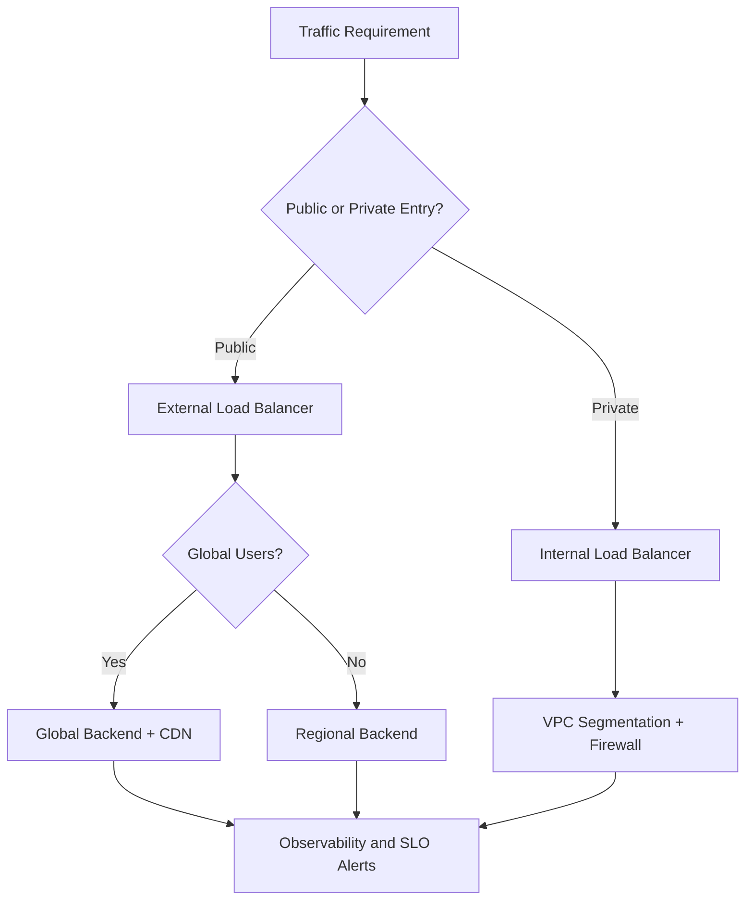
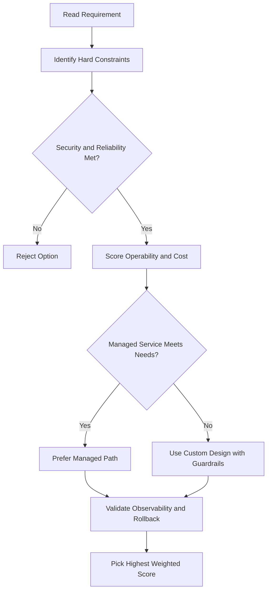
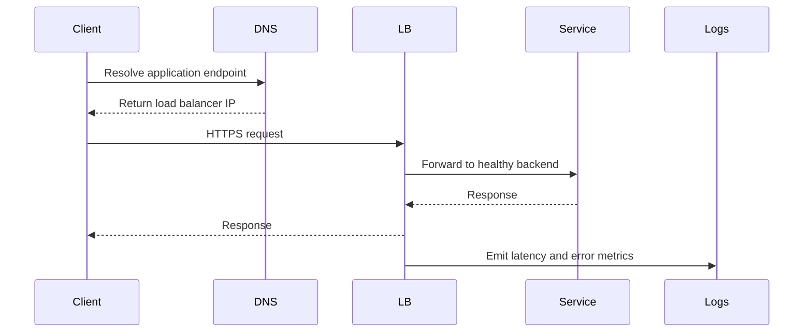

# 🏗️ Easy Guide: Common Google Cloud Network Designs

Here are some simple ways people set up their networks in Google Cloud. These ideas help keep your apps running, safe, and easy to manage.

---

## 1. Make Your App Harder to Break (High Availability)

- Put your virtual machines (VMs) in different “zones” (think: separate buildings in the same city).
- Use the same “subnet” (like a big WiFi network) for all your VMs.
- If one zone has a problem (like a power cut), your app can still run from the other zone.
- You only need one firewall rule for the whole subnet, so it’s simple.

**Extra tip:**
Google can automatically spread your VMs across zones for you. This is called a “regional managed instance group.”

---

## 2. Make Your App Work All Over the World (Globalization)

- Put your stuff (VMs, databases, etc.) in different regions (think: different cities or countries).
- Use a “global load balancer” to send each user to the closest region.
- If a whole region goes down, your app still works from another region.
- Users get faster service, and you might pay less for network traffic.

---

## 3. Keep VMs Private, But Let Them Use the Internet (Cloud NAT)

- Don’t give your VMs public IP addresses unless you really need to.
- Use “Cloud NAT” so your VMs can reach the internet (for updates, downloads, etc.) but nobody on the internet can reach them.
- Cloud NAT only lets your VMs start connections out to the internet, not the other way around.

**Example:**
Two private VMs can get updates from the internet, but hackers can’t reach them directly.

---

## 4. Let Private VMs Use Google Services (Private Google Access)

- Sometimes your VM needs to talk to Google stuff (like Cloud Storage) but doesn’t have a public IP.
- Turn on “Private Google Access” for the subnet.
- Now your VM can reach Google APIs and services, even with just an internal IP.

**Example:**
VM A1 (private, Private Google Access ON) can use Google APIs.
VM B1 (private, Private Google Access OFF) can’t.
VMs with public IPs can always use Google APIs.

---

## 🗝️ Key Takeaways

- Put VMs in different zones or regions so your app keeps running if something breaks.
- Use internal IPs and Cloud NAT to keep VMs safe from the public internet.
- Turn on Private Google Access so private VMs can use Google services.
- Use global load balancers to send users to the closest, working region.
- Simple designs = easier to manage and safer!

---

## gcloud Commands

```bash
# Create a regional managed instance group (spread across zones)
gcloud compute instance-groups managed create my-group \
  --base-instance-name=my-vm --size=2 \
  --template=my-template --region=us-central1

# Create a Cloud Router (needed for Cloud NAT)
gcloud compute routers create my-router \
  --network=my-vpc --region=us-central1

# Create a Cloud NAT gateway
gcloud compute routers nats create my-nat \
  --router=my-router --region=us-central1 \
  --auto-allocate-nat-external-ips --nat-all-subnet-ip-ranges

# Enable Private Google Access on a subnet
gcloud compute networks subnets update my-subnet \
  --region=us-central1 --enable-private-ip-google-access
```

## ACE Exam-Style Practice Questions

### Q1
In a Common Network Designs architecture with autoscaling tiers, traffic must flow web to API to database only. How should you enforce this?

A. Separate projects without firewall policy
B. Tags or service-account-based firewall rules between tiers
C. DNS records only
D. Disable internal communication

Answer: B
Trap: Layered firewall policy with identity or tags is robust against autoscaling IP changes.

### Q2
A private VM in Common Network Designs needs outbound internet updates but no inbound internet. What should you configure?

A. External IP on each VM
B. Cloud NAT
C. Cloud Armor only
D. Internal TCP load balancer

Answer: B
Trap: Cloud NAT handles outbound internet for private instances without exposing inbound services.

<!-- ACE_DEEP_ENRICHMENT_START -->
## ACE Deep Enrichment

### Think Like a Google Engineer
- Primary optimization axis: Latency-resilience balance with private-by-default connectivity.
- Start with constraints first: SLO, security, compliance, latency, budget, and team operations capacity.
- Prefer managed services if they satisfy requirements with lower long-term operational toil.
- Minimize blast radius using environment isolation, least privilege, and failure-domain awareness.
- Design for day-2 operations: observability, rollback strategy, and quota or budget guardrails.

### Most Correct Option Filter (60 Seconds)
1. Eliminate options with broad access, single points of failure, or missing monitoring.
2. Confirm the option meets non-negotiables first: security and reliability requirements.
3. Compare remaining options on operational simplicity and long-term maintainability.
4. Use cost as an optimizer only after requirements and risk controls are satisfied.

### Weighted Decision Matrix
| Dimension | Weight | Strong Signal |
| --- | --- | --- |
| Security | 3 | Least privilege, secure defaults, no exposed blast radius |
| Reliability | 3 | Multi-zone or HA design, health checks, tested recovery path |
| Operability | 2 | Clear monitoring, alerting, rollout and rollback simplicity |
| Cost Efficiency | 2 | Right-sized resources, no waste, no reliability regression |
| Performance | 1 | Meets latency and throughput targets with headroom |

### Real-Life Scenario
An ecommerce platform serves customers across regions. The team must keep latency low, protect internal services, and survive zonal failures while controlling egress costs.

### Worked Example
- Place internet-facing services behind the correct external load balancer type.
- Keep internal services private with internal load balancers and private IP ranges.
- Use firewall rules by tags or service accounts, not wide open CIDR ranges.
- Add Cloud CDN or regional placement based on traffic profile and content type.

### Flowchart


### Optimization Decision Flow


### Interaction Sequence


### Extra Exam Practice (10 Questions)
#### Q1
Scenario Focus: 🏗️ Easy Guide: Common Google Cloud Network Designs
A service must be reachable only from internal VMs. Which design is best?

A. Use an internal load balancer with private backend endpoints and private DNS.
B. Expose the service publicly and rely on app-level passwords.
C. Use one VM with a static external IP to simplify architecture.
D. Allow 0.0.0.0/0 ingress to speed up troubleshooting.

Answer: A
Why the other options are weaker: They typically ignore at least one hard constraint such as security, reliability, cost efficiency, or operational simplicity.
Google-engineer check: Reconfirm SLO fit, blast radius, and day-2 maintainability before finalizing.

#### Q2
Scenario Focus: 🏗️ Easy Guide: Common Google Cloud Network Designs
You need to reduce global web latency for static assets. What should you choose?

A. Use one VM with a static external IP to simplify architecture.
B. Use an external application load balancer with Cloud CDN and cacheable content rules.
C. Allow 0.0.0.0/0 ingress to speed up troubleshooting.
D. Disable health checks to avoid accidental failover.

Answer: B
Why the other options are weaker: They typically ignore at least one hard constraint such as security, reliability, cost efficiency, or operational simplicity.
Google-engineer check: Reconfirm SLO fit, blast radius, and day-2 maintainability before finalizing.

#### Q3
Scenario Focus: 🏗️ Easy Guide: Common Google Cloud Network Designs
Which firewall strategy best matches zero-trust network design?

A. Allow 0.0.0.0/0 ingress to speed up troubleshooting.
B. Disable health checks to avoid accidental failover.
C. Use least-privilege firewall policies scoped by service accounts or tags.
D. Route all traffic through manual bastion hops in production.

Answer: C
Why the other options are weaker: They typically ignore at least one hard constraint such as security, reliability, cost efficiency, or operational simplicity.
Google-engineer check: Reconfirm SLO fit, blast radius, and day-2 maintainability before finalizing.

#### Q4
Scenario Focus: 🏗️ Easy Guide: Common Google Cloud Network Designs
A backend fails health checks in one zone. What architecture is best practice?

A. Disable health checks to avoid accidental failover.
B. Route all traffic through manual bastion hops in production.
C. Expose the service publicly and rely on app-level passwords.
D. Run multi-zone backends with health checks and automatic failover.

Answer: D
Why the other options are weaker: They typically ignore at least one hard constraint such as security, reliability, cost efficiency, or operational simplicity.
Google-engineer check: Reconfirm SLO fit, blast radius, and day-2 maintainability before finalizing.

#### Q5
Scenario Focus: 🏗️ Easy Guide: Common Google Cloud Network Designs
You need private hybrid connectivity between on-prem and GCP. Which path is preferred?

A. Use HA VPN or Interconnect based on throughput and SLA requirements.
B. Route all traffic through manual bastion hops in production.
C. Expose the service publicly and rely on app-level passwords.
D. Use one VM with a static external IP to simplify architecture.

Answer: A
Why the other options are weaker: They typically ignore at least one hard constraint such as security, reliability, cost efficiency, or operational simplicity.
Google-engineer check: Reconfirm SLO fit, blast radius, and day-2 maintainability before finalizing.

#### Q6
Scenario Focus: 🏗️ Easy Guide: Common Google Cloud Network Designs
Two designs both satisfy the happy path for 🏗️ Easy Guide: Common Google Cloud Network Designs. Which choice is most correct?

A. Expose the service publicly and rely on app-level passwords.
B. Choose the option that preserves reliability and security while reducing operational burden.
C. Use one VM with a static external IP to simplify architecture.
D. Allow 0.0.0.0/0 ingress to speed up troubleshooting.

Answer: B
Why the other options are weaker: They typically ignore at least one hard constraint such as security, reliability, cost efficiency, or operational simplicity.
Google-engineer check: Reconfirm SLO fit, blast radius, and day-2 maintainability before finalizing.

#### Q7
Scenario Focus: 🏗️ Easy Guide: Common Google Cloud Network Designs
What should you validate first before choosing an architecture for 🏗️ Easy Guide: Common Google Cloud Network Designs?

A. Use one VM with a static external IP to simplify architecture.
B. Allow 0.0.0.0/0 ingress to speed up troubleshooting.
C. Validate SLO fit, blast radius, and least-privilege controls before comparing convenience.
D. Disable health checks to avoid accidental failover.

Answer: C
Why the other options are weaker: They typically ignore at least one hard constraint such as security, reliability, cost efficiency, or operational simplicity.
Google-engineer check: Reconfirm SLO fit, blast radius, and day-2 maintainability before finalizing.

#### Q8
Scenario Focus: 🏗️ Easy Guide: Common Google Cloud Network Designs
A proposal lowers cost but increases failure risk. What is the best decision?

A. Allow 0.0.0.0/0 ingress to speed up troubleshooting.
B. Disable health checks to avoid accidental failover.
C. Route all traffic through manual bastion hops in production.
D. Reject it unless reliability and recovery objectives remain within required targets.

Answer: D
Why the other options are weaker: They typically ignore at least one hard constraint such as security, reliability, cost efficiency, or operational simplicity.
Google-engineer check: Reconfirm SLO fit, blast radius, and day-2 maintainability before finalizing.

#### Q9
Scenario Focus: 🏗️ Easy Guide: Common Google Cloud Network Designs
Which option best reflects optimization for Latency-resilience balance with private-by-default connectivity?

A. Select the design that best meets Latency-resilience balance with private-by-default connectivity while keeping constraints balanced.
B. Disable health checks to avoid accidental failover.
C. Route all traffic through manual bastion hops in production.
D. Expose the service publicly and rely on app-level passwords.

Answer: A
Why the other options are weaker: They typically ignore at least one hard constraint such as security, reliability, cost efficiency, or operational simplicity.
Google-engineer check: Reconfirm SLO fit, blast radius, and day-2 maintainability before finalizing.

#### Q10
Scenario Focus: 🏗️ Easy Guide: Common Google Cloud Network Designs
How should you evaluate a design that needs frequent manual interventions?

A. Route all traffic through manual bastion hops in production.
B. Treat it as high risk and prefer automation-friendly designs with observability and rollback.
C. Expose the service publicly and rely on app-level passwords.
D. Use one VM with a static external IP to simplify architecture.

Answer: B
Why the other options are weaker: They typically ignore at least one hard constraint such as security, reliability, cost efficiency, or operational simplicity.
Google-engineer check: Reconfirm SLO fit, blast radius, and day-2 maintainability before finalizing.

### Quick Commands
```bash
gcloud compute firewall-rules list --project=PROJECT_ID
gcloud compute forwarding-rules list --global --project=PROJECT_ID
gcloud compute backend-services get-health BACKEND_NAME --global --project=PROJECT_ID
gcloud compute routes list --project=PROJECT_ID
```

### Fast Recall
- Pick load balancer type by traffic pattern, not preference.
- Private services should stay private end to end.
- Health checks and multi-zone design are core reliability controls.
<!-- ACE_DEEP_ENRICHMENT_END -->