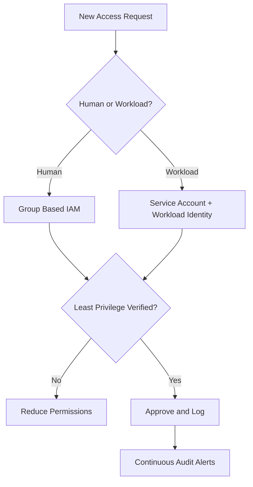
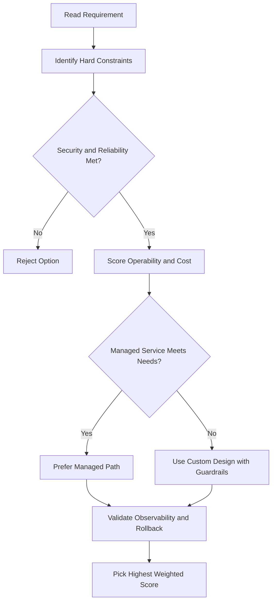
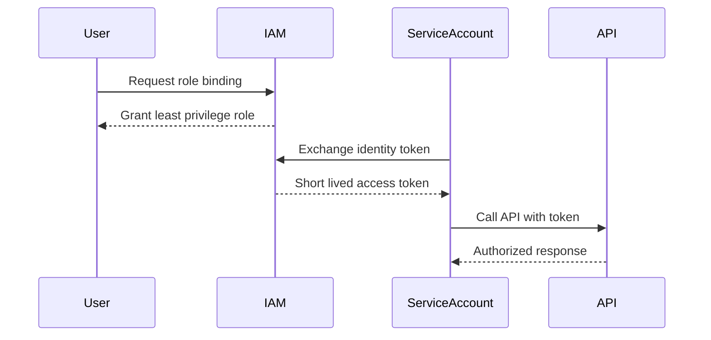

# Lab: Private VM, Cloud IAP, Private Google Access, and Cloud NAT (Easy Version)

## What you did in this lab

You learned how to make a VM that is private (no public IP), connect to it safely, and let it reach the internet and Google services in a secure way.

---

## 1. Create a Private VM (No External IP)

- Made a new VPC network called `privatenet` with a custom subnet.
- Created a firewall rule to allow SSH, but only from Cloud IAP (not from anywhere on the internet).
- Made a VM called `vm-internal` in this network, with **no external IP**.

**Result:**

- You can’t SSH to this VM directly from the internet.
- The VM is private and safe from outside attacks.

---

## 2. Connect to the Private VM Using Cloud IAP

- Used Cloud IAP (Identity-Aware Proxy) to open a secure tunnel and SSH into the VM from Cloud Shell.
- No need for a “bastion” host or public IP.

**Result:**

- You can manage your private VM safely, even though it has no public IP.

---

## 3. Test Access to Google APIs (Private Google Access)

- Tried to use the VM to access Google Cloud Storage (copy a file to a bucket).
- At first, it didn’t work because “Private Google Access” was OFF for the subnet.
- Turned ON Private Google Access for the subnet.
- Now the VM could reach Google APIs and services, even with no public IP.

**Result:**

- Private VMs can use Google services if Private Google Access is enabled.

---

## 4. Test Internet Access (Cloud NAT)

- Tried to update the VM (e.g., `apt-get update`).
- Didn’t work, because the VM had no public IP and no Cloud NAT.
- Set up a Cloud NAT gateway for the network.
- Waited a few minutes for it to start working.
- Tried again, and now the VM could reach the internet for updates and downloads.

**Result:**

- Cloud NAT lets private VMs reach the internet for outbound connections (updates, patches, etc.), but nobody can reach in from the outside.

---

## 5. Key Points

- **Private VMs** (no external IP) are safer from attacks.
- **Cloud IAP** lets you connect to private VMs without a public IP.
- **Private Google Access** lets private VMs use Google APIs/services.
- **Cloud NAT** lets private VMs reach the internet for updates, but blocks outside access.
- You can control who can use Cloud IAP by giving them the right roles in IAM.

---

## 🗝️ Takeaway

You can build secure, private cloud servers that are still easy to manage and keep up-to-date—no need to expose them to the public internet!

---

## gcloud Commands

```bash
# SSH into a private VM via Cloud IAP (no external IP needed)
gcloud compute ssh my-vm --zone=us-central1-a --tunnel-through-iap

# Enable Private Google Access on a subnet
gcloud compute networks subnets update my-subnet \
  --region=us-central1 --enable-private-ip-google-access

# Create a Cloud Router
gcloud compute routers create my-router \
  --network=my-vpc --region=us-central1

# Create a Cloud NAT gateway
gcloud compute routers nats create my-nat \
  --router=my-router --region=us-central1 \
  --auto-allocate-nat-external-ips --nat-all-subnet-ip-ranges
```

## ACE Exam-Style Practice Questions

### Q1

You have a private VM with no external IP in this lab setup and need secure SSH access. What is the best method?

A. Assign a public IP and open SSH from 0.0.0.0/0
B. Use Cloud IAP TCP tunneling for SSH
C. Disable firewall rules
D. Use Cloud CDN

Answer: B
Trap: Cloud IAP is the secure pattern for administrative access to private VMs.

### Q2

Your private VM must access Google APIs and also download operating system updates from the internet. Which combination is correct?

A. Private Google Access only
B. Cloud NAT only
C. Private Google Access plus Cloud NAT
D. Public IP only

Answer: C
Trap: Private Google Access is for Google APIs; Cloud NAT is for general outbound internet access.

<!-- ACE_DEEP_ENRICHMENT_START -->
## ACE Deep Enrichment

### Think Like a Google Engineer
- Primary optimization axis: Security posture and blast-radius minimization.
- Start with constraints first: SLO, security, compliance, latency, budget, and team operations capacity.
- Prefer managed services if they satisfy requirements with lower long-term operational toil.
- Minimize blast radius using environment isolation, least privilege, and failure-domain awareness.
- Design for day-2 operations: observability, rollback strategy, and quota or budget guardrails.

### Most Correct Option Filter (60 Seconds)
1. Eliminate options with broad access, single points of failure, or missing monitoring.
2. Confirm the option meets non-negotiables first: security and reliability requirements.
3. Compare remaining options on operational simplicity and long-term maintainability.
4. Use cost as an optimizer only after requirements and risk controls are satisfied.

### Weighted Decision Matrix
| Dimension | Weight | Strong Signal |
| --- | --- | --- |
| Security | 3 | Least privilege, secure defaults, no exposed blast radius |
| Reliability | 3 | Multi-zone or HA design, health checks, tested recovery path |
| Operability | 2 | Clear monitoring, alerting, rollout and rollback simplicity |
| Cost Efficiency | 2 | Right-sized resources, no waste, no reliability regression |
| Performance | 1 | Meets latency and throughput targets with headroom |

### Real-Life Scenario
A fintech team is onboarding 40 engineers and 12 workloads in one quarter. They need strict access boundaries, auditability, and zero long-lived credentials while still shipping features fast.

### Worked Example
- Create separate projects for dev, staging, and prod so IAM and quotas are isolated.
- Map users to Google Groups and grant predefined roles at the narrowest scope.
- Use service accounts for workloads and rotate to short-lived credentials through Workload Identity.
- Enable audit logs and alert on policy changes and service account key creation.

### Flowchart


### Optimization Decision Flow


### Interaction Sequence


### Extra Exam Practice (15 Questions)
#### Q1
Scenario Focus: Lab: Private VM, Cloud IAP, Private Google Access, and Cloud NAT (Easy Version)
Your team must grant temporary production access for incident response. Which approach is best?

A. Grant a time-bound least-privilege role through group membership and audit the binding.
B. Grant Owner role temporarily and remove it manually later.
C. Share one administrator account for faster troubleshooting.
D. Store service account keys in a shared drive because it is internal.

Answer: A
Why the other options are weaker: They typically ignore at least one hard constraint such as security, reliability, cost efficiency, or operational simplicity.
Google-engineer check: Reconfirm SLO fit, blast radius, and day-2 maintainability before finalizing.

#### Q2
Scenario Focus: Lab: Private VM, Cloud IAP, Private Google Access, and Cloud NAT (Easy Version)
A workload is still using a JSON key file in source control. What is the best fix?

A. Share one administrator account for faster troubleshooting.
B. Move to service account impersonation or Workload Identity and disable long-lived keys.
C. Store service account keys in a shared drive because it is internal.
D. Apply organization-level broad roles so future access requests are avoided.

Answer: B
Why the other options are weaker: They typically ignore at least one hard constraint such as security, reliability, cost efficiency, or operational simplicity.
Google-engineer check: Reconfirm SLO fit, blast radius, and day-2 maintainability before finalizing.

#### Q3
Scenario Focus: Lab: Private VM, Cloud IAP, Private Google Access, and Cloud NAT (Easy Version)
Which setup best reduces blast radius across environments?

A. Store service account keys in a shared drive because it is internal.
B. Apply organization-level broad roles so future access requests are avoided.
C. Use separate projects per environment with narrow IAM bindings at project or resource level.
D. Skip audit logs to reduce logging costs during non-peak hours.

Answer: C
Why the other options are weaker: They typically ignore at least one hard constraint such as security, reliability, cost efficiency, or operational simplicity.
Google-engineer check: Reconfirm SLO fit, blast radius, and day-2 maintainability before finalizing.

#### Q4
Scenario Focus: Lab: Private VM, Cloud IAP, Private Google Access, and Cloud NAT (Easy Version)
What should you monitor first for IAM abuse detection?

A. Apply organization-level broad roles so future access requests are avoided.
B. Skip audit logs to reduce logging costs during non-peak hours.
C. Grant Owner role temporarily and remove it manually later.
D. Alert on IAM policy changes, service account key creation, and high-risk privilege grants.

Answer: D
Why the other options are weaker: They typically ignore at least one hard constraint such as security, reliability, cost efficiency, or operational simplicity.
Google-engineer check: Reconfirm SLO fit, blast radius, and day-2 maintainability before finalizing.

#### Q5
Scenario Focus: Lab: Private VM, Cloud IAP, Private Google Access, and Cloud NAT (Easy Version)
A developer needs read-only billing visibility. Which decision is best?

A. Assign a billing viewer role at the required scope instead of broad project editor access.
B. Skip audit logs to reduce logging costs during non-peak hours.
C. Grant Owner role temporarily and remove it manually later.
D. Share one administrator account for faster troubleshooting.

Answer: A
Why the other options are weaker: They typically ignore at least one hard constraint such as security, reliability, cost efficiency, or operational simplicity.
Google-engineer check: Reconfirm SLO fit, blast radius, and day-2 maintainability before finalizing.

#### Q6
Scenario Focus: Lab: Private VM, Cloud IAP, Private Google Access, and Cloud NAT (Easy Version)
Two designs both satisfy the happy path for Lab: Private VM, Cloud IAP, Private Google Access, and Cloud NAT (Easy Version). Which choice is most correct?

A. Grant Owner role temporarily and remove it manually later.
B. Choose the option that preserves reliability and security while reducing operational burden.
C. Share one administrator account for faster troubleshooting.
D. Store service account keys in a shared drive because it is internal.

Answer: B
Why the other options are weaker: They typically ignore at least one hard constraint such as security, reliability, cost efficiency, or operational simplicity.
Google-engineer check: Reconfirm SLO fit, blast radius, and day-2 maintainability before finalizing.

#### Q7
Scenario Focus: Lab: Private VM, Cloud IAP, Private Google Access, and Cloud NAT (Easy Version)
What should you validate first before choosing an architecture for Lab: Private VM, Cloud IAP, Private Google Access, and Cloud NAT (Easy Version)?

A. Share one administrator account for faster troubleshooting.
B. Store service account keys in a shared drive because it is internal.
C. Validate SLO fit, blast radius, and least-privilege controls before comparing convenience.
D. Apply organization-level broad roles so future access requests are avoided.

Answer: C
Why the other options are weaker: They typically ignore at least one hard constraint such as security, reliability, cost efficiency, or operational simplicity.
Google-engineer check: Reconfirm SLO fit, blast radius, and day-2 maintainability before finalizing.

#### Q8
Scenario Focus: Lab: Private VM, Cloud IAP, Private Google Access, and Cloud NAT (Easy Version)
A proposal lowers cost but increases failure risk. What is the best decision?

A. Store service account keys in a shared drive because it is internal.
B. Apply organization-level broad roles so future access requests are avoided.
C. Skip audit logs to reduce logging costs during non-peak hours.
D. Reject it unless reliability and recovery objectives remain within required targets.

Answer: D
Why the other options are weaker: They typically ignore at least one hard constraint such as security, reliability, cost efficiency, or operational simplicity.
Google-engineer check: Reconfirm SLO fit, blast radius, and day-2 maintainability before finalizing.

#### Q9
Scenario Focus: Lab: Private VM, Cloud IAP, Private Google Access, and Cloud NAT (Easy Version)
Which option best reflects optimization for Security posture and blast-radius minimization?

A. Select the design that best meets Security posture and blast-radius minimization while keeping constraints balanced.
B. Apply organization-level broad roles so future access requests are avoided.
C. Skip audit logs to reduce logging costs during non-peak hours.
D. Grant Owner role temporarily and remove it manually later.

Answer: A
Why the other options are weaker: They typically ignore at least one hard constraint such as security, reliability, cost efficiency, or operational simplicity.
Google-engineer check: Reconfirm SLO fit, blast radius, and day-2 maintainability before finalizing.

#### Q10
Scenario Focus: Lab: Private VM, Cloud IAP, Private Google Access, and Cloud NAT (Easy Version)
How should you evaluate a design that needs frequent manual interventions?

A. Skip audit logs to reduce logging costs during non-peak hours.
B. Treat it as high risk and prefer automation-friendly designs with observability and rollback.
C. Grant Owner role temporarily and remove it manually later.
D. Share one administrator account for faster troubleshooting.

Answer: B
Why the other options are weaker: They typically ignore at least one hard constraint such as security, reliability, cost efficiency, or operational simplicity.
Google-engineer check: Reconfirm SLO fit, blast radius, and day-2 maintainability before finalizing.

#### Q11
Scenario Focus: Lab: Private VM, Cloud IAP, Private Google Access, and Cloud NAT (Easy Version)
Two options have similar latency. Which tie-breaker is best?

A. Grant Owner role temporarily and remove it manually later.
B. Share one administrator account for faster troubleshooting.
C. Pick the option with stronger operability, clearer failure isolation, and simpler incident response.
D. Store service account keys in a shared drive because it is internal.

Answer: C
Why the other options are weaker: They typically ignore at least one hard constraint such as security, reliability, cost efficiency, or operational simplicity.
Google-engineer check: Reconfirm SLO fit, blast radius, and day-2 maintainability before finalizing.

#### Q12
Scenario Focus: Lab: Private VM, Cloud IAP, Private Google Access, and Cloud NAT (Easy Version)
What is the best way to choose between a custom stack and a managed service?

A. Share one administrator account for faster troubleshooting.
B. Store service account keys in a shared drive because it is internal.
C. Apply organization-level broad roles so future access requests are avoided.
D. Prefer managed services when they meet requirements with lower long-term maintenance effort.

Answer: D
Why the other options are weaker: They typically ignore at least one hard constraint such as security, reliability, cost efficiency, or operational simplicity.
Google-engineer check: Reconfirm SLO fit, blast radius, and day-2 maintainability before finalizing.

#### Q13
Scenario Focus: Lab: Private VM, Cloud IAP, Private Google Access, and Cloud NAT (Easy Version)
How do you confirm a solution is production-ready for 

A. Verify monitoring, alerting, rollback path, quota and budget controls, and secure defaults.
B. Store service account keys in a shared drive because it is internal.
C. Apply organization-level broad roles so future access requests are avoided.
D. Skip audit logs to reduce logging costs during non-peak hours.

Answer: A
Why the other options are weaker: They typically ignore at least one hard constraint such as security, reliability, cost efficiency, or operational simplicity.
Google-engineer check: Reconfirm SLO fit, blast radius, and day-2 maintainability before finalizing.

#### Q14
Scenario Focus: Lab: Private VM, Cloud IAP, Private Google Access, and Cloud NAT (Easy Version)
Which pattern usually wins in ACE scenario tie-breakers?

A. Apply organization-level broad roles so future access requests are avoided.
B. Managed-service-first plus least-privilege access plus clear observability usually wins.
C. Skip audit logs to reduce logging costs during non-peak hours.
D. Grant Owner role temporarily and remove it manually later.

Answer: B
Why the other options are weaker: They typically ignore at least one hard constraint such as security, reliability, cost efficiency, or operational simplicity.
Google-engineer check: Reconfirm SLO fit, blast radius, and day-2 maintainability before finalizing.

#### Q15
Scenario Focus: Lab: Private VM, Cloud IAP, Private Google Access, and Cloud NAT (Easy Version)
What is the best final check before locking the answer?

A. Skip audit logs to reduce logging costs during non-peak hours.
B. Grant Owner role temporarily and remove it manually later.
C. Run a weighted check across security, reliability, cost, performance, and operability.
D. Share one administrator account for faster troubleshooting.

Answer: C
Why the other options are weaker: They typically ignore at least one hard constraint such as security, reliability, cost efficiency, or operational simplicity.
Google-engineer check: Reconfirm SLO fit, blast radius, and day-2 maintainability before finalizing.

### Quick Commands
```bash
gcloud projects get-iam-policy PROJECT_ID
gcloud projects add-iam-policy-binding PROJECT_ID --member=group:team@example.com --role=roles/viewer
gcloud iam service-accounts list --project=PROJECT_ID
gcloud logging read "protoPayload.methodName=\"SetIamPolicy\"" --freshness=7d --project=PROJECT_ID --limit=20
```

### Fast Recall
- Least privilege beats convenience in all exam scenarios.
- Prefer groups for humans and service accounts for workloads.
- Avoid long-lived keys whenever possible.
<!-- ACE_DEEP_ENRICHMENT_END -->