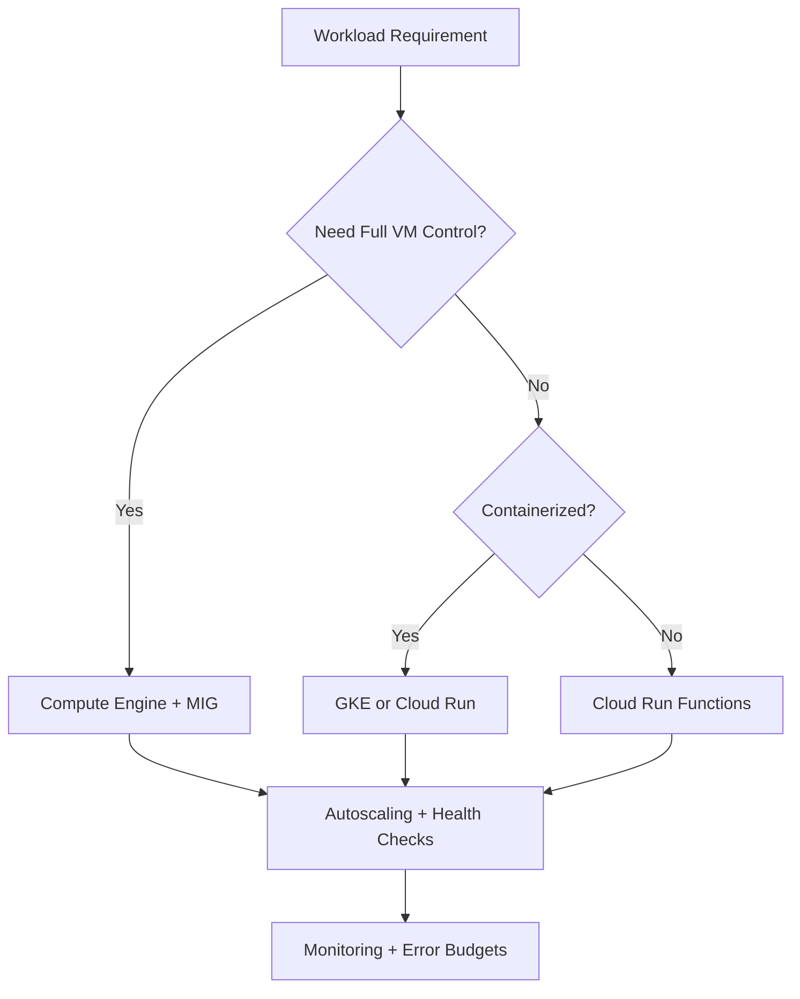
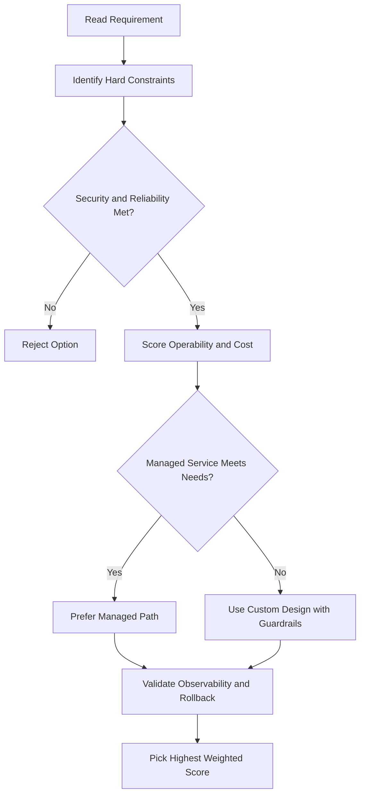
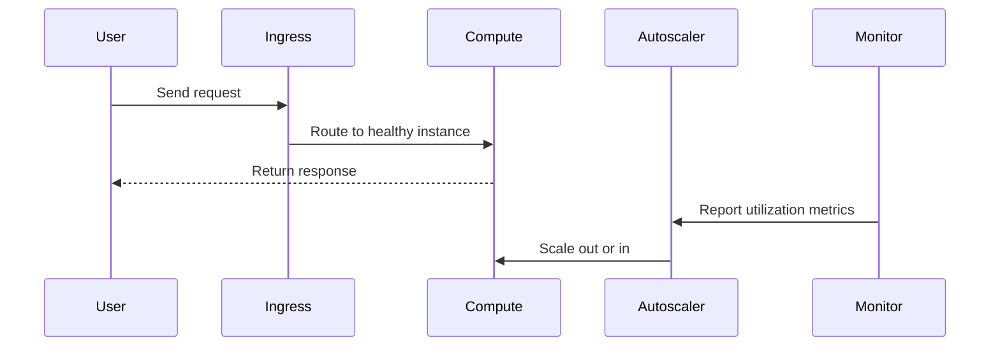

# Compute Engine Module Notes: Virtual Machine Instances

## Overview

- Virtual machines (VMs) are the most common infrastructure component in cloud environments.
- In Google Cloud, VMs are created and managed through **Compute Engine**.
- A VM is similar to a physical computer, but it is software-defined and runs on shared cloud hardware.

## Core VM Building Blocks

- **vCPU**: virtual processor capacity
- **Memory (RAM)**: runtime memory for workloads
- **Disk storage**: persistent data and operating system storage
- **IP address**: network identity and connectivity

## What Makes Compute Engine Powerful

- Compute Engine is highly flexible and supports many machine configurations.
- Some capabilities are cloud-specific and do not exist in traditional physical servers.

### Examples of Cloud-Only Behavior

- **Micro VM model**: CPU can be shared across VMs, reducing cost for smaller workloads.
- **Burst capability**: some VMs can temporarily run above baseline CPU capacity when shared physical resources are available.

## Main Configuration Areas

- CPU
- Memory
- Disks
- Networking

## Module Roadmap

1. Compute Engine fundamentals
2. Intro lab: create virtual machines
3. CPU and memory configuration options
4. Images and disk choices
5. Common day-to-day Compute Engine operations
6. Deep-dive lab covering module features and services

## Quick Summary

This module introduces Compute Engine VM fundamentals and prepares you to choose machine types, storage, and networking options for real-world workloads.

---

## Compute Engine: IaaS Model

- Compute Engine is a pure **Infrastructure as a Service (IaaS)** offering.
- You have full control over the VM and operating system — run any language or stack.
- You are responsible for managing the OS, autoscaling rules, and configuration.
- **Primary use case**: any generic workload, especially enterprise applications originally designed to run on server infrastructure.
  - This makes Compute Engine very portable and easy to lift-and-shift from on-premises.
  - Other services (e.g., GKE with containerized workloads) may not be as straightforward to migrate.

---

## What is Compute Engine?

- Physical servers running inside the Google Cloud environment with many configuration options.
- Supports both **predefined** and **custom machine types** — choose your own memory and CPU.
- Disk options: persistent disks (HDD or SSD), local SSDs, Cloud Storage, or a mix.
- Supports configurable networking interfaces.
- Supports both **Linux and Windows** machines.

### Features Covered in This Module

- Machine rightsizing
- Startup and shutdown scripts
- Metadata
- Availability policies
- OS patch management
- Pricing and usage discounts

---

## TPUs (Tensor Processing Units)

- CPUs and GPUs can no longer scale fast enough to meet ML demand.
- In **2016**, Google introduced the **Tensor Processing Unit (TPU)**.
- TPUs are **custom-developed application-specific integrated circuits (ASICs)** designed to accelerate machine learning workloads.
- They are **domain-specific hardware** (vs. general-purpose hardware like CPUs/GPUs).
  - Tailored for operations like matrix multiplication in ML.
- TPUs are generally **faster** than current GPUs and CPUs for AI workloads.
- TPUs are also significantly **more energy-efficient**.
- Cloud TPUs are integrated across Google products and available to Google Cloud customers.
- **Best suited for**: models that train for long durations, or large models with large effective batch sizes.

---

## Compute Options: CPU and Network Throughput

- Compute Engine provides several predefined machine types; you can also customize your own.
- **Network throughput scales with CPU count**:
  - **2 Gbps per vCPU core** (general rule)
  - Instances with **2 or 4 vCPUs**: up to **10 Gbps**
  - Theoretical maximum: **200 Gbps** for an instance with **176 vCPUs** on the **C3 machine series**
- Each **vCPU** is implemented as a single **hardware hyper-thread** on one of the available CPU platforms.
  - This is different from on-premises physical cores, which have hyperthreading on top.

---

## Disk Options

Three types of disk storage are available:

| Type                         | Description                             | Best For                              |
| ---------------------------- | --------------------------------------- | ------------------------------------- |
| **Standard persistent disk** | Backed by spinning hard drives (HDD)    | Higher capacity per dollar            |
| **SSD persistent disk**      | Backed by solid-state drives            | Higher IOPS per dollar                |
| **Local SSD**                | Physically attached to the host machine | Highest throughput and lowest latency |

### Key Points

- Standard vs. SSD persistent disks: **same capacity options**, different performance/cost trade-offs.
- **Local SSD**:
  - Higher throughput and lower latency than SSD persistent disks.
  - Data **persists only until the instance is stopped or deleted** (ephemeral).
  - Common use: swap disk or high-speed temporary storage (similar to a ramdisk).
- **Standard and non-local SSD persistent disks**: can be sized up to **257 TB per instance**.
- Disk performance **scales with the amount of GB allocated**.

---

## Networking

- Compute Engine supports **Application Load Balancing** and **Network Load Balancing**.
- Load balancers in Google Cloud **do not require pre-warming** — they are not hardware devices.
- A load balancer is essentially a **set of traffic engineering rules** applied at the Google network level.
  - VPC applies your rules to traffic destined for your IP address and subnet range.

---

## gcloud Commands

```bash
# List all VM instances
gcloud compute instances list

# Describe a VM
gcloud compute instances describe my-vm --zone=us-central1-a

# Create a VM
gcloud compute instances create my-vm --zone=us-central1-a \
  --machine-type=e2-medium \
  --image-family=debian-11 --image-project=debian-cloud
```

## ACE Exam-Style Practice Questions

### Q1
A Compute Engine Vm Overview workload requires full OS control and custom runtime with strict policy against managed platforms. Which compute option is best?

A. Compute Engine
B. Cloud Run Functions
C. App Engine Standard
D. Dataflow

Answer: A
Trap: Full host-level control is a strong Compute Engine signal.

### Q2
In a Compute Engine Vm Overview scenario, a fault-tolerant nightly batch workload is too expensive. What should you test and then use?

A. Spot or preemptible VMs after simulated interruption testing
B. Owner role on all instances
C. Single large sole-tenant node
D. Cloud DNS autoscaling

Answer: A
Trap: Interruptible workloads are classic candidates for discounted VM pricing models.

<!-- ACE_DEEP_ENRICHMENT_START -->
## ACE Deep Enrichment

### Think Like a Google Engineer
- Primary optimization axis: Elastic performance with minimum operational toil.
- Start with constraints first: SLO, security, compliance, latency, budget, and team operations capacity.
- Prefer managed services if they satisfy requirements with lower long-term operational toil.
- Minimize blast radius using environment isolation, least privilege, and failure-domain awareness.
- Design for day-2 operations: observability, rollback strategy, and quota or budget guardrails.

### Most Correct Option Filter (60 Seconds)
1. Eliminate options with broad access, single points of failure, or missing monitoring.
2. Confirm the option meets non-negotiables first: security and reliability requirements.
3. Compare remaining options on operational simplicity and long-term maintainability.
4. Use cost as an optimizer only after requirements and risk controls are satisfied.

### Weighted Decision Matrix
| Dimension | Weight | Strong Signal |
| --- | --- | --- |
| Security | 3 | Least privilege, secure defaults, no exposed blast radius |
| Reliability | 3 | Multi-zone or HA design, health checks, tested recovery path |
| Operability | 2 | Clear monitoring, alerting, rollout and rollback simplicity |
| Cost Efficiency | 2 | Right-sized resources, no waste, no reliability regression |
| Performance | 1 | Meets latency and throughput targets with headroom |

### Real-Life Scenario
A media startup has unpredictable traffic spikes during launches. They need faster releases, automatic scaling, and strong reliability without overpaying for idle capacity.

### Worked Example
- Choose managed compute first when operations overhead is a concern.
- For VM workloads, use managed instance groups with autoscaling and autohealing.
- For container workloads, use GKE node pools and rolling updates.
- For event-driven workloads, prefer Cloud Run or functions with concurrency controls.

### Flowchart


### Optimization Decision Flow


### Interaction Sequence


### Extra Exam Practice (10 Questions)
#### Q1
Scenario Focus: Compute Engine Module Notes: Virtual Machine Instances
Traffic triples during business hours and falls overnight. Which compute pattern is best?

A. Use autoscaling with target utilization and baseline minimum capacity.
B. Pin capacity to peak traffic all day for safety.
C. Restart failed instances manually as incidents occur.
D. Use one large VM because horizontal scaling is complex.

Answer: A
Why the other options are weaker: They typically ignore at least one hard constraint such as security, reliability, cost efficiency, or operational simplicity.
Google-engineer check: Reconfirm SLO fit, blast radius, and day-2 maintainability before finalizing.

#### Q2
Scenario Focus: Compute Engine Module Notes: Virtual Machine Instances
A VM app must self-heal when instances fail health checks. What should you use?

A. Restart failed instances manually as incidents occur.
B. Use a managed instance group with health checks and autohealing enabled.
C. Use one large VM because horizontal scaling is complex.
D. Deploy all changes at once without canary checks.

Answer: B
Why the other options are weaker: They typically ignore at least one hard constraint such as security, reliability, cost efficiency, or operational simplicity.
Google-engineer check: Reconfirm SLO fit, blast radius, and day-2 maintainability before finalizing.

#### Q3
Scenario Focus: Compute Engine Module Notes: Virtual Machine Instances
A team wants to deploy containers without managing nodes. Which platform fits best?

A. Use one large VM because horizontal scaling is complex.
B. Deploy all changes at once without canary checks.
C. Use Cloud Run for containerized services when node management is not required.
D. Ignore utilization metrics and optimize only by guesswork.

Answer: C
Why the other options are weaker: They typically ignore at least one hard constraint such as security, reliability, cost efficiency, or operational simplicity.
Google-engineer check: Reconfirm SLO fit, blast radius, and day-2 maintainability before finalizing.

#### Q4
Scenario Focus: Compute Engine Module Notes: Virtual Machine Instances
Which update strategy minimizes user impact during releases?

A. Deploy all changes at once without canary checks.
B. Ignore utilization metrics and optimize only by guesswork.
C. Pin capacity to peak traffic all day for safety.
D. Use rolling or blue-green deployment with health-based rollout checks.

Answer: D
Why the other options are weaker: They typically ignore at least one hard constraint such as security, reliability, cost efficiency, or operational simplicity.
Google-engineer check: Reconfirm SLO fit, blast radius, and day-2 maintainability before finalizing.

#### Q5
Scenario Focus: Compute Engine Module Notes: Virtual Machine Instances
How do you avoid overprovisioning while keeping performance stable?

A. Right-size resources and monitor saturation, latency, and error rates continuously.
B. Ignore utilization metrics and optimize only by guesswork.
C. Pin capacity to peak traffic all day for safety.
D. Restart failed instances manually as incidents occur.

Answer: A
Why the other options are weaker: They typically ignore at least one hard constraint such as security, reliability, cost efficiency, or operational simplicity.
Google-engineer check: Reconfirm SLO fit, blast radius, and day-2 maintainability before finalizing.

#### Q6
Scenario Focus: Compute Engine Module Notes: Virtual Machine Instances
Two designs both satisfy the happy path for Compute Engine Module Notes: Virtual Machine Instances. Which choice is most correct?

A. Pin capacity to peak traffic all day for safety.
B. Choose the option that preserves reliability and security while reducing operational burden.
C. Restart failed instances manually as incidents occur.
D. Use one large VM because horizontal scaling is complex.

Answer: B
Why the other options are weaker: They typically ignore at least one hard constraint such as security, reliability, cost efficiency, or operational simplicity.
Google-engineer check: Reconfirm SLO fit, blast radius, and day-2 maintainability before finalizing.

#### Q7
Scenario Focus: Compute Engine Module Notes: Virtual Machine Instances
What should you validate first before choosing an architecture for Compute Engine Module Notes: Virtual Machine Instances?

A. Restart failed instances manually as incidents occur.
B. Use one large VM because horizontal scaling is complex.
C. Validate SLO fit, blast radius, and least-privilege controls before comparing convenience.
D. Deploy all changes at once without canary checks.

Answer: C
Why the other options are weaker: They typically ignore at least one hard constraint such as security, reliability, cost efficiency, or operational simplicity.
Google-engineer check: Reconfirm SLO fit, blast radius, and day-2 maintainability before finalizing.

#### Q8
Scenario Focus: Compute Engine Module Notes: Virtual Machine Instances
A proposal lowers cost but increases failure risk. What is the best decision?

A. Use one large VM because horizontal scaling is complex.
B. Deploy all changes at once without canary checks.
C. Ignore utilization metrics and optimize only by guesswork.
D. Reject it unless reliability and recovery objectives remain within required targets.

Answer: D
Why the other options are weaker: They typically ignore at least one hard constraint such as security, reliability, cost efficiency, or operational simplicity.
Google-engineer check: Reconfirm SLO fit, blast radius, and day-2 maintainability before finalizing.

#### Q9
Scenario Focus: Compute Engine Module Notes: Virtual Machine Instances
Which option best reflects optimization for Elastic performance with minimum operational toil?

A. Select the design that best meets Elastic performance with minimum operational toil while keeping constraints balanced.
B. Deploy all changes at once without canary checks.
C. Ignore utilization metrics and optimize only by guesswork.
D. Pin capacity to peak traffic all day for safety.

Answer: A
Why the other options are weaker: They typically ignore at least one hard constraint such as security, reliability, cost efficiency, or operational simplicity.
Google-engineer check: Reconfirm SLO fit, blast radius, and day-2 maintainability before finalizing.

#### Q10
Scenario Focus: Compute Engine Module Notes: Virtual Machine Instances
How should you evaluate a design that needs frequent manual interventions?

A. Ignore utilization metrics and optimize only by guesswork.
B. Treat it as high risk and prefer automation-friendly designs with observability and rollback.
C. Pin capacity to peak traffic all day for safety.
D. Restart failed instances manually as incidents occur.

Answer: B
Why the other options are weaker: They typically ignore at least one hard constraint such as security, reliability, cost efficiency, or operational simplicity.
Google-engineer check: Reconfirm SLO fit, blast radius, and day-2 maintainability before finalizing.

### Quick Commands
```bash
gcloud compute instance-groups managed list --project=PROJECT_ID
gcloud compute instance-groups managed describe MIG_NAME --zone=ZONE --project=PROJECT_ID
gcloud run services list --region=REGION --project=PROJECT_ID
kubectl get pods -A
```

### Fast Recall
- Autoscaling is useful only with valid signals and guardrails.
- Managed offerings usually reduce operational burden.
- Deployment safety needs health checks and staged rollout.
<!-- ACE_DEEP_ENRICHMENT_END -->