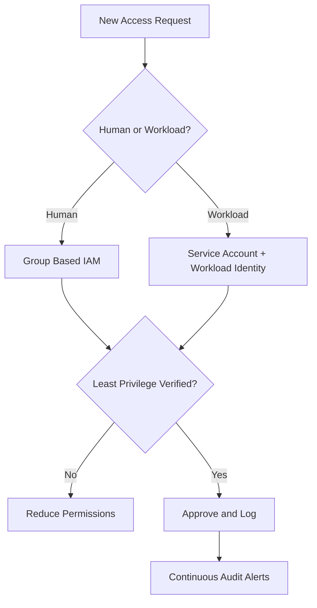
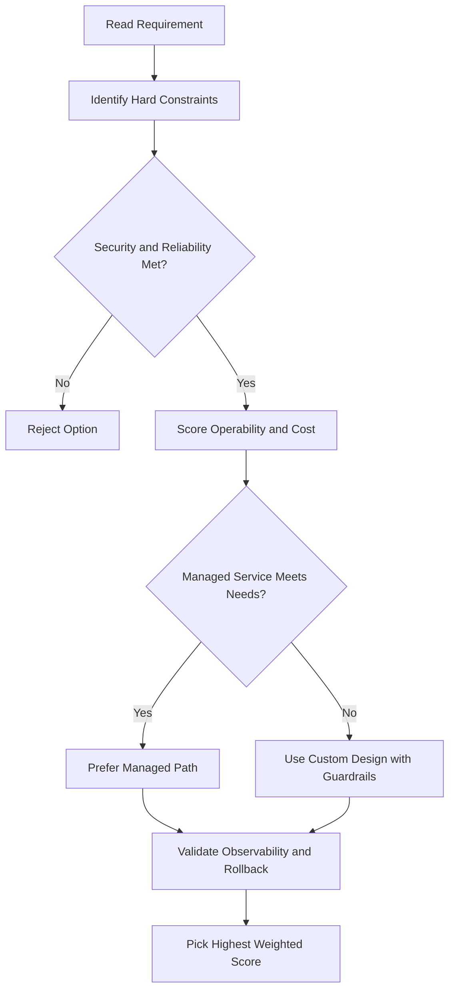
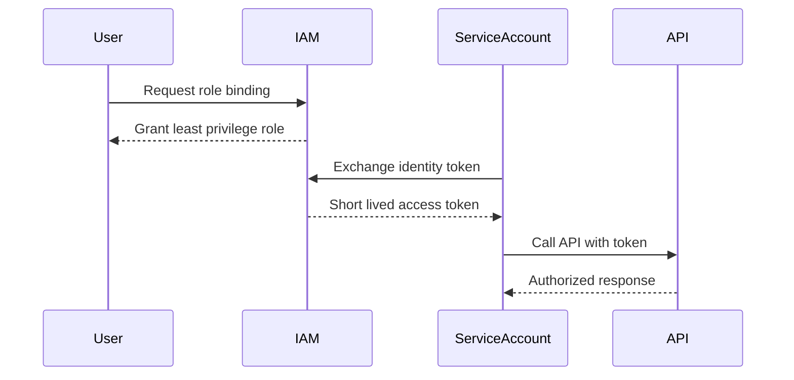

# VM Access, Lifecycle, and OS Management

## Accessing a VM

### Linux Instances

- The **instance creator** has full **root privileges** by default.
- Creator has **SSH access** and can grant SSH access to other users via the GCP Console.
- Required firewall rule: allow TCP port **22** (SSH).

### Windows Instances

- The creator uses the Console to generate a **username and password**.
- Anyone with those credentials can connect using an **RDP (Remote Desktop Protocol)** client.
- Required firewall rule: allow TCP port **3389** (RDP).

> If you're using the **default network**, these firewall rules are already defined — no manual setup needed.

---

## VM Lifecycle

A VM moves through several states from creation to deletion:

| State                      | What's Happening                                                                |
| -------------------------- | ------------------------------------------------------------------------------- |
| **Provisioning**           | Resources (CPU, memory, disks) are being reserved; VM not running yet           |
| **Staging**                | Resources acquired; IP addresses added, system image booting                    |
| **Running**                | VM is live; startup scripts run; SSH/RDP access enabled                         |
| **Stopping**               | Shutdown scripts run; transitioning to terminated                               |
| **Terminated**             | VM is stopped; can be restarted or deleted                                      |
| **Repairing**              | Internal error or host unavailable; VM unusable; not billed; not covered by SLA |
| **Suspending / Suspended** | VM is being suspended; can be resumed or deleted                                |

### While Running, You Can

- **Live migrate** the VM to another host in the same zone (no reboot needed).
- Move the VM to a **different zone**.
- Take a **snapshot** of the persistent disk.
- **Export** the system image.
- **Reconfigure metadata**.

### Stopping a VM (Required For)

- Upgrading machine type (e.g., adding more CPU).
- Changing the image is **not possible** on a stopped VM.

### Reset vs. Stop

- **Reset**: wipes memory and restarts the VM back to its initial state; VM stays in the **running** state throughout.
- **Stop**: transitions the VM to **terminated**; can then restart or delete.

### Shutdown Timing

- Normal shutdown (stop, reboot, delete): allows ~**90 seconds** for shutdown scripts.
- **Preemptible VMs**: if the instance doesn't stop within **30 seconds**, Compute Engine sends an **ACPI G3 Mechanical Off** signal — keep this in mind when writing shutdown scripts.

### Billing While Terminated

- You are **not charged** for CPU and memory when a VM is terminated.
- You **are charged** for any **attached persistent disks** and **reserved static IP addresses**.

---

## Availability Policies

- **On host maintenance**: default behavior is **live migrate**; can be changed to **terminate** during maintenance events.
- **Automatic restart**: if a VM is terminated due to a crash or maintenance, it **restarts automatically** by default; this can be disabled.
- These settings can be configured at **creation time** or **while the VM is running**.

---

## OS Patch Management

- When you use a **premium OS image**, the cost includes both OS usage and **patch management**.
- Use **OS Patch Management** to apply OS patches across a fleet of Compute Engine VMs.
- Long-running VMs need regular updates to stay secure and stable.

### Two Main Components

1. **Patch compliance reporting** — shows patch status across Windows and Linux VMs, with recommendations.
2. **Patch deployment** — automates OS and software patch updates via scheduled patch jobs.

### What You Can Do

- Create **patch approvals** — choose exactly which patches to apply from the available set.
- Set up **flexible scheduling** — one-time or recurring patch schedules.
- Apply **advanced configurations** — add pre/post patching scripts.
- Manage all patch jobs from a **centralized location**.

---

## gcloud Commands

```bash
# SSH into a Linux VM
gcloud compute ssh my-vm --zone=us-central1-a

# Start a stopped VM
gcloud compute instances start my-vm --zone=us-central1-a

# Stop a running VM
gcloud compute instances stop my-vm --zone=us-central1-a

# Reset a VM (wipes memory, restarts)
gcloud compute instances reset my-vm --zone=us-central1-a

# Suspend a VM
gcloud compute instances suspend my-vm --zone=us-central1-a

# Resume a suspended VM
gcloud compute instances resume my-vm --zone=us-central1-a
```

## ACE Exam-Style Practice Questions

### Q1
A Compute Engine Vm Access And Lifecycle workload requires full OS control and custom runtime with strict policy against managed platforms. Which compute option is best?

A. Compute Engine
B. Cloud Run Functions
C. App Engine Standard
D. Dataflow

Answer: A
Trap: Full host-level control is a strong Compute Engine signal.

### Q2
In a Compute Engine Vm Access And Lifecycle scenario, a fault-tolerant nightly batch workload is too expensive. What should you test and then use?

A. Spot or preemptible VMs after simulated interruption testing
B. Owner role on all instances
C. Single large sole-tenant node
D. Cloud DNS autoscaling

Answer: A
Trap: Interruptible workloads are classic candidates for discounted VM pricing models.

<!-- ACE_DEEP_ENRICHMENT_START -->
## ACE Deep Enrichment

### Think Like a Google Engineer
- Primary optimization axis: Security posture and blast-radius minimization.
- Start with constraints first: SLO, security, compliance, latency, budget, and team operations capacity.
- Prefer managed services if they satisfy requirements with lower long-term operational toil.
- Minimize blast radius using environment isolation, least privilege, and failure-domain awareness.
- Design for day-2 operations: observability, rollback strategy, and quota or budget guardrails.

### Most Correct Option Filter (60 Seconds)
1. Eliminate options with broad access, single points of failure, or missing monitoring.
2. Confirm the option meets non-negotiables first: security and reliability requirements.
3. Compare remaining options on operational simplicity and long-term maintainability.
4. Use cost as an optimizer only after requirements and risk controls are satisfied.

### Weighted Decision Matrix
| Dimension | Weight | Strong Signal |
| --- | --- | --- |
| Security | 3 | Least privilege, secure defaults, no exposed blast radius |
| Reliability | 3 | Multi-zone or HA design, health checks, tested recovery path |
| Operability | 2 | Clear monitoring, alerting, rollout and rollback simplicity |
| Cost Efficiency | 2 | Right-sized resources, no waste, no reliability regression |
| Performance | 1 | Meets latency and throughput targets with headroom |

### Real-Life Scenario
A fintech team is onboarding 40 engineers and 12 workloads in one quarter. They need strict access boundaries, auditability, and zero long-lived credentials while still shipping features fast.

### Worked Example
- Create separate projects for dev, staging, and prod so IAM and quotas are isolated.
- Map users to Google Groups and grant predefined roles at the narrowest scope.
- Use service accounts for workloads and rotate to short-lived credentials through Workload Identity.
- Enable audit logs and alert on policy changes and service account key creation.

### Flowchart


### Optimization Decision Flow


### Interaction Sequence


### Extra Exam Practice (10 Questions)
#### Q1
Scenario Focus: VM Access, Lifecycle, and OS Management
Your team must grant temporary production access for incident response. Which approach is best?

A. Grant a time-bound least-privilege role through group membership and audit the binding.
B. Grant Owner role temporarily and remove it manually later.
C. Share one administrator account for faster troubleshooting.
D. Store service account keys in a shared drive because it is internal.

Answer: A
Why the other options are weaker: They typically ignore at least one hard constraint such as security, reliability, cost efficiency, or operational simplicity.
Google-engineer check: Reconfirm SLO fit, blast radius, and day-2 maintainability before finalizing.

#### Q2
Scenario Focus: VM Access, Lifecycle, and OS Management
A workload is still using a JSON key file in source control. What is the best fix?

A. Share one administrator account for faster troubleshooting.
B. Move to service account impersonation or Workload Identity and disable long-lived keys.
C. Store service account keys in a shared drive because it is internal.
D. Apply organization-level broad roles so future access requests are avoided.

Answer: B
Why the other options are weaker: They typically ignore at least one hard constraint such as security, reliability, cost efficiency, or operational simplicity.
Google-engineer check: Reconfirm SLO fit, blast radius, and day-2 maintainability before finalizing.

#### Q3
Scenario Focus: VM Access, Lifecycle, and OS Management
Which setup best reduces blast radius across environments?

A. Store service account keys in a shared drive because it is internal.
B. Apply organization-level broad roles so future access requests are avoided.
C. Use separate projects per environment with narrow IAM bindings at project or resource level.
D. Skip audit logs to reduce logging costs during non-peak hours.

Answer: C
Why the other options are weaker: They typically ignore at least one hard constraint such as security, reliability, cost efficiency, or operational simplicity.
Google-engineer check: Reconfirm SLO fit, blast radius, and day-2 maintainability before finalizing.

#### Q4
Scenario Focus: VM Access, Lifecycle, and OS Management
What should you monitor first for IAM abuse detection?

A. Apply organization-level broad roles so future access requests are avoided.
B. Skip audit logs to reduce logging costs during non-peak hours.
C. Grant Owner role temporarily and remove it manually later.
D. Alert on IAM policy changes, service account key creation, and high-risk privilege grants.

Answer: D
Why the other options are weaker: They typically ignore at least one hard constraint such as security, reliability, cost efficiency, or operational simplicity.
Google-engineer check: Reconfirm SLO fit, blast radius, and day-2 maintainability before finalizing.

#### Q5
Scenario Focus: VM Access, Lifecycle, and OS Management
A developer needs read-only billing visibility. Which decision is best?

A. Assign a billing viewer role at the required scope instead of broad project editor access.
B. Skip audit logs to reduce logging costs during non-peak hours.
C. Grant Owner role temporarily and remove it manually later.
D. Share one administrator account for faster troubleshooting.

Answer: A
Why the other options are weaker: They typically ignore at least one hard constraint such as security, reliability, cost efficiency, or operational simplicity.
Google-engineer check: Reconfirm SLO fit, blast radius, and day-2 maintainability before finalizing.

#### Q6
Scenario Focus: VM Access, Lifecycle, and OS Management
Two designs both satisfy the happy path for VM Access, Lifecycle, and OS Management. Which choice is most correct?

A. Grant Owner role temporarily and remove it manually later.
B. Choose the option that preserves reliability and security while reducing operational burden.
C. Share one administrator account for faster troubleshooting.
D. Store service account keys in a shared drive because it is internal.

Answer: B
Why the other options are weaker: They typically ignore at least one hard constraint such as security, reliability, cost efficiency, or operational simplicity.
Google-engineer check: Reconfirm SLO fit, blast radius, and day-2 maintainability before finalizing.

#### Q7
Scenario Focus: VM Access, Lifecycle, and OS Management
What should you validate first before choosing an architecture for VM Access, Lifecycle, and OS Management?

A. Share one administrator account for faster troubleshooting.
B. Store service account keys in a shared drive because it is internal.
C. Validate SLO fit, blast radius, and least-privilege controls before comparing convenience.
D. Apply organization-level broad roles so future access requests are avoided.

Answer: C
Why the other options are weaker: They typically ignore at least one hard constraint such as security, reliability, cost efficiency, or operational simplicity.
Google-engineer check: Reconfirm SLO fit, blast radius, and day-2 maintainability before finalizing.

#### Q8
Scenario Focus: VM Access, Lifecycle, and OS Management
A proposal lowers cost but increases failure risk. What is the best decision?

A. Store service account keys in a shared drive because it is internal.
B. Apply organization-level broad roles so future access requests are avoided.
C. Skip audit logs to reduce logging costs during non-peak hours.
D. Reject it unless reliability and recovery objectives remain within required targets.

Answer: D
Why the other options are weaker: They typically ignore at least one hard constraint such as security, reliability, cost efficiency, or operational simplicity.
Google-engineer check: Reconfirm SLO fit, blast radius, and day-2 maintainability before finalizing.

#### Q9
Scenario Focus: VM Access, Lifecycle, and OS Management
Which option best reflects optimization for Security posture and blast-radius minimization?

A. Select the design that best meets Security posture and blast-radius minimization while keeping constraints balanced.
B. Apply organization-level broad roles so future access requests are avoided.
C. Skip audit logs to reduce logging costs during non-peak hours.
D. Grant Owner role temporarily and remove it manually later.

Answer: A
Why the other options are weaker: They typically ignore at least one hard constraint such as security, reliability, cost efficiency, or operational simplicity.
Google-engineer check: Reconfirm SLO fit, blast radius, and day-2 maintainability before finalizing.

#### Q10
Scenario Focus: VM Access, Lifecycle, and OS Management
How should you evaluate a design that needs frequent manual interventions?

A. Skip audit logs to reduce logging costs during non-peak hours.
B. Treat it as high risk and prefer automation-friendly designs with observability and rollback.
C. Grant Owner role temporarily and remove it manually later.
D. Share one administrator account for faster troubleshooting.

Answer: B
Why the other options are weaker: They typically ignore at least one hard constraint such as security, reliability, cost efficiency, or operational simplicity.
Google-engineer check: Reconfirm SLO fit, blast radius, and day-2 maintainability before finalizing.

### Quick Commands
```bash
gcloud projects get-iam-policy PROJECT_ID
gcloud projects add-iam-policy-binding PROJECT_ID --member=group:team@example.com --role=roles/viewer
gcloud iam service-accounts list --project=PROJECT_ID
gcloud logging read "protoPayload.methodName=\"SetIamPolicy\"" --freshness=7d --project=PROJECT_ID --limit=20
```

### Fast Recall
- Least privilege beats convenience in all exam scenarios.
- Prefer groups for humans and service accounts for workloads.
- Avoid long-lived keys whenever possible.
<!-- ACE_DEEP_ENRICHMENT_END -->