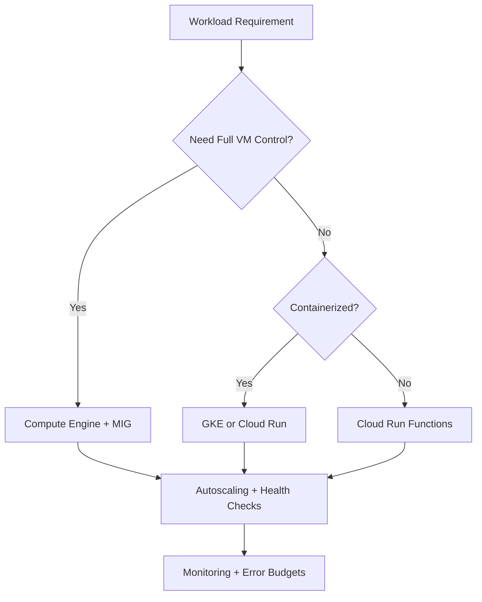
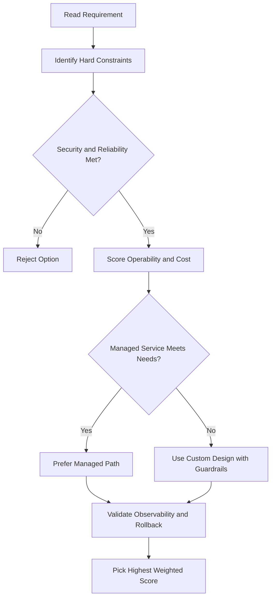
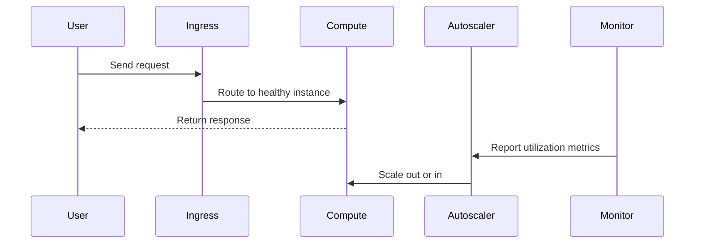

# Compute Engine Machine Families

## Ways to Create and Configure a VM

1. **GCP Console** — visual, easy, shows real-time cost
2. **Cloud Shell / `gcloud` CLI** — good for scripting and automation
3. **RESTful API** — best for complex, programmatic configurations

> Tip: Configure a VM in the Console first, then use the equivalent REST/CLI output to avoid typos and see all available options.

---

## Machine Family Overview

When creating a VM, you pick a **machine type** from a **machine family**. Each family is optimized for different workloads.

There are **four machine families**:

1. General-purpose
2. Compute-optimized
3. Memory-optimized
4. Accelerator-optimized

---

## 1. General-Purpose

Best price-performance; most flexible vCPU-to-memory ratios; targets standard and cloud-native workloads.

| Series             | Description                                                                     | vCPUs     | Memory/vCPU | Use Cases                                                |
| ------------------ | ------------------------------------------------------------------------------- | --------- | ----------- | -------------------------------------------------------- |
| **E2**             | Lowest cost; no CPU architecture dependency                                     | 2–32      | 0.5–8 GB    | Web servers, small/medium DBs, dev/test                  |
| **E2 Shared-core** | Uses context-switching to share a physical core                                 | 0.25–1    | 0.5–8 GB    | Small, non-resource-intensive apps                       |
| **N2** (Intel)     | Next-gen after N1; flexible shapes; Cascade Lake (≤80 vCPU) / Ice Lake (larger) | Up to 128 | 0.5–8 GB    | Enterprise apps, medium-large DBs, web serving           |
| **N2D** (AMD)      | AMD EPYC Milan/Rome; large node sizes                                           | Up to 224 | 0.5–8 GB    | Same as N2                                               |
| **T2D** (AMD)      | 3rd Gen AMD EPYC; scale-out workloads; full x86                                 | Up to 60  | 4 GB        | Web servers, microservices, media transcoding, Java apps |
| **T2A** (Arm)      | First Arm-based series in GCP; Ampere Altra 64-core @ 3 GHz                     | —         | —           | Containerized workloads; supported by GKE node pools     |

---

## 2. Compute-Optimized

Highest performance per core; best for compute-intensive workloads.

| Series  | Processor                                         | vCPUs | Memory       | Use Cases                                                  |
| ------- | ------------------------------------------------- | ----- | ------------ | ---------------------------------------------------------- |
| **C2**  | Intel Cascade Lake (up to 3.8 GHz all-core turbo) | 4–60  | Up to 240 GB | Gaming, EDA, HPC, simulations, genomics, media transcoding |
| **C2D** | AMD EPYC Milan; largest LLC per core              | 2–112 | 4 GB/vCPU    | High-performance computing                                 |
| **H3**  | Intel Sapphire Rapids + Google custom IPU         | 88    | 352 GB DDR5  | High-performance computing                                 |

- C2 and C2D can attach up to **3 TB of local storage** for storage-intensive workloads.

---

## 3. Memory-Optimized

Most memory per vCPU of any family; lowest cost per GB of memory on Compute Engine.

| Series | Max Memory                                     | Use Cases                                |
| ------ | ---------------------------------------------- | ---------------------------------------- |
| **M1** | Up to 4 TB                                     | SAP HANA, in-memory databases, analytics |
| **M2** | Up to 12 TB                                    | Large in-memory databases, analytics     |
| **M3** | Up to 128 vCPUs, 30.5 GB/vCPU (Intel Ice Lake) | Genomic modeling, EDA, HPC               |

- M1 and M2 offer up to **30% sustained use discounts** and **>60% savings** with 3-year committed use discounts.

---

## 4. Accelerator-Optimized

Best for massively parallel GPU workloads (CUDA); ideal for ML and HPC.

| Series | vCPUs | Memory                            | GPU                                           | Use Cases                                                           |
| ------ | ----- | --------------------------------- | --------------------------------------------- | ------------------------------------------------------------------- |
| **A2** | 12–96 | Up to 1,360 GB                    | Up to 16x NVIDIA A100 (40 GB GPU memory each) | LLMs, HPC, large databases                                          |
| **G2** | 4–96  | Up to 432 GB (Intel Cascade Lake) | NVIDIA L4                                     | CUDA ML training/inference, video transcoding, remote visualization |

---

## Custom Machine Types

Use when no predefined type fits your workload exactly.

- Specify your own **vCPU count** and **memory amount**.
- Costs slightly more than an equivalent predefined type.

**Constraints:**

- vCPUs must be **1 or an even number**.
- Memory must be between **1 GB and 8 GB per vCPU**.
- Total memory must be a **multiple of 256 MB**.
- Need more than 8 GB/vCPU? Use **extended memory** (available at additional cost).

## ACE Exam-Style Practice Questions

### Q1
A Compute Engine Machine Families workload requires full OS control and custom runtime with strict policy against managed platforms. Which compute option is best?

A. Compute Engine
B. Cloud Run Functions
C. App Engine Standard
D. Dataflow

Answer: A
Trap: Full host-level control is a strong Compute Engine signal.

### Q2
In a Compute Engine Machine Families scenario, a fault-tolerant nightly batch workload is too expensive. What should you test and then use?

A. Spot or preemptible VMs after simulated interruption testing
B. Owner role on all instances
C. Single large sole-tenant node
D. Cloud DNS autoscaling

Answer: A
Trap: Interruptible workloads are classic candidates for discounted VM pricing models.

<!-- ACE_DEEP_ENRICHMENT_START -->
## ACE Deep Enrichment

### Think Like a Google Engineer
- Primary optimization axis: Elastic performance with minimum operational toil.
- Start with constraints first: SLO, security, compliance, latency, budget, and team operations capacity.
- Prefer managed services if they satisfy requirements with lower long-term operational toil.
- Minimize blast radius using environment isolation, least privilege, and failure-domain awareness.
- Design for day-2 operations: observability, rollback strategy, and quota or budget guardrails.

### Most Correct Option Filter (60 Seconds)
1. Eliminate options with broad access, single points of failure, or missing monitoring.
2. Confirm the option meets non-negotiables first: security and reliability requirements.
3. Compare remaining options on operational simplicity and long-term maintainability.
4. Use cost as an optimizer only after requirements and risk controls are satisfied.

### Weighted Decision Matrix
| Dimension | Weight | Strong Signal |
| --- | --- | --- |
| Security | 3 | Least privilege, secure defaults, no exposed blast radius |
| Reliability | 3 | Multi-zone or HA design, health checks, tested recovery path |
| Operability | 2 | Clear monitoring, alerting, rollout and rollback simplicity |
| Cost Efficiency | 2 | Right-sized resources, no waste, no reliability regression |
| Performance | 1 | Meets latency and throughput targets with headroom |

### Real-Life Scenario
A media startup has unpredictable traffic spikes during launches. They need faster releases, automatic scaling, and strong reliability without overpaying for idle capacity.

### Worked Example
- Choose managed compute first when operations overhead is a concern.
- For VM workloads, use managed instance groups with autoscaling and autohealing.
- For container workloads, use GKE node pools and rolling updates.
- For event-driven workloads, prefer Cloud Run or functions with concurrency controls.

### Flowchart


### Optimization Decision Flow


### Interaction Sequence


### Extra Exam Practice (15 Questions)
#### Q1
Scenario Focus: Compute Engine Machine Families
Traffic triples during business hours and falls overnight. Which compute pattern is best?

A. Use autoscaling with target utilization and baseline minimum capacity.
B. Pin capacity to peak traffic all day for safety.
C. Restart failed instances manually as incidents occur.
D. Use one large VM because horizontal scaling is complex.

Answer: A
Why the other options are weaker: They typically ignore at least one hard constraint such as security, reliability, cost efficiency, or operational simplicity.
Google-engineer check: Reconfirm SLO fit, blast radius, and day-2 maintainability before finalizing.

#### Q2
Scenario Focus: Compute Engine Machine Families
A VM app must self-heal when instances fail health checks. What should you use?

A. Restart failed instances manually as incidents occur.
B. Use a managed instance group with health checks and autohealing enabled.
C. Use one large VM because horizontal scaling is complex.
D. Deploy all changes at once without canary checks.

Answer: B
Why the other options are weaker: They typically ignore at least one hard constraint such as security, reliability, cost efficiency, or operational simplicity.
Google-engineer check: Reconfirm SLO fit, blast radius, and day-2 maintainability before finalizing.

#### Q3
Scenario Focus: Compute Engine Machine Families
A team wants to deploy containers without managing nodes. Which platform fits best?

A. Use one large VM because horizontal scaling is complex.
B. Deploy all changes at once without canary checks.
C. Use Cloud Run for containerized services when node management is not required.
D. Ignore utilization metrics and optimize only by guesswork.

Answer: C
Why the other options are weaker: They typically ignore at least one hard constraint such as security, reliability, cost efficiency, or operational simplicity.
Google-engineer check: Reconfirm SLO fit, blast radius, and day-2 maintainability before finalizing.

#### Q4
Scenario Focus: Compute Engine Machine Families
Which update strategy minimizes user impact during releases?

A. Deploy all changes at once without canary checks.
B. Ignore utilization metrics and optimize only by guesswork.
C. Pin capacity to peak traffic all day for safety.
D. Use rolling or blue-green deployment with health-based rollout checks.

Answer: D
Why the other options are weaker: They typically ignore at least one hard constraint such as security, reliability, cost efficiency, or operational simplicity.
Google-engineer check: Reconfirm SLO fit, blast radius, and day-2 maintainability before finalizing.

#### Q5
Scenario Focus: Compute Engine Machine Families
How do you avoid overprovisioning while keeping performance stable?

A. Right-size resources and monitor saturation, latency, and error rates continuously.
B. Ignore utilization metrics and optimize only by guesswork.
C. Pin capacity to peak traffic all day for safety.
D. Restart failed instances manually as incidents occur.

Answer: A
Why the other options are weaker: They typically ignore at least one hard constraint such as security, reliability, cost efficiency, or operational simplicity.
Google-engineer check: Reconfirm SLO fit, blast radius, and day-2 maintainability before finalizing.

#### Q6
Scenario Focus: Compute Engine Machine Families
Two designs both satisfy the happy path for Compute Engine Machine Families. Which choice is most correct?

A. Pin capacity to peak traffic all day for safety.
B. Choose the option that preserves reliability and security while reducing operational burden.
C. Restart failed instances manually as incidents occur.
D. Use one large VM because horizontal scaling is complex.

Answer: B
Why the other options are weaker: They typically ignore at least one hard constraint such as security, reliability, cost efficiency, or operational simplicity.
Google-engineer check: Reconfirm SLO fit, blast radius, and day-2 maintainability before finalizing.

#### Q7
Scenario Focus: Compute Engine Machine Families
What should you validate first before choosing an architecture for Compute Engine Machine Families?

A. Restart failed instances manually as incidents occur.
B. Use one large VM because horizontal scaling is complex.
C. Validate SLO fit, blast radius, and least-privilege controls before comparing convenience.
D. Deploy all changes at once without canary checks.

Answer: C
Why the other options are weaker: They typically ignore at least one hard constraint such as security, reliability, cost efficiency, or operational simplicity.
Google-engineer check: Reconfirm SLO fit, blast radius, and day-2 maintainability before finalizing.

#### Q8
Scenario Focus: Compute Engine Machine Families
A proposal lowers cost but increases failure risk. What is the best decision?

A. Use one large VM because horizontal scaling is complex.
B. Deploy all changes at once without canary checks.
C. Ignore utilization metrics and optimize only by guesswork.
D. Reject it unless reliability and recovery objectives remain within required targets.

Answer: D
Why the other options are weaker: They typically ignore at least one hard constraint such as security, reliability, cost efficiency, or operational simplicity.
Google-engineer check: Reconfirm SLO fit, blast radius, and day-2 maintainability before finalizing.

#### Q9
Scenario Focus: Compute Engine Machine Families
Which option best reflects optimization for Elastic performance with minimum operational toil?

A. Select the design that best meets Elastic performance with minimum operational toil while keeping constraints balanced.
B. Deploy all changes at once without canary checks.
C. Ignore utilization metrics and optimize only by guesswork.
D. Pin capacity to peak traffic all day for safety.

Answer: A
Why the other options are weaker: They typically ignore at least one hard constraint such as security, reliability, cost efficiency, or operational simplicity.
Google-engineer check: Reconfirm SLO fit, blast radius, and day-2 maintainability before finalizing.

#### Q10
Scenario Focus: Compute Engine Machine Families
How should you evaluate a design that needs frequent manual interventions?

A. Ignore utilization metrics and optimize only by guesswork.
B. Treat it as high risk and prefer automation-friendly designs with observability and rollback.
C. Pin capacity to peak traffic all day for safety.
D. Restart failed instances manually as incidents occur.

Answer: B
Why the other options are weaker: They typically ignore at least one hard constraint such as security, reliability, cost efficiency, or operational simplicity.
Google-engineer check: Reconfirm SLO fit, blast radius, and day-2 maintainability before finalizing.

#### Q11
Scenario Focus: Compute Engine Machine Families
Two options have similar latency. Which tie-breaker is best?

A. Pin capacity to peak traffic all day for safety.
B. Restart failed instances manually as incidents occur.
C. Pick the option with stronger operability, clearer failure isolation, and simpler incident response.
D. Use one large VM because horizontal scaling is complex.

Answer: C
Why the other options are weaker: They typically ignore at least one hard constraint such as security, reliability, cost efficiency, or operational simplicity.
Google-engineer check: Reconfirm SLO fit, blast radius, and day-2 maintainability before finalizing.

#### Q12
Scenario Focus: Compute Engine Machine Families
What is the best way to choose between a custom stack and a managed service?

A. Restart failed instances manually as incidents occur.
B. Use one large VM because horizontal scaling is complex.
C. Deploy all changes at once without canary checks.
D. Prefer managed services when they meet requirements with lower long-term maintenance effort.

Answer: D
Why the other options are weaker: They typically ignore at least one hard constraint such as security, reliability, cost efficiency, or operational simplicity.
Google-engineer check: Reconfirm SLO fit, blast radius, and day-2 maintainability before finalizing.

#### Q13
Scenario Focus: Compute Engine Machine Families
How do you confirm a solution is production-ready for 

A. Verify monitoring, alerting, rollback path, quota and budget controls, and secure defaults.
B. Use one large VM because horizontal scaling is complex.
C. Deploy all changes at once without canary checks.
D. Ignore utilization metrics and optimize only by guesswork.

Answer: A
Why the other options are weaker: They typically ignore at least one hard constraint such as security, reliability, cost efficiency, or operational simplicity.
Google-engineer check: Reconfirm SLO fit, blast radius, and day-2 maintainability before finalizing.

#### Q14
Scenario Focus: Compute Engine Machine Families
Which pattern usually wins in ACE scenario tie-breakers?

A. Deploy all changes at once without canary checks.
B. Managed-service-first plus least-privilege access plus clear observability usually wins.
C. Ignore utilization metrics and optimize only by guesswork.
D. Pin capacity to peak traffic all day for safety.

Answer: B
Why the other options are weaker: They typically ignore at least one hard constraint such as security, reliability, cost efficiency, or operational simplicity.
Google-engineer check: Reconfirm SLO fit, blast radius, and day-2 maintainability before finalizing.

#### Q15
Scenario Focus: Compute Engine Machine Families
What is the best final check before locking the answer?

A. Ignore utilization metrics and optimize only by guesswork.
B. Pin capacity to peak traffic all day for safety.
C. Run a weighted check across security, reliability, cost, performance, and operability.
D. Restart failed instances manually as incidents occur.

Answer: C
Why the other options are weaker: They typically ignore at least one hard constraint such as security, reliability, cost efficiency, or operational simplicity.
Google-engineer check: Reconfirm SLO fit, blast radius, and day-2 maintainability before finalizing.

### Quick Commands
```bash
gcloud compute instance-groups managed list --project=PROJECT_ID
gcloud compute instance-groups managed describe MIG_NAME --zone=ZONE --project=PROJECT_ID
gcloud run services list --region=REGION --project=PROJECT_ID
kubectl get pods -A
```

### Fast Recall
- Autoscaling is useful only with valid signals and guardrails.
- Managed offerings usually reduce operational burden.
- Deployment safety needs health checks and staged rollout.
<!-- ACE_DEEP_ENRICHMENT_END -->