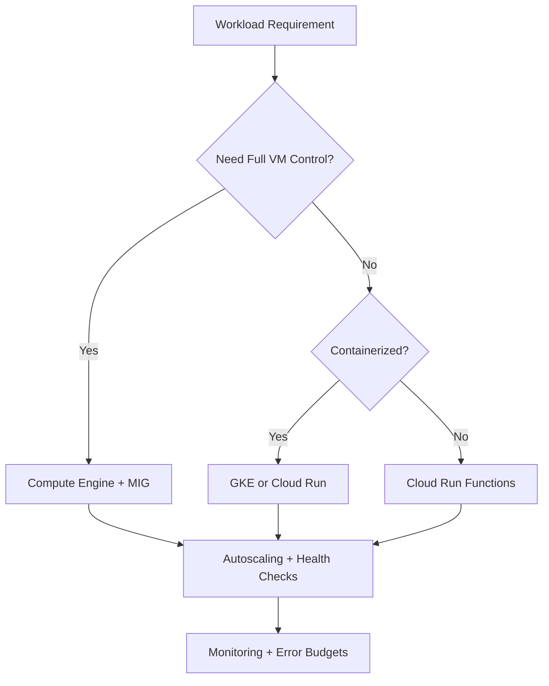
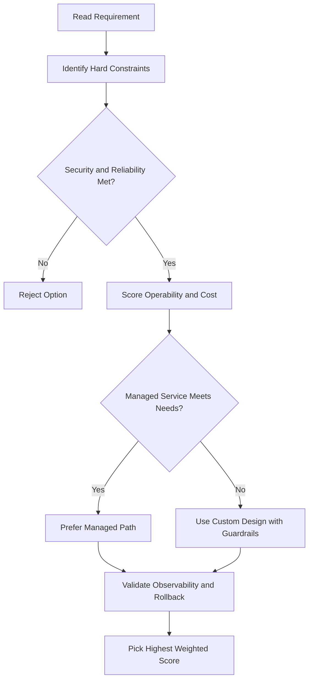
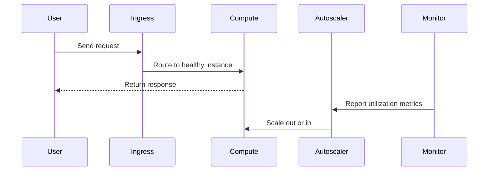

# Compute Engine: Special VM Types

## Preemptible VMs

- Run at **60–91% discount** compared to normal instances.
- Can be **preempted at any time** by GCP if it needs those resources.
- **No charge** if the VM is preempted within the first minute.
- Maximum runtime: **24 hours**.
- You get a **30-second notification** before the machine is preempted.
- **No live migration** and **no automatic restarts**.
- You can use external monitoring and load balancers to automatically start new preemptible VMs if one is preempted.

### Best Use Case: Batch Processing

- If some instances terminate mid-job, the job slows down but does not stop completely.
- Lets you complete batch tasks without adding load to existing instances and without paying full price.

---

## Spot VMs

- Spot VMs are the **latest version** of preemptible VMs, using the **spot provisioning model**.
- Preemptible VMs continue to be supported and use the same pricing as Spot VMs.
- Key difference: Spot VMs have **no maximum runtime** (preemptible VMs cap at 24 hours).

### What's the Same as Preemptible VMs

- GCP may preempt Spot VMs at any time to reclaim resources.
- **No live migration** to standard VMs while running.
- **No automatic restart** on maintenance events.
- Finite capacity — not always available; availability varies by day and zone.

### Tips for Getting Spot VM Capacity

- Capacity is easier to obtain for **smaller machine types** (fewer vCPUs and less memory).
- Resources come from Google's excess and backup capacity.

---

## Sole-Tenant Nodes

- A **sole-tenant node** is a physical Compute Engine server dedicated exclusively to **your project**.
- All VM instances on the node belong to the same project — physically isolated from other customers.
- Use cases:
  - Compliance requirements (e.g., payment processing workloads that must be isolated).
  - Grouping instances together on the same host hardware.
- You can fill a node with **multiple smaller VM instances** of varying sizes, including custom machine types and extended memory instances.
- Supports **bring-your-own-license (BYOL)** for existing OS licenses, with the in-place restart feature to minimize physical core usage.

---

## Shielded VMs

- Offer **verifiable integrity** — you can be confident instances haven't been compromised by boot-level malware or rootkits.
- Integrity is achieved through three mechanisms:
  1. **Secure Boot** — only trusted software is allowed to run during boot.
  2. **vTPM-enabled Measured Boot** — virtual Trusted Platform Module measures the boot process.
  3. **Integrity monitoring** — compares boot measurements against a trusted baseline.
- Part of the **Shielded Cloud Initiative**, which aims to provide a more secure foundation across all of Google Cloud.
- Features include **vTPM shielding/sealing** to help prevent data exfiltration.
- To use Shielded VM features, you must select a **shielded image** when creating the VM.

---

## Confidential VMs

- Allow you to **encrypt data in use** — while it is being processed in memory.
- No code changes required; no significant performance penalty.
- Built on **N2D Compute Engine VM instances** running on **AMD EPYC "Rome"** (2nd Gen) processors.
- Uses **AMD Secure Encrypted Virtualization (SEV)** for inline memory encryption.
- The AMD Rome processor family is optimized for:
  - High memory capacity
  - High throughput
  - Parallel workloads
- **Google does not have access to the encryption keys**.
- Can be enabled when creating a VM via the GCP Console, Compute Engine API, or `gcloud` CLI.

## ACE Exam-Style Practice Questions

### Q1
A Compute Engine Special Vm Types workload requires full OS control and custom runtime with strict policy against managed platforms. Which compute option is best?

A. Compute Engine
B. Cloud Run Functions
C. App Engine Standard
D. Dataflow

Answer: A
Trap: Full host-level control is a strong Compute Engine signal.

### Q2
In a Compute Engine Special Vm Types scenario, a fault-tolerant nightly batch workload is too expensive. What should you test and then use?

A. Spot or preemptible VMs after simulated interruption testing
B. Owner role on all instances
C. Single large sole-tenant node
D. Cloud DNS autoscaling

Answer: A
Trap: Interruptible workloads are classic candidates for discounted VM pricing models.

<!-- ACE_DEEP_ENRICHMENT_START -->
## ACE Deep Enrichment

### Think Like a Google Engineer
- Primary optimization axis: Elastic performance with minimum operational toil.
- Start with constraints first: SLO, security, compliance, latency, budget, and team operations capacity.
- Prefer managed services if they satisfy requirements with lower long-term operational toil.
- Minimize blast radius using environment isolation, least privilege, and failure-domain awareness.
- Design for day-2 operations: observability, rollback strategy, and quota or budget guardrails.

### Most Correct Option Filter (60 Seconds)
1. Eliminate options with broad access, single points of failure, or missing monitoring.
2. Confirm the option meets non-negotiables first: security and reliability requirements.
3. Compare remaining options on operational simplicity and long-term maintainability.
4. Use cost as an optimizer only after requirements and risk controls are satisfied.

### Weighted Decision Matrix
| Dimension | Weight | Strong Signal |
| --- | --- | --- |
| Security | 3 | Least privilege, secure defaults, no exposed blast radius |
| Reliability | 3 | Multi-zone or HA design, health checks, tested recovery path |
| Operability | 2 | Clear monitoring, alerting, rollout and rollback simplicity |
| Cost Efficiency | 2 | Right-sized resources, no waste, no reliability regression |
| Performance | 1 | Meets latency and throughput targets with headroom |

### Real-Life Scenario
A media startup has unpredictable traffic spikes during launches. They need faster releases, automatic scaling, and strong reliability without overpaying for idle capacity.

### Worked Example
- Choose managed compute first when operations overhead is a concern.
- For VM workloads, use managed instance groups with autoscaling and autohealing.
- For container workloads, use GKE node pools and rolling updates.
- For event-driven workloads, prefer Cloud Run or functions with concurrency controls.

### Flowchart


### Optimization Decision Flow


### Interaction Sequence


### Extra Exam Practice (15 Questions)
#### Q1

Scenario Focus: Compute Engine: Special VM Types

Traffic triples during business hours and falls overnight. Which compute pattern is best?

A. Use autoscaling with target utilization and baseline minimum capacity.  
B. Pin capacity to peak traffic all day for safety.  
C. Restart failed instances manually as incidents occur.  
D. Use one large VM because horizontal scaling is complex.

Answer: A  
Why the other options are weaker: They typically ignore at least one hard constraint such as security, reliability, cost efficiency, or operational simplicity.  
Google-engineer check: Reconfirm SLO fit, blast radius, and day-2 maintainability before finalizing.

#### Q2

Scenario Focus: Compute Engine: Special VM Types

A VM app must self-heal when instances fail health checks. What should you use?

A. Restart failed instances manually as incidents occur.  
B. Use a managed instance group with health checks and autohealing enabled.  
C. Use one large VM because horizontal scaling is complex.  
D. Deploy all changes at once without canary checks.

Answer: B  
Why the other options are weaker: They typically ignore at least one hard constraint such as security, reliability, cost efficiency, or operational simplicity.  
Google-engineer check: Reconfirm SLO fit, blast radius, and day-2 maintainability before finalizing.

#### Q3

Scenario Focus: Compute Engine: Special VM Types

A team wants to deploy containers without managing nodes. Which platform fits best?

A. Use one large VM because horizontal scaling is complex.  
B. Deploy all changes at once without canary checks.  
C. Use Cloud Run for containerized services when node management is not required.  
D. Ignore utilization metrics and optimize only by guesswork.

Answer: C  
Why the other options are weaker: They typically ignore at least one hard constraint such as security, reliability, cost efficiency, or operational simplicity.  
Google-engineer check: Reconfirm SLO fit, blast radius, and day-2 maintainability before finalizing.

#### Q4

Scenario Focus: Compute Engine: Special VM Types

Which update strategy minimizes user impact during releases?

A. Deploy all changes at once without canary checks.  
B. Ignore utilization metrics and optimize only by guesswork.  
C. Pin capacity to peak traffic all day for safety.  
D. Use rolling or blue-green deployment with health-based rollout checks.

Answer: D  
Why the other options are weaker: They typically ignore at least one hard constraint such as security, reliability, cost efficiency, or operational simplicity.  
Google-engineer check: Reconfirm SLO fit, blast radius, and day-2 maintainability before finalizing.

#### Q5

Scenario Focus: Compute Engine: Special VM Types

How do you avoid overprovisioning while keeping performance stable?

A. Right-size resources and monitor saturation, latency, and error rates continuously.  
B. Ignore utilization metrics and optimize only by guesswork.  
C. Pin capacity to peak traffic all day for safety.  
D. Restart failed instances manually as incidents occur.

Answer: A  
Why the other options are weaker: They typically ignore at least one hard constraint such as security, reliability, cost efficiency, or operational simplicity.  
Google-engineer check: Reconfirm SLO fit, blast radius, and day-2 maintainability before finalizing.

#### Q6

Scenario Focus: Compute Engine: Special VM Types

Two designs both satisfy the happy path for Compute Engine: Special VM Types. Which choice is most correct?

A. Pin capacity to peak traffic all day for safety.  
B. Choose the option that preserves reliability and security while reducing operational burden.  
C. Restart failed instances manually as incidents occur.  
D. Use one large VM because horizontal scaling is complex.

Answer: B  
Why the other options are weaker: They typically ignore at least one hard constraint such as security, reliability, cost efficiency, or operational simplicity.  
Google-engineer check: Reconfirm SLO fit, blast radius, and day-2 maintainability before finalizing.

#### Q7

Scenario Focus: Compute Engine: Special VM Types

What should you validate first before choosing an architecture for Compute Engine: Special VM Types?

A. Restart failed instances manually as incidents occur.  
B. Use one large VM because horizontal scaling is complex.  
C. Validate SLO fit, blast radius, and least-privilege controls before comparing convenience.  
D. Deploy all changes at once without canary checks.

Answer: C  
Why the other options are weaker: They typically ignore at least one hard constraint such as security, reliability, cost efficiency, or operational simplicity.  
Google-engineer check: Reconfirm SLO fit, blast radius, and day-2 maintainability before finalizing.

#### Q8

Scenario Focus: Compute Engine: Special VM Types

A proposal lowers cost but increases failure risk. What is the best decision?

A. Use one large VM because horizontal scaling is complex.  
B. Deploy all changes at once without canary checks.  
C. Ignore utilization metrics and optimize only by guesswork.  
D. Reject it unless reliability and recovery objectives remain within required targets.

Answer: D  
Why the other options are weaker: They typically ignore at least one hard constraint such as security, reliability, cost efficiency, or operational simplicity.  
Google-engineer check: Reconfirm SLO fit, blast radius, and day-2 maintainability before finalizing.

#### Q9

Scenario Focus: Compute Engine: Special VM Types

Which option best reflects optimization for Elastic performance with minimum operational toil?

A. Select the design that best meets Elastic performance with minimum operational toil while keeping constraints balanced.  
B. Deploy all changes at once without canary checks.  
C. Ignore utilization metrics and optimize only by guesswork.  
D. Pin capacity to peak traffic all day for safety.

Answer: A  
Why the other options are weaker: They typically ignore at least one hard constraint such as security, reliability, cost efficiency, or operational simplicity.  
Google-engineer check: Reconfirm SLO fit, blast radius, and day-2 maintainability before finalizing.

#### Q10

Scenario Focus: Compute Engine: Special VM Types

How should you evaluate a design that needs frequent manual interventions?

A. Ignore utilization metrics and optimize only by guesswork.  
B. Treat it as high risk and prefer automation-friendly designs with observability and rollback.  
C. Pin capacity to peak traffic all day for safety.  
D. Restart failed instances manually as incidents occur.

Answer: B  
Why the other options are weaker: They typically ignore at least one hard constraint such as security, reliability, cost efficiency, or operational simplicity.  
Google-engineer check: Reconfirm SLO fit, blast radius, and day-2 maintainability before finalizing.

#### Q11

Scenario Focus: Compute Engine: Special VM Types

Two options have similar latency. Which tie-breaker is best?

A. Pin capacity to peak traffic all day for safety.  
B. Restart failed instances manually as incidents occur.  
C. Pick the option with stronger operability, clearer failure isolation, and simpler incident response.  
D. Use one large VM because horizontal scaling is complex.

Answer: C  
Why the other options are weaker: They typically ignore at least one hard constraint such as security, reliability, cost efficiency, or operational simplicity.  
Google-engineer check: Reconfirm SLO fit, blast radius, and day-2 maintainability before finalizing.

#### Q12

Scenario Focus: Compute Engine: Special VM Types

What is the best way to choose between a custom stack and a managed service?

A. Restart failed instances manually as incidents occur.  
B. Use one large VM because horizontal scaling is complex.  
C. Deploy all changes at once without canary checks.  
D. Prefer managed services when they meet requirements with lower long-term maintenance effort.

Answer: D  
Why the other options are weaker: They typically ignore at least one hard constraint such as security, reliability, cost efficiency, or operational simplicity.  
Google-engineer check: Reconfirm SLO fit, blast radius, and day-2 maintainability before finalizing.

#### Q13

Scenario Focus: Compute Engine: Special VM Types

How do you confirm a solution is production-ready for 

A. Verify monitoring, alerting, rollback path, quota and budget controls, and secure defaults.  
B. Use one large VM because horizontal scaling is complex.  
C. Deploy all changes at once without canary checks.  
D. Ignore utilization metrics and optimize only by guesswork.

Answer: A  
Why the other options are weaker: They typically ignore at least one hard constraint such as security, reliability, cost efficiency, or operational simplicity.  
Google-engineer check: Reconfirm SLO fit, blast radius, and day-2 maintainability before finalizing.

#### Q14

Scenario Focus: Compute Engine: Special VM Types

Which pattern usually wins in ACE scenario tie-breakers?

A. Deploy all changes at once without canary checks.  
B. Managed-service-first plus least-privilege access plus clear observability usually wins.  
C. Ignore utilization metrics and optimize only by guesswork.  
D. Pin capacity to peak traffic all day for safety.

Answer: B  
Why the other options are weaker: They typically ignore at least one hard constraint such as security, reliability, cost efficiency, or operational simplicity.  
Google-engineer check: Reconfirm SLO fit, blast radius, and day-2 maintainability before finalizing.

#### Q15

Scenario Focus: Compute Engine: Special VM Types

What is the best final check before locking the answer?

A. Ignore utilization metrics and optimize only by guesswork.  
B. Pin capacity to peak traffic all day for safety.  
C. Run a weighted check across security, reliability, cost, performance, and operability.  
D. Restart failed instances manually as incidents occur.

Answer: C  
Why the other options are weaker: They typically ignore at least one hard constraint such as security, reliability, cost efficiency, or operational simplicity.  
Google-engineer check: Reconfirm SLO fit, blast radius, and day-2 maintainability before finalizing.

### Quick Commands
```bash
gcloud compute instance-groups managed list --project=PROJECT_ID
gcloud compute instance-groups managed describe MIG_NAME --zone=ZONE --project=PROJECT_ID
gcloud run services list --region=REGION --project=PROJECT_ID
kubectl get pods -A
```

### Fast Recall
- Autoscaling is useful only with valid signals and guardrails.
- Managed offerings usually reduce operational burden.
- Deployment safety needs health checks and staged rollout.
<!-- ACE_DEEP_ENRICHMENT_END -->