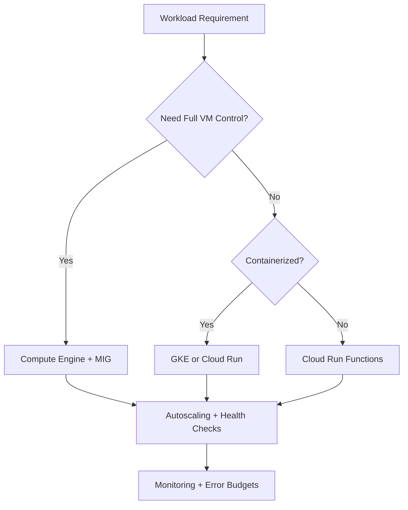
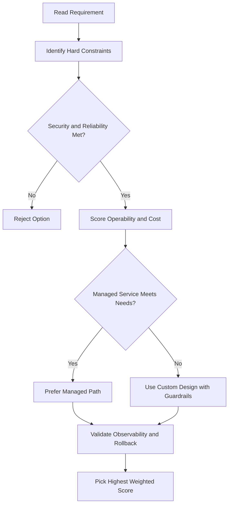
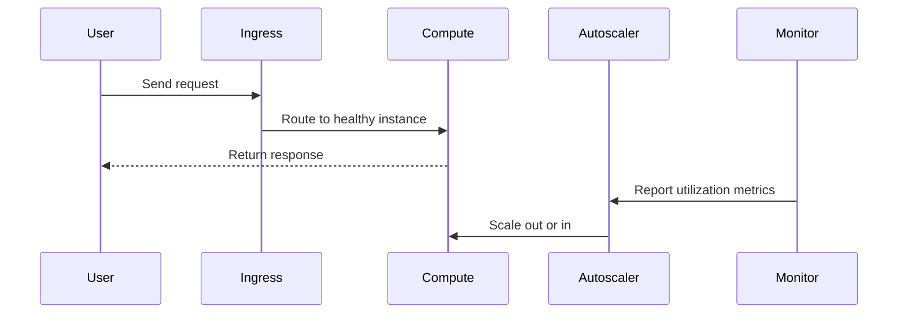

# Compute Engine: Disk Options

## Root Persistent Disk

- Every VM comes with a **single root persistent disk** loaded with the chosen base image.
- The boot disk is:
  - **Bootable** — can be attached to a VM and booted from.
  - **Durable** — survives if the VM terminates (by default).
- To keep the boot disk after deleting the VM, disable **"Delete boot disk when instance is deleted"** in the instance properties.

---

## Persistent Disks

- Attached to the VM through the **network interface** — not physically attached.
- This separation means the disk **survives if the VM terminates**.
- Supports **snapshots** (incremental backups).
- Can be **dynamically resized** while running and attached to a VM.
- Can be attached in **read-only mode to multiple VMs** — useful for sharing static data without replicating it.

### Zonal vs. Regional Persistent Disks

| Type         | Description                                                                                                                          |
| ------------ | ------------------------------------------------------------------------------------------------------------------------------------ |
| **Zonal**    | Efficient, reliable block storage in a single zone                                                                                   |
| **Regional** | Active-active synchronous replication across two zones in the same region; great for high-availability databases and enterprise apps |

### Persistent Disk Types

| Type                  | Backed By | Best For                                                                                                                                |
| --------------------- | --------- | --------------------------------------------------------------------------------------------------------------------------------------- |
| **Standard**          | HDD       | Large data processing workloads with sequential I/O; cheapest                                                                           |
| **Balanced**          | SSD       | General-purpose apps; balance of performance and cost; same max IOPS as Performance SSD but lower IOPS/GB                               |
| **Performance (SSD)** | SSD       | Enterprise apps and high-performance databases needing low latency and high IOPS                                                        |
| **Extreme**           | SSD       | High-end database workloads; consistently high performance for both random access and bulk throughput; lets you provision your own IOPS |

---

## Encryption at Rest

- Compute Engine **encrypts all data at rest by default** — no action needed.
- Options if you want to manage encryption yourself:
  - **Customer-managed encryption keys (CMEK)** — use Cloud Key Management Service to create and manage keys.
  - **Customer-supplied encryption keys (CSEK)** — create and manage your own keys entirely.

---

## Local SSDs

- **Physically attached** to the VM — not networked.
- **Ephemeral**: data survives a **reset** but is lost on **stop or termination** (cannot be reattached to a different VM).
- Very high IOPS.
- Size: **375 GB per partition**.
- Maximum: **24 partitions = 9 TB per instance**.

---

## RAM Disks (tmpfs)

- Store data in memory using `tmpfs`.
- **Fastest** type of storage available.
- Best for small data structures that need the highest possible performance.
- Recommended pairing: a **high-memory VM** + a **persistent disk** to back up the RAM disk data.
- Most volatile — data is lost on any stop or restart.

---

## Disk Comparison Summary

| Type               | Persistent?    | Snapshots | Redundancy                              | Performance |
| ------------------ | -------------- | --------- | --------------------------------------- | ----------- |
| **Persistent HDD** | Yes            | Yes       | Yes (distributed across physical disks) | Low–Medium  |
| **Persistent SSD** | Yes            | Yes       | Yes                                     | High        |
| **Local SSD**      | No (ephemeral) | No        | No                                      | Very High   |
| **RAM disk**       | No (volatile)  | No        | No                                      | Highest     |

**When to choose:**

- **Persistent HDD** — need capacity, not performance.
- **Persistent SSD** — need high performance with durability.
- **Local SSD** — need maximum throughput and can tolerate data loss on stop.
- **RAM disk** — need the absolute fastest access for small, temporary data.

---

## Disk Attachment Limits

| Machine Type                                                         | Max Persistent Disks |
| -------------------------------------------------------------------- | -------------------- |
| Shared-core                                                          | 16                   |
| Standard, High Memory, High CPU, Memory-optimized, Compute-optimized | 128                  |

---

## Disk I/O and Network Bandwidth

- Disk I/O throughput **shares bandwidth with network egress/ingress**.
- If you plan on heavy Disk I/O, it will compete with network throughput — keep this in mind when adding more disks.

---

## Persistent Disks vs. Physical Disks

| Physical Hard Disk                               | Cloud Persistent Disk                                        |
| ------------------------------------------------ | ------------------------------------------------------------ |
| Must be partitioned manually                     | No partitioning needed                                       |
| Resizing requires repartitioning or reformatting | Resize dynamically at any time                               |
| Redundancy requires a RAID setup                 | Redundancy built in (data distributed across physical disks) |
| Encryption must be set up manually               | Automatically encrypted; can use your own keys               |

---

## gcloud Commands

```bash
# List persistent disks
gcloud compute disks list

# Create a persistent SSD disk
gcloud compute disks create my-disk \
  --zone=us-central1-a --size=100GB --type=pd-ssd

# Attach a disk to a VM
gcloud compute instances attach-disk my-vm \
  --disk=my-disk --zone=us-central1-a

# Resize a disk (no downtime needed)
gcloud compute disks resize my-disk \
  --zone=us-central1-a --size=200GB

# List snapshots
gcloud compute snapshots list
```

## ACE Exam-Style Practice Questions

### Q1
A Compute Engine Disk Options workload requires full OS control and custom runtime with strict policy against managed platforms. Which compute option is best?

A. Compute Engine
B. Cloud Run Functions
C. App Engine Standard
D. Dataflow

Answer: A
Trap: Full host-level control is a strong Compute Engine signal.

### Q2
In a Compute Engine Disk Options scenario, a fault-tolerant nightly batch workload is too expensive. What should you test and then use?

A. Spot or preemptible VMs after simulated interruption testing
B. Owner role on all instances
C. Single large sole-tenant node
D. Cloud DNS autoscaling

Answer: A
Trap: Interruptible workloads are classic candidates for discounted VM pricing models.

<!-- ACE_DEEP_ENRICHMENT_START -->
## ACE Deep Enrichment

### Think Like a Google Engineer
- Primary optimization axis: Elastic performance with minimum operational toil.
- Start with constraints first: SLO, security, compliance, latency, budget, and team operations capacity.
- Prefer managed services if they satisfy requirements with lower long-term operational toil.
- Minimize blast radius using environment isolation, least privilege, and failure-domain awareness.
- Design for day-2 operations: observability, rollback strategy, and quota or budget guardrails.

### Most Correct Option Filter (60 Seconds)
1. Eliminate options with broad access, single points of failure, or missing monitoring.
2. Confirm the option meets non-negotiables first: security and reliability requirements.
3. Compare remaining options on operational simplicity and long-term maintainability.
4. Use cost as an optimizer only after requirements and risk controls are satisfied.

### Weighted Decision Matrix
| Dimension | Weight | Strong Signal |
| --- | --- | --- |
| Security | 3 | Least privilege, secure defaults, no exposed blast radius |
| Reliability | 3 | Multi-zone or HA design, health checks, tested recovery path |
| Operability | 2 | Clear monitoring, alerting, rollout and rollback simplicity |
| Cost Efficiency | 2 | Right-sized resources, no waste, no reliability regression |
| Performance | 1 | Meets latency and throughput targets with headroom |

### Real-Life Scenario
A media startup has unpredictable traffic spikes during launches. They need faster releases, automatic scaling, and strong reliability without overpaying for idle capacity.

### Worked Example
- Choose managed compute first when operations overhead is a concern.
- For VM workloads, use managed instance groups with autoscaling and autohealing.
- For container workloads, use GKE node pools and rolling updates.
- For event-driven workloads, prefer Cloud Run or functions with concurrency controls.

### Flowchart


### Optimization Decision Flow


### Interaction Sequence


### Extra Exam Practice (15 Questions)
#### Q1
Scenario Focus: Compute Engine: Disk Options
Traffic triples during business hours and falls overnight. Which compute pattern is best?

A. Use autoscaling with target utilization and baseline minimum capacity.
B. Pin capacity to peak traffic all day for safety.
C. Restart failed instances manually as incidents occur.
D. Use one large VM because horizontal scaling is complex.

Answer: A
Why the other options are weaker: They typically ignore at least one hard constraint such as security, reliability, cost efficiency, or operational simplicity.
Google-engineer check: Reconfirm SLO fit, blast radius, and day-2 maintainability before finalizing.

#### Q2
Scenario Focus: Compute Engine: Disk Options
A VM app must self-heal when instances fail health checks. What should you use?

A. Restart failed instances manually as incidents occur.
B. Use a managed instance group with health checks and autohealing enabled.
C. Use one large VM because horizontal scaling is complex.
D. Deploy all changes at once without canary checks.

Answer: B
Why the other options are weaker: They typically ignore at least one hard constraint such as security, reliability, cost efficiency, or operational simplicity.
Google-engineer check: Reconfirm SLO fit, blast radius, and day-2 maintainability before finalizing.

#### Q3
Scenario Focus: Compute Engine: Disk Options
A team wants to deploy containers without managing nodes. Which platform fits best?

A. Use one large VM because horizontal scaling is complex.
B. Deploy all changes at once without canary checks.
C. Use Cloud Run for containerized services when node management is not required.
D. Ignore utilization metrics and optimize only by guesswork.

Answer: C
Why the other options are weaker: They typically ignore at least one hard constraint such as security, reliability, cost efficiency, or operational simplicity.
Google-engineer check: Reconfirm SLO fit, blast radius, and day-2 maintainability before finalizing.

#### Q4
Scenario Focus: Compute Engine: Disk Options
Which update strategy minimizes user impact during releases?

A. Deploy all changes at once without canary checks.
B. Ignore utilization metrics and optimize only by guesswork.
C. Pin capacity to peak traffic all day for safety.
D. Use rolling or blue-green deployment with health-based rollout checks.

Answer: D
Why the other options are weaker: They typically ignore at least one hard constraint such as security, reliability, cost efficiency, or operational simplicity.
Google-engineer check: Reconfirm SLO fit, blast radius, and day-2 maintainability before finalizing.

#### Q5
Scenario Focus: Compute Engine: Disk Options
How do you avoid overprovisioning while keeping performance stable?

A. Right-size resources and monitor saturation, latency, and error rates continuously.
B. Ignore utilization metrics and optimize only by guesswork.
C. Pin capacity to peak traffic all day for safety.
D. Restart failed instances manually as incidents occur.

Answer: A
Why the other options are weaker: They typically ignore at least one hard constraint such as security, reliability, cost efficiency, or operational simplicity.
Google-engineer check: Reconfirm SLO fit, blast radius, and day-2 maintainability before finalizing.

#### Q6
Scenario Focus: Compute Engine: Disk Options
Two designs both satisfy the happy path for Compute Engine: Disk Options. Which choice is most correct?

A. Pin capacity to peak traffic all day for safety.
B. Choose the option that preserves reliability and security while reducing operational burden.
C. Restart failed instances manually as incidents occur.
D. Use one large VM because horizontal scaling is complex.

Answer: B
Why the other options are weaker: They typically ignore at least one hard constraint such as security, reliability, cost efficiency, or operational simplicity.
Google-engineer check: Reconfirm SLO fit, blast radius, and day-2 maintainability before finalizing.

#### Q7
Scenario Focus: Compute Engine: Disk Options
What should you validate first before choosing an architecture for Compute Engine: Disk Options?

A. Restart failed instances manually as incidents occur.
B. Use one large VM because horizontal scaling is complex.
C. Validate SLO fit, blast radius, and least-privilege controls before comparing convenience.
D. Deploy all changes at once without canary checks.

Answer: C
Why the other options are weaker: They typically ignore at least one hard constraint such as security, reliability, cost efficiency, or operational simplicity.
Google-engineer check: Reconfirm SLO fit, blast radius, and day-2 maintainability before finalizing.

#### Q8
Scenario Focus: Compute Engine: Disk Options
A proposal lowers cost but increases failure risk. What is the best decision?

A. Use one large VM because horizontal scaling is complex.
B. Deploy all changes at once without canary checks.
C. Ignore utilization metrics and optimize only by guesswork.
D. Reject it unless reliability and recovery objectives remain within required targets.

Answer: D
Why the other options are weaker: They typically ignore at least one hard constraint such as security, reliability, cost efficiency, or operational simplicity.
Google-engineer check: Reconfirm SLO fit, blast radius, and day-2 maintainability before finalizing.

#### Q9
Scenario Focus: Compute Engine: Disk Options
Which option best reflects optimization for Elastic performance with minimum operational toil?

A. Select the design that best meets Elastic performance with minimum operational toil while keeping constraints balanced.
B. Deploy all changes at once without canary checks.
C. Ignore utilization metrics and optimize only by guesswork.
D. Pin capacity to peak traffic all day for safety.

Answer: A
Why the other options are weaker: They typically ignore at least one hard constraint such as security, reliability, cost efficiency, or operational simplicity.
Google-engineer check: Reconfirm SLO fit, blast radius, and day-2 maintainability before finalizing.

#### Q10
Scenario Focus: Compute Engine: Disk Options
How should you evaluate a design that needs frequent manual interventions?

A. Ignore utilization metrics and optimize only by guesswork.
B. Treat it as high risk and prefer automation-friendly designs with observability and rollback.
C. Pin capacity to peak traffic all day for safety.
D. Restart failed instances manually as incidents occur.

Answer: B
Why the other options are weaker: They typically ignore at least one hard constraint such as security, reliability, cost efficiency, or operational simplicity.
Google-engineer check: Reconfirm SLO fit, blast radius, and day-2 maintainability before finalizing.

#### Q11
Scenario Focus: Compute Engine: Disk Options
Two options have similar latency. Which tie-breaker is best?

A. Pin capacity to peak traffic all day for safety.
B. Restart failed instances manually as incidents occur.
C. Pick the option with stronger operability, clearer failure isolation, and simpler incident response.
D. Use one large VM because horizontal scaling is complex.

Answer: C
Why the other options are weaker: They typically ignore at least one hard constraint such as security, reliability, cost efficiency, or operational simplicity.
Google-engineer check: Reconfirm SLO fit, blast radius, and day-2 maintainability before finalizing.

#### Q12
Scenario Focus: Compute Engine: Disk Options
What is the best way to choose between a custom stack and a managed service?

A. Restart failed instances manually as incidents occur.
B. Use one large VM because horizontal scaling is complex.
C. Deploy all changes at once without canary checks.
D. Prefer managed services when they meet requirements with lower long-term maintenance effort.

Answer: D
Why the other options are weaker: They typically ignore at least one hard constraint such as security, reliability, cost efficiency, or operational simplicity.
Google-engineer check: Reconfirm SLO fit, blast radius, and day-2 maintainability before finalizing.

#### Q13
Scenario Focus: Compute Engine: Disk Options
How do you confirm a solution is production-ready for 

A. Verify monitoring, alerting, rollback path, quota and budget controls, and secure defaults.
B. Use one large VM because horizontal scaling is complex.
C. Deploy all changes at once without canary checks.
D. Ignore utilization metrics and optimize only by guesswork.

Answer: A
Why the other options are weaker: They typically ignore at least one hard constraint such as security, reliability, cost efficiency, or operational simplicity.
Google-engineer check: Reconfirm SLO fit, blast radius, and day-2 maintainability before finalizing.

#### Q14
Scenario Focus: Compute Engine: Disk Options
Which pattern usually wins in ACE scenario tie-breakers?

A. Deploy all changes at once without canary checks.
B. Managed-service-first plus least-privilege access plus clear observability usually wins.
C. Ignore utilization metrics and optimize only by guesswork.
D. Pin capacity to peak traffic all day for safety.

Answer: B
Why the other options are weaker: They typically ignore at least one hard constraint such as security, reliability, cost efficiency, or operational simplicity.
Google-engineer check: Reconfirm SLO fit, blast radius, and day-2 maintainability before finalizing.

#### Q15
Scenario Focus: Compute Engine: Disk Options
What is the best final check before locking the answer?

A. Ignore utilization metrics and optimize only by guesswork.
B. Pin capacity to peak traffic all day for safety.
C. Run a weighted check across security, reliability, cost, performance, and operability.
D. Restart failed instances manually as incidents occur.

Answer: C
Why the other options are weaker: They typically ignore at least one hard constraint such as security, reliability, cost efficiency, or operational simplicity.
Google-engineer check: Reconfirm SLO fit, blast radius, and day-2 maintainability before finalizing.

### Quick Commands
```bash
gcloud compute instance-groups managed list --project=PROJECT_ID
gcloud compute instance-groups managed describe MIG_NAME --zone=ZONE --project=PROJECT_ID
gcloud run services list --region=REGION --project=PROJECT_ID
kubectl get pods -A
```

### Fast Recall
- Autoscaling is useful only with valid signals and guardrails.
- Managed offerings usually reduce operational burden.
- Deployment safety needs health checks and staged rollout.
<!-- ACE_DEEP_ENRICHMENT_END -->