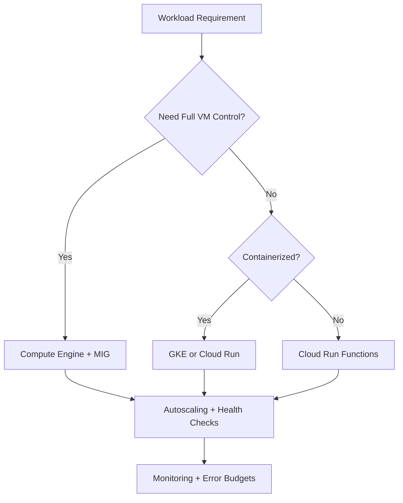
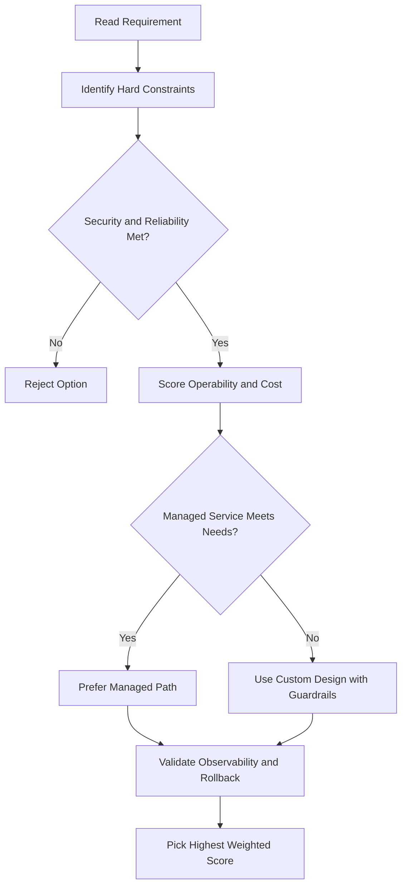
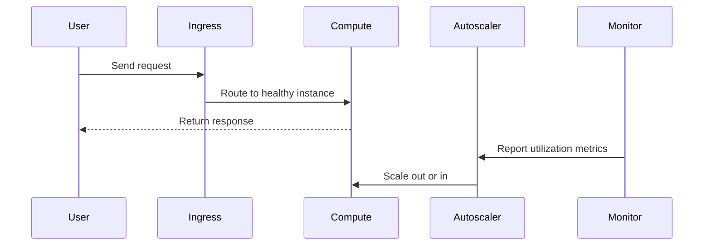

# Compute Engine: Common VM Actions

## Instance Metadata

- Every VM stores its metadata on a **metadata server**.
- Useful in combination with **startup and shutdown scripts** — lets you programmatically fetch instance-specific info without extra authorization.
- Example: write a startup script that reads the instance's external IP address from metadata and uses it to configure a database.
- Default metadata keys are the **same on every instance**, so scripts can be reused across instances without modification — reduces brittle code.
- **Recommended**: store startup and shutdown scripts in **Cloud Storage**.

---

## Moving a VM to a New Zone or Region

Reasons to move: geographical requirements, zone deprecation.

### Steps

1. **Shut down** the VM.
2. **Move** it to the destination zone or region.
3. **Restart** it.
4. **Update any references** to the old VM (e.g., target VMs, target pools).

> Note: Some server-generated properties of the VM and its disks change during the move.

### How to Move (High Level)

1. Create a **machine image** of the source VM.
2. Create a new VM from that machine image in the **target zone or region**.

Example: move `myinstance` from `europe-west1-c` to `us-west1-b` (with persistent disks `mybootdisk` and `mydatadisk`).

---

## Snapshots

Snapshots apply only to **persistent disks** — not local SSDs.

### Use Cases

- **Backup**: back up critical data to a durable storage solution (snapshots are stored in Cloud Storage).
- **Zone migration**: transfer data from one zone to another (e.g., to minimize latency by moving data closer to where it's used).
- **Disk type transfer**: move data from one disk type to another — e.g., from a standard HDD to an SSD persistent disk to improve performance.

### How Snapshots Work

- **Incremental** — only changes since the last snapshot are saved.
- **Automatically compressed** — faster and cheaper than creating a full image each time.
- Can be **restored to a new persistent disk** in any zone.
- You can create a **snapshot schedule** to automatically back up zonal and regional persistent disks on a regular basis.

### Snapshots vs. Images

|             | Snapshots                               | Public/Custom Images                                 |
| ----------- | --------------------------------------- | ---------------------------------------------------- |
| Primary use | Periodic backup of persistent disk data | Creating instances or configuring instance templates |
| Incremental | Yes                                     | No                                                   |
| Stored in   | Cloud Storage                           | —                                                    |

---

## Resizing a Persistent Disk

- You can **increase** the size of a persistent disk while it is attached to a running VM — no snapshot needed, no downtime.
- Benefit: larger disk size also **improves I/O performance**.
- **You can never shrink a disk** — only grow it. Keep this in mind before resizing.

---

## gcloud Commands

```bash
# Create a snapshot of a disk
gcloud compute disks snapshot my-disk \
  --zone=us-central1-a --snapshot-names=my-snapshot

# Create a snapshot schedule
gcloud compute resource-policies create snapshot-schedule my-schedule \
  --region=us-central1 --daily-schedule --start-time=04:00 \
  --max-retention-days=7

# Move a VM to a different zone
gcloud compute instances move my-vm \
  --zone=us-central1-a --destination-zone=us-west1-b

# Resize a disk (online, no downtime)
gcloud compute disks resize my-disk --zone=us-central1-a --size=200GB
```

## ACE Exam-Style Practice Questions

### Q1
A Compute Engine Common Actions workload requires full OS control and custom runtime with strict policy against managed platforms. Which compute option is best?

A. Compute Engine
B. Cloud Run Functions
C. App Engine Standard
D. Dataflow

Answer: A
Trap: Full host-level control is a strong Compute Engine signal.

### Q2
In a Compute Engine Common Actions scenario, a fault-tolerant nightly batch workload is too expensive. What should you test and then use?

A. Spot or preemptible VMs after simulated interruption testing
B. Owner role on all instances
C. Single large sole-tenant node
D. Cloud DNS autoscaling

Answer: A
Trap: Interruptible workloads are classic candidates for discounted VM pricing models.

<!-- ACE_DEEP_ENRICHMENT_START -->
## ACE Deep Enrichment

### Think Like a Google Engineer
- Primary optimization axis: Elastic performance with minimum operational toil.
- Start with constraints first: SLO, security, compliance, latency, budget, and team operations capacity.
- Prefer managed services if they satisfy requirements with lower long-term operational toil.
- Minimize blast radius using environment isolation, least privilege, and failure-domain awareness.
- Design for day-2 operations: observability, rollback strategy, and quota or budget guardrails.

### Most Correct Option Filter (60 Seconds)
1. Eliminate options with broad access, single points of failure, or missing monitoring.
2. Confirm the option meets non-negotiables first: security and reliability requirements.
3. Compare remaining options on operational simplicity and long-term maintainability.
4. Use cost as an optimizer only after requirements and risk controls are satisfied.

### Weighted Decision Matrix
| Dimension | Weight | Strong Signal |
| --- | --- | --- |
| Security | 3 | Least privilege, secure defaults, no exposed blast radius |
| Reliability | 3 | Multi-zone or HA design, health checks, tested recovery path |
| Operability | 2 | Clear monitoring, alerting, rollout and rollback simplicity |
| Cost Efficiency | 2 | Right-sized resources, no waste, no reliability regression |
| Performance | 1 | Meets latency and throughput targets with headroom |

### Real-Life Scenario
A media startup has unpredictable traffic spikes during launches. They need faster releases, automatic scaling, and strong reliability without overpaying for idle capacity.

### Worked Example
- Choose managed compute first when operations overhead is a concern.
- For VM workloads, use managed instance groups with autoscaling and autohealing.
- For container workloads, use GKE node pools and rolling updates.
- For event-driven workloads, prefer Cloud Run or functions with concurrency controls.

### Flowchart


### Optimization Decision Flow


### Interaction Sequence


### Extra Exam Practice (15 Questions)
#### Q1

Scenario Focus: Compute Engine: Common VM Actions

Traffic triples during business hours and falls overnight. Which compute pattern is best?

A. Use autoscaling with target utilization and baseline minimum capacity.  
B. Pin capacity to peak traffic all day for safety.  
C. Restart failed instances manually as incidents occur.  
D. Use one large VM because horizontal scaling is complex.

Answer: A  
Why the other options are weaker: They typically ignore at least one hard constraint such as security, reliability, cost efficiency, or operational simplicity.  
Google-engineer check: Reconfirm SLO fit, blast radius, and day-2 maintainability before finalizing.

#### Q2

Scenario Focus: Compute Engine: Common VM Actions

A VM app must self-heal when instances fail health checks. What should you use?

A. Restart failed instances manually as incidents occur.  
B. Use a managed instance group with health checks and autohealing enabled.  
C. Use one large VM because horizontal scaling is complex.  
D. Deploy all changes at once without canary checks.

Answer: B  
Why the other options are weaker: They typically ignore at least one hard constraint such as security, reliability, cost efficiency, or operational simplicity.  
Google-engineer check: Reconfirm SLO fit, blast radius, and day-2 maintainability before finalizing.

#### Q3

Scenario Focus: Compute Engine: Common VM Actions

A team wants to deploy containers without managing nodes. Which platform fits best?

A. Use one large VM because horizontal scaling is complex.  
B. Deploy all changes at once without canary checks.  
C. Use Cloud Run for containerized services when node management is not required.  
D. Ignore utilization metrics and optimize only by guesswork.

Answer: C  
Why the other options are weaker: They typically ignore at least one hard constraint such as security, reliability, cost efficiency, or operational simplicity.  
Google-engineer check: Reconfirm SLO fit, blast radius, and day-2 maintainability before finalizing.

#### Q4

Scenario Focus: Compute Engine: Common VM Actions

Which update strategy minimizes user impact during releases?

A. Deploy all changes at once without canary checks.  
B. Ignore utilization metrics and optimize only by guesswork.  
C. Pin capacity to peak traffic all day for safety.  
D. Use rolling or blue-green deployment with health-based rollout checks.

Answer: D  
Why the other options are weaker: They typically ignore at least one hard constraint such as security, reliability, cost efficiency, or operational simplicity.  
Google-engineer check: Reconfirm SLO fit, blast radius, and day-2 maintainability before finalizing.

#### Q5

Scenario Focus: Compute Engine: Common VM Actions

How do you avoid overprovisioning while keeping performance stable?

A. Right-size resources and monitor saturation, latency, and error rates continuously.  
B. Ignore utilization metrics and optimize only by guesswork.  
C. Pin capacity to peak traffic all day for safety.  
D. Restart failed instances manually as incidents occur.

Answer: A  
Why the other options are weaker: They typically ignore at least one hard constraint such as security, reliability, cost efficiency, or operational simplicity.  
Google-engineer check: Reconfirm SLO fit, blast radius, and day-2 maintainability before finalizing.

#### Q6

Scenario Focus: Compute Engine: Common VM Actions

Two designs both satisfy the happy path for Compute Engine: Common VM Actions. Which choice is most correct?

A. Pin capacity to peak traffic all day for safety.  
B. Choose the option that preserves reliability and security while reducing operational burden.  
C. Restart failed instances manually as incidents occur.  
D. Use one large VM because horizontal scaling is complex.

Answer: B  
Why the other options are weaker: They typically ignore at least one hard constraint such as security, reliability, cost efficiency, or operational simplicity.  
Google-engineer check: Reconfirm SLO fit, blast radius, and day-2 maintainability before finalizing.

#### Q7

Scenario Focus: Compute Engine: Common VM Actions

What should you validate first before choosing an architecture for Compute Engine: Common VM Actions?

A. Restart failed instances manually as incidents occur.  
B. Use one large VM because horizontal scaling is complex.  
C. Validate SLO fit, blast radius, and least-privilege controls before comparing convenience.  
D. Deploy all changes at once without canary checks.

Answer: C  
Why the other options are weaker: They typically ignore at least one hard constraint such as security, reliability, cost efficiency, or operational simplicity.  
Google-engineer check: Reconfirm SLO fit, blast radius, and day-2 maintainability before finalizing.

#### Q8

Scenario Focus: Compute Engine: Common VM Actions

A proposal lowers cost but increases failure risk. What is the best decision?

A. Use one large VM because horizontal scaling is complex.  
B. Deploy all changes at once without canary checks.  
C. Ignore utilization metrics and optimize only by guesswork.  
D. Reject it unless reliability and recovery objectives remain within required targets.

Answer: D  
Why the other options are weaker: They typically ignore at least one hard constraint such as security, reliability, cost efficiency, or operational simplicity.  
Google-engineer check: Reconfirm SLO fit, blast radius, and day-2 maintainability before finalizing.

#### Q9

Scenario Focus: Compute Engine: Common VM Actions

Which option best reflects optimization for Elastic performance with minimum operational toil?

A. Select the design that best meets Elastic performance with minimum operational toil while keeping constraints balanced.  
B. Deploy all changes at once without canary checks.  
C. Ignore utilization metrics and optimize only by guesswork.  
D. Pin capacity to peak traffic all day for safety.

Answer: A  
Why the other options are weaker: They typically ignore at least one hard constraint such as security, reliability, cost efficiency, or operational simplicity.  
Google-engineer check: Reconfirm SLO fit, blast radius, and day-2 maintainability before finalizing.

#### Q10

Scenario Focus: Compute Engine: Common VM Actions

How should you evaluate a design that needs frequent manual interventions?

A. Ignore utilization metrics and optimize only by guesswork.  
B. Treat it as high risk and prefer automation-friendly designs with observability and rollback.  
C. Pin capacity to peak traffic all day for safety.  
D. Restart failed instances manually as incidents occur.

Answer: B  
Why the other options are weaker: They typically ignore at least one hard constraint such as security, reliability, cost efficiency, or operational simplicity.  
Google-engineer check: Reconfirm SLO fit, blast radius, and day-2 maintainability before finalizing.

#### Q11

Scenario Focus: Compute Engine: Common VM Actions

Two options have similar latency. Which tie-breaker is best?

A. Pin capacity to peak traffic all day for safety.  
B. Restart failed instances manually as incidents occur.  
C. Pick the option with stronger operability, clearer failure isolation, and simpler incident response.  
D. Use one large VM because horizontal scaling is complex.

Answer: C  
Why the other options are weaker: They typically ignore at least one hard constraint such as security, reliability, cost efficiency, or operational simplicity.  
Google-engineer check: Reconfirm SLO fit, blast radius, and day-2 maintainability before finalizing.

#### Q12

Scenario Focus: Compute Engine: Common VM Actions

What is the best way to choose between a custom stack and a managed service?

A. Restart failed instances manually as incidents occur.  
B. Use one large VM because horizontal scaling is complex.  
C. Deploy all changes at once without canary checks.  
D. Prefer managed services when they meet requirements with lower long-term maintenance effort.

Answer: D  
Why the other options are weaker: They typically ignore at least one hard constraint such as security, reliability, cost efficiency, or operational simplicity.  
Google-engineer check: Reconfirm SLO fit, blast radius, and day-2 maintainability before finalizing.

#### Q13

Scenario Focus: Compute Engine: Common VM Actions

How do you confirm a solution is production-ready for 

A. Verify monitoring, alerting, rollback path, quota and budget controls, and secure defaults.  
B. Use one large VM because horizontal scaling is complex.  
C. Deploy all changes at once without canary checks.  
D. Ignore utilization metrics and optimize only by guesswork.

Answer: A  
Why the other options are weaker: They typically ignore at least one hard constraint such as security, reliability, cost efficiency, or operational simplicity.  
Google-engineer check: Reconfirm SLO fit, blast radius, and day-2 maintainability before finalizing.

#### Q14

Scenario Focus: Compute Engine: Common VM Actions

Which pattern usually wins in ACE scenario tie-breakers?

A. Deploy all changes at once without canary checks.  
B. Managed-service-first plus least-privilege access plus clear observability usually wins.  
C. Ignore utilization metrics and optimize only by guesswork.  
D. Pin capacity to peak traffic all day for safety.

Answer: B  
Why the other options are weaker: They typically ignore at least one hard constraint such as security, reliability, cost efficiency, or operational simplicity.  
Google-engineer check: Reconfirm SLO fit, blast radius, and day-2 maintainability before finalizing.

#### Q15

Scenario Focus: Compute Engine: Common VM Actions

What is the best final check before locking the answer?

A. Ignore utilization metrics and optimize only by guesswork.  
B. Pin capacity to peak traffic all day for safety.  
C. Run a weighted check across security, reliability, cost, performance, and operability.  
D. Restart failed instances manually as incidents occur.

Answer: C  
Why the other options are weaker: They typically ignore at least one hard constraint such as security, reliability, cost efficiency, or operational simplicity.  
Google-engineer check: Reconfirm SLO fit, blast radius, and day-2 maintainability before finalizing.

### Quick Commands
```bash
gcloud compute instance-groups managed list --project=PROJECT_ID
gcloud compute instance-groups managed describe MIG_NAME --zone=ZONE --project=PROJECT_ID
gcloud run services list --region=REGION --project=PROJECT_ID
kubectl get pods -A
```

### Fast Recall
- Autoscaling is useful only with valid signals and guardrails.
- Managed offerings usually reduce operational burden.
- Deployment safety needs health checks and staged rollout.
<!-- ACE_DEEP_ENRICHMENT_END -->