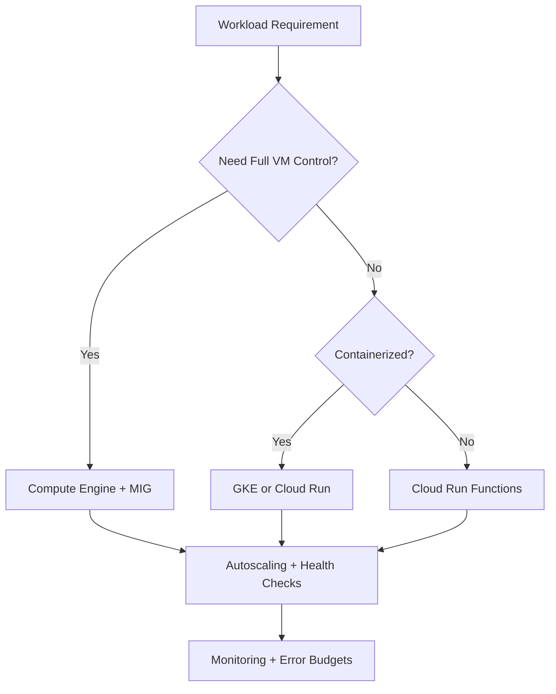
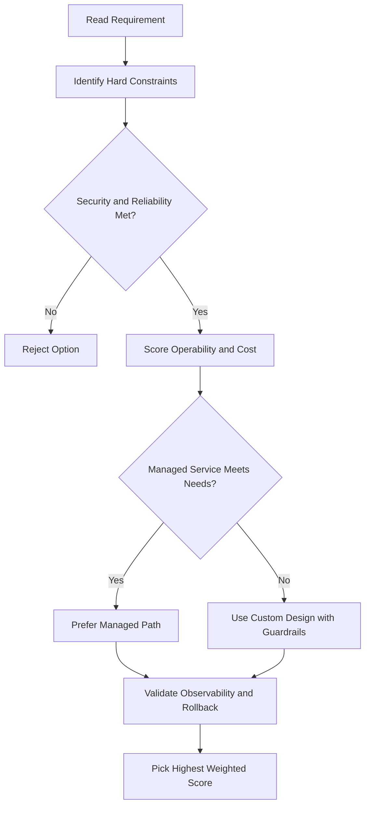
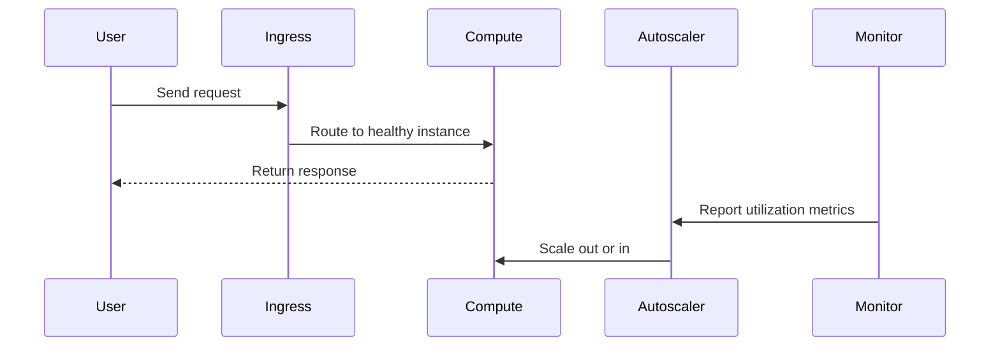

# Lab: Minecraft Server on Compute Engine

## What This Lab Covers

- Create a customized VM and attach a high-speed SSD
- Reserve a static external IP address
- Install a headless Java runtime and Minecraft server
- Set up Cloud Storage backups with a cron job
- Automate startup and shutdown behavior using metadata scripts

---

## Task 1: Create the VM

- Name: `mc-server`
- Zone: `us-central1-a`
- **Access scopes**: set to "Set access for each API"; change **Storage** from Read Only to **Read Write** (allows the VM to write to Cloud Storage)

### Add a Data Disk

- Add a new disk named `minecraft-disk`
- Type: **SSD persistent disk**
- Size: **50 GB**
- Source: blank (no source image)
- Encryption: Google-managed key
- The disk is automatically attached to the VM on creation

### Networking

- Add a **network tag**: `minecraft-server` (used later to target a firewall rule)
- Edit the network interface: reserve a **static external IP address** so it doesn't change between restarts

---

## Task 2: Prepare the Data Disk

After SSH-ing into the VM:

1. Create a **mount point directory** for the data disk.
2. **Format** the disk.
3. **Mount** the disk to the directory.

> SSH works because the default network has a default firewall rule allowing TCP port 22.

---

## Task 3: Install and Run the Minecraft Server

1. Update the package repository.
2. Install **headless JRE** (no GUI — reduces resource usage, leaves more room for the Minecraft server).
3. Navigate to the mounted disk directory.
4. Download the **Minecraft server `.jar` file**.
5. Run the `.jar` once to initialize — it will fail and ask you to accept the EULA.
6. Edit `eula.txt` with nano: change `eula=false` to `eula=true`.
7. Install **`screen`** to run the server in a virtual terminal (so it keeps running after you disconnect).
8. Start the server using the `screen` command.
9. Once the server finishes loading (spawn area prepared), **detach** from the screen session: `Ctrl+A` then `Ctrl+D`.

---

## Task 4: Create a Firewall Rule for Client Traffic

- Navigate to **VPC Network → Firewall rules**.
- Create a new rule:
  - Name: `minecraft-rule`
  - Network: default
  - Target tags: `minecraft-server`
  - Source IP ranges: `0.0.0.0/0` (anywhere)
  - Protocol: TCP
  - Port: **25565** (default Minecraft port)

---

## Task 5: Verify the Server is Running

- Copy the **static external IP** from the VM instances page.
- Use a third-party Minecraft server status checker website to confirm the server is online.
  - Third-party tools may be unreliable — if one fails, try another.
- A successful check shows: server is up, current player count, and server version.

---

## Task 6: Set Up Cloud Storage Backups

### Create a Bucket from the VM

Since the VM has **Storage Read/Write** access, you can use `gsutil` directly from within the VM (just like Cloud Shell).

```bash
export BUCKET_NAME=<your-project-id>-minecraft-backup
gsutil mb gs://$BUCKET_NAME
```

### Create a Backup Script

- Navigate to the Minecraft home directory and create a script using nano.
- The script:
  1. Saves the current world state and **pauses auto-save** on the server.
  2. Copies the world data directory to a **timestamped folder** in the Cloud Storage bucket.
  3. **Resumes auto-save** after the backup completes.
- Make the script executable with `chmod`.
- Test by running the script manually and verifying the backup folder appears in the Cloud Storage bucket.

---

## Task 7: Automate Backups with Cron

```bash
sudo crontab -e
```

- Add a cron entry to run the backup script **every 4 hours**.
- Note: this generates ~300 backups per month — consider using **Cloud Storage Object Lifecycle Management** to automatically delete old backups or move them to a cheaper storage class.

---

## Task 8: Startup and Shutdown Scripts via Metadata

1. Stop the VM instance.
2. Click **Edit** on the instance and scroll to **Metadata**.
3. Add two metadata keys:
   - `startup-script-url` → URL of the startup script in Cloud Storage
   - `shutdown-script-url` → URL of the shutdown script in Cloud Storage
4. Save and restart the instance.
5. Once the startup script finishes, verify the Minecraft server is accessible again via the status checker.

> Scripts stored in Cloud Storage can be referenced by URL in metadata, keeping VM configuration clean and reusable.

---

## Key Takeaways

- These techniques (metadata scripts, cron automation, Cloud Storage integration) apply to any production server administration, not just gaming.
- Using a **static IP** prevents the address from changing on restart.
- **Headless JRE** reduces resource overhead for server workloads.
- **Cloud Storage Object Lifecycle Management** helps manage backup retention costs automatically.

---

## gcloud Commands

```bash
# Create the Minecraft server VM
gcloud compute instances create mc-server --zone=us-central1-a \
  --machine-type=e2-medium --tags=minecraft-server \
  --image-family=debian-11 --image-project=debian-cloud \
  --boot-disk-size=50GB

# Reserve a static external IP
gcloud compute addresses create mc-server-ip --region=us-central1

# Create a firewall rule for Minecraft (TCP 25565)
gcloud compute firewall-rules create allow-minecraft \
  --direction=INGRESS --action=ALLOW \
  --rules=tcp:25565 --target-tags=minecraft-server

# SSH into the VM
gcloud compute ssh mc-server --zone=us-central1-a
```

## ACE Exam-Style Practice Questions

### Q1
In a Minecraft Server Lab scenario, two answers seem technically possible. What tie-breaker should you apply first?

A. Pick the option with most manual steps
B. Pick the option with least privilege and least operational overhead that still meets requirements
C. Pick highest-cost option
D. Pick the oldest product

Answer: B
Trap: ACE-style scenarios reward secure, managed, requirement-fit decisions.

### Q2
For Minecraft Server Lab, what is the best way to reduce wrong answers in multi-choice questions?

A. Ignore scaling and security words
B. Identify trigger words, eliminate over-privileged choices, then choose the managed fit
C. Always pick Compute Engine
D. Always pick the shortest option

Answer: B
Trap: Structured elimination is more reliable than memorization alone.

<!-- ACE_DEEP_ENRICHMENT_START -->
## ACE Deep Enrichment

### Think Like a Google Engineer
- Primary optimization axis: Elastic performance with minimum operational toil.
- Start with constraints first: SLO, security, compliance, latency, budget, and team operations capacity.
- Prefer managed services if they satisfy requirements with lower long-term operational toil.
- Minimize blast radius using environment isolation, least privilege, and failure-domain awareness.
- Design for day-2 operations: observability, rollback strategy, and quota or budget guardrails.

### Most Correct Option Filter (60 Seconds)
1. Eliminate options with broad access, single points of failure, or missing monitoring.
2. Confirm the option meets non-negotiables first: security and reliability requirements.
3. Compare remaining options on operational simplicity and long-term maintainability.
4. Use cost as an optimizer only after requirements and risk controls are satisfied.

### Weighted Decision Matrix
| Dimension | Weight | Strong Signal |
| --- | --- | --- |
| Security | 3 | Least privilege, secure defaults, no exposed blast radius |
| Reliability | 3 | Multi-zone or HA design, health checks, tested recovery path |
| Operability | 2 | Clear monitoring, alerting, rollout and rollback simplicity |
| Cost Efficiency | 2 | Right-sized resources, no waste, no reliability regression |
| Performance | 1 | Meets latency and throughput targets with headroom |

### Real-Life Scenario
A media startup has unpredictable traffic spikes during launches. They need faster releases, automatic scaling, and strong reliability without overpaying for idle capacity.

### Worked Example
- Choose managed compute first when operations overhead is a concern.
- For VM workloads, use managed instance groups with autoscaling and autohealing.
- For container workloads, use GKE node pools and rolling updates.
- For event-driven workloads, prefer Cloud Run or functions with concurrency controls.

### Flowchart


### Optimization Decision Flow


### Interaction Sequence


### Extra Exam Practice (15 Questions)
#### Q1

Scenario Focus: Lab: Minecraft Server on Compute Engine

Traffic triples during business hours and falls overnight. Which compute pattern is best?

A. Use autoscaling with target utilization and baseline minimum capacity.  
B. Pin capacity to peak traffic all day for safety.  
C. Restart failed instances manually as incidents occur.  
D. Use one large VM because horizontal scaling is complex.

Answer: A  
Why the other options are weaker: They typically ignore at least one hard constraint such as security, reliability, cost efficiency, or operational simplicity.  
Google-engineer check: Reconfirm SLO fit, blast radius, and day-2 maintainability before finalizing.

#### Q2

Scenario Focus: Lab: Minecraft Server on Compute Engine

A VM app must self-heal when instances fail health checks. What should you use?

A. Restart failed instances manually as incidents occur.  
B. Use a managed instance group with health checks and autohealing enabled.  
C. Use one large VM because horizontal scaling is complex.  
D. Deploy all changes at once without canary checks.

Answer: B  
Why the other options are weaker: They typically ignore at least one hard constraint such as security, reliability, cost efficiency, or operational simplicity.  
Google-engineer check: Reconfirm SLO fit, blast radius, and day-2 maintainability before finalizing.

#### Q3

Scenario Focus: Lab: Minecraft Server on Compute Engine

A team wants to deploy containers without managing nodes. Which platform fits best?

A. Use one large VM because horizontal scaling is complex.  
B. Deploy all changes at once without canary checks.  
C. Use Cloud Run for containerized services when node management is not required.  
D. Ignore utilization metrics and optimize only by guesswork.

Answer: C  
Why the other options are weaker: They typically ignore at least one hard constraint such as security, reliability, cost efficiency, or operational simplicity.  
Google-engineer check: Reconfirm SLO fit, blast radius, and day-2 maintainability before finalizing.

#### Q4

Scenario Focus: Lab: Minecraft Server on Compute Engine

Which update strategy minimizes user impact during releases?

A. Deploy all changes at once without canary checks.  
B. Ignore utilization metrics and optimize only by guesswork.  
C. Pin capacity to peak traffic all day for safety.  
D. Use rolling or blue-green deployment with health-based rollout checks.

Answer: D  
Why the other options are weaker: They typically ignore at least one hard constraint such as security, reliability, cost efficiency, or operational simplicity.  
Google-engineer check: Reconfirm SLO fit, blast radius, and day-2 maintainability before finalizing.

#### Q5

Scenario Focus: Lab: Minecraft Server on Compute Engine

How do you avoid overprovisioning while keeping performance stable?

A. Right-size resources and monitor saturation, latency, and error rates continuously.  
B. Ignore utilization metrics and optimize only by guesswork.  
C. Pin capacity to peak traffic all day for safety.  
D. Restart failed instances manually as incidents occur.

Answer: A  
Why the other options are weaker: They typically ignore at least one hard constraint such as security, reliability, cost efficiency, or operational simplicity.  
Google-engineer check: Reconfirm SLO fit, blast radius, and day-2 maintainability before finalizing.

#### Q6

Scenario Focus: Lab: Minecraft Server on Compute Engine

Two designs both satisfy the happy path for Lab: Minecraft Server on Compute Engine. Which choice is most correct?

A. Pin capacity to peak traffic all day for safety.  
B. Choose the option that preserves reliability and security while reducing operational burden.  
C. Restart failed instances manually as incidents occur.  
D. Use one large VM because horizontal scaling is complex.

Answer: B  
Why the other options are weaker: They typically ignore at least one hard constraint such as security, reliability, cost efficiency, or operational simplicity.  
Google-engineer check: Reconfirm SLO fit, blast radius, and day-2 maintainability before finalizing.

#### Q7

Scenario Focus: Lab: Minecraft Server on Compute Engine

What should you validate first before choosing an architecture for Lab: Minecraft Server on Compute Engine?

A. Restart failed instances manually as incidents occur.  
B. Use one large VM because horizontal scaling is complex.  
C. Validate SLO fit, blast radius, and least-privilege controls before comparing convenience.  
D. Deploy all changes at once without canary checks.

Answer: C  
Why the other options are weaker: They typically ignore at least one hard constraint such as security, reliability, cost efficiency, or operational simplicity.  
Google-engineer check: Reconfirm SLO fit, blast radius, and day-2 maintainability before finalizing.

#### Q8

Scenario Focus: Lab: Minecraft Server on Compute Engine

A proposal lowers cost but increases failure risk. What is the best decision?

A. Use one large VM because horizontal scaling is complex.  
B. Deploy all changes at once without canary checks.  
C. Ignore utilization metrics and optimize only by guesswork.  
D. Reject it unless reliability and recovery objectives remain within required targets.

Answer: D  
Why the other options are weaker: They typically ignore at least one hard constraint such as security, reliability, cost efficiency, or operational simplicity.  
Google-engineer check: Reconfirm SLO fit, blast radius, and day-2 maintainability before finalizing.

#### Q9

Scenario Focus: Lab: Minecraft Server on Compute Engine

Which option best reflects optimization for Elastic performance with minimum operational toil?

A. Select the design that best meets Elastic performance with minimum operational toil while keeping constraints balanced.  
B. Deploy all changes at once without canary checks.  
C. Ignore utilization metrics and optimize only by guesswork.  
D. Pin capacity to peak traffic all day for safety.

Answer: A  
Why the other options are weaker: They typically ignore at least one hard constraint such as security, reliability, cost efficiency, or operational simplicity.  
Google-engineer check: Reconfirm SLO fit, blast radius, and day-2 maintainability before finalizing.

#### Q10

Scenario Focus: Lab: Minecraft Server on Compute Engine

How should you evaluate a design that needs frequent manual interventions?

A. Ignore utilization metrics and optimize only by guesswork.  
B. Treat it as high risk and prefer automation-friendly designs with observability and rollback.  
C. Pin capacity to peak traffic all day for safety.  
D. Restart failed instances manually as incidents occur.

Answer: B  
Why the other options are weaker: They typically ignore at least one hard constraint such as security, reliability, cost efficiency, or operational simplicity.  
Google-engineer check: Reconfirm SLO fit, blast radius, and day-2 maintainability before finalizing.

#### Q11

Scenario Focus: Lab: Minecraft Server on Compute Engine

Two options have similar latency. Which tie-breaker is best?

A. Pin capacity to peak traffic all day for safety.  
B. Restart failed instances manually as incidents occur.  
C. Pick the option with stronger operability, clearer failure isolation, and simpler incident response.  
D. Use one large VM because horizontal scaling is complex.

Answer: C  
Why the other options are weaker: They typically ignore at least one hard constraint such as security, reliability, cost efficiency, or operational simplicity.  
Google-engineer check: Reconfirm SLO fit, blast radius, and day-2 maintainability before finalizing.

#### Q12

Scenario Focus: Lab: Minecraft Server on Compute Engine

What is the best way to choose between a custom stack and a managed service?

A. Restart failed instances manually as incidents occur.  
B. Use one large VM because horizontal scaling is complex.  
C. Deploy all changes at once without canary checks.  
D. Prefer managed services when they meet requirements with lower long-term maintenance effort.

Answer: D  
Why the other options are weaker: They typically ignore at least one hard constraint such as security, reliability, cost efficiency, or operational simplicity.  
Google-engineer check: Reconfirm SLO fit, blast radius, and day-2 maintainability before finalizing.

#### Q13

Scenario Focus: Lab: Minecraft Server on Compute Engine

How do you confirm a solution is production-ready for 

A. Verify monitoring, alerting, rollback path, quota and budget controls, and secure defaults.  
B. Use one large VM because horizontal scaling is complex.  
C. Deploy all changes at once without canary checks.  
D. Ignore utilization metrics and optimize only by guesswork.

Answer: A  
Why the other options are weaker: They typically ignore at least one hard constraint such as security, reliability, cost efficiency, or operational simplicity.  
Google-engineer check: Reconfirm SLO fit, blast radius, and day-2 maintainability before finalizing.

#### Q14

Scenario Focus: Lab: Minecraft Server on Compute Engine

Which pattern usually wins in ACE scenario tie-breakers?

A. Deploy all changes at once without canary checks.  
B. Managed-service-first plus least-privilege access plus clear observability usually wins.  
C. Ignore utilization metrics and optimize only by guesswork.  
D. Pin capacity to peak traffic all day for safety.

Answer: B  
Why the other options are weaker: They typically ignore at least one hard constraint such as security, reliability, cost efficiency, or operational simplicity.  
Google-engineer check: Reconfirm SLO fit, blast radius, and day-2 maintainability before finalizing.

#### Q15

Scenario Focus: Lab: Minecraft Server on Compute Engine

What is the best final check before locking the answer?

A. Ignore utilization metrics and optimize only by guesswork.  
B. Pin capacity to peak traffic all day for safety.  
C. Run a weighted check across security, reliability, cost, performance, and operability.  
D. Restart failed instances manually as incidents occur.

Answer: C  
Why the other options are weaker: They typically ignore at least one hard constraint such as security, reliability, cost efficiency, or operational simplicity.  
Google-engineer check: Reconfirm SLO fit, blast radius, and day-2 maintainability before finalizing.

### Quick Commands
```bash
gcloud compute instance-groups managed list --project=PROJECT_ID
gcloud compute instance-groups managed describe MIG_NAME --zone=ZONE --project=PROJECT_ID
gcloud run services list --region=REGION --project=PROJECT_ID
kubectl get pods -A
```

### Fast Recall
- Autoscaling is useful only with valid signals and guardrails.
- Managed offerings usually reduce operational burden.
- Deployment safety needs health checks and staged rollout.
<!-- ACE_DEEP_ENRICHMENT_END -->