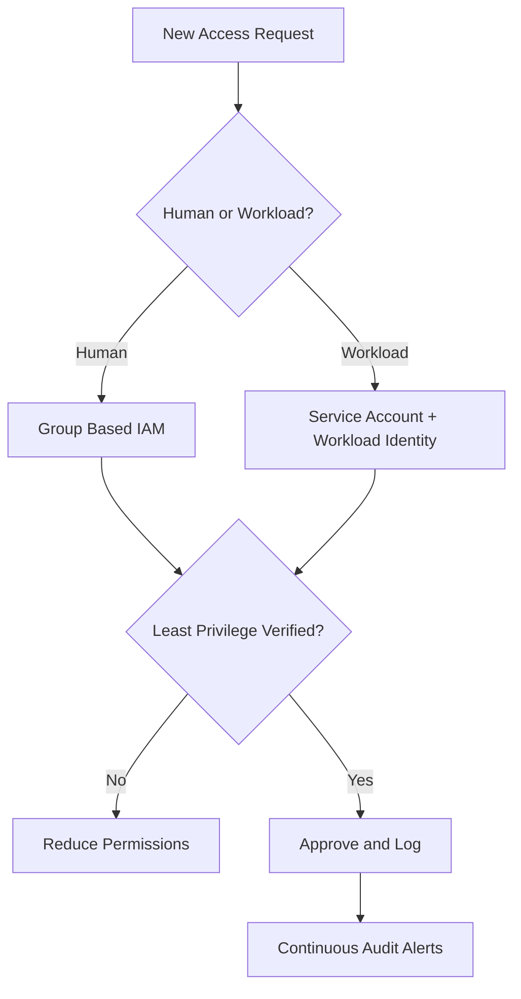
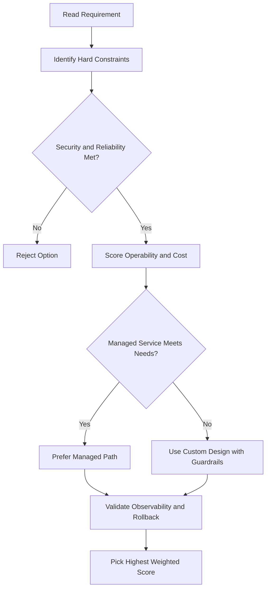
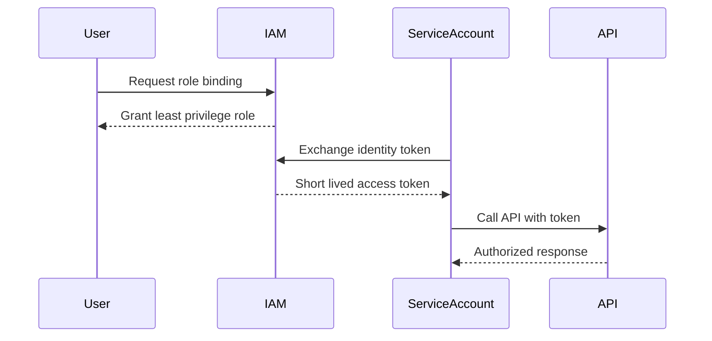

# IAM — Organization Node and Folders

## The Organization Node

The **organization resource** is the root node in the Google Cloud resource hierarchy — it represents your entire company.

### Key Roles at the Organization Level

| Role                   | What it does                                                                 |
| ---------------------- | ---------------------------------------------------------------------------- |
| **Organization Admin** | Full access to administer all resources in the org (useful for auditing)     |
| **Project Creator**    | Allows creating projects within the org (inherited by all projects below it) |
| **Viewer**             | Read-only view access to all resources within the organization               |

---

## How the Organization Resource Gets Created

- When a user with a **Google Workspace** or **Cloud Identity** account creates a Google Cloud project, an organization resource is **automatically provisioned**.
- Google Cloud then notifies the **Google Workspace / Cloud Identity super admins** of its availability.

> Super admin accounts have a lot of control — use them carefully.

---

## Two Critical Roles During Setup

These two roles are typically assigned to **different users or groups**:

### Google Workspace / Cloud Identity Super Admin

- Assigns the Organization Admin role to users
- Acts as point of contact for recovery issues
- Controls the lifecycle of the Workspace/Cloud Identity account and organization resource

### Organization Admin

- Defines IAM policies
- Determines the structure of the resource hierarchy
- Delegates responsibility for networking, billing, and hierarchy through IAM roles

> **Principle of Least Privilege:** The Organization Admin role does NOT include permissions like creating folders. Those must be explicitly added.

---

## Folders — Sub-Organizations Within the Org

Folders provide **grouping and isolation** between projects. They can model:

- Legal entities
- Departments
- Teams
- Applications

### Example Structure

```
Organization
├── Department X
│   ├── Team A
│   │   ├── Product 1
│   │   └── Product 2
│   └── Team B
└── Department Y
```

### Why Folders Matter

- **Delegation:** Department heads can be granted full ownership of all resources in their folder.
- **Access isolation:** Users in one department can be restricted to only their folder's resources.

### Folder-Level Roles

| Role               | What it does                               |
| ------------------ | ------------------------------------------ |
| **Folder Admin**   | Full control over folders                  |
| **Folder Creator** | Browse hierarchy and create folders        |
| **Folder Viewer**  | View folders and projects below a resource |

---

## Project-Level Roles

| Role                | What it does                                                 |
| ------------------- | ------------------------------------------------------------ |
| **Project Creator** | Create new projects; creator automatically becomes the owner |
| **Project Deleter** | Delete projects                                              |

---

## Key Inheritance Rule

> Policies are inherited **top to bottom** — roles granted at the organization level flow down to folders, projects, and individual resources.

---

## gcloud Commands

```bash
# List organizations
gcloud organizations list

# Grant a role at the org level
gcloud organizations add-iam-policy-binding ORG_ID \
  --member=user:admin@example.com --role=roles/resourcemanager.organizationAdmin

# Create a folder
gcloud resource-manager folders create \
  --display-name=FOLDER_NAME --organization=ORG_ID

# List folders under an org
gcloud resource-manager folders list --organization=ORG_ID

# Delete a folder
gcloud resource-manager folders delete FOLDER_ID

# Create a project
gcloud projects create PROJECT_ID --folder=FOLDER_ID

# Delete a project
gcloud projects delete PROJECT_ID
```

## ACE Exam-Style Practice Questions

### Q1
In a Iam Organization And Folders scenario, two answers seem technically possible. What tie-breaker should you apply first?

A. Pick the option with most manual steps
B. Pick the option with least privilege and least operational overhead that still meets requirements
C. Pick highest-cost option
D. Pick the oldest product

Answer: B
Trap: ACE-style scenarios reward secure, managed, requirement-fit decisions.

### Q2
For Iam Organization And Folders, what is the best way to reduce wrong answers in multi-choice questions?

A. Ignore scaling and security words
B. Identify trigger words, eliminate over-privileged choices, then choose the managed fit
C. Always pick Compute Engine
D. Always pick the shortest option

Answer: B
Trap: Structured elimination is more reliable than memorization alone.

<!-- ACE_DEEP_ENRICHMENT_START -->
## ACE Deep Enrichment

### Think Like a Google Engineer
- Primary optimization axis: Security posture and blast-radius minimization.
- Start with constraints first: SLO, security, compliance, latency, budget, and team operations capacity.
- Prefer managed services if they satisfy requirements with lower long-term operational toil.
- Minimize blast radius using environment isolation, least privilege, and failure-domain awareness.
- Design for day-2 operations: observability, rollback strategy, and quota or budget guardrails.

### Most Correct Option Filter (60 Seconds)
1. Eliminate options with broad access, single points of failure, or missing monitoring.
2. Confirm the option meets non-negotiables first: security and reliability requirements.
3. Compare remaining options on operational simplicity and long-term maintainability.
4. Use cost as an optimizer only after requirements and risk controls are satisfied.

### Weighted Decision Matrix
| Dimension | Weight | Strong Signal |
| --- | --- | --- |
| Security | 3 | Least privilege, secure defaults, no exposed blast radius |
| Reliability | 3 | Multi-zone or HA design, health checks, tested recovery path |
| Operability | 2 | Clear monitoring, alerting, rollout and rollback simplicity |
| Cost Efficiency | 2 | Right-sized resources, no waste, no reliability regression |
| Performance | 1 | Meets latency and throughput targets with headroom |

### Real-Life Scenario
A fintech team is onboarding 40 engineers and 12 workloads in one quarter. They need strict access boundaries, auditability, and zero long-lived credentials while still shipping features fast.

### Worked Example
- Create separate projects for dev, staging, and prod so IAM and quotas are isolated.
- Map users to Google Groups and grant predefined roles at the narrowest scope.
- Use service accounts for workloads and rotate to short-lived credentials through Workload Identity.
- Enable audit logs and alert on policy changes and service account key creation.

### Flowchart


### Optimization Decision Flow


### Interaction Sequence


### Extra Exam Practice (10 Questions)
#### Q1
Scenario Focus: IAM — Organization Node and Folders
Your team must grant temporary production access for incident response. Which approach is best?

A. Grant a time-bound least-privilege role through group membership and audit the binding.
B. Grant Owner role temporarily and remove it manually later.
C. Share one administrator account for faster troubleshooting.
D. Store service account keys in a shared drive because it is internal.

Answer: A
Why the other options are weaker: They typically ignore at least one hard constraint such as security, reliability, cost efficiency, or operational simplicity.
Google-engineer check: Reconfirm SLO fit, blast radius, and day-2 maintainability before finalizing.

#### Q2
Scenario Focus: IAM — Organization Node and Folders
A workload is still using a JSON key file in source control. What is the best fix?

A. Share one administrator account for faster troubleshooting.
B. Move to service account impersonation or Workload Identity and disable long-lived keys.
C. Store service account keys in a shared drive because it is internal.
D. Apply organization-level broad roles so future access requests are avoided.

Answer: B
Why the other options are weaker: They typically ignore at least one hard constraint such as security, reliability, cost efficiency, or operational simplicity.
Google-engineer check: Reconfirm SLO fit, blast radius, and day-2 maintainability before finalizing.

#### Q3
Scenario Focus: IAM — Organization Node and Folders
Which setup best reduces blast radius across environments?

A. Store service account keys in a shared drive because it is internal.
B. Apply organization-level broad roles so future access requests are avoided.
C. Use separate projects per environment with narrow IAM bindings at project or resource level.
D. Skip audit logs to reduce logging costs during non-peak hours.

Answer: C
Why the other options are weaker: They typically ignore at least one hard constraint such as security, reliability, cost efficiency, or operational simplicity.
Google-engineer check: Reconfirm SLO fit, blast radius, and day-2 maintainability before finalizing.

#### Q4
Scenario Focus: IAM — Organization Node and Folders
What should you monitor first for IAM abuse detection?

A. Apply organization-level broad roles so future access requests are avoided.
B. Skip audit logs to reduce logging costs during non-peak hours.
C. Grant Owner role temporarily and remove it manually later.
D. Alert on IAM policy changes, service account key creation, and high-risk privilege grants.

Answer: D
Why the other options are weaker: They typically ignore at least one hard constraint such as security, reliability, cost efficiency, or operational simplicity.
Google-engineer check: Reconfirm SLO fit, blast radius, and day-2 maintainability before finalizing.

#### Q5
Scenario Focus: IAM — Organization Node and Folders
A developer needs read-only billing visibility. Which decision is best?

A. Assign a billing viewer role at the required scope instead of broad project editor access.
B. Skip audit logs to reduce logging costs during non-peak hours.
C. Grant Owner role temporarily and remove it manually later.
D. Share one administrator account for faster troubleshooting.

Answer: A
Why the other options are weaker: They typically ignore at least one hard constraint such as security, reliability, cost efficiency, or operational simplicity.
Google-engineer check: Reconfirm SLO fit, blast radius, and day-2 maintainability before finalizing.

#### Q6
Scenario Focus: IAM — Organization Node and Folders
Two designs both satisfy the happy path for IAM — Organization Node and Folders. Which choice is most correct?

A. Grant Owner role temporarily and remove it manually later.
B. Choose the option that preserves reliability and security while reducing operational burden.
C. Share one administrator account for faster troubleshooting.
D. Store service account keys in a shared drive because it is internal.

Answer: B
Why the other options are weaker: They typically ignore at least one hard constraint such as security, reliability, cost efficiency, or operational simplicity.
Google-engineer check: Reconfirm SLO fit, blast radius, and day-2 maintainability before finalizing.

#### Q7
Scenario Focus: IAM — Organization Node and Folders
What should you validate first before choosing an architecture for IAM — Organization Node and Folders?

A. Share one administrator account for faster troubleshooting.
B. Store service account keys in a shared drive because it is internal.
C. Validate SLO fit, blast radius, and least-privilege controls before comparing convenience.
D. Apply organization-level broad roles so future access requests are avoided.

Answer: C
Why the other options are weaker: They typically ignore at least one hard constraint such as security, reliability, cost efficiency, or operational simplicity.
Google-engineer check: Reconfirm SLO fit, blast radius, and day-2 maintainability before finalizing.

#### Q8
Scenario Focus: IAM — Organization Node and Folders
A proposal lowers cost but increases failure risk. What is the best decision?

A. Store service account keys in a shared drive because it is internal.
B. Apply organization-level broad roles so future access requests are avoided.
C. Skip audit logs to reduce logging costs during non-peak hours.
D. Reject it unless reliability and recovery objectives remain within required targets.

Answer: D
Why the other options are weaker: They typically ignore at least one hard constraint such as security, reliability, cost efficiency, or operational simplicity.
Google-engineer check: Reconfirm SLO fit, blast radius, and day-2 maintainability before finalizing.

#### Q9
Scenario Focus: IAM — Organization Node and Folders
Which option best reflects optimization for Security posture and blast-radius minimization?

A. Select the design that best meets Security posture and blast-radius minimization while keeping constraints balanced.
B. Apply organization-level broad roles so future access requests are avoided.
C. Skip audit logs to reduce logging costs during non-peak hours.
D. Grant Owner role temporarily and remove it manually later.

Answer: A
Why the other options are weaker: They typically ignore at least one hard constraint such as security, reliability, cost efficiency, or operational simplicity.
Google-engineer check: Reconfirm SLO fit, blast radius, and day-2 maintainability before finalizing.

#### Q10
Scenario Focus: IAM — Organization Node and Folders
How should you evaluate a design that needs frequent manual interventions?

A. Skip audit logs to reduce logging costs during non-peak hours.
B. Treat it as high risk and prefer automation-friendly designs with observability and rollback.
C. Grant Owner role temporarily and remove it manually later.
D. Share one administrator account for faster troubleshooting.

Answer: B
Why the other options are weaker: They typically ignore at least one hard constraint such as security, reliability, cost efficiency, or operational simplicity.
Google-engineer check: Reconfirm SLO fit, blast radius, and day-2 maintainability before finalizing.

### Quick Commands
```bash
gcloud projects get-iam-policy PROJECT_ID
gcloud projects add-iam-policy-binding PROJECT_ID --member=group:team@example.com --role=roles/viewer
gcloud iam service-accounts list --project=PROJECT_ID
gcloud logging read "protoPayload.methodName=\"SetIamPolicy\"" --freshness=7d --project=PROJECT_ID --limit=20
```

### Fast Recall
- Least privilege beats convenience in all exam scenarios.
- Prefer groups for humans and service accounts for workloads.
- Avoid long-lived keys whenever possible.
<!-- ACE_DEEP_ENRICHMENT_END -->