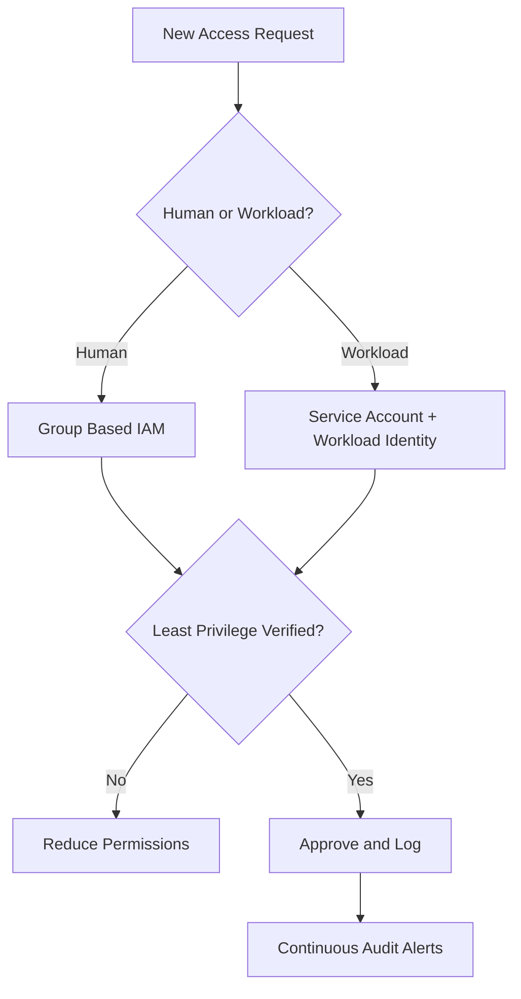
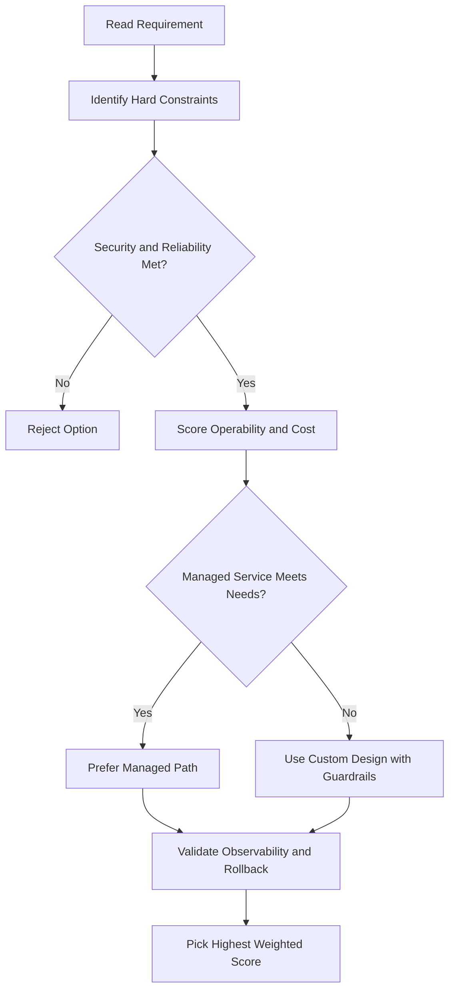
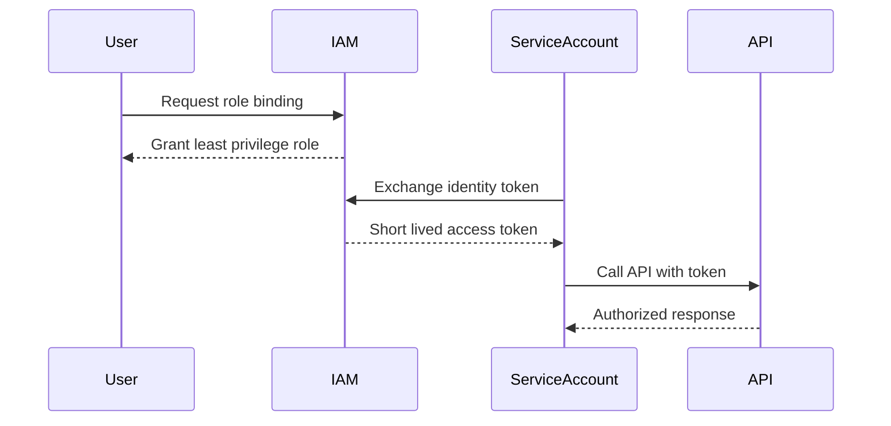

# IAM — Service Accounts

## What is a Service Account?

A service account is an account that belongs to an **application**, not an individual user. It provides an identity for service-to-service interactions without requiring user credentials.

**Example:** An app that reads from Cloud Storage authenticates using a service account — no secret keys embedded in code.

Service accounts are identified by an **email address** (e.g. `PROJECT_NUMBER-compute@developer.gserviceaccount.com`).

### Service Account Limits

- Each new project automatically gets **1 Compute Engine** and **1 App Engine** service account
- You can create up to **98 additional** service accounts per project (100 total)

---

## Three Types of Service Accounts

| Type                                  | Description                                                                                                         |
| ------------------------------------- | ------------------------------------------------------------------------------------------------------------------- |
| **User-created (Custom)**             | Created manually; most flexible; requires more management                                                           |
| **Built-in (Compute Engine default)** | Auto-created per project; auto-granted Editor role; email: `PROJECT_NUMBER-compute@developer.gserviceaccount.com`   |
| **Google APIs service account**       | Runs internal Google processes; email: `PROJECT_NUMBER@cloudservices.gserviceaccount.com`; auto-granted Editor role |

> When you start a new instance with `gcloud`, the default service account is enabled automatically. You can override this with a custom service account or disable it entirely.

---

## User-Managed vs Google-Managed Service Accounts

### User-Managed Service Accounts

These are accounts you create and manage. Two are also auto-created by Google but still fall under your project:

- **Compute Engine default service account** — created automatically when Compute Engine API is enabled
  - Email: `PROJECT_NUMBER-compute@developer.gserviceaccount.com`
- **App Engine default service account** — created automatically if your project has an App Engine app
  - Email: `PROJECT_ID@appspot.gserviceaccount.com`

### Google-Managed Service Accounts

Created and owned by Google to run internal Google processes on your behalf.

- **Google APIs service account**
  - Email: `PROJECT_NUMBER@cloudservices.gserviceaccount.com`
  - Not listed in the **Service Accounts** section of the console — only visible under **IAM**
  - Automatically granted the **project Editor** role
  - Only deleted when the project itself is deleted

> Do not remove or change the Google APIs service account's role — Google services depend on it having access to your project.

---

## Custom Service Accounts

- Create as many as needed — one per microservice is a common pattern
- Assign specific IAM roles or access scopes
- Assign to any VM at creation time
- More flexible than the default account, but you manage them yourself

---

## Authorization: Scopes vs. IAM Roles

### Scopes (legacy)

- The old way of granting permissions to service accounts
- Still visible on VMs using the default service account
- Can be changed only when the VM is **stopped**
- **Access token example:**
  - App A → read-only scope → can only read from Cloud Storage
  - App B → read-write scope → can read and modify Cloud Storage

> For user-created service accounts, use **IAM roles** instead of scopes.

---

## Service Account: Identity vs Resource

A service account plays **two roles** in IAM:

### As an Identity

The service account authenticates to Google Cloud services on behalf of your app or VM.

**Example:** A Compute Engine VM runs as a service account → you grant that service account the `editor` role on a project → the VM can act as an editor.

### As a Resource

A service account can itself be a resource that you grant other users access to.

**Example:** You want to control who can start a VM that runs as a service account:

- Grant the user the **`serviceAccountUser`** role on the service account (the resource)
- This lets the user start/use the VM, but only with the service account's permissions

**Full example flow:**

1. Create a service account with the `InstanceAdmin` role (create/modify/delete VMs)
2. Grant specific users the **Service Account User** role on that service account
3. Those users can now act as the service account — gaining all its permissions

> Be cautious when granting the **Service Account User** role — it gives access to everything the service account can do.

---

## Scoping Permissions with Service Accounts

You can slice a project into isolated microservices:

- VMs running `component_1` → Service Account 1 → Editor access on `project_b`
- VMs running `component_2` → Service Account 2 → `objectViewer` access on `bucket_1`

This way you don't need to recreate VMs to change their permissions — just update the service account's IAM bindings.

---

## Service Account Key Types

| Type                        | Who manages | Private key access                         | Key rotation                  |
| --------------------------- | ----------- | ------------------------------------------ | ----------------------------- |
| **Google-managed**          | Google      | Never directly accessible                  | Automatic (every 2 weeks max) |
| **User-managed (external)** | You         | You hold it; Google only stores public key | Manual or programmatic        |

- Up to **10 user-managed keys** per service account (to support rotation)
- If you lose a user-managed private key, **Google cannot recover it**
- Managed via IAM API, `gcloud`, or the Console

> User-managed keys should be a **last resort**. Prefer short-lived credentials (tokens) or service account impersonation.

---

## gcloud Commands

```bash
# List all service accounts in a project
gcloud iam service-accounts list

# Create a service account
gcloud iam service-accounts create my-sa \
  --display-name="My Service Account"

# Grant a role to a service account
gcloud projects add-iam-policy-binding PROJECT_ID \
  --member=serviceAccount:my-sa@PROJECT_ID.iam.gserviceaccount.com \
  --role=roles/storage.objectViewer

# Grant a user the Service Account User role
gcloud iam service-accounts add-iam-policy-binding my-sa@PROJECT_ID.iam.gserviceaccount.com \
  --member=user:alice@example.com --role=roles/iam.serviceAccountUser

# List keys for a service account
gcloud iam service-accounts keys list \
  --iam-account=my-sa@PROJECT_ID.iam.gserviceaccount.com

# Create a user-managed key (download to file)
gcloud iam service-accounts keys create key.json \
  --iam-account=my-sa@PROJECT_ID.iam.gserviceaccount.com

# Delete a service account
gcloud iam service-accounts delete my-sa@PROJECT_ID.iam.gserviceaccount.com
```

---

## Service Account Impersonation

Allows a user or another service account to **act as** a service account temporarily — generating short-lived tokens without downloading a key file:

```bash
# Generate a short-lived token for a service account
gcloud auth print-access-token \
  --impersonate-service-account=my-sa@PROJECT_ID.iam.gserviceaccount.com

# Run gcloud commands as a service account
gcloud storage ls --impersonate-service-account=my-sa@PROJECT_ID.iam.gserviceaccount.com
```

- Requires `roles/iam.serviceAccountTokenCreator` on the target service account
- Tokens expire after 1 hour by default (max 12 hours)
- **Preferred over key files** — no long-lived credentials to leak or rotate

---

## Workload Identity Federation

Allows **external workloads** (AWS, Azure, GitHub Actions, on-premises) to authenticate to GCP without a service account key:

- External identity (e.g. AWS IAM role, GitHub Actions OIDC token) is exchanged for a short-lived GCP token
- Works by configuring a **Workload Identity Pool** and **Provider**
- Eliminates the need for downloaded key files entirely for external systems

```bash
# Create a Workload Identity Pool
gcloud iam workload-identity-pools create my-pool \
  --location=global \
  --display-name="My Pool"

# Add a GitHub Actions OIDC provider
gcloud iam workload-identity-pools providers create-oidc github-provider \
  --workload-identity-pool=my-pool \
  --location=global \
  --issuer-uri=https://token.actions.githubusercontent.com \
  --attribute-mapping="google.subject=assertion.sub"
```

---

## Key Management Best Practices

| Practice                                | Reason                                               |
| --------------------------------------- | ---------------------------------------------------- |
| **Prefer no keys**                      | Use Workload Identity, impersonation, or ADC instead |
| **Rotate regularly**                    | If you must use keys, rotate at least every 90 days  |
| **Never commit keys to source control** | Use `.gitignore`; scan repos with Secret Manager     |
| **Delete unused keys**                  | Each SA can have max 10 keys — clean up old ones     |
| **Use short-lived tokens**              | `gcloud auth print-access-token` for automation      |

---

## Application Default Credentials (ADC)

The GCP client libraries automatically find credentials in this priority order:

1. `GOOGLE_APPLICATION_CREDENTIALS` environment variable (path to key file)
2. `gcloud auth application-default login` credentials (local dev)
3. Attached service account (on GCE/GKE/Cloud Run — no config needed)

```bash
# Set up ADC for local development
gcloud auth application-default login
```

- In production (VMs, GKE, Cloud Run): the **attached service account** is used automatically — no key file needed

## ACE Exam-Style Practice Questions

### Q1
A Iam Service Accounts workload on one VM must access one Cloud Storage bucket, but other VMs must not. What is best?

A. Use default Compute Engine service account for all VMs
B. Create dedicated service account for that VM and grant bucket-level role
C. Grant project Editor to all VMs
D. Use one shared user password

Answer: B
Trap: Default Compute Engine service account is often shared across instances in a project.

### Q2
A partner project needs access to your BigQuery dataset in a Iam Service Accounts scenario. What should you do?

A. Create partner identity in your project and grant Owner
B. Ask partner to create service account in their project and grant that SA access to your dataset
C. Share personal account credential
D. Disable IAM and use ACL only

Answer: B
Trap: Cross-project workload identity should remain owned by the consuming project.

<!-- ACE_DEEP_ENRICHMENT_START -->
## ACE Deep Enrichment

### Think Like a Google Engineer
- Primary optimization axis: Security posture and blast-radius minimization.
- Start with constraints first: SLO, security, compliance, latency, budget, and team operations capacity.
- Prefer managed services if they satisfy requirements with lower long-term operational toil.
- Minimize blast radius using environment isolation, least privilege, and failure-domain awareness.
- Design for day-2 operations: observability, rollback strategy, and quota or budget guardrails.

### Most Correct Option Filter (60 Seconds)
1. Eliminate options with broad access, single points of failure, or missing monitoring.
2. Confirm the option meets non-negotiables first: security and reliability requirements.
3. Compare remaining options on operational simplicity and long-term maintainability.
4. Use cost as an optimizer only after requirements and risk controls are satisfied.

### Weighted Decision Matrix
| Dimension | Weight | Strong Signal |
| --- | --- | --- |
| Security | 3 | Least privilege, secure defaults, no exposed blast radius |
| Reliability | 3 | Multi-zone or HA design, health checks, tested recovery path |
| Operability | 2 | Clear monitoring, alerting, rollout and rollback simplicity |
| Cost Efficiency | 2 | Right-sized resources, no waste, no reliability regression |
| Performance | 1 | Meets latency and throughput targets with headroom |

### Real-Life Scenario
A fintech team is onboarding 40 engineers and 12 workloads in one quarter. They need strict access boundaries, auditability, and zero long-lived credentials while still shipping features fast.

### Worked Example
- Create separate projects for dev, staging, and prod so IAM and quotas are isolated.
- Map users to Google Groups and grant predefined roles at the narrowest scope.
- Use service accounts for workloads and rotate to short-lived credentials through Workload Identity.
- Enable audit logs and alert on policy changes and service account key creation.

### Flowchart


### Optimization Decision Flow


### Interaction Sequence


### Extra Exam Practice (10 Questions)
#### Q1
Scenario Focus: IAM — Service Accounts
Your team must grant temporary production access for incident response. Which approach is best?

A. Grant a time-bound least-privilege role through group membership and audit the binding.
B. Grant Owner role temporarily and remove it manually later.
C. Share one administrator account for faster troubleshooting.
D. Store service account keys in a shared drive because it is internal.

Answer: A
Why the other options are weaker: They typically ignore at least one hard constraint such as security, reliability, cost efficiency, or operational simplicity.
Google-engineer check: Reconfirm SLO fit, blast radius, and day-2 maintainability before finalizing.

#### Q2
Scenario Focus: IAM — Service Accounts
A workload is still using a JSON key file in source control. What is the best fix?

A. Share one administrator account for faster troubleshooting.
B. Move to service account impersonation or Workload Identity and disable long-lived keys.
C. Store service account keys in a shared drive because it is internal.
D. Apply organization-level broad roles so future access requests are avoided.

Answer: B
Why the other options are weaker: They typically ignore at least one hard constraint such as security, reliability, cost efficiency, or operational simplicity.
Google-engineer check: Reconfirm SLO fit, blast radius, and day-2 maintainability before finalizing.

#### Q3
Scenario Focus: IAM — Service Accounts
Which setup best reduces blast radius across environments?

A. Store service account keys in a shared drive because it is internal.
B. Apply organization-level broad roles so future access requests are avoided.
C. Use separate projects per environment with narrow IAM bindings at project or resource level.
D. Skip audit logs to reduce logging costs during non-peak hours.

Answer: C
Why the other options are weaker: They typically ignore at least one hard constraint such as security, reliability, cost efficiency, or operational simplicity.
Google-engineer check: Reconfirm SLO fit, blast radius, and day-2 maintainability before finalizing.

#### Q4
Scenario Focus: IAM — Service Accounts
What should you monitor first for IAM abuse detection?

A. Apply organization-level broad roles so future access requests are avoided.
B. Skip audit logs to reduce logging costs during non-peak hours.
C. Grant Owner role temporarily and remove it manually later.
D. Alert on IAM policy changes, service account key creation, and high-risk privilege grants.

Answer: D
Why the other options are weaker: They typically ignore at least one hard constraint such as security, reliability, cost efficiency, or operational simplicity.
Google-engineer check: Reconfirm SLO fit, blast radius, and day-2 maintainability before finalizing.

#### Q5
Scenario Focus: IAM — Service Accounts
A developer needs read-only billing visibility. Which decision is best?

A. Assign a billing viewer role at the required scope instead of broad project editor access.
B. Skip audit logs to reduce logging costs during non-peak hours.
C. Grant Owner role temporarily and remove it manually later.
D. Share one administrator account for faster troubleshooting.

Answer: A
Why the other options are weaker: They typically ignore at least one hard constraint such as security, reliability, cost efficiency, or operational simplicity.
Google-engineer check: Reconfirm SLO fit, blast radius, and day-2 maintainability before finalizing.

#### Q6
Scenario Focus: IAM — Service Accounts
Two designs both satisfy the happy path for IAM — Service Accounts. Which choice is most correct?

A. Grant Owner role temporarily and remove it manually later.
B. Choose the option that preserves reliability and security while reducing operational burden.
C. Share one administrator account for faster troubleshooting.
D. Store service account keys in a shared drive because it is internal.

Answer: B
Why the other options are weaker: They typically ignore at least one hard constraint such as security, reliability, cost efficiency, or operational simplicity.
Google-engineer check: Reconfirm SLO fit, blast radius, and day-2 maintainability before finalizing.

#### Q7
Scenario Focus: IAM — Service Accounts
What should you validate first before choosing an architecture for IAM — Service Accounts?

A. Share one administrator account for faster troubleshooting.
B. Store service account keys in a shared drive because it is internal.
C. Validate SLO fit, blast radius, and least-privilege controls before comparing convenience.
D. Apply organization-level broad roles so future access requests are avoided.

Answer: C
Why the other options are weaker: They typically ignore at least one hard constraint such as security, reliability, cost efficiency, or operational simplicity.
Google-engineer check: Reconfirm SLO fit, blast radius, and day-2 maintainability before finalizing.

#### Q8
Scenario Focus: IAM — Service Accounts
A proposal lowers cost but increases failure risk. What is the best decision?

A. Store service account keys in a shared drive because it is internal.
B. Apply organization-level broad roles so future access requests are avoided.
C. Skip audit logs to reduce logging costs during non-peak hours.
D. Reject it unless reliability and recovery objectives remain within required targets.

Answer: D
Why the other options are weaker: They typically ignore at least one hard constraint such as security, reliability, cost efficiency, or operational simplicity.
Google-engineer check: Reconfirm SLO fit, blast radius, and day-2 maintainability before finalizing.

#### Q9
Scenario Focus: IAM — Service Accounts
Which option best reflects optimization for Security posture and blast-radius minimization?

A. Select the design that best meets Security posture and blast-radius minimization while keeping constraints balanced.
B. Apply organization-level broad roles so future access requests are avoided.
C. Skip audit logs to reduce logging costs during non-peak hours.
D. Grant Owner role temporarily and remove it manually later.

Answer: A
Why the other options are weaker: They typically ignore at least one hard constraint such as security, reliability, cost efficiency, or operational simplicity.
Google-engineer check: Reconfirm SLO fit, blast radius, and day-2 maintainability before finalizing.

#### Q10
Scenario Focus: IAM — Service Accounts
How should you evaluate a design that needs frequent manual interventions?

A. Skip audit logs to reduce logging costs during non-peak hours.
B. Treat it as high risk and prefer automation-friendly designs with observability and rollback.
C. Grant Owner role temporarily and remove it manually later.
D. Share one administrator account for faster troubleshooting.

Answer: B
Why the other options are weaker: They typically ignore at least one hard constraint such as security, reliability, cost efficiency, or operational simplicity.
Google-engineer check: Reconfirm SLO fit, blast radius, and day-2 maintainability before finalizing.

### Quick Commands
```bash
gcloud projects get-iam-policy PROJECT_ID
gcloud projects add-iam-policy-binding PROJECT_ID --member=group:team@example.com --role=roles/viewer
gcloud iam service-accounts list --project=PROJECT_ID
gcloud logging read "protoPayload.methodName=\"SetIamPolicy\"" --freshness=7d --project=PROJECT_ID --limit=20
```

### Fast Recall
- Least privilege beats convenience in all exam scenarios.
- Prefer groups for humans and service accounts for workloads.
- Avoid long-lived keys whenever possible.
<!-- ACE_DEEP_ENRICHMENT_END -->